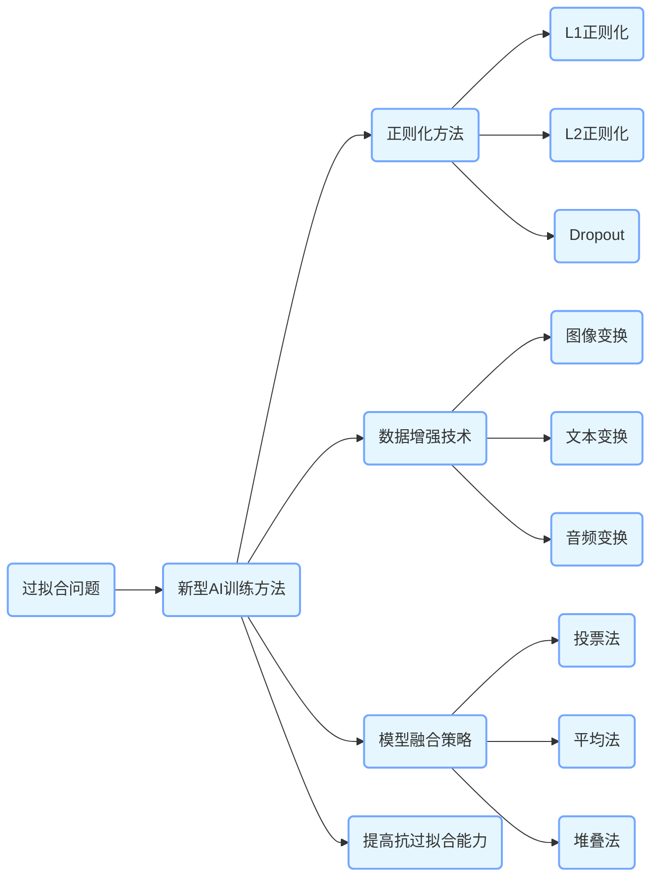

# 比较新型AI训练方法的抗过拟合能力

> 关键词：新型AI训练方法、抗过拟合能力、深度学习、机器学习、正则化、数据增强、模型融合

> 摘要：本文旨在深入比较新型AI训练方法的抗过拟合能力。过拟合是AI训练过程中常见且影响模型性能的关键问题，新型训练方法不断涌现，其抗过拟合的效果和原理各有不同。文章将先介绍背景知识，包括目的、预期读者等内容；接着阐述核心概念与联系，给出相关原理和架构示意图；然后详细讲解核心算法原理、数学模型和公式；通过项目实战展示代码案例并分析；探讨实际应用场景；推荐相关工具和资源；最后总结未来发展趋势与挑战，解答常见问题并提供参考资料，帮助读者全面了解新型AI训练方法的抗过拟合能力。

## 1. 背景介绍 
### 1.1 目的和范围
在人工智能领域，模型的训练效果至关重要。过拟合现象会导致模型在训练数据上表现出色，但在未知数据上的泛化能力极差，使得模型无法真正应用于实际场景。新型AI训练方法不断发展，其核心目标之一就是提高模型的抗过拟合能力。本文的目的在于对这些新型训练方法的抗过拟合能力进行全面、深入的比较，分析其优势和局限性。范围涵盖常见的深度学习和机器学习中的新型训练策略，如正则化方法的改进、数据增强技术的创新、模型融合的新方式等。

### 1.2 预期读者
本文预期读者包括人工智能领域的研究人员、工程师、学生以及对AI技术感兴趣的爱好者。研究人员可以通过本文了解新型训练方法的最新进展和抗过拟合效果，为进一步的研究提供参考；工程师能够从中获取实用的技术和策略，优化自己的模型训练过程；学生可以作为学习资料，加深对AI训练和过拟合问题的理解；爱好者则可以对AI训练方法的抗过拟合有一个较为全面的认识。

### 1.3 文档结构概述
本文首先介绍背景知识，让读者对研究的目的和范围有清晰的了解。接着阐述核心概念与联系，包括过拟合的原理、新型AI训练方法的基本概念等，并给出相应的示意图和流程图。然后详细讲解核心算法原理，用Python代码进行示例，同时介绍相关的数学模型和公式。通过项目实战，展示代码案例并进行详细的解读和分析。探讨实际应用场景，说明不同训练方法在不同场景下的抗过拟合表现。推荐相关的工具和资源，包括学习资源、开发工具框架和相关论文著作。最后总结未来发展趋势与挑战，解答常见问题并提供扩展阅读和参考资料。

### 1.4 术语表
#### 1.4.1 核心术语定义
- **过拟合（Overfitting）**：指模型在训练数据上表现良好，但在测试数据或新数据上表现不佳的现象。模型过度学习了训练数据中的噪声和细节，导致其泛化能力下降。
- **抗过拟合能力（Anti - overfitting ability）**：模型在训练过程中避免过拟合，能够在不同数据集上都保持较好性能的能力。
- **正则化（Regularization）**：通过在损失函数中添加额外的约束项，来限制模型的复杂度，从而防止过拟合的方法。
- **数据增强（Data Augmentation）**：通过对原始数据进行各种变换，生成新的训练数据，增加数据的多样性，提高模型的泛化能力。
- **模型融合（Model Ensemble）**：将多个不同的模型组合在一起，综合它们的预测结果，以提高模型的性能和抗过拟合能力。

#### 1.4.2 相关概念解释
- **泛化能力（Generalization Ability）**：模型能够对未见过的数据进行准确预测的能力。泛化能力强的模型在不同数据集上都能有较好的表现，而过拟合的模型泛化能力较差。
- **损失函数（Loss Function）**：用于衡量模型预测结果与真实标签之间的差异。训练模型的过程就是通过优化损失函数，使模型的预测结果尽可能接近真实标签。
- **超参数（Hyperparameters）**：在模型训练之前需要手动设置的参数，如学习率、正则化系数等。超参数的选择对模型的性能和抗过拟合能力有重要影响。

#### 1.4.3 缩略词列表
- **CNN（Convolutional Neural Network）**：卷积神经网络
- **RNN（Recurrent Neural Network）**：循环神经网络
- **LSTM（Long Short - Term Memory）**：长短期记忆网络
- **Dropout**：一种正则化技术，随机丢弃部分神经元。

## 2. 核心概念与联系 
### 过拟合的原理
过拟合的本质是模型的复杂度与数据的复杂度不匹配。当模型过于复杂，而训练数据有限时，模型会学习到训练数据中的噪声和异常值，将其当作普遍规律，从而在新数据上表现不佳。例如，在一个简单的线性回归问题中，如果使用一个高阶多项式模型进行拟合，模型可能会过度拟合训练数据的波动，而忽略了数据的整体趋势。

### 新型AI训练方法的核心概念
- **正则化方法**：通过添加正则化项来限制模型的复杂度。常见的正则化方法有L1正则化和L2正则化。L1正则化会使模型的部分参数变为0，从而实现特征选择；L2正则化会使模型的参数值变小，避免参数过大导致的过拟合。
- **数据增强技术**：通过对原始数据进行旋转、翻转、缩放等变换，生成新的训练数据。这样可以增加数据的多样性，使模型能够学习到更广泛的特征，提高泛化能力。例如，在图像分类任务中，对图像进行随机裁剪、旋转等操作，可以模拟不同的拍摄角度和环境。
- **模型融合策略**：将多个不同的模型组合在一起，综合它们的预测结果。由于不同模型的误差分布可能不同，通过模型融合可以降低整体误差，提高模型的稳定性和抗过拟合能力。常见的模型融合方法有投票法、平均法和堆叠法等。

### 核心概念的架构示意图


这个示意图展示了新型AI训练方法的主要组成部分，包括正则化方法、数据增强技术和模型融合策略，以及它们与过拟合问题和抗过拟合能力之间的关系。

## 3. 核心算法原理 & 具体操作步骤 
### 正则化方法
#### L1正则化
L1正则化是在损失函数中添加模型参数的绝对值之和作为正则化项。其损失函数的计算公式为：

$$L_{L1} = L + \lambda\sum_{i}|\theta_{i}|$$

其中，$L$ 是原始的损失函数，$\lambda$ 是正则化系数，$\theta_{i}$ 是模型的参数。

以下是一个使用Python和PyTorch实现L1正则化的示例代码：
```python
import torch
import torch.nn as nn
import torch.optim as optim

# 定义一个简单的线性回归模型
class LinearRegression(nn.Module):
    def __init__(self, input_size, output_size):
        super(LinearRegression, self).__init__()
        self.linear = nn.Linear(input_size, output_size)

    def forward(self, x):
        out = self.linear(x)
        return out

# 初始化模型
input_size = 1
output_size = 1
model = LinearRegression(input_size, output_size)

# 定义损失函数和优化器
criterion = nn.MSELoss()
optimizer = optim.SGD(model.parameters(), lr=0.01)

# 定义正则化系数
lambda_l1 = 0.001

# 训练模型
num_epochs = 100
for epoch in range(num_epochs):
    # 前向传播
    outputs = model(inputs)
    loss = criterion(outputs, labels)

    # 计算L1正则化项
    l1_reg = torch.tensor(0., requires_grad=True)
    for name, param in model.named_parameters():
        if 'weight' in name:
            l1_reg = l1_reg + torch.norm(param, 1)

    # 加上正则化项
    loss = loss + lambda_l1 * l1_reg

    # 反向传播和优化
    optimizer.zero_grad()
    loss.backward()
    optimizer.step()

    if (epoch + 1) % 10 == 0:
        print(f'Epoch [{epoch + 1}/{num_epochs}], Loss: {loss.item():.4f}')
```
#### L2正则化
L2正则化是在损失函数中添加模型参数的平方和作为正则化项。其损失函数的计算公式为：

$$L_{L2} = L + \lambda\sum_{i}\theta_{i}^{2}$$

以下是一个使用Python和PyTorch实现L2正则化的示例代码：
```python
import torch
import torch.nn as nn
import torch.optim as optim

# 定义一个简单的线性回归模型
class LinearRegression(nn.Module):
    def __init__(self, input_size, output_size):
        super(LinearRegression, self).__init__()
        self.linear = nn.Linear(input_size, output_size)

    def forward(self, x):
        out = self.linear(x)
        return out

# 初始化模型
input_size = 1
output_size = 1
model = LinearRegression(input_size, output_size)

# 定义损失函数和优化器，在优化器中设置weight_decay参数实现L2正则化
criterion = nn.MSELoss()
optimizer = optim.SGD(model.parameters(), lr=0.01, weight_decay=0.001)

# 训练模型
num_epochs = 100
for epoch in range(num_epochs):
    # 前向传播
    outputs = model(inputs)
    loss = criterion(outputs, labels)

    # 反向传播和优化
    optimizer.zero_grad()
    loss.backward()
    optimizer.step()

    if (epoch + 1) % 10 == 0:
        print(f'Epoch [{epoch + 1}/{num_epochs}], Loss: {loss.item():.4f}')
```
#### Dropout
Dropout是一种随机丢弃部分神经元的正则化方法。在训练过程中，以一定的概率随机将部分神经元的输出置为0，这样可以防止神经元之间的过度依赖，提高模型的泛化能力。

以下是一个使用Python和PyTorch实现Dropout的示例代码：
```python
import torch
import torch.nn as nn
import torch.optim as optim

# 定义一个包含Dropout的神经网络模型
class NeuralNetwork(nn.Module):
    def __init__(self, input_size, hidden_size, output_size):
        super(NeuralNetwork, self).__init__()
        self.fc1 = nn.Linear(input_size, hidden_size)
        self.dropout = nn.Dropout(p=0.5)
        self.fc2 = nn.Linear(hidden_size, output_size)

    def forward(self, x):
        out = torch.relu(self.fc1(x))
        out = self.dropout(out)
        out = self.fc2(out)
        return out

# 初始化模型
input_size = 10
hidden_size = 20
output_size = 1
model = NeuralNetwork(input_size, hidden_size, output_size)

# 定义损失函数和优化器
criterion = nn.MSELoss()
optimizer = optim.SGD(model.parameters(), lr=0.01)

# 训练模型
num_epochs = 100
for epoch in range(num_epochs):
    # 前向传播
    outputs = model(inputs)
    loss = criterion(outputs, labels)

    # 反向传播和优化
    optimizer.zero_grad()
    loss.backward()
    optimizer.step()

    if (epoch + 1) % 10 == 0:
        print(f'Epoch [{epoch + 1}/{num_epochs}], Loss: {loss.item():.4f}')
```
### 数据增强技术
#### 图像数据增强
在图像分类任务中，常见的图像数据增强方法包括随机裁剪、随机旋转、随机翻转等。以下是一个使用Python和torchvision库实现图像数据增强的示例代码：
```python
import torchvision.transforms as transforms
from PIL import Image

# 定义图像数据增强的变换
transform = transforms.Compose([
    transforms.RandomCrop(224),
    transforms.RandomHorizontalFlip(),
    transforms.RandomRotation(10),
    transforms.ToTensor()
])

# 加载图像
image = Image.open('image.jpg')

# 应用数据增强
augmented_image = transform(image)
```
#### 文本数据增强
文本数据增强的方法包括同义词替换、插入、删除等。以下是一个使用Python和nlpaug库实现文本数据增强的示例代码：
```python
import nlpaug.augmenter.word as naw

# 定义文本数据增强器
aug = naw.SynonymAug()

# 原始文本
text = 'This is a sample sentence.'

# 应用数据增强
augmented_text = aug.augment(text)
print(augmented_text)
```
#### 音频数据增强
音频数据增强的方法包括添加噪声、改变音调、改变语速等。以下是一个使用Python和librosa库实现音频数据增强的示例代码：
```python
import librosa
import numpy as np

# 加载音频文件
audio_path = 'audio.wav'
audio, sr = librosa.load(audio_path)

# 添加噪声
noise = np.random.normal(0, 0.01, audio.shape)
augmented_audio = audio + noise

# 保存增强后的音频
librosa.output.write_wav('augmented_audio.wav', augmented_audio, sr)
```
### 模型融合策略
#### 投票法
投票法是一种简单的模型融合方法，对于分类问题，根据多个模型的预测结果进行投票，选择得票最多的类别作为最终预测结果。以下是一个使用Python实现投票法的示例代码：
```python
from sklearn.ensemble import VotingClassifier
from sklearn.linear_model import LogisticRegression
from sklearn.tree import DecisionTreeClassifier
from sklearn.svm import SVC
from sklearn.datasets import make_classification
from sklearn.model_selection import train_test_split

# 生成数据集
X, y = make_classification(n_samples=1000, n_features=10, n_informative=5, n_redundant=0, random_state=42)
X_train, X_test, y_train, y_test = train_test_split(X, y, test_size=0.2, random_state=42)

# 定义多个模型
model1 = LogisticRegression()
model2 = DecisionTreeClassifier()
model3 = SVC()

# 定义投票分类器
voting_clf = VotingClassifier(estimators=[('lr', model1), ('dt', model2), ('svc', model3)], voting='hard')

# 训练投票分类器
voting_clf.fit(X_train, y_train)

# 预测
y_pred = voting_clf.predict(X_test)
```
#### 平均法
平均法适用于回归问题，将多个模型的预测结果进行平均，得到最终的预测结果。以下是一个使用Python实现平均法的示例代码：
```python
from sklearn.linear_model import LinearRegression
from sklearn.tree import DecisionTreeRegressor
from sklearn.ensemble import RandomForestRegressor
from sklearn.datasets import make_regression
from sklearn.model_selection import train_test_split

# 生成数据集
X, y = make_regression(n_samples=1000, n_features=10, n_informative=5, random_state=42)
X_train, X_test, y_train, y_test = train_test_split(X, y, test_size=0.2, random_state=42)

# 定义多个模型
model1 = LinearRegression()
model2 = DecisionTreeRegressor()
model3 = RandomForestRegressor()

# 训练模型
model1.fit(X_train, y_train)
model2.fit(X_train, y_train)
model3.fit(X_train, y_train)

# 预测
y_pred1 = model1.predict(X_test)
y_pred2 = model2.predict(X_test)
y_pred3 = model3.predict(X_test)

# 平均预测结果
y_pred = (y_pred1 + y_pred2 + y_pred3) / 3
```
#### 堆叠法
堆叠法是一种更复杂的模型融合方法，它将多个基模型的预测结果作为新的特征，再训练一个元模型来进行最终的预测。以下是一个使用Python实现堆叠法的示例代码：
```python
from sklearn.linear_model import LogisticRegression
from sklearn.tree import DecisionTreeClassifier
from sklearn.svm import SVC
from sklearn.datasets import make_classification
from sklearn.model_selection import train_test_split
from sklearn.model_selection import KFold
import numpy as np

# 生成数据集
X, y = make_classification(n_samples=1000, n_features=1