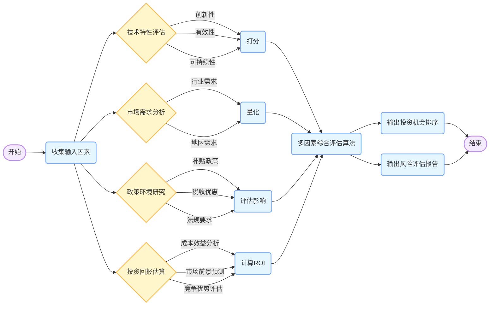

# 气候变化适应性技术的投资机会识别

> 关键词：气候变化适应性技术、投资机会识别、核心算法、数学模型、项目实战

> 摘要：本文围绕气候变化适应性技术的投资机会识别展开深入探讨。首先介绍了研究的背景，包括目的、预期读者、文档结构和相关术语。接着阐述了核心概念与联系，详细讲解了核心算法原理和具体操作步骤，运用 Python 代码进行说明。给出了相关的数学模型和公式，并举例说明。通过项目实战，从开发环境搭建到源代码实现和解读，全面展示了如何进行投资机会识别。分析了实际应用场景，推荐了学习资源、开发工具框架和相关论文著作。最后总结了未来发展趋势与挑战，解答常见问题，并提供扩展阅读和参考资料，旨在为投资者和相关从业者提供全面且深入的指导，以准确识别气候变化适应性技术领域的投资机会。

## 1. 背景介绍 
### 1.1 目的和范围
随着全球气候变化问题日益严峻，气候变化适应性技术的发展变得至关重要。本研究的目的在于识别气候变化适应性技术领域中的投资机会，帮助投资者在这个新兴且具有巨大潜力的领域做出明智的决策。研究范围涵盖了多种气候变化适应性技术，包括但不限于水资源管理技术、农业适应技术、城市气候适应技术等，同时分析这些技术在不同地区和行业的应用情况以及潜在的投资回报。

### 1.2 预期读者
本文的预期读者主要包括对气候变化适应性技术领域感兴趣的投资者，如风险投资家、私募股权投资者等；相关领域的企业管理者，他们需要了解行业动态以制定战略决策；科研人员，希望从投资角度为技术研发提供方向；以及政府部门工作人员，在制定政策时考虑投资对技术发展的推动作用。

### 1.3 文档结构概述
本文首先介绍了研究的背景信息，为后续内容奠定基础。接着阐述了核心概念与联系，让读者对气候变化适应性技术和投资机会识别有清晰的认识。详细讲解了核心算法原理和具体操作步骤，并给出数学模型和公式，使读者了解识别投资机会的理论依据。通过项目实战展示了如何在实际中应用这些理论和方法。分析了实际应用场景，为投资决策提供参考。推荐了相关的工具和资源，方便读者进一步学习和研究。最后总结了未来发展趋势与挑战，解答常见问题，并提供扩展阅读和参考资料。

### 1.4 术语表
#### 1.4.1 核心术语定义
- **气候变化适应性技术**：指为了应对气候变化带来的各种影响，如气温升高、降水模式改变、海平面上升等，而开发和应用的一系列技术。这些技术旨在提高人类社会、生态系统和经济活动对气候变化的适应能力。
- **投资机会识别**：通过对特定领域的市场、技术、政策等因素进行分析和评估，找出具有潜在投资价值的项目或技术的过程。
- **投资回报率（ROI）**：指通过投资而应返回的价值，即企业从一项投资活动中得到的经济回报。计算公式为：$ROI = \frac{投资收益 - 投资成本}{投资成本} \times 100\%$。

#### 1.4.2 相关概念解释
- **气候风险**：指气候变化可能对人类社会、经济和生态系统造成的不利影响，如自然灾害、农业减产、水资源短缺等。气候变化适应性技术的发展旨在降低这些气候风险。
- **技术成熟度**：衡量一项技术在实际应用中的可行性和稳定性的指标。通常分为不同的等级，从实验室研究阶段到大规模商业应用阶段。

#### 1.4.3 缩略词列表
- **ROI**：Return on Investment（投资回报率）
- **IPCC**：Intergovernmental Panel on Climate Change（政府间气候变化专门委员会）

## 2. 核心概念与联系 

### 核心概念原理
气候变化适应性技术投资机会识别的核心原理在于综合考虑多个因素，包括技术本身的特性、市场需求、政策环境和潜在的投资回报等。技术特性方面，需要评估技术的创新性、有效性和可持续性。创新性高的技术可能具有更大的市场潜力，但也伴随着更高的风险；有效性指技术能否切实解决气候变化带来的问题；可持续性则关注技术在长期应用中的资源消耗和环境影响。

市场需求是投资机会的重要驱动力。随着气候变化影响的加剧，社会对气候变化适应性技术的需求不断增加。例如，在水资源短缺地区，对高效节水技术和海水淡化技术的需求会显著上升。政策环境也起着关键作用，政府的补贴、税收优惠和法规要求等政策措施可以促进技术的推广和应用，降低投资风险。

潜在的投资回报是投资者最为关注的因素。通过对技术的市场前景、成本效益和竞争优势进行分析，可以估算出投资回报率。同时，还需要考虑投资的风险，如技术失败风险、市场竞争风险和政策变化风险等。

### 架构的文本示意图
```plaintext
气候变化适应性技术投资机会识别架构
|-- 输入因素
|   |-- 技术特性
|   |   |-- 创新性
|   |   |-- 有效性
|   |   |-- 可持续性
|   |-- 市场需求
|   |   |-- 行业需求
|   |   |-- 地区需求
|   |-- 政策环境
|   |   |-- 补贴政策
|   |   |-- 税收优惠
|   |   |-- 法规要求
|   |-- 投资回报
|   |   |-- 成本效益分析
|   |   |-- 市场前景预测
|   |   |-- 竞争优势评估
|-- 核心算法
|   |-- 多因素综合评估算法
|-- 输出结果
|   |-- 投资机会排序
|   |-- 风险评估报告
```

### Mermaid 流程图


## 3. 核心算法原理 & 具体操作步骤 

### 核心算法原理
我们采用多因素综合评估算法来识别气候变化适应性技术的投资机会。该算法的核心思想是将技术特性、市场需求、政策环境和投资回报等多个因素进行量化，并根据其重要性赋予不同的权重，然后通过加权求和的方式计算每个技术项目的综合得分，得分越高表示投资机会越大。

### 具体操作步骤

#### 步骤 1：数据收集
收集每个气候变化适应性技术项目的相关数据，包括技术特性指标（创新性、有效性、可持续性等）、市场需求数据（行业需求规模、地区需求增长率等）、政策环境信息（补贴金额、税收优惠比例等）和投资回报估算参数（成本、预期收益等）。

#### 步骤 2：指标量化
将收集到的定性和定量数据进行量化处理。例如，对于创新性指标，可以采用专家打分的方式，将创新性分为 1 - 10 分；对于市场需求数据，可以将其转换为标准化的数值。

#### 步骤 3：权重确定
根据不同因素对投资决策的重要性，确定每个因素的权重。可以采用层次分析法（AHP）等方法来确定权重。假设技术特性、市场需求、政策环境和投资回报的权重分别为 $w_1$、$w_2$、$w_3$ 和 $w_4$，且 $w_1 + w_2 + w_3 + w_4 = 1$。

#### 步骤 4：综合得分计算
对于每个技术项目，计算其综合得分 $S$：
$S = w_1 \times T + w_2 \times M + w_3 \times P + w_4 \times R$
其中，$T$ 为技术特性得分，$M$ 为市场需求得分，$P$ 为政策环境得分，$R$ 为投资回报得分。

#### 步骤 5：投资机会排序
根据综合得分对所有技术项目进行排序，得分越高的项目投资机会越大。

### Python 源代码实现
```python
import numpy as np

# 定义每个因素的权重
weights = np.array([0.2, 0.3, 0.2, 0.3])

# 假设有 3 个技术项目，每个项目的各项得分
tech_scores = np.array([
    [7, 8, 6],  # 技术特性得分（创新性、有效性、可持续性）
    [6, 7, 7],
    [8, 9, 7]
])

market_scores = np.array([
    [8, 7],  # 市场需求得分（行业需求、地区需求）
    [7, 6],
    [9, 8]
])

policy_scores = np.array([
    [7, 6, 7],  # 政策环境得分（补贴政策、税收优惠、法规要求）
    [6, 5, 6],
    [8, 7, 8]
])

return_scores = np.array([
    [8, 7],  # 投资回报得分（成本效益、市场前景）
    [7, 6],
    [9, 8]
])

# 计算每个因素的总得分
tech_total_scores = np.mean(tech_scores, axis=1)
market_total_scores = np.mean(market_scores, axis=1)
policy_total_scores = np.mean(policy_scores, axis=1)
return_total_scores = np.mean(return_scores, axis=1)

# 组合所有因素的得分
all_scores = np.array([tech_total_scores, market_total_scores, policy_total_scores, return_total_scores]).T

# 计算综合得分
composite_scores = np.dot(all_scores, weights)

# 对项目进行排序
sorted_indices = np.argsort(composite_scores)[::-1]

# 输出排序结果
for i, index in enumerate(sorted_indices):
    print(f"第 {i + 1} 名：项目 {index + 1}，综合得分：{composite_scores[index]}")
```

### 代码解释
- 首先，我们定义了每个因素的权重，这些权重可以根据实际情况进行调整。
- 然后，我们创建了每个技术项目的各项得分数组，包括技术特性、市场需求、政策环境和投资回报得分。
- 接着，我们计算每个因素的总得分，通过求平均值的方式将各项得分合并为一个总得分。
- 之后，我们将所有因素的总得分组合成一个二维数组，并使用 `np.dot` 函数计算综合得分。
- 最后，我们使用 `np.argsort` 函数对综合得分进行排序，并输出排序结果。

## 4. 数学模型和公式 & 详细讲解 & 举例说明 

### 数学模型和公式
#### 综合得分计算公式
$S = w_1 \times T + w_2 \times M + w_3 \times P + w_4 \times R$
其中：
- $S$ 为技术项目的综合得分。
- $w_1$、$w_2$、$w_3$ 和 $w_4$ 分别为技术特性、市场需求、政策环境和投资回报的权重，且 $w_1 + w_2 + w_3 + w_4 = 1$。
- $T$ 为技术特性得分，可进一步表示为 $T = \frac{1}{n_T} \sum_{i=1}^{n_T} T_i$，其中 $n_T$ 为技术特性指标的数量，$T_i$ 为第 $i$ 个技术特性指标的得分。
- $M$ 为市场需求得分，可表示为 $M = \frac{1}{n_M} \sum_{i=1}^{n_M} M_i$，其中 $n_M$ 为市场需求指标的数量，$M_i$ 为第 $i$ 个市场需求指标的得分。
- $P$ 为政策环境得分，可表示为 $P = \frac{1}{n_P} \sum_{i=1}^{n_P} P_i$，其中 $n_P$ 为政策环境指标的数量，$P_i$ 为第 $i$ 个政策环境指标的得分。
- $R$ 为投资回报得分，可表示为 $R = \frac{1}{n_R} \sum_{i=1}^{n_R} R_i$，其中 $n_R$ 为投资回报指标的数量，$R_i$ 为第 $i$ 个投资回报指标的得分。

#### 投资回报率计算公式
$ROI = \frac{投资收益 - 投资成本}{投资成本} \times 100\%$

### 详细讲解
综合得分计算公式的核心思想是通过加权求和的方式将多个因素的得分综合起来，以全面评估一个技术项目的投资机会。权重的确定非常关键，它反映了每个因素在投资决策中的重要性。例如，如果投资者更看重市场需求，那么可以适当提高 $w_2$ 的值。

技术特性得分、市场需求得分、政策环境得分和投资回报得分的计算采用了平均值的方法，这样可以将多个指标的得分合并为一个综合得分，便于进行比较和计算。

投资回报率计算公式用于评估投资的经济效益，它反映了投资的盈利能力。投资者通常希望选择 ROI 较高的项目进行投资。

### 举例说明
假设我们有一个气候变化适应性技术项目，其各项指标得分如下：
- 技术特性得分：创新性得分为 8 分，有效性得分为 7 分，可持续性得分为 6 分，则 $T = \frac{8 + 7 + 6}{3} = 7$ 分。
- 市场需求得分：行业需求得分为 8 分，地区需求得分为 7 分，则 $M = \frac{8 + 7}{2} = 7.5$ 分。
- 政策环境得分：补贴政策得分为 7 分，税收优惠得分为 6 分，法规要求得分为 7 分，则 $P = \frac{7 + 6 + 7}{3} = 6.67$ 分。
- 投资回报得分：成本效益得分为 8 分，市场前景得分为 7 分，则 $R = \frac{8 + 7}{2} = 7.5$ 分。

假设权重分别为 $w_1 = 0.2$，$w_2 = 0.3$，$w_3 = 0.2$，$w_4 = 0.3$，则该项目的综合得分 $S$ 为：
$S = 0.2 \times 7 + 0.3 \times 7.5 + 0.2 \times 6.67 + 0.3 \times 7.5$
$S = 1.4 + 2.25 + 1.334 + 2.25$
$S = 7.234$ 分

如果该项目的投资成本为 100 万元，预期投资收益为 130 万元，则投资回报率 $ROI$ 为：
$ROI = \frac{130 - 100}{100} \times 100\% = 30\%$

通过综合得分和投资回报率的计算，我们可以对该项目的投资机会进行评估。如果综合得分较高且投资回报率可观，那么该项目具有较大的投资价值。

## 5. 项目实战：代码实际案例和详细解释说明 

### 5.1  开发环境搭建
#### 操作系统
可以选择 Windows、Linux 或 macOS 操作系统，建议使用较新的版本以确保兼容性和稳定性。

#### Python 环境
安装 Python 3.7 及以上版本。可以从 Python 官方网站（https://www.python.org/downloads/）下载安装包进行安装。安装完成后，使用以下命令验证 Python 版本：
```sh
python --version
```

#### 依赖库安装
本项目需要使用 `numpy` 库进行数值计算。可以使用 `pip` 命令进行安装：
```sh
pip install numpy
```

### 5.2  源代码详细实现和代码解读
以下是一个完整的 Python 代码示例，用于实现气候变化适应性技术投资机会识别：
```python
import numpy as np

# 定义每个因素的权重
weights = np.array([0.2, 0.3, 0.2, 0.3])

# 定义技术项目列表
projects = [
    {
        "name": "项目 1",
        "tech_scores": [7, 8, 6],  # 技术特性得分（创新性、有效性、可持续性）
        "market_scores": [8, 7],  # 市场需求得分（行业需求、地区需求）
        "policy_scores": [7, 6, 7],  # 政策环境得分（补贴政策、税收优惠、法规要求）
        "return_scores": [8, 7]  # 投资回报得分（成本效益、市场前景）
    },
    {
        "name": "项目 2",
        "tech_scores": [6, 7, 7],
        "market_scores": [7, 6],
        "policy_scores": [6, 5, 6],
        "return_scores": [7, 6]
    },
    {
        "name": "项目 3",
        "tech_scores": [8, 9, 7],
        "market_scores": [9, 8],
        "policy_scores": [8, 7, 8],
        "return_scores": [9, 8]
    }
]

# 计算每个项目的综合得分
project_scores = []
for project in projects:
    tech_total_score = np.mean(project["tech_scores"])
    market_total_score = np.mean(project["market_scores"])
    policy_total_score = np.mean(project["policy_scores"])
    return_total_score = np.mean(project["return_scores"])

    all_scores = np.array([tech_total_score, market_total_score, policy_total_score, return_total_score])
    composite_score = np.dot(all_scores, weights)

    project_scores.append((project["name"], composite_score))

# 对项目进行排序
sorted_projects = sorted(project_scores, key=lambda x: x[1], reverse=True)

# 输出排序结果
for i, (project_name, score) in enumerate(sorted_projects):
    print(f"第 {i + 1} 名：{project_name}，综合得分：{score}")
```

### 代码解读与分析
- **权重定义**：使用 `weights` 数组定义了技术特性、市场需求、政策环境和投资回报的权重，这些权重可以根据实际情况进行调整。
- **项目数据定义**：使用 `projects` 列表存储每个技术项目的相关数据，包括项目名称和各项得分。
- **综合得分计算**：通过循环遍历每个项目，计算其技术特性、市场需求、政策环境和投资回报的总得分，然后使用 `np.dot` 函数计算综合得分。
- **项目排序**：使用 `sorted` 函数对项目进行排序，根据综合得分从高到低排列。
- **结果输出**：输出排序后的项目名称和综合得分，方便投资者进行比较和决策。

通过这个代码示例，我们可以清晰地看到如何使用 Python 实现气候变化适应性技术投资机会识别的过程。在实际应用中，可以根据需要添加更多的项目和指标，以提高识别的准确性。

## 6. 实际应用场景 
### 水资源管理领域
随着气候变化导致降水模式的改变，水资源短缺问题日益严重。在水资源管理领域，有许多气候变化适应性技术具有投资价值。例如，高效节水灌溉技术可以提高农业用水效率，减少水资源浪费。智能水表和水资源监测系统可以实时监测水资源的使用情况，帮助用户合理用水。海水淡化技术可以将海水转化为淡水，缓解沿海地区的水资源短缺问题。投资者可以通过识别这些技术的投资机会，为解决水资源管理问题做出贡献，同时获得可观的投资回报。

### 农业领域
气候变化对农业生产产生了巨大影响，如极端天气事件增加、病虫害加剧等。农业适应技术可以帮助农民应对这些挑战，提高农作物产量和质量。例如，耐旱、耐盐碱的农作物品种研发技术可以使农作物在恶劣的环境下生长。精准农业技术，如无人机植保、智能施肥系统等，可以提高农业生产的效率和精准度。土壤改良技术可以改善土壤质量，增强土壤的保水保肥能力。投资这些农业适应技术不仅可以保障粮食安全，还能推动农业的可持续发展。

### 城市气候适应领域
城市是气候变化的脆弱区域，面临着热浪、暴雨、洪水等多种气候风险。城市气候适应技术可以提高城市的韧性，减少气候变化对城市的影响。例如，绿色建筑技术可以降低建筑物的能耗，提高室内舒适度。城市雨水收集和利用系统可以缓解城市内涝问题，同时补充水资源。城市绿化和生态修复技术可以改善城市生态环境，降低城市热岛效应。投资者可以关注这些城市气候适应技术的投资机会，为城市的可持续发展做出贡献。

### 能源领域
气候变化促使能源领域向清洁能源转型，以减少温室气体排放。能源领域的气候变化适应性技术包括可再生能源发电技术，如太阳能、风能、水能等。储能技术可以解决可再生能源发电的间歇性问题，提高能源供应的稳定性。智能电网技术可以实现能源的高效分配和管理。投资这些能源领域的技术不仅可以推动能源转型，还能在清洁能源市场中获得巨大的发展机遇。

## 7. 工具和资源推荐
### 7.1 学习资源推荐
#### 7.1.1 书籍推荐
- 《气候变化经济学》：本书介绍了气候变化的经济影响和应对策略，对于理解气候变化适应性技术的投资背景和市场需求具有重要意义。
- 《可持续发展技术创新》：探讨了可持续发展领域的技术创新趋势和投资机会，包括气候变化适应性技术。
- 《投资学》：经典的投资学教材，介绍了投资的基本原理和方法，有助于投资者进行投资决策。

#### 7.1.2 在线课程
- Coursera 上的“气候变化与可持续发展”课程：由知名高校教授授课，涵盖了气候变化的科学原理、影响和应对措施等方面的内容。
- edX 上的“绿色金融与投资”课程：介绍了绿色金融的概念和实践，包括气候变化适应性技术的投资机会。
- Udemy 上的“Python 数据分析实战”课程：学习 Python 数据分析的基本技能，对于处理和分析气候变化适应性技术的相关数据非常有帮助。

#### 7.1.3 技术博客和网站
- Carbon Brief：提供气候变化相关的最新新闻、分析和数据，是了解气候变化动态的重要来源。
- CleanTechnica：专注于清洁能源和可持续技术领域，介绍了许多气候变化适应性技术的发展情况和投资机会。
- Medium 上的“气候变化技术”专栏：有许多专家和从业者分享关于气候变化适应性技术的见解和经验。

### 7.2 开发工具框架推荐
#### 7.2.1 IDE和编辑器
- PyCharm：功能强大的 Python 集成开发环境，提供代码编辑、调试、版本控制等功能，适合开发复杂的 Python 项目。
- Jupyter Notebook：交互式的开发环境，方便进行数据探索、分析和可视化，非常适合进行气候变化适应性技术的数据分析和建模。
- Visual Studio Code：轻量级的代码编辑器，支持多种编程语言和插件，具有丰富的扩展功能，可用于 Python 开发和项目管理。

#### 7.2.2 调试和性能分析工具
- pdb：Python 内置的调试器，可以帮助开发者定位和解决代码中的问题。
- cProfile：Python 标准库中的性能分析工具，用于分析代码的运行时间和性能瓶颈。
- Py-Spy：一个轻量级的 Python 性能分析工具，可以实时监控 Python 程序的运行状态，找出性能问题。

#### 7.2.3 相关框架和库
- NumPy：用于数值计算的 Python 库，提供了高效的数组操作和数学函数，在数据分析和建模中广泛应用。
- Pandas：用于数据处理和分析的 Python 库，提供了灵活的数据结构和数据操作方法，方便处理气候变化适应性技术的相关数据。
- Scikit-learn：用于机器学习的 Python 库，提供了各种机器学习算法和工具，可用于投资机会的预测和分析。

### 7.3 相关论文著作推荐
#### 7.3.1 经典论文
- “The Economics of Climate Change: The Stern Review”：由尼古拉斯·斯特恩爵士撰写的报告，分析了气候变化的经济影响和应对策略，是气候变化经济学领域的经典之作。
- “Climate Change 2021: The Physical Science Basis”：政府间气候变化专门委员会（IPCC）发布的报告，提供了气候变化的最新科学依据和研究成果。
- “Investing in Climate Change Adaptation: A Framework for Decision-Making”：提出了气候变化适应性技术投资决策的框架和方法，对于投资者具有重要的指导意义。

#### 7.3.2 最新研究成果
- 关注《Nature Climate Change》《Science》《Energy Policy》等学术期刊，这些期刊经常发表关于气候变化适应性技术的最新研究成果。
- 参加国际气候变化大会（如 COP 系列会议）和相关学术会议，了解最新的研究动态和技术发展趋势。

#### 7.3.3 应用案例分析
- 世界银行、亚洲开发银行等国际金融机构发布的关于气候变化适应性技术投资的案例报告，分析了不同地区和行业的投资实践和经验教训。
- 一些知名企业的可持续发展报告，介绍了它们在气候变化适应性技术方面的投资和应用情况。

## 8. 总结：未来发展趋势与挑战
### 未来发展趋势
#### 技术创新加速
随着科技的不断进步，气候变化适应性技术将迎来更多的创新。例如，人工智能、物联网和大数据等技术将与气候变化适应性技术深度融合，提高技术的智能化和自动化水平。新材料和生物技术的发展也将为气候变化适应性技术带来新的突破。

#### 市场需求增长
气候变化的影响日益加剧，社会对气候变化适应性技术的需求将持续增长。政府和企业将加大对气候变化适应性技术的投入，以降低气候风险，实现可持续发展。这将为投资者带来更多的投资机会。

#### 政策支持加强
为了应对气候变化，各国政府将出台更多的政策措施来支持气候变化适应性技术的发展。例如，加大补贴力度、提供税收优惠、制定严格的法规要求等。这些政策将为技术的推广和应用创造良好的环境，促进投资的增加。

#### 国际合作加强
气候变化是全球性问题，需要各国共同合作应对。国际社会将加强在气候变化适应性技术领域的合作，分享技术和经验，共同推动技术的发展和应用。这将为投资者提供更广阔的市场和合作机会。

### 挑战
#### 技术不确定性
气候变化适应性技术大多处于发展阶段，存在一定的技术不确定性。一些技术可能在实验室阶段表现良好，但在实际应用中可能面临各种问题。投资者需要对技术的可行性和稳定性进行深入评估，降低投资风险。

#### 市场竞争激烈
随着市场需求的增长，气候变化适应性技术领域的竞争将日益激烈。新的企业和技术不断涌现，投资者需要在众多的项目中筛选出具有竞争力的投资机会。同时，市场竞争也可能导致技术价格下降，影响投资回报。

#### 政策变化风险
政策环境对气候变化适应性技术的发展至关重要。政策的变化可能会对技术的推广和应用产生重大影响。例如，政府补贴政策的调整、法规要求的变化等都可能影响企业的盈利能力和投资回报。投资者需要密切关注政策变化，及时调整投资策略。

#### 投资回报周期长
气候变化适应性技术的研发和应用通常需要较长的时间和大量的资金投入。投资回报周期可能较长，投资者需要有足够的耐心和资金实力。同时，技术的更新换代速度较快，投资者还需要考虑技术的生命周期和市场前景。

## 9. 附录：常见问题与解答
### 问题 1：如何确定每个因素的权重？
可以采用层次分析法（AHP）等方法来确定每个因素的权重。层次分析法是一种将复杂问题分解为多个层次，通过两两比较确定各因素相对重要性的方法。也可以根据投资者的经验和偏好，结合市场情况和行业特点，对权重进行调整。

### 问题 2：如何评估技术的创新性、有效性和可持续性？
评估技术的创新性可以从技术的新颖性、独特性和领先性等方面进行考虑。可以参考相关的专利、科研论文和行业报告，了解技术的创新程度。评估技术的有效性可以通过实际应用案例和实验数据，验证技术是否能够切实解决气候变化带来的问题。评估技术的可持续性可以考虑技术的资源消耗、环境影响和社会影响等方面。

### 问题 3：投资气候变化适应性技术有哪些风险？
投资气候变化适应性技术的风险包括技术失败风险、市场竞争风险、政策变化风险和投资回报周期长等风险。技术失败风险指技术在研发或应用过程中可能遇到问题，无法达到预期效果。市场竞争风险指市场上可能出现类似的技术和产品，导致投资项目的竞争力下降。政策变化风险指政府政策的调整可能影响技术的推广和应用。投资回报周期长指技术的研发和应用需要较长时间，投资者可能需要等待较长时间才能获得回报。

### 问题 4：如何降低投资风险？
可以通过以下方法降低投资风险：
- 进行充分的市场调研和技术评估，了解技术的可行性和市场前景。
- 分散投资，投资多个不同的技术项目，降低单一项目的风险。
- 关注政策变化，及时调整投资策略。
- 与专业的投资机构和科研团队合作，获取更多的信息和支持。

## 10. 扩展阅读 & 参考资料
### 扩展阅读
- 《零碳社会：气候经济的创新与机遇》
- 《气候经济与人类未来》
- 《绿色投资：从理念到实践》

### 参考资料
- 政府间气候变化专门委员会（IPCC）发布的相关报告。
- 世界银行、亚洲开发银行等国际金融机构的研究报告和项目案例。
- 相关学术期刊上发表的关于气候变化适应性技术的研究论文。

作者：AI天才研究院/AI Genius Institute & 禅与计算机程序设计艺术 /Zen And The Art of Computer Programming