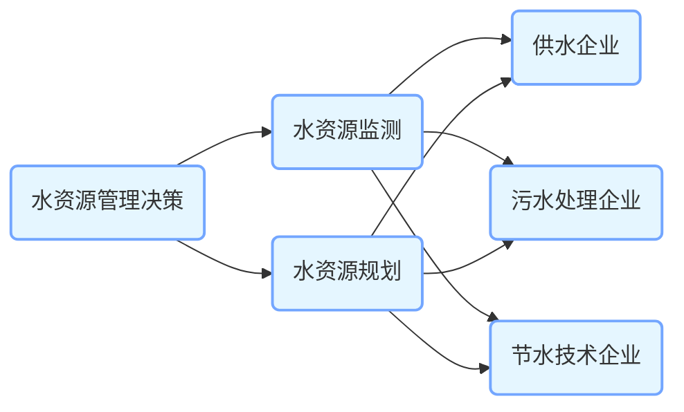

# 水资源管理相关企业的投资前景分析

> 关键词：水资源管理、投资前景、企业分析、市场趋势、风险评估

> 摘要：本文旨在深入分析水资源管理相关企业的投资前景。通过对水资源管理行业的背景介绍，阐述其目的、范围、预期读者等内容。详细讲解核心概念与联系，包括行业架构等；剖析核心算法原理和操作步骤，借助 Python 代码示例；探讨数学模型和公式并举例说明。通过项目实战案例展示企业在实际运营中的表现及代码解读。分析实际应用场景，推荐相关工具和资源，涵盖学习资源、开发工具框架、论文著作等。最后总结未来发展趋势与挑战，解答常见问题并提供扩展阅读和参考资料，为投资者全面了解水资源管理相关企业投资前景提供专业的技术和市场视角。

## 1. 背景介绍 
### 1.1 目的和范围
本分析的目的是为投资者提供全面、深入的水资源管理相关企业投资前景评估。范围涵盖水资源管理行业的各个领域，包括供水、污水处理、节水技术、水资源监测等相关企业。通过对行业现状、市场趋势、企业竞争力等多方面的研究，帮助投资者识别潜在的投资机会，评估投资风险，做出明智的投资决策。

### 1.2 预期读者
本文的预期读者主要包括各类投资者，如个人投资者、机构投资者、风险投资公司等。同时，也适用于对水资源管理行业感兴趣的研究人员、行业分析师、企业管理人员等，为他们了解行业动态和投资潜力提供参考。

### 1.3 文档结构概述
本文将按照以下结构展开：首先介绍背景信息，明确目的、读者和文档结构；接着阐述核心概念与联系，包括行业的基本原理和架构；然后讲解核心算法原理和具体操作步骤，并给出 Python 代码示例；之后介绍数学模型和公式，通过具体例子进行说明；再通过项目实战展示企业实际运营情况和代码实现；分析实际应用场景；推荐相关工具和资源；总结未来发展趋势与挑战；解答常见问题；最后提供扩展阅读和参考资料。

### 1.4 术语表
#### 1.4.1 核心术语定义
- **水资源管理**：指对水资源的开发、利用、保护、调配等进行全面规划和管理的过程，以实现水资源的可持续利用和合理配置。
- **供水企业**：从事城市或区域供水业务的企业，包括水源开发、水质处理、输配水等环节。
- **污水处理企业**：负责收集、处理和处置污水的企业，旨在减少污水对环境的污染，实现水资源的循环利用。
- **节水技术**：指通过改进用水设备、工艺和管理等方式，提高水资源利用效率，降低用水量的技术手段。
- **水资源监测**：对水资源的数量、质量、水位、流量等参数进行实时监测和分析的过程，为水资源管理提供数据支持。

#### 1.4.2 相关概念解释
- **水权交易**：在水资源所有权归国家所有的前提下，水资源使用权在不同用户之间进行有偿转让的行为，以实现水资源的优化配置。
- **PPP 模式**：即政府和社会资本合作模式，通过政府与社会资本合作，共同投资、建设和运营水资源管理项目，实现互利共赢。
- **绿色金融**：金融机构为支持环保、节能、清洁能源等绿色产业发展而提供的金融服务，包括绿色信贷、绿色债券等。

#### 1.4.3 缩略词列表
- **BOT**：Build - Operate - Transfer，建设 - 运营 - 移交，一种常见的基础设施项目融资和运营模式。
- **RO**：Reverse Osmosis，反渗透，一种常用的水处理技术，用于去除水中的盐分和杂质。
- **GIS**：Geographic Information System，地理信息系统，用于对地理空间数据进行采集、存储、分析和展示的技术系统。

## 2. 核心概念与联系 
### 核心概念原理
水资源管理是一个复杂的系统工程，涉及多个环节和领域。其核心原理基于水资源的稀缺性和可持续利用原则，通过科学规划、合理调配和有效保护，实现水资源的供需平衡和生态环境的协调发展。

供水企业的主要原理是从水源地获取水资源，经过水质处理达到国家规定的饮用水标准后，通过输配水管网将水输送到用户端。污水处理企业则是将收集到的污水进行物理、化学和生物处理，去除其中的污染物，使处理后的水质达到排放标准或可回用标准。

节水技术的原理主要包括提高用水效率、减少水资源浪费和加强水资源循环利用。例如，采用高效节水器具可以降低单位用水量；工业企业通过改进生产工艺，实现水资源的循环利用，减少新鲜水的取用量。

水资源监测的原理是利用各种传感器和监测设备，实时获取水资源的相关参数，并通过数据传输和处理系统，对数据进行分析和预警，为水资源管理决策提供科学依据。

### 架构的文本示意图
```plaintext
水资源管理系统架构

            ┌─────────────────────┐
            │    水资源管理决策    │
            └─────────────────────┘
                     │
           ┌────────┴────────┐
           │                  │
┌─────────────────────┐ ┌─────────────────────┐
│      水资源监测      │ │      水资源规划      │
└─────────────────────┘ └─────────────────────┘
           │                  │
           ├────────┬────────┤
           │        │        │
┌─────────────────────┐ ┌─────────────────────┐ ┌─────────────────────┐
│      供水企业      │ │    污水处理企业    │ │    节水技术企业    │
└─────────────────────┘ └─────────────────────┘ └─────────────────────┘
```

### Mermaid 流程图


## 3. 核心算法原理 & 具体操作步骤 
### 水资源供需平衡分析算法原理
水资源供需平衡分析是水资源管理的核心任务之一，其目的是评估一定区域内水资源的供给量和需求量是否平衡。以下是一个简单的水资源供需平衡分析算法的 Python 实现：

```python
# 定义水资源供给量和需求量
supply = 1000  # 假设水资源供给量为 1000 立方米
demand = 800   # 假设水资源需求量为 800 立方米

# 计算水资源供需差值
balance = supply - demand

# 判断供需平衡情况
if balance > 0:
    print("水资源供给大于需求，剩余水量为 {} 立方米。".format(balance))
elif balance == 0:
    print("水资源供需平衡。")
else:
    print("水资源供给小于需求，缺水水量为 {} 立方米。".format(-balance))
```

### 具体操作步骤
1. **数据收集**：收集区域内的水资源供给数据，包括地表水、地下水、再生水等的可利用量；同时收集水资源需求数据，包括生活用水、工业用水、农业用水等的需求量。
2. **数据预处理**：对收集到的数据进行清洗、整理和标准化处理，确保数据的准确性和一致性。
3. **算法实现**：根据上述算法原理，使用 Python 等编程语言实现水资源供需平衡分析算法。
4. **结果分析**：根据算法计算结果，分析水资源供需平衡情况，提出相应的水资源管理策略，如调整用水结构、加强水资源保护、开发新的水源等。

### 污水处理成本估算算法原理
污水处理成本估算对于污水处理企业的运营和投资决策具有重要意义。以下是一个简单的污水处理成本估算算法的 Python 实现：

```python
# 定义污水处理相关参数
treatment_capacity = 1000  # 污水处理厂的处理能力（立方米/天）
treatment_cost_per_cubic_meter = 2  # 每立方米污水处理成本（元）
daily_operating_hours = 24  # 污水处理厂每天的运行小时数
electricity_cost_per_kwh = 0.5  # 每度电的成本（元）
electricity_consumption_per_cubic_meter = 0.5  # 每立方米污水处理的耗电量（度）

# 计算每日污水处理成本
daily_water_treatment_cost = treatment_capacity * treatment_cost_per_cubic_meter

# 计算每日电费成本
daily_electricity_cost = treatment_capacity * electricity_consumption_per_cubic_meter * electricity_cost_per_kwh

# 计算每日总运营成本
daily_total_cost = daily_water_treatment_cost + daily_electricity_cost

print("污水处理厂每日总运营成本为 {} 元。".format(daily_total_cost))
```

### 具体操作步骤
1. **参数确定**：确定污水处理厂的处理能力、每立方米污水处理成本、每日运行小时数、每度电的成本、每立方米污水处理的耗电量等参数。
2. **算法实现**：根据上述算法原理，使用 Python 等编程语言实现污水处理成本估算算法。
3. **结果分析**：根据算法计算结果，分析污水处理厂的运营成本结构，评估其经济效益和投资回报率，为企业的运营和投资决策提供参考。

## 4. 数学模型和公式 & 详细讲解 & 举例说明 
### 水资源承载力模型
水资源承载力是指在一定的水资源开发利用条件下，区域内水资源能够支撑的人口、经济和社会发展规模。常用的水资源承载力模型为供需平衡模型，其数学表达式为：

$$
C = \frac{W_s}{W_d}
$$

其中，$C$ 表示水资源承载力，$W_s$ 表示水资源供给量，$W_d$ 表示水资源需求量。

当 $C > 1$ 时，说明水资源供给大于需求，水资源承载力较强；当 $C = 1$ 时，说明水资源供需平衡；当 $C < 1$ 时，说明水资源供给小于需求，水资源承载力较弱。

**举例说明**：假设某地区的水资源供给量为 $W_s = 5000$ 万立方米，水资源需求量为 $W_d = 4000$ 万立方米，则该地区的水资源承载力为：

$$
C = \frac{5000}{4000} = 1.25
$$

由于 $C > 1$，说明该地区的水资源供给大于需求，水资源承载力较强。

### 污水处理效率模型
污水处理效率是指污水处理厂对污水中污染物的去除能力，常用去除率来表示。其数学表达式为：

$$
\eta = \frac{C_{in} - C_{out}}{C_{in}} \times 100\%
$$

其中，$\eta$ 表示污水处理效率，$C_{in}$ 表示污水进水污染物浓度，$C_{out}$ 表示污水出水污染物浓度。

**举例说明**：假设某污水处理厂的污水进水化学需氧量（COD）浓度为 $C_{in} = 500$ mg/L，污水出水 COD 浓度为 $C_{out} = 50$ mg/L，则该污水处理厂的 COD 去除效率为：

$$
\eta = \frac{500 - 50}{500} \times 100\% = 90\%
$$

说明该污水处理厂对 COD 的去除效果较好。

### 节水潜力评估模型
节水潜力是指在采取一定的节水措施后，能够节约的水资源量。常用的节水潜力评估模型为用水定额法，其数学表达式为：

$$
P = (q_{base} - q_{new}) \times Q
$$

其中，$P$ 表示节水潜力，$q_{base}$ 表示基准用水定额，$q_{new}$ 表示采取节水措施后的用水定额，$Q$ 表示用水总量。

**举例说明**：假设某企业的基准用水定额为 $q_{base} = 10$ 立方米/吨产品，采取节水措施后的用水定额为 $q_{new} = 8$ 立方米/吨产品，企业的年产品产量为 $Q = 1000$ 吨，则该企业的节水潜力为：

$$
P = (10 - 8) \times 1000 = 2000
$$

说明该企业通过采取节水措施，每年可节约水资源 2000 立方米。

## 5. 项目实战：代码实际案例和详细解释说明 
### 5.1  开发环境搭建
本项目实战将使用 Python 语言进行开发，以下是开发环境搭建的具体步骤：

1. **安装 Python**：从 Python 官方网站（https://www.python.org/downloads/）下载并安装 Python 3.x 版本。
2. **安装开发工具**：推荐使用 PyCharm 作为开发工具，从 JetBrains 官方网站（https://www.jetbrains.com/pycharm/download/）下载并安装 PyCharm Community 版本。
3. **安装必要的库**：在命令行中使用以下命令安装所需的库：

```sh
pip install pandas numpy matplotlib
```

### 5.2  源代码详细实现和代码解读
以下是一个基于 Python 的水资源管理数据分析项目的代码示例：

```python
import pandas as pd
import numpy as np
import matplotlib.pyplot as plt

# 读取水资源数据文件
data = pd.read_csv('water_resource_data.csv')

# 数据预处理
# 去除缺失值
data = data.dropna()

# 计算每年的水资源供给总量和需求总量
yearly_supply = data.groupby('Year')['Supply'].sum()
yearly_demand = data.groupby('Year')['Demand'].sum()

# 计算每年的水资源供需差值
yearly_balance = yearly_supply - yearly_demand

# 绘制水资源供需变化趋势图
plt.figure(figsize=(10, 6))
plt.plot(yearly_supply.index, yearly_supply.values, label='Supply')
plt.plot(yearly_demand.index, yearly_demand.values, label='Demand')
plt.plot(yearly_balance.index, yearly_balance.values, label='Balance')
plt.xlabel('Year')
plt.ylabel('Volume (million cubic meters)')
plt.title('Water Resource Supply, Demand and Balance over Years')
plt.legend()
plt.grid(True)
plt.show()

# 分析水资源供需平衡情况
if (yearly_balance > 0).all():
    print("水资源供给始终大于需求。")
elif (yearly_balance < 0).all():
    print("水资源供给始终小于需求。")
else:
    print("水资源供需情况存在波动。")
```

### 代码解读与分析
1. **数据读取**：使用 `pandas` 库的 `read_csv` 函数读取存储在 `water_resource_data.csv` 文件中的水资源数据。
2. **数据预处理**：使用 `dropna` 函数去除数据中的缺失值，确保数据的完整性。
3. **数据计算**：使用 `groupby` 函数按年份对水资源供给量和需求量进行分组求和，得到每年的水资源供给总量和需求总量。然后计算每年的水资源供需差值。
4. **数据可视化**：使用 `matplotlib` 库绘制水资源供需变化趋势图，直观展示水资源供给、需求和供需差值随时间的变化情况。
5. **结果分析**：根据计算得到的水资源供需差值，判断水资源供需平衡情况，并输出相应的分析结果。

## 6. 实际应用场景 
### 城市供水管理
水资源管理相关企业在城市供水管理中发挥着重要作用。供水企业负责城市的水源开发、水质处理和输配水等工作，确保城市居民和工业企业的用水需求。通过水资源监测技术，实时掌握水源地的水质和水量变化情况，及时调整供水策略，保障供水安全。同时，采用节水技术，推广使用高效节水器具，提高城市居民的节水意识，降低城市用水量。

### 污水处理与回用
污水处理企业是解决城市污水问题的关键力量。他们收集城市污水，经过一系列的处理工艺，去除污水中的污染物，使处理后的水质达到排放标准或可回用标准。处理后的再生水可以用于工业冷却、城市绿化、景观补水等领域，实现水资源的循环利用，缓解水资源短缺问题。此外，污水处理企业还可以通过污泥处理和处置，将污泥转化为有机肥料或能源，实现资源的再利用。

### 工业节水与废水处理
工业是水资源消耗大户，同时也是废水排放大户。水资源管理相关企业为工业企业提供节水技术解决方案和废水处理服务。通过改进生产工艺，采用节水设备和技术，降低工业企业的用水量和废水排放量。对于工业废水，采用先进的处理技术，实现达标排放或回用，减少对环境的污染。例如，在钢铁、化工、造纸等行业，推广应用循环用水技术和废水深度处理技术，提高水资源利用效率。

### 农业水资源管理
农业是我国用水大户，农业水资源管理对于保障国家粮食安全和生态环境具有重要意义。水资源管理相关企业可以为农业提供灌溉节水技术和水资源监测服务。推广滴灌、喷灌等高效节水灌溉技术，提高灌溉水利用效率，减少农业用水浪费。同时，通过水资源监测系统，实时掌握农田土壤水分、气象等信息，实现精准灌溉，提高农作物产量和质量。

## 7. 工具和资源推荐
### 7.1 学习资源推荐
#### 7.1.1 书籍推荐
- 《水资源管理学》：系统介绍了水资源管理的基本理论、方法和技术，涵盖水资源规划、水资源评价、水资源保护等方面的内容。
- 《污水处理技术与工程实例》：详细介绍了各种污水处理技术的原理、工艺和应用案例，对于从事污水处理工作的人员具有重要的参考价值。
- 《节水技术与管理》：介绍了国内外先进的节水技术和管理经验，包括工业节水、农业节水、生活节水等方面的内容。

#### 7.1.2 在线课程
- Coursera 平台上的“Water Resources Engineering and Management”课程：由知名高校教授授课，系统讲解水资源工程和管理的相关知识。
- edX 平台上的“Introduction to Water Treatment”课程：介绍了水处理的基本原理、工艺和技术，适合初学者学习。
- 中国大学 MOOC 平台上的“水资源规划与管理”课程：由国内高校教师授课，结合中国实际情况，讲解水资源规划与管理的方法和实践。

#### 7.1.3 技术博客和网站
- 中国水网（https://www.h2o-china.com/）：提供水资源管理、污水处理、供水等领域的最新资讯、政策法规、技术文章等内容。
- 国际水协会（https://www.iwa-network.org/）：是全球水行业的专业组织，其网站提供国际上最新的水技术、研究成果和行业动态。
- 水世界（https://www.e-waterworld.com/）：专注于水行业的技术交流和信息服务，提供水处理技术、项目案例、行业报告等内容。

### 7.2 开发工具框架推荐
#### 7.2.1 IDE和编辑器
- PyCharm：是一款专业的 Python 集成开发环境，具有代码编辑、调试、版本控制等功能，适合 Python 开发人员使用。
- Jupyter Notebook：是一个交互式的开发环境，支持 Python、R 等多种编程语言，适合数据科学和机器学习领域的开发和研究。
- Visual Studio Code：是一款轻量级的代码编辑器，支持多种编程语言和插件扩展，具有丰富的功能和良好的用户体验。

#### 7.2.2 调试和性能分析工具
- PDB：是 Python 自带的调试工具，可以在代码中设置断点，逐行调试代码，帮助开发人员查找和解决代码中的问题。
- cProfile：是 Python 标准库中的性能分析工具，可以统计代码中各个函数的执行时间和调用次数，帮助开发人员优化代码性能。
- Py-Spy：是一个基于 Rust 编写的 Python 性能分析工具，可以实时监控 Python 程序的运行状态，找出性能瓶颈。

#### 7.2.3 相关框架和库
- Pandas：是一个强大的数据处理和分析库，提供了丰富的数据结构和数据操作方法，适合处理和分析水资源管理相关的数据。
- NumPy：是 Python 科学计算的基础库，提供了高效的多维数组对象和数学函数，用于进行数值计算和数据分析。
- Matplotlib：是一个常用的数据可视化库，可以绘制各种类型的图表和图形，帮助开发人员直观展示水资源管理数据的分析结果。

### 7.3 相关论文著作推荐
#### 7.3.1 经典论文
- “The Concept of Water Resources Carrying Capacity and Its Calculation Method”：提出了水资源承载力的概念和计算方法，为水资源管理提供了重要的理论基础。
- “Advances in Wastewater Treatment Technologies”：综述了污水处理技术的研究进展，介绍了各种新型污水处理技术的原理和应用。
- “Water Saving Technologies and Their Applications in Industry”：介绍了工业节水技术的发展现状和应用案例，对于推动工业节水具有重要的指导意义。

#### 7.3.2 最新研究成果
- 关注《Water Research》、《Journal of Hydrology》、《Environmental Science & Technology》等国际知名期刊，了解水资源管理领域的最新研究成果和前沿动态。
- 参加国际水资源管理学术会议，如国际水资源协会大会、世界水论坛等，与国内外专家学者交流最新的研究成果和实践经验。

#### 7.3.3 应用案例分析
- 参考国内外水资源管理相关企业的成功案例，如威立雅水务集团、苏伊士环境集团等，了解他们在供水、污水处理、节水技术等方面的先进经验和实践模式。
- 分析国内典型城市的水资源管理项目案例，如北京、上海、深圳等城市的供水和污水处理项目，学习他们在水资源管理体制、技术创新、市场化运作等方面的成功做法。

## 8. 总结：未来发展趋势与挑战
### 未来发展趋势
- **技术创新驱动**：随着科技的不断进步，水资源管理领域将迎来更多的技术创新。例如，新型水处理技术、智能水资源监测系统、大数据和人工智能在水资源管理中的应用等，将提高水资源管理的效率和精准度。
- **可持续发展导向**：水资源的可持续利用将成为未来水资源管理的核心目标。企业将更加注重水资源的保护和循环利用，推广绿色发展理念，实现经济、社会和环境的协调发展。
- **市场化运作加强**：水资源管理领域的市场化程度将不断提高，PPP 模式等多元化投资和运营模式将得到更广泛的应用。企业之间的竞争将更加激烈，促使企业不断提高自身的竞争力和服务水平。
- **跨界融合发展**：水资源管理将与能源、环保、农业等多个领域实现跨界融合发展。例如，水资源与能源的协同管理、污水处理与资源回收利用的一体化等，将创造更多的发展机遇和价值。

### 挑战
- **水资源短缺问题加剧**：随着人口增长和经济发展，水资源需求不断增加，而水资源总量有限，水资源短缺问题将日益突出。这将对水资源管理相关企业的供水保障能力和污水处理能力提出更高的要求。
- **环境污染压力增大**：工业废水、生活污水和农业面源污染等对水资源环境造成了严重的破坏，水质恶化问题不容忽视。企业需要不断提高污水处理技术水平，加强水资源保护，应对环境污染压力。
- **技术创新难度大**：水资源管理领域的技术创新需要大量的资金投入和专业人才支持，技术研发周期长，创新难度大。企业需要加强与科研机构的合作，加大技术创新投入，提高自主创新能力。
- **政策法规不确定性**：水资源管理涉及到众多的政策法规和标准，政策法规的变化可能会对企业的运营和发展产生影响。企业需要密切关注政策法规的动态，及时调整发展战略，适应政策法规的要求。

## 9. 附录：常见问题与解答
### 1. 水资源管理相关企业的投资风险有哪些？
投资水资源管理相关企业可能面临以下风险：
- **政策风险**：政策法规的变化可能导致企业的运营成本增加或市场准入门槛提高。
- **市场风险**：市场竞争激烈，企业可能面临市场份额下降、价格波动等风险。
- **技术风险**：技术创新不足可能导致企业的竞争力下降，无法满足市场需求。
- **资金风险**：水资源管理项目投资大、回报周期长，企业可能面临资金短缺的风险。

### 2. 如何评估水资源管理相关企业的投资价值？
评估水资源管理相关企业的投资价值可以从以下几个方面入手：
- **财务状况**：分析企业的盈利能力、偿债能力、运营能力等财务指标，评估企业的财务健康状况。
- **市场竞争力**：考察企业的市场份额、品牌知名度、技术实力等，评估企业的市场竞争力。
- **发展前景**：研究企业的发展战略、业务布局、项目储备等，评估企业的未来发展前景。
- **行业环境**：了解水资源管理行业的发展趋势、政策法规等，评估行业环境对企业的影响。

### 3. 水资源管理技术的发展趋势是什么？
水资源管理技术的发展趋势主要包括以下几个方面：
- **智能化**：利用物联网、大数据、人工智能等技术，实现水资源的智能化监测、管理和调度。
- **绿色化**：推广应用绿色水处理技术和节水技术，减少对环境的污染，提高水资源的利用效率。
- **集成化**：将水资源管理的各个环节进行集成，实现水资源的一体化管理和综合利用。
- **标准化**：建立健全水资源管理的技术标准和规范，提高水资源管理的规范化和科学化水平。

### 4. 水资源管理相关企业如何应对水资源短缺问题？
水资源管理相关企业可以采取以下措施应对水资源短缺问题：
- **加强水资源保护**：加大对水源地的保护力度，防止水源污染，提高水资源的质量。
- **推广节水技术**：向用户推广高效节水器具和技术，提高水资源的利用效率，减少水资源浪费。
- **开发新水源**：探索开发海水淡化、再生水利用等新水源，增加水资源的供给量。
- **优化水资源配置**：通过水资源调配和水权交易等手段，实现水资源的优化配置，提高水资源的利用效益。

## 10. 扩展阅读 & 参考资料
### 扩展阅读
- 《中国水资源公报》：每年发布的中国水资源状况官方报告，提供了全国水资源的详细数据和分析。
- 《全球水展望》：国际组织发布的关于全球水资源发展趋势和挑战的报告，具有重要的参考价值。
- 《水工业市场》杂志：专注于水行业的市场研究和分析，提供行业动态、市场趋势、企业案例等内容。

### 参考资料
- 相关行业协会和政府部门发布的政策文件、统计数据和行业报告。
- 国内外学术期刊上发表的关于水资源管理的研究论文。
- 水资源管理相关企业的年报、招股说明书等公开资料。

作者：AI天才研究院/AI Genius Institute & 禅与计算机程序设计艺术 /Zen And The Art of Computer Programming