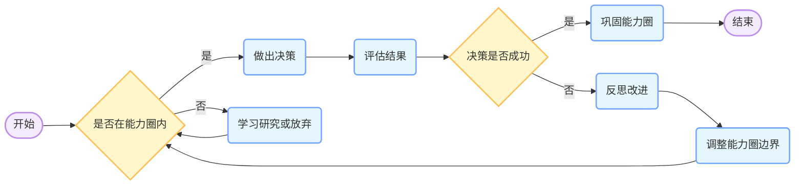

# 沃伦·巴菲特的Circle of Competence理论

> 关键词：沃伦·巴菲特、Circle of Competence理论、能力圈、投资决策、风险管理、商业分析、个人成长

> 摘要：本文深入探讨了沃伦·巴菲特的Circle of Competence理论，即能力圈理论。详细介绍了该理论的背景，包括其目的、适用读者、文档结构和相关术语。阐述了能力圈的核心概念、原理及架构，用Mermaid流程图展示其逻辑关系。通过Python代码讲解了在投资分析中运用该理论的核心算法原理和具体操作步骤。给出了相关数学模型和公式，并举例说明。进行了项目实战，从开发环境搭建到源代码实现与解读。探讨了该理论在投资、商业决策、个人成长等实际应用场景。推荐了学习该理论的工具和资源，包括书籍、在线课程、技术博客、开发工具、框架和相关论文。最后总结了该理论的未来发展趋势与挑战，解答了常见问题，并提供了扩展阅读和参考资料。

## 1. 背景介绍 
### 1.1 目的和范围
沃伦·巴菲特的Circle of Competence理论是投资和商业领域中一个非常重要的概念。本文的目的在于全面且深入地剖析这一理论，从其基本概念、原理，到实际应用和未来发展趋势进行详细阐述。范围涵盖了该理论在投资决策、商业运营、个人职业发展等多个领域的应用，旨在帮助读者理解能力圈理论的核心要义，并能够在实际生活中运用这一理论做出更明智的决策。

### 1.2 预期读者
本文预期读者包括投资爱好者、金融从业者、企业管理者、创业者以及对个人成长和决策优化感兴趣的人群。无论你是刚刚涉足投资领域的新手，还是经验丰富的商业领袖，都能从本文中获得关于能力圈理论的新见解和实用知识。

### 1.3 文档结构概述
本文将按照以下结构展开：首先介绍能力圈理论的背景知识，包括相关术语和概念；接着阐述能力圈的核心概念、原理和架构，并用流程图展示其逻辑关系；然后通过Python代码讲解在实际应用中运用该理论的核心算法和操作步骤；给出相关数学模型和公式，并举例说明；进行项目实战，包括开发环境搭建、源代码实现和解读；探讨该理论在不同场景下的实际应用；推荐学习该理论的工具和资源；总结其未来发展趋势与挑战；解答常见问题；最后提供扩展阅读和参考资料。

### 1.4 术语表
#### 1.4.1 核心术语定义
- **Circle of Competence（能力圈）**：指个人或组织所具备的、能够真正理解和把握的知识、技能和经验的范围。在这个范围内，个体能够做出相对准确和明智的决策。
- **投资决策**：指投资者在进行投资活动时，对投资目标、投资方式、投资金额等方面做出的选择和判断。
- **风险管理**：指通过识别、评估和应对风险，以降低风险对目标实现的影响的过程。
- **商业分析**：指对商业活动中的各种数据、信息和现象进行分析和研究，以支持商业决策的过程。

#### 1.4.2 相关概念解释
- **边界意识**：在能力圈理论中，边界意识是指明确自己能力圈的范围，知道哪些领域是自己熟悉和擅长的，哪些领域是自己不了解的。只有具备清晰的边界意识，才能避免在能力圈之外做出盲目决策。
- **能力圈拓展**：随着个人学习和经验的积累，能力圈可以逐渐拓展。但拓展能力圈需要谨慎，要在确保对新领域有足够了解和研究的基础上进行。
- **竞争优势**：在能力圈内，个人或组织由于具备专业知识和经验，往往能够形成竞争优势，从而在市场中获得更好的业绩和回报。

#### 1.4.3 缩略词列表
目前本文中未涉及相关缩略词。

## 2. 核心概念与联系 
### 核心概念原理
沃伦·巴菲特的Circle of Competence理论的核心思想是，每个人都有自己的能力圈，即一个人真正了解和擅长的领域。在这个能力圈内，个人能够对事物有深入的理解和准确的判断，从而做出明智的决策。而在能力圈之外，由于缺乏必要的知识和经验，做出错误决策的风险会大大增加。

能力圈的形成是一个长期的过程，它受到个人的教育背景、工作经验、兴趣爱好等多种因素的影响。一个人在自己熟悉的领域中，能够更容易地获取和处理信息，识别机会和风险，从而做出更符合实际情况的决策。

例如，巴菲特以投资股票闻名，他的能力圈主要集中在对优秀企业的分析和评估上。他会深入研究企业的财务状况、商业模式、竞争优势等方面，只投资那些他真正理解和看好的企业。对于一些新兴的、他不熟悉的行业，如科技行业早期，他会保持谨慎，不会轻易涉足。

### 架构的文本示意图
```plaintext
能力圈
|-- 知识领域
|   |-- 专业知识
|   |-- 行业知识
|-- 技能领域
|   |-- 分析技能
|   |-- 决策技能
|-- 经验领域
|   |-- 成功经验
|   |-- 失败经验
```

### Mermaid流程图


这个流程图展示了能力圈理论在决策过程中的应用。首先判断决策事项是否在能力圈内，如果是，则做出决策并评估结果；如果不在能力圈内，则需要进行学习研究或者选择放弃。决策结果无论是成功还是失败，都需要进行相应的处理，成功则巩固能力圈，失败则反思改进并调整能力圈边界。

## 3. 核心算法原理 & 具体操作步骤 
### 核心算法原理
在投资决策中运用能力圈理论，可以将其转化为一个简单的算法。其核心思想是通过对投资对象的评估，判断其是否在自己的能力圈内，从而决定是否进行投资。

以下是一个简化的Python代码示例，用于模拟这个算法：

```python
# 定义能力圈范围，这里用一个列表表示熟悉的行业
circle_of_competence = ["消费", "金融", "制造业"]

# 定义一个函数来判断投资对象是否在能力圈内
def is_in_circle(industry):
    return industry in circle_of_competence

# 定义一个函数来进行投资决策
def investment_decision(industry):
    if is_in_circle(industry):
        print(f"{industry} 在能力圈内，可以考虑投资。")
    else:
        print(f"{industry} 不在能力圈内，建议谨慎或放弃投资。")

# 测试投资决策函数
test_industries = ["消费", "科技", "金融"]
for industry in test_industries:
    investment_decision(industry)
```

### 具体操作步骤
1. **确定能力圈范围**：首先需要明确自己的能力圈范围，可以从自己的专业知识、工作经验、兴趣爱好等方面入手，列出自己熟悉和擅长的领域。
2. **收集投资对象信息**：对于潜在的投资对象，需要收集其相关信息，特别是所属行业信息。
3. **判断是否在能力圈内**：使用定义好的判断函数，判断投资对象所属行业是否在自己的能力圈内。
4. **做出投资决策**：根据判断结果，决定是否进行投资。如果在能力圈内，可以进一步进行深入分析和评估；如果不在能力圈内，建议谨慎或放弃投资。

## 4. 数学模型和公式 & 详细讲解 & 举例说明 
### 数学模型和公式
在能力圈理论中，可以用一个简单的数学模型来表示决策的风险。假设决策的风险 $R$ 与决策事项距离能力圈中心的距离 $d$ 成正比，与个人在能力圈内的专业程度 $p$ 成反比。可以用以下公式表示：

$$R = \frac{k \times d}{p}$$

其中，$k$ 是一个常数，用于调整风险的大小。

### 详细讲解
- **决策事项距离能力圈中心的距离 $d$**：这个距离表示决策事项与个人能力圈核心领域的差异程度。如果决策事项完全在能力圈内，$d$ 为 0；如果决策事项与能力圈核心领域差异很大，$d$ 则较大。
- **个人在能力圈内的专业程度 $p$**：专业程度可以用个人在能力圈内的知识储备、经验积累等因素来衡量。专业程度越高，$p$ 值越大。

### 举例说明
假设小明的能力圈主要集中在消费行业，他对消费行业的专业程度 $p$ 为 8（满分 10 分）。现在有一个投资项目，是关于新能源汽车行业，这个行业与小明的能力圈核心领域差异较大，假设距离 $d$ 为 6，常数 $k$ 取 1。

根据公式计算决策风险 $R$：

$$R = \frac{1 \times 6}{8} = 0.75$$

这意味着小明投资新能源汽车行业的决策风险相对较高。如果另一个投资项目是关于食品饮料行业，这个行业在小明的能力圈内，假设距离 $d$ 为 1，则决策风险为：

$$R = \frac{1 \times 1}{8} = 0.125$$

可以看出，投资食品饮料行业的决策风险明显低于投资新能源汽车行业。

## 5. 项目实战：代码实际案例和详细解释说明 
### 5.1  开发环境搭建
为了实现一个基于能力圈理论的投资分析项目，我们可以使用Python语言进行开发。以下是搭建开发环境的步骤：

1. **安装Python**：从Python官方网站（https://www.python.org/downloads/）下载并安装Python 3.x版本。
2. **安装开发工具**：推荐使用PyCharm或Jupyter Notebook作为开发工具。PyCharm是一个功能强大的Python集成开发环境，Jupyter Notebook则适合进行交互式编程和数据分析。
3. **安装必要的库**：在项目中，我们可能需要使用一些库来处理数据和进行分析，如`pandas`、`numpy`等。可以使用以下命令进行安装：

```bash
pip install pandas numpy
```

### 5.2  源代码详细实现和代码解读
以下是一个更复杂的基于能力圈理论的投资分析项目的源代码示例：

```python
import pandas as pd

# 定义能力圈范围，用一个字典表示每个行业的熟悉程度（满分10分）
circle_of_competence = {
    "消费": 8,
    "金融": 7,
    "制造业": 6
}

# 定义一个函数来计算投资项目的风险得分
def calculate_risk(industry, circle_of_competence):
    if industry in circle_of_competence:
        # 如果在能力圈内，风险得分与熟悉程度成反比
        risk_score = 10 - circle_of_competence[industry]
    else:
        # 如果不在能力圈内，风险得分较高
        risk_score = 8
    return risk_score

# 定义一个函数来进行投资项目筛选
def investment_screening(investment_projects, circle_of_competence, risk_threshold=3):
    screened_projects = []
    for project in investment_projects:
        industry = project["industry"]
        risk_score = calculate_risk(industry, circle_of_competence)
        if risk_score <= risk_threshold:
            screened_projects.append(project)
    return screened_projects

# 模拟一些投资项目数据
investment_projects = [
    {"name": "项目1", "industry": "消费", "expected_return": 0.1},
    {"name": "项目2", "industry": "科技", "expected_return": 0.15},
    {"name": "项目3", "industry": "金融", "expected_return": 0.08}
]

# 进行投资项目筛选
screened_projects = investment_screening(investment_projects, circle_of_competence)

# 输出筛选结果
print("筛选后的投资项目：")
for project in screened_projects:
    print(f"项目名称：{project['name']}，行业：{project['industry']}，预期回报率：{project['expected_return']}")
```

### 代码解读与分析
1. **能力圈范围定义**：使用字典`circle_of_competence`来表示能力圈范围，每个行业对应一个熟悉程度得分。
2. **风险得分计算函数**：`calculate_risk`函数根据投资项目所属行业是否在能力圈内，计算其风险得分。如果在能力圈内，风险得分与熟悉程度成反比；如果不在能力圈内，风险得分较高。
3. **投资项目筛选函数**：`investment_screening`函数遍历所有投资项目，计算每个项目的风险得分，并根据设定的风险阈值筛选出符合条件的项目。
4. **模拟数据和筛选结果输出**：模拟了一些投资项目数据，调用`investment_screening`函数进行筛选，并输出筛选结果。

通过这个项目，我们可以看到如何运用能力圈理论进行投资项目的筛选，从而降低投资风险。

## 6. 实际应用场景 
### 投资领域
在投资领域，能力圈理论具有重要的应用价值。投资者可以根据自己的能力圈范围，选择投资那些自己熟悉和了解的行业和企业。例如，巴菲特通过深入研究消费、金融等行业的企业，长期持有可口可乐、富国银行等公司的股票，获得了丰厚的回报。而对于一些新兴的、复杂的行业，如区块链、人工智能等，如果投资者不具备相关的知识和经验，就应该谨慎投资。

### 商业决策领域
企业管理者在进行商业决策时，也可以运用能力圈理论。例如，在选择进入新的市场或开展新的业务时，要考虑企业自身的能力和资源是否能够支持。如果进入一个与企业核心业务差异较大的领域，可能会面临较高的风险。相反，企业可以在自己的能力圈内，通过不断创新和优化，提高市场竞争力。

### 个人成长领域
个人在职业发展和学习过程中，也可以应用能力圈理论。首先要明确自己的优势和特长，确定自己的能力圈范围。然后在能力圈内不断深耕，提高自己的专业技能和知识水平。同时，可以有计划地拓展自己的能力圈，但要注意避免盲目跟风，确保在新的领域有足够的学习和准备。

## 7. 工具和资源推荐
### 7.1 学习资源推荐
#### 7.1.1 书籍推荐
- 《聪明的投资者》（The Intelligent Investor）：作者是本杰明·格雷厄姆，这本书是价值投资的经典之作，巴菲特称其为有史以来最伟大的投资著作。书中介绍了价值投资的基本理念和方法，对理解能力圈理论有很大的帮助。
- 《巴菲特致股东的信：股份公司教程》（Letters to Shareholders of Berkshire Hathaway）：这本书收录了巴菲特历年致股东的信，通过阅读这些信件，可以深入了解巴菲特的投资思想和决策方法，包括能力圈理论的应用。
- 《穷查理宝典：查理·芒格的智慧箴言录》（Poor Charlie's Almanack: The Wit and Wisdom of Charles T. Munger）：查理·芒格是巴菲特的长期合作伙伴，这本书汇集了芒格的演讲、文章和访谈，其中包含了许多关于能力圈、多元思维模型等重要思想。

#### 7.1.2 在线课程
- Coursera平台上的“投资学原理”（Principles of Investing）课程：该课程由知名教授授课，涵盖了投资领域的基本概念和方法，对理解能力圈理论在投资中的应用有一定的帮助。
- edX平台上的“商业决策分析”（Business Decision Analysis）课程：课程主要介绍了商业决策的分析方法和工具，有助于在商业决策中运用能力圈理论。

#### 7.1.3 技术博客和网站
- 雪球网（https://xueqiu.com/）：是一个投资交流社区，有许多投资者分享自己的投资经验和见解，包括对能力圈理论的讨论。
- 价值投资网（https://www.value-investing.net/）：专注于价值投资领域，提供了大量关于价值投资的文章和研究报告，对深入理解能力圈理论有很大的帮助。

### 7.2 开发工具框架推荐
#### 7.2.1 IDE和编辑器
- PyCharm：是一款功能强大的Python集成开发环境，提供了代码编辑、调试、版本控制等一系列功能，适合开发基于Python的投资分析项目。
- Jupyter Notebook：是一个交互式编程环境，支持多种编程语言，尤其适合进行数据分析和可视化。可以方便地进行代码的编写、运行和结果展示。

#### 7.2.2 调试和性能分析工具
- PDB：是Python自带的调试工具，可以在代码中设置断点，逐步执行代码，查看变量的值和程序的执行流程，帮助调试代码。
- cProfile：是Python的性能分析工具，可以分析代码的运行时间和函数调用情况，找出代码中的性能瓶颈。

#### 7.2.3 相关框架和库
- Pandas：是一个用于数据处理和分析的Python库，提供了高效的数据结构和数据操作方法，适合处理投资项目数据。
- Numpy：是Python的数值计算库，提供了高性能的多维数组对象和各种数学函数，可用于进行投资风险计算等数值计算任务。

### 7.3 相关论文著作推荐
#### 7.3.1 经典论文
- “The Superinvestors of Graham-and-Doddsville”：这是巴菲特1984年在哥伦比亚大学商学院的演讲，后整理成论文发表。论文通过分析格雷厄姆和多德的追随者的投资业绩，阐述了价值投资的有效性和能力圈的重要性。
- “Common Stocks and Uncommon Profits”：作者是菲利普·费雪，这篇论文提出了成长股投资的理念和方法，对理解能力圈在成长股投资中的应用有一定的参考价值。

#### 7.3.2 最新研究成果
- 近年来，有许多学者对能力圈理论进行了深入研究，探讨了能力圈的形成机制、拓展方法以及在不同领域的应用效果。可以通过学术数据库如Web of Science、EBSCO等搜索相关研究论文。

#### 7.3.3 应用案例分析
- 一些商业杂志和研究机构会发布关于企业运用能力圈理论进行决策的案例分析，如《哈佛商业评论》《麦肯锡季刊》等。通过阅读这些案例，可以学习到实际应用中的经验和教训。

## 8. 总结：未来发展趋势与挑战
### 未来发展趋势
- **跨领域融合**：随着科技的不断发展和社会的进步，各个领域之间的界限越来越模糊，跨领域的合作和创新将成为未来的发展趋势。在这种情况下，能力圈理论也需要不断拓展和融合，个人和组织需要具备跨领域的知识和技能，扩大自己的能力圈范围。
- **数据驱动决策**：大数据、人工智能等技术的发展，为决策提供了更多的数据支持和分析工具。未来，能力圈理论的应用将更加注重数据驱动，通过对大量数据的分析和挖掘，更准确地评估决策事项是否在能力圈内，以及决策的风险和收益。
- **个性化发展**：每个人的能力圈都是独特的，未来的发展将更加注重个性化。个人和组织可以根据自己的兴趣、优势和目标，定制化地发展自己的能力圈，实现个性化的成长和发展。

### 挑战
- **能力圈边界确定困难**：在实际应用中，确定能力圈的边界是一个比较困难的问题。随着知识的不断更新和技术的快速发展，能力圈的范围也在不断变化。如何准确地判断自己的能力圈边界，避免盲目自信或过度保守，是一个需要解决的挑战。
- **拓展能力圈的风险**：拓展能力圈虽然可以带来更多的机会，但也伴随着一定的风险。进入一个新的领域，可能会面临不熟悉的市场环境、竞争对手和技术难题等。如何在拓展能力圈的过程中，有效地管理风险，是一个需要关注的问题。
- **团队能力圈整合**：在团队合作中，如何整合团队成员的能力圈，形成一个有机的整体，发挥团队的最大优势，是一个挑战。不同成员的能力圈可能存在差异，如何协调和沟通，实现能力圈的互补和协同，是团队管理中需要解决的问题。

## 9. 附录：常见问题与解答
### 如何确定自己的能力圈范围？
确定自己的能力圈范围可以从以下几个方面入手：
- **回顾自己的教育背景和专业技能**：思考自己所学的专业知识和掌握的技能，哪些是自己比较擅长和精通的。
- **总结工作经验**：回顾自己的工作经历，分析在哪些领域取得了较好的成绩，积累了丰富的经验。
- **考虑兴趣爱好**：兴趣是最好的老师，对某个领域有浓厚的兴趣，往往会更愿意投入时间和精力去学习和研究，从而在该领域形成一定的能力。
- **进行自我评估**：可以通过一些测试和评估工具，了解自己的优势和劣势，进一步明确自己的能力圈范围。

### 能力圈是否可以拓展？如何拓展？
能力圈是可以拓展的。以下是一些拓展能力圈的方法：
- **学习新知识和技能**：通过阅读书籍、参加培训课程、在线学习等方式，不断学习新的知识和技能，扩大自己的知识储备。
- **实践和经验积累**：在实际工作和生活中，尝试参与一些新的项目和任务，积累实践经验，提高自己的能力。
- **与他人合作和交流**：与不同领域的人合作和交流，学习他们的经验和知识，拓宽自己的视野。
- **反思和总结**：定期对自己的学习和实践进行反思和总结，发现自己的不足之处，并及时改进。

### 在能力圈之外的投资是否一定不能做？
在能力圈之外的投资不一定不能做，但需要谨慎对待。如果对某个投资领域不熟悉，可以先进行充分的学习和研究，了解该领域的基本情况、市场趋势和风险因素。在学习过程中，可以请教专业人士，参考相关的研究报告和案例分析。如果经过评估，认为自己有足够的能力和资源来应对投资风险，并且有合理的投资策略和预期回报，那么可以考虑进行投资。但在投资过程中，要密切关注市场变化，及时调整投资策略。

## 10. 扩展阅读 & 参考资料
### 扩展阅读
- 《金融炼金术》（The Alchemy of Finance）：作者是乔治·索罗斯，这本书介绍了索罗斯的投资哲学和交易方法，对理解投资决策和市场变化有一定的启发。
- 《创新者的窘境》（The Innovator's Dilemma）：作者是克莱顿·克里斯坦森，书中探讨了企业在创新过程中面临的挑战和机遇，对企业管理者在商业决策中运用能力圈理论有一定的参考价值。

### 参考资料
- 巴菲特历年致股东的信：可以从伯克希尔·哈撒韦公司官方网站（https://www.berkshirehathaway.com/）获取。
- 相关学术论文：可以通过学术数据库如Web of Science、EBSCO、CNKI等搜索获取。

作者：AI天才研究院/AI Genius Institute & 禅与计算机程序设计艺术 /Zen And The Art of Computer Programming