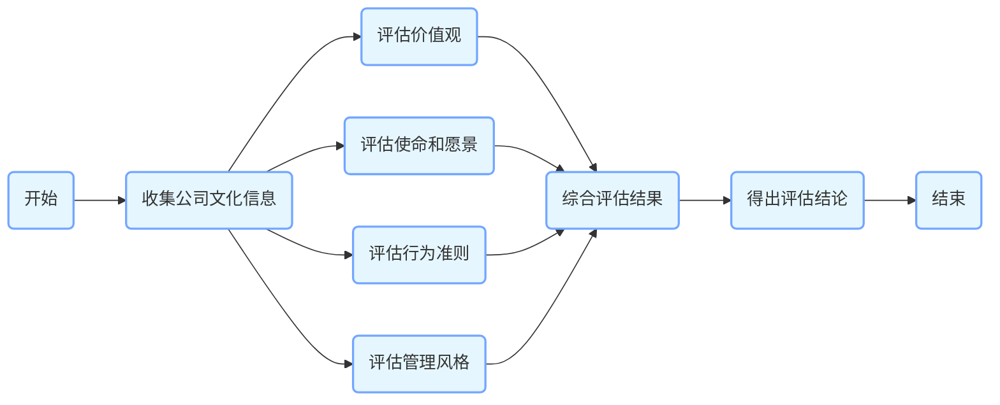

# 沃伦·巴菲特的公司文化评估方法

> 关键词：沃伦·巴菲特、公司文化评估、投资理念、企业文化、财务表现

> 摘要：本文深入探讨了沃伦·巴菲特的公司文化评估方法。从背景介绍出发，阐述了研究目的、预期读者、文档结构等内容。接着详细剖析了核心概念，包括公司文化的定义、构成以及与巴菲特投资理念的联系，并通过示意图和流程图直观呈现。对核心算法原理和操作步骤进行了阐述，结合Python代码进行说明。用数学模型和公式进一步解释评估方法的内在逻辑，并举例说明。通过项目实战展示了如何运用该方法进行实际评估，分析了开发环境搭建、代码实现和解读。探讨了该评估方法的实际应用场景，推荐了相关学习资源、开发工具和论文著作。最后总结了未来发展趋势与挑战，提供常见问题解答和扩展阅读参考资料，旨在帮助读者全面理解和运用巴菲特的公司文化评估方法。

## 1. 背景介绍 
### 1.1 目的和范围
沃伦·巴菲特作为全球著名的投资大师，其投资理念和方法一直备受关注。公司文化在企业的长期发展中起着至关重要的作用，巴菲特在投资决策过程中非常重视对公司文化的评估。本文的目的在于深入研究巴菲特的公司文化评估方法，揭示其背后的原理和逻辑，为投资者、企业管理者以及对公司文化研究感兴趣的人士提供全面而深入的见解。

本文的范围涵盖了公司文化评估的核心概念、评估算法原理、数学模型、实际应用案例以及相关的工具和资源推荐等方面。通过对这些内容的详细阐述，帮助读者掌握如何运用巴菲特的方法对公司文化进行有效的评估。

### 1.2 预期读者
- **投资者**：希望通过评估公司文化来筛选更具投资价值的企业，提高投资决策的准确性和成功率。
- **企业管理者**：借鉴巴菲特的评估方法，审视和改进自身企业的文化建设，提升企业的竞争力和可持续发展能力。
- **学术研究人员**：为公司文化相关的学术研究提供新的视角和方法，丰富该领域的研究内容。
- **金融从业者**：在进行企业估值、尽职调查等工作时，能够将公司文化评估纳入考虑范围，提供更全面的专业服务。

### 1.3 文档结构概述
本文将按照以下结构进行组织：
- 核心概念与联系：介绍公司文化的定义、构成要素以及与巴菲特投资理念的关系，并通过示意图和流程图进行直观展示。
- 核心算法原理 & 具体操作步骤：阐述评估公司文化的算法原理，并用Python代码详细说明具体的操作步骤。
- 数学模型和公式 & 详细讲解 & 举例说明：运用数学模型和公式来量化公司文化评估的过程，并通过实际例子进行说明。
- 项目实战：通过实际案例展示如何运用巴菲特的公司文化评估方法进行评估，包括开发环境搭建、源代码实现和代码解读。
- 实际应用场景：探讨该评估方法在不同场景下的应用，如投资决策、企业战略规划等。
- 工具和资源推荐：推荐相关的学习资源、开发工具和论文著作，帮助读者进一步深入学习和研究。
- 总结：未来发展趋势与挑战：总结公司文化评估的未来发展趋势，并分析可能面临的挑战。
- 附录：常见问题与解答：解答读者在学习和应用过程中可能遇到的常见问题。
- 扩展阅读 & 参考资料：提供相关的扩展阅读材料和参考资料，方便读者进一步探索。

### 1.4 术语表
#### 1.4.1 核心术语定义
- **公司文化**：是指企业在长期的经营活动中形成的价值观、信仰、行为准则、工作方式等的总和，它影响着企业员工的行为和决策，是企业的灵魂和精神支柱。
- **投资理念**：投资者在进行投资决策时所遵循的原则和方法，包括对投资目标、风险偏好、投资策略等方面的认知和选择。
- **可持续竞争优势**：企业在市场竞争中所具备的能够长期保持的优势，使得企业能够在行业中脱颖而出，获得高于平均水平的利润。
- **管理层诚信**：指企业管理层在经营活动中遵守道德和法律规范，诚实守信，不欺诈、不舞弊，对股东和其他利益相关者负责的品质。

#### 1.4.2 相关概念解释
- **企业文化与企业价值观**：企业文化是一个更广泛的概念，包括企业的价值观、信仰、行为准则等多个方面；而企业价值观是企业文化的核心，它决定了企业的经营方向和行为方式。
- **公司文化与企业绩效**：良好的公司文化可以提高员工的工作积极性和创造力，增强企业的凝聚力和竞争力，从而对企业的绩效产生积极的影响；反之，不良的公司文化可能会导致企业内部矛盾重重，效率低下，影响企业的发展。
- **巴菲特投资理念与价值投资**：巴菲特的投资理念是价值投资的典型代表，他强调通过对企业内在价值的评估，寻找被低估的股票进行投资，并长期持有。价值投资注重企业的基本面分析，关注企业的盈利能力、资产质量、竞争优势等因素。

#### 1.4.3 缩略词列表
- **ROE**：Return on Equity，净资产收益率，反映股东权益的收益水平，用以衡量公司运用自有资本的效率。
- **EPS**：Earnings Per Share，每股收益，是指税后利润与股本总数的比率，它是测定股票投资价值的重要指标之一。
- **PE**：Price-to-Earnings Ratio，市盈率，是指股票价格除以每股收益的比率，反映了市场对公司未来盈利的预期。

## 2. 核心概念与联系 
### 公司文化的定义与构成
公司文化是企业在长期的发展过程中逐渐形成的一种独特的价值观、信仰、行为准则和工作方式的总和。它涵盖了企业的各个层面，包括企业的使命、愿景、价值观、经营理念、管理风格、员工行为等。

从构成要素来看，公司文化可以分为以下几个方面：
- **价值观**：是公司文化的核心，它决定了企业的经营方向和行为方式。例如，一些企业强调创新、诚信、客户至上等价值观，这些价值观会影响企业的决策和员工的行为。
- **使命和愿景**：使命是企业存在的目的和意义，愿景是企业未来发展的目标和方向。明确的使命和愿景可以为企业的发展提供指引，激发员工的工作热情和创造力。
- **行为准则**：是企业对员工行为的规范和要求，它规定了员工在工作中应该遵守的道德和职业规范。例如，企业可能会制定关于诚信、保密、团队合作等方面的行为准则。
- **管理风格**：是企业管理者在管理过程中所采用的方式和方法，它反映了企业的领导理念和管理文化。不同的管理风格会对员工的工作积极性和工作效率产生不同的影响。

### 巴菲特投资理念与公司文化的联系
巴菲特的投资理念强调寻找具有可持续竞争优势的企业，并长期持有其股票。他认为，公司文化是企业可持续竞争优势的重要来源之一。一个具有良好公司文化的企业，通常具有以下特点：
- **管理层诚信**：诚信是巴菲特非常看重的品质之一。一个诚信的管理层会遵守道德和法律规范，诚实守信地对待股东和其他利益相关者，不会为了短期利益而损害企业的长期发展。
- **员工忠诚度高**：良好的公司文化可以提高员工的工作满意度和忠诚度，使员工愿意为企业长期服务。员工的忠诚度高可以减少人员流动，提高企业的稳定性和竞争力。
- **创新能力强**：鼓励创新的公司文化可以激发员工的创造力和创新精神，使企业能够不断推出新产品、新服务，满足市场的需求，从而在竞争中占据优势。
- **长期导向**：具有长期导向的公司文化会使企业更加注重长期发展，而不是短期的业绩波动。这样的企业会进行长期的战略规划和投资，为企业的未来发展奠定坚实的基础。

### 核心概念原理和架构的文本示意图
```plaintext
公司文化评估
|-- 价值观评估
|   |-- 创新价值观
|   |-- 诚信价值观
|   |-- 客户至上价值观
|-- 使命和愿景评估
|   |-- 明确性
|   |-- 可行性
|   |-- 激励性
|-- 行为准则评估
|   |-- 合规性
|   |-- 可操作性
|   |-- 执行情况
|-- 管理风格评估
|   |-- 民主性
|   |-- 权威性
|   |-- 灵活性
```

### Mermaid 流程图


## 3. 核心算法原理 & 具体操作步骤 
### 核心算法原理
巴菲特的公司文化评估方法并没有一个固定的、精确的算法，但可以总结出一些核心的评估原则和步骤。其基本原理是通过对公司文化的各个方面进行定性和定量的分析，综合评估公司文化的优劣，并判断其对企业可持续竞争优势和长期发展的影响。

具体来说，评估过程可以分为以下几个关键步骤：
1. **信息收集**：收集有关公司文化的各种信息，包括公司的官方文件、年报、新闻报道、员工访谈等。
2. **维度评估**：从价值观、使命和愿景、行为准则、管理风格等多个维度对公司文化进行评估。
3. **综合评分**：根据各个维度的评估结果，给予相应的评分，并综合计算出公司文化的总体得分。
4. **结论判断**：根据总体得分和各个维度的具体情况，判断公司文化是否良好，是否有利于企业的长期发展。

### 具体操作步骤及 Python 代码实现
以下是一个简化的 Python 代码示例，用于演示如何实现公司文化评估的具体操作步骤：

```python
# 定义评估维度和权重
dimensions = {
    "价值观": 0.3,
    "使命和愿景": 0.2,
    "行为准则": 0.2,
    "管理风格": 0.3
}

# 定义每个维度的评估指标和评分标准
value_indicators = {
    "创新价值观": [0, 10],
    "诚信价值观": [0, 10],
    "客户至上价值观": [0, 10]
}

mission_indicators = {
    "明确性": [0, 10],
    "可行性": [0, 10],
    "激励性": [0, 10]
}

behavior_indicators = {
    "合规性": [0, 10],
    "可操作性": [0, 10],
    "执行情况": [0, 10]
}

management_indicators = {
    "民主性": [0, 10],
    "权威性": [0, 10],
    "灵活性": [0, 10]
}

# 模拟收集到的公司文化信息，并进行评分
def score_company_culture():
    # 价值观评分
    value_scores = {}
    for indicator, score_range in value_indicators.items():
        # 这里简单模拟手动输入评分
        score = int(input(f"请输入 {indicator} 的评分（{score_range[0]}-{score_range[1]}）："))
        value_scores[indicator] = score
    value_total_score = sum(value_scores.values()) / len(value_scores)

    # 使命和愿景评分
    mission_scores = {}
    for indicator, score_range in mission_indicators.items():
        score = int(input(f"请输入 {indicator} 的评分（{score_range[0]}-{score_range[1]}）："))
        mission_scores[indicator] = score
    mission_total_score = sum(mission_scores.values()) / len(mission_scores)

    # 行为准则评分
    behavior_scores = {}
    for indicator, score_range in behavior_indicators.items():
        score = int(input(f"请输入 {indicator} 的评分（{score_range[0]}-{score_range[1]}）："))
        behavior_scores[indicator] = score
    behavior_total_score = sum(behavior_scores.values()) / len(behavior_scores)

    # 管理风格评分
    management_scores = {}
    for indicator, score_range in management_indicators.items():
        score = int(input(f"请输入 {indicator} 的评分（{score_range[0]}-{score_range[1]}）："))
        management_scores[indicator] = score
    management_total_score = sum(management_scores.values()) / len(management_scores)

    # 综合评分
    overall_score = (
        value_total_score * dimensions["价值观"] +
        mission_total_score * dimensions["使命和愿景"] +
        behavior_total_score * dimensions["行为准则"] +
        management_total_score * dimensions["管理风格"]
    )

    return overall_score

# 执行评估
final_score = score_company_culture()
print(f"公司文化的综合评分为：{final_score}")
```

### 代码解释
1. **维度和权重定义**：通过 `dimensions` 字典定义了评估的四个维度及其对应的权重。
2. **评估指标和评分标准定义**：分别定义了每个维度的评估指标和评分范围。
3. **评分函数实现**：`score_company_culture` 函数用于收集用户输入的各个指标的评分，并计算每个维度的总分和综合评分。
4. **执行评估**：调用 `score_company_culture` 函数进行评估，并输出最终的综合评分。

## 4. 数学模型和公式 & 详细讲解 & 举例说明 
### 数学模型
我们可以用一个加权平均的数学模型来表示公司文化的综合评估得分。设公司文化的评估维度有 $n$ 个，分别为 $D_1, D_2, \cdots, D_n$，每个维度的权重为 $w_1, w_2, \cdots, w_n$，且 $\sum_{i=1}^{n} w_i = 1$。每个维度的得分分别为 $s_1, s_2, \cdots, s_n$，则公司文化的综合评估得分 $S$ 可以表示为：

$$S = \sum_{i=1}^{n} w_i \times s_i$$

### 详细讲解
- **维度权重**：权重 $w_i$ 表示每个维度在综合评估中的重要程度。例如，在前面的 Python 代码中，我们将 “价值观” 的权重设置为 0.3，“使命和愿景” 的权重设置为 0.2 等。权重的设置需要根据具体的评估目的和实际情况进行调整。
- **维度得分**：得分 $s_i$ 是每个维度的评估得分。每个维度又可以进一步细分为多个评估指标，每个指标有相应的评分标准。例如，“价值观” 维度可以细分为 “创新价值观”、“诚信价值观” 等指标，通过对这些指标的评分计算出 “价值观” 维度的得分。
- **综合得分**：综合得分 $S$ 是通过将每个维度的得分乘以其对应的权重，然后求和得到的。综合得分越高，说明公司文化越好。

### 举例说明
假设我们对一家公司的文化进行评估，评估维度和权重如下：
- 价值观（$w_1 = 0.3$）
- 使命和愿景（$w_2 = 0.2$）
- 行为准则（$w_3 = 0.2$）
- 管理风格（$w_4 = 0.3$）

经过评估，各个维度的得分如下：
- 价值观（$s_1 = 8$）
- 使命和愿景（$s_2 = 7$）
- 行为准则（$s_3 = 6$）
- 管理风格（$s_4 = 8$）

则该公司文化的综合评估得分 $S$ 为：

$$
\begin{align*}
S &= w_1 \times s_1 + w_2 \times s_2 + w_3 \times s_3 + w_4 \times s_4 \\
&= 0.3 \times 8 + 0.2 \times 7 + 0.2 \times 6 + 0.3 \times 8 \\
&= 2.4 + 1.4 + 1.2 + 2.4 \\
&= 7.4
\end{align*}
$$

根据这个综合得分，我们可以判断该公司的文化处于中等偏上的水平。

## 5. 项目实战：代码实际案例和详细解释说明 
### 5.1  开发环境搭建
在进行公司文化评估的项目实战之前，需要搭建相应的开发环境。以下是具体的步骤：

#### 安装 Python
Python 是一种广泛使用的编程语言，我们可以从 Python 官方网站（https://www.python.org/downloads/）下载并安装适合自己操作系统的 Python 版本。建议安装 Python 3.6 及以上版本。

#### 安装开发工具
可以选择使用集成开发环境（IDE）或文本编辑器来编写和运行 Python 代码。常用的 IDE 有 PyCharm、Visual Studio Code 等，文本编辑器有 Sublime Text、Notepad++ 等。这里以 PyCharm 为例，介绍其安装和配置步骤：
1. 从 PyCharm 官方网站（https://www.jetbrains.com/pycharm/download/）下载适合自己操作系统的 PyCharm 版本。
2. 运行安装程序，按照提示完成安装。
3. 打开 PyCharm，创建一个新的 Python 项目。

### 5.2  源代码详细实现和代码解读
以下是一个完整的 Python 代码示例，用于实现公司文化评估的项目实战：

```python
# 定义评估维度和权重
dimensions = {
    "价值观": 0.3,
    "使命和愿景": 0.2,
    "行为准则": 0.2,
    "管理风格": 0.3
}

# 定义每个维度的评估指标和评分标准
value_indicators = {
    "创新价值观": [0, 10],
    "诚信价值观": [0, 10],
    "客户至上价值观": [0, 10]
}

mission_indicators = {
    "明确性": [0, 10],
    "可行性": [0, 10],
    "激励性": [0, 10]
}

behavior_indicators = {
    "合规性": [0, 10],
    "可操作性": [0, 10],
    "执行情况": [0, 10]
}

management_indicators = {
    "民主性": [0, 10],
    "权威性": [0, 10],
    "灵活性": [0, 10]
}

# 收集公司文化信息并进行评分
def collect_scores(indicators):
    scores = {}
    for indicator, score_range in indicators.items():
        while True:
            try:
                score = int(input(f"请输入 {indicator} 的评分（{score_range[0]}-{score_range[1]}）："))
                if score_range[0] <= score <= score_range[1]:
                    scores[indicator] = score
                    break
                else:
                    print(f"评分应在 {score_range[0]}-{score_range[1]} 之间，请重新输入。")
            except ValueError:
                print("输入无效，请输入一个整数。")
    return scores

# 计算维度得分
def calculate_dimension_score(scores):
    return sum(scores.values()) / len(scores)

# 计算综合评分
def calculate_overall_score(dimension_scores):
    overall_score = 0
    for dimension, score in dimension_scores.items():
        overall_score += dimensions[dimension] * score
    return overall_score

# 主函数
def main():
    # 收集价值观维度的评分
    value_scores = collect_scores(value_indicators)
    value_score = calculate_dimension_score(value_scores)

    # 收集使命和愿景维度的评分
    mission_scores = collect_scores(mission_indicators)
    mission_score = calculate_dimension_score(mission_scores)

    # 收集行为准则维度的评分
    behavior_scores = collect_scores(behavior_indicators)
    behavior_score = calculate_dimension_score(behavior_scores)

    # 收集管理风格维度的评分
    management_scores = collect_scores(management_indicators)
    management_score = calculate_dimension_score(management_scores)

    # 计算各维度得分
    dimension_scores = {
        "价值观": value_score,
        "使命和愿景": mission_score,
        "行为准则": behavior_score,
        "管理风格": management_score
    }

    # 计算综合评分
    overall_score = calculate_overall_score(dimension_scores)

    print("各维度得分：")
    for dimension, score in dimension_scores.items():
        print(f"{dimension}：{score}")
    print(f"公司文化的综合评分为：{overall_score}")

if __name__ == "__main__":
    main()
```

### 代码解读
1. **维度和权重定义**：通过 `dimensions` 字典定义了评估的四个维度及其对应的权重。
2. **评估指标和评分标准定义**：分别定义了每个维度的评估指标和评分范围。
3. **收集评分函数**：`collect_scores` 函数用于收集用户输入的各个指标的评分，并进行输入验证，确保评分在指定的范围内。
4. **计算维度得分函数**：`calculate_dimension_score` 函数用于计算每个维度的得分，通过对该维度下所有指标的评分求平均值得到。
5. **计算综合评分函数**：`calculate_overall_score` 函数用于计算公司文化的综合评分，根据每个维度的得分和对应的权重进行加权求和。
6. **主函数**：`main` 函数是程序的入口，依次调用上述函数完成评分收集、维度得分计算和综合评分计算，并输出结果。

### 5.3  代码解读与分析
- **输入验证**：在 `collect_scores` 函数中，使用了 `while True` 循环和 `try-except` 语句来进行输入验证，确保用户输入的评分是有效的整数，并且在指定的范围内。
- **模块化设计**：将不同的功能封装成独立的函数，如 `collect_scores`、`calculate_dimension_score` 和 `calculate_overall_score`，提高了代码的可读性和可维护性。
- **扩展性**：如果需要增加或修改评估维度和指标，只需要修改 `dimensions`、`value_indicators` 等字典的定义即可，代码具有较好的扩展性。

## 6. 实际应用场景 
### 投资决策
在投资决策过程中，投资者可以运用巴菲特的公司文化评估方法来筛选具有投资价值的企业。一个具有良好公司文化的企业，通常具有更强的可持续竞争优势和长期发展潜力。通过评估公司文化，投资者可以更深入地了解企业的内在价值，降低投资风险。

例如，投资者在选择股票时，可以对目标企业的价值观、使命和愿景、行为准则、管理风格等方面进行评估。如果一家企业强调创新、诚信和客户至上的价值观，并且具有明确可行的使命和愿景，行为准则合规且执行良好，管理风格民主灵活，那么这家企业可能具有较好的发展前景，值得投资者关注。

### 企业战略规划
企业管理者可以运用公司文化评估方法来审视和改进自身企业的文化建设，为企业的战略规划提供支持。通过评估公司文化，管理者可以发现企业存在的问题和不足，及时调整战略方向，优化企业文化，提高企业的竞争力。

例如，企业在制定战略规划时，可以评估当前的公司文化是否与战略目标相匹配。如果企业的战略目标是开拓新市场、推出新产品，那么需要一个鼓励创新和冒险的公司文化。如果评估发现当前的公司文化过于保守，缺乏创新精神，那么管理者可以采取相应的措施来改变企业文化，如加强员工培训、建立创新激励机制等。

### 企业并购与重组
在企业并购与重组过程中，公司文化的兼容性是一个重要的考虑因素。通过评估双方企业的公司文化，可以预测并购或重组后可能出现的文化冲突，并采取相应的措施进行整合，提高并购或重组的成功率。

例如，在两家企业进行并购时，如果一方企业强调团队合作和集体主义，而另一方企业强调个人英雄主义和竞争，那么在并购后可能会出现文化冲突。通过提前评估双方的公司文化，管理者可以制定相应的文化整合方案，促进双方文化的融合，实现协同效应。

### 员工招聘与培训
公司文化评估方法还可以应用于员工招聘和培训过程中。在招聘员工时，企业可以根据自身的公司文化来筛选符合要求的人才，确保新员工能够融入企业的文化氛围。在员工培训方面，企业可以根据公司文化的特点和要求，设计相应的培训课程，提高员工的文化认同感和归属感。

例如，企业在招聘过程中，可以通过面试、笔试等方式考察应聘者的价值观和行为方式是否与企业的文化相契合。在员工培训中，可以组织员工学习企业的使命、愿景和价值观，开展团队建设活动，培养员工的团队合作精神和创新意识。

## 7. 工具和资源推荐
### 7.1 学习资源推荐
#### 7.1.1 书籍推荐
- 《巴菲特致股东的信：投资者和公司高管教程》：这本书收录了巴菲特多年来致股东的信，其中包含了他的投资理念、公司文化评估方法等重要内容，是学习巴菲特思想的经典读物。
- 《企业文化与经营业绩》：作者通过大量的案例研究，探讨了企业文化与企业经营业绩之间的关系，为公司文化评估提供了理论和实践依据。
- 《基业长青：企业永续经营的准则》：书中介绍了一些具有长期竞争优势的企业的成功经验，强调了公司文化在企业发展中的重要作用，对理解和评估公司文化具有重要的参考价值。

#### 7.1.2 在线课程
- Coursera 上的 “Investment Management Specialization”：该课程涵盖了投资管理的各个方面，包括价值投资、公司分析等内容，其中也涉及到了公司文化评估的相关知识。
- edX 上的 “Corporate Finance and Valuation”：课程主要讲解企业财务和估值的方法，通过学习可以了解如何从财务角度评估企业的价值，以及公司文化对企业价值的影响。

#### 7.1.3 技术博客和网站
- Seeking Alpha：这是一个知名的金融投资博客网站，上面有很多关于公司分析、投资策略的文章，其中不乏对公司文化评估的讨论。
- GuruFocus：该网站提供了大量的公司基本面数据和分析工具，同时也有关于巴菲特投资理念和公司文化评估的相关内容。

### 7.2 开发工具框架推荐
#### 7.2.1 IDE和编辑器
- PyCharm：功能强大的 Python 集成开发环境，提供了代码编辑、调试、版本控制等一系列功能，适合开发 Python 程序。
- Visual Studio Code：轻量级的代码编辑器，支持多种编程语言，拥有丰富的插件扩展，可用于开发和调试 Python 代码。

#### 7.2.2 调试和性能分析工具
- PDB：Python 自带的调试工具，可以在代码中设置断点，逐步执行代码，帮助开发者查找和解决问题。
- cProfile：Python 标准库中的性能分析工具，可以分析代码的运行时间和函数调用情况，帮助开发者优化代码性能。

#### 7.2.3 相关框架和库
- Pandas：用于数据处理和分析的 Python 库，提供了高效的数据结构和数据操作方法，可用于处理和分析公司文化评估中收集到的数据。
- NumPy：Python 的数值计算库，提供了高效的数组操作和数学函数，可用于实现公司文化评估中的数学模型和公式。

### 7.3 相关论文著作推荐
#### 7.3.1 经典论文
- “Culture and Performance” by John P. Kotter and James L. Heskett：该论文研究了企业文化与企业绩效之间的关系，通过对大量企业的实证研究，得出了企业文化对企业长期经营业绩有重要影响的结论。
- “The Social Responsibility of Business Is to Increase Its Profits” by Milton Friedman：虽然这篇论文主要讨论企业的社会责任问题，但其中涉及到了企业价值观和经营理念的内容，对理解公司文化的内涵具有一定的启示作用。

#### 7.3.2 最新研究成果
- 关注顶尖学术期刊如《Journal of Financial Economics》、《Management Science》等，这些期刊上经常发表关于公司文化、投资决策等方面的最新研究成果。
- 参加相关的学术会议，如美国金融协会（AFA）年会、管理学会（Academy of Management）年会等，与学术界和业界的专家交流，了解最新的研究动态。

#### 7.3.3 应用案例分析
- 可以参考一些知名企业的案例分析报告，如苹果、谷歌、亚马逊等公司的企业文化建设和评估案例。这些案例可以帮助读者更好地理解公司文化评估方法在实际应用中的具体操作和效果。

## 8. 总结：未来发展趋势与挑战
### 未来发展趋势
- **数字化评估**：随着信息技术的发展，未来公司文化评估可能会越来越多地采用数字化手段。例如，利用大数据分析员工的行为数据、社交媒体数据等，更客观、准确地评估公司文化。
- **多元化评估**：公司文化的内涵将越来越多元化，除了传统的价值观、使命和愿景等方面，还将包括对员工幸福感、社会责任、创新生态等方面的评估。
- **与战略融合**：公司文化评估将更加紧密地与企业战略相结合，成为企业战略制定和实施的重要组成部分。通过评估公司文化，确保企业文化与战略目标相匹配，促进企业的可持续发展。

### 挑战
- **评估标准的主观性**：公司文化是一个相对抽象的概念，评估标准往往具有一定的主观性。不同的评估者可能会对同一企业的公司文化得出不同的评估结果，这给评估的准确性和公正性带来了挑战。
- **数据获取的难度**：要准确评估公司文化，需要收集大量的相关信息。然而，有些信息可能难以获取，如员工的真实想法和感受等。此外，数据的真实性和可靠性也需要进行验证。
- **文化变革的困难**：即使评估发现公司文化存在问题，要进行文化变革也并非易事。文化变革需要企业高层的坚定支持、全体员工的积极参与，并且需要较长的时间才能取得成效。

## 9. 附录：常见问题与解答
### 问题 1：公司文化评估的结果是否可以直接用于投资决策？
解答：公司文化评估的结果可以作为投资决策的重要参考，但不能直接用于投资决策。投资决策还需要考虑其他因素，如企业的财务状况、行业前景、市场竞争等。公司文化只是影响企业长期发展的一个方面，需要综合考虑各种因素才能做出合理的投资决策。

### 问题 2：如何确保公司文化评估的准确性？
解答：为了确保公司文化评估的准确性，可以采取以下措施：
- 采用多种评估方法相结合，如问卷调查、员工访谈、实地考察等，从不同角度收集信息。
- 选择专业的评估人员或团队，他们具有丰富的经验和专业知识，能够更准确地评估公司文化。
- 对评估结果进行反复验证和分析，确保结果的可靠性。

### 问题 3：公司文化评估需要多长时间？
解答：公司文化评估的时间取决于评估的范围和复杂程度。如果是对小型企业进行简单的评估，可能只需要几天到几周的时间；如果是对大型企业进行全面、深入的评估，可能需要几个月甚至更长的时间。评估过程中需要收集信息、进行分析和撰写报告等，每个环节都需要一定的时间。

### 问题 4：公司文化评估后如何进行改进？
解答：公司文化评估后，可以根据评估结果制定相应的改进计划。具体措施包括：
- 明确改进目标：根据评估结果，确定需要改进的方面和目标。
- 制定行动计划：针对改进目标，制定具体的行动计划，明确责任人和时间节点。
- 加强沟通和培训：通过沟通和培训，让全体员工了解公司文化改进的重要性和具体内容，提高员工的参与度和认同感。
- 建立监督和反馈机制：定期对改进计划的执行情况进行监督和评估，及时调整改进措施。

## 10. 扩展阅读 & 参考资料
### 扩展阅读
- 《从优秀到卓越》：本书探讨了企业如何从优秀走向卓越的问题，其中涉及到了公司文化建设和领导力等方面的内容，对理解公司文化的重要性和作用具有一定的启发。
- 《创新者的窘境》：书中介绍了创新在企业发展中的重要性，以及企业如何应对创新带来的挑战。公司文化对企业的创新能力有着重要的影响，通过阅读这本书可以更好地理解公司文化与创新的关系。

### 参考资料
- Warren Buffett's annual letters to shareholders: https://www.berkshirehathaway.com/letters/letters.html
- Kotter, J. P., & Heskett, J. L. (1992). Corporate culture and performance. Free Press.
- Friedman, M. (1970, September 13). The social responsibility of business is to increase its profits. The New York Times Magazine.

作者：AI天才研究院/AI Genius Institute & 禅与计算机程序设计艺术 /Zen And The Art of Computer Programming