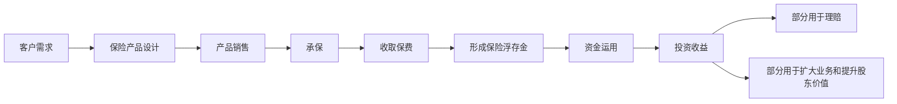

# 沃伦巴菲特的保险业价值链分析

> 关键词：沃伦巴菲特、保险业、价值链、保险业务模式、投资策略、价值创造、风险管控

> 摘要：本文旨在深入剖析沃伦巴菲特的保险业价值链。通过对巴菲特所掌控的保险业务从前端承保到后端投资等各个环节的分析，揭示其独特的价值创造逻辑和经营策略。探讨巴菲特如何利用保险浮存金进行投资以获取超额收益，以及他在风险管控、业务拓展等方面的卓越方法。理解巴菲特的保险业价值链不仅有助于深入了解保险行业的运作模式，也能为投资者和从业者提供宝贵的借鉴和启示，洞察其在保险领域长期成功的秘诀。

## 1. 背景介绍 
### 1.1 目的和范围
本文的主要目的是全面分析沃伦巴菲特的保险业价值链，探究其保险业务运营的各个环节以及这些环节之间的协同关系。范围涵盖了巴菲特旗下保险业务的承保策略、资金运用、风险管理、客户关系管理等多个方面，旨在揭示其如何通过独特的商业模式在保险领域创造巨大价值，并对整个投资领域产生深远影响。

### 1.2 预期读者
本文预期读者包括保险行业从业者、投资者、金融领域研究人员以及对沃伦巴菲特投资理念和商业模式感兴趣的人士。通过阅读本文，他们可以深入了解巴菲特的保险业运营模式，从中获取有价值的信息和启示，应用于实际的业务决策和投资实践中。

### 1.3 文档结构概述
本文将按照以下结构展开：首先介绍相关的背景知识和核心概念，包括保险业价值链的基本原理和架构；接着详细阐述核心算法原理和具体操作步骤，这里将结合保险业务的实际流程进行分析；然后介绍数学模型和公式，通过量化分析来进一步理解巴菲特的保险业务策略；之后通过项目实战，展示实际的代码案例和详细解释说明；再探讨其实际应用场景；推荐相关的工具和资源；最后总结未来发展趋势与挑战，并提供常见问题与解答以及扩展阅读和参考资料。

### 1.4 术语表
#### 1.4.1 核心术语定义
- **保险浮存金**：是指保险公司在收到保费和支付赔款之间的时间差内所持有和使用的资金。这笔资金不属于保险公司的资产，但保险公司可以在一定时间内自由支配，用于投资等活动。
- **承保利润**：是指保险公司在保险业务经营中，通过收取的保费收入扣除赔付支出、营业费用等成本后所获得的利润。
- **投资收益**：是指保险公司运用保险资金进行投资所获得的收益，包括股息、利息、资本利得等。

#### 1.4.2 相关概念解释
- **价值链**：是指企业为了创造价值而进行的一系列活动的集合，这些活动包括基本活动和支持活动。在保险业中，价值链涵盖了从产品设计、销售、承保、理赔到资金运用等多个环节。
- **风险管控**：是指保险公司通过识别、评估和控制风险，以确保公司的稳健运营和可持续发展。在巴菲特的保险业中，风险管控贯穿于业务的各个环节。

#### 1.4.3 缩略词列表
- **ROE**：Return on Equity，净资产收益率，用于衡量公司运用自有资本的效率。
- **P/C**：Property and Casualty，财产和意外险。

## 2. 核心概念与联系 

### 2.1 保险业价值链原理
保险业价值链是一个复杂的系统，它涉及到多个环节和参与者。从宏观层面来看，保险业价值链的起点是客户需求，保险公司通过开发各种保险产品来满足客户的风险保障需求。在产品销售阶段，保险公司通过各种渠道将产品推向市场，吸引客户购买。承保环节是保险公司对客户的风险进行评估和定价，决定是否接受客户的投保申请以及确定保费水平。理赔环节则是在保险事故发生后，保险公司按照合同约定向客户支付赔款。而资金运用环节则是保险公司将收取的保费和保险浮存金进行投资，以获取投资收益。

### 2.2 沃伦巴菲特保险业价值链架构
巴菲特的保险业价值链具有独特的架构。其核心在于保险浮存金的运用。在承保方面，巴菲特旗下的保险公司注重选择风险可控、具有长期稳定现金流的业务，以确保保险浮存金的规模和稳定性。在资金运用方面，巴菲特凭借其卓越的投资眼光和策略，将保险浮存金投资于具有长期竞争优势的企业，获取高额的投资收益。这种承保和投资的协同运作，形成了巴菲特保险业独特的价值创造模式。

### 2.3 文本示意图
沃伦巴菲特的保险业价值链可以用以下文本描述：
客户需求 -> 保险产品设计 -> 产品销售 -> 承保（风险评估、定价） -> 收取保费（形成保险浮存金） -> 资金运用（投资优质企业） -> 投资收益 -> 部分用于理赔 -> 部分用于扩大业务和提升股东价值

### 2.4 Mermaid 流程图


## 3. 核心算法原理 & 具体操作步骤 

### 3.1 承保环节算法原理与操作步骤
在承保环节，巴菲特旗下的保险公司采用了一套严谨的风险评估和定价算法。其基本原理是通过对客户的风险特征进行分析，确定其发生保险事故的概率和可能的损失程度，然后根据这些信息来制定合理的保费价格。

以下是一个简化的 Python 代码示例，用于演示风险评估和保费定价的基本过程：
```python
# 定义客户风险特征类
class CustomerRisk:
    def __init__(self, age, health_status, occupation):
        self.age = age
        self.health_status = health_status
        self.occupation = occupation

    def calculate_risk_score(self):
        # 简单的风险评分计算，根据年龄、健康状况和职业进行加权计算
        risk_score = 0
        if self.age > 60:
            risk_score += 30
        elif self.age > 40:
            risk_score += 20
        else:
            risk_score += 10

        if self.health_status == "poor":
            risk_score += 30
        elif self.health_status == "average":
            risk_score += 20
        else:
            risk_score += 10

        if self.occupation == "high_risk":
            risk_score += 30
        elif self.occupation == "medium_risk":
            risk_score += 20
        else:
            risk_score += 10

        return risk_score

# 定义保费定价函数
def calculate_premium(risk_score):
    # 根据风险评分确定保费价格
    if risk_score > 60:
        premium = 1000
    elif risk_score > 40:
        premium = 500
    else:
        premium = 200
    return premium

# 示例客户信息
customer = CustomerRisk(50, "average", "medium_risk")
risk_score = customer.calculate_risk_score()
premium = calculate_premium(risk_score)

print(f"客户风险评分: {risk_score}")
print(f"保费价格: {premium}")
```
在这个示例中，我们首先定义了一个 `CustomerRisk` 类，用于表示客户的风险特征。通过 `calculate_risk_score` 方法，根据客户的年龄、健康状况和职业等信息计算出一个风险评分。然后，根据风险评分，通过 `calculate_premium` 函数确定保费价格。

### 3.2 投资环节算法原理与操作步骤
在投资环节，巴菲特采用了价值投资的策略。其核心思想是寻找被市场低估的优质企业，长期持有并分享其成长带来的收益。

以下是一个简化的 Python 代码示例，用于演示价值投资的基本过程：
```python
# 定义企业财务指标类
class CompanyFinancials:
    def __init__(self, revenue, profit, assets, liabilities):
        self.revenue = revenue
        self.profit = profit
        self.assets = assets
        self.liabilities = liabilities

    def calculate_roe(self):
        # 计算净资产收益率
        equity = self.assets - self.liabilities
        if equity == 0:
            return 0
        return self.profit / equity

    def calculate_pb_ratio(self):
        # 计算市净率
        equity = self.assets - self.liabilities
        if equity == 0:
            return 0
        # 假设市值为 1000（这里简化处理）
        market_value = 1000
        return market_value / equity

# 定义价值投资筛选函数
def value_investment_screening(companies):
    undervalued_companies = []
    for company in companies:
        roe = company.calculate_roe()
        pb_ratio = company.calculate_pb_ratio()
        if roe > 0.15 and pb_ratio < 1.5:
            undervalued_companies.append(company)
    return undervalued_companies

# 示例企业信息
company1 = CompanyFinancials(1000, 200, 2000, 1000)
company2 = CompanyFinancials(800, 100, 1500, 1200)
companies = [company1, company2]

undervalued_companies = value_investment_screening(companies)
print("被低估的企业数量:", len(undervalued_companies))
```
在这个示例中，我们首先定义了一个 `CompanyFinancials` 类，用于表示企业的财务指标。通过 `calculate_roe` 方法计算企业的净资产收益率，通过 `calculate_pb_ratio` 方法计算市净率。然后，通过 `value_investment_screening` 函数筛选出净资产收益率大于 15% 且市净率小于 1.5 的企业，这些企业被认为是被低估的优质企业。

## 4. 数学模型和公式 & 详细讲解 & 举例说明 

### 4.1 承保环节数学模型和公式
在承保环节，常用的数学模型是风险评估模型和保费定价模型。

#### 风险评估模型
风险评估模型通常基于概率论和统计学原理，通过对大量历史数据的分析，确定不同风险因素与保险事故发生概率之间的关系。一种简单的风险评估模型可以表示为：
$$R = \sum_{i=1}^{n} w_i x_i$$
其中，$R$ 表示风险评分，$w_i$ 表示第 $i$ 个风险因素的权重，$x_i$ 表示第 $i$ 个风险因素的取值。

例如，在前面的 Python 代码示例中，年龄、健康状况和职业就是风险因素，每个因素都有相应的权重，通过加权求和得到风险评分。

#### 保费定价模型
保费定价模型通常基于风险评估结果和保险公司的成本、利润目标等因素来确定。一种简单的保费定价模型可以表示为：
$$P = kR + C$$
其中，$P$ 表示保费价格，$k$ 表示风险系数，$R$ 表示风险评分，$C$ 表示固定成本。

例如，在前面的 Python 代码示例中，根据风险评分的不同范围，确定不同的保费价格，这可以看作是一种简化的保费定价模型。

### 4.2 投资环节数学模型和公式
在投资环节，常用的数学模型和公式包括净资产收益率（ROE）、市净率（PB）等。

#### 净资产收益率（ROE）
净资产收益率是衡量企业盈利能力的重要指标，其计算公式为：
$$ROE = \frac{净利润}{净资产}$$
其中，净利润是指企业在一定时期内的盈利，净资产是指企业的资产减去负债后的余额。

例如，在前面的 Python 代码示例中，通过 `calculate_roe` 方法计算企业的净资产收益率。

#### 市净率（PB）
市净率是衡量企业估值的重要指标，其计算公式为：
$$PB = \frac{市值}{净资产}$$
其中，市值是指企业的市场价值，净资产是指企业的资产减去负债后的余额。

例如，在前面的 Python 代码示例中，通过 `calculate_pb_ratio` 方法计算企业的市净率。

## 5. 项目实战：代码实际案例和详细解释说明 

### 5.1  开发环境搭建
为了运行前面的 Python 代码示例，需要搭建一个基本的 Python 开发环境。以下是具体步骤：

1. **安装 Python**：从 Python 官方网站（https://www.python.org/downloads/）下载并安装适合你操作系统的 Python 版本。建议安装 Python 3.x 版本。
2. **安装开发工具**：可以选择安装 PyCharm、VS Code 等开发工具。这里以 VS Code 为例，从 VS Code 官方网站（https://code.visualstudio.com/）下载并安装。
3. **安装 Python 扩展**：打开 VS Code，在扩展市场中搜索并安装 Python 扩展。

### 5.2  源代码详细实现和代码解读
以下是前面两个 Python 代码示例的详细实现和代码解读：

#### 承保环节代码
```python
# 定义客户风险特征类
class CustomerRisk:
    def __init__(self, age, health_status, occupation):
        # 初始化客户的年龄、健康状况和职业
        self.age = age
        self.health_status = health_status
        self.occupation = occupation

    def calculate_risk_score(self):
        # 简单的风险评分计算，根据年龄、健康状况和职业进行加权计算
        risk_score = 0
        if self.age > 60:
            risk_score += 30
        elif self.age > 40:
            risk_score += 20
        else:
            risk_score += 10

        if self.health_status == "poor":
            risk_score += 30
        elif self.health_status == "average":
            risk_score += 20
        else:
            risk_score += 10

        if self.occupation == "high_risk":
            risk_score += 30
        elif self.occupation == "medium_risk":
            risk_score += 20
        else:
            risk_score += 10

        return risk_score

# 定义保费定价函数
def calculate_premium(risk_score):
    # 根据风险评分确定保费价格
    if risk_score > 60:
        premium = 1000
    elif risk_score > 40:
        premium = 500
    else:
        premium = 200
    return premium

# 示例客户信息
customer = CustomerRisk(50, "average", "medium_risk")
risk_score = customer.calculate_risk_score()
premium = calculate_premium(risk_score)

print(f"客户风险评分: {risk_score}")
print(f"保费价格: {premium}")
```
**代码解读**：
- `CustomerRisk` 类：用于表示客户的风险特征，通过 `__init__` 方法初始化客户的年龄、健康状况和职业。
- `calculate_risk_score` 方法：根据客户的年龄、健康状况和职业进行加权计算，得到风险评分。
- `calculate_premium` 函数：根据风险评分确定保费价格。
- 示例部分：创建一个客户对象，计算其风险评分和保费价格，并打印输出。

#### 投资环节代码
```python
# 定义企业财务指标类
class CompanyFinancials:
    def __init__(self, revenue, profit, assets, liabilities):
        # 初始化企业的收入、利润、资产和负债
        self.revenue = revenue
        self.profit = profit
        self.assets = assets
        self.liabilities = liabilities

    def calculate_roe(self):
        # 计算净资产收益率
        equity = self.assets - self.liabilities
        if equity == 0:
            return 0
        return self.profit / equity

    def calculate_pb_ratio(self):
        # 计算市净率
        equity = self.assets - self.liabilities
        if equity == 0:
            return 0
        # 假设市值为 1000（这里简化处理）
        market_value = 1000
        return market_value / equity

# 定义价值投资筛选函数
def value_investment_screening(companies):
    undervalued_companies = []
    for company in companies:
        roe = company.calculate_roe()
        pb_ratio = company.calculate_pb_ratio()
        if roe > 0.15 and pb_ratio < 1.5:
            undervalued_companies.append(company)
    return undervalued_companies

# 示例企业信息
company1 = CompanyFinancials(1000, 200, 2000, 1000)
company2 = CompanyFinancials(800, 100, 1500, 1200)
companies = [company1, company2]

undervalued_companies = value_investment_screening(companies)
print("被低估的企业数量:", len(undervalued_companies))
```
**代码解读**：
- `CompanyFinancials` 类：用于表示企业的财务指标，通过 `__init__` 方法初始化企业的收入、利润、资产和负债。
- `calculate_roe` 方法：计算企业的净资产收益率。
- `calculate_pb_ratio` 方法：计算企业的市净率。
- `value_investment_screening` 函数：筛选出净资产