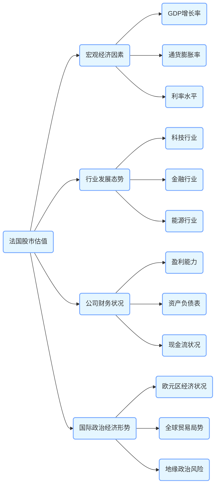

# 法国股市估值:欧元区重要经济体的投资价值

> 关键词：法国股市估值、欧元区、投资价值、经济分析、股市指标

> 摘要：本文聚焦于法国股市估值，深入探讨作为欧元区重要经济体的法国其股市所蕴含的投资价值。通过对相关核心概念、算法原理、数学模型的详细分析，结合项目实战案例，阐述法国股市的特点和影响因素。同时，介绍法国股市在实际中的应用场景，推荐学习资源、开发工具以及相关论文著作，最后总结其未来发展趋势与挑战，并对常见问题进行解答。旨在为投资者全面了解法国股市估值和投资价值提供专业且深入的参考。

## 1. 背景介绍 
### 1.1 目的和范围
本研究旨在全面评估法国股市的估值情况，深入剖析其作为欧元区重要经济体所具备的投资价值。研究范围涵盖法国主要的股票市场指数，如CAC 40指数，分析影响法国股市估值的宏观经济因素、行业发展态势以及企业财务状况等。同时，探讨不同投资策略在法国股市中的适用性，为投资者提供决策依据。

### 1.2 预期读者
本文预期读者包括对法国股市投资感兴趣的个人投资者、金融机构的投资分析师、从事国际金融研究的学者以及关注欧元区经济和金融市场动态的相关人士。

### 1.3 文档结构概述
本文首先介绍背景信息，包括研究目的、预期读者和文档结构。接着阐述核心概念与联系，包括法国股市相关的重要概念和它们之间的逻辑关系，并通过示意图和流程图展示。然后详细讲解核心算法原理和具体操作步骤，结合Python代码进行说明。随后介绍数学模型和公式，并举例说明其应用。再通过项目实战案例，包括开发环境搭建、源代码实现和代码解读，深入分析法国股市估值。之后探讨实际应用场景，推荐相关的学习资源、开发工具和论文著作。最后总结法国股市的未来发展趋势与挑战，解答常见问题并提供扩展阅读和参考资料。

### 1.4 术语表
#### 1.4.1 核心术语定义
- **法国股市估值**：指对法国股票市场中各类股票或整个市场价值的评估，通常通过多种指标和方法来衡量。
- **CAC 40指数**：法国巴黎证券交易所编制的反映法国股市中40家最大上市公司股价表现的指数，是法国股市的重要风向标。
- **市盈率（P/E）**：股票价格除以每股收益的比率，用于衡量股票的估值水平，反映投资者为获取公司每一元盈利所愿意支付的价格。
- **市净率（P/B）**：股票价格与每股净资产的比率，体现了市场对公司净资产的估值。

#### 1.4.2 相关概念解释
- **宏观经济因素**：包括国内生产总值（GDP）增长率、通货膨胀率、利率水平等，这些因素会对法国股市整体的估值和投资价值产生重要影响。例如，GDP增长率较高时，企业盈利可能增加，推动股市上涨；利率上升可能导致资金从股市流向债券市场，压低股市估值。
- **行业发展态势**：不同行业在法国股市中的表现差异较大，一些新兴行业如科技、医疗保健可能具有较高的增长潜力，而传统行业如能源、制造业则受到市场环境和国际竞争的影响。了解行业发展态势有助于评估不同行业股票的投资价值。

#### 1.4.3 缩略词列表
- **CAC 40**：Cotation Assistée en Continu 40
- **P/E**：Price-to-Earnings Ratio
- **P/B**：Price-to-Book Ratio
- **GDP**：Gross Domestic Product

## 2. 核心概念与联系 

### 核心概念原理
#### 法国股市的构成
法国股市主要由巴黎证券交易所（Euronext Paris）主导，其中CAC 40指数是最具代表性的指数。该指数涵盖了法国不同行业的40家大型上市公司，其表现反映了法国股市的整体趋势。这些上市公司涉及金融、能源、消费、工业等多个领域，行业分布较为广泛。

#### 股市估值的基本原理
股市估值是基于对公司未来盈利能力和资产价值的预期。常用的估值指标如市盈率（P/E）和市净率（P/B），通过将股票价格与公司的盈利或净资产进行比较，来判断股票是否被高估或低估。例如，较低的市盈率可能意味着股票被低估，具有投资价值；而较高的市盈率则可能表示市场对该股票的预期过高，存在一定的风险。

#### 影响法国股市估值的因素
宏观经济因素是影响法国股市估值的重要因素之一。法国作为欧元区的重要经济体，其经济增长、通货膨胀、利率等宏观经济指标会对股市产生直接或间接的影响。此外，行业发展态势、公司财务状况、国际政治经济形势等也会影响法国股市的估值。

### 架构的文本示意图
```plaintext
法国股市估值
|
|-- 宏观经济因素
|   |-- GDP增长率
|   |-- 通货膨胀率
|   |-- 利率水平
|
|-- 行业发展态势
|   |-- 科技行业
|   |-- 金融行业
|   |-- 能源行业
|
|-- 公司财务状况
|   |-- 盈利能力
|   |-- 资产负债表
|   |-- 现金流状况
|
|-- 国际政治经济形势
|   |-- 欧元区经济状况
|   |-- 全球贸易局势
|   |-- 地缘政治风险
```

### Mermaid流程图


## 3. 核心算法原理 & 具体操作步骤 

### 市盈率（P/E）计算原理及Python代码实现
#### 原理
市盈率（P/E）是衡量股票估值的常用指标，计算公式为：
$$P/E = \frac{股票价格}{每股收益}$$
其中，股票价格是当前股票在市场上的交易价格，每股收益是公司净利润除以总股本得到的值。

#### Python代码实现
```python
def calculate_pe(stock_price, earnings_per_share):
    """
    计算市盈率
    :param stock_price: 股票价格
    :param earnings_per_share: 每股收益
    :return: 市盈率
    """
    if earnings_per_share == 0:
        return float('inf')  # 避免除零错误
    return stock_price / earnings_per_share

# 示例数据
stock_price = 50
earnings_per_share = 5

pe_ratio = calculate_pe(stock_price, earnings_per_share)
print(f"市盈率: {pe_ratio}")
```

### 市净率（P/B）计算原理及Python代码实现
#### 原理
市净率（P/B）反映了市场对公司净资产的估值，计算公式为：
$$P/B = \frac{股票价格}{每股净资产}$$
其中，每股净资产是公司净资产除以总股本得到的值。

#### Python代码实现
```python
def calculate_pb(stock_price, book_value_per_share):
    """
    计算市净率
    :param stock_price: 股票价格
    :param book_value_per_share: 每股净资产
    :return: 市净率
    """
    if book_value_per_share == 0:
        return float('inf')  # 避免除零错误
    return stock_price / book_value_per_share

# 示例数据
stock_price = 50
book_value_per_share = 10

pb_ratio = calculate_pb(stock_price, book_value_per_share)
print(f"市净率: {pb_ratio}")
```

### 具体操作步骤
1. **数据收集**：获取法国股市中目标股票的当前价格、每股收益和每股净资产等数据。这些数据可以通过金融数据提供商如雅虎财经、彭博社等获取。
2. **计算估值指标**：使用上述Python代码，将收集到的数据作为输入，计算市盈率和市净率。
3. **分析估值结果**：将计算得到的市盈率和市净率与同行业其他公司或历史数据进行比较，判断股票的估值水平。如果市盈率和市净率低于行业平均水平，可能表示股票被低估，具有投资价值；反之，则可能被高估。

## 4. 数学模型和公式 & 详细讲解 & 举例说明 

### 股息贴现模型（DDM）
#### 公式
股息贴现模型是一种基于股票未来股息现金流折现的估值模型，基本公式为：
$$V = \sum_{t=1}^{\infty} \frac{D_t}{(1 + r)^t}$$
其中，$V$ 是股票的内在价值，$D_t$ 是第 $t$ 期的股息，$r$ 是贴现率。

#### 详细讲解
该模型的核心思想是将股票的价值视为其未来所有股息现金流的现值之和。贴现率 $r$ 反映了投资者对该股票的预期收益率，通常可以使用资本资产定价模型（CAPM）来确定。

#### 举例说明
假设某法国公司预计未来每年支付的股息为 $D = 2$ 欧元，投资者要求的预期收益率 $r = 0.1$。则该股票的内在价值为：
$$V = \frac{2}{0.1} = 20 \text{ 欧元}$$
如果该股票的当前市场价格低于20欧元，则可能被低估，具有投资价值；反之，则可能被高估。

### 资本资产定价模型（CAPM）
#### 公式
资本资产定价模型用于计算股票的预期收益率，公式为：
$$E(R_i) = R_f + \beta_i \times [E(R_m) - R_f]$$
其中，$E(R_i)$ 是股票 $i$ 的预期收益率，$R_f$ 是无风险利率，$\beta_i$ 是股票 $i$ 的贝塔系数，$E(R_m)$ 是市场组合的预期收益率。

#### 详细讲解
该模型认为，股票的预期收益率由无风险利率和风险溢价两部分组成。贝塔系数 $\beta_i$ 衡量了股票 $i$ 的系统性风险，即股票价格波动与市场整体波动的相关性。

#### 举例说明
假设无风险利率 $R_f = 0.02$，市场组合的预期收益率 $E(R_m) = 0.1$，某法国股票的贝塔系数 $\beta_i = 1.2$。则该股票的预期收益率为：
$$E(R_i) = 0.02 + 1.2 \times (0.1 - 0.02) = 0.116 = 11.6\%$$

## 5. 项目实战：代码实际案例和详细解释说明 

### 5.1  开发环境搭建
#### 安装Python
首先，需要安装Python编程语言。可以从Python官方网站（https://www.python.org/downloads/）下载适合自己操作系统的Python版本，并按照安装向导进行安装。

#### 安装必要的库
在Python环境中，需要安装一些用于数据获取、处理和分析的库，如`pandas`、`yfinance`等。可以使用以下命令进行安装：
```sh
pip install pandas yfinance
```

### 5.2  源代码详细实现和代码解读
```python
import yfinance as yf
import pandas as pd

# 定义要分析的法国股票代码
stock_symbol = 'AIR.PA'  # 空中客车公司的股票代码

# 获取股票数据
stock = yf.Ticker(stock_symbol)
data = stock.history(period='1y')

# 计算市盈率和市净率
info = stock.info
stock_price = info['currentPrice']
earnings_per_share = info['trailingEps']
book_value_per_share = info['bookValue']

pe_ratio = stock_price / earnings_per_share
pb_ratio = stock_price / book_value_per_share

print(f"股票代码: {stock_symbol}")
print(f"当前价格: {stock_price}")
print(f"每股收益: {earnings_per_share}")
print(f"每股净资产: {book_value_per_share}")
print(f"市盈率: {pe_ratio}")
print(f"市净率: {pb_ratio}")

# 绘制股票价格走势图
import matplotlib.pyplot as plt

plt.figure(figsize=(12, 6))
plt.plot(data['Close'])
plt.title(f"{stock_symbol} Stock Price")
plt.xlabel('Date')
plt.ylabel('Price (EUR)')
plt.show()
```

### 5.3  代码解读与分析
1. **导入必要的库**：`yfinance` 用于获取股票数据，`pandas` 用于数据处理，`matplotlib` 用于绘制图表。
2. **定义股票代码**：选择要分析的法国股票代码，这里以空中客车公司（AIR.PA）为例。
3. **获取股票数据**：使用 `yfinance` 的 `Ticker` 类获取股票的历史数据和基本信息。
4. **计算市盈率和市净率**：从股票信息中提取当前价格、每股收益和每股净资产，然后计算市盈率和市净率。
5. **打印结果**：将计算得到的结果打印输出，方便分析。
6. **绘制股票价格走势图**：使用 `matplotlib` 绘制股票的收盘价走势图，直观展示股票价格的变化趋势。

## 6. 实际应用场景 
### 个人投资者决策
个人投资者可以通过分析法国股市的估值情况，选择具有投资价值的股票进行投资。例如，当某只股票的市盈率和市净率低于行业平均水平，且公司具有良好的发展前景时，投资者可以考虑买入该股票。同时，投资者还可以根据宏观经济因素和行业发展态势，调整自己的投资组合，降低投资风险。

### 金融机构资产配置
金融机构如基金公司、保险公司等在进行资产配置时，会考虑法国股市的投资价值。他们会根据对法国股市估值的分析，决定在投资组合中分配多少资金到法国股票市场。例如，如果预计法国股市在未来一段时间内将上涨，金融机构可能会增加对法国股票的投资比例。

### 学术研究和政策制定
学术界可以通过对法国股市估值的研究，深入了解法国经济的运行状况和金融市场的发展规律。政府和监管机构也可以根据法国股市的估值情况，制定相应的宏观经济政策和金融监管政策，促进法国经济的稳定发展和金融市场的健康运行。

## 7. 工具和资源推荐
### 7.1 学习资源推荐
#### 7.1.1 书籍推荐
- 《聪明的投资者》（The Intelligent Investor）：本杰明·格雷厄姆（Benjamin Graham）著，是价值投资领域的经典著作，介绍了股票投资的基本原理和方法。
- 《金融市场与金融机构》（Financial Markets and Institutions）：弗雷德里克·S·米什金（Frederic S. Mishkin）著，系统介绍了金融市场和金融机构的运作机制，对理解股票市场有很大帮助。

#### 7.1.2 在线课程
- Coursera上的“投资学原理”（Principles of Investments）课程：由知名大学教授授课，涵盖了投资组合理论、资产定价模型等内容。
- edX上的“金融市场”（Financial Markets）课程：耶鲁大学教授罗伯特·希勒（Robert Shiller）主讲，深入探讨了金融市场的各种现象和理论。

#### 7.1.3 技术博客和网站
- Seeking Alpha：提供全球股票市场的分析和评论，包括法国股市的相关内容。
- Investing.com：提供实时股票行情、财经新闻和数据分析工具，方便投资者了解法国股市的动态。

### 7.2 开发工具框架推荐
#### 7.2.1 IDE和编辑器
- PyCharm：是一款专业的Python集成开发环境，具有代码编辑、调试、自动补全等功能，适合开发Python程序。
- Jupyter Notebook：是一个交互式的开发环境，支持代码、文本、图表等多种形式的展示，方便进行数据分析和可视化。

#### 7.2.2 调试和性能分析工具
- pdb：Python自带的调试工具，可以帮助开发者定位和解决代码中的问题。
- cProfile：用于分析Python程序的性能，找出程序中的瓶颈部分。

#### 7.2.3 相关框架和库
- yfinance：用于获取股票市场数据，支持全球多个股票市场，包括法国股市。
- pandas：是一个强大的数据处理和分析库，提供了丰富的数据结构和函数，方便进行数据清洗、分析和可视化。

### 7.3 相关论文著作推荐
#### 7.3.1 经典论文
- Fama, E. F., & French, K. R. (1992). The cross-section of expected stock returns. The Journal of Finance, 47(2), 427-465. 该论文提出了著名的Fama-French三因子模型，对股票收益率的横截面进行了深入研究。
- Sharpe, W. F. (1964). Capital asset prices: A theory of market equilibrium under conditions of risk. The Journal of Finance, 19(3), 425-442. 这是资本资产定价模型（CAPM）的经典论文，奠定了现代金融理论的基础。

#### 7.3.2 最新研究成果
- 通过学术数据库如IEEE Xplore、ACM Digital Library等，可以搜索到关于法国股市估值和投资价值的最新研究成果。这些研究通常结合了最新的理论和方法，对法国股市的分析更加深入和全面。

#### 7.3.3 应用案例分析
- 一些金融研究机构和咨询公司会发布关于法国股市的应用案例分析报告，这些报告通过实际案例展示了如何运用不同的方法和指标评估法国股市的投资价值，对投资者和研究人员具有很高的参考价值。

## 8. 总结：未来发展趋势与挑战
### 未来发展趋势
#### 数字化转型推动科技股发展
随着全球数字化转型的加速，法国的科技行业有望迎来快速发展。科技公司在创新能力和市场竞争力方面不断提升，可能会在法国股市中占据更重要的地位，推动科技股的估值上升。

#### 绿色能源和可持续发展投资增加
在全球应对气候变化的背景下，法国政府高度重视绿色能源和可持续发展。相关企业如可再生能源、环保科技等领域的公司可能会获得更多的政策支持和投资机会，从而提升其在股市中的表现。

#### 与欧元区和全球市场的联动性增强
法国作为欧元区的重要经济体，其股市与欧元区其他国家以及全球市场的联动性将不断增强。全球经济形势、国际贸易政策和地缘政治风险等因素对法国股市的影响将更加明显。

### 挑战
#### 宏观经济不确定性
法国经济面临着诸多宏观经济不确定性，如全球经济增长放缓、贸易摩擦、通货膨胀压力等。这些因素可能会影响企业的盈利状况和投资者的信心，对法国股市的估值产生负面影响。

#### 金融市场波动加剧
随着金融市场的全球化和金融创新的不断发展，金融市场的波动性可能会加剧。法国股市可能会受到全球金融市场波动的冲击，增加投资者的风险。

#### 监管政策变化
法国政府和监管机构可能会出台新的金融监管政策，对股市的交易规则、信息披露等方面进行调整。这些政策变化可能会对市场参与者的行为产生影响，增加市场的不确定性。

## 9. 附录：常见问题与解答
### 问题1：如何获取法国股市的实时数据？
可以通过金融数据提供商如雅虎财经、彭博社、路透社等获取法国股市的实时数据。此外，一些金融交易软件如东方财富、同花顺等也提供部分法国股市的实时行情。

### 问题2：法国股市与其他国家股市有什么不同？
法国股市具有其自身的特点。一方面，法国拥有一些具有全球竞争力的大型企业，如空中客车、道达尔等，这些企业的表现对法国股市影响较大。另一方面，法国股市受到欧元区经济和政策的影响较为明显，与欧元区其他国家股市的联动性较强。

### 问题3：市盈率和市净率的数值多少才合理？
市盈率和市净率的合理数值没有固定的标准，会受到行业、市场环境、公司发展阶段等多种因素的影响。一般来说，可以将目标股票的市盈率和市净率与同行业其他公司或历史数据进行比较，来判断其估值是否合理。

### 问题4：投资法国股市需要注意哪些风险？
投资法国股市需要注意宏观经济风险、政治风险、汇率风险等。宏观经济形势的变化可能会影响企业的盈利和股市的表现；政治不稳定可能会导致市场波动；汇率波动可能会影响投资的实际收益。

## 10. 扩展阅读 & 参考资料
### 扩展阅读
- 《欧洲金融市场》：深入介绍了欧洲金融市场的结构、运行机制和发展趋势，有助于进一步了解法国股市在欧洲金融市场中的地位和作用。
- 《国际投资学》：涵盖了国际投资的理论、方法和实践，对投资法国股市等国际市场具有重要的指导意义。

### 参考资料
- 法国国家统计局（INSEE）发布的经济数据和统计报告，为分析法国宏观经济形势提供了重要依据。
- 巴黎证券交易所（Euronext Paris）的官方网站，提供了法国股市的交易规则、上市公司信息等资料。

作者：AI天才研究院/AI Genius Institute & 禅与计算机程序设计艺术 /Zen And The Art of Computer Programming