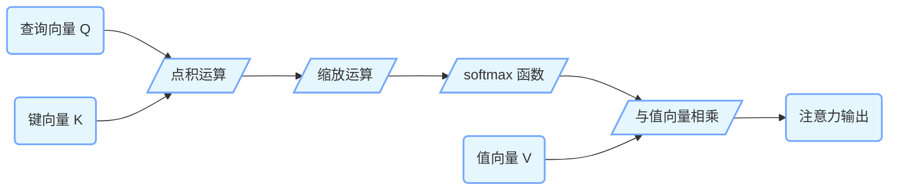
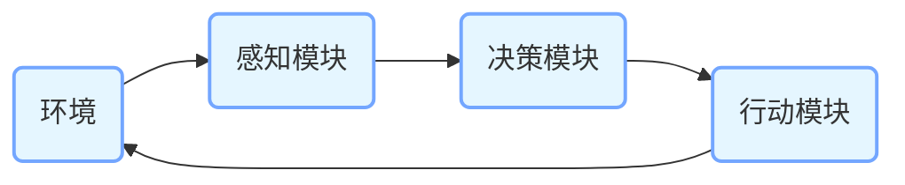
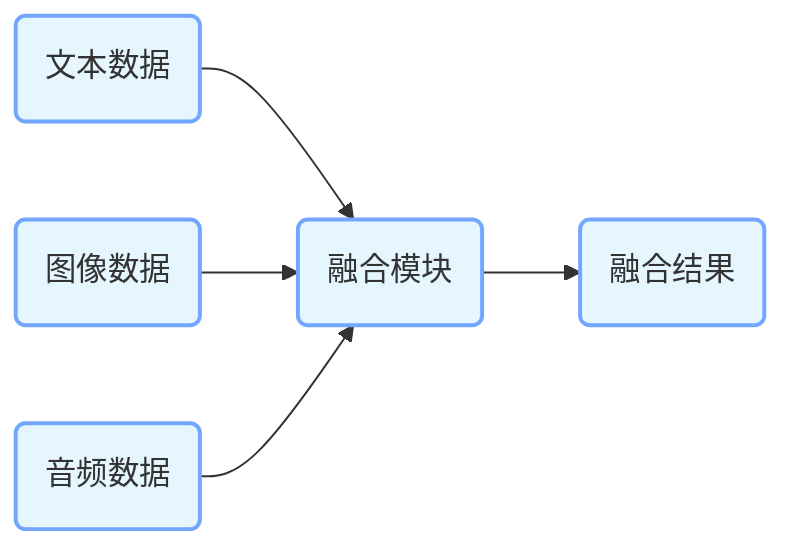
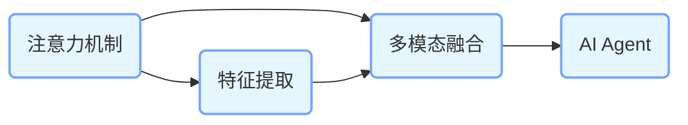

# 注意力机制在AI Agent多模态融合中的应用

> 关键词：注意力机制、AI Agent、多模态融合、深度学习、特征提取、信息处理

> 摘要：本文深入探讨了注意力机制在AI Agent多模态融合中的应用。首先介绍了相关背景，包括研究目的、预期读者、文档结构和术语表。接着阐述了核心概念，如注意力机制、AI Agent和多模态融合，并给出了原理和架构的示意图与流程图。详细讲解了核心算法原理，使用Python代码进行了示例说明。同时，给出了相关的数学模型和公式，并举例解释。通过项目实战，展示了代码实现和详细解读。分析了注意力机制在AI Agent多模态融合中的实际应用场景，推荐了学习资源、开发工具框架和相关论文著作。最后总结了未来发展趋势与挑战，解答了常见问题，并提供了扩展阅读和参考资料。

## 1. 背景介绍 
### 1.1 目的和范围
随着人工智能技术的不断发展，AI Agent需要处理越来越复杂的任务，而多模态数据的融合能够为AI Agent提供更全面、丰富的信息。注意力机制作为一种强大的信息处理工具，能够帮助AI Agent在多模态数据中聚焦重要信息，提高处理效率和准确性。本文的目的在于深入研究注意力机制在AI Agent多模态融合中的应用原理、方法和实际效果，为相关领域的研究和开发提供理论支持和实践指导。

本文的范围涵盖了注意力机制的基本概念、核心算法原理，AI Agent多模态融合的基本框架，以及如何将注意力机制应用于多模态融合的具体步骤和方法。同时，通过实际案例分析和代码实现，展示了注意力机制在多模态融合中的应用效果。

### 1.2 预期读者
本文的预期读者包括人工智能领域的研究人员、开发人员、学生以及对AI Agent和多模态融合感兴趣的技术爱好者。对于有一定深度学习基础的读者，本文将帮助他们深入理解注意力机制在多模态融合中的应用原理和实现方法；对于初学者，本文也会提供相关概念的详细解释和代码示例，帮助他们快速入门。

### 1.3 文档结构概述
本文共分为十个部分，具体结构如下：
1. 背景介绍：介绍研究目的、预期读者、文档结构和术语表。
2. 核心概念与联系：阐述注意力机制、AI Agent和多模态融合的核心概念，给出原理和架构的示意图与流程图。
3. 核心算法原理 & 具体操作步骤：详细讲解注意力机制的核心算法原理，使用Python代码进行示例说明。
4. 数学模型和公式 & 详细讲解 & 举例说明：给出注意力机制和多模态融合的数学模型和公式，并举例解释。
5. 项目实战：代码实际案例和详细解释说明：通过实际项目，展示注意力机制在多模态融合中的代码实现和详细解读。
6. 实际应用场景：分析注意力机制在AI Agent多模态融合中的实际应用场景。
7. 工具和资源推荐：推荐学习资源、开发工具框架和相关论文著作。
8. 总结：未来发展趋势与挑战：总结注意力机制在AI Agent多模态融合中的未来发展趋势和面临的挑战。
9. 附录：常见问题与解答：解答读者在阅读过程中可能遇到的常见问题。
10. 扩展阅读 & 参考资料：提供相关的扩展阅读和参考资料，方便读者进一步深入学习。

### 1.4 术语表
#### 1.4.1 核心术语定义
- **注意力机制（Attention Mechanism）**：一种模仿人类注意力的信息处理机制，能够在大量信息中聚焦重要信息，提高信息处理效率和准确性。
- **AI Agent**：具有自主决策和行动能力的人工智能实体，能够感知环境、处理信息并做出相应的决策和行动。
- **多模态融合（Multimodal Fusion）**：将来自不同模态（如文本、图像、音频等）的数据进行融合，以获取更全面、丰富的信息。
- **特征提取（Feature Extraction）**：从原始数据中提取出具有代表性的特征，以便后续的处理和分析。
- **深度学习（Deep Learning）**：一种基于人工神经网络的机器学习方法，能够自动从大量数据中学习特征和模式。

#### 1.4.2 相关概念解释
- **模态（Modality）**：指数据的不同表现形式，如文本、图像、音频、视频等。不同模态的数据具有不同的特征和信息，通过多模态融合可以充分利用这些信息。
- **上下文信息（Context Information）**：指与当前处理的信息相关的周围信息，能够帮助更好地理解和处理当前信息。注意力机制可以通过关注上下文信息来提高信息处理的准确性。
- **权重分配（Weight Assignment）**：在注意力机制中，通过计算每个信息的重要性，为其分配相应的权重，以便在信息融合时给予不同的关注程度。

#### 1.4.3 缩略词列表
- **DNN（Deep Neural Network）**：深度神经网络
- **CNN（Convolutional Neural Network）**：卷积神经网络
- **RNN（Recurrent Neural Network）**：循环神经网络
- **LSTM（Long Short-Term Memory）**：长短期记忆网络
- **GRU（Gated Recurrent Unit）**：门控循环单元

## 2. 核心概念与联系 

### 2.1 注意力机制
注意力机制模仿了人类的注意力行为，能够在大量信息中快速聚焦重要信息。其基本思想是为不同的信息分配不同的权重，权重越大表示该信息越重要。在深度学习中，注意力机制通常通过计算注意力分数来实现权重分配。

#### 2.1.1 原理
注意力机制的核心是计算注意力分数，常见的计算方法有加法注意力、点积注意力和缩放点积注意力等。以缩放点积注意力为例，其计算过程如下：
1. 输入查询向量 $Q$、键向量 $K$ 和值向量 $V$。
2. 计算查询向量和键向量的点积：$QK^T$。
3. 对结果进行缩放：$\frac{QK^T}{\sqrt{d_k}}$，其中 $d_k$ 是键向量的维度。
4. 使用 softmax 函数将缩放后的结果转换为概率分布：$softmax(\frac{QK^T}{\sqrt{d_k}})$。
5. 将概率分布与值向量相乘，得到注意力输出：$Attention(Q, K, V) = softmax(\frac{QK^T}{\sqrt{d_k}})V$。

#### 2.1.2 架构示意图


### 2.2 AI Agent
AI Agent 是具有自主决策和行动能力的人工智能实体。它通常由感知模块、决策模块和行动模块组成。感知模块负责感知环境信息，决策模块根据感知到的信息做出决策，行动模块根据决策结果执行相应的行动。

#### 2.2.1 原理
AI Agent 的工作原理基于智能体理论，通过不断地与环境进行交互，学习和适应环境的变化。在多模态融合的场景中，AI Agent 需要处理来自不同模态的数据，以获取更全面的环境信息，从而做出更准确的决策。

#### 2.2.2 架构示意图


### 2.3 多模态融合
多模态融合是将来自不同模态的数据进行融合，以获取更全面、丰富的信息。常见的融合方法有早期融合、中期融合和晚期融合等。

#### 2.3.1 原理
多模态融合的原理是利用不同模态数据之间的互补性，将它们的信息进行整合。在融合过程中，需要考虑不同模态数据的特点和关系，选择合适的融合方法。

#### 2.3.2 架构示意图


### 2.4 核心概念之间的联系
注意力机制可以应用于AI Agent的多模态融合过程中，帮助AI Agent在不同模态的数据中聚焦重要信息，提高多模态融合的效果。具体来说，注意力机制可以在特征提取阶段对不同模态的特征进行加权处理，也可以在融合阶段对不同模态的信息进行加权融合。



## 3. 核心算法原理 & 具体操作步骤 

### 3.1 注意力机制的核心算法原理
#### 3.1.1 缩放点积注意力
缩放点积注意力是一种常用的注意力计算方法，其Python代码实现如下：
```python
import torch
import torch.nn.functional as F

def scaled_dot_product_attention(Q, K, V, mask=None):
    """
    缩放点积注意力计算
    :param Q: 查询向量，形状为 (batch_size, seq_len_q, d_k)
    :param K: 键向量，形状为 (batch_size, seq_len_k, d_k)
    :param V: 值向量，形状为 (batch_size, seq_len_k, d_v)
    :param mask: 掩码矩阵，形状为 (batch_size, seq_len_q, seq_len_k)
    :return: 注意力输出，形状为 (batch_size, seq_len_q, d_v)
    """
    d_k = Q.size(-1)
    scores = torch.matmul(Q, K.transpose(-2, -1)) / torch.sqrt(torch.tensor(d_k, dtype=torch.float32))
    
    if mask is not None:
        scores = scores.masked_fill(mask == 0, -1e9)
    
    attention_weights = F.softmax(scores, dim=-1)
    output = torch.matmul(attention_weights, V)
    return output
```
#### 3.1.2 多头注意力
多头注意力是在缩放点积注意力的基础上进行扩展，通过多个不同的注意力头并行计算，能够捕捉不同的特征信息。其Python代码实现如下：
```python
import torch
import torch.nn as nn

class MultiHeadAttention(nn.Module):
    def __init__(self, d_model, num_heads):
        super(MultiHeadAttention, self).__init__()
        assert d_model % num_heads == 0, "d_model 必须能被 num_heads 整除"
        
        self.d_model = d_model
        self.num_heads = num_heads
        self.d_k = d_model // num_heads
        
        self.W_q = nn.Linear(d_model, d_model)
        self.W_k = nn.Linear(d_model, d_model)
        self.W_v = nn.Linear(d_model, d_model)
        self.W_o = nn.Linear(d_model, d_model)
    
    def split_heads(self, x):
        """
        将输入的张量分割成多个头
        :param x: 输入张量，形状为 (batch_size, seq_len, d_model)
        :return: 分割后的张量，形状为 (batch_size, num_heads, seq_len, d_k)
        """
        batch_size, seq_len, d_model = x.size()
        return x.view(batch_size, seq_len, self.num_heads, self.d_k).transpose(1, 2)
    
    def combine_heads(self, x):
        """
        将多个头的输出合并成一个张量
        :param x: 输入张量，形状为 (batch_size, num_heads, seq_len, d_k)
        :return: 合并后的张量，形状为 (batch_size, seq_len, d_model)
        """
        batch_size, num_heads, seq_len, d_k = x.size()
        return x.transpose(1, 2).contiguous().view(batch_size, seq_len, self.d_model)
    
    def forward(self, Q, K, V, mask=None):
        """
        多头注意力前向传播
        :param Q: 查询向量，形状为 (batch_size, seq_len_q, d_model)
        :param K: 键向量，形状为 (batch_size, seq_len_k, d_model)
        :param V: 值向量，形状为 (batch_size, seq_len_k, d_model)
        :param mask: 掩码矩阵，形状为 (batch_size, seq_len_q, seq_len_k)
        :return: 多头注意力输出，形状为 (batch_size, seq_len_q, d_model)
        """
        Q = self.split_heads(self.W_q(Q))
        K = self.split_heads(self.W_k(K))
        V = self.split_heads(self.W_v(V))
        
        if mask is not None:
            mask = mask.unsqueeze(1)
        
        output = scaled_dot_product_attention(Q, K, V, mask)
        output = self.combine_heads(output)
        output = self.W_o(output)
        return output
```

### 3.2 具体操作步骤
#### 3.2.1 数据预处理
在将注意力机制应用于AI Agent多模态融合之前，需要对不同模态的数据进行预处理。具体步骤如下：
1. **数据清洗**：去除数据中的噪声、缺失值和异常值。
2. **特征提取**：从原始数据中提取出具有代表性的特征。对于文本数据，可以使用词嵌入技术；对于图像数据，可以使用卷积神经网络；对于音频数据，可以使用梅尔频率倒谱系数（MFCC）等方法。
3. **数据归一化**：将提取的特征进行归一化处理，使其具有相同的尺度。

#### 3.2.2 注意力机制的应用
在多模态融合过程中，可以在不同的阶段应用注意力机制：
1. **特征提取阶段**：在提取不同模态的特征时，可以使用注意力机制对特征进行加权处理，以突出重要的特征。
2. **融合阶段**：在将不同模态的特征进行融合时，可以使用注意力机制对不同模态的特征进行加权融合，以提高融合效果。

#### 3.2.3 模型训练和评估
在应用注意力机制进行多模态融合后，需要对模型进行训练和评估。具体步骤如下：
1. **划分数据集**：将预处理后的数据划分为训练集、验证集和测试集。
2. **选择损失函数和优化器**：根据具体的任务选择合适的损失函数和优化器。
3. **模型训练**：使用训练集对模型进行训练，调整模型的参数。
4. **模型评估**：使用验证集和测试集对训练好的模型进行评估，评估指标可以包括准确率、召回率、F1值等。

## 4. 数学模型和公式 & 详细讲解 & 举例说明 

### 4.1 缩放点积注意力的数学模型和公式
#### 4.1.1 数学模型
缩放点积注意力的数学模型可以表示为：
$$Attention(Q, K, V) = softmax(\frac{QK^T}{\sqrt{d_k}})V$$
其中，$Q$ 是查询向量，$K$ 是键向量，$V$ 是值向量，$d_k$ 是键向量的维度。

#### 4.1.2 详细讲解
- **点积运算**：$QK^T$ 计算了查询向量和键向量之间的相似度，相似度越高表示该信息越重要。
- **缩放操作**：$\frac{QK^T}{\sqrt{d_k}}$ 对相似度进行缩放，以避免点积运算的结果过大，导致 softmax 函数的梯度消失。
- **softmax 函数**：$softmax(\frac{QK^T}{\sqrt{d_k}})$ 将缩放后的相似度转换为概率分布，即注意力权重。
- **加权求和**：$softmax(\frac{QK^T}{\sqrt{d_k}})V$ 将注意力权重与值向量相乘，得到注意力输出。

#### 4.1.3 举例说明
假设查询向量 $Q$、键向量 $K$ 和值向量 $V$ 分别为：
$$Q = \begin{bmatrix}
1 & 2 \\
3 & 4
\end{bmatrix}, K = \begin{bmatrix}
5 & 6 \\
7 & 8
\end{bmatrix}, V = \begin{bmatrix}
9 & 10 \\
11 & 12
\end{bmatrix}$$
键向量的维度 $d_k = 2$，则缩放点积注意力的计算过程如下：
1. 计算点积：
$$QK^T = \begin{bmatrix}
1 & 2 \\
3 & 4
\end{bmatrix} \begin{bmatrix}
5 & 7 \\
6 & 8
\end{bmatrix} = \begin{bmatrix}
1\times5 + 2\times6 & 1\times7 + 2\times8 \\
3\times5 + 4\times6 & 3\times7 + 4\times8
\end{bmatrix} = \begin{bmatrix}
17 & 23 \\
39 & 53
\end{bmatrix}$$
2. 进行缩放：
$$\frac{QK^T}{\sqrt{d_k}} = \frac{1}{\sqrt{2}} \begin{bmatrix}
17 & 23 \\
39 & 53
\end{bmatrix} \approx \begin{bmatrix}
12.02 & 16.26 \\
27.58 & 37.43
\end{bmatrix}$$
3. 使用 softmax 函数计算注意力权重：
$$softmax(\frac{QK^T}{\sqrt{d_k}}) = \begin{bmatrix}
\frac{e^{12.02}}{e^{12.02} + e^{16.26}} & \frac{e^{16.26}}{e^{12.02} + e^{16.26}} \\
\frac{e^{27.58}}{e^{27.58} + e^{37.43}} & \frac{e^{37.43}}{e^{27.58} + e^{37.43}}
\end{bmatrix} \approx \begin{bmatrix}
0.01 & 0.99 \\
0.00 & 1.00
\end{bmatrix}$$
4. 计算注意力输出：
$$Attention(Q, K, V) = softmax(\frac{QK^T}{\sqrt{d_k}})V = \begin{bmatrix}
0.01 & 0.99 \\
0.00 & 1.00
\end{bmatrix} \begin{bmatrix}
9 & 10 \\
11 & 12
\end{bmatrix} \approx \begin{bmatrix}
10.98 & 11.98 \\
11.00 & 12.00
\end{bmatrix}$$

### 4.2 多头注意力的数学模型和公式
#### 4.2.1 数学模型
多头注意力的数学模型可以表示为：
$$MultiHead(Q, K, V) = Concat(head_1, head_2, \cdots, head_h)W^O$$
其中，$head_i = Attention(QW_i^Q, KW_i^K, VW_i^V)$，$h$ 是头的数量，$W_i^Q$、$W_i^K$、$W_i^V$ 是投影矩阵，$W^O$ 是输出投影矩阵。

#### 4.2.2 详细讲解
- **多头计算**：通过多个不同的注意力头并行计算，每个头关注不同的特征信息。
- **拼接操作**：将多个头的输出拼接在一起，得到更丰富的特征表示。
- **输出投影**：使用输出投影矩阵 $W^O$ 对拼接后的特征进行线性变换，得到最终的多头注意力输出。

#### 4.2.3 举例说明
假设查询向量 $Q$、键向量 $K$ 和值向量 $V$ 的维度为 $d_model = 8$，头的数量 $h = 2$，则每个头的维度 $d_k = d_model // h = 4$。投影矩阵 $W_i^Q$、$W_i^K$、$W_i^V$ 和 $W^O$ 的维度分别为 $(d_model, d_k)$ 和 $(d_model, d_model)$。

首先，将 $Q$、$K$、$V$ 分别通过投影矩阵进行投影：
$$Q_1 = QW_1^Q, Q_2 = QW_2^Q$$
$$K_1 = KW_1^K, K_2 = KW_2^K$$
$$V_1 = VW_1^V, V_2 = VW_2^V$$
然后，分别计算两个头的注意力输出：
$$head_1 = Attention(Q_1, K_1, V_1)$$
$$head_2 = Attention(Q_2, K_2, V_2)$$
最后，将两个头的输出拼接在一起，并通过输出投影矩阵 $W^O$ 进行线性变换：
$$MultiHead(Q, K, V) = Concat(head_1, head_2)W^O$$

## 5. 项目实战：代码实际案例和详细解释说明 

### 5.1  开发环境搭建
#### 5.1.1 安装Python和相关库
首先，需要安装Python 3.x 版本。可以从Python官方网站（https://www.python.org/downloads/）下载并安装。

然后，安装以下相关库：
- **PyTorch**：用于深度学习模型的构建和训练。可以通过以下命令安装：
```sh
pip install torch torchvision
```
- **NumPy**：用于数值计算。可以通过以下命令安装：
```sh
pip install numpy
```
- **Matplotlib**：用于数据可视化。可以通过以下命令安装：
```sh
pip install matplotlib
```

#### 5.1.2 配置开发环境
可以使用任何Python集成开发环境（IDE），如PyCharm、Jupyter Notebook等。这里以Jupyter Notebook为例，安装和启动步骤如下：
1. 安装Jupyter Notebook：
```sh
pip install jupyter
```
2. 启动Jupyter Notebook：
```sh
jupyter notebook
```

### 5.2  源代码详细实现和代码解读
#### 5.2.1 数据准备
假设我们有一个多模态数据集，包含文本和图像数据。首先，需要对数据进行预处理：
```python
import torch
from torch.utils.data import Dataset, DataLoader
import numpy as np

# 定义多模态数据集类
class MultimodalDataset(Dataset):
    def __init__(self, text_data, image_data, labels):
        self.text_data = text_data
        self.image_data = image_data
        self.labels = labels
    
    def __len__(self):
        return len(self.labels)
    
    def __getitem__(self, idx):
        text = torch.tensor(self.text_data[idx], dtype=torch.float32)
        image = torch.tensor(self.image_data[idx], dtype=torch.float32)
        label = torch.tensor(self.labels[idx], dtype=torch.long)
        return text, image, label

# 生成示例数据
text_data = np.random.rand(100, 10)  # 100 个文本样本，每个样本维度为 10
image_data = np.random.rand(100, 3, 32, 32)  # 100 个图像样本，每个图像为 3 通道 32x32 大小
labels = np.random.randint(0, 2, 100)  # 100 个标签，类别为 0 或 1

# 创建数据集和数据加载器
dataset = MultimodalDataset(text_data, image_data, labels)
dataloader = DataLoader(dataset, batch_size=10, shuffle=True)
```
#### 5.2.2 定义模型
接下来，定义一个包含注意力机制的多模态融合模型：
```python
import torch.nn as nn
from torch.nn.utils.rnn import pad_sequence

# 定义文本编码器
class TextEncoder(nn.Module):
    def __init__(self, input_dim, hidden_dim):
        super(TextEncoder, self).__init__()
        self.fc = nn.Linear(input_dim, hidden_dim)
    
    def forward(self, x):
        x = self.fc(x)
        return x

# 定义图像编码器
class ImageEncoder(nn.Module):
    def __init__(self, in_channels, hidden_dim):
        super(ImageEncoder, self).__init__()
        self.conv1 = nn.Conv2d(in_channels, 16, kernel_size=3, padding=1)
        self.relu = nn.ReLU()
        self.pool = nn.MaxPool2d(2)
        self.fc = nn.Linear(16 * 16 * 16, hidden_dim)
    
    def forward(self, x):
        x = self.conv1(x)
        x = self.relu(x)
        x = self.pool(x)
        x = x.view(-1, 16 * 16 * 16)
        x = self.fc(x)
        return x

# 定义多头注意力模块
class MultiHeadAttention(nn.Module):
    # 前面已经实现，此处省略代码
    pass

# 定义多模态融合模型
class MultimodalModel(nn.Module):
    def __init__(self, text_input_dim, image_in_channels, hidden_dim, num_heads):
        super(MultimodalModel, self).__init__()
        self.text_encoder = TextEncoder(text_input_dim, hidden_dim)
        self.image_encoder = ImageEncoder(image_in_channels, hidden_dim)
        self.attention = MultiHeadAttention(hidden_dim, num_heads)
        self.fc = nn.Linear(hidden_dim, 2)  # 二分类任务
    
    def forward(self, text, image):
        text_features = self.text_encoder(text)
        image_features = self.image_encoder(image)
        
        # 将文本和图像特征拼接在一起
        features = torch.stack([text_features, image_features], dim=1)
        
        # 应用多头注意力机制
        attention_output = self.attention(features, features, features)
        
        # 取注意力输出的均值
        pooled_output = torch.mean(attention_output, dim=1)
        
        # 通过全连接层进行分类
        output = self.fc(pooled_output)
        return output
```
#### 5.2.3 模型训练
```python
import torch.optim as optim

# 初始化模型
model = MultimodalModel(text_input_dim=10, image_in_channels=3, hidden_dim=64, num_heads=2)

# 定义损失函数和优化器
criterion = nn.CrossEntropyLoss()
optimizer = optim.Adam(model.parameters(), lr=0.001)

# 训练模型
num_epochs = 10
for epoch in range(num_epochs):
    running_loss = 0.0
    for text, image, labels in dataloader:
        optimizer.zero_grad()
        
        # 前向传播
        outputs = model(text, image)
        loss = criterion(outputs, labels)
        
        # 反向传播和优化
        loss.backward()
        optimizer.step()
        
        running_loss += loss.item()
    
    print(f'Epoch {epoch + 1}, Loss: {running_loss / len(dataloader)}')
```

### 5.3  代码解读与分析
#### 5.3.1 数据准备部分
- `MultimodalDataset` 类用于封装多模态数据集，将文本数据、图像数据和标签组合在一起。
- `DataLoader` 用于批量加载数据，方便模型训练。

#### 5.3.2 模型定义部分
- `TextEncoder` 用于对文本数据进行编码，将输入的文本特征映射到隐藏空间。
- `ImageEncoder` 用于对图像数据进行编码，通过卷积神经网络提取图像特征。
- `MultiHeadAttention` 是前面实现的多头注意力模块，用于对多模态特征进行加权融合。
- `MultimodalModel` 是整个多模态融合模型，将文本编码器、图像编码器和多头注意力模块组合在一起，最后通过全连接层进行分类。

#### 5.3.3 模型训练部分
- 使用交叉熵损失函数 `nn.CrossEntropyLoss()` 作为损失函数，Adam 优化器 `optim.Adam()` 进行参数优化。
- 在每个 epoch 中，遍历数据集，进行前向传播、计算损失、反向传播和参数更新。

## 6. 实际应用场景 
### 6.1 智能客服
在智能客服场景中，AI Agent 需要处理用户的文本输入和语音输入。通过注意力机制进行多模态融合，可以更好地理解用户的意图。例如，当用户同时通过文字和语音表达问题时，注意力机制可以聚焦于重要的信息，提高问题解答的准确性。

### 6.2 自动驾驶
在自动驾驶场景中，AI Agent 需要处理来自摄像头、雷达、激光雷达等多种传感器的数据。注意力机制可以帮助AI Agent在多模态数据中关注关键信息，如道路标识、行人、车辆等，从而做出更准确的决策，提高自动驾驶的安全性。

### 6.3 智能家居
在智能家居场景中，AI Agent 需要处理来自摄像头、麦克风、传感器等多种设备的数据。通过注意力机制进行多模态融合，AI Agent 可以更好地感知家庭环境，实现智能化的控制。例如，根据用户的语音指令和面部表情，自动调节灯光、温度等设备。

### 6.4 医疗诊断
在医疗诊断场景中，AI Agent 需要处理患者的病历、影像（如X光、CT等）和生理信号（如心电图、脑电图等）等多模态数据。注意力机制可以帮助医生在多模态数据中聚焦重要的特征，提高诊断的准确性和效率。

## 7. 工具和资源推荐
### 7.1 学习资源推荐
#### 7.1.1 书籍推荐
- 《深度学习》（Deep Learning）：由Ian Goodfellow、Yoshua Bengio和Aaron Courville所著，是深度学习领域的经典教材，全面介绍了深度学习的基本概念、算法和应用。
- 《Python深度学习》（Deep Learning with Python）：由Francois Chollet所著，以Python和Keras为工具，介绍了深度学习的实践方法和应用案例。
- 《注意力与Transformer》（Attention and Transformer）：深入介绍了注意力机制和Transformer架构的原理、算法和应用，适合对注意力机制感兴趣的读者。

#### 7.1.2 在线课程
- Coursera上的“深度学习专项课程”（Deep Learning Specialization）：由Andrew Ng教授授课，系统介绍了深度学习的基础知识和应用，包括神经网络、卷积神经网络、循环神经网络等。
- edX上的“人工智能基础”（Introduction to Artificial Intelligence）：由麻省理工学院（MIT）提供，介绍了人工智能的基本概念、算法和应用，包括搜索算法、机器学习、深度学习等。
- 哔哩哔哩（Bilibili）上的相关视频教程：有很多博主分享了关于注意力机制和多模态融合的视频教程，适合初学者快速入门。

#### 7.1.3 技术博客和网站
- arXiv：是一个开放获取的预印本平台，提供了大量关于人工智能、机器学习、深度学习等领域的最新研究成果。
- Medium：是一个技术博客平台，有很多知名的AI研究者和开发者分享他们的研究成果和实践经验。
- 机器之心：是一个专注于人工智能领域的科技媒体，提供了丰富的技术文章、研究报告和行业动态。

### 7.2 开发工具框架推荐
#### 7.2.1 IDE和编辑器
- PyCharm：是一款专业的Python集成开发环境，提供了丰富的代码编辑、调试、测试等功能，适合大规模项目的开发。
- Jupyter Notebook：是一个交互式的开发环境，支持代码、文本、图像等多种格式的展示，适合快速原型开发和数据探索。
- Visual Studio Code：是一款轻量级的代码编辑器，支持多种编程语言和插件扩展，适合初学者和快速开发。

#### 7.2.2 调试和性能分析工具
- PyTorch Profiler：是PyTorch提供的性能分析工具，可以帮助开发者分析模型的性能瓶颈，优化代码。
- TensorBoard：是TensorFlow提供的可视化工具，也可以用于PyTorch模型的可视化，支持损失曲线、准确率曲线、模型结构等多种可视化功能。
- NVIDIA Nsight Systems：是NVIDIA提供的性能分析工具，专门用于分析GPU加速的深度学习模型的性能。

#### 7.2.3 相关框架和库
- PyTorch：是一个开源的深度学习框架，提供了丰富的神经网络层和优化算法，支持GPU加速，易于使用和扩展。
- TensorFlow：是另一个广泛使用的深度学习框架，提供了高级API和分布式训练功能，适合大规模工业应用。
- Transformers：是Hugging Face开发的一个开源库，提供了多种预训练的Transformer模型，如BERT、GPT等，方便开发者进行自然语言处理任务。

### 7.3 相关论文著作推荐
#### 7.3.1 经典论文
- 《Attention Is All You Need》：提出了Transformer架构，引入了多头注意力机制，是注意力机制领域的经典论文。
- 《Neural Machine Translation by Jointly Learning to Align and Translate》：首次提出了注意力机制在机器翻译中的应用，为后续的研究奠定了基础。
- 《Show, Attend and Tell: Neural Image Caption Generation with Visual Attention》：将注意力机制应用于图像描述生成任务，取得了很好的效果。

#### 7.3.2 最新研究成果
- 关注顶级学术会议，如NeurIPS、ICML、CVPR、ACL等，这些会议上会发表很多关于注意力机制和多模态融合的最新研究成果。
- 关注知名研究机构和学者的最新论文，如OpenAI、Google Research、Facebook AI Research等。

#### 7.3.3 应用案例分析
- 《Multimodal Machine Learning: A Survey and Taxonomy》：对多模态机器学习的研究进行了全面的综述和分类，介绍了多种多模态融合的方法和应用案例。
- 《Attention-Based Models for Speech Recognition》：介绍了注意力机制在语音识别中的应用，分析了不同注意力模型的优缺点和应用场景。

## 8. 总结：未来发展趋势与挑战
### 8.1 未来发展趋势
#### 8.1.1 更复杂的多模态融合
未来，注意力机制在AI Agent多模态融合中的应用将更加复杂，不仅要处理文本、图像、音频等常见模态的数据，还将涉及到更多的新兴模态，如触觉、嗅觉等。通过融合更多的模态数据，AI Agent将能够获得更全面、准确的环境信息，从而实现更智能的决策和行动。

#### 8.1.2 与强化学习的结合
将注意力机制与强化学习相结合，能够提高AI Agent在动态环境中的学习和决策能力。注意力机制可以帮助AI Agent在多模态数据中聚焦重要信息，从而更高效地学习环境的奖励信号，优化决策策略。

#### 8.1.3 跨领域应用
注意力机制在AI Agent多模态融合中的应用将逐渐扩展到更多的领域，如金融、教育、娱乐等。在金融领域，AI Agent可以通过融合文本、图像和时间序列数据，进行风险评估和投资决策；在教育领域，AI Agent可以通过融合学生的学习记录、表情和语音数据，提供个性化的学习建议。

### 8.2 挑战
#### 8.2.1 数据处理和标注
多模态数据的处理和标注是一个挑战。不同模态的数据具有不同的特点和格式，需要开发专门的算法和工具进行处理。同时，多模态数据的标注成本较高，需要大量的人力和时间。

#### 8.2.2 模型复杂度和计算资源
随着多模态融合的复杂度增加，模型的复杂度也会相应增加，需要更多的计算资源进行训练和推理。如何在有限的计算资源下提高模型的效率和性能，是一个亟待解决的问题。

#### 8.2.3 可解释性和可靠性
注意力机制在多模态融合中的应用往往是黑盒模型，缺乏可解释性。在一些关键领域，如医疗、自动驾驶等，模型的可解释性和可靠性至关重要。如何提高模型的可解释性和可靠性，是未来研究的重要方向。

## 9. 附录：常见问题与解答
### 9.1 注意力机制在多模态融合中的作用是什么？
注意力机制在多模态融合中的作用是帮助AI Agent在不同模态的数据中聚焦重要信息，提高多模态融合的效果。通过为不同的信息分配不同的权重，注意力机制可以突出重要的特征，忽略无关的信息，从而提高模型的准确性和效率。

### 9.2 如何选择合适的注意力机制？
选择合适的注意力机制需要考虑具体的任务和数据特点。常见的注意力机制有加法注意力、点积注意力、缩放点积注意力和多头注意力等。对于简单的任务，可以选择点积注意力或缩放点积注意力；对于复杂的任务，多头注意力通常能够取得更好的效果。

### 9.3 多模态融合有哪些常见的方法？
多模态融合常见的方法有早期融合、中期融合和晚期融合。早期融合是在特征提取之前将不同模态的数据进行融合；中期融合是在特征提取过程中进行融合；晚期融合是在特征提取之后将不同模态的特征进行融合。选择哪种融合方法需要根据具体的任务和数据特点进行权衡。

### 9.4 如何评估注意力机制在多模态融合中的效果？
可以使用多种指标来评估注意力机制在多模态融合中的效果，如准确率、召回率、F1值、均方误差等。具体选择哪种指标需要根据具体的任务来确定。此外，还可以通过可视化注意力权重的方法，直观地观察注意力机制的作用效果。

## 10. 扩展阅读 & 参考资料
### 10.1 扩展阅读
- 《Deep Learning in Neural Networks: An Overview》：对深度学习在神经网络中的应用进行了全面的综述，包括前馈神经网络、卷积神经网络、循环神经网络等。
- 《Generative Adversarial Networks》：介绍了生成对抗网络（GAN）的原理、算法和应用，GAN在图像生成、数据增强等领域有广泛的应用。
- 《Reinforcement Learning: An Introduction》：是强化学习领域的经典教材，系统介绍了强化学习的基本概念、算法和应用。

### 10.2 参考资料
- Vaswani, A., Shazeer, N., Parmar, N., Uszkoreit, J., Jones, L., Gomez, A. N.,... & Polosukhin, I. (2017). Attention is all you need. Advances in neural information processing systems, 5998-6008.
- Bahdanau, D., Cho, K., & Bengio, Y. (2014). Neural machine translation by jointly learning to align and translate. arXiv preprint arXiv:1409.0473.
- Xu, K., Ba, J., Kiros, R., Cho, K., Courville, A., Salakhutdinov, R.,... & Bengio, Y. (2015). Show, attend and tell: Neural image caption generation with visual attention. arXiv preprint arXiv:1502.03044.

作者：AI天才研究院/AI Genius Institute & 禅与计算机程序设计艺术 /Zen And The Art of Computer Programming