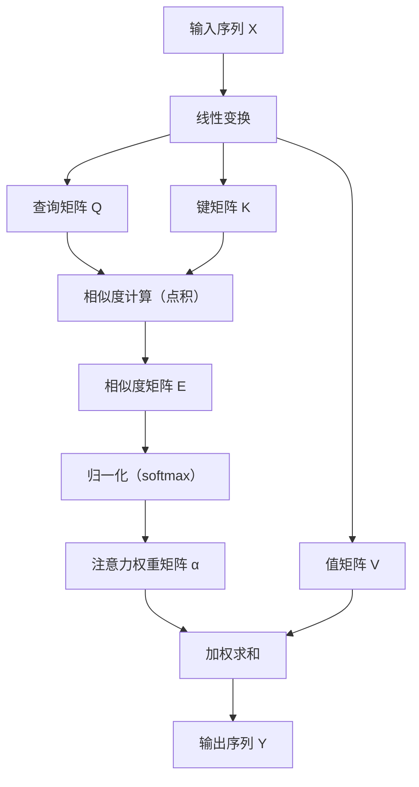

# 注意力机制在深度学习模型中的演进与应用

> 关键词：注意力机制、深度学习模型、演进、应用、Transformer

> 摘要：本文深入探讨了注意力机制在深度学习模型中的演进历程及其广泛应用。首先介绍了注意力机制提出的背景、适用的读者群体、文档的整体结构和相关术语。接着阐述了注意力机制的核心概念、原理和架构，通过Mermaid流程图进行直观展示。详细讲解了核心算法原理，并用Python代码进行说明，同时给出了相关的数学模型和公式。通过实际项目案例，展示了注意力机制的代码实现和解读。分析了注意力机制在不同领域的实际应用场景，推荐了学习资源、开发工具框架和相关论文著作。最后总结了注意力机制的未来发展趋势与挑战，并对常见问题进行了解答，还提供了扩展阅读和参考资料，旨在帮助读者全面深入地理解注意力机制在深度学习中的重要作用和发展方向。

## 1. 背景介绍 
### 1.1 目的和范围
在深度学习的发展历程中，模型面临着处理大规模数据和长序列信息的挑战。传统的深度学习模型在处理这些问题时，往往存在信息丢失、计算效率低下等问题。注意力机制的出现为解决这些问题提供了有效的方法。本文的目的在于全面介绍注意力机制在深度学习模型中的演进过程，详细讲解其核心原理和算法，展示其在实际项目中的应用，以及探讨其未来的发展趋势和面临的挑战。范围涵盖了注意力机制从提出到在各种深度学习模型中的应用，包括但不限于自然语言处理、计算机视觉等领域。

### 1.2 预期读者
本文预期读者包括对深度学习感兴趣的初学者、有一定基础的深度学习开发者、研究人员以及相关领域的专业人士。对于初学者来说，可以通过本文了解注意力机制的基本概念和原理；对于开发者，可以学习到注意力机制的具体实现和应用技巧；对于研究人员和专业人士，可以深入探讨注意力机制的发展趋势和面临的挑战。

### 1.3 文档结构概述
本文首先介绍了注意力机制相关的背景知识，包括目的、预期读者、文档结构和术语表。接着详细阐述了注意力机制的核心概念、原理和架构，通过流程图进行直观展示。然后讲解了核心算法原理，并用Python代码进行详细说明，同时给出了相关的数学模型和公式。通过实际项目案例，展示了注意力机制的代码实现和解读。分析了注意力机制在不同领域的实际应用场景，推荐了学习资源、开发工具框架和相关论文著作。最后总结了注意力机制的未来发展趋势与挑战，并对常见问题进行了解答，还提供了扩展阅读和参考资料。

### 1.4 术语表
#### 1.4.1 核心术语定义
- **注意力机制（Attention Mechanism）**：是一种模拟人类注意力的机制，通过对输入信息的不同部分分配不同的权重，从而聚焦于重要的信息。
- **查询（Query）**：在注意力机制中，用于与键（Key）进行匹配，以计算注意力权重的向量。
- **键（Key）**：与查询进行匹配的向量，用于计算注意力权重。
- **值（Value）**：根据注意力权重进行加权求和的向量。
- **多头注意力（Multi - Head Attention）**：将注意力机制扩展为多个头，每个头可以关注输入信息的不同方面。

#### 1.4.2 相关概念解释
- **自注意力（Self - Attention）**：是一种特殊的注意力机制，其中查询、键和值都来自同一输入序列。自注意力可以捕捉序列中不同位置之间的依赖关系。
- **注意力权重（Attention Weights）**：表示输入信息的不同部分的重要程度，通过计算查询和键之间的相似度得到。

#### 1.4.3 缩略词列表
- **NLP**：Natural Language Processing，自然语言处理
- **CV**：Computer Vision，计算机视觉
- **RNN**：Recurrent Neural Network，循环神经网络
- **LSTM**：Long Short - Term Memory，长短期记忆网络
- **GRU**：Gated Recurrent Unit，门控循环单元
- **Transformer**：一种基于注意力机制的深度学习模型

## 2. 核心概念与联系 

### 核心概念原理
注意力机制的核心思想是模拟人类的注意力，即聚焦于重要的信息，忽略不重要的信息。在深度学习中，注意力机制通过计算输入信息的不同部分的重要程度（注意力权重），然后根据这些权重对输入信息进行加权求和，得到最终的输出。

假设我们有一个输入序列 $\mathbf{X} = [\mathbf{x}_1, \mathbf{x}_2, \cdots, \mathbf{x}_n]$，其中 $\mathbf{x}_i$ 是第 $i$ 个输入向量。注意力机制的基本步骤如下：
1. 计算查询（Query）、键（Key）和值（Value）：通常通过线性变换将输入向量转换为查询、键和值。即 $\mathbf{Q} = \mathbf{X} \mathbf{W}_Q$，$\mathbf{K} = \mathbf{X} \mathbf{W}_K$，$\mathbf{V} = \mathbf{X} \mathbf{W}_V$，其中 $\mathbf{W}_Q$、$\mathbf{W}_K$ 和 $\mathbf{W}_V$ 是可学习的权重矩阵。
2. 计算注意力权重：通过计算查询和键之间的相似度，得到注意力权重。常用的相似度计算方法是点积相似度，即 $\mathbf{e}_{ij} = \mathbf{q}_i^T \mathbf{k}_j$，其中 $\mathbf{q}_i$ 是第 $i$ 个查询向量，$\mathbf{k}_j$ 是第 $j$ 个键向量。然后通过 softmax 函数将相似度归一化，得到注意力权重 $\mathbf{\alpha}_{ij} = \frac{\exp(\mathbf{e}_{ij})}{\sum_{k = 1}^{n} \exp(\mathbf{e}_{ik})}$。
3. 加权求和：根据注意力权重对值进行加权求和，得到最终的输出 $\mathbf{y}_i = \sum_{j = 1}^{n} \mathbf{\alpha}_{ij} \mathbf{v}_j$，其中 $\mathbf{v}_j$ 是第 $j$ 个值向量。

### 架构的文本示意图
```plaintext
输入序列 X
|
|-- 线性变换
|   |-- 查询矩阵 Q
|   |-- 键矩阵 K
|   |-- 值矩阵 V
|
|-- 相似度计算（点积）
|   |-- 相似度矩阵 E
|
|-- 归一化（softmax）
|   |-- 注意力权重矩阵 α
|
|-- 加权求和
|   |-- 输出序列 Y
```

### Mermaid 流程图


## 3. 核心算法原理 & 具体操作步骤 

### 核心算法原理
注意力机制的核心算法是计算注意力权重并进行加权求和。下面我们用Python代码详细阐述这个过程。

```python
import torch
import torch.nn.functional as F

def attention(query, key, value, mask=None):
    """
    计算注意力机制的输出
    :param query: 查询矩阵，形状为 (batch_size, seq_len_q, d_k)
    :param key: 键矩阵，形状为 (batch_size, seq_len_k, d_k)
    :param value: 值矩阵，形状为 (batch_size, seq_len_k, d_v)
    :param mask: 掩码矩阵，形状为 (batch_size, seq_len_q, seq_len_k)
    :return: 注意力机制的输出，形状为 (batch_size, seq_len_q, d_v)
    """
    d_k = query.size(-1)
    # 计算相似度
    scores = torch.matmul(query, key.transpose(-2, -1)) / torch.sqrt(torch.tensor(d_k, dtype=torch.float32))
    if mask is not None:
        scores = scores.masked_fill(mask == 0, -1e9)
    # 归一化得到注意力权重
    attn_weights = F.softmax(scores, dim=-1)
    # 加权求和
    output = torch.matmul(attn_weights, value)
    return output

# 示例输入
batch_size = 2
seq_len_q = 3
seq_len_k = 4
d_k = 5
d_v = 6

query = torch.randn(batch_size, seq_len_q, d_k)
key = torch.randn(batch_size, seq_len_k, d_k)
value = torch.randn(batch_size, seq_len_k, d_v)

output = attention(query, key, value)
print("注意力机制的输出形状:", output.shape)
```

### 具体操作步骤
1. **输入准备**：准备查询矩阵 `query`、键矩阵 `key` 和值矩阵 `value`，它们的形状分别为 `(batch_size, seq_len_q, d_k)`、`(batch_size, seq_len_k, d_k)` 和 `(batch_size, seq_len_k, d_v)`。
2. **相似度计算**：通过矩阵乘法计算查询和键之间的相似度，即 `scores = torch.matmul(query, key.transpose(-2, -1))`，为了防止梯度消失或爆炸，通常会除以 $\sqrt{d_k}$。
3. **掩码处理（可选）**：如果存在掩码矩阵 `mask`，则将掩码为 0 的位置的相似度值设为负无穷，这样在后续的 softmax 操作中这些位置的注意力权重将趋近于 0。
4. **归一化**：使用 softmax 函数对相似度矩阵进行归一化，得到注意力权重矩阵 `attn_weights`。
5. **加权求和**：将注意力权重矩阵与值矩阵相乘，得到注意力机制的输出 `output`。

## 4. 数学模型和公式 & 详细讲解 & 举例说明 

### 数学模型和公式
#### 相似度计算
相似度计算通常使用点积相似度，公式为：
$$\mathbf{e}_{ij} = \mathbf{q}_i^T \mathbf{k}_j$$
其中 $\mathbf{q}_i$ 是第 $i$ 个查询向量，$\mathbf{k}_j$ 是第 $j$ 个键向量，$\mathbf{e}_{ij}$ 表示第 $i$ 个查询向量和第 $j$ 个键向量之间的相似度。

为了防止梯度消失或爆炸，通常会除以 $\sqrt{d_k}$，其中 $d_k$ 是查询和键向量的维度，即：
$$\mathbf{e}_{ij} = \frac{\mathbf{q}_i^T \mathbf{k}_j}{\sqrt{d_k}}$$

#### 注意力权重计算
通过 softmax 函数将相似度归一化，得到注意力权重：
$$\mathbf{\alpha}_{ij} = \frac{\exp(\mathbf{e}_{ij})}{\sum_{k = 1}^{n} \exp(\mathbf{e}_{ik})}$$
其中 $\mathbf{\alpha}_{ij}$ 表示第 $i$ 个查询向量对第 $j$ 个键向量的注意力权重。

#### 加权求和
根据注意力权重对值进行加权求和，得到最终的输出：
$$\mathbf{y}_i = \sum_{j = 1}^{n} \mathbf{\alpha}_{ij} \mathbf{v}_j$$
其中 $\mathbf{v}_j$ 是第 $j$ 个值向量，$\mathbf{y}_i$ 是第 $i$ 个输出向量。

### 详细讲解
- **相似度计算**：点积相似度可以衡量查询向量和键向量之间的相关性。除以 $\sqrt{d_k}$ 是为了在 $d_k$ 较大时，防止点积的结果过大，导致 softmax 函数的梯度变得非常小，从而影响模型的训练。
- **注意力权重计算**：softmax 函数将相似度转换为概率分布，使得注意力权重之和为 1。这样可以确保最终的输出是输入值的加权平均。
- **加权求和**：根据注意力权重对值进行加权求和，使得模型可以聚焦于输入信息的重要部分，忽略不重要的部分。

### 举例说明
假设我们有一个输入序列 $\mathbf{X} = [\mathbf{x}_1, \mathbf{x}_2, \mathbf{x}_3]$，其中 $\mathbf{x}_i$ 是 3 维向量。我们将其转换为查询、键和值矩阵：
$$\mathbf{Q} = \begin{bmatrix}
1 & 2 & 3 \\
4 & 5 & 6 \\
7 & 8 & 9
\end{bmatrix}, \quad
\mathbf{K} = \begin{bmatrix}
2 & 3 & 4 \\
5 & 6 & 7 \\
8 & 9 & 10
\end{bmatrix}, \quad
\mathbf{V} = \begin{bmatrix}
3 & 4 & 5 \\
6 & 7 & 8 \\
9 & 10 & 11
\end{bmatrix}$$

首先计算相似度矩阵 $\mathbf{E}$：
$$\mathbf{E} = \mathbf{Q} \mathbf{K}^T = \begin{bmatrix}
1\times2 + 2\times5 + 3\times8 & 1\times3 + 2\times6 + 3\times9 & 1\times4 + 2\times7 + 3\times10 \\
4\times2 + 5\times5 + 6\times8 & 4\times3 + 5\times6 + 6\times9 & 4\times4 + 5\times7 + 6\times10 \\
7\times2 + 8\times5 + 9\times8 & 7\times3 + 8\times6 + 9\times9 & 7\times4 + 8\times7 + 9\times10
\end{bmatrix} = \begin{bmatrix}
36 & 42 & 48 \\
75 & 90 & 105 \\
114 & 138 & 162
\end{bmatrix}$$

假设 $d_k = 3$，则除以 $\sqrt{d_k}$ 后得到：
$$\mathbf{E}' = \frac{\mathbf{E}}{\sqrt{3}} = \begin{bmatrix}
\frac{36}{\sqrt{3}} & \frac{42}{\sqrt{3}} & \frac{48}{\sqrt{3}} \\
\frac{75}{\sqrt{3}} & \frac{90}{\sqrt{3}} & \frac{105}{\sqrt{3}} \\
\frac{114}{\sqrt{3}} & \frac{138}{\sqrt{3}} & \frac{162}{\sqrt{3}}
\end{bmatrix}$$

然后通过 softmax 函数计算注意力权重矩阵 $\mathbf{\alpha}$：
$$\mathbf{\alpha}_{ij} = \frac{\exp(\mathbf{e}_{ij}')}{\sum_{k = 1}^{3} \exp(\mathbf{e}_{ik}')}$$

最后根据注意力权重对值进行加权求和，得到输出矩阵 $\mathbf{Y}$：
$$\mathbf{Y} = \mathbf{\alpha} \mathbf{V}$$

## 5. 项目实战：代码实际案例和详细解释说明 

### 5.1  开发环境搭建
- **Python**：建议使用 Python 3.7 及以上版本。
- **深度学习框架**：使用 PyTorch 作为深度学习框架，可以通过以下命令安装：
```sh
pip install torch torchvision
```
- **其他依赖库**：还需要安装 `numpy`、`matplotlib` 等常用库，可以使用以下命令安装：
```sh
pip install numpy matplotlib
```

### 5.2  源代码详细实现和代码解读
下面我们实现一个简单的基于注意力机制的文本分类模型。

```python
import torch
import torch.nn as nn
import torch.nn.functional as F

# 定义注意力层
class Attention(nn.Module):
    def __init__(self, input_dim):
        super(Attention, self).__init__()
        self.W = nn.Linear(input_dim, input_dim)
        self.v = nn.Parameter(torch.rand(input_dim))
        stdv = 1. / torch.sqrt(self.v.size(0))
        self.v.data.uniform_(-stdv, stdv)

    def forward(self, x):
        u = torch.tanh(self.W(x))
        attn_weights = F.softmax(torch.matmul(u, self.v), dim=1).unsqueeze(-1)
        output = x * attn_weights
        output = torch.sum(output, dim=1)
        return output, attn_weights

# 定义文本分类模型
class TextClassifier(nn.Module):
    def __init__(self, input_dim, hidden_dim, num_classes):
        super(TextClassifier, self).__init__()
        self.embedding = nn.Linear(input_dim, hidden_dim)
        self.attention = Attention(hidden_dim)
        self.fc = nn.Linear(hidden_dim, num_classes)

    def forward(self, x):
        x = self.embedding(x)
        x, attn_weights = self.attention(x)
        x = self.fc(x)
        return x, attn_weights

# 示例使用
input_dim = 10
hidden_dim = 20
num_classes = 3
batch_size = 4
seq_len = 5

model = TextClassifier(input_dim, hidden_dim, num_classes)
input_tensor = torch.randn(batch_size, seq_len, input_dim)
output, attn_weights = model(input_tensor)
print("模型输出形状:", output.shape)
print("注意力权重形状:", attn_weights.shape)
```

### 5.3  代码解读与分析
#### 注意力层 `Attention`
- **初始化**：在 `__init__` 方法中，定义了一个线性层 `self.W` 和一个可学习的参数 `self.v`。
- **前向传播**：在 `forward` 方法中，首先通过线性层 `self.W` 对输入 `x` 进行变换，然后使用 `tanh` 函数进行非线性变换得到 `u`。接着计算注意力权重 `attn_weights`，通过 `softmax` 函数进行归一化。最后将输入 `x` 与注意力权重相乘并求和，得到输出 `output`。

#### 文本分类模型 `TextClassifier`
- **初始化**：在 `__init__` 方法中，定义了一个嵌入层 `self.embedding`、一个注意力层 `self.attention` 和一个全连接层 `self.fc`。
- **前向传播**：在 `forward` 方法中，首先将输入 `x` 通过嵌入层进行变换，然后将变换后的结果输入到注意力层中，得到输出 `x` 和注意力权重 `attn_weights`。最后将输出 `x` 通过全连接层进行分类，得到最终的输出。

通过这个示例，我们可以看到如何在实际项目中使用注意力机制。注意力机制可以帮助模型聚焦于输入序列中的重要部分，从而提高模型的性能。

## 6. 实际应用场景 
### 自然语言处理
- **机器翻译**：在机器翻译任务中，注意力机制可以帮助模型更好地捕捉源语言和目标语言之间的对应关系。例如，Transformer 模型通过多头注意力机制，能够并行处理输入序列，提高翻译的质量和效率。
- **文本摘要**：注意力机制可以帮助模型聚焦于文本中的重要句子和段落，从而生成更准确的摘要。通过计算每个句子的注意力权重，模型可以选择重要的句子进行摘要生成。
- **问答系统**：在问答系统中，注意力机制可以帮助模型理解问题和文档之间的关系，从而找到最相关的答案。模型可以通过注意力机制对文档中的每个句子或段落分配不同的权重，聚焦于与问题相关的部分。

### 计算机视觉
- **图像分类**：注意力机制可以帮助模型关注图像中的重要区域，提高图像分类的准确率。例如，在卷积神经网络中引入注意力机制，可以增强模型对图像特征的提取能力。
- **目标检测**：在目标检测任务中，注意力机制可以帮助模型聚焦于图像中的目标区域，提高检测的精度。通过计算每个区域的注意力权重，模型可以更准确地定位和识别目标。
- **图像生成**：在图像生成任务中，注意力机制可以帮助模型控制生成图像的不同部分。例如，在生成对抗网络中引入注意力机制，可以生成更真实、更细致的图像。

### 语音识别
- **语音识别系统**：注意力机制可以帮助模型聚焦于语音信号中的重要部分，提高语音识别的准确率。通过计算每个时间步的注意力权重，模型可以更好地处理长序列的语音信号。

## 7. 工具和资源推荐
### 7.1 学习资源推荐
#### 7.1.1 书籍推荐
- 《深度学习》（Deep Learning）：由 Ian Goodfellow、Yoshua Bengio 和 Aaron Courville 所著，是深度学习领域的经典教材，涵盖了深度学习的基本原理、算法和应用。
- 《动手学深度学习》（Dive into Deep Learning）：由 Aston Zhang、Zack C. Lipton、Mu Li 和 Alexander J. Smola 所著，提供了丰富的代码示例和实践项目，适合初学者学习。
- 《Attention Is All You Need》：这篇论文是注意力机制的经典之作，详细介绍了 Transformer 模型和多头注意力机制。

#### 7.1.2 在线课程
- Coursera 上的“深度学习专项课程”（Deep Learning Specialization）：由 Andrew Ng 教授授课，涵盖了深度学习的各个方面，包括神经网络、卷积神经网络、循环神经网络和注意力机制等。
- edX 上的“强化学习基础”（Fundamentals of Reinforcement Learning）：介绍了强化学习的基本概念和算法，同时也涉及到了注意力机制在强化学习中的应用。

#### 7.1.3 技术博客和网站
- Medium 上的 Towards Data Science：提供了大量关于深度学习、机器学习和数据科学的技术文章和教程，其中包括很多关于注意力机制的文章。
- arXiv.org：是一个预印本服务器，提供了最新的学术研究论文，包括注意力机制的相关研究。

### 7.2 开发工具框架推荐
#### 7.2.1 IDE和编辑器
- PyCharm：是一款专门为 Python 开发设计的集成开发环境，提供了丰富的代码编辑、调试和项目管理功能。
- Jupyter Notebook：是一个交互式的开发环境，适合进行数据探索、模型训练和结果展示。

#### 7.2.2 调试和性能分析工具
- TensorBoard：是 TensorFlow 提供的一个可视化工具，可以帮助用户监控模型的训练过程、分析模型的性能和查看模型的结构。
- PyTorch Profiler：是 PyTorch 提供的一个性能分析工具，可以帮助用户分析模型的运行时间、内存使用情况等。

#### 7.2.3 相关框架和库
- PyTorch：是一个开源的深度学习框架，提供了丰富的神经网络层和优化算法，支持 GPU 加速。
- TensorFlow：是另一个广泛使用的深度学习框架，提供了高级的深度学习 API 和分布式训练功能。
- Hugging Face Transformers：是一个用于自然语言处理的开源库，提供了预训练的 Transformer 模型和工具，方便用户进行模型的微调和解码。

### 7.3 相关论文著作推荐
#### 7.3.1 经典论文
- 《Neural Machine Translation by Jointly Learning to Align and Translate》：首次提出了注意力机制在机器翻译中的应用，通过对齐源语言和目标语言的单词，提高了翻译的质量。
- 《Attention Is All You Need》：提出了 Transformer 模型，完全基于注意力机制，取代了传统的循环神经网络，在自然语言处理任务中取得了显著的效果。

#### 7.3.2 最新研究成果
- 《Efficient Attention: Attention with Linear Complexities》：提出了一种高效的注意力机制，将注意力计算的复杂度从 $O(n^2)$ 降低到 $O(n)$，提高了模型的计算效率。
- 《Swin Transformer: Hierarchical Vision Transformer using Shifted Windows》：将 Transformer 模型应用于计算机视觉领域，提出了 Swin Transformer 模型，在图像分类、目标检测等任务中取得了优异的成绩。

#### 7.3.3 应用案例分析
- 《BERT: Pre - training of Deep Bidirectional Transformers for Language Understanding》：介绍了 BERT 模型，通过预训练和微调的方式，在自然语言处理的多个任务中取得了最先进的结果。
- 《Mask R - CNN》：提出了 Mask R - CNN 模型，结合了注意力机制和卷积神经网络，在目标检测和实例分割任务中取得了很好的效果。

## 8. 总结：未来发展趋势与挑战
### 未来发展趋势
- **高效注意力机制**：随着数据规模的不断增大，传统的注意力机制计算复杂度较高，限制了模型的训练和推理速度。未来，研究人员将致力于开发高效的注意力机制，降低计算复杂度，提高模型的效率。
- **跨领域应用**：注意力机制已经在自然语言处理、计算机视觉和语音识别等领域取得了显著的成果。未来，注意力机制将在更多的领域得到应用，如医疗、金融、交通等，为这些领域带来新的技术突破。
- **与其他技术的融合**：注意力机制可以与其他技术如强化学习、生成对抗网络等相结合，产生更强大的模型。例如，将注意力机制应用于强化学习中，可以帮助智能体更好地感知环境，提高决策的准确性。

### 挑战
- **可解释性**：注意力机制虽然在很多任务中取得了很好的效果，但它的决策过程往往是黑盒的，难以解释。提高注意力机制的可解释性是未来研究的一个重要方向。
- **数据依赖性**：注意力机制需要大量的数据进行训练，才能取得较好的效果。在数据稀缺的情况下，如何提高注意力机制的性能是一个挑战。
- **计算资源需求**：注意力机制的计算复杂度较高，需要大量的计算资源。如何在有限的计算资源下训练和部署注意力机制模型是一个实际问题。

## 9. 附录：常见问题与解答
### 问题 1：注意力机制和传统的深度学习模型有什么区别？
传统的深度学习模型如循环神经网络（RNN）和卷积神经网络（CNN）在处理长序列信息和捕捉全局依赖关系时存在一定的局限性。注意力机制通过对输入信息的不同部分分配不同的权重，能够聚焦于重要的信息，忽略不重要的信息，从而更好地处理长序列信息和捕捉全局依赖关系。

### 问题 2：如何选择合适的注意力机制？
选择合适的注意力机制需要考虑具体的任务和数据特点。如果任务需要处理长序列信息和捕捉全局依赖关系，可以选择自注意力机制或多头注意力机制；如果任务对计算效率要求较高，可以选择高效的注意力机制。此外，还可以通过实验比较不同注意力机制的性能，选择最适合的机制。

### 问题 3：注意力机制的计算复杂度是多少？
传统的注意力机制的计算复杂度为 $O(n^2)$，其中 $n$ 是输入序列的长度。为了降低计算复杂度，研究人员提出了一些高效的注意力机制，如线性注意力机制，其计算复杂度为 $O(n)$。

### 问题 4：注意力机制在实际应用中需要注意什么？
在实际应用中，需要注意以下几点：
- **数据预处理**：确保输入数据的质量和格式符合要求，进行必要的数据清洗和特征工程。
- **模型调优**：调整注意力机制的超参数，如注意力头的数量、隐藏层的维度等，以提高模型的性能。
- **计算资源**：注意力机制的计算复杂度较高，需要确保有足够的计算资源进行训练和推理。

## 10. 扩展阅读 & 参考资料
- Vaswani, A., Shazeer, N., Parmar, N., Uszkoreit, J., Jones, L., Gomez, A. N.,... & Polosukhin, I. (2017). Attention is all you need. Advances in neural information processing systems, 5998 - 6008.
- Bahdanau, D., Cho, K., & Bengio, Y. (2014). Neural machine translation by jointly learning to align and translate. arXiv preprint arXiv:1409.0473.
- Devlin, J., Chang, M. W., Lee, K., & Toutanova, K. (2018). Bert: Pre - training of deep bidirectional transformers for language understanding. arXiv preprint arXiv:1810.04805.
- He, K., Gkioxari, G., Dollár, P., & Girshick, R. (2017). Mask r - cnn. In Proceedings of the IEEE international conference on computer vision (pp. 2961 - 2969).

作者：AI天才研究院/AI Genius Institute & 禅与计算机程序设计艺术 /Zen And The Art of Computer Programming