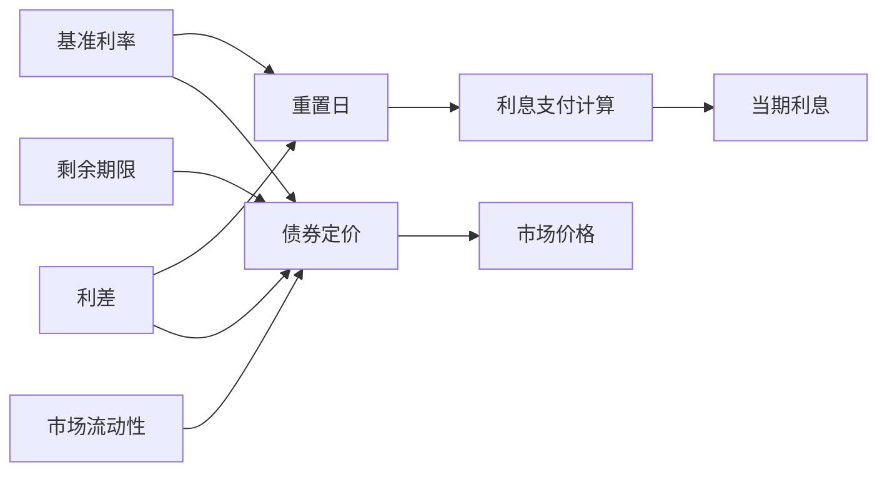

# 浮动利率债券：应对利率上升的投资工具

> 关键词：浮动利率债券、利率上升、投资工具、债券定价、风险管理

> 摘要：本文深入探讨了浮动利率债券作为应对利率上升的投资工具的相关内容。首先介绍了浮动利率债券的背景知识，包括目的、预期读者等。接着阐述了其核心概念、联系以及架构，详细讲解了核心算法原理和具体操作步骤，并通过Python代码进行了示例。从数学模型和公式的角度对浮动利率债券进行了分析，并举例说明。通过项目实战展示了代码的实际应用和详细解读。探讨了浮动利率债券的实际应用场景，推荐了相关的学习资源、开发工具框架和论文著作。最后总结了其未来发展趋势与挑战，并对常见问题进行了解答，提供了扩展阅读和参考资料。

## 1. 背景介绍 
### 1.1 目的和范围
在金融市场中，利率的波动是一个常见且重要的现象。当利率上升时，固定利率债券的价值会下降，因为其固定的利息支付在市场利率上升后变得相对缺乏吸引力。而浮动利率债券作为一种特殊的债券类型，其利息支付会随着市场利率的变动而调整，因此在利率上升的环境中具有独特的优势。本文的目的在于全面介绍浮动利率债券，包括其核心概念、定价原理、实际应用等方面，帮助投资者更好地理解和运用这一投资工具来应对利率上升带来的风险。

### 1.2 预期读者
本文的预期读者包括金融投资者、金融分析师、金融专业学生以及对金融市场和投资工具有兴趣的人士。对于投资者来说，了解浮动利率债券可以为其投资组合提供更多的选择和风险管理手段；金融分析师可以通过深入研究浮动利率债券，为客户提供更专业的投资建议；金融专业学生可以将本文作为学习金融市场和债券定价的参考资料；而对金融市场感兴趣的人士可以通过阅读本文，拓宽自己的金融知识视野。

### 1.3 文档结构概述
本文将按照以下结构进行阐述：首先介绍浮动利率债券的背景知识，包括目的、预期读者等；接着讲解浮动利率债券的核心概念、联系以及架构；然后详细阐述核心算法原理和具体操作步骤，并通过Python代码进行示例；从数学模型和公式的角度对浮动利率债券进行分析，并举例说明；通过项目实战展示代码的实际应用和详细解读；探讨浮动利率债券的实际应用场景；推荐相关的学习资源、开发工具框架和论文著作；最后总结其未来发展趋势与挑战，并对常见问题进行解答，提供扩展阅读和参考资料。

### 1.4 术语表
#### 1.4.1 核心术语定义
- **浮动利率债券**：是一种债券，其利息支付不是固定的，而是根据预先设定的公式定期调整，通常与某个市场利率指标挂钩，如伦敦银行间同业拆借利率（LIBOR）、上海银行间同业拆放利率（SHIBOR）等。
- **基准利率**：是浮动利率债券利息调整所依据的基础利率，如上述提到的LIBOR、SHIBOR等。
- **利差**：是在基准利率的基础上，额外增加的一个固定利率，用于补偿投资者承担的风险等因素。
- **重置日**：是指浮动利率债券利息调整的日期，在该日期，债券的利息支付将根据新的基准利率和利差重新计算。

#### 1.4.2 相关概念解释
- **利率风险**：是指由于市场利率的变动而导致债券价格波动的风险。对于固定利率债券来说，利率上升会导致债券价格下降；而浮动利率债券由于其利息支付会随市场利率调整，因此利率风险相对较低。
- **债券定价**：是指确定债券在市场上的合理价格。对于浮动利率债券，其定价需要考虑基准利率、利差、剩余期限等因素。

#### 1.4.3 缩略词列表
- **LIBOR**：London Interbank Offered Rate，伦敦银行间同业拆借利率
- **SHIBOR**：Shanghai Interbank Offered Rate，上海银行间同业拆放利率

## 2. 核心概念与联系 

### 核心概念原理
浮动利率债券的核心原理是其利息支付与市场利率挂钩。债券发行人在发行浮动利率债券时，会规定一个基准利率和一个利差。在每个重置日，债券的利息支付将根据新的基准利率和利差重新计算。例如，假设某浮动利率债券的基准利率为LIBOR，利差为0.5%，在某个重置日，LIBOR为2%，则该债券在接下来的付息期内的利率为2% + 0.5% = 2.5%。

### 架构的文本示意图
浮动利率债券的架构可以用以下文本示意图表示：

```plaintext
浮动利率债券
|-- 基准利率（如LIBOR、SHIBOR）
|-- 利差
|-- 重置日
|-- 利息支付计算
    |-- 当期利息 = （基准利率 + 利差）× 债券面值 × 计息期天数 / 360（或365）
|-- 债券定价
    |-- 考虑因素：基准利率、利差、剩余期限、市场流动性等
```

### Mermaid流程图


## 3. 核心算法原理 & 具体操作步骤 

### 核心算法原理
浮动利率债券的核心算法主要包括利息支付计算和债券定价计算。

#### 利息支付计算
利息支付的计算公式为：

$$I = (r + s) \times F \times \frac{d}{D}$$

其中，$I$ 表示当期利息，$r$ 表示基准利率，$s$ 表示利差，$F$ 表示债券面值，$d$ 表示计息期天数，$D$ 表示一年的天数（通常为360或365）。

#### 债券定价计算
浮动利率债券的定价可以采用现金流折现的方法。在每个付息期，债券的现金流为当期利息支付和本金偿还（在债券到期时）。将这些现金流按照市场利率折现到当前时刻，即可得到债券的价格。

### 具体操作步骤

#### 步骤1：确定基准利率和利差
在发行浮动利率债券时，需要确定基准利率和利差。基准利率通常选择市场上具有代表性的利率指标，如LIBOR、SHIBOR等；利差则根据债券的风险等因素确定。

#### 步骤2：确定重置日和付息期
重置日是利息调整的日期，付息期是两次利息支付之间的时间间隔。例如，某浮动利率债券的重置日为每季度末，付息期为每季度。

#### 步骤3：计算当期利息
在每个重置日，根据新的基准利率和利差，使用上述利息支付计算公式计算当期利息。

#### 步骤4：计算债券价格
使用现金流折现的方法，将未来的利息支付和本金偿还按照市场利率折现到当前时刻，得到债券的价格。

### Python源代码示例
```python
import numpy as np

def calculate_interest(r, s, F, d, D):
    """
    计算当期利息
    :param r: 基准利率
    :param s: 利差
    :param F: 债券面值
    :param d: 计息期天数
    :param D: 一年的天数
    :return: 当期利息
    """
    return (r + s) * F * (d / D)

def bond_pricing(rates, s, F, d, D, T):
    """
    计算浮动利率债券价格
    :param rates: 未来各期的基准利率列表
    :param s: 利差
    :param F: 债券面值
    :param d: 计息期天数
    :param D: 一年的天数
    :param T: 债券剩余期限（付息期数）
    :return: 债券价格
    """
    cash_flows = []
    for i in range(T):
        r = rates[i]
        interest = calculate_interest(r, s, F, d, D)
        if i == T - 1:
            cash_flows.append(interest + F)
        else:
            cash_flows.append(interest)
    
    # 假设市场利率等于当期基准利率
    discount_rates = rates
    present_values = []
    for i in range(T):
        pv = cash_flows[i] / ((1 + discount_rates[i]) ** (i + 1))
        present_values.append(pv)
    
    bond_price = sum(present_values)
    return bond_price

# 示例参数
rates = [0.02, 0.022, 0.025, 0.028]  # 未来各期的基准利率
s = 0.005  # 利差
F = 1000  # 债券面值
d = 90  # 计息期天数
D = 360  # 一年的天数
T = 4  # 债券剩余期限（付息期数）

# 计算债券价格
price = bond_pricing(rates, s, F, d, D, T)
print(f"浮动利率债券价格: {price}")
```

## 4. 数学模型和公式 & 详细讲解 & 举例说明 

### 利息支付公式
$$I = (r + s) \times F \times \frac{d}{D}$$

详细讲解：
- $I$ 表示当期利息，即债券在一个付息期内支付给投资者的利息金额。
- $r$ 是基准利率，它反映了市场利率的整体水平，通常是一个具有代表性的市场利率指标。
- $s$ 是利差，是债券发行人在基准利率基础上额外支付给投资者的补偿，用于补偿投资者承担的风险等因素。
- $F$ 是债券面值，即债券到期时发行人需要偿还给投资者的本金金额。
- $d$ 是计息期天数，即一个付息期的实际天数。
- $D$ 是一年的天数，在不同的市场和计算惯例中，$D$ 可以取360或365。

举例说明：
假设某浮动利率债券的面值 $F = 1000$ 元，基准利率 $r = 2\%$，利差 $s = 0.5\%$，计息期天数 $d = 90$ 天，一年的天数 $D = 360$ 天。则该债券在当期的利息为：

$$I = (0.02 + 0.005) \times 1000 \times \frac{90}{360} = 6.25$$（元）

### 债券定价公式
浮动利率债券的定价可以采用现金流折现的方法。假设债券的剩余期限为 $T$ 个付息期，第 $t$ 期的基准利率为 $r_t$，利差为 $s$，债券面值为 $F$，计息期天数为 $d$，一年的天数为 $D$，市场利率为 $y_t$。则债券的价格 $P$ 可以表示为：

$$P = \sum_{t = 1}^{T} \frac{(r_t + s) \times F \times \frac{d}{D}}{(1 + y_t)^t} + \frac{F}{(1 + y_T)^T}$$

详细讲解：
- 公式的第一项是未来各期利息支付的现值之和。对于每一期 $t$，利息支付为 $(r_t + s) \times F \times \frac{d}{D}$，将其按照市场利率 $y_t$ 折现到当前时刻，得到该期利息的现值 $\frac{(r_t + s) \times F \times \frac{d}{D}}{(1 + y_t)^t}$。
- 公式的第二项是债券本金偿还的现值。在债券到期时（第 $T$ 期），发行人需要偿还本金 $F$，将其按照市场利率 $y_T$ 折现到当前时刻，得到本金的现值 $\frac{F}{(1 + y_T)^T}$。

举例说明：
假设某浮动利率债券的面值 $F = 1000$ 元，利差 $s = 0.5\%$，计息期天数 $d = 90$ 天，一年的天数 $D = 360$ 天，债券剩余期限为 $T = 3$ 个付息期，未来各期的基准利率分别为 $r_1 = 2\%$，$r_2 = 2.2\%$，$r_3 = 2.5\%$，市场利率分别为 $y_1 = 2\%$，$y_2 = 2.2\%$，$y_3 = 2.5\%$。

首先计算各期利息：
- 第1期利息：$I_1 = (0.02 + 0.005) \times 1000 \times \frac{90}{360} = 6.25$（元）
- 第2期利息：$I_2 = (0.022 + 0.005) \times 1000 \times \frac{90}{360} = 6.75$（元）
- 第3期利息：$I_3 = (0.025 + 0.005) \times 1000 \times \frac{90}{360} = 7.5$（元）

然后计算各期现金流的现值：
- 第1期现金流现值：$\frac{6.25}{(1 + 0.02)^1} \approx 6.13$（元）
- 第2期现金流现值：$\frac{6.75}{(1 + 0.022)^2} \approx 6.46$（元）
- 第3期现金流现值（包括本金）：$\frac{7.5 + 1000}{(1 + 0.025)^3} \approx 923.77$（元）

最后计算债券价格：
$P = 6.13 + 6.46 + 923.77 = 936.36$（元）

## 5. 项目实战：代码实际案例和详细解释说明 

### 5.1  开发环境搭建
为了运行上述Python代码，需要搭建以下开发环境：

#### 安装Python
可以从Python官方网站（https://www.python.org/downloads/）下载并安装Python 3.x版本。

#### 安装必要的库
上述代码只使用了Python的内置库 `numpy`，可以使用以下命令安装 `numpy`：
```sh
pip install numpy
```

### 5.2  源代码详细实现和代码解读
```python
import numpy as np

def calculate_interest(r, s, F, d, D):
    """
    计算当期利息
    :param r: 基准利率
    :param s: 利差
    :param F: 债券面值
    :param d: 计息期天数
    :param D: 一年的天数
    :return: 当期利息
    """
    return (r + s) * F * (d / D)

def bond_pricing(rates, s, F, d, D, T):
    """
    计算浮动利率债券价格
    :param rates: 未来各期的基准利率列表
    :param s: 利差
    :param F: 债券面值
    :param d: 计息期天数
    :param D: 一年的天数
    :param T: 债券剩余期限（付息期数）
    :return: 债券价格
    """
    cash_flows = []
    for i in range(T):
        r = rates[i]
        interest = calculate_interest(r, s, F, d, D)
        if i == T - 1:
            cash_flows.append(interest + F)
        else:
            cash_flows.append(interest)
    
    # 假设市场利率等于当期基准利率
    discount_rates = rates
    present_values = []
    for i in range(T):
        pv = cash_flows[i] / ((1 + discount_rates[i]) ** (i + 1))
        present_values.append(pv)
    
    bond_price = sum(present_values)
    return bond_price

# 示例参数
rates = [0.02, 0.022, 0.025, 0.028]  # 未来各期的基准利率
s = 0.005  # 利差
F = 1000  # 债券面值
d = 90  # 计息期天数
D = 360  # 一年的天数
T = 4  # 债券剩余期限（付息期数）

# 计算债券价格
price = bond_pricing(rates, s, F, d, D, T)
print(f"浮动利率债券价格: {price}")
```

代码解读：
- `calculate_interest` 函数：该函数接受基准利率 $r$、利差 $s$、债券面值 $F$、计息期天数 $d$ 和一年的天数 $D$ 作为参数，根据利息支付公式计算当期利息。
- `bond_pricing` 函数：该函数接受未来各期的基准利率列表 `rates`、利差 $s$、债券面值 $F$、计息期天数 $d$、一年的天数 $D$ 和债券剩余期限 $T$ 作为参数。首先，通过循环计算未来各期的利息支付，并将其存储在 `cash_flows` 列表中。在最后一期，将利息和本金一起作为现金流。然后，假设市场利率等于当期基准利率，将各期现金流折现到当前时刻，得到各期现金流的现值，并存储在 `present_values` 列表中。最后，将各期现金流的现值相加，得到债券的价格。
- 主程序部分：定义了示例参数，包括未来各期的基准利率、利差、债券面值、计息期天数、一年的天数和债券剩余期限。调用 `bond_pricing` 函数计算债券价格，并将结果打印输出。

### 5.3  代码解读与分析
#### 优点
- **代码结构清晰**：将利息计算和债券定价分别封装在不同的函数中，提高了代码的可读性和可维护性。
- **易于理解**：代码实现了基本的浮动利率债券定价算法，逻辑简单明了，适合初学者学习。

#### 局限性
- **假设条件简化**：代码假设市场利率等于当期基准利率，这在实际市场中可能并不成立。实际市场中，市场利率的波动可能受到多种因素的影响，与基准利率并不完全一致。
- **缺乏风险因素考虑**：代码没有考虑债券的信用风险、流动性风险等因素，这些因素会对债券价格产生影响。

## 6. 实际应用场景 
### 投资者应对利率上升风险
在利率上升的环境中，固定利率债券的价值会下降，而浮动利率债券的利息支付会随着市场利率的上升而增加，从而减少了利率上升对债券价值的负面影响。因此，投资者可以将浮动利率债券纳入投资组合，以降低利率风险。

### 金融机构资产负债管理
金融机构（如银行）通常面临着资产负债期限不匹配的问题。当市场利率上升时，银行的负债成本可能会上升，而固定利率的资产收益可能不变。通过投资浮动利率债券，银行可以使资产的收益与市场利率同步上升，从而更好地匹配资产和负债的利率敏感性，降低利率风险。

### 企业融资
企业在发行债券融资时，如果预计未来市场利率可能上升，可以选择发行浮动利率债券。这样，企业在利率上升时的利息支付成本也会相应上升，但同时也避免了在利率上升后发行固定利率债券可能面临的高成本问题。

## 7. 工具和资源推荐
### 7.1 学习资源推荐
#### 7.1.1 书籍推荐
- 《固定收益证券分析》（Analysis of Fixed Income Securities）：这本书全面介绍了固定收益证券的相关知识，包括债券定价、利率风险分析等内容，对浮动利率债券也有详细的讲解。
- 《投资学》（Investments）：是一本经典的投资学教材，涵盖了各种投资工具和投资策略，其中对债券投资的介绍较为深入，包括浮动利率债券的特点和应用。

#### 7.1.2 在线课程
- Coursera上的“固定收益证券分析”课程：由知名高校的教授授课，系统地讲解了固定收益证券的理论和实践知识，包括浮动利率债券的定价和风险管理。
- edX上的“投资学原理”课程：该课程从投资的基本原理出发，介绍了各种投资工具的特点和应用，对浮动利率债券的讲解有助于学习者深入理解其在投资组合中的作用。

#### 7.1.3 技术博客和网站
- 金融界网站（https://www.jrj.com.cn/）：提供了丰富的金融市场信息和分析文章，包括债券市场的动态和研究报告，有助于了解浮动利率债券的市场情况。
- 华尔街见闻（https://wallstreetcn.com/）：专注于全球金融市场的资讯和分析，有很多关于债券投资和利率走势的文章，对浮动利率债券的相关内容也有涉及。

### 7.2 开发工具框架推荐
#### 7.2.1 IDE和编辑器
- PyCharm：是一款专业的Python集成开发环境，具有代码编辑、调试、版本控制等功能，适合开发和调试Python代码，包括浮动利率债券定价的代码。
- Jupyter Notebook：是一个交互式的开发环境，支持Python等多种编程语言。可以方便地进行代码编写、数据可视化和文档记录，适合进行金融数据分析和模型验证。

#### 7.2.2 调试和性能分析工具
- pdb：是Python的内置调试工具，可以在代码中设置断点，逐行调试代码，帮助开发者查找和解决代码中的问题。
- cProfile：是Python的性能分析工具，可以统计代码中各个函数的执行时间和调用次数，帮助开发者优化代码性能。

#### 7.2.3 相关框架和库
- NumPy：是Python的一个基础科学计算库，提供了高效的数组操作和数学函数，在浮动利率债券定价的代码中可以用于处理利率数据和计算现金流的现值。
- Pandas：是一个用于数据处理和分析的Python库，提供了灵活的数据结构和数据处理方法，可以用于处理和分析债券市场数据，如基准利率的历史数据等。

### 7.3 相关论文著作推荐
#### 7.3.1 经典论文
- “On the Pricing of Corporate Debt: The Risk Structure of Interest Rates”：该论文提出了一种基于期权定价理论的企业债券定价模型，对理解债券定价的基本原理和风险结构有重要的启示作用。
- “The Term Structure of Interest Rates”：研究了利率期限结构的理论和实证问题，对浮动利率债券的定价和利率风险分析有一定的参考价值。

#### 7.3.2 最新研究成果
- 近年来，随着金融科技的发展，一些研究开始关注人工智能和机器学习在债券定价和风险管理中的应用。例如，使用深度学习模型预测市场利率的走势，从而更准确地定价浮动利率债券。
- 关于绿色浮动利率债券的研究也逐渐增多，探讨了绿色债券在应对气候变化和可持续发展方面的作用，以及其定价和投资策略。

#### 7.3.3 应用案例分析
- 一些金融机构和研究机构会发布关于浮动利率债券的应用案例分析报告，介绍如何在实际投资和资产负债管理中运用浮动利率债券。这些案例分析可以帮助读者更好地理解浮动利率债券的实际应用场景和效果。

## 8. 总结：未来发展趋势与挑战
### 未来发展趋势
- **市场规模扩大**：随着投资者对利率风险的关注度不断提高，浮动利率债券作为一种有效的利率风险管理工具，其市场规模有望进一步扩大。
- **创新产品不断涌现**：金融机构可能会推出更多创新型的浮动利率债券产品，如与多种基准利率挂钩的债券、具有嵌入式期权的浮动利率债券等，以满足不同投资者的需求。
- **数字化和智能化发展**：金融科技的发展将推动浮动利率债券的数字化和智能化发展。例如，利用区块链技术实现债券的发行和交易，提高交易效率和透明度；使用人工智能和机器学习算法进行债券定价和风险管理，提高决策的准确性和及时性。

### 挑战
- **基准利率改革**：近年来，国际上对LIBOR等传统基准利率进行了改革，新的基准利率体系尚未完全成熟。这给浮动利率债券的定价和风险管理带来了一定的挑战，需要投资者和金融机构及时适应新的基准利率环境。
- **利率波动不确定性**：尽管浮动利率债券可以在一定程度上应对利率上升的风险，但利率波动的不确定性仍然存在。市场利率的大幅波动可能会导致债券价格的剧烈波动，增加投资者的风险。
- **信用风险评估**：浮动利率债券的信用风险评估仍然是一个重要的问题。在经济下行周期或市场环境不稳定时，债券发行人的信用状况可能会恶化，导致债券违约风险增加。投资者需要加强对债券发行人信用风险的评估和管理。

## 9. 附录：常见问题与解答
### 问题1：浮动利率债券的利息支付频率是固定的吗？
解答：浮动利率债券的利息支付频率通常在债券发行时就已经确定，常见的支付频率有季度付息、半年付息等。但具体的支付频率可能因债券的不同而有所差异。

### 问题2：浮动利率债券的价格是否会随着市场利率的上升而上升？
解答：一般情况下，浮动利率债券的价格相对较为稳定，不会像固定利率债券那样随着市场利率的上升而大幅下降。但浮动利率债券的价格也会受到多种因素的影响，如基准利率的波动、利差的变化、债券的剩余期限等。在某些情况下，浮动利率债券的价格也可能会随着市场利率的上升而上升，但这种情况相对较少。

### 问题3：如何选择适合自己的浮动利率债券？
解答：选择适合自己的浮动利率债券需要考虑多个因素，包括债券的信用评级、基准利率、利差、剩余期限、流动性等。投资者应该根据自己的投资目标、风险承受能力和投资期限等因素进行综合考虑。例如，如果投资者风险承受能力较低，可以选择信用评级较高的浮动利率债券；如果投资者预计市场利率将上升较快，可以选择与短期基准利率挂钩的浮动利率债券。

### 问题4：浮动利率债券的投资风险有哪些？
解答：浮动利率债券的投资风险主要包括利率风险、信用风险、流动性风险等。虽然浮动利率债券可以在一定程度上降低利率风险，但仍然存在利率波动导致债券价格波动的风险。信用风险是指债券发行人违约的风险，如果债券发行人的信用状况恶化，可能会导致债券违约，投资者可能会损失本金和利息。流动性风险是指债券在市场上难以买卖的风险，如果债券的流动性较差，投资者可能难以在需要时及时卖出债券。

## 10. 扩展阅读 & 参考资料
### 扩展阅读
- 《金融市场与金融机构》：深入介绍了金融市场和金融机构的运作机制，对理解浮动利率债券在金融市场中的地位和作用有很大帮助。
- 《利率期货与期权》：详细讲解了利率期货和期权的相关知识，这些金融衍生品与浮动利率债券有一定的关联，可以进一步拓展对利率风险管理的认识。

### 参考资料
- 《债券市场分析与策略》，Frank J. Fabozzi著
- 国际清算银行（BIS）发布的相关研究报告
- 各大金融机构的债券研究报告和市场分析报告

作者：AI天才研究院/AI Genius Institute & 禅与计算机程序设计艺术 /Zen And The Art of Computer Programming