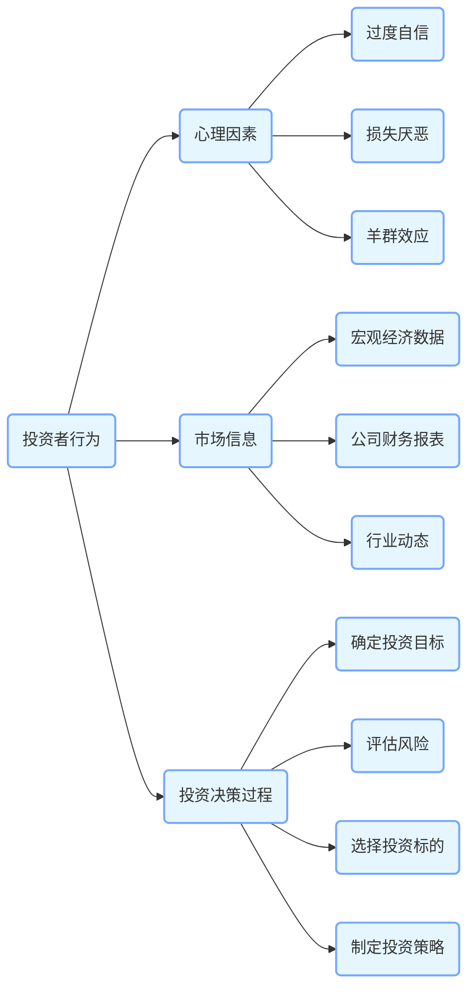

# 深入分析投资者行为：模型构建与应用

> 关键词：投资者行为分析、行为模型构建、模型应用、金融市场、投资决策

> 摘要：本文围绕投资者行为的分析，全面探讨了投资者行为模型的构建与应用。首先介绍了研究的背景、目的、预期读者以及文档结构等内容。接着阐述了投资者行为的核心概念及其相互联系，通过文本示意图和 Mermaid 流程图进行清晰展示。详细讲解了核心算法原理，并结合 Python 源代码进行阐述。给出了相关的数学模型和公式，并举例说明。通过项目实战，从开发环境搭建到源代码实现与解读，深入剖析了如何运用模型进行实际分析。还介绍了模型在不同场景下的实际应用，推荐了学习资源、开发工具框架以及相关论文著作。最后对投资者行为分析的未来发展趋势与挑战进行了总结，并给出常见问题解答和扩展阅读参考资料。

## 1. 背景介绍 
### 1.1 目的和范围
在金融市场中，投资者的行为决策对市场的波动和资产价格的形成有着至关重要的影响。传统的金融理论往往假设投资者是理性的，但实际情况中，投资者会受到各种心理因素、信息不对称等的影响，表现出非理性的行为。本研究的目的在于深入分析投资者的行为，构建能够准确描述和预测投资者行为的模型，并探讨这些模型在金融市场中的实际应用。

研究范围涵盖了各类投资者，包括个人投资者、机构投资者等，涉及股票市场、债券市场、期货市场等不同的金融市场领域。通过对投资者行为的多维度分析，旨在为金融机构、投资者以及监管部门提供有价值的参考，帮助他们更好地理解市场动态，做出更合理的投资决策和监管措施。

### 1.2 预期读者
本文的预期读者主要包括金融领域的专业人士，如投资分析师、基金经理、金融研究员等，他们可以从本文中获取关于投资者行为分析的新方法和新思路，以提升自己的投资决策能力和研究水平。同时，对于正在学习金融和投资相关专业的学生来说，本文也可以作为学习投资者行为理论和实践的参考资料，帮助他们更好地理解金融市场的运行机制。此外，监管部门的工作人员也可以通过本文了解投资者行为的特点和规律，为制定更有效的监管政策提供依据。

### 1.3 文档结构概述
本文共分为十个部分。第一部分为背景介绍，阐述了研究的目的、范围、预期读者以及文档结构等内容。第二部分介绍投资者行为的核心概念与联系，通过文本示意图和 Mermaid 流程图进行展示。第三部分讲解核心算法原理，并给出 Python 源代码。第四部分介绍数学模型和公式，并举例说明。第五部分进行项目实战，包括开发环境搭建、源代码实现与解读。第六部分介绍实际应用场景。第七部分推荐学习资源、开发工具框架以及相关论文著作。第八部分总结未来发展趋势与挑战。第九部分为附录，解答常见问题。第十部分提供扩展阅读和参考资料。

### 1.4 术语表
#### 1.4.1 核心术语定义
- **投资者行为**：指投资者在金融市场中进行投资决策和交易的一系列活动，包括信息收集、分析、判断以及买卖操作等。
- **行为模型**：用于描述和预测投资者行为的数学或逻辑模型，通常基于投资者的心理因素、市场信息等构建。
- **投资决策**：投资者根据自身的投资目标、风险承受能力和市场情况等因素，选择投资标的、投资时机和投资金额的过程。
- **市场情绪**：投资者对金融市场整体或特定资产的看法和预期，反映了投资者的心理状态和情感倾向。

#### 1.4.2 相关概念解释
- **理性投资者**：传统金融理论假设的投资者类型，他们能够根据所有可用信息做出最优的投资决策，不受情感和心理因素的影响。
- **非理性投资者**：在实际金融市场中，投资者往往会受到各种心理偏差的影响，如过度自信、损失厌恶、羊群效应等，导致其投资决策偏离理性。
- **信息不对称**：指市场参与者之间掌握的信息存在差异，一方拥有比另一方更多或更准确的信息，这可能会影响投资者的决策和市场的公平性。

#### 1.4.3 缩略词列表
- **EMH**：有效市场假说（Efficient Market Hypothesis），认为市场价格已经反映了所有可用信息，投资者无法通过分析历史数据或其他信息获得超额收益。
- **CAPM**：资本资产定价模型（Capital Asset Pricing Model），用于描述资产的预期收益率与市场风险之间的关系。
- **BPT**：行为投资组合理论（Behavioral Portfolio Theory），考虑了投资者的心理因素和行为偏差，对传统的投资组合理论进行了改进。

## 2. 核心概念与联系 
投资者行为是一个复杂的概念，涉及到多个方面的因素。其核心概念主要包括投资者的心理因素、市场信息、投资决策过程等。这些概念之间相互影响、相互作用，共同决定了投资者的行为。

### 核心概念原理
- **心理因素**：投资者的心理因素对其投资决策有着重要的影响。例如，过度自信会使投资者高估自己的投资能力，从而做出过于激进的投资决策；损失厌恶则会使投资者在面对损失时更加敏感，不愿意及时止损。
- **市场信息**：投资者需要收集和分析各种市场信息，包括宏观经济数据、公司财务报表、行业动态等，以做出合理的投资决策。然而，市场信息往往是复杂和不确定的，投资者可能会受到信息噪声的干扰。
- **投资决策过程**：投资者的投资决策过程通常包括确定投资目标、评估风险、选择投资标的、制定投资策略等步骤。在这个过程中，投资者会受到心理因素和市场信息的影响。

### 文本示意图
```plaintext
投资者行为
|-- 心理因素
|   |-- 过度自信
|   |-- 损失厌恶
|   |-- 羊群效应
|-- 市场信息
|   |-- 宏观经济数据
|   |-- 公司财务报表
|   |-- 行业动态
|-- 投资决策过程
|   |-- 确定投资目标
|   |-- 评估风险
|   |-- 选择投资标的
|   |-- 制定投资策略
```

### Mermaid 流程图


## 3. 核心算法原理 & 具体操作步骤 
### 算法原理
为了分析投资者行为，我们可以采用机器学习算法中的决策树算法。决策树是一种基于树结构进行决策的算法，它通过对数据集的特征进行划分，构建一个树形结构，每个内部节点表示一个特征上的测试，每个分支表示一个测试输出，每个叶节点表示一个类别或值。

在投资者行为分析中，我们可以将投资者的各种特征（如年龄、性别、投资经验、风险偏好等）作为输入，将投资者的投资决策（如买入、卖出、持有等）作为输出，构建一个决策树模型。通过训练这个模型，我们可以预测投资者在不同情况下的投资决策。

### Python 源代码实现
```python
import pandas as pd
from sklearn.tree import DecisionTreeClassifier
from sklearn.model_selection import train_test_split
from sklearn.metrics import accuracy_score

# 加载数据集
data = pd.read_csv('investor_behavior.csv')

# 划分特征和标签
X = data.drop('investment_decision', axis=1)
y = data['investment_decision']

# 划分训练集和测试集
X_train, X_test, y_train, y_test = train_test_split(X, y, test_size=0.2, random_state=42)

# 创建决策树分类器
clf = DecisionTreeClassifier()

# 训练模型
clf.fit(X_train, y_train)

# 预测测试集
y_pred = clf.predict(X_test)

# 计算准确率
accuracy = accuracy_score(y_test, y_pred)
print(f"模型准确率: {accuracy}")
```

### 具体操作步骤
1. **数据准备**：收集投资者的相关数据，包括特征数据和投资决策数据，并将其整理成 CSV 文件。
2. **数据加载**：使用 Pandas 库加载 CSV 文件，并将其转换为 DataFrame 格式。
3. **特征和标签划分**：将数据集中的特征列和标签列分开。
4. **数据集划分**：使用 `train_test_split` 函数将数据集划分为训练集和测试集。
5. **模型创建**：创建一个决策树分类器对象。
6. **模型训练**：使用训练集对决策树分类器进行训练。
7. **模型预测**：使用训练好的模型对测试集进行预测。
8. **模型评估**：使用 `accuracy_score` 函数计算模型的准确率。

## 4. 数学模型和公式 & 详细讲解 & 举例说明 
### 信息熵
信息熵是信息论中的一个重要概念，用于衡量一个随机变量的不确定性。在决策树算法中，信息熵可以用来衡量数据集的纯度。信息熵的计算公式如下：
$$H(X) = -\sum_{i=1}^{n} p(x_i) \log_2 p(x_i)$$
其中，$X$ 是一个随机变量，$p(x_i)$ 是 $X$ 取值为 $x_i$ 的概率，$n$ 是 $X$ 的取值个数。

### 信息增益
信息增益是指在使用某个特征对数据集进行划分后，数据集的信息熵减少的程度。信息增益越大，说明该特征对数据集的划分能力越强。信息增益的计算公式如下：
$$IG(D, A) = H(D) - \sum_{v \in Values(A)} \frac{|D_v|}{|D|} H(D_v)$$
其中，$D$ 是数据集，$A$ 是特征，$Values(A)$ 是特征 $A$ 的取值集合，$D_v$ 是数据集 $D$ 中特征 $A$ 取值为 $v$ 的子集，$|D|$ 表示数据集 $D$ 的样本数量，$|D_v|$ 表示子集 $D_v$ 的样本数量。

### 举例说明
假设我们有一个包含 10 个样本的数据集，其中 6 个样本的投资决策为买入，4 个样本的投资决策为卖出。则该数据集的信息熵为：
$$H(D) = -\frac{6}{10} \log_2 \frac{6}{10} - \frac{4}{10} \log_2 \frac{4}{10} \approx 0.971$$
假设我们使用特征“年龄”对数据集进行划分，划分后得到两个子集：子集 $D_1$ 包含 5 个样本，其中 4 个样本的投资决策为买入，1 个样本的投资决策为卖出；子集 $D_2$ 包含 5 个样本，其中 2 个样本的投资决策为买入，3 个样本的投资决策为卖出。则子集 $D_1$ 和 $D_2$ 的信息熵分别为：
$$H(D_1) = -\frac{4}{5} \log_2 \frac{4}{5} - \frac{1}{5} \log_2 \frac{1}{5} \approx 0.722$$
$$H(D_2) = -\frac{2}{5} \log_2 \frac{2}{5} - \frac{3}{5} \log_2 \frac{3}{5} \approx 0.971$$
使用特征“年龄”进行划分后的信息增益为：
$$IG(D, 年龄) = H(D) - \frac{5}{10} H(D_1) - \frac{5}{10} H(D_2) \approx 0.971 - \frac{5}{10} \times 0.722 - \frac{5}{10} \times 0.971 \approx 0.125$$

## 5. 项目实战：代码实际案例和详细解释说明 
### 5.1  开发环境搭建
1. **安装 Python**：从 Python 官方网站（https://www.python.org/downloads/）下载并安装 Python 3.x 版本。
2. **安装必要的库**：使用 `pip` 命令安装所需的库，包括 Pandas、Scikit-learn 等。
```bash
pip install pandas scikit-learn
```
3. **准备数据集**：收集投资者的相关数据，并将其整理成 CSV 文件，保存到本地。

### 5.2  源代码详细实现和代码解读
```python
import pandas as pd
from sklearn.tree import DecisionTreeClassifier
from sklearn.model_selection import train_test_split
from sklearn.metrics import accuracy_score

# 加载数据集
data = pd.read_csv('investor_behavior.csv')

# 代码解读：使用 Pandas 的 read_csv 函数加载 CSV 文件，并将其存储为 DataFrame 对象。

# 划分特征和标签
X = data.drop('investment_decision', axis=1)
y = data['investment_decision']

# 代码解读：使用 drop 方法删除 DataFrame 中的 'investment_decision' 列，将剩余的列作为特征数据存储在 X 中；将 'investment_decision' 列作为标签数据存储在 y 中。

# 划分训练集和测试集
X_train, X_test, y_train, y_test = train_test_split(X, y, test_size=0.2, random_state=42)

# 代码解读：使用 train_test_split 函数将数据集划分为训练集和测试集，测试集的比例为 20%，random_state 参数用于保证每次划分的结果一致。

# 创建决策树分类器
clf = DecisionTreeClassifier()

# 代码解读：创建一个 DecisionTreeClassifier 对象，用于构建决策树模型。

# 训练模型
clf.fit(X_train, y_train)

# 代码解读：使用训练集数据对决策树分类器进行训练。

# 预测测试集
y_pred = clf.predict(X_test)

# 代码解读：使用训练好的模型对测试集数据进行预测，得到预测结果存储在 y_pred 中。

# 计算准确率
accuracy = accuracy_score(y_test, y_pred)
print(f"模型准确率: {accuracy}")

# 代码解读：使用 accuracy_score 函数计算模型的准确率，并将结果打印输出。
```

### 5.3  代码解读与分析
通过上述代码，我们可以实现一个简单的投资者行为分析模型。首先，我们使用 Pandas 库加载数据集，并将其划分为特征数据和标签数据。然后，使用 `train_test_split` 函数将数据集划分为训练集和测试集。接着，创建一个决策树分类器对象，并使用训练集数据对其进行训练。最后，使用训练好的模型对测试集数据进行预测，并计算模型的准确率。

从代码中可以看出，决策树算法的实现相对简单，只需要几行代码就可以完成模型的训练和预测。然而，在实际应用中，我们还需要对数据进行预处理，如数据清洗、特征选择等，以提高模型的性能。

## 6. 实际应用场景 
### 金融机构投资决策支持
金融机构可以利用投资者行为分析模型为投资决策提供支持。通过分析投资者的行为和偏好，金融机构可以更好地了解市场需求，制定更符合投资者需求的投资策略。例如，根据投资者的风险偏好和投资目标，为其推荐合适的投资产品；根据投资者的交易行为，预测市场的短期波动，及时调整投资组合。

### 投资者个性化服务
投资者行为分析模型可以为投资者提供个性化的服务。通过对投资者的行为数据进行分析，了解投资者的投资习惯、风险承受能力等信息，为投资者提供个性化的投资建议和投资组合推荐。例如，对于风险偏好较低的投资者，可以推荐债券、货币基金等低风险投资产品；对于风险偏好较高的投资者，可以推荐股票、期货等高风险投资产品。

### 市场监管
监管部门可以利用投资者行为分析模型对金融市场进行监管。通过分析投资者的行为数据，及时发现异常交易行为和市场操纵行为，采取相应的监管措施，维护市场的公平和稳定。例如，监测投资者的交易频率、交易金额等指标，发现异常交易行为及时进行调查和处理。

### 金融产品设计
金融机构可以根据投资者行为分析模型的结果设计更符合投资者需求的金融产品。通过了解投资者的行为和偏好，金融机构可以开发出具有不同风险收益特征的金融产品，满足不同投资者的需求。例如，开发出适合短期投资者的短期理财产品，适合长期投资者的长期投资基金等。

## 7. 工具和资源推荐
### 7.1 学习资源推荐
#### 7.1.1 书籍推荐
- 《行为金融学》：这本书系统地介绍了行为金融学的基本理论和方法，通过大量的案例分析，阐述了投资者的心理因素和行为偏差对金融市场的影响。
- 《金融市场技术分析》：该书详细介绍了金融市场的技术分析方法，包括图表分析、指标分析等，对于理解投资者的交易行为和市场趋势具有重要的参考价值。
- 《聪明的投资者》：这是一本经典的投资书籍，作者本杰明·格雷厄姆通过深入浅出的语言，阐述了价值投资的理念和方法，对于投资者树立正确的投资观念具有重要的指导意义。

#### 7.1.2 在线课程
- Coursera 上的“行为金融学”课程：该课程由知名教授授课，内容涵盖了行为金融学的各个方面，通过视频讲解、案例分析等方式，帮助学员深入理解投资者的行为和心理。
- edX 上的“金融市场分析”课程：该课程介绍了金融市场的基本原理和分析方法，包括宏观经济分析、公司财务分析等，对于学员掌握金融市场的运行机制具有重要的帮助。
- 中国大学 MOOC 上的“投资学”课程：该课程由国内知名高校的教授授课，内容涵盖了投资学的基本理论和方法，通过实际案例分析，帮助学员提高投资决策能力。

#### 7.1.3 技术博客和网站
- 金融界网站：该网站提供了丰富的金融市场资讯和分析报告，包括股票、基金、债券等多个领域，对于投资者了解市场动态和获取投资信息具有重要的帮助。
- 雪球网：这是一个投资者交流社区，投资者可以在上面分享自己的投资经验和观点，了解其他投资者的行为和决策，对于提高投资水平具有一定的参考价值。
- 量化投资与机器学习博客：该博客专注于量化投资和机器学习在金融领域的应用，分享了大量的技术文章和代码实现，对于技术人员和投资者了解相关技术具有重要的参考价值。

### 7.2 开发工具框架推荐
#### 7.2.1 IDE和编辑器
- PyCharm：这是一款专业的 Python 集成开发环境，具有代码编辑、调试、版本控制等功能，对于开发投资者行为分析模型非常方便。
- Jupyter Notebook：这是一个交互式的开发环境，支持 Python、R 等多种编程语言，适合进行数据分析和模型开发。
- Visual Studio Code：这是一款轻量级的代码编辑器，具有丰富的插件和扩展功能，支持多种编程语言，对于快速开发和调试代码非常有用。

#### 7.2.2 调试和性能分析工具
- PDB：这是 Python 自带的调试工具，可以帮助开发者在代码运行过程中进行调试，查找代码中的错误。
- cProfile：这是 Python 自带的性能分析工具，可以帮助开发者分析代码的性能瓶颈，优化代码的运行效率。
- Py-Spy：这是一个第三方的性能分析工具，可以实时监测 Python 程序的运行状态，分析代码的性能瓶颈。

#### 7.2.3 相关框架和库
- Pandas：这是一个强大的数据分析库，提供了 DataFrame 和 Series 等数据结构，方便进行数据处理和分析。
- Scikit-learn：这是一个常用的机器学习库，提供了各种机器学习算法和工具，如分类、回归、聚类等，对于构建投资者行为分析模型非常有用。
- TensorFlow：这是一个开源的深度学习框架，提供了丰富的深度学习模型和工具，如神经网络、卷积神经网络等，对于处理复杂的投资者行为数据具有一定的优势。

### 7.3 相关论文著作推荐
#### 7.3.1 经典论文
- “Efficient Capital Markets: A Review of Theory and Empirical Work”：这篇论文提出了有效市场假说，认为市场价格已经反映了所有可用信息，投资者无法通过分析历史数据或其他信息获得超额收益。
- “Prospect Theory: An Analysis of Decision under Risk”：这篇论文提出了前景理论，解释了投资者在面对风险时的决策行为，认为投资者在面对收益和损失时具有不同的风险偏好。
- “The Behavior of Stock Market Prices”：这篇论文研究了股票市场价格的波动规律，发现股票市场价格具有随机性和不可预测性。

#### 7.3.2 最新研究成果
- “Behavioral Finance and the Psychology of Investing”：该研究成果综合了行为金融学和心理学的理论和方法，深入分析了投资者的心理因素和行为偏差对投资决策的影响。
- “Machine Learning in Finance: Applications and Challenges”：该研究探讨了机器学习在金融领域的应用和挑战，包括投资者行为分析、风险评估、投资组合优化等方面。
- “Big Data Analytics in Financial Markets”：该研究介绍了大数据分析在金融市场中的应用，包括市场趋势预测、投资者行为分析、风险预警等方面。

#### 7.3.3 应用案例分析
- “Application of Behavioral Finance in Investment Decision-Making”：该案例分析了行为金融学在投资决策中的应用，通过实际案例展示了如何利用投资者的心理因素和行为偏差进行投资决策。
- “Using Machine Learning to Predict Investor Behavior”：该案例介绍了如何使用机器学习算法预测投资者的行为，通过实际数据验证了模型的有效性。
- “Big Data Analytics for Financial Market Surveillance”：该案例分析了大数据分析在金融市场监管中的应用，通过实际案例展示了如何利用大数据分析技术监测市场异常行为和风险。

## 8. 总结：未来发展趋势与挑战
### 未来发展趋势
- **多学科融合**：投资者行为分析将越来越多地融合心理学、社会学、经济学等多个学科的理论和方法，以更全面地理解投资者的行为和决策过程。
- **大数据和人工智能的应用**：随着大数据和人工智能技术的不断发展，投资者行为分析将能够处理更大量、更复杂的数据，提高模型的准确性和预测能力。
- **个性化服务的深入发展**：金融机构将更加注重为投资者提供个性化的服务，根据投资者的行为和偏好，为其提供更加精准的投资建议和投资产品。
- **监管的加强**：监管部门将加强对投资者行为的监管，利用投资者行为分析模型及时发现市场异常行为和风险，维护市场的公平和稳定。

### 挑战
- **数据质量和隐私问题**：投资者行为分析需要大量的高质量数据，但数据的收集、存储和使用可能会涉及到隐私问题。如何在保证数据质量的前提下，保护投资者的隐私是一个亟待解决的问题。
- **模型的可解释性**：随着机器学习和深度学习模型的广泛应用，模型的可解释性成为了一个重要的问题。投资者和监管部门需要了解模型的决策过程和依据，以便做出合理的决策。
- **市场的复杂性和不确定性**：金融市场是一个复杂的系统，受到多种因素的影响，具有很高的不确定性。如何在复杂和不确定的市场环境中构建准确的投资者行为分析模型是一个挑战。
- **技术的更新换代**：大数据和人工智能技术发展迅速，新的算法和模型不断涌现。投资者行为分析领域需要不断跟进技术的发展，及时更新和改进分析方法和模型。

## 9. 附录：常见问题与解答
### 问题 1：投资者行为分析模型的准确率有多高？
投资者行为分析模型的准确率受到多种因素的影响，如数据质量、模型选择、特征工程等。一般来说，模型的准确率在 70% - 90% 之间，但在实际应用中，可能会因为市场环境的变化和数据的不完整性等因素而有所波动。

### 问题 2：如何提高投资者行为分析模型的性能？
可以从以下几个方面提高模型的性能：
- **数据预处理**：对数据进行清洗、归一化、特征选择等处理，提高数据的质量和可用性。
- **模型选择**：根据数据的特点和问题的需求，选择合适的模型，如决策树、神经网络、支持向量机等。
- **特征工程**：提取和选择有代表性的特征，如投资者的年龄、性别、投资经验、风险偏好等，以提高模型的预测能力。
- **模型评估和优化**：使用交叉验证、网格搜索等方法对模型进行评估和优化，选择最优的模型参数。

### 问题 3：投资者行为分析模型可以应用于哪些金融市场？
投资者行为分析模型可以应用于股票市场、债券市场、期货市场、外汇市场等多个金融市场。不同的金融市场具有不同的特点和规律，需要根据市场的实际情况进行模型的调整和优化。

### 问题 4：投资者行为分析模型是否可以完全替代投资者的决策？
投资者行为分析模型可以为投资者提供有价值的参考和建议，但不能完全替代投资者的决策。投资者的决策还受到个人的投资目标、风险承受能力、心理因素等多种因素的影响，需要综合考虑各种因素做出决策。

## 10. 扩展阅读 & 参考资料
### 扩展阅读
- 《金融心理学》：该书深入探讨了金融市场中的心理学现象，包括投资者的情绪、认知偏差等对金融市场的影响。
- 《量化投资：策略与技术》：介绍了量化投资的基本原理和方法，包括数据处理、模型构建、策略回测等内容。
- 《机器学习实战》：通过实际案例详细介绍了机器学习算法的实现和应用，对于理解和应用投资者行为分析模型具有重要的帮助。

### 参考资料
- Fama, E. F. (1970). Efficient capital markets: A review of theory and empirical work. The Journal of Finance, 25(2), 383-417.
- Kahneman, D., & Tversky, A. (1979). Prospect theory: An analysis of decision under risk. Econometrica: Journal of the Econometric Society, 263-291.
- Mandelbrot, B. B. (1963). The variation of certain speculative prices. The Journal of Business, 36(4), 394-419.

作者：AI天才研究院/AI Genius Institute & 禅与计算机程序设计艺术 /Zen And The Art of Computer Programming