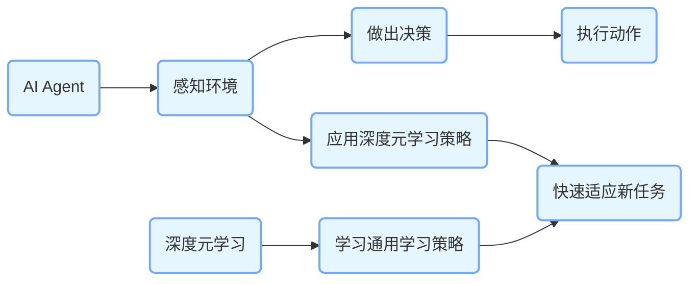

# 深度元学习在AI Agent快速适应中的应用

> 关键词：深度元学习、AI Agent、快速适应、元学习算法、强化学习

> 摘要：本文围绕深度元学习在AI Agent快速适应中的应用展开深入探讨。首先介绍了深度元学习和AI Agent的背景知识，明确研究目的和范围。接着阐述核心概念与联系，通过文本示意图和Mermaid流程图展示其架构。详细讲解核心算法原理，用Python代码进行说明，同时给出数学模型和公式并举例。通过项目实战展示代码实现与解读，分析实际应用场景。最后推荐相关工具和资源，总结未来发展趋势与挑战，解答常见问题并提供扩展阅读和参考资料，旨在为相关领域研究者和开发者提供全面的技术指导。

## 1. 背景介绍 
### 1.1 目的和范围
随着人工智能技术的不断发展，AI Agent需要在复杂多变的环境中快速适应并做出有效的决策。传统的机器学习方法往往需要大量的数据和长时间的训练才能达到较好的效果，难以满足实际应用中快速适应的需求。深度元学习作为一种新兴的技术，旨在让模型能够快速学习新知识，具备快速适应新环境的能力。本文的目的是深入研究深度元学习在AI Agent快速适应中的应用，探讨其核心原理、算法实现和实际应用场景，为相关领域的研究和开发提供理论支持和实践指导。

本文的研究范围主要包括深度元学习的基本概念、核心算法，如模型无关元学习（MAML）、元强化学习等；AI Agent在不同环境中的快速适应问题；以及深度元学习在机器人控制、游戏智能体等实际应用场景中的具体应用。

### 1.2 预期读者
本文预期读者包括人工智能领域的研究者、开发者、研究生以及对深度元学习和AI Agent感兴趣的技术爱好者。对于研究者，本文可以提供新的研究思路和方向；对于开发者，本文可以帮助他们将深度元学习技术应用到实际项目中；对于研究生和技术爱好者，本文可以作为学习深度元学习和AI Agent的参考资料。

### 1.3 文档结构概述
本文将按照以下结构进行组织：
1. 背景介绍：介绍研究的目的、范围、预期读者和文档结构，以及相关术语的定义和解释。
2. 核心概念与联系：阐述深度元学习和AI Agent的核心概念，展示它们之间的联系，并通过文本示意图和Mermaid流程图进行说明。
3. 核心算法原理 & 具体操作步骤：详细讲解深度元学习的核心算法，如MAML、元强化学习等，并使用Python代码进行实现和解释。
4. 数学模型和公式 & 详细讲解 & 举例说明：给出深度元学习的数学模型和公式，进行详细讲解，并通过具体例子进行说明。
5. 项目实战：代码实际案例和详细解释说明：通过一个实际的项目案例，展示深度元学习在AI Agent快速适应中的应用，包括开发环境搭建、源代码实现和代码解读。
6. 实际应用场景：介绍深度元学习在机器人控制、游戏智能体等实际应用场景中的具体应用。
7. 工具和资源推荐：推荐相关的学习资源、开发工具和框架，以及经典论文和最新研究成果。
8. 总结：未来发展趋势与挑战：总结深度元学习在AI Agent快速适应中的应用现状，分析未来发展趋势和面临的挑战。
9. 附录：常见问题与解答：解答读者在阅读过程中可能遇到的常见问题。
10. 扩展阅读 & 参考资料：提供相关的扩展阅读资料和参考书目。

### 1.4 术语表
#### 1.4.1 核心术语定义
- **深度元学习（Deep Meta-Learning）**：一种基于深度学习的元学习方法，旨在让模型能够快速学习新知识，具备快速适应新环境的能力。
- **AI Agent（人工智能智能体）**：能够感知环境、做出决策并执行动作的人工智能实体。
- **元学习（Meta-Learning）**：也称为“学习如何学习”，是一种让模型能够在多个任务上学习通用的学习策略，从而在新任务上快速学习的方法。
- **模型无关元学习（Model-Agnostic Meta-Learning，MAML）**：一种通用的元学习算法，适用于各种基于梯度的模型，能够在少量样本上快速适应新任务。
- **元强化学习（Meta-Reinforcement Learning）**：将元学习与强化学习相结合，让智能体能够在不同的环境中快速学习最优策略。

#### 1.4.2 相关概念解释
- **快速适应**：指AI Agent在面对新的环境或任务时，能够在少量的样本或交互中快速调整自己的策略，达到较好的性能。
- **元训练**：在元学习中，元训练是指在多个任务上进行训练，学习通用的学习策略。
- **元测试**：在元训练完成后，使用新的任务对模型进行测试，评估模型的快速适应能力。

#### 1.4.3 缩略词列表
- **MAML**：Model-Agnostic Meta-Learning（模型无关元学习）
- **RL**：Reinforcement Learning（强化学习）
- **ML**：Machine Learning（机器学习）
- **DL**：Deep Learning（深度学习）

## 2. 核心概念与联系 

### 深度元学习的核心概念
深度元学习是元学习与深度学习的结合，它的核心思想是让模型能够学习到如何快速学习。传统的深度学习模型通常是在大量的数据上进行训练，学习特定任务的模式和特征。而深度元学习则是在多个任务上进行训练，学习通用的学习策略，使得模型能够在新的任务上快速适应。

深度元学习的一个重要特点是能够利用少量的样本进行快速学习。在实际应用中，获取大量的标注数据往往是困难和昂贵的，深度元学习可以通过学习到的通用学习策略，在少量样本上进行快速调整，达到较好的性能。

### AI Agent的核心概念
AI Agent是一种能够感知环境、做出决策并执行动作的人工智能实体。它可以是机器人、游戏智能体、智能客服等。AI Agent的目标是在不同的环境中实现特定的任务，如导航、目标识别、游戏通关等。

AI Agent通常由感知模块、决策模块和执行模块组成。感知模块用于获取环境信息，决策模块根据感知到的信息做出决策，执行模块将决策转化为实际的动作。

### 深度元学习与AI Agent的联系
深度元学习可以为AI Agent提供快速适应新环境和新任务的能力。通过深度元学习，AI Agent可以学习到通用的学习策略，在面对新的环境或任务时，能够在少量的样本或交互中快速调整自己的策略，达到较好的性能。

例如，在机器人控制中，机器人需要在不同的环境中完成不同的任务，如导航、抓取物体等。传统的方法需要为每个任务单独训练一个模型，而使用深度元学习，机器人可以学习到通用的学习策略，在新的任务上快速适应，减少训练时间和数据需求。

### 文本示意图
```plaintext
+-----------------+        +-----------------+
|   深度元学习    |        |     AI Agent    |
+-----------------+        +-----------------+
| - 学习通用策略  |        | - 感知环境      |
| - 快速适应新任务|        | - 做出决策      |
|                 |        | - 执行动作      |
+-----------------+        +-----------------+
           |                          |
           |  提供快速适应能力        |  应用深度元学习
           v                          v
+------------------------------------------------+
|            快速适应新环境和新任务              |
+------------------------------------------------+
```

### Mermaid流程图


## 3. 核心算法原理 & 具体操作步骤 

### 模型无关元学习（MAML）原理
模型无关元学习（MAML）是一种通用的元学习算法，适用于各种基于梯度的模型，如神经网络。MAML的核心思想是通过在多个任务上进行训练，找到一组初始参数，使得模型在这些任务上进行少量的梯度更新后，能够快速适应新的任务。

MAML的训练过程分为两个阶段：元训练和元测试。在元训练阶段，从一个任务分布中采样多个任务，对于每个任务，首先使用初始参数进行前向传播，计算损失函数，然后使用梯度下降法更新参数，得到一组新的参数。接着，使用新的参数在该任务上进行再次前向传播，计算损失函数，将所有任务的损失函数求和，得到元损失函数。最后，使用梯度下降法更新初始参数，使得元损失函数最小化。

在元测试阶段，使用训练好的初始参数，在新的任务上进行少量的梯度更新，然后评估模型的性能。

### MAML的Python代码实现
```python
import torch
import torch.nn as nn
import torch.optim as optim

# 定义一个简单的神经网络模型
class SimpleNet(nn.Module):
    def __init__(self):
        super(SimpleNet, self).__init__()
        self.fc1 = nn.Linear(10, 20)
        self.fc2 = nn.Linear(20, 1)

    def forward(self, x):
        x = torch.relu(self.fc1(x))
        x = self.fc2(x)
        return x

# 定义元训练函数
def meta_train(model, meta_optimizer, tasks, num_inner_steps, inner_lr):
    meta_loss = 0
    for task in tasks:
        # 复制模型参数
        fast_weights = list(model.parameters())
        # 内循环更新
        for _ in range(num_inner_steps):
            inputs, labels = task
            outputs = model(inputs)
            loss = nn.MSELoss()(outputs, labels)
            grads = torch.autograd.grad(loss, fast_weights)
            fast_weights = [w - inner_lr * g for w, g in zip(fast_weights, grads)]
        # 计算元损失
        outputs = model(inputs)
        meta_loss += nn.MSELoss()(outputs, labels)
    # 更新元参数
    meta_optimizer.zero_grad()
    meta_loss.backward()
    meta_optimizer.step()
    return meta_loss.item()

# 初始化模型和优化器
model = SimpleNet()
meta_optimizer = optim.Adam(model.parameters(), lr=0.001)

# 生成一些任务数据
tasks = []
for _ in range(10):
    inputs = torch.randn(10, 10)
    labels = torch.randn(10, 1)
    tasks.append((inputs, labels))

# 进行元训练
num_epochs = 100
num_inner_steps = 5
inner_lr = 0.01
for epoch in range(num_epochs):
    meta_loss = meta_train(model, meta_optimizer, tasks, num_inner_steps, inner_lr)
    if (epoch + 1) % 10 == 0:
        print(f'Epoch {epoch + 1}/{num_epochs}, Meta Loss: {meta_loss}')
```

### 元强化学习原理
元强化学习将元学习与强化学习相结合，让智能体能够在不同的环境中快速学习最优策略。元强化学习的核心思想是学习一个元策略，该策略可以根据不同的环境动态调整智能体的行为。

元强化学习的训练过程通常包括两个循环：外层循环是元训练循环，用于更新元策略；内层循环是强化学习循环，用于在当前环境中学习最优策略。在元训练循环中，从一个环境分布中采样多个环境，对于每个环境，使用当前的元策略初始化智能体的策略，然后在该环境中进行强化学习训练，得到一组新的策略参数。最后，根据这些新的策略参数更新元策略。

### 元强化学习的Python代码实现
```python
import torch
import torch.nn as nn
import torch.optim as optim
import gym

# 定义一个简单的策略网络
class PolicyNet(nn.Module):
    def __init__(self, input_dim, output_dim):
        super(PolicyNet, self).__init__()
        self.fc1 = nn.Linear(input_dim, 20)
        self.fc2 = nn.Linear(20, output_dim)

    def forward(self, x):
        x = torch.relu(self.fc1(x))
        x = torch.softmax(self.fc2(x), dim=-1)
        return x

# 定义元强化学习函数
def meta_rl_train(meta_policy, meta_optimizer, env_names, num_episodes, inner_lr):
    meta_loss = 0
    for env_name in env_names:
        env = gym.make(env_name)
        input_dim = env.observation_space.shape[0]
        output_dim = env.action_space.n
        policy = PolicyNet(input_dim, output_dim)
        # 复制元策略参数到策略网络
        for p, mp in zip(policy.parameters(), meta_policy.parameters()):
            p.data.copy_(mp.data)
        optimizer = optim.Adam(policy.parameters(), lr=inner_lr)
        for episode in range(num_episodes):
            state = env.reset()
            done = False
            total_reward = 0
            while not done:
                state = torch.FloatTensor(state).unsqueeze(0)
                action_probs = policy(state)
                action = torch.multinomial(action_probs, 1).item()
                next_state, reward, done, _ = env.step(action)
                total_reward += reward
                state = next_state
            # 计算损失并更新策略
            loss = -total_reward
            optimizer.zero_grad()
            loss.backward()
            optimizer.step()
        # 计算元损失
        meta_loss += loss.item()
    # 更新元策略
    meta_optimizer.zero_grad()
    meta_loss.backward()
    meta_optimizer.step()
    return meta_loss.item()

# 初始化元策略和优化器
meta_policy = PolicyNet(4, 2)  # 以CartPole环境为例
meta_optimizer = optim.Adam(meta_policy.parameters(), lr=0.001)

# 定义环境列表
env_names = ['CartPole-v1']

# 进行元强化学习训练
num_epochs = 100
num_episodes = 10
inner_lr = 0.01
for epoch in range(num_epochs):
    meta_loss = meta_rl_train(meta_policy, meta_optimizer, env_names, num_episodes, inner_lr)
    if (epoch + 1) % 10 == 0:
        print(f'Epoch {epoch + 1}/{num_epochs}, Meta Loss: {meta_loss}')
```

## 4. 数学模型和公式 & 详细讲解 & 举例说明 

### 模型无关元学习（MAML）的数学模型和公式
#### 符号定义
- $\theta$：模型的初始参数。
- $\tau$：一个任务，包含训练集 $D_{train}^{\tau}$ 和测试集 $D_{test}^{\tau}$。
- $\mathcal{T}$：任务分布。
- $\mathcal{L}$：损失函数。
- $\alpha$：内循环学习率。
- $\beta$：元学习率。

#### 内循环更新
对于一个任务 $\tau$，首先使用初始参数 $\theta$ 进行前向传播，计算训练集 $D_{train}^{\tau}$ 上的损失函数 $\mathcal{L}(D_{train}^{\tau}; \theta)$，然后使用梯度下降法更新参数：
$$
\theta_{i}^{\prime} = \theta - \alpha \nabla_{\theta} \mathcal{L}(D_{train}^{\tau}; \theta)
$$
其中，$\theta_{i}^{\prime}$ 是更新后的参数。

#### 元损失函数
将所有任务的测试集上的损失函数求和，得到元损失函数：
$$
\mathcal{L}_{meta}(\theta) = \sum_{\tau \sim \mathcal{T}} \mathcal{L}(D_{test}^{\tau}; \theta_{i}^{\prime})
$$

#### 元训练
使用梯度下降法更新初始参数 $\theta$，使得元损失函数最小化：
$$
\theta \leftarrow \theta - \beta \nabla_{\theta} \mathcal{L}_{meta}(\theta)
$$

#### 举例说明
假设我们有一个简单的线性回归任务，模型的输出为 $y = wx + b$，损失函数为均方误差损失 $\mathcal{L}(y, \hat{y}) = \frac{1}{n} \sum_{i=1}^{n} (y_i - \hat{y}_i)^2$。

在元训练阶段，我们从任务分布中采样两个任务 $\tau_1$ 和 $\tau_2$。对于任务 $\tau_1$，训练集为 $\{(x_1, y_1), (x_2, y_2)\}$，测试集为 $\{(x_3, y_3), (x_4, y_4)\}$；对于任务 $\tau_2$，训练集为 $\{(x_5, y_5), (x_6, y_6)\}$，测试集为 $\{(x_7, y_7), (x_8, y_8)\}$。

首先，使用初始参数 $w$ 和 $b$ 计算任务 $\tau_1$ 训练集上的损失函数 $\mathcal{L}(D_{train}^{\tau_1}; w, b)$，然后使用梯度下降法更新参数：
$$
w_1^{\prime} = w - \alpha \frac{\partial \mathcal{L}(D_{train}^{\tau_1}; w, b)}{\partial w}
$$
$$
b_1^{\prime} = b - \alpha \frac{\partial \mathcal{L}(D_{train}^{\tau_1}; w, b)}{\partial b}
$$
接着，使用更新后的参数 $w_1^{\prime}$ 和 $b_1^{\prime}$ 计算任务 $\tau_1$ 测试集上的损失函数 $\mathcal{L}(D_{test}^{\tau_1}; w_1^{\prime}, b_1^{\prime})$。

同样的方法，对任务 $\tau_2$ 进行处理，得到 $\mathcal{L}(D_{test}^{\tau_2}; w_2^{\prime}, b_2^{\prime})$。

最后，将两个任务的测试集上的损失函数求和，得到元损失函数：
$$
\mathcal{L}_{meta}(w, b) = \mathcal{L}(D_{test}^{\tau_1}; w_1^{\prime}, b_1^{\prime}) + \mathcal{L}(D_{test}^{\tau_2}; w_2^{\prime}, b_2^{\prime})
$$
使用梯度下降法更新初始参数 $w$ 和 $b$，使得元损失函数最小化。

### 元强化学习的数学模型和公式
#### 符号定义
- $\pi_{\theta}$：策略网络，参数为 $\theta$。
- $\rho$：环境分布。
- $r(s, a)$：奖励函数，$s$ 为状态，$a$ 为动作。
- $\gamma$：折扣因子。
- $J(\pi_{\theta}, \rho)$：策略 $\pi_{\theta}$ 在环境分布 $\rho$ 上的期望累积奖励。

#### 元目标函数
元强化学习的目标是最大化元目标函数：
$$
\max_{\theta} \mathbb{E}_{\rho \sim \mathcal{R}} [J(\pi_{\theta}, \rho)]
$$
其中，$\mathcal{R}$ 是环境分布的集合。

#### 元训练
在元训练过程中，从环境分布 $\rho$ 中采样一个环境 $E$，使用当前的策略 $\pi_{\theta}$ 在环境 $E$ 中进行强化学习训练，得到一组新的策略参数 $\theta^{\prime}$。然后，根据 $\theta^{\prime}$ 更新元策略参数 $\theta$。

#### 举例说明
假设我们有一个简单的迷宫环境，智能体的目标是从起点到达终点。策略网络 $\pi_{\theta}$ 根据当前的状态 $s$ 输出动作 $a$ 的概率分布。

在元训练阶段，从环境分布中采样一个迷宫环境 $E$。智能体使用当前的策略 $\pi_{\theta}$ 在环境 $E$ 中进行探索，根据奖励函数 $r(s, a)$ 获得奖励。使用强化学习算法（如策略梯度算法）更新策略参数，得到一组新的策略参数 $\theta^{\prime}$。

计算策略 $\pi_{\theta^{\prime}}$ 在环境 $E$ 上的期望累积奖励 $J(\pi_{\theta^{\prime}}, E)$，将其作为元目标函数的一个样本。重复上述过程，采样多个环境，得到多个样本，使用梯度上升法更新元策略参数 $\theta$，使得元目标函数最大化。

## 5. 项目实战：代码实际案例和详细解释说明 

### 5.1  开发环境搭建
#### 安装Python
首先，确保你已经安装了Python 3.6或更高版本。可以从Python官方网站（https://www.python.org/downloads/）下载并安装。

#### 安装必要的库
我们需要安装一些必要的Python库，如PyTorch、NumPy、Gym等。可以使用以下命令进行安装：
```bash
pip install torch numpy gym
```

### 5.2  源代码详细实现和代码解读
#### 项目概述
本项目使用模型无关元学习（MAML）算法，让AI Agent在多个线性回归任务上进行快速适应。每个线性回归任务的数据集由不同的斜率和截距生成。

#### 代码实现
```python
import torch
import torch.nn as nn
import torch.optim as optim
import numpy as np

# 定义一个简单的线性回归模型
class LinearRegression(nn.Module):
    def __init__(self):
        super(LinearRegression, self).__init__()
        self.linear = nn.Linear(1, 1)

    def forward(self, x):
        return self.linear(x)

# 生成任务数据
def generate_task():
    slope = np.random.uniform(-1, 1)
    intercept = np.random.uniform(-1, 1)
    x_train = torch.FloatTensor(np.random.uniform(-5, 5, size=(10, 1)))
    y_train = slope * x_train + intercept
    x_test = torch.FloatTensor(np.random.uniform(-5, 5, size=(10, 1)))
    y_test = slope * x_test + intercept
    return (x_train, y_train), (x_test, y_test)

# 元训练函数
def meta_train(model, meta_optimizer, num_tasks, num_inner_steps, inner_lr):
    meta_loss = 0
    for _ in range(num_tasks):
        (x_train, y_train), (x_test, y_test) = generate_task()
        # 复制模型参数
        fast_weights = list(model.parameters())
        # 内循环更新
        for _ in range(num_inner_steps):
            outputs = model(x_train)
            loss = nn.MSELoss()(outputs, y_train)
            grads = torch.autograd.grad(loss, fast_weights)
            fast_weights = [w - inner_lr * g for w, g in zip(fast_weights, grads)]
        # 计算元损失
        outputs = model(x_test)
        meta_loss += nn.MSELoss()(outputs, y_test)
    # 更新元参数
    meta_optimizer.zero_grad()
    meta_loss.backward()
    meta_optimizer.step()
    return meta_loss.item()

# 初始化模型和优化器
model = LinearRegression()
meta_optimizer = optim.Adam(model.parameters(), lr=0.001)

# 进行元训练
num_epochs = 100
num_tasks = 10
num_inner_steps = 5
inner_lr = 0.01
for epoch in range(num_epochs):
    meta_loss = meta_train(model, meta_optimizer, num_tasks, num_inner_steps, inner_lr)
    if (epoch + 1) % 10 == 0:
        print(f'Epoch {epoch + 1}/{num_epochs}, Meta Loss: {meta_loss}')
```

#### 代码解读
1. **模型定义**：定义了一个简单的线性回归模型 `LinearRegression`，包含一个线性层。
2. **任务数据生成**：`generate_task` 函数用于生成一个线性回归任务的数据，包括训练集和测试集。每个任务的斜率和截距是随机生成的。
3. **元训练函数**：`meta_train` 函数实现了MAML的元训练过程。对于每个任务，首先复制模型参数，然后在内循环中使用梯度下降法更新参数，最后计算元损失并更新元参数。
4. **主训练循环**：在主训练循环中，调用 `meta_train` 函数进行元训练，每个epoch打印一次元损失。

### 5.3  代码解读与分析
#### 模型的适应性
通过元训练，模型能够学习到通用的学习策略，在新的线性回归任务上快速适应。在元训练过程中，模型不断调整初始参数，使得在不同任务上进行少量的梯度更新后，能够快速收敛到较好的性能。

#### 内循环和外循环的作用
内循环的作用是在当前任务上进行快速适应，通过少量的梯度更新调整模型参数。外循环的作用是在多个任务上进行训练，学习通用的学习策略，更新元参数。

#### 学习率的影响
内循环学习率 $\alpha$ 和元学习率 $\beta$ 对模型的性能有重要影响。内循环学习率过大，可能导致模型在当前任务上过度拟合；内循环学习率过小，模型的适应速度会变慢。元学习率过大，可能导致元参数更新过快，无法学习到有效的通用策略；元学习率过小，模型的训练速度会变慢。

## 6. 实际应用场景 

### 机器人控制
在机器人控制中，机器人需要在不同的环境中完成不同的任务，如导航、抓取物体等。传统的方法需要为每个任务单独训练一个模型，而使用深度元学习，机器人可以学习到通用的学习策略，在新的任务上快速适应，减少训练时间和数据需求。

例如，在一个仓库环境中，机器人需要完成货物搬运任务。使用深度元学习，机器人可以在多个类似的仓库环境中进行元训练，学习到通用的导航和抓取策略。当机器人进入一个新的仓库环境时，能够在少量的交互中快速调整自己的策略，完成货物搬运任务。

### 游戏智能体
在游戏领域，游戏环境通常是复杂多变的，游戏智能体需要快速适应新的游戏关卡和对手策略。深度元学习可以让游戏智能体学习到通用的游戏策略，在新的游戏环境中快速调整自己的行为。

例如，在一个实时策略游戏中，游戏智能体需要根据不同的地图布局和对手策略制定相应的战术。使用深度元学习，游戏智能体可以在多个游戏地图和对手策略上进行元训练，学习到通用的游戏策略。当进入一个新的游戏关卡时，游戏智能体能够在少量的游戏交互中快速适应新的环境，制定出有效的战术。

### 医疗诊断
在医疗诊断领域，医生需要根据患者的症状和检查结果做出准确的诊断。深度元学习可以用于辅助医生进行诊断，通过学习大量的病例数据，学习到通用的诊断策略。当遇到新的病例时，能够在少量的信息下快速做出诊断。

例如，在影像诊断中，医生需要根据X光、CT等影像数据判断患者是否患有某种疾病。使用深度元学习，模型可以在多个医院的影像数据上进行元训练，学习到通用的影像诊断策略。当遇到一个新的患者影像数据时，模型能够在少量的特征提取后快速做出诊断，提高诊断效率和准确性。

### 金融投资
在金融投资领域，投资者需要根据市场行情和经济数据做出投资决策。深度元学习可以用于金融市场预测和投资策略优化，通过学习多个市场环境和经济周期的数据，学习到通用的投资策略。当市场环境发生变化时，能够在少量的市场信息下快速调整投资策略。

例如，在股票投资中，投资者需要根据股票价格走势、公司财务数据等信息选择投资标的。使用深度元学习，模型可以在多个股票市场和经济周期的数据上进行元训练，学习到通用的股票投资策略。当市场行情发生变化时，模型能够在少量的市场数据更新后快速调整投资组合，提高投资收益。

## 7. 工具和资源推荐

### 7.1 学习资源推荐
#### 7.1.1 书籍推荐
- 《Deep Learning》（深度学习）：由Ian Goodfellow、Yoshua Bengio和Aaron Courville撰写，是深度学习领域的经典教材，涵盖了深度学习的基本概念、算法和应用。
- 《Reinforcement Learning: An Introduction》（强化学习：导论）：由Richard S. Sutton和Andrew G. Barto撰写，是强化学习领域的经典教材，介绍了强化学习的基本原理、算法和应用。
- 《Meta-Learning: A Survey》（元学习：综述）：对元学习领域进行了全面的综述，介绍了元学习的基本概念、算法和应用。

#### 7.1.2 在线课程
- Coursera上的“Deep Learning Specialization”（深度学习专项课程）：由Andrew Ng教授授课，包括深度学习的基础、卷积神经网络、循环神经网络等内容。
- Udemy上的“Reinforcement Learning A-Z™: Learn How To Build Intelligent Agents”（强化学习从入门到精通：学习如何构建智能体）：介绍了强化学习的基本概念、算法和实践应用。
- OpenAI Gym的官方文档和教程：提供了强化学习环境的使用方法和示例代码，有助于初学者快速上手。

#### 7.1.3 技术博客和网站
- Medium上的“Towards Data Science”：发布了大量关于人工智能、机器学习和深度学习的技术文章，包括元学习和AI Agent的相关内容。
- arXiv.org：一个预印本服务器，提供了最新的学术研究论文，包括深度元学习和AI Agent的研究成果。
- GitHub上的相关开源项目：可以找到许多深度元学习和AI Agent的开源代码和实现，有助于学习和实践。

### 7.2 开发工具框架推荐
#### 7.2.1 IDE和编辑器
- PyCharm：一款专业的Python集成开发环境，提供了代码编辑、调试、版本控制等功能，适合Python项目的开发。
- Jupyter Notebook：一个交互式的开发环境，支持Python代码的编写、运行和可视化，适合数据分析和机器学习项目的开发。
- Visual Studio Code：一款轻量级的代码编辑器，支持多种编程语言，安装相应的插件后可以进行Python项目的开发。

#### 7.2.2 调试和性能分析工具
- PyTorch Profiler：PyTorch提供的性能分析工具，可以帮助开发者分析模型的训练和推理时间，找出性能瓶颈。
- TensorBoard：TensorFlow提供的可视化工具，也可以与PyTorch结合使用，用于可视化模型的训练过程、损失函数曲线等。
- cProfile：Python内置的性能分析工具，可以帮助开发者分析代码的执行时间和函数调用关系。

#### 7.2.3 相关框架和库
- PyTorch：一个开源的深度学习框架，提供了丰富的神经网络层和优化算法，支持GPU加速，是深度学习研究和开发的常用框架。
- TensorFlow：另一个开源的深度学习框架，具有广泛的应用和社区支持，提供了高级的模型构建和训练工具。
- Gym：OpenAI开发的强化学习环境库，提供了多种不同类型的强化学习环境，方便开发者进行强化学习算法的测试和验证。

### 7.3 相关论文著作推荐
#### 7.3.1 经典论文
- "Model-Agnostic Meta-Learning for Fast Adaptation of Deep Networks"（模型无关元学习用于深度网络的快速适应）：介绍了模型无关元学习（MAML）算法，是元学习领域的经典论文。
- "Learning to Learn by Gradient Descent by Gradient Descent"（通过梯度下降学习如何通过梯度下降学习）：提出了一种基于梯度下降的元学习方法。
- "Meta-Reinforcement Learning of Structured Exploration Strategies"（结构化探索策略的元强化学习）：介绍了元强化学习的一种方法，用于学习结构化的探索策略。

#### 7.3.2 最新研究成果
- 可以关注arXiv.org上最新的研究论文，了解深度元学习和AI Agent领域的最新研究进展。
- 参加相关的学术会议，如NeurIPS（神经信息处理系统大会）、ICML（国际机器学习会议）等，获取最新的研究成果和趋势。

#### 7.3.3 应用案例分析
- 可以在相关的学术期刊和会议论文中找到深度元学习和AI Agent在不同应用场景中的案例分析，了解实际应用中的技术挑战和解决方案。
- 一些科技公司的技术博客也会分享他们在深度元学习和AI Agent方面的应用经验和案例，如Google、OpenAI等。

## 8. 总结：未来发展趋势与挑战

### 未来发展趋势
#### 更强大的元学习算法
随着研究的不断深入，未来可能会出现更强大的元学习算法，能够更好地处理复杂的任务和环境。例如，结合注意力机制、图神经网络等技术，提高元学习算法的性能和表达能力。

#### 跨领域应用
深度元学习在机器人控制、游戏智能体、医疗诊断、金融投资等领域已经取得了一定的应用成果。未来，深度元学习有望在更多的领域得到应用，如自动驾驶、智能家居、工业自动化等。

#### 与其他技术的融合
深度元学习可以与其他技术如迁移学习、多智能体系统、生成对抗网络等进行融合，创造出更强大的人工智能系统。例如，将元学习与迁移学习相结合，提高模型在不同领域之间的迁移能力。

### 面临的挑战
#### 数据和计算资源需求
深度元学习通常需要大量的数据和计算资源进行训练，这对于一些小型企业和研究机构来说可能是一个挑战。未来需要研究更高效的元学习算法，减少数据和计算资源的需求。

#### 理论基础的完善
虽然深度元学习在实践中取得了一定的成果，但目前其理论基础还不够完善。未来需要深入研究元学习的理论原理，建立更加严谨的数学模型，为元学习算法的设计和优化提供理论支持。

#### 可解释性和可靠性
深度元学习模型通常是黑盒模型，缺乏可解释性和可靠性。在一些关键应用领域，如医疗诊断、自动驾驶等，模型的可解释性和可靠性至关重要。未来需要研究如何提高深度元学习模型的可解释性和可靠性，让人们能够信任和使用这些模型。

## 9. 附录：常见问题与解答

### 问题1：深度元学习和传统机器学习有什么区别？
传统机器学习通常是在大量的数据上进行训练，学习特定任务的模式和特征。而深度元学习则是在多个任务上进行训练，学习通用的学习策略，使得模型能够在新的任务上快速适应。深度元学习可以利用少量的样本进行快速学习，减少数据需求和训练时间。

### 问题2：深度元学习和迁移学习有什么关系？
深度元学习和迁移学习都旨在提高模型在新任务上的性能。迁移学习是将在一个任务上学习到的知识迁移到另一个相关的任务上，而深度元学习则是学习如何快速学习，使得模型能够在多个任务上快速适应。可以说，深度元学习是一种更高级的迁移学习方法，它不仅能够迁移知识，还能够学习到通用的学习策略。

### 问题3：如何选择合适的元学习算法？
选择合适的元学习算法需要考虑多个因素，如任务的类型、数据的规模、模型的复杂度等。如果任务是基于梯度的模型，如神经网络，可以考虑使用模型无关元学习（MAML）算法；如果任务是强化学习任务，可以考虑使用元强化学习算法。此外，还可以参考相关的研究论文和开源代码，了解不同元学习算法的性能和适用场景。

### 问题4：深度元学习在实际应用中面临哪些挑战？
深度元学习在实际应用中面临的挑战包括数据和计算资源需求、理论基础的完善、可解释性和可靠性等。深度元学习通常需要大量的数据和计算资源进行训练，目前其理论基础还不够完善，模型缺乏可解释性和可靠性。未来需要研究更高效的元学习算法，完善理论基础，提高模型的可解释性和可靠性。

## 10. 扩展阅读 & 参考资料

### 扩展阅读
- 《Artificial Intelligence: A Modern Approach》（人工智能：一种现代的方法）：介绍了人工智能的基本概念、算法和应用，是人工智能领域的经典教材。
- 《Machine Learning Yearning》（机器学习训练秘籍）：由Andrew Ng撰写，提供了机器学习项目的实践经验和技巧。
- 《The Hundred-Page Machine Learning Book》（百页机器学习书）：以简洁的方式介绍了机器学习的基本概念和算法。

### 参考资料
- Finn, C., Abbeel, P., & Levine, S. (2017). Model-agnostic meta-learning for fast adaptation of deep networks. In Proceedings of the 34th International Conference on Machine Learning-Volume 70 (pp. 1126-1135).
- Andrychowicz, M., Denil, M., Gomez, S., Hoffman, M. W., Pfau, D., Schaul, T.,... & De Freitas, N. (2016). Learning to learn by gradient descent by gradient descent. Advances in neural information processing systems, 29.
- Duan, Y., Schulman, J., Chen, X., Bartlett, P. L., Sutskever, I., & Abbeel, P. (2016). RL2: Fast reinforcement learning via slow reinforcement learning. arXiv preprint arXiv:1611.02779.

作者：AI天才研究院/AI Genius Institute & 禅与计算机程序设计艺术 /Zen And The Art of Computer Programming