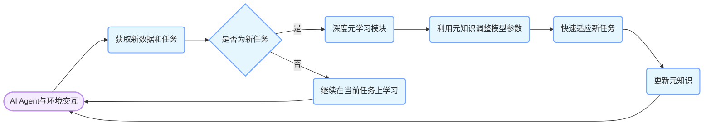

# 深度元学习在AI Agent终身学习中的应用

> 关键词：深度元学习、AI Agent、终身学习、元知识、模型泛化

> 摘要：本文深入探讨了深度元学习在AI Agent终身学习中的应用。首先介绍了相关背景知识，包括目的、预期读者、文档结构和术语表。接着阐述了深度元学习和AI Agent终身学习的核心概念及联系，通过文本示意图和Mermaid流程图展示其架构。详细讲解了核心算法原理，并给出Python源代码示例。分析了相关数学模型和公式，并举例说明。通过项目实战，给出代码实际案例并详细解释。探讨了深度元学习在AI Agent终身学习中的实际应用场景。推荐了学习资源、开发工具框架和相关论文著作。最后总结了未来发展趋势与挑战，提供了常见问题解答和扩展阅读参考资料，旨在为相关领域的研究和实践提供全面的技术指导。

## 1. 背景介绍 
### 1.1 目的和范围
随着人工智能技术的不断发展，AI Agent需要具备在动态环境中持续学习和适应的能力，即终身学习能力。深度元学习作为一种新兴的机器学习范式，为实现AI Agent的终身学习提供了有效的方法。本文的目的在于深入探讨深度元学习在AI Agent终身学习中的应用，涵盖从基本概念、算法原理到实际应用场景等多个方面，旨在为研究人员和开发者提供全面的技术参考。

### 1.2 预期读者
本文适合以下读者群体：
- 人工智能领域的研究人员，特别是对元学习、终身学习感兴趣的学者。
- 从事AI Agent开发的工程师，希望通过深度元学习提升AI Agent的学习能力。
- 计算机科学相关专业的学生，希望深入了解深度元学习和AI Agent终身学习的理论和实践。

### 1.3 文档结构概述
本文的结构如下：
- 核心概念与联系：介绍深度元学习和AI Agent终身学习的核心概念，并展示它们之间的联系和架构。
- 核心算法原理 & 具体操作步骤：详细讲解深度元学习的核心算法原理，并给出Python源代码示例。
- 数学模型和公式 & 详细讲解 & 举例说明：分析深度元学习的数学模型和公式，并通过具体例子进行说明。
- 项目实战：代码实际案例和详细解释说明：通过一个实际项目，展示深度元学习在AI Agent终身学习中的应用。
- 实际应用场景：探讨深度元学习在不同领域的实际应用场景。
- 工具和资源推荐：推荐相关的学习资源、开发工具框架和论文著作。
- 总结：未来发展趋势与挑战：总结深度元学习在AI Agent终身学习中的发展趋势和面临的挑战。
- 附录：常见问题与解答：提供常见问题的解答。
- 扩展阅读 & 参考资料：列出扩展阅读的内容和参考资料。

### 1.4 术语表
#### 1.4.1 核心术语定义
- **深度元学习（Deep Meta - Learning）**：是一种基于深度学习的元学习方法，通过学习如何学习，使模型能够在少量样本和新任务上快速学习和泛化。
- **AI Agent（人工智能智能体）**：是一种能够感知环境、做出决策并执行动作的智能实体，旨在完成特定的任务。
- **终身学习（Lifelong Learning）**：指AI Agent在其生命周期内，不断从新的数据和任务中学习，积累知识并适应环境变化的能力。
- **元知识（Meta - Knowledge）**：是关于学习过程的知识，包括如何选择学习算法、如何调整模型参数等。
- **模型泛化（Model Generalization）**：指模型在未见过的数据和任务上的表现能力。

#### 1.4.2 相关概念解释
- **元训练（Meta - Training）**：在元学习中，元训练是指在一组训练任务上学习元知识的过程。
- **元测试（Meta - Testing）**：元测试是指在新的测试任务上评估模型在元知识指导下的学习能力。
- **快速适应（Fast Adaptation）**：深度元学习的一个重要目标是使模型能够在少量样本上快速适应新任务。

#### 1.4.3 缩略词列表
- **MAML（Model - Agnostic Meta - Learning）**：模型无关元学习，是一种经典的深度元学习算法。
- **Reptile**：一种基于梯度的元学习算法。

## 2. 核心概念与联系 
### 核心概念原理
#### 深度元学习
深度元学习的核心思想是学习如何学习，即通过在多个不同的任务上进行训练，让模型学会一种通用的学习策略，以便在新的任务上能够快速学习。传统的机器学习方法通常是针对特定的任务进行训练，而深度元学习则关注于学习任务之间的共性，从而提高模型的泛化能力和快速适应能力。

#### AI Agent终身学习
AI Agent终身学习要求AI Agent在其整个生命周期内持续学习和适应新的环境和任务。这意味着AI Agent需要能够处理不断变化的数据和任务，避免灾难性遗忘（Catastrophic Forgetting），即当学习新任务时，忘记之前学习的任务。

### 架构的文本示意图
深度元学习在AI Agent终身学习中的架构可以描述如下：

AI Agent作为一个智能实体，不断与环境进行交互，获取新的数据和任务。深度元学习模块作为AI Agent的学习核心，负责学习元知识。在元训练阶段，深度元学习模块在一组训练任务上进行学习，提取任务之间的共性，得到元知识。在元测试阶段，当AI Agent遇到新的任务时，深度元学习模块利用元知识快速调整模型参数，使AI Agent能够快速适应新任务。同时，AI Agent在学习新任务的过程中，不断更新元知识，以适应环境的变化。

### Mermaid流程图


## 3. 核心算法原理 & 具体操作步骤 
### 核心算法原理：以MAML为例
Model - Agnostic Meta - Learning（MAML）是一种经典的深度元学习算法，其核心思想是找到一组初始参数，使得模型在经过少量梯度更新后，能够在新任务上取得较好的性能。

假设我们有一个模型 $f_{\theta}$，其中 $\theta$ 是模型的参数。对于一个任务 $T$，我们有训练数据 $D_{T}^{train}$ 和测试数据 $D_{T}^{test}$。MAML的目标是找到一个最优的初始参数 $\theta^{*}$，使得在对 $\theta^{*}$ 进行一次或多次梯度更新后，模型在 $D_{T}^{test}$ 上的损失最小。

具体来说，MAML的训练过程分为两个步骤：
1. **内循环（Inner Loop）**：对于每个任务 $T$，使用训练数据 $D_{T}^{train}$ 对模型参数 $\theta$ 进行一次或多次梯度更新，得到临时参数 $\theta_{T}'$。
2. **外循环（Outer Loop）**：使用所有任务的临时参数 $\theta_{T}'$ 和测试数据 $D_{T}^{test}$ 计算损失，并更新初始参数 $\theta$。

### Python源代码示例
```python
import torch
import torch.nn as nn
import torch.optim as optim

# 定义一个简单的神经网络模型
class SimpleNet(nn.Module):
    def __init__(self):
        super(SimpleNet, self).__init__()
        self.fc1 = nn.Linear(10, 20)
        self.fc2 = nn.Linear(20, 1)

    def forward(self, x):
        x = torch.relu(self.fc1(x))
        x = self.fc2(x)
        return x

# MAML算法实现
def maml(train_tasks, num_inner_steps, inner_lr, outer_lr, num_epochs):
    model = SimpleNet()
    outer_optimizer = optim.Adam(model.parameters(), lr=outer_lr)

    for epoch in range(num_epochs):
        meta_loss = 0
        for task in train_tasks:
            # 内循环
            inner_model = SimpleNet()
            inner_model.load_state_dict(model.state_dict())
            inner_optimizer = optim.SGD(inner_model.parameters(), lr=inner_lr)

            for _ in range(num_inner_steps):
                train_inputs, train_labels = task['train']
                train_outputs = inner_model(train_inputs)
                inner_loss = nn.MSELoss()(train_outputs, train_labels)
                inner_optimizer.zero_grad()
                inner_loss.backward()
                inner_optimizer.step()

            # 外循环
            test_inputs, test_labels = task['test']
            test_outputs = inner_model(test_inputs)
            meta_loss += nn.MSELoss()(test_outputs, test_labels)

        # 更新初始参数
        outer_optimizer.zero_grad()
        meta_loss.backward()
        outer_optimizer.step()

        if (epoch + 1) % 10 == 0:
            print(f'Epoch {epoch + 1}, Meta Loss: {meta_loss.item()}')

    return model

# 示例数据
train_tasks = [
    {
        'train': (torch.randn(20, 10), torch.randn(20, 1)),
        'test': (torch.randn(10, 10), torch.randn(10, 1))
    },
    {
        'train': (torch.randn(20, 10), torch.randn(20, 1)),
        'test': (torch.randn(10, 10), torch.randn(10, 1))
    }
]

# 训练模型
model = maml(train_tasks, num_inner_steps=5, inner_lr=0.01, outer_lr=0.001, num_epochs=100)
```

### 具体操作步骤
1. **数据准备**：准备一组训练任务，每个任务包含训练数据和测试数据。
2. **模型初始化**：初始化一个神经网络模型。
3. **内循环**：对于每个任务，使用训练数据对模型进行多次梯度更新，得到临时参数。
4. **外循环**：使用所有任务的临时参数和测试数据计算损失，并更新初始参数。
5. **重复训练**：重复步骤3和4，直到达到指定的训练轮数。

## 4. 数学模型和公式 & 详细讲解 & 举例说明 
### 数学模型和公式
#### MAML的目标函数
MAML的目标是找到一个最优的初始参数 $\theta^{*}$，使得在对 $\theta^{*}$ 进行一次或多次梯度更新后，模型在测试数据上的损失最小。假设我们有 $N$ 个任务 $\{T_1, T_2, \cdots, T_N\}$，对于每个任务 $T_i$，其训练数据为 $D_{T_i}^{train}$，测试数据为 $D_{T_i}^{test}$。

内循环中，使用训练数据 $D_{T_i}^{train}$ 对模型参数 $\theta$ 进行一次梯度更新，得到临时参数 $\theta_{T_i}'$：
$$\theta_{T_i}' = \theta - \alpha \nabla_{\theta} \mathcal{L}_{T_i}^{train}(f_{\theta})$$
其中，$\alpha$ 是内循环的学习率，$\mathcal{L}_{T_i}^{train}(f_{\theta})$ 是模型 $f_{\theta}$ 在任务 $T_i$ 的训练数据上的损失函数。

外循环中，使用所有任务的临时参数 $\theta_{T_i}'$ 和测试数据 $D_{T_i}^{test}$ 计算损失，并更新初始参数 $\theta$：
$$\theta \leftarrow \theta - \beta \nabla_{\theta} \sum_{i = 1}^{N} \mathcal{L}_{T_i}^{test}(f_{\theta_{T_i}'})$$
其中，$\beta$ 是外循环的学习率，$\mathcal{L}_{T_i}^{test}(f_{\theta_{T_i}'})$ 是模型 $f_{\theta_{T_i}'}$ 在任务 $T_i$ 的测试数据上的损失函数。

### 详细讲解
- **内循环**：内循环的目的是让模型在每个任务的训练数据上进行快速适应。通过一次或多次梯度更新，得到临时参数 $\theta_{T_i}'$，这个参数能够更好地适应任务 $T_i$。
- **外循环**：外循环的目的是更新初始参数 $\theta$，使得模型在所有任务上都能够快速适应。通过最小化所有任务的测试损失之和，找到一个最优的初始参数。

### 举例说明
假设我们有两个任务 $T_1$ 和 $T_2$，每个任务的训练数据和测试数据如下：
- 任务 $T_1$：训练数据 $D_{T_1}^{train} = \{(x_1^1, y_1^1), (x_2^1, y_2^1), \cdots, (x_{n_1}^1, y_{n_1}^1)\}$，测试数据 $D_{T_1}^{test} = \{(x_1^{1t}, y_1^{1t}), (x_2^{1t}, y_2^{1t}), \cdots, (x_{m_1}^{1t}, y_{m_1}^{1t})\}$。
- 任务 $T_2$：训练数据 $D_{T_2}^{train} = \{(x_1^2, y_1^2), (x_2^2, y_2^2), \cdots, (x_{n_2}^2, y_{n_2}^2)\}$，测试数据 $D_{T_2}^{test} = \{(x_1^{2t}, y_1^{2t}), (x_2^{2t}, y_2^{2t}), \cdots, (x_{m_2}^{2t}, y_{m_2}^{2t})\}$。

内循环中，对于任务 $T_1$，我们使用训练数据计算损失 $\mathcal{L}_{T_1}^{train}(f_{\theta})$，并更新参数得到 $\theta_{T_1}'$：
$$\theta_{T_1}' = \theta - \alpha \nabla_{\theta} \mathcal{L}_{T_1}^{train}(f_{\theta})$$
对于任务 $T_2$，同样计算损失 $\mathcal{L}_{T_2}^{train}(f_{\theta})$，并更新参数得到 $\theta_{T_2}'$：
$$\theta_{T_2}' = \theta - \alpha \nabla_{\theta} \mathcal{L}_{T_2}^{train}(f_{\theta})$$

外循环中，我们使用 $\theta_{T_1}'$ 和 $\theta_{T_2}'$ 计算测试损失之和：
$$\mathcal{L}_{meta} = \mathcal{L}_{T_1}^{test}(f_{\theta_{T_1}'}) + \mathcal{L}_{T_2}^{test}(f_{\theta_{T_2}'})$$
然后更新初始参数 $\theta$：
$$\theta \leftarrow \theta - \beta \nabla_{\theta} \mathcal{L}_{meta}$$

## 5. 项目实战：代码实际案例和详细解释说明 
### 5.1  开发环境搭建
#### 操作系统
可以选择常见的操作系统，如Windows、Linux（如Ubuntu）或macOS。

#### 编程语言和库
- **Python**：版本建议使用Python 3.7及以上。
- **PyTorch**：深度学习框架，用于构建和训练神经网络模型。可以根据自己的CUDA版本选择合适的PyTorch版本进行安装。例如，使用以下命令安装CPU版本的PyTorch：
```bash
pip install torch torchvision
```
- **NumPy**：用于数值计算。可以使用以下命令安装：
```bash
pip install numpy
```

### 5.2  源代码详细实现和代码解读
```python
import torch
import torch.nn as nn
import torch.optim as optim
import numpy as np

# 定义一个简单的神经网络模型
class SimpleNet(nn.Module):
    def __init__(self):
        super(SimpleNet, self).__init__()
        self.fc1 = nn.Linear(10, 20)
        self.fc2 = nn.Linear(20, 1)

    def forward(self, x):
        x = torch.relu(self.fc1(x))
        x = self.fc2(x)
        return x

# MAML算法实现
def maml(train_tasks, num_inner_steps, inner_lr, outer_lr, num_epochs):
    model = SimpleNet()
    outer_optimizer = optim.Adam(model.parameters(), lr=outer_lr)

    for epoch in range(num_epochs):
        meta_loss = 0
        for task in train_tasks:
            # 内循环
            inner_model = SimpleNet()
            inner_model.load_state_dict(model.state_dict())
            inner_optimizer = optim.SGD(inner_model.parameters(), lr=inner_lr)

            for _ in range(num_inner_steps):
                train_inputs, train_labels = task['train']
                train_outputs = inner_model(train_inputs)
                inner_loss = nn.MSELoss()(train_outputs, train_labels)
                inner_optimizer.zero_grad()
                inner_loss.backward()
                inner_optimizer.step()

            # 外循环
            test_inputs, test_labels = task['test']
            test_outputs = inner_model(test_inputs)
            meta_loss += nn.MSELoss()(test_outputs, test_labels)

        # 更新初始参数
        outer_optimizer.zero_grad()
        meta_loss.backward()
        outer_optimizer.step()

        if (epoch + 1) % 10 == 0:
            print(f'Epoch {epoch + 1}, Meta Loss: {meta_loss.item()}')

    return model

# 生成示例数据
def generate_tasks(num_tasks, train_size, test_size):
    tasks = []
    for _ in range(num_tasks):
        train_inputs = torch.randn(train_size, 10)
        train_labels = torch.randn(train_size, 1)
        test_inputs = torch.randn(test_size, 10)
        test_labels = torch.randn(test_size, 1)
        task = {
            'train': (train_inputs, train_labels),
            'test': (test_inputs, test_labels)
        }
        tasks.append(task)
    return tasks

# 主函数
if __name__ == "__main__":
    train_tasks = generate_tasks(num_tasks=5, train_size=20, test_size=10)
    model = maml(train_tasks, num_inner_steps=5, inner_lr=0.01, outer_lr=0.001, num_epochs=100)
```

### 代码解读与分析
- **SimpleNet类**：定义了一个简单的两层全连接神经网络模型。输入层有10个神经元，隐藏层有20个神经元，输出层有1个神经元。
- **maml函数**：实现了MAML算法。在每个训练轮次中，对于每个任务，先进行内循环，使用训练数据对模型进行多次梯度更新，得到临时参数。然后进行外循环，使用临时参数和测试数据计算损失，并更新初始参数。
- **generate_tasks函数**：用于生成示例任务数据。每个任务包含训练数据和测试数据，数据为随机生成的张量。
- **主函数**：调用generate_tasks函数生成训练任务，然后调用maml函数进行模型训练。

## 6. 实际应用场景 
### 机器人领域
在机器人领域，AI Agent需要在不同的环境中执行各种任务，如导航、抓取物体等。深度元学习可以帮助机器人快速适应新的环境和任务。例如，当机器人进入一个新的房间时，通过深度元学习，机器人可以利用之前学习的元知识，快速调整自己的导航策略，避免碰撞并找到目标位置。

### 自然语言处理领域
在自然语言处理中，AI Agent可能需要处理不同类型的文本任务，如文本分类、情感分析等。深度元学习可以使模型在少量标注数据的情况下，快速适应新的文本任务。例如，当需要对一种新的领域的文本进行分类时，模型可以利用元知识，快速学习该领域的文本特征，提高分类准确率。

### 医疗领域
在医疗领域，AI Agent可以用于疾病诊断、医学影像分析等任务。由于医疗数据的多样性和稀缺性，深度元学习可以帮助模型在少量样本的情况下，快速学习新的疾病特征。例如，当出现一种新的罕见疾病时，模型可以利用元知识，快速学习该疾病的影像特征，辅助医生进行诊断。

## 7. 工具和资源推荐
### 7.1 学习资源推荐
#### 7.1.1 书籍推荐
- 《深度学习》（Deep Learning）：由Ian Goodfellow、Yoshua Bengio和Aaron Courville撰写，是深度学习领域的经典教材，涵盖了深度学习的基本概念、算法和应用。
- 《元学习：理论、算法与应用》（Meta - Learning: Theory, Algorithms, and Applications）：专门介绍元学习的书籍，详细讲解了元学习的理论和算法。

#### 7.1.2 在线课程
- Coursera上的“深度学习专项课程”（Deep Learning Specialization）：由Andrew Ng教授授课，系统地介绍了深度学习的各个方面。
- edX上的“元学习：快速适应新任务”（Meta - Learning: Fast Adaptation to New Tasks）：专门讲解元学习的在线课程。

#### 7.1.3 技术博客和网站
- arXiv：一个开放的学术预印本平台，提供了大量关于深度元学习和AI Agent终身学习的最新研究论文。
- Medium：有很多关于人工智能和机器学习的技术博客，其中不乏深度元学习的相关文章。

### 7.2 开发工具框架推荐
#### 7.2.1 IDE和编辑器
- PyCharm：一款功能强大的Python集成开发环境，提供了代码编辑、调试、版本控制等功能。
- Jupyter Notebook：一个交互式的开发环境，适合进行数据探索和模型实验。

#### 7.2.2 调试和性能分析工具
- TensorBoard：TensorFlow的可视化工具，也可以与PyTorch结合使用，用于可视化模型训练过程中的损失、准确率等指标。
- Py-Spy：一个用于分析Python程序性能的工具，可以帮助开发者找出程序中的性能瓶颈。

#### 7.2.3 相关框架和库
- PyTorch：一个开源的深度学习框架，提供了丰富的神经网络层和优化算法，方便开发者构建和训练深度元学习模型。
- Torchmeta：一个专门用于元学习的PyTorch库，提供了一些常用的元学习数据集和算法实现。

### 7.3 相关论文著作推荐
#### 7.3.1 经典论文
- 《Model - Agnostic Meta - Learning for Fast Adaptation of Deep Networks》：介绍了MAML算法，是深度元学习领域的经典论文。
- 《Optimization as a Model for Few - Shot Learning》：提出了基于优化的元学习方法。

#### 7.3.2 最新研究成果
可以通过arXiv等平台关注最新的深度元学习和AI Agent终身学习的研究成果。

#### 7.3.3 应用案例分析
一些顶级学术会议（如NeurIPS、ICML等）的论文中会有深度元学习在不同领域的应用案例分析，可以从中学习实际应用的经验。

## 8. 总结：未来发展趋势与挑战
### 未来发展趋势
- **多模态元学习**：结合图像、文本、音频等多种模态的数据进行元学习，提高AI Agent的综合学习能力。
- **与强化学习的结合**：将深度元学习与强化学习相结合，使AI Agent在动态环境中能够更快地学习和适应。
- **自适应元学习**：模型能够根据不同的任务和环境自动调整元学习策略，提高学习效率。

### 挑战
- **计算资源需求**：深度元学习通常需要大量的计算资源，特别是在处理大规模数据集和复杂模型时，如何降低计算成本是一个挑战。
- **灾难性遗忘问题**：虽然深度元学习可以在一定程度上缓解灾难性遗忘问题，但仍然需要进一步的研究来彻底解决这个问题。
- **元知识的表示和利用**：如何有效地表示和利用元知识，提高模型的泛化能力和快速适应能力，是未来需要研究的重点。

## 9. 附录：常见问题与解答
### 问题1：深度元学习和传统机器学习有什么区别？
传统机器学习通常是针对特定的任务进行训练，模型的泛化能力和快速适应能力有限。而深度元学习通过学习如何学习，让模型能够在多个不同的任务上进行训练，提取任务之间的共性，从而提高模型在新任务上的泛化能力和快速适应能力。

### 问题2：MAML算法的复杂度如何？
MAML算法的复杂度主要取决于内循环和外循环的计算量。内循环中，需要对每个任务进行多次梯度更新，计算量较大。外循环中，需要对所有任务的临时参数和测试数据进行计算，也需要一定的计算资源。因此，MAML算法的复杂度相对较高。

### 问题3：如何选择合适的内循环和外循环学习率？
内循环和外循环学习率的选择通常需要通过实验来确定。一般来说，内循环学习率可以选择相对较大的值，以便模型能够在少量样本上快速适应新任务。外循环学习率可以选择相对较小的值，以保证模型的稳定性。

## 10. 扩展阅读 & 参考资料
### 扩展阅读
- 《终身机器学习》（Lifelong Machine Learning）：深入探讨了AI Agent终身学习的理论和方法。
- 《深度强化学习实战》（Deep Reinforcement Learning Hands - On）：介绍了深度强化学习的实际应用，与深度元学习有一定的关联。

### 参考资料
- Finn, C., Abbeel, P., & Levine, S. (2017). Model - Agnostic Meta - Learning for Fast Adaptation of Deep Networks. arXiv preprint arXiv:1703.03400.
- Nichol, A., Achiam, J., & Schulman, J. (2018). On First - Order Meta - Learning Algorithms. arXiv preprint arXiv:1803.02999.

作者：AI天才研究院/AI Genius Institute & 禅与计算机程序设计艺术 /Zen And The Art of Computer Programming