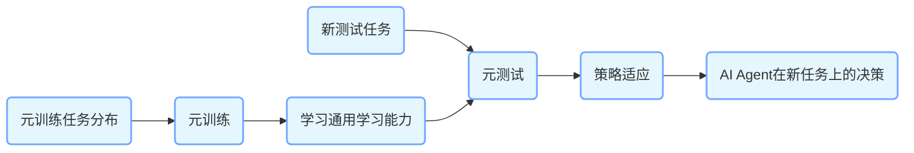

# 深度元强化学习在AI Agent策略适应中的应用

> 关键词：深度元强化学习、AI Agent、策略适应、强化学习、元学习

> 摘要：本文深入探讨了深度元强化学习在AI Agent策略适应中的应用。首先介绍了相关背景知识，包括目的范围、预期读者等。接着阐述了核心概念与联系，分析了深度元强化学习的原理和架构，并通过Mermaid流程图进行直观展示。详细讲解了核心算法原理，结合Python源代码进行说明，同时给出了数学模型和公式。通过项目实战案例，展示了代码的实际实现和解读。探讨了深度元强化学习在不同场景中的实际应用，推荐了学习资源、开发工具框架以及相关论文著作。最后总结了未来发展趋势与挑战，并提供了常见问题解答和扩展阅读参考资料。

## 1. 背景介绍 
### 1.1 目的和范围
随着人工智能技术的不断发展，AI Agent需要在复杂多变的环境中快速适应并做出最优决策。传统的强化学习方法在面对新环境或任务变化时，往往需要大量的样本进行重新训练，效率较低。深度元强化学习作为一种新兴的技术，旨在让AI Agent能够快速学习并适应新的任务和环境，提高学习效率和泛化能力。本文的目的是深入研究深度元强化学习在AI Agent策略适应中的应用，探讨其原理、算法、实际案例以及未来发展趋势。范围涵盖了深度元强化学习的基本概念、核心算法、数学模型，以及在不同领域的实际应用。

### 1.2 预期读者
本文预期读者包括人工智能领域的研究人员、开发者、学生，以及对深度元强化学习和AI Agent策略适应感兴趣的技术爱好者。读者需要具备一定的机器学习和强化学习基础知识，了解Python编程和相关的深度学习框架。

### 1.3 文档结构概述
本文共分为十个部分。第一部分为背景介绍，阐述了文章的目的、预期读者和文档结构。第二部分介绍核心概念与联系，包括深度元强化学习和AI Agent策略适应的基本原理和架构。第三部分详细讲解核心算法原理，并给出Python源代码示例。第四部分介绍数学模型和公式，并通过具体例子进行说明。第五部分通过项目实战，展示代码的实际实现和详细解读。第六部分探讨深度元强化学习在实际场景中的应用。第七部分推荐学习资源、开发工具框架和相关论文著作。第八部分总结未来发展趋势与挑战。第九部分为附录，提供常见问题与解答。第十部分列出扩展阅读和参考资料。

### 1.4 术语表
#### 1.4.1 核心术语定义
- **深度元强化学习（Deep Meta-Reinforcement Learning）**：结合了深度学习和元学习的思想，让智能体能够在多个任务上学习，从而快速适应新的任务和环境。
- **AI Agent（人工智能智能体）**：能够感知环境、做出决策并执行动作的智能实体。
- **策略适应（Policy Adaptation）**：智能体根据环境和任务的变化，调整自身的策略以达到最优性能。
- **强化学习（Reinforcement Learning）**：一种通过智能体与环境进行交互，根据环境反馈的奖励信号来学习最优策略的机器学习方法。
- **元学习（Meta-Learning）**：学习如何学习的方法，旨在让模型能够快速适应新的任务。

#### 1.4.2 相关概念解释
- **策略（Policy）**：智能体在给定状态下选择动作的规则。
- **状态（State）**：环境的当前描述，智能体根据状态来做出决策。
- **动作（Action）**：智能体在某个状态下采取的行为。
- **奖励（Reward）**：环境对智能体动作的反馈，用于评估动作的好坏。

#### 1.4.3 缩略词列表
- **DRL（Deep Reinforcement Learning）**：深度强化学习
- **MAML（Model-Agnostic Meta-Learning）**：模型无关元学习
- **PPO（Proximal Policy Optimization）**：近端策略优化算法
- **SAC（Soft Actor-Critic）**：软演员 - 评论家算法

## 2. 核心概念与联系 
### 2.1 深度元强化学习原理
深度元强化学习的核心思想是在多个任务上进行学习，使得智能体能够快速适应新的任务。传统的强化学习方法通常是在单个任务上进行训练，而深度元强化学习则是在一个任务分布上进行训练。在训练过程中，智能体学习到一种通用的学习能力，能够根据新任务的少量样本快速调整策略。

深度元强化学习通常包括两个阶段：元训练阶段和元测试阶段。在元训练阶段，智能体在多个训练任务上进行学习，通过优化元目标函数来学习通用的学习能力。在元测试阶段，智能体面对新的测试任务，利用在元训练阶段学习到的能力，快速适应新任务。

### 2.2 AI Agent策略适应原理
AI Agent的策略适应是指智能体根据环境和任务的变化，调整自身的策略以达到最优性能。在实际应用中，环境和任务往往是动态变化的，智能体需要能够快速适应这些变化。策略适应可以通过多种方式实现，例如基于模型的方法、基于策略梯度的方法等。

基于模型的方法通过学习环境的动态模型，预测未来的状态和奖励，从而调整策略。基于策略梯度的方法则直接对策略进行优化，通过梯度下降的方法更新策略参数。

### 2.3 核心概念架构
下面是深度元强化学习在AI Agent策略适应中的架构示意图：



在这个架构中，元训练任务分布包含多个训练任务，智能体在元训练阶段学习通用的学习能力。当面对新的测试任务时，智能体利用学习到的能力进行元测试，实现策略适应，最终在新任务上做出决策。

## 3. 核心算法原理 & 具体操作步骤 
### 3.1 核心算法原理
深度元强化学习的核心算法之一是模型无关元学习（MAML）。MAML的目标是学习一个初始参数，使得在少量梯度更新后，模型能够在新任务上取得较好的性能。

MAML的具体步骤如下：
1. **采样任务**：从任务分布中采样一批训练任务。
2. **内部循环**：对于每个采样的任务，使用当前的参数进行一定步数的梯度更新，得到适应后的参数。
3. **外部循环**：使用适应后的参数在任务上计算损失，然后对初始参数进行更新。

### 3.2 Python源代码实现
下面是一个简单的MAML算法的Python代码示例：

```python
import torch
import torch.nn as nn
import torch.optim as optim

# 定义一个简单的神经网络模型
class SimpleModel(nn.Module):
    def __init__(self, input_size, output_size):
        super(SimpleModel, self).__init__()
        self.fc = nn.Linear(input_size, output_size)

    def forward(self, x):
        return self.fc(x)

# 内部循环更新
def inner_loop(model, optimizer, x, y, num_steps):
    temp_model = SimpleModel(model.fc.in_features, model.fc.out_features)
    temp_model.load_state_dict(model.state_dict())
    temp_optimizer = optim.SGD(temp_model.parameters(), lr=0.01)

    for _ in range(num_steps):
        output = temp_model(x)
        loss = nn.MSELoss()(output, y)
        temp_optimizer.zero_grad()
        loss.backward()
        temp_optimizer.step()

    return temp_model

# 外部循环更新
def outer_loop(model, optimizer, tasks, num_steps):
    meta_loss = 0
    for task_x, task_y in tasks:
        adapted_model = inner_loop(model, optimizer, task_x, task_y, num_steps)
        output = adapted_model(task_x)
        loss = nn.MSELoss()(output, task_y)
        meta_loss += loss

    optimizer.zero_grad()
    meta_loss.backward()
    optimizer.step()

# 主训练函数
def train(model, optimizer, tasks, num_epochs, num_steps):
    for epoch in range(num_epochs):
        outer_loop(model, optimizer, tasks, num_steps)
        if epoch % 100 == 0:
            print(f'Epoch {epoch}, Loss: {meta_loss.item()}')

# 示例使用
input_size = 10
output_size = 1
model = SimpleModel(input_size, output_size)
optimizer = optim.Adam(model.parameters(), lr=0.001)

# 模拟任务分布
tasks = []
for _ in range(10):
    task_x = torch.randn(20, input_size)
    task_y = torch.randn(20, output_size)
    tasks.append((task_x, task_y))

num_epochs = 1000
num_steps = 5
train(model, optimizer, tasks, num_epochs, num_steps)
```

### 3.3 代码解释
1. **SimpleModel类**：定义了一个简单的线性神经网络模型。
2. **inner_loop函数**：在内部循环中，对模型进行一定步数的梯度更新，得到适应后的模型。
3. **outer_loop函数**：在外部循环中，使用适应后的模型计算损失，并对初始模型的参数进行更新。
4. **train函数**：主训练函数，调用外部循环进行多次迭代训练。

通过这种方式，模型能够学习到一个通用的初始参数，使得在面对新任务时能够快速适应。

## 4. 数学模型和公式 & 详细讲解 & 举例说明 
### 4.1 数学模型
深度元强化学习的数学模型可以表示为以下几个部分：

#### 4.1.1 任务分布
假设任务分布为 $\mathcal{T}$，每个任务 $T \in \mathcal{T}$ 可以用一个马尔可夫决策过程（MDP）来表示，即 $T = (\mathcal{S}, \mathcal{A}, P_T, R_T, \gamma)$，其中 $\mathcal{S}$ 是状态空间，$\mathcal{A}$ 是动作空间，$P_T$ 是状态转移概率，$R_T$ 是奖励函数，$\gamma$ 是折扣因子。

#### 4.1.2 策略
策略 $\pi_{\theta}$ 是一个从状态到动作的映射，其中 $\theta$ 是策略的参数。在深度元强化学习中，我们希望学习一个初始参数 $\theta_0$，使得在面对新任务时能够快速适应。

#### 4.1.3 元目标函数
元目标函数的目标是最大化在新任务上的累积奖励。对于一个任务 $T$，智能体的累积奖励可以表示为：

$$J_T(\theta) = \mathbb{E}_{\tau \sim \pi_{\theta}} \left[ \sum_{t=0}^{\infty} \gamma^t R_T(s_t, a_t) \right]$$

其中 $\tau = (s_0, a_0, s_1, a_1, \cdots)$ 是一个轨迹，$s_t$ 是状态，$a_t$ 是动作。

元目标函数可以表示为：

$$\mathcal{L}(\theta_0) = \sum_{T \in \mathcal{T}} \mathbb{E}_{\theta \sim \text{Adapt}(\theta_0, T)} \left[ -J_T(\theta) \right]$$

其中 $\text{Adapt}(\theta_0, T)$ 表示在任务 $T$ 上对初始参数 $\theta_0$ 进行适应的过程。

### 4.2 公式详细讲解
#### 4.2.1 内部循环更新
在内部循环中，对于一个任务 $T$，我们使用梯度下降的方法对参数进行更新：

$$\theta_{T}^{\prime} = \theta_0 - \alpha \nabla_{\theta} J_T(\theta_0)$$

其中 $\alpha$ 是内部循环的学习率。

#### 4.2.2 外部循环更新
在外部循环中，我们使用适应后的参数 $\theta_{T}^{\prime}$ 计算损失，并对初始参数 $\theta_0$ 进行更新：

$$\theta_0 = \theta_0 - \beta \nabla_{\theta_0} \sum_{T \in \mathcal{T}} J_T(\theta_{T}^{\prime})$$

其中 $\beta$ 是外部循环的学习率。

### 4.3 举例说明
假设我们有一个简单的任务，智能体需要在一个二维平面上移动到目标点。状态 $s$ 是智能体的位置，动作 $a$ 是智能体的移动方向。奖励函数 $R(s, a)$ 定义为智能体与目标点的距离的负值。

在元训练阶段，我们有多个这样的任务，每个任务的目标点位置不同。智能体通过MAML算法学习一个通用的初始参数 $\theta_0$。在元测试阶段，当面对一个新的任务时，智能体使用 $\theta_0$ 进行少量的梯度更新，快速适应新的目标点位置。

## 5. 项目实战：代码实际案例和详细解释说明 
### 5.1  开发环境搭建
#### 5.1.1 安装Python
首先需要安装Python，建议使用Python 3.7及以上版本。可以从Python官方网站（https://www.python.org/downloads/）下载并安装。

#### 5.1.2 安装深度学习框架
我们使用PyTorch作为深度学习框架。可以通过以下命令安装：

```sh
pip install torch torchvision
```

#### 5.1.3 安装其他依赖库
还需要安装一些其他的依赖库，如NumPy、Matplotlib等：

```sh
pip install numpy matplotlib
```

### 5.2  源代码详细实现和代码解读
下面是一个使用深度元强化学习实现AI Agent策略适应的完整代码示例：

```python
import torch
import torch.nn as nn
import torch.optim as optim
import numpy as np
import matplotlib.pyplot as plt

# 定义一个简单的策略网络
class PolicyNetwork(nn.Module):
    def __init__(self, input_size, output_size):
        super(PolicyNetwork, self).__init__()
        self.fc1 = nn.Linear(input_size, 64)
        self.fc2 = nn.Linear(64, output_size)

    def forward(self, x):
        x = torch.relu(self.fc1(x))
        x = self.fc2(x)
        return x

# 定义一个简单的环境
class SimpleEnv:
    def __init__(self):
        self.target = np.random.uniform(-1, 1, size=2)

    def reset(self):
        self.state = np.random.uniform(-1, 1, size=2)
        return self.state

    def step(self, action):
        self.state += action
        reward = -np.linalg.norm(self.state - self.target)
        done = np.linalg.norm(self.state - self.target) < 0.1
        return self.state, reward, done, {}

# 内部循环更新
def inner_loop(policy, optimizer, env, num_steps):
    temp_policy = PolicyNetwork(policy.fc1.in_features, policy.fc2.out_features)
    temp_policy.load_state_dict(policy.state_dict())
    temp_optimizer = optim.Adam(temp_policy.parameters(), lr=0.01)

    for _ in range(num_steps):
        state = env.reset()
        state = torch.FloatTensor(state).unsqueeze(0)
        action = temp_policy(state)
        next_state, reward, done, _ = env.step(action.detach().numpy()[0])
        reward = torch.FloatTensor([reward])

        loss = -reward
        temp_optimizer.zero_grad()
        loss.backward()
        temp_optimizer.step()

    return temp_policy

# 外部循环更新
def outer_loop(policy, optimizer, num_envs, num_steps):
    meta_loss = 0
    for _ in range(num_envs):
        env = SimpleEnv()
        adapted_policy = inner_loop(policy, optimizer, env, num_steps)

        state = env.reset()
        state = torch.FloatTensor(state).unsqueeze(0)
        action = adapted_policy(state)
        next_state, reward, done, _ = env.step(action.detach().numpy()[0])
        reward = torch.FloatTensor([reward])

        loss = -reward
        meta_loss += loss

    optimizer.zero_grad()
    meta_loss.backward()
    optimizer.step()

# 主训练函数
def train(policy, optimizer, num_epochs, num_envs, num_steps):
    rewards = []
    for epoch in range(num_epochs):
        outer_loop(policy, optimizer, num_envs, num_steps)

        # 测试策略
        env = SimpleEnv()
        state = env.reset()
        total_reward = 0
        for _ in range(100):
            state = torch.FloatTensor(state).unsqueeze(0)
            action = policy(state)
            next_state, reward, done, _ = env.step(action.detach().numpy()[0])
            total_reward += reward
            state = next_state
            if done:
                break
        rewards.append(total_reward)

        if epoch % 100 == 0:
            print(f'Epoch {epoch}, Reward: {total_reward}')

    plt.plot(rewards)
    plt.xlabel('Epoch')
    plt.ylabel('Total Reward')
    plt.show()

# 示例使用
input_size = 2
output_size = 2
policy = PolicyNetwork(input_size, output_size)
optimizer = optim.Adam(policy.parameters(), lr=0.001)

num_epochs = 1000
num_envs = 10
num_steps = 5
train(policy, optimizer, num_epochs, num_envs, num_steps)
```

### 5.3  代码解读与分析
#### 5.3.1 PolicyNetwork类
定义了一个简单的策略网络，包含两个全连接层。输入是环境的状态，输出是智能体的动作。

#### 5.3.2 SimpleEnv类
定义了一个简单的二维平面环境，智能体需要移动到随机生成的目标点。环境提供了重置和步进的方法。

#### 5.3.3 inner_loop函数
在内部循环中，对策略网络进行一定步数的梯度更新，得到适应后的策略网络。

#### 5.3.4 outer_loop函数
在外部循环中，使用适应后的策略网络计算损失，并对初始策略网络的参数进行更新。

#### 5.3.5 train函数
主训练函数，调用外部循环进行多次迭代训练，并记录每次迭代的总奖励。最后绘制奖励曲线。

通过这个项目实战，我们可以看到深度元强化学习如何帮助AI Agent快速适应新的环境和任务。

## 6. 实际应用场景 
### 6.1 机器人控制
在机器人控制领域，深度元强化学习可以帮助机器人快速适应不同的任务和环境。例如，机器人需要在不同的地形上移动，或者执行不同的操作任务。通过元训练，机器人可以学习到通用的运动策略，在面对新的地形或任务时能够快速调整策略。

### 6.2 游戏智能体
在游戏领域，深度元强化学习可以让游戏智能体快速适应不同的游戏场景和对手。例如，在实时战略游戏中，智能体需要根据不同的地图布局和对手策略做出决策。通过元学习，智能体可以学习到通用的游戏策略，在面对新的游戏场景时能够快速调整战术。

### 6.3 自动驾驶
在自动驾驶领域，深度元强化学习可以帮助自动驾驶车辆快速适应不同的路况和交通规则。例如，在不同的城市或国家，交通规则和路况可能会有所不同。通过元训练，自动驾驶车辆可以学习到通用的驾驶策略，在面对新的路况和交通规则时能够快速调整驾驶行为。

### 6.4 金融投资
在金融投资领域，深度元强化学习可以帮助投资者快速适应不同的市场环境和投资策略。例如，市场行情可能会随时发生变化，投资者需要根据市场变化调整投资组合。通过元学习，投资者可以学习到通用的投资策略，在面对新的市场环境时能够快速调整投资决策。

## 7. 工具和资源推荐
### 7.1 学习资源推荐
#### 7.1.1 书籍推荐
- 《Reinforcement Learning: An Introduction》：由Richard S. Sutton和Andrew G. Barto所著，是强化学习领域的经典教材，涵盖了强化学习的基本概念、算法和应用。
- 《Deep Learning》：由Ian Goodfellow、Yoshua Bengio和Aaron Courville所著，是深度学习领域的权威教材，介绍了深度学习的基本原理和方法。
- 《Meta-Learning: A Survey》：对元学习进行了全面的综述，介绍了元学习的各种方法和应用。

#### 7.1.2 在线课程
- Coursera上的“Reinforcement Learning Specialization”：由DeepMind的研究人员授课，系统地介绍了强化学习的理论和实践。
- edX上的“Introduction to Deep Learning”：由MIT的教授授课，介绍了深度学习的基本概念和方法。
- OpenAI的Spinning Up：提供了强化学习的教程和代码示例，帮助初学者快速上手。

#### 7.1.3 技术博客和网站
- Towards Data Science：是一个数据科学和机器学习领域的博客平台，上面有很多关于深度元强化学习的文章和教程。
- OpenAI Blog：OpenAI官方博客，会发布关于人工智能领域的最新研究成果和技术进展。
- DeepMind Blog：DeepMind官方博客，分享了很多关于强化学习和人工智能的研究成果。

### 7.2 开发工具框架推荐
#### 7.2.1 IDE和编辑器
- PyCharm：是一款专业的Python集成开发环境，提供了丰富的代码编辑、调试和项目管理功能。
- Jupyter Notebook：是一个交互式的开发环境，适合进行数据探索和模型实验。
- Visual Studio Code：是一款轻量级的代码编辑器，支持多种编程语言和插件，方便进行代码开发和调试。

#### 7.2.2 调试和性能分析工具
- TensorBoard：是TensorFlow提供的可视化工具，可以帮助用户监控模型的训练过程、可视化模型结构和分析性能指标。
- PyTorch Profiler：是PyTorch提供的性能分析工具，可以帮助用户分析模型的运行时间和内存使用情况。
- NVIDIA Nsight Systems：是NVIDIA提供的性能分析工具，适合对深度学习模型进行性能优化。

#### 7.2.3 相关框架和库
- PyTorch：是一个开源的深度学习框架，提供了丰富的神经网络层和优化算法，方便用户进行模型开发和训练。
- TensorFlow：是另一个广泛使用的深度学习框架，具有强大的分布式训练和部署能力。
- Stable Baselines3：是一个基于PyTorch的强化学习库，提供了多种强化学习算法的实现和训练工具。

### 7.3 相关论文著作推荐
#### 7.3.1 经典论文
- “Model-Agnostic Meta-Learning for Fast Adaptation of Deep Networks”：提出了模型无关元学习（MAML）算法，是深度元强化学习领域的经典论文。
- “Proximal Policy Optimization Algorithms”：提出了近端策略优化（PPO）算法，是一种高效的策略梯度算法。
- “Soft Actor-Critic: Off-Policy Maximum Entropy Deep Reinforcement Learning with a Stochastic Actor”：提出了软演员 - 评论家（SAC）算法，是一种基于最大熵原理的离线强化学习算法。

#### 7.3.2 最新研究成果
- “Meta-Reinforcement Learning with Latent Variable Models”：将潜在变量模型引入深度元强化学习，提高了模型的泛化能力。
- “Adaptive Model-Based Meta-Reinforcement Learning”：结合了基于模型的方法和元学习，提高了智能体的学习效率。
- “Meta-Learning for Few-Shot Reinforcement Learning”：研究了在少样本情况下的深度元强化学习方法。

#### 7.3.3 应用案例分析
- “Deep Reinforcement Learning for Robotic Manipulation with Asynchronous Off-Policy Updates”：介绍了深度强化学习在机器人操作中的应用。
- “Playing Atari with Deep Reinforcement Learning”：展示了深度强化学习在游戏领域的应用，让智能体能够玩Atari游戏。
- “End-to-End Learning of Driving Models from Large-Scale Video Datasets”：介绍了深度强化学习在自动驾驶领域的应用，实现了端到端的驾驶模型学习。

## 8. 总结：未来发展趋势与挑战
### 8.1 未来发展趋势
#### 8.1.1 与其他技术的融合
深度元强化学习将与其他技术如计算机视觉、自然语言处理等进行更深入的融合。例如，在机器人控制中，结合计算机视觉技术可以让机器人更好地感知环境；在金融投资中，结合自然语言处理技术可以让投资者更好地理解市场信息。

#### 8.1.2 多智能体系统
未来深度元强化学习将更多地应用于多智能体系统中。在多智能体系统中，智能体之间需要进行协作和竞争，深度元强化学习可以帮助智能体快速适应不同的智能体策略和环境。

#### 8.1.3 可解释性和安全性
随着深度元强化学习在实际应用中的广泛使用，可解释性和安全性将成为重要的研究方向。研究人员需要开发出能够解释模型决策过程的方法，以及保证模型在不同环境下安全可靠运行的技术。

### 8.2 挑战
#### 8.2.1 样本效率
深度元强化学习通常需要大量的样本进行训练，样本效率较低。如何提高样本效率，减少训练时间和资源消耗，是当前面临的一个重要挑战。

#### 8.2.2 泛化能力
虽然深度元强化学习旨在提高模型的泛化能力，但在实际应用中，模型仍然可能出现过拟合的问题。如何进一步提高模型的泛化能力，使其能够在不同的任务和环境中都能取得较好的性能，是需要解决的问题。

#### 8.2.3 计算资源需求
深度元强化学习通常需要大量的计算资源进行训练，特别是在处理大规模任务分布时。如何降低计算资源需求，提高训练效率，是当前需要解决的挑战之一。

## 9. 附录：常见问题与解答
### 9.1 深度元强化学习和传统强化学习有什么区别？
传统强化学习通常是在单个任务上进行训练，而深度元强化学习是在多个任务上进行学习，使得智能体能够快速适应新的任务和环境。深度元强化学习通过元训练学习到一种通用的学习能力，在面对新任务时能够利用这种能力快速调整策略。

### 9.2 深度元强化学习需要多少样本进行训练？
深度元强化学习通常需要大量的样本进行训练，特别是在处理复杂的任务分布时。样本数量的多少取决于任务的复杂度和模型的规模。为了提高样本效率，可以采用一些技术，如基于模型的方法、数据增强等。

### 9.3 如何评估深度元强化学习模型的性能？
可以使用多种指标来评估深度元强化学习模型的性能，如累积奖励、适应时间、泛化能力等。累积奖励是指智能体在一个任务上获得的总奖励，适应时间是指智能体在面对新任务时达到较好性能所需的时间，泛化能力是指模型在不同任务和环境中的表现。

### 9.4 深度元强化学习在实际应用中有哪些限制？
深度元强化学习在实际应用中存在一些限制，如样本效率低、计算资源需求大、可解释性差等。此外，深度元强化学习模型的性能还受到任务分布的影响，如果任务分布过于复杂或不稳定，模型的性能可能会受到影响。

## 10. 扩展阅读 & 参考资料
### 10.1 扩展阅读
- “Meta-Learning in Neural Networks: A Survey”：对神经网络中的元学习进行了全面的综述，介绍了各种元学习方法和应用。
- “Deep Reinforcement Learning: An Overview”：对深度强化学习进行了概述，介绍了深度强化学习的基本概念、算法和应用。
- “Reinforcement Learning and Optimal Control”：结合了强化学习和最优控制理论，介绍了强化学习在最优控制中的应用。

### 10.2 参考资料
- Sutton, R. S., & Barto, A. G. (2018). Reinforcement Learning: An Introduction. MIT Press.
- Goodfellow, I., Bengio, Y., & Courville, A. (2016). Deep Learning. MIT Press.
- Finn, C., Abbeel, P., & Levine, S. (2017). Model-Agnostic Meta-Learning for Fast Adaptation of Deep Networks. arXiv preprint arXiv:1703.03400.

作者：AI天才研究院/AI Genius Institute & 禅与计算机程序设计艺术 /Zen And The Art of Computer Programming