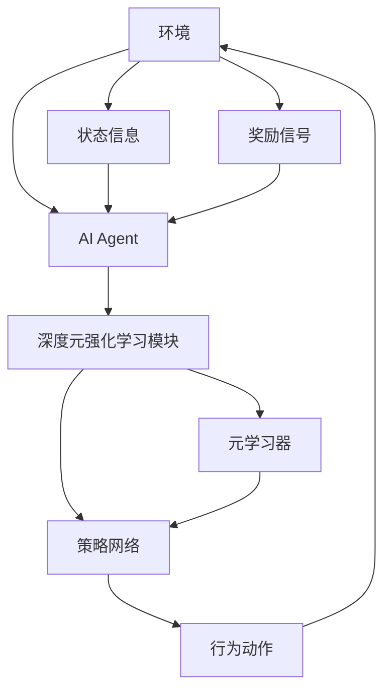

# 深度元强化学习在AI Agent适应性中的应用

> 关键词：深度元强化学习、AI Agent、适应性、元学习、强化学习

> 摘要：本文围绕深度元强化学习在AI Agent适应性中的应用展开深入探讨。首先介绍了相关背景知识，包括目的范围、预期读者等内容。接着详细阐述了核心概念，如深度元强化学习和AI Agent适应性的原理及联系，并给出了相应的文本示意图和Mermaid流程图。深入讲解了核心算法原理，通过Python代码进行具体实现，同时介绍了相关数学模型和公式。在项目实战部分，给出了开发环境搭建步骤、源代码实现及详细解读。分析了实际应用场景，推荐了学习、开发工具框架以及相关论文著作。最后总结了未来发展趋势与挑战，并给出常见问题解答和扩展阅读参考资料，旨在为该领域的研究和应用提供全面而深入的指导。

## 1. 背景介绍 
### 1.1 目的和范围
本文章旨在深入探讨深度元强化学习在AI Agent适应性方面的应用。随着人工智能技术的不断发展，AI Agent需要在复杂多变的环境中具备更强的适应性。深度元强化学习作为一种新兴的技术，为解决这一问题提供了新的思路和方法。我们将研究深度元强化学习的原理、算法以及如何将其应用于AI Agent，以提高其在不同环境下的学习和决策能力。范围涵盖了从理论基础到实际应用的各个方面，包括核心概念的解释、算法的实现、数学模型的推导、实际项目的案例分析等。

### 1.2 预期读者
本文预期读者包括人工智能领域的研究人员、开发者、学生以及对深度元强化学习和AI Agent适应性感兴趣的技术爱好者。对于有一定机器学习和强化学习基础的读者，能够通过本文深入了解深度元强化学习在AI Agent中的具体应用；对于初学者，也可以通过本文初步了解相关概念和技术，为进一步学习打下基础。

### 1.3 文档结构概述
本文将按照以下结构进行组织：首先介绍背景知识，包括目的、预期读者和文档结构概述等；接着阐述深度元强化学习和AI Agent适应性的核心概念及它们之间的联系，并给出相应的示意图和流程图；然后详细讲解核心算法原理，用Python代码实现算法的具体操作步骤；之后介绍相关的数学模型和公式，并举例说明；在项目实战部分，给出开发环境搭建、源代码实现和代码解读；分析深度元强化学习在AI Agent适应性中的实际应用场景；推荐学习、开发工具框架以及相关论文著作；最后总结未来发展趋势与挑战，给出常见问题解答和扩展阅读参考资料。

### 1.4 术语表
#### 1.4.1 核心术语定义
- **深度元强化学习（Deep Meta-Reinforcement Learning）**：结合了深度学习、元学习和强化学习的方法，旨在让智能体能够快速学习和适应新的任务和环境。通过元学习机制，智能体可以从以往的学习经验中提取通用的学习策略，从而在面对新任务时能够更快地收敛到最优策略。
- **AI Agent（人工智能智能体）**：是一种能够感知环境、做出决策并采取行动以实现特定目标的软件或硬件实体。在强化学习中，AI Agent通过与环境进行交互，根据环境反馈的奖励信号来学习最优的行为策略。
- **适应性（Adaptability）**：指AI Agent在面对不同的任务、环境变化或未知情况时，能够调整自身的行为策略，以保持良好的性能和实现目标的能力。

#### 1.4.2 相关概念解释
- **深度学习（Deep Learning）**：是一种基于人工神经网络的机器学习方法，通过构建多层神经网络来自动学习数据的特征表示。深度学习在图像识别、自然语言处理等领域取得了显著的成果。
- **元学习（Meta-Learning）**：也称为“学习如何学习”，旨在让模型能够从多个任务中学习通用的学习策略，以便在新的任务上能够快速学习和适应。元学习可以通过学习任务之间的共性，减少在新任务上的学习时间和数据需求。
- **强化学习（Reinforcement Learning）**：是一种通过智能体与环境进行交互，根据环境反馈的奖励信号来学习最优行为策略的机器学习方法。智能体的目标是最大化长期累积奖励。

#### 1.4.3 缩略词列表
- **DRL（Deep Reinforcement Learning）**：深度强化学习
- **MAML（Model-Agnostic Meta-Learning）**：模型无关元学习
- **PPO（Proximal Policy Optimization）**：近端策略优化算法

## 2. 核心概念与联系 

### 核心概念原理
#### 深度元强化学习原理
深度元强化学习结合了深度学习、元学习和强化学习的优势。深度学习提供了强大的函数逼近能力，能够处理复杂的高维数据。元学习则关注如何从多个任务中学习通用的学习策略，使得智能体在面对新任务时能够快速适应。强化学习通过智能体与环境的交互，根据奖励信号来优化行为策略。

在深度元强化学习中，智能体通常会在一系列的训练任务上进行学习，这些任务可以具有不同的环境设置、目标和动态特性。通过元学习机制，智能体学习到一种通用的学习策略，使得它能够在新的任务上快速调整自己的策略，以适应新的环境和目标。

#### AI Agent适应性原理
AI Agent的适应性是指其在不同环境和任务下能够灵活调整自身行为以实现最优性能的能力。适应性的实现依赖于智能体对环境的感知、对任务目标的理解以及对自身行为策略的调整。智能体通过不断地与环境进行交互，收集环境反馈信息，并根据这些信息来更新自己的策略。

在复杂多变的环境中，AI Agent需要具备快速学习和适应的能力。深度元强化学习为提高AI Agent的适应性提供了一种有效的方法，通过学习通用的学习策略，智能体可以在新的任务上更快地收敛到最优策略，从而提高其适应性。

### 架构的文本示意图
深度元强化学习在AI Agent适应性中的应用架构可以描述如下：

智能体（AI Agent）与环境进行交互，环境会给智能体提供状态信息和奖励信号。智能体内部包含一个深度元强化学习模块，该模块由元学习器和策略网络组成。元学习器负责从多个训练任务中学习通用的学习策略，策略网络则根据当前环境状态和元学习器学到的策略生成具体的行为动作。

在训练阶段，智能体在多个不同的任务上进行训练，元学习器不断优化通用学习策略。在测试阶段，当智能体遇到新的任务时，元学习器利用学到的通用策略快速调整策略网络，使得智能体能够快速适应新任务。

### Mermaid流程图


## 3. 核心算法原理 & 具体操作步骤 

### 核心算法原理
这里以Model-Agnostic Meta-Learning（MAML）算法为例，介绍深度元强化学习的核心算法原理。MAML是一种模型无关的元学习算法，它可以应用于各种深度学习模型，包括强化学习中的策略网络。

MAML的核心思想是通过在多个任务上进行训练，找到一个初始参数，使得在新任务上进行少量的梯度更新后，模型能够快速适应新任务。具体来说，MAML的训练过程分为两个阶段：元训练阶段和元测试阶段。

在元训练阶段，从任务分布中采样一组任务，对于每个任务，使用当前的初始参数进行一定步数的梯度更新，得到该任务的适应参数。然后，根据这些适应参数在各自任务上的损失，计算初始参数的元梯度，并使用元梯度更新初始参数。

在元测试阶段，当遇到新任务时，使用训练好的初始参数进行少量的梯度更新，得到适应新任务的参数。

### 具体操作步骤及Python代码实现

```python
import torch
import torch.nn as nn
import torch.optim as optim

# 定义一个简单的策略网络
class PolicyNetwork(nn.Module):
    def __init__(self, input_dim, output_dim):
        super(PolicyNetwork, self).__init__()
        self.fc1 = nn.Linear(input_dim, 64)
        self.fc2 = nn.Linear(64, output_dim)

    def forward(self, x):
        x = torch.relu(self.fc1(x))
        x = self.fc2(x)
        return x

# 定义MAML算法
class MAML:
    def __init__(self, input_dim, output_dim, lr_inner=0.01, lr_outer=0.001):
        self.policy = PolicyNetwork(input_dim, output_dim)
        self.optimizer = optim.Adam(self.policy.parameters(), lr=lr_outer)
        self.lr_inner = lr_inner

    def inner_update(self, task_data, params=None):
        if params is None:
            params = self.policy.parameters()
        optimizer_inner = optim.SGD(params, lr=self.lr_inner)
        states, actions, rewards = task_data
        logits = self.policy(states)
        loss = self.compute_loss(logits, actions, rewards)
        optimizer_inner.zero_grad()
        loss.backward()
        optimizer_inner.step()
        return list(self.policy.parameters())

    def meta_update(self, task_datas):
        meta_loss = 0
        for task_data in task_datas:
            # 内循环更新
            fast_params = self.inner_update(task_data)
            states, actions, rewards = task_data
            logits = self.policy(states)
            loss = self.compute_loss(logits, actions, rewards)
            meta_loss += loss
        self.optimizer.zero_grad()
        meta_loss.backward()
        self.optimizer.step()

    def compute_loss(self, logits, actions, rewards):
        # 简单的损失函数示例
        return -torch.mean(logits.gather(1, actions.unsqueeze(1)) * rewards.unsqueeze(1))

# 示例使用
input_dim = 10
output_dim = 2
maml = MAML(input_dim, output_dim)

# 模拟一些任务数据
task_datas = []
for _ in range(5):
    states = torch.randn(100, input_dim)
    actions = torch.randint(0, output_dim, (100,))
    rewards = torch.randn(100)
    task_datas.append((states, actions, rewards))

# 进行元训练
for _ in range(10):
    maml.meta_update(task_datas)

```

在上述代码中，首先定义了一个简单的策略网络 `PolicyNetwork`，然后实现了MAML算法的类 `MAML`。`inner_update` 方法实现了内循环的梯度更新，`meta_update` 方法实现了元梯度的计算和初始参数的更新。最后，模拟了一些任务数据，并进行了元训练。

## 4. 数学模型和公式 & 详细讲解 & 举例说明 

### 数学模型和公式
#### MAML的目标函数
MAML的目标是找到一个初始参数 $\theta$，使得在新任务上进行少量的梯度更新后，模型能够快速适应新任务。具体来说，对于一个任务 $\tau$，其损失函数为 $L(\tau, \theta')$，其中 $\theta'$ 是在任务 $\tau$ 上进行梯度更新后的参数。

内循环的梯度更新公式为：
$$\theta' = \theta - \alpha \nabla_{\theta} L(\tau, \theta)$$
其中 $\alpha$ 是内循环的学习率。

元训练的目标是最小化所有任务上的期望损失：
$$\min_{\theta} \mathbb{E}_{\tau \sim p(\tau)} [L(\tau, \theta')]$$
其中 $p(\tau)$ 是任务的分布。

#### 策略梯度定理
在强化学习中，策略梯度定理用于计算策略网络参数的梯度。设策略网络为 $\pi_{\theta}(a|s)$，表示在状态 $s$ 下采取动作 $a$ 的概率，奖励函数为 $r(s, a)$，折扣因子为 $\gamma$，则策略梯度为：
$$\nabla_{\theta} J(\theta) = \mathbb{E}_{\tau \sim \pi_{\theta}} \left[ \sum_{t=0}^{T} \nabla_{\theta} \log \pi_{\theta}(a_t|s_t) \sum_{k=t}^{T} \gamma^{k-t} r(s_k, a_k) \right]$$
其中 $J(\theta)$ 是策略的期望累积奖励。

### 详细讲解
MAML的目标函数的核心思想是通过在多个任务上进行训练，找到一个初始参数 $\theta$，使得在新任务上进行少量的梯度更新后，模型的损失能够尽可能小。内循环的梯度更新是为了在每个任务上快速适应，而元训练则是为了优化初始参数，使得在不同任务上都能有较好的适应能力。

策略梯度定理则是强化学习中计算策略网络参数梯度的重要工具。通过计算策略梯度，我们可以使用梯度上升的方法来优化策略网络，使得智能体的期望累积奖励最大化。

### 举例说明
假设我们有一个简单的强化学习任务，智能体在一个二维网格世界中移动，目标是到达指定的目标点。状态 $s$ 是智能体的当前位置，动作 $a$ 是智能体的移动方向（上、下、左、右），奖励函数 $r(s, a)$ 在智能体到达目标点时为正，否则为负。

我们使用MAML算法来训练智能体的策略网络。在元训练阶段，我们从不同的网格世界布局（不同的任务）中采样，对于每个任务，使用当前的初始参数进行内循环的梯度更新，得到适应参数。然后，根据这些适应参数在各自任务上的损失，计算元梯度并更新初始参数。

在元测试阶段，当遇到一个新的网格世界布局时，使用训练好的初始参数进行少量的梯度更新，智能体就能够快速适应新的环境，找到到达目标点的最优路径。

## 5. 项目实战：代码实际案例和详细解释说明 

### 5.1  开发环境搭建
#### 操作系统
推荐使用Linux系统，如Ubuntu 18.04或更高版本，也可以使用Windows 10或macOS。

#### 编程语言和库
- **Python**：推荐使用Python 3.7或更高版本。
- **PyTorch**：用于深度学习模型的构建和训练，可以通过以下命令安装：
```bash
pip install torch torchvision
```
- **NumPy**：用于数值计算，可以通过以下命令安装：
```bash
pip install numpy
```

#### 开发工具
- **Jupyter Notebook**：方便进行代码的编写、调试和可视化，可以通过以下命令安装：
```bash
pip install jupyter
```

### 5.2  源代码详细实现和代码解读
```python
import torch
import torch.nn as nn
import torch.optim as optim
import numpy as np

# 定义一个简单的策略网络
class PolicyNetwork(nn.Module):
    def __init__(self, input_dim, output_dim):
        super(PolicyNetwork, self).__init__()
        self.fc1 = nn.Linear(input_dim, 64)
        self.fc2 = nn.Linear(64, output_dim)

    def forward(self, x):
        x = torch.relu(self.fc1(x))
        x = self.fc2(x)
        return x

# 定义MAML算法
class MAML:
    def __init__(self, input_dim, output_dim, lr_inner=0.01, lr_outer=0.001):
        self.policy = PolicyNetwork(input_dim, output_dim)
        self.optimizer = optim.Adam(self.policy.parameters(), lr=lr_outer)
        self.lr_inner = lr_inner

    def inner_update(self, task_data, params=None):
        if params is None:
            params = self.policy.parameters()
        optimizer_inner = optim.SGD(params, lr=self.lr_inner)
        states, actions, rewards = task_data
        logits = self.policy(states)
        loss = self.compute_loss(logits, actions, rewards)
        optimizer_inner.zero_grad()
        loss.backward()
        optimizer_inner.step()
        return list(self.policy.parameters())

    def meta_update(self, task_datas):
        meta_loss = 0
        for task_data in task_datas:
            # 内循环更新
            fast_params = self.inner_update(task_data)
            states, actions, rewards = task_data
            logits = self.policy(states)
            loss = self.compute_loss(logits, actions, rewards)
            meta_loss += loss
        self.optimizer.zero_grad()
        meta_loss.backward()
        self.optimizer.step()

    def compute_loss(self, logits, actions, rewards):
        # 简单的损失函数示例
        return -torch.mean(logits.gather(1, actions.unsqueeze(1)) * rewards.unsqueeze(1))

# 模拟环境交互生成任务数据
def generate_task_data(input_dim, output_dim, num_samples):
    states = torch.randn(num_samples, input_dim)
    actions = torch.randint(0, output_dim, (num_samples,))
    rewards = torch.randn(num_samples)
    return (states, actions, rewards)

# 主训练循环
if __name__ == "__main__":
    input_dim = 10
    output_dim = 2
    maml = MAML(input_dim, output_dim)

    num_tasks = 5
    num_samples_per_task = 100
    num_epochs = 10

    for epoch in range(num_epochs):
        task_datas = []
        for _ in range(num_tasks):
            task_data = generate_task_data(input_dim, output_dim, num_samples_per_task)
            task_datas.append(task_data)
        maml.meta_update(task_datas)
        print(f"Epoch {epoch + 1} completed.")

```

### 代码解读与分析
#### 策略网络 `PolicyNetwork`
这是一个简单的两层全连接神经网络，用于表示智能体的策略。输入层的维度为 `input_dim`，输出层的维度为 `output_dim`。通过 `forward` 方法，将输入状态映射到动作的概率分布。

#### MAML类
- `__init__` 方法：初始化策略网络和优化器，设置内循环和外循环的学习率。
- `inner_update` 方法：实现内循环的梯度更新。对于给定的任务数据，使用SGD优化器进行一次梯度更新，并返回更新后的参数。
- `meta_update` 方法：实现元梯度的计算和初始参数的更新。对于一组任务数据，首先进行内循环更新，然后计算元损失并使用Adam优化器更新初始参数。
- `compute_loss` 方法：计算策略网络的损失，这里使用了一个简单的损失函数。

#### 任务数据生成函数 `generate_task_data`
模拟环境交互，生成一组任务数据，包括状态、动作和奖励。

#### 主训练循环
在主训练循环中，我们设置了任务数量、每个任务的样本数量和训练轮数。在每个训练轮次中，生成一组任务数据，并调用 `meta_update` 方法进行元训练。

## 6. 实际应用场景 
### 机器人控制
在机器人控制领域，深度元强化学习可以帮助机器人快速适应不同的任务和环境。例如，在工业生产中，机器人需要执行不同的装配任务，每个任务可能有不同的工件形状、尺寸和装配顺序。通过深度元强化学习，机器人可以从以往的任务中学习通用的学习策略，在面对新的装配任务时能够快速调整自己的动作策略，提高装配效率和质量。

### 自动驾驶
在自动驾驶领域，车辆需要在不同的道路条件、交通规则和天气环境下行驶。深度元强化学习可以让自动驾驶车辆从大量的驾驶场景中学习通用的驾驶策略，当遇到新的路况或特殊情况时，能够快速适应并做出合理的决策，提高驾驶的安全性和可靠性。

### 游戏智能体
在游戏领域，深度元强化学习可以用于训练智能体在不同的游戏环境中表现出色。例如，在策略游戏中，智能体需要根据不同的游戏地图、资源分布和对手策略来制定自己的游戏策略。通过深度元强化学习，智能体可以学习到通用的游戏策略，在面对新的游戏场景时能够快速适应，提高游戏胜率。

### 医疗健康
在医疗健康领域，深度元强化学习可以用于个性化医疗方案的制定。不同的患者可能有不同的病情、身体状况和基因特征，通过深度元强化学习，医生可以从大量的患者数据中学习到通用的治疗策略，为每个患者制定个性化的治疗方案，提高治疗效果。

## 7. 工具和资源推荐
### 7.1 学习资源推荐
#### 7.1.1 书籍推荐
- 《Reinforcement Learning: An Introduction》（《强化学习：原理与Python实现》）：这本书是强化学习领域的经典教材，详细介绍了强化学习的基本概念、算法和应用。
- 《Deep Learning》（《深度学习》）：由Ian Goodfellow、Yoshua Bengio和Aaron Courville所著，是深度学习领域的权威书籍，涵盖了深度学习的各个方面。
- 《Meta-Learning: Foundations and Trends in Machine Learning》：这本书专门介绍了元学习的理论和方法，对于深入理解深度元强化学习的元学习部分非常有帮助。

#### 7.1.2 在线课程
- Coursera上的“Reinforcement Learning Specialization”：由University of Alberta的Richard Sutton教授等讲授，是强化学习领域的经典在线课程。
- edX上的“Deep Learning Fundamentals”：介绍了深度学习的基本概念和方法，为学习深度元强化学习打下基础。
- OpenAI Gym官方文档和教程：OpenAI Gym是一个用于开发和比较强化学习算法的工具包，其官方文档和教程提供了丰富的强化学习实践经验。

#### 7.1.3 技术博客和网站
- arXiv.org：是一个预印本论文平台，提供了大量关于深度元强化学习和人工智能的最新研究成果。
- Medium上的人工智能相关博客：有很多人工智能领域的专家和爱好者在Medium上分享他们的研究成果和实践经验。
- Towards Data Science：是一个专注于数据科学和机器学习的技术博客，提供了很多关于深度元强化学习的实用教程和案例分析。

### 7.2 开发工具框架推荐
#### 7.2.1 IDE和编辑器
- PyCharm：是一款专门为Python开发设计的集成开发环境，具有强大的代码编辑、调试和项目管理功能。
- Jupyter Notebook：是一个交互式的开发环境，适合进行代码的编写、调试和可视化，非常适合进行深度学习和强化学习的实验。
- Visual Studio Code：是一款轻量级的代码编辑器，支持多种编程语言和插件，具有丰富的扩展功能。

#### 7.2.2 调试和性能分析工具
- TensorBoard：是TensorFlow的可视化工具，也可以用于PyTorch项目。它可以帮助我们可视化训练过程中的损失曲线、梯度变化等信息，方便我们调试和优化模型。
- PyTorch Profiler：是PyTorch提供的性能分析工具，可以帮助我们分析模型的运行时间、内存使用情况等，找出性能瓶颈。
- NVIDIA Nsight Systems：是NVIDIA提供的一款性能分析工具，专门用于分析GPU加速的深度学习模型的性能。

#### 7.2.3 相关框架和库
- PyTorch：是一个开源的深度学习框架，具有动态图和自动求导等特性，非常适合进行深度元强化学习的研究和开发。
- OpenAI Gym：是一个用于开发和比较强化学习算法的工具包，提供了丰富的环境和接口，方便我们进行强化学习的实验。
- Stable Baselines3：是一个基于PyTorch的强化学习库，提供了多种经典的强化学习算法的实现，方便我们快速上手和进行实验。

### 7.3 相关论文著作推荐
#### 7.3.1 经典论文
- "Model-Agnostic Meta-Learning for Fast Adaptation of Deep Networks"：这是MAML算法的原始论文，详细介绍了MAML的原理和算法实现。
- "Proximal Policy Optimization Algorithms"：介绍了PPO算法，是一种高效的策略优化算法，在强化学习领域得到了广泛应用。
- "Deep Reinforcement Learning with Double Q-learning"：提出了Double Q-learning算法，用于解决深度强化学习中的过估计问题。

#### 7.3.2 最新研究成果
- 在arXiv.org上搜索“Deep Meta-Reinforcement Learning”可以找到很多关于深度元强化学习的最新研究论文，了解该领域的最新发展动态。
- 参加人工智能领域的顶级会议，如NeurIPS、ICML、AAAI等，这些会议上会有很多关于深度元强化学习的最新研究成果发表。

#### 7.3.3 应用案例分析
- 在IEEE Xplore、ACM Digital Library等学术数据库中搜索关于深度元强化学习在机器人控制、自动驾驶、游戏智能体等领域的应用案例分析论文，学习如何将深度元强化学习应用到实际问题中。

## 8. 总结：未来发展趋势与挑战
### 未来发展趋势
#### 与其他技术的融合
深度元强化学习将与计算机视觉、自然语言处理等技术进一步融合，实现更加复杂和智能的应用。例如，在自动驾驶领域，结合计算机视觉技术可以让车辆更好地感知周围环境，结合自然语言处理技术可以实现与乘客的智能交互。

#### 大规模分布式训练
随着数据量和模型复杂度的增加，大规模分布式训练将成为深度元强化学习的发展趋势。通过分布式训练，可以利用多个计算设备的计算资源，提高训练效率和模型性能。

#### 理论基础的完善
深度元强化学习的理论基础还不够完善，未来需要进一步深入研究其数学原理和收敛性分析。完善的理论基础将有助于更好地理解和应用深度元强化学习算法。

### 挑战
#### 计算资源需求
深度元强化学习通常需要大量的计算资源进行训练，特别是在处理复杂的任务和大规模数据时。如何降低计算资源需求，提高训练效率是一个亟待解决的问题。

#### 样本效率
深度元强化学习在学习过程中通常需要大量的样本，样本效率较低。提高样本效率，减少对样本数量的依赖，是提高深度元强化学习实用性的关键。

#### 可解释性
深度元强化学习模型通常是黑盒模型，其决策过程难以解释。在一些对安全性和可靠性要求较高的应用场景中，如自动驾驶和医疗健康，模型的可解释性是一个重要的挑战。

## 9. 附录：常见问题与解答
### 问题1：深度元强化学习与传统强化学习有什么区别？
传统强化学习通常在一个固定的任务或环境中进行学习，智能体需要通过大量的交互来学习最优策略。而深度元强化学习则关注如何从多个任务中学习通用的学习策略，使得智能体在面对新任务时能够快速适应。深度元强化学习通过元学习机制，减少了在新任务上的学习时间和数据需求。

### 问题2：MAML算法的优缺点是什么？
优点：MAML是一种模型无关的元学习算法，可以应用于各种深度学习模型，具有较强的通用性。它能够在新任务上快速适应，提高智能体的学习效率。

缺点：MAML的训练过程比较复杂，需要进行内循环和外循环的梯度更新，计算量较大。此外，MAML对初始参数的选择比较敏感，不同的初始参数可能会导致不同的训练结果。

### 问题3：如何评估深度元强化学习模型的性能？
可以从以下几个方面评估深度元强化学习模型的性能：
- **适应速度**：在新任务上，模型达到一定性能水平所需的时间或样本数量。
- **泛化能力**：模型在不同任务和环境下的性能表现。
- **最终性能**：模型在新任务上达到的最终性能水平，如累积奖励、成功率等。

### 问题4：深度元强化学习在实际应用中面临哪些挑战？
在实际应用中，深度元强化学习面临计算资源需求大、样本效率低、可解释性差等挑战。此外，还需要考虑实际环境的复杂性和不确定性，以及如何将深度元强化学习模型与现有的系统进行集成。

## 10. 扩展阅读 & 参考资料
### 扩展阅读
- 《Artificial Intelligence: A Modern Approach》（《人工智能：一种现代的方法》）：这本书涵盖了人工智能的各个领域，包括机器学习、强化学习、自然语言处理等，对于深入理解人工智能的整体框架和技术有很大帮助。
- 《Probabilistic Robotics》（《概率机器人学》）：介绍了机器人控制中的概率方法，对于理解机器人在不确定环境中的决策和学习有重要意义。

### 参考资料
- 相关论文的引用信息，如MAML、PPO等算法的原始论文。
- 工具和库的官方文档，如PyTorch、OpenAI Gym等的官方文档。
- 在线课程和技术博客的链接，如Coursera、Medium等平台上的相关课程和博客文章。

作者：AI天才研究院/AI Genius Institute & 禅与计算机程序设计艺术 /Zen And The Art of Computer Programming