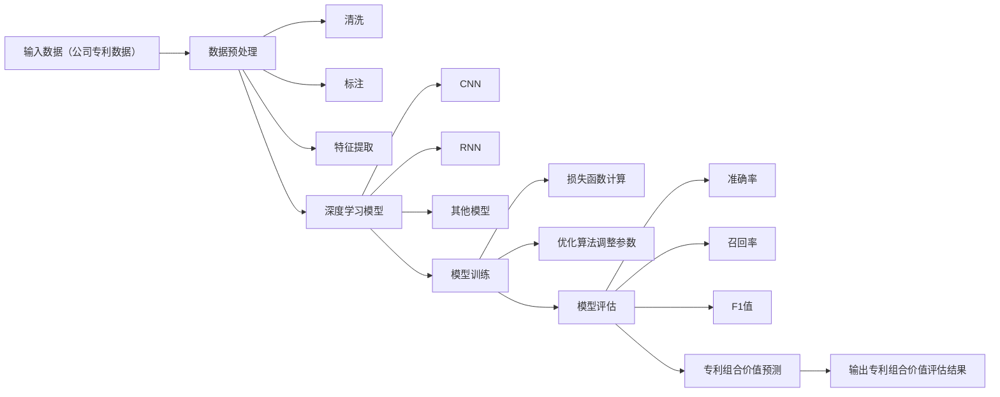

# 深度学习分析公司专利组合价值

> 关键词：深度学习、公司专利组合、专利价值分析、特征提取、预测模型

> 摘要：本文聚焦于利用深度学习技术对公司专利组合价值进行分析。详细阐述了深度学习在专利价值评估领域的应用背景、核心概念、算法原理、数学模型等内容。通过项目实战展示了如何搭建开发环境、实现源代码并进行解读。同时探讨了该技术在实际中的应用场景，推荐了相关的学习资源、开发工具和论文著作。最后对未来发展趋势与挑战进行了总结，并提供了常见问题解答和扩展阅读参考资料，旨在为相关领域的研究者和从业者提供全面而深入的技术指导。

## 1. 背景介绍 
### 1.1 目的和范围
在当今知识经济时代，专利作为企业的重要无形资产，其价值评估对于企业的战略决策、投资分析、技术创新等方面都具有至关重要的意义。传统的专利价值评估方法往往依赖于专家经验和简单的指标计算，存在主观性强、效率低下等问题。深度学习作为一种强大的机器学习技术，具有自动从大量数据中学习复杂模式和特征的能力，为公司专利组合价值分析提供了新的思路和方法。

本文的目的在于系统地介绍如何利用深度学习技术对公司专利组合价值进行分析，包括核心概念、算法原理、数学模型、实际应用等方面。范围涵盖了从专利数据的预处理、特征提取，到深度学习模型的构建、训练和评估，以及最终的专利组合价值预测和分析。

### 1.2 预期读者
本文的预期读者包括对深度学习和专利价值评估感兴趣的研究人员、企业管理人员、投资分析师、知识产权律师等。对于具有一定编程基础和机器学习知识的读者，能够深入理解本文所介绍的技术原理和实现方法；对于非技术背景的读者，也可以通过本文了解深度学习在专利价值分析中的应用价值和基本流程。

### 1.3 文档结构概述
本文共分为十个部分，具体结构如下：
1. **背景介绍**：阐述本文的目的和范围、预期读者、文档结构概述以及相关术语表。
2. **核心概念与联系**：介绍深度学习、公司专利组合、专利价值分析等核心概念，并通过文本示意图和 Mermaid 流程图展示它们之间的联系。
3. **核心算法原理 & 具体操作步骤**：详细讲解深度学习中常用的算法原理，如卷积神经网络（CNN）、循环神经网络（RNN）等，并使用 Python 源代码阐述具体的操作步骤。
4. **数学模型和公式 & 详细讲解 & 举例说明**：介绍深度学习模型的数学基础，包括损失函数、优化算法等，并通过具体的例子进行详细讲解。
5. **项目实战：代码实际案例和详细解释说明**：通过一个实际的项目案例，展示如何搭建开发环境、实现源代码并进行解读。
6. **实际应用场景**：探讨深度学习分析公司专利组合价值在企业战略决策、投资分析、技术创新等方面的实际应用场景。
7. **工具和资源推荐**：推荐相关的学习资源、开发工具和论文著作，帮助读者进一步深入学习和研究。
8. **总结：未来发展趋势与挑战**：总结深度学习在专利价值分析领域的发展趋势，并分析面临的挑战。
9. **附录：常见问题与解答**：提供常见问题的解答，帮助读者解决在学习和实践过程中遇到的问题。
10. **扩展阅读 & 参考资料**：列出相关的扩展阅读材料和参考资料，供读者进一步学习和研究。

### 1.4 术语表
#### 1.4.1 核心术语定义
- **深度学习（Deep Learning）**：一种基于人工神经网络的机器学习技术，通过构建多层神经网络模型，自动从大量数据中学习复杂的模式和特征。
- **公司专利组合（Company Patent Portfolio）**：指一个公司拥有的所有专利的集合，反映了公司在技术创新方面的实力和成果。
- **专利价值分析（Patent Value Analysis）**：对专利的经济价值、技术价值、法律价值等进行评估和分析的过程。
- **特征提取（Feature Extraction）**：从原始数据中提取出能够反映数据本质特征的信息，以便于后续的分析和处理。
- **预测模型（Prediction Model）**：基于历史数据构建的模型，用于预测未来的结果或趋势。

#### 1.4.2 相关概念解释
- **卷积神经网络（Convolutional Neural Network，CNN）**：一种专门用于处理具有网格结构数据（如图像、文本等）的深度学习模型，通过卷积层、池化层等操作自动提取数据的特征。
- **循环神经网络（Recurrent Neural Network，RNN）**：一种能够处理序列数据的深度学习模型，通过循环结构来捕捉序列数据中的时间依赖关系。
- **损失函数（Loss Function）**：用于衡量模型预测结果与真实标签之间的差异，是模型训练过程中的优化目标。
- **优化算法（Optimization Algorithm）**：用于调整模型参数，使得损失函数的值最小化的算法，如随机梯度下降（SGD）、Adam 等。

#### 1.4.3 缩略词列表
- **CNN**：Convolutional Neural Network
- **RNN**：Recurrent Neural Network
- **SGD**：Stochastic Gradient Descent
- **LSTM**：Long Short-Term Memory
- **GRU**：Gated Recurrent Unit

## 2. 核心概念与联系 

### 核心概念原理
#### 深度学习
深度学习是机器学习的一个分支，它通过构建多层神经网络来学习数据的特征和模式。深度学习模型通常由输入层、隐藏层和输出层组成，隐藏层可以有多个，每个隐藏层包含多个神经元。神经元之间通过权重连接，权重的大小决定了神经元之间的连接强度。在训练过程中，模型通过调整权重来最小化损失函数，从而学习到数据的特征和模式。

#### 公司专利组合
公司专利组合是一个公司拥有的所有专利的集合。专利是一种法律赋予的独占权，用于保护发明创造的技术方案。公司通过申请和获得专利，可以保护自己的技术创新成果，提高市场竞争力。公司专利组合的规模和质量反映了公司在技术创新方面的实力和成果。

#### 专利价值分析
专利价值分析是对专利的经济价值、技术价值、法律价值等进行评估和分析的过程。专利的经济价值主要体现在专利的市场价值、商业潜力等方面；技术价值主要体现在专利的创新性、先进性等方面；法律价值主要体现在专利的有效性、稳定性等方面。专利价值分析的目的是为了帮助企业更好地管理和利用专利资源，做出合理的战略决策。

### 架构的文本示意图
```plaintext
输入数据（公司专利数据）
|
|-- 数据预处理
|   |-- 清洗
|   |-- 标注
|   |-- 特征提取
|
|-- 深度学习模型
|   |-- CNN
|   |-- RNN
|   |-- 其他模型
|
|-- 模型训练
|   |-- 损失函数计算
|   |-- 优化算法调整参数
|
|-- 模型评估
|   |-- 准确率
|   |-- 召回率
|   |-- F1 值
|
|-- 专利组合价值预测
|   |-- 输出专利组合价值评估结果
```

### Mermaid 流程图


## 3. 核心算法原理 & 具体操作步骤 

### 卷积神经网络（CNN）原理
卷积神经网络（CNN）是一种专门用于处理具有网格结构数据（如图像、文本等）的深度学习模型。CNN 的核心思想是通过卷积层、池化层等操作自动提取数据的特征。

#### 卷积层
卷积层是 CNN 的核心层，它通过卷积核在输入数据上滑动，进行卷积操作，从而提取数据的特征。卷积操作的数学公式如下：
$$
y_{i,j} = \sum_{m=0}^{M-1} \sum_{n=0}^{N-1} x_{i+m,j+n} \cdot w_{m,n} + b
$$
其中，$x$ 是输入数据，$w$ 是卷积核，$b$ 是偏置，$y$ 是卷积结果。

#### 池化层
池化层用于对卷积层的输出进行下采样，减少数据的维度，同时保留数据的主要特征。常用的池化方法有最大池化和平均池化。

#### 全连接层
全连接层将池化层的输出展平为一维向量，然后通过全连接的方式将向量输入到输出层，进行分类或回归任务。

### CNN 的 Python 实现
```python
import torch
import torch.nn as nn

class CNN(nn.Module):
    def __init__(self):
        super(CNN, self).__init__()
        self.conv1 = nn.Conv2d(in_channels=3, out_channels=16, kernel_size=3, padding=1)
        self.relu1 = nn.ReLU()
        self.pool1 = nn.MaxPool2d(kernel_size=2, stride=2)
        self.conv2 = nn.Conv2d(in_channels=16, out_channels=32, kernel_size=3, padding=1)
        self.relu2 = nn.ReLU()
        self.pool2 = nn.MaxPool2d(kernel_size=2, stride=2)
        self.fc1 = nn.Linear(32 * 8 * 8, 128)
        self.relu3 = nn.ReLU()
        self.fc2 = nn.Linear(128, 10)

    def forward(self, x):
        x = self.conv1(x)
        x = self.relu1(x)
        x = self.pool1(x)
        x = self.conv2(x)
        x = self.relu2(x)
        x = self.pool2(x)
        x = x.view(-1, 32 * 8 * 8)
        x = self.fc1(x)
        x = self.relu3(x)
        x = self.fc2(x)
        return x

# 创建模型实例
model = CNN()
```

### 循环神经网络（RNN）原理
循环神经网络（RNN）是一种能够处理序列数据的深度学习模型，通过循环结构来捕捉序列数据中的时间依赖关系。

#### RNN 的基本结构
RNN 的基本结构包含一个输入层、一个隐藏层和一个输出层。隐藏层的状态会在每个时间步更新，并且会作为下一个时间步的输入。RNN 的更新公式如下：
$$
h_t = \tanh(W_{xh} x_t + W_{hh} h_{t-1} + b_h)
$$
$$
y_t = W_{hy} h_t + b_y
$$
其中，$x_t$ 是输入，$h_t$ 是隐藏层状态，$y_t$ 是输出，$W_{xh}$、$W_{hh}$、$W_{hy}$ 是权重矩阵，$b_h$、$b_y$ 是偏置。

#### RNN 的问题及改进
传统 RNN 存在梯度消失和梯度爆炸的问题，导致难以学习长序列数据中的长期依赖关系。为了解决这个问题，提出了长短期记忆网络（LSTM）和门控循环单元（GRU）等改进模型。

### RNN 的 Python 实现
```python
import torch
import torch.nn as nn

class RNN(nn.Module):
    def __init__(self, input_size, hidden_size, output_size):
        super(RNN, self).__init__()
        self.hidden_size = hidden_size
        self.rnn = nn.RNN(input_size, hidden_size, batch_first=True)
        self.fc = nn.Linear(hidden_size, output_size)

    def forward(self, x):
        h0 = torch.zeros(1, x.size(0), self.hidden_size).to(x.device)
        out, _ = self.rnn(x, h0)
        out = self.fc(out[:, -1, :])
        return out

# 创建模型实例
input_size = 10
hidden_size = 20
output_size = 1
model = RNN(input_size, hidden_size, output_size)
```

### 具体操作步骤
1. **数据准备**：收集公司专利数据，并进行清洗、标注和特征提取。
2. **模型选择**：根据数据的特点和任务的需求，选择合适的深度学习模型，如 CNN、RNN 等。
3. **模型训练**：使用训练数据对模型进行训练，调整模型的参数，使得损失函数的值最小化。
4. **模型评估**：使用测试数据对训练好的模型进行评估，计算模型的准确率、召回率、F1 值等指标。
5. **专利组合价值预测**：使用训练好的模型对公司专利组合的价值进行预测。

## 4. 数学模型和公式 & 详细讲解 & 举例说明 

### 损失函数
损失函数用于衡量模型预测结果与真实标签之间的差异，是模型训练过程中的优化目标。常见的损失函数有均方误差（MSE）、交叉熵损失（Cross Entropy Loss）等。

#### 均方误差（MSE）
均方误差是回归问题中常用的损失函数，其数学公式如下：
$$
MSE = \frac{1}{n} \sum_{i=1}^{n} (y_i - \hat{y}_i)^2
$$
其中，$y_i$ 是真实标签，$\hat{y}_i$ 是模型预测结果，$n$ 是样本数量。

#### 交叉熵损失（Cross Entropy Loss）
交叉熵损失是分类问题中常用的损失函数，其数学公式如下：
$$
CE = - \frac{1}{n} \sum_{i=1}^{n} \sum_{j=1}^{C} y_{ij} \log(\hat{y}_{ij})
$$
其中，$y_{ij}$ 是第 $i$ 个样本属于第 $j$ 类的真实标签，$\hat{y}_{ij}$ 是模型预测第 $i$ 个样本属于第 $j$ 类的概率，$C$ 是类别数量。

### 优化算法
优化算法用于调整模型参数，使得损失函数的值最小化。常见的优化算法有随机梯度下降（SGD）、Adam 等。

#### 随机梯度下降（SGD）
随机梯度下降是一种简单而有效的优化算法，其更新公式如下：
$$
\theta_{t+1} = \theta_t - \eta \nabla L(\theta_t)
$$
其中，$\theta_t$ 是第 $t$ 次迭代时的模型参数，$\eta$ 是学习率，$\nabla L(\theta_t)$ 是损失函数关于模型参数的梯度。

#### Adam
Adam 是一种自适应学习率的优化算法，结合了动量和自适应学习率的思想，其更新公式如下：
$$
m_{t+1} = \beta_1 m_t + (1 - \beta_1) \nabla L(\theta_t)
$$
$$
v_{t+1} = \beta_2 v_t + (1 - \beta_2) (\nabla L(\theta_t))^2
$$
$$
\hat{m}_{t+1} = \frac{m_{t+1}}{1 - \beta_1^t}
$$
$$
\hat{v}_{t+1} = \frac{v_{t+1}}{1 - \beta_2^t}
$$
$$
\theta_{t+1} = \theta_t - \frac{\eta}{\sqrt{\hat{v}_{t+1}} + \epsilon} \hat{m}_{t+1}
$$
其中，$m_t$ 和 $v_t$ 分别是梯度的一阶矩估计和二阶矩估计，$\beta_1$ 和 $\beta_2$ 是衰减率，$\epsilon$ 是一个很小的常数。

### 举例说明
假设我们有一个简单的线性回归模型 $y = wx + b$，其中 $x$ 是输入，$y$ 是输出，$w$ 和 $b$ 是模型参数。我们使用均方误差作为损失函数，随机梯度下降作为优化算法进行模型训练。

```python
import torch
import torch.nn as nn
import torch.optim as optim

# 生成数据
x = torch.tensor([[1.0], [2.0], [3.0], [4.0]], dtype=torch.float32)
y = torch.tensor([[2.0], [4.0], [6.0], [8.0]], dtype=torch.float32)

# 定义模型
model = nn.Linear(1, 1)

# 定义损失函数和优化算法
criterion = nn.MSELoss()
optimizer = optim.SGD(model.parameters(), lr=0.01)

# 训练模型
num_epochs = 1000
for epoch in range(num_epochs):
    # 前向传播
    outputs = model(x)
    loss = criterion(outputs, y)

    # 反向传播和优化
    optimizer.zero_grad()
    loss.backward()
    optimizer.step()

    if (epoch+1) % 100 == 0:
        print(f'Epoch [{epoch+1}/{num_epochs}], Loss: {loss.item():.4f}')

# 测试模型
test_x = torch.tensor([[5.0]], dtype=torch.float32)
test_y = model(test_x)
print(f'Predicted value for x = 5: {test_y.item():.4f}')
```

在这个例子中，我们首先生成了一些简单的线性数据，然后定义了一个线性回归模型。接着，我们使用均方误差作为损失函数，随机梯度下降作为优化算法进行模型训练。最后，我们使用训练好的模型对一个新的输入进行预测。

## 5. 项目实战：代码实际案例和详细解释说明 

### 5.1  开发环境搭建
#### 安装 Python
首先，我们需要安装 Python 环境。建议使用 Python 3.6 及以上版本。可以从 Python 官方网站（https://www.python.org/downloads/） 下载并安装 Python。

#### 安装深度学习框架
我们选择使用 PyTorch 作为深度学习框架。可以使用以下命令安装 PyTorch：
```bash
pip install torch torchvision
```

#### 安装其他依赖库
还需要安装一些其他的依赖库，如 numpy、pandas、scikit-learn 等。可以使用以下命令安装：
```bash
pip install numpy pandas scikit-learn
```

### 5.2  源代码详细实现和代码解读
#### 数据加载和预处理
```python
import pandas as pd
from sklearn.preprocessing import StandardScaler

# 加载数据
data = pd.read_csv('company_patent_data.csv')

# 分离特征和标签
X = data.drop('patent_value', axis=1)
y = data['patent_value']

# 数据标准化
scaler = StandardScaler()
X_scaled = scaler.fit_transform(X)
```
这段代码首先使用 pandas 库加载公司专利数据，然后分离特征和标签。最后，使用 StandardScaler 对特征数据进行标准化处理。

#### 构建深度学习模型
```python
import torch
import torch.nn as nn

class PatentValueModel(nn.Module):
    def __init__(self, input_size):
        super(PatentValueModel, self).__init__()
        self.fc1 = nn.Linear(input_size, 64)
        self.relu1 = nn.ReLU()
        self.fc2 = nn.Linear(64, 32)
        self.relu2 = nn.ReLU()
        self.fc3 = nn.Linear(32, 1)

    def forward(self, x):
        x = self.fc1(x)
        x = self.relu1(x)
        x = self.fc2(x)
        x = self.relu2(x)
        x = self.fc3(x)
        return x

# 创建模型实例
input_size = X_scaled.shape[1]
model = PatentValueModel(input_size)
```
这段代码定义了一个简单的全连接神经网络模型，包含三个全连接层和两个 ReLU 激活函数。

#### 模型训练
```python
import torch.optim as optim
from torch.utils.data import TensorDataset, DataLoader

# 将数据转换为 PyTorch 张量
X_tensor = torch.tensor(X_scaled, dtype=torch.float32)
y_tensor = torch.tensor(y.values, dtype=torch.float32).view(-1, 1)

# 创建数据集和数据加载器
dataset = TensorDataset(X_tensor, y_tensor)
dataloader = DataLoader(dataset, batch_size=32, shuffle=True)

# 定义损失函数和优化算法
criterion = nn.MSELoss()
optimizer = optim.Adam(model.parameters(), lr=0.001)

# 训练模型
num_epochs = 100
for epoch in range(num_epochs):
    for inputs, labels in dataloader:
        # 前向传播
        outputs = model(inputs)
        loss = criterion(outputs, labels)

        # 反向传播和优化
        optimizer.zero_grad()
        loss.backward()
        optimizer.step()

    if (epoch+1) % 10 == 0:
        print(f'Epoch [{epoch+1}/{num_epochs}], Loss: {loss.item():.4f}')
```
这段代码将数据转换为 PyTorch 张量，创建数据集和数据加载器。然后定义损失函数和优化算法，进行模型训练。

#### 模型评估
```python
from sklearn.metrics import mean_squared_error

# 预测
with torch.no_grad():
    predictions = model(X_tensor)

# 计算均方误差
mse = mean_squared_error(y_tensor.numpy(), predictions.numpy())
print(f'Mean Squared Error: {mse:.4f}')
```
这段代码使用训练好的模型进行预测，并计算预测结果的均方误差。

### 5.3  代码解读与分析
- **数据加载和预处理**：使用 pandas 加载数据，然后使用 StandardScaler 对特征数据进行标准化处理，使得数据具有相同的尺度，有利于模型的训练。
- **模型构建**：定义了一个简单的全连接神经网络模型，包含三个全连接层和两个 ReLU 激活函数。ReLU 激活函数可以引入非线性，增强模型的表达能力。
- **模型训练**：使用 Adam 优化算法和均方误差损失函数进行模型训练。Adam 优化算法结合了动量和自适应学习率的思想，能够更快地收敛。
- **模型评估**：使用均方误差作为评估指标，衡量模型预测结果与真实标签之间的差异。

## 6. 实际应用场景 
### 企业战略决策
企业可以利用深度学习分析公司专利组合价值，了解自身在技术创新方面的优势和劣势，从而制定合理的战略决策。例如，企业可以根据专利组合价值评估结果，决定是否加大研发投入、开展技术合作、进行专利转让等。

### 投资分析
投资者可以通过深度学习分析公司专利组合价值，评估公司的技术实力和发展潜力，从而做出合理的投资决策。例如，投资者可以选择具有高价值专利组合的公司进行投资，以获取更高的回报。

### 技术创新
企业可以利用深度学习分析公司专利组合价值，发现技术创新的热点和趋势，从而指导研发方向。例如，企业可以通过分析竞争对手的专利组合，了解其技术创新方向，从而调整自己的研发策略。

### 知识产权管理
企业可以利用深度学习分析公司专利组合价值，优化知识产权管理策略。例如，企业可以根据专利组合价值评估结果，决定哪些专利需要重点维护和保护，哪些专利可以进行转让或放弃。

## 7. 工具和资源推荐
### 7.1 学习资源推荐
#### 7.1.1 书籍推荐
- 《深度学习》（Deep Learning）：由 Ian Goodfellow、Yoshua Bengio 和 Aaron Courville 所著，是深度学习领域的经典教材。
- 《Python 深度学习》（Deep Learning with Python）：由 Francois Chollet 所著，详细介绍了如何使用 Keras 框架进行深度学习开发。
- 《动手学深度学习》（Dive into Deep Learning）：由 Aston Zhang、Zachary C. Lipton、Mu Li 和 Alexander J. Smola 所著，提供了丰富的代码示例和实践项目。

#### 7.1.2 在线课程
- Coursera 上的《深度学习专项课程》（Deep Learning Specialization）：由 Andrew Ng 教授授课，涵盖了深度学习的各个方面。
- edX 上的《麻省理工学院：深度学习基础》（MITx: 6.S191x Introduction to Deep Learning）：由麻省理工学院的教授授课，介绍了深度学习的基本原理和应用。
- 哔哩哔哩上的《李宏毅机器学习》：由台湾大学的李宏毅教授授课，课程内容生动有趣，适合初学者。

#### 7.1.3 技术博客和网站
- Medium：上面有很多深度学习领域的优秀博客文章，涵盖了最新的研究成果和实践经验。
- arXiv：一个预印本数据库，提供了大量的深度学习相关的研究论文。
- Kaggle：一个数据科学竞赛平台，上面有很多深度学习相关的数据集和竞赛项目，可以帮助你提高实践能力。

### 7.2 开发工具框架推荐
#### 7.2.1 IDE和编辑器
- PyCharm：一款专业的 Python 集成开发环境，提供了丰富的代码编辑、调试、版本控制等功能。
- Jupyter Notebook：一个交互式的开发环境，适合进行数据分析和模型实验。
- Visual Studio Code：一款轻量级的代码编辑器，支持多种编程语言和插件扩展。

#### 7.2.2 调试和性能分析工具
- TensorBoard：TensorFlow 提供的可视化工具，可以帮助你可视化模型的训练过程、损失函数曲线等。
- PyTorch Profiler：PyTorch 提供的性能分析工具，可以帮助你分析模型的运行时间、内存使用等情况。
- NVIDIA Nsight Systems：一款专业的性能分析工具，适用于 GPU 加速的深度学习模型。

#### 7.2.3 相关框架和库
- PyTorch：一个开源的深度学习框架，具有动态图、易于使用等特点。
- TensorFlow：一个广泛使用的深度学习框架，提供了丰富的工具和库。
- Scikit-learn：一个机器学习库，提供了各种机器学习算法和工具，适用于数据预处理、模型评估等任务。

### 7.3 相关论文著作推荐
#### 7.3.1 经典论文
- 《Gradient-Based Learning Applied to Document Recognition》：由 Yann LeCun、Léon Bottou、Yoshua Bengio 和 Patrick Haffner 所著，介绍了卷积神经网络（CNN）在手写数字识别中的应用。
- 《Long Short-Term Memory》：由 Sepp Hochreiter 和 Jürgen Schmidhuber 所著，提出了长短期记忆网络（LSTM），解决了传统 RNN 中的梯度消失问题。
- 《Attention Is All You Need》：由 Ashish Vaswani 等人所著，提出了 Transformer 模型，在自然语言处理领域取得了巨大的成功。

#### 7.3.2 最新研究成果
- 可以关注 arXiv 上的最新研究论文，了解深度学习在专利价值分析领域的最新研究成果。
- 参加相关的学术会议，如 NeurIPS、ICML、CVPR 等，了解最新的研究动态和技术趋势。

#### 7.3.3 应用案例分析
- 可以关注一些知名企业的技术博客，了解他们在深度学习和专利价值分析方面的应用案例和实践经验。
- 阅读一些行业报告和研究论文，了解深度学习在不同行业的应用情况和发展趋势。

## 8. 总结：未来发展趋势与挑战
### 未来发展趋势
- **多模态数据融合**：未来的深度学习模型可能会融合更多类型的数据，如文本、图像、音频等，以更全面地评估公司专利组合的价值。
- **可解释性增强**：随着深度学习模型的复杂度不断增加，模型的可解释性变得越来越重要。未来的研究可能会致力于提高深度学习模型的可解释性，以便更好地理解模型的决策过程。
- **与其他技术的结合**：深度学习可能会与区块链、物联网等技术相结合，为公司专利组合价值分析提供更强大的支持。

### 挑战
- **数据质量和数量**：深度学习模型需要大量的高质量数据进行训练。然而，公司专利数据往往存在数据缺失、噪声等问题，这给模型的训练带来了挑战。
- **模型复杂度和计算资源**：深度学习模型通常具有较高的复杂度，需要大量的计算资源进行训练。如何在有限的计算资源下训练高效的模型是一个挑战。
- **法律和伦理问题**：在使用深度学习分析公司专利组合价值时，需要考虑法律和伦理问题，如数据隐私保护、模型的公正性等。

## 9. 附录：常见问题与解答
### 问题 1：如何选择合适的深度学习模型？
答：选择合适的深度学习模型需要考虑数据的特点和任务的需求。如果数据具有网格结构，如文本、图像等，可以选择卷积神经网络（CNN）；如果数据是序列数据，如时间序列、自然语言等，可以选择循环神经网络（RNN）或其变体（如 LSTM、GRU）。

### 问题 2：如何处理专利数据中的缺失值和噪声？
答：对于缺失值，可以使用均值、中位数、众数等方法进行填充，也可以使用插值法进行处理。对于噪声数据，可以使用滤波、平滑等方法进行处理，也可以使用异常值检测方法将其去除。

### 问题 3：如何评估深度学习模型的性能？
答：可以使用准确率、召回率、F1 值、均方误差等指标评估模型的性能。对于分类问题，常用准确率、召回率、F1 值等指标；对于回归问题，常用均方误差、平均绝对误差等指标。

### 问题 4：如何提高深度学习模型的泛化能力？
答：可以使用数据增强、正则化、早停等方法提高模型的泛化能力。数据增强可以增加训练数据的多样性，正则化可以防止模型过拟合，早停可以避免模型在训练集上过度训练。

## 10. 扩展阅读 & 参考资料
### 扩展阅读
- 《人工智能：现代方法》（Artificial Intelligence: A Modern Approach）：全面介绍了人工智能的各个领域，包括深度学习、机器学习、自然语言处理等。
- 《机器学习》（Machine Learning）：由 Tom M. Mitchell 所著，是机器学习领域的经典教材。
- 《神经网络与深度学习》：由邱锡鹏所著，详细介绍了神经网络和深度学习的基本原理和算法。

### 参考资料
- [PyTorch 官方文档](https://pytorch.org/docs/stable/index.html)
- [TensorFlow 官方文档](https://www.tensorflow.org/api_docs)
- [Scikit-learn 官方文档](https://scikit-learn.org/stable/documentation.html)

作者：AI天才研究院/AI Genius Institute & 禅与计算机程序设计艺术 /Zen And The Art of Computer Programming