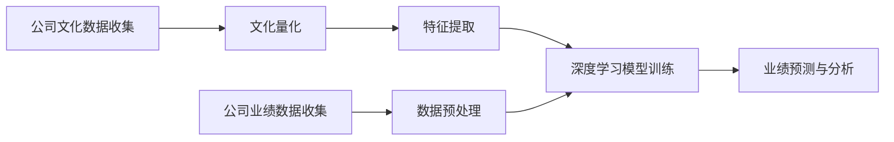

# 深度学习分析公司文化与业绩关系

> 关键词：深度学习、公司文化、公司业绩、数据分析、文化量化

> 摘要：本文旨在探讨如何运用深度学习技术来分析公司文化与业绩之间的关系。通过对公司文化的量化和业绩数据的收集，利用深度学习模型挖掘两者潜在的关联。文章详细介绍了核心概念、算法原理、数学模型，给出了项目实战案例，阐述了实际应用场景，推荐了相关工具和资源，最后对未来发展趋势与挑战进行了总结，并提供常见问题解答和扩展阅读资料。

## 1. 背景介绍 
### 1.1 目的和范围
目的在于借助深度学习强大的数据分析能力，深入探究公司文化这一抽象概念与公司业绩之间的内在联系。范围涵盖了不同行业、不同规模公司的文化与业绩数据，通过构建合适的深度学习模型，挖掘其中的规律和模式，为企业管理者提供决策依据，以优化公司文化建设，提升公司业绩。

### 1.2 预期读者
本文预期读者包括企业管理者、数据分析师、人工智能领域研究者以及对公司文化和业绩关系感兴趣的人士。企业管理者可以从中获取如何通过调整公司文化来提升业绩的思路；数据分析师可以学习到运用深度学习进行跨领域数据分析的方法；人工智能研究者可以在模型优化和应用方面得到启发；而对该领域感兴趣的人士则能了解到相关的理论和实践知识。

### 1.3 文档结构概述
本文首先介绍背景知识，包括目的、预期读者和文档结构。接着阐述核心概念，如公司文化、公司业绩以及它们与深度学习的联系，并给出相应的架构示意图和流程图。然后详细讲解核心算法原理和具体操作步骤，同时给出数学模型和公式，并举例说明。之后通过项目实战展示代码实现和详细解读。再介绍实际应用场景，推荐相关的工具和资源。最后总结未来发展趋势与挑战，提供常见问题解答和扩展阅读资料。

### 1.4 术语表
#### 1.4.1 核心术语定义
- **公司文化**：是指企业在长期的生产经营过程中所形成的价值观念、行为准则、经营理念等精神层面的总和，它影响着企业员工的行为和决策方式。
- **公司业绩**：是衡量企业经营成果的一系列指标，如销售额、利润率、市场份额等，反映了企业在市场中的竞争力和盈利能力。
- **深度学习**：是机器学习的一个分支，通过构建多层神经网络模型，自动从大量数据中学习特征和模式，以实现对数据的分类、预测等任务。

#### 1.4.2 相关概念解释
- **文化量化**：将抽象的公司文化转化为可度量的数据，以便进行数据分析和建模。
- **特征工程**：在数据分析过程中，从原始数据中提取有用的特征，以提高模型的性能和准确性。

#### 1.4.3 缩略词列表
- **DNN**：深度神经网络（Deep Neural Network）
- **LSTM**：长短期记忆网络（Long Short-Term Memory）

## 2. 核心概念与联系 

### 核心概念原理
公司文化是企业的灵魂，它潜移默化地影响着员工的工作态度和行为，进而对公司业绩产生影响。然而，公司文化是一个抽象的概念，难以直接进行量化和分析。深度学习则提供了一种强大的工具，通过对大量与公司文化和业绩相关的数据进行学习和分析，挖掘其中的潜在关系。

公司文化可以从多个维度进行量化，例如员工满意度、团队协作氛围、创新意识等。这些量化指标可以作为深度学习模型的输入特征。公司业绩则可以用具体的财务指标或市场指标来表示，作为模型的输出目标。

### 架构的文本示意图
```plaintext
输入层（公司文化量化指标）
|
|-- 特征提取层（提取文化特征）
|
|-- 深度学习模型层（如DNN、LSTM等）
|
|-- 输出层（公司业绩预测值）
```

### Mermaid流程图


## 3. 核心算法原理 & 具体操作步骤 

### 核心算法原理
这里我们选择深度神经网络（DNN）作为核心算法。DNN是一种多层的神经网络结构，由输入层、隐藏层和输出层组成。每个神经元接收前一层神经元的输出作为输入，经过加权求和和激活函数处理后，将结果传递给下一层神经元。

DNN的训练过程是通过反向传播算法来实现的。反向传播算法的核心思想是根据模型的输出与真实值之间的误差，从输出层开始，逐层反向计算每个神经元的梯度，然后根据梯度更新神经元的权重，以最小化误差。

### 具体操作步骤
1. **数据收集**：收集公司文化相关的数据，如员工调查问卷结果、团队协作记录等，以及公司业绩数据，如销售额、利润率等。
2. **数据预处理**：对收集到的数据进行清洗、归一化等处理，以提高数据的质量和模型的训练效果。
3. **特征提取**：从预处理后的数据中提取与公司文化和业绩相关的特征，如员工满意度得分、创新项目数量等。
4. **模型构建**：构建DNN模型，确定模型的层数、神经元数量、激活函数等参数。
5. **模型训练**：使用训练数据对DNN模型进行训练，通过反向传播算法更新模型的权重。
6. **模型评估**：使用测试数据对训练好的模型进行评估，计算模型的准确率、均方误差等指标。
7. **结果分析**：根据模型的评估结果，分析公司文化与业绩之间的关系，为企业决策提供依据。

### Python源代码详细阐述
```python
import numpy as np
import pandas as pd
from sklearn.preprocessing import StandardScaler
from sklearn.model_selection import train_test_split
from tensorflow.keras.models import Sequential
from tensorflow.keras.layers import Dense

# 数据收集和预处理
data = pd.read_csv('company_data.csv')  # 假设数据存储在CSV文件中
X = data.drop('performance', axis=1)  # 特征数据
y = data['performance']  # 业绩数据

scaler = StandardScaler()
X_scaled = scaler.fit_transform(X)

# 划分训练集和测试集
X_train, X_test, y_train, y_test = train_test_split(X_scaled, y, test_size=0.2, random_state=42)

# 构建DNN模型
model = Sequential()
model.add(Dense(64, activation='relu', input_shape=(X_train.shape[1],)))
model.add(Dense(32, activation='relu'))
model.add(Dense(1))

# 编译模型
model.compile(optimizer='adam', loss='mse')

# 模型训练
model.fit(X_train, y_train, epochs=100, batch_size=32, validation_data=(X_test, y_test))

# 模型评估
loss = model.evaluate(X_test, y_test)
print(f'Test loss: {loss}')

# 预测
predictions = model.predict(X_test)
```

## 4. 数学模型和公式 & 详细讲解 & 举例说明 

### 数学模型
在深度神经网络中，每个神经元的输出可以用以下公式表示：
$$z_j = \sum_{i=1}^{n} w_{ij}x_i + b_j$$
$$a_j = f(z_j)$$
其中，$z_j$ 是神经元 $j$ 的加权输入，$w_{ij}$ 是输入 $x_i$ 到神经元 $j$ 的权重，$b_j$ 是神经元 $j$ 的偏置，$a_j$ 是神经元 $j$ 的输出，$f$ 是激活函数。

### 损失函数
在训练DNN模型时，我们使用均方误差（MSE）作为损失函数，其公式为：
$$MSE = \frac{1}{m} \sum_{i=1}^{m} (y_i - \hat{y}_i)^2$$
其中，$m$ 是样本数量，$y_i$ 是真实值，$\hat{y}_i$ 是模型的预测值。

### 反向传播算法
反向传播算法的核心是计算损失函数对每个权重和偏置的梯度。以一个简单的两层神经网络为例，假设损失函数为 $L$，输出层的误差为 $\delta^2$，隐藏层的误差为 $\delta^1$，则权重和偏置的更新公式为：
$$\Delta w_{ij}^2 = \alpha \delta_j^2 a_i^1$$
$$\Delta b_j^2 = \alpha \delta_j^2$$
$$\delta_j^1 = \sum_{k=1}^{n_2} \delta_k^2 w_{jk}^2 f'(z_j^1)$$
$$\Delta w_{ij}^1 = \alpha \delta_j^1 x_i$$
$$\Delta b_j^1 = \alpha \delta_j^1$$
其中，$\alpha$ 是学习率，$n_2$ 是输出层神经元数量，$f'$ 是激活函数的导数。

### 举例说明
假设我们有一个简单的数据集，包含3个特征和1个目标值。我们构建一个两层的DNN模型，输入层有3个神经元，隐藏层有4个神经元，输出层有1个神经元。激活函数使用ReLU函数。

```python
import numpy as np

# 定义激活函数和其导数
def relu(x):
    return np.maximum(0, x)

def relu_derivative(x):
    return np.where(x > 0, 1, 0)

# 初始化权重和偏置
w1 = np.random.randn(3, 4)
b1 = np.zeros((1, 4))
w2 = np.random.randn(4, 1)
b2 = np.zeros((1, 1))

# 输入数据
X = np.array([[1, 2, 3]])
y = np.array([[5]])

# 前向传播
z1 = np.dot(X, w1) + b1
a1 = relu(z1)
z2 = np.dot(a1, w2) + b2
y_pred = z2

# 计算损失
loss = ((y - y_pred) ** 2).mean()

# 反向传播
delta2 = 2 * (y_pred - y)
dw2 = np.dot(a1.T, delta2)
db2 = np.sum(delta2, axis=0, keepdims=True)

delta1 = np.dot(delta2, w2.T) * relu_derivative(z1)
dw1 = np.dot(X.T, delta1)
db1 = np.sum(delta1, axis=0, keepdims=True)

# 更新权重和偏置
learning_rate = 0.01
w2 -= learning_rate * dw2
b2 -= learning_rate * db2
w1 -= learning_rate * dw1
b1 -= learning_rate * db1

print(f'Loss: {loss}')
```

## 5. 项目实战：代码实际案例和详细解释说明 

### 5.1  开发环境搭建
- **操作系统**：推荐使用Windows 10、Linux（如Ubuntu）或macOS。
- **Python环境**：安装Python 3.7及以上版本。
- **深度学习框架**：安装TensorFlow和Keras，可以使用以下命令进行安装：
```sh
pip install tensorflow keras
```
- **数据处理库**：安装Pandas和NumPy，用于数据处理和分析：
```sh
pip install pandas numpy
```
- **可视化库**：安装Matplotlib和Seaborn，用于数据可视化：
```sh
pip install matplotlib seaborn
```

### 5.2  源代码详细实现和代码解读
```python
import numpy as np
import pandas as pd
from sklearn.preprocessing import StandardScaler
from sklearn.model_selection import train_test_split
from tensorflow.keras.models import Sequential
from tensorflow.keras.layers import Dense
import matplotlib.pyplot as plt

# 数据加载
data = pd.read_csv('company_data.csv')

# 数据探索
print(data.head())
print(data.describe())

# 分离特征和目标
X = data.drop('performance', axis=1)
y = data['performance']

# 数据预处理
scaler = StandardScaler()
X_scaled = scaler.fit_transform(X)

# 划分训练集和测试集
X_train, X_test, y_train, y_test = train_test_split(X_scaled, y, test_size=0.2, random_state=42)

# 构建DNN模型
model = Sequential()
model.add(Dense(64, activation='relu', input_shape=(X_train.shape[1],)))
model.add(Dense(32, activation='relu'))
model.add(Dense(1))

# 编译模型
model.compile(optimizer='adam', loss='mse')

# 模型训练
history = model.fit(X_train, y_train, epochs=100, batch_size=32, validation_data=(X_test, y_test))

# 模型评估
loss = model.evaluate(X_test, y_test)
print(f'Test loss: {loss}')

# 预测
predictions = model.predict(X_test)

# 可视化训练过程
plt.plot(history.history['loss'], label='Training Loss')
plt.plot(history.history['val_loss'], label='Validation Loss')
plt.xlabel('Epochs')
plt.ylabel('Loss')
plt.legend()
plt.show()
```

### 代码解读与分析
1. **数据加载和探索**：使用Pandas库读取CSV文件，并查看数据的基本信息和统计描述。
2. **数据预处理**：使用StandardScaler对特征数据进行归一化处理，以提高模型的训练效果。
3. **数据集划分**：使用train_test_split函数将数据集划分为训练集和测试集，比例为8:2。
4. **模型构建**：使用Keras的Sequential模型构建一个简单的DNN模型，包含一个输入层、两个隐藏层和一个输出层。
5. **模型编译**：使用adam优化器和均方误差（MSE）损失函数编译模型。
6. **模型训练**：使用fit方法对模型进行训练，并记录训练过程中的损失值。
7. **模型评估**：使用evaluate方法对模型进行评估，计算测试集上的损失值。
8. **预测**：使用predict方法对测试集进行预测。
9. **可视化**：使用Matplotlib库绘制训练过程中的损失曲线，以便观察模型的训练效果。

## 6. 实际应用场景 
### 企业战略规划
通过深度学习分析公司文化与业绩的关系，企业管理者可以制定更加符合公司文化的战略规划。例如，如果分析结果表明创新文化与公司业绩呈正相关，企业可以加大在研发和创新方面的投入，鼓励员工提出新的想法和建议。

### 企业文化建设
了解公司文化对业绩的影响后，企业可以有针对性地进行文化建设。例如，如果发现团队协作文化对业绩有重要影响，企业可以组织更多的团队建设活动，加强员工之间的沟通和协作。

### 人才招聘和培养
在人才招聘和培养过程中，企业可以根据公司文化与业绩的关系，选拔和培养符合公司文化的人才。例如，如果公司强调创新文化，在招聘时可以注重应聘者的创新能力和思维方式。

### 绩效评估
将公司文化因素纳入绩效评估体系中，使绩效评估更加全面和客观。例如，除了考虑员工的工作业绩外，还可以评估员工对公司文化的认同和践行程度。

## 7. 工具和资源推荐
### 7.1 学习资源推荐
#### 7.1.1 书籍推荐
- 《深度学习》（Deep Learning）：由Ian Goodfellow、Yoshua Bengio和Aaron Courville所著，是深度学习领域的经典教材，涵盖了深度学习的基本概念、算法和应用。
- 《Python深度学习》（Deep Learning with Python）：由Francois Chollet所著，以Keras框架为例，详细介绍了深度学习的实践方法。
- 《数据挖掘：概念与技术》（Data Mining: Concepts and Techniques）：由Jiawei Han、Jian Pei和Jianwen Yin所著，介绍了数据挖掘的基本概念、算法和应用，对理解数据预处理和特征工程有很大帮助。

#### 7.1.2 在线课程
- Coursera上的“深度学习专项课程”（Deep Learning Specialization）：由Andrew Ng教授授课，涵盖了深度学习的多个方面，包括神经网络、卷积神经网络、循环神经网络等。
- edX上的“人工智能导论”（Introduction to Artificial Intelligence）：介绍了人工智能的基本概念、算法和应用，对深度学习的入门有很大帮助。
- 网易云课堂上的“Python深度学习实战”：通过实际案例介绍了Python和深度学习框架的使用方法。

#### 7.1.3 技术博客和网站
- Medium：有很多关于深度学习和数据分析的技术博客，如Towards Data Science等。
- Kaggle：是一个数据科学竞赛平台，上面有很多优秀的数据分析和机器学习项目，可以学习到很多实践经验。
- 深度学习中文社区：提供了深度学习领域的最新技术文章、教程和资源。

### 7.2 开发工具框架推荐
#### 7.2.1 IDE和编辑器
- PyCharm：是一款专业的Python集成开发环境，提供了代码编辑、调试、版本控制等功能。
- Jupyter Notebook：是一个交互式的笔记本环境，适合进行数据分析和模型开发。
- Visual Studio Code：是一款轻量级的代码编辑器，支持多种编程语言和插件扩展。

#### 7.2.2 调试和性能分析工具
- TensorBoard：是TensorFlow的可视化工具，可以用于查看模型的训练过程、损失曲线、梯度分布等信息。
- PyTorch Profiler：是PyTorch的性能分析工具，可以用于分析模型的运行时间、内存使用等情况。
- cProfile：是Python的内置性能分析工具，可以用于分析Python代码的运行时间和函数调用情况。

#### 7.2.3 相关框架和库
- TensorFlow：是一个开源的深度学习框架，由Google开发，提供了丰富的深度学习模型和工具。
- PyTorch：是一个开源的深度学习框架，由Facebook开发，具有动态图的特点，适合进行快速开发和实验。
- Scikit-learn：是一个开源的机器学习库，提供了丰富的机器学习算法和工具，如数据预处理、模型选择、评估等。

### 7.3 相关论文著作推荐
#### 7.3.1 经典论文
- “Gradient-based learning applied to document recognition”：由Yann LeCun等人发表，介绍了卷积神经网络（CNN）在手写数字识别中的应用，是CNN领域的经典论文。
- “Long short-term memory”：由Sepp Hochreiter和Jürgen Schmidhuber发表，介绍了长短期记忆网络（LSTM）的原理和应用，是RNN领域的经典论文。
- “Attention Is All You Need”：由Ashish Vaswani等人发表，介绍了Transformer模型的原理和应用，是自然语言处理领域的重要突破。

#### 7.3.2 最新研究成果
- 在arXiv上可以搜索到深度学习领域的最新研究成果，如关于公司文化与业绩关系的数据分析、深度学习模型的优化等方面的论文。
- 各大顶级学术会议，如NeurIPS、ICML、CVPR等，也会发表深度学习领域的最新研究成果。

#### 7.3.3 应用案例分析
- 一些知名企业的官方博客会分享他们在深度学习应用方面的案例，如Google、Facebook、Microsoft等。
- 一些行业报告和研究机构的网站也会提供深度学习在不同行业的应用案例分析。

## 8. 总结：未来发展趋势与挑战
### 未来发展趋势
- **多模态数据融合**：未来的研究可能会融合更多类型的数据，如文本、图像、音频等，以更全面地分析公司文化与业绩的关系。
- **可解释性深度学习**：随着深度学习模型的复杂度不断增加，模型的可解释性变得越来越重要。未来的研究可能会注重开发可解释性的深度学习模型，以便企业管理者更好地理解模型的决策过程。
- **实时监测和预测**：利用深度学习技术实现对公司文化和业绩的实时监测和预测，帮助企业及时调整战略和文化建设方向。

### 挑战
- **数据质量和隐私问题**：收集高质量的公司文化和业绩数据是一个挑战，同时还需要保护数据的隐私和安全。
- **模型复杂度和计算资源**：深度学习模型通常比较复杂，需要大量的计算资源和时间进行训练。如何在有限的资源下提高模型的性能是一个挑战。
- **文化的多样性和动态性**：不同公司的文化具有多样性，而且公司文化也会随着时间的推移而发生变化。如何处理文化的多样性和动态性是一个挑战。

## 9. 附录：常见问题与解答
### 问题1：如何量化公司文化？
解答：可以通过员工调查问卷、员工行为数据、公司规章制度等方式来量化公司文化。例如，设计一份关于员工满意度、团队协作、创新意识等方面的调查问卷，根据员工的回答得分来量化公司文化的各个维度。

### 问题2：深度学习模型的训练时间过长怎么办？
解答：可以采取以下措施来缩短训练时间：
- 减少模型的复杂度，如减少层数、神经元数量等。
- 使用更高效的优化算法，如Adam、Adagrad等。
- 增加计算资源，如使用GPU进行训练。

### 问题3：如何评估深度学习模型的性能？
解答：可以使用以下指标来评估深度学习模型的性能：
- 均方误差（MSE）：用于回归问题，衡量模型预测值与真实值之间的平均误差。
- 准确率（Accuracy）：用于分类问题，衡量模型预测正确的样本数占总样本数的比例。
- 召回率（Recall）和精确率（Precision）：用于分类问题，衡量模型对正样本的识别能力和预测结果的准确性。

## 10. 扩展阅读 & 参考资料
### 扩展阅读
- 《企业文化必读12篇》：深入介绍了企业文化的理论和实践，对理解公司文化有很大帮助。
- 《卓有成效的管理者》：由彼得·德鲁克所著，介绍了管理者如何提高工作效率和业绩，与公司文化和业绩关系密切。

### 参考资料
- 相关学术期刊，如《管理世界》、《管理科学学报》等，发表了很多关于公司文化和业绩关系的研究论文。
- 行业报告，如麦肯锡、波士顿咨询等公司发布的关于企业管理和文化建设的报告。

作者：AI天才研究院/AI Genius Institute & 禅与计算机程序设计艺术 /Zen And The Art of Computer Programming