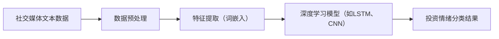

# 深度学习分析社交媒体投资情绪

> 关键词：深度学习、社交媒体、投资情绪分析、自然语言处理、金融市场

> 摘要：本文围绕深度学习分析社交媒体投资情绪展开，深入探讨了该领域的核心概念、算法原理、数学模型等内容。详细阐述了如何运用深度学习技术对社交媒体上的文本数据进行处理和分析，以挖掘其中蕴含的投资情绪。通过实际案例展示了开发环境搭建、代码实现与解读等过程，并分析了其在金融市场中的实际应用场景。同时，提供了丰富的学习资源、开发工具和相关论文推荐，最后对该领域的未来发展趋势与挑战进行了总结。

## 1. 背景介绍 
### 1.1 目的和范围
在当今数字化时代，社交媒体已经成为信息传播和交流的重要平台。大量投资者会在社交媒体上分享自己对金融市场、投资产品的看法和情绪。通过分析这些社交媒体数据中的投资情绪，可以帮助投资者更好地了解市场动态、预测市场走势，为投资决策提供有价值的参考。本文的目的是详细介绍如何利用深度学习技术对社交媒体投资情绪进行分析，范围涵盖了从核心概念的介绍、算法原理的讲解、实际案例的实现到应用场景的分析等多个方面。

### 1.2 预期读者
本文预期读者包括对深度学习、金融科技、自然语言处理等领域感兴趣的科研人员、开发者、投资者以及相关专业的学生。对于想要了解如何将深度学习技术应用于金融市场情绪分析的人员，本文提供了系统而深入的知识和实践指导。

### 1.3 文档结构概述
本文将按照以下结构展开：首先介绍核心概念与联系，包括相关概念的定义和架构示意图；接着阐述核心算法原理和具体操作步骤，并使用Python源代码进行详细说明；然后介绍数学模型和公式，并通过举例进行详细讲解；之后通过项目实战展示代码的实际案例和详细解释；再分析实际应用场景；接着推荐相关的工具和资源；最后总结未来发展趋势与挑战，并提供常见问题与解答以及扩展阅读和参考资料。

### 1.4 术语表
#### 1.4.1 核心术语定义
- **深度学习（Deep Learning）**：一种基于人工神经网络的机器学习方法，通过构建多层神经网络来学习数据的复杂特征和模式。
- **社交媒体（Social Media）**：允许用户创建、分享和交流内容的在线平台，如微博、推特、股吧等。
- **投资情绪（Investment Sentiment）**：投资者对金融市场、投资产品的积极或消极的情感倾向。
- **自然语言处理（Natural Language Processing，NLP）**：研究如何让计算机理解和处理人类语言的技术领域。

#### 1.4.2 相关概念解释
- **情感分析（Sentiment Analysis）**：自然语言处理的一个重要任务，旨在确定文本所表达的情感极性，如积极、消极或中性。在投资情绪分析中，就是要判断社交媒体文本中关于投资的情绪。
- **词嵌入（Word Embedding）**：将词语转换为向量表示的技术，使得语义相近的词语在向量空间中距离较近，有助于深度学习模型更好地理解文本语义。

#### 1.4.3 缩略词列表
- **NLP**：Natural Language Processing（自然语言处理）
- **RNN**：Recurrent Neural Network（循环神经网络）
- **LSTM**：Long Short-Term Memory（长短期记忆网络）
- **GRU**：Gated Recurrent Unit（门控循环单元）
- **CNN**：Convolutional Neural Network（卷积神经网络）

## 2. 核心概念与联系 

### 核心概念原理
深度学习分析社交媒体投资情绪主要涉及到自然语言处理和深度学习两个核心领域。自然语言处理用于对社交媒体文本进行预处理、特征提取等操作，将文本数据转换为计算机能够处理的形式。深度学习则用于构建模型，学习文本中的特征和模式，从而实现对投资情绪的分类。

具体来说，首先需要对社交媒体文本进行清洗，去除噪声数据，如表情符号、特殊字符等。然后进行分词操作，将文本拆分为一个个词语。接着使用词嵌入技术将词语转换为向量表示，构建文本的特征向量。最后，将特征向量输入到深度学习模型中进行训练和预测。

### 架构示意图


该示意图展示了深度学习分析社交媒体投资情绪的整体架构。从社交媒体获取文本数据后，先进行数据预处理，去除噪声和无用信息。然后通过特征提取将文本转换为向量表示，输入到深度学习模型中进行训练和预测，最终得到投资情绪的分类结果。

## 3. 核心算法原理 & 具体操作步骤 

### 核心算法原理
在深度学习分析社交媒体投资情绪中，常用的算法包括循环神经网络（RNN）及其变体长短期记忆网络（LSTM）、门控循环单元（GRU），以及卷积神经网络（CNN）。

#### RNN
RNN是一种能够处理序列数据的神经网络，它通过在时间步上循环传递信息来捕捉序列中的上下文信息。RNN的基本公式如下：
$$h_t = \tanh(W_{hh}h_{t - 1} + W_{xh}x_t + b_h)$$
$$y_t = W_{hy}h_t + b_y$$
其中，$x_t$ 是时间步 $t$ 的输入向量，$h_t$ 是时间步 $t$ 的隐藏状态向量，$y_t$ 是时间步 $t$ 的输出向量，$W_{hh}$、$W_{xh}$、$W_{hy}$ 是权重矩阵，$b_h$、$b_y$ 是偏置向量。

#### LSTM
LSTM是为了解决RNN的梯度消失问题而提出的，它通过引入门控机制来控制信息的流动。LSTM的主要门包括输入门 $i_t$、遗忘门 $f_t$、输出门 $o_t$ 和细胞状态 $C_t$，其计算公式如下：
$$i_t = \sigma(W_{xi}x_t + W_{hi}h_{t - 1} + b_i)$$
$$f_t = \sigma(W_{xf}x_t + W_{hf}h_{t - 1} + b_f)$$
$$o_t = \sigma(W_{xo}x_t + W_{ho}h_{t - 1} + b_o)$$
$$\tilde{C}_t = \tanh(W_{xc}x_t + W_{hc}h_{t - 1} + b_c)$$
$$C_t = f_t \odot C_{t - 1} + i_t \odot \tilde{C}_t$$
$$h_t = o_t \odot \tanh(C_t)$$
其中，$\sigma$ 是 sigmoid 函数，$\odot$ 表示逐元素相乘。

#### GRU
GRU是另一种改进的循环神经网络，它简化了LSTM的结构，只有更新门 $z_t$ 和重置门 $r_t$。其计算公式如下：
$$z_t = \sigma(W_{xz}x_t + W_{hz}h_{t - 1} + b_z)$$
$$r_t = \sigma(W_{xr}x_t + W_{hr}h_{t - 1} + b_r)$$
$$\tilde{h}_t = \tanh(W_{xh}x_t + r_t \odot W_{hh}h_{t - 1} + b_h)$$
$$h_t = (1 - z_t) \odot h_{t - 1} + z_t \odot \tilde{h}_t$$

#### CNN
CNN最初主要用于图像识别，在自然语言处理中也有广泛应用。CNN通过卷积层提取文本的局部特征，然后通过池化层对特征进行降维。卷积层的计算公式如下：
$$c_i = f(W \cdot x_{i:i + k - 1} + b)$$
其中，$x_{i:i + k - 1}$ 是输入文本的第 $i$ 到第 $i + k - 1$ 个词向量，$W$ 是卷积核，$b$ 是偏置，$f$ 是激活函数。

### 具体操作步骤
#### 步骤1：数据收集
从社交媒体平台上收集与投资相关的文本数据，可以使用API接口或网络爬虫技术。

#### 步骤2：数据预处理
- 去除噪声数据，如表情符号、特殊字符等。
- 进行分词操作，将文本拆分为一个个词语。
- 去除停用词，如“的”、“是”等无实际意义的词语。

#### 步骤3：特征提取
使用词嵌入技术将词语转换为向量表示，常用的词嵌入方法有Word2Vec、GloVe等。

#### 步骤4：模型构建与训练
选择合适的深度学习模型，如LSTM、CNN等，进行模型构建和训练。

#### 步骤5：模型评估与优化
使用测试数据集对模型进行评估，根据评估结果对模型进行优化，如调整超参数等。

#### 步骤6：预测与应用
使用训练好的模型对新的社交媒体文本进行投资情绪预测，并将结果应用于投资决策等场景。

### Python源代码实现
以下是一个使用Keras库实现基于LSTM的社交媒体投资情绪分析的示例代码：
```python
import numpy as np
from keras.preprocessing.text import Tokenizer
from keras.preprocessing.sequence import pad_sequences
from keras.models import Sequential
from keras.layers import Embedding, LSTM, Dense

# 示例数据
texts = ["这只股票肯定会涨，赶紧买入！", "这只股票太垃圾了，赶紧卖出！", "市场行情不太好，先观望一下。"]
labels = [1, 0, 0]  # 1表示积极情绪，0表示消极情绪

# 数据预处理
tokenizer = Tokenizer()
tokenizer.fit_on_texts(texts)
sequences = tokenizer.texts_to_sequences(texts)
max_length = max([len(seq) for seq in sequences])
padded_sequences = pad_sequences(sequences, maxlen=max_length)

# 构建模型
model = Sequential()
model.add(Embedding(input_dim=len(tokenizer.word_index) + 1, output_dim=100, input_length=max_length))
model.add(LSTM(128))
model.add(Dense(1, activation='sigmoid'))

# 编译模型
model.compile(optimizer='adam', loss='binary_crossentropy', metrics=['accuracy'])

# 训练模型
model.fit(padded_sequences, np.array(labels), epochs=10, batch_size=1)

# 预测新数据
new_texts = ["这只股票前景不错，值得投资。"]
new_sequences = tokenizer.texts_to_sequences(new_texts)
new_padded_sequences = pad_sequences(new_sequences, maxlen=max_length)
predictions = model.predict(new_padded_sequences)
print(predictions)
```
### 代码解释
- **数据预处理**：使用 `Tokenizer` 对文本进行分词和编码，将文本转换为序列。使用 `pad_sequences` 对序列进行填充，使其长度一致。
- **模型构建**：使用 `Sequential` 构建一个简单的神经网络模型，包含一个嵌入层、一个LSTM层和一个全连接层。
- **模型编译**：使用 `adam` 优化器和 `binary_crossentropy` 损失函数进行模型编译。
- **模型训练**：使用 `fit` 方法对模型进行训练。
- **预测**：使用训练好的模型对新的文本进行预测。

## 4. 数学模型和公式 & 详细讲解 & 举例说明 

### 词嵌入模型
词嵌入是将词语转换为向量表示的技术，常用的词嵌入模型有Word2Vec和GloVe。

#### Word2Vec
Word2Vec有两种训练模式：连续词袋模型（CBOW）和跳字模型（Skip-gram）。

##### CBOW
CBOW模型的目标是根据上下文词语预测中心词语。其数学模型可以表示为：
$$P(w_O|w_{I_1}, w_{I_2}, \cdots, w_{I_{2c}}) = \frac{\exp(u_{w_O}^T v_{w_{I}})}{\sum_{w = 1}^V \exp(u_w^T v_{w_{I}})}$$
其中，$w_O$ 是中心词语，$w_{I_1}, w_{I_2}, \cdots, w_{I_{2c}}$ 是上下文词语，$v_{w_{I}}$ 是上下文词语的向量表示，$u_{w_O}$ 是中心词语的向量表示，$V$ 是词汇表的大小。

##### Skip-gram
Skip-gram模型的目标是根据中心词语预测上下文词语。其数学模型可以表示为：
$$P(w_{I_i}|w_O) = \frac{\exp(u_{w_{I_i}}^T v_{w_O})}{\sum_{w = 1}^V \exp(u_w^T v_{w_O})}$$

#### GloVe
GloVe模型基于词语的共现矩阵进行训练，其目标函数为：
$$J = \sum_{i, j = 1}^V f(X_{ij})(u_i^T v_j + b_i + b_j - \log X_{ij})^2$$
其中，$X_{ij}$ 是词语 $i$ 和词语 $j$ 的共现次数，$u_i$ 和 $v_j$ 分别是词语 $i$ 和词语 $j$ 的向量表示，$b_i$ 和 $b_j$ 是偏置项，$f(X_{ij})$ 是权重函数。

### 深度学习模型损失函数
在投资情绪分析中，常用的损失函数是二元交叉熵损失函数，适用于二分类问题。其公式如下：
$$L(y, \hat{y}) = - \frac{1}{N} \sum_{i = 1}^N [y_i \log(\hat{y}_i) + (1 - y_i) \log(1 - \hat{y}_i)]$$
其中，$y$ 是真实标签，$\hat{y}$ 是模型预测的概率，$N$ 是样本数量。

### 举例说明
假设我们有一个包含3个样本的数据集，真实标签 $y = [1, 0, 1]$，模型预测的概率 $\hat{y} = [0.8, 0.2, 0.9]$。则二元交叉熵损失函数的计算如下：
$$L(y, \hat{y}) = - \frac{1}{3} [(1 \times \log(0.8) + (1 - 1) \times \log(1 - 0.8)) + (0 \times \log(0.2) + (1 - 0) \times \log(1 - 0.2)) + (1 \times \log(0.9) + (1 - 1) \times \log(1 - 0.9))]$$
通过计算可以得到具体的损失值，损失值越小，说明模型的预测效果越好。

## 5. 项目实战：代码实际案例和详细解释说明 

### 5.1  开发环境搭建
#### 安装Python
首先需要安装Python，建议使用Python 3.6及以上版本。可以从Python官方网站（https://www.python.org/downloads/）下载安装包进行安装。

#### 安装深度学习框架
常用的深度学习框架有TensorFlow、PyTorch、Keras等。这里以Keras为例，使用以下命令进行安装：
```sh
pip install keras
```
同时，还需要安装相关的依赖库，如NumPy、Pandas等：
```sh
pip install numpy pandas
```

#### 安装自然语言处理库
安装NLTK、jieba等自然语言处理库：
```sh
pip install nltk jieba
```

### 5.2  源代码详细实现和代码解读
以下是一个完整的基于CNN的社交媒体投资情绪分析项目的代码示例：
```python
import numpy as np
import pandas as pd
from sklearn.model_selection import train_test_split
from keras.preprocessing.text import Tokenizer
from keras.preprocessing.sequence import pad_sequences
from keras.models import Sequential
from keras.layers import Embedding, Conv1D, GlobalMaxPooling1D, Dense

# 读取数据
data = pd.read_csv('social_media_investment_data.csv')
texts = data['text'].values
labels = data['label'].values

# 数据预处理
tokenizer = Tokenizer(num_words=10000)
tokenizer.fit_on_texts(texts)
sequences = tokenizer.texts_to_sequences(texts)
max_length = 100
padded_sequences = pad_sequences(sequences, maxlen=max_length)

# 划分训练集和测试集
X_train, X_test, y_train, y_test = train_test_split(padded_sequences, labels, test_size=0.2, random_state=42)

# 构建模型
model = Sequential()
model.add(Embedding(input_dim=10000, output_dim=100, input_length=max_length))
model.add(Conv1D(128, 5, activation='relu'))
model.add(GlobalMaxPooling1D())
model.add(Dense(1, activation='sigmoid'))

# 编译模型
model.compile(optimizer='adam', loss='binary_crossentropy', metrics=['accuracy'])

# 训练模型
model.fit(X_train, y_train, epochs=10, batch_size=32, validation_data=(X_test, y_test))

# 评估模型
loss, accuracy = model.evaluate(X_test, y_test)
print(f"Test Loss: {loss}, Test Accuracy: {accuracy}")
```
### 代码解读
- **数据读取**：使用 `pandas` 库读取包含社交媒体文本和投资情绪标签的CSV文件。
- **数据预处理**：使用 `Tokenizer` 对文本进行分词和编码，将文本转换为序列。使用 `pad_sequences` 对序列进行填充，使其长度一致。
- **划分训练集和测试集**：使用 `train_test_split` 函数将数据集划分为训练集和测试集。
- **模型构建**：使用 `Sequential` 构建一个简单的CNN模型，包含一个嵌入层、一个一维卷积层、一个全局最大池化层和一个全连接层。
- **模型编译**：使用 `adam` 优化器和 `binary_crossentropy` 损失函数进行模型编译。
- **模型训练**：使用 `fit` 方法对模型进行训练，并使用验证集进行验证。
- **模型评估**：使用 `evaluate` 方法对模型在测试集上的性能进行评估。

### 5.3  代码解读与分析
#### 模型架构分析
- **嵌入层**：将词语的索引转换为向量表示，有助于模型学习词语之间的语义关系。
- **卷积层**：通过卷积核提取文本的局部特征，不同的卷积核可以提取不同类型的特征。
- **全局最大池化层**：对卷积层的输出进行降维，提取最重要的特征。
- **全连接层**：将提取的特征映射到一个概率值，用于分类。

#### 超参数调整
在实际应用中，需要对模型的超参数进行调整，如卷积核的数量、卷积核的大小、学习率等，以提高模型的性能。可以使用网格搜索、随机搜索等方法进行超参数调优。

## 6. 实际应用场景 
### 投资者决策支持
投资者可以通过分析社交媒体投资情绪，了解市场上其他投资者对某只股票、基金等投资产品的看法和情绪。如果大多数投资者持积极情绪，可能意味着该投资产品具有较好的投资价值；反之，如果大多数投资者持消极情绪，则需要谨慎投资。

### 金融机构风险管理
金融机构可以利用社交媒体投资情绪分析技术，实时监测市场情绪的变化，及时发现潜在的风险。例如，当社交媒体上关于某家银行的负面情绪急剧增加时，金融机构可以提前采取措施，防范风险。

### 企业声誉管理
上市公司可以关注社交媒体上关于自身的投资情绪，了解投资者对公司的看法和评价。如果发现负面情绪较多，可以及时采取措施进行公关和沟通，改善公司的声誉。

### 市场趋势预测
通过对社交媒体投资情绪的长期分析，可以发现市场情绪的变化趋势，进而预测金融市场的走势。例如，当市场情绪从消极逐渐转向积极时，可能预示着市场即将迎来上涨行情。

## 7. 工具和资源推荐
### 7.1 学习资源推荐
#### 7.1.1 书籍推荐
- 《深度学习》（Deep Learning）：由Ian Goodfellow、Yoshua Bengio和Aaron Courville所著，是深度学习领域的经典教材，涵盖了深度学习的基本概念、算法和应用。
- 《Python自然语言处理》（Natural Language Processing with Python）：介绍了如何使用Python进行自然语言处理，包括文本预处理、词法分析、句法分析等内容。
- 《金融科技：框架与实践》：介绍了金融科技的各个领域，包括深度学习在金融市场中的应用。

#### 7.1.2 在线课程
- Coursera上的“深度学习专项课程”（Deep Learning Specialization）：由Andrew Ng教授主讲，系统地介绍了深度学习的理论和实践。
- edX上的“自然语言处理基础”（Foundations of Natural Language Processing）：提供了自然语言处理的基础知识和实践案例。

#### 7.1.3 技术博客和网站
- Medium：有许多关于深度学习、自然语言处理和金融科技的技术博客文章，可以从中获取最新的研究成果和实践经验。
- arXiv：是一个预印本服务器，提供了大量的学术论文，包括深度学习和金融领域的研究。

### 7.2 开发工具框架推荐
#### 7.2.1 IDE和编辑器
- PyCharm：是一款专门为Python开发设计的集成开发环境，提供了丰富的功能和插件，方便代码的编写、调试和管理。
- Jupyter Notebook：是一个交互式的开发环境，适合进行数据分析和模型实验，支持代码、文本和可视化的混合展示。

#### 7.2.2 调试和性能分析工具
- TensorBoard：是TensorFlow提供的可视化工具，可以用于查看模型的训练过程、损失曲线、准确率等信息，帮助调试和优化模型。
- PyTorch Profiler：是PyTorch提供的性能分析工具，可以分析模型的运行时间、内存使用情况等，找出性能瓶颈。

#### 7.2.3 相关框架和库
- TensorFlow：是一个开源的深度学习框架，提供了丰富的工具和库，支持各种深度学习模型的构建和训练。
- PyTorch：是另一个流行的深度学习框架，具有动态图的特点，易于使用和调试。
- NLTK：是Python中最常用的自然语言处理库，提供了丰富的工具和数据集，用于文本预处理、词法分析、句法分析等任务。
- jieba：是一个中文分词库，在中文自然语言处理中广泛使用。

### 7.3 相关论文著作推荐
#### 7.3.1 经典论文
- “Efficient Estimation of Word Representations in Vector Space”：介绍了Word2Vec模型的原理和训练方法。
- “GloVe: Global Vectors for Word Representation”：提出了GloVe词嵌入模型。
- “Convolutional Neural Networks for Sentence Classification”：介绍了如何使用卷积神经网络进行文本分类。

#### 7.3.2 最新研究成果
可以关注顶级学术会议和期刊，如NeurIPS、ICML、ACL等，获取深度学习和自然语言处理领域的最新研究成果。

#### 7.3.3 应用案例分析
可以参考一些金融科技领域的研究报告和案例分析，了解深度学习在社交媒体投资情绪分析中的实际应用效果和经验教训。

## 8. 总结：未来发展趋势与挑战
### 未来发展趋势
- **多模态数据融合**：未来的研究可能会将社交媒体上的文本数据与图像、视频等多模态数据进行融合，以更全面地分析投资情绪。
- **强化学习应用**：将强化学习技术应用于投资情绪分析，通过与市场环境的交互不断优化模型，提高投资决策的准确性。
- **实时分析与预测**：随着技术的发展，实现对社交媒体投资情绪的实时分析和预测将成为可能，为投资者提供更及时的决策支持。

### 挑战
- **数据质量问题**：社交媒体上的数据存在噪声、虚假信息等问题，如何提高数据的质量是一个挑战。
- **语义理解难题**：自然语言具有复杂性和歧义性，如何让深度学习模型更好地理解文本的语义是一个关键问题。
- **模型可解释性**：深度学习模型通常是黑盒模型，如何提高模型的可解释性，让投资者理解模型的决策依据，是需要解决的问题。

## 9. 附录：常见问题与解答
### 问题1：如何收集社交媒体数据？
可以使用社交媒体平台提供的API接口，如Twitter API、微博API等，获取公开的文本数据。也可以使用网络爬虫技术，但需要注意遵守相关法律法规和平台规定。

### 问题2：如何选择合适的深度学习模型？
需要根据具体的任务和数据特点进行选择。如果数据具有序列特征，如文本数据，可以选择RNN、LSTM、GRU等模型；如果需要提取局部特征，可以选择CNN模型。

### 问题3：如何评估模型的性能？
常用的评估指标包括准确率、精确率、召回率、F1值等。可以使用测试数据集对模型进行评估，计算这些指标的值。

### 问题4：如何处理数据不平衡问题？
可以采用过采样、欠采样、调整损失函数权重等方法来处理数据不平衡问题。

## 10. 扩展阅读 & 参考资料
- Goodfellow, I., Bengio, Y., & Courville, A. (2016). Deep Learning. MIT Press.
- Bird, S., Klein, E., & Loper, E. (2009). Natural Language Processing with Python. O'Reilly Media.
- 李航. (2012). 统计学习方法. 清华大学出版社.
- 社交媒体平台官方文档
- 相关学术会议和期刊论文

作者：AI天才研究院/AI Genius Institute & 禅与计算机程序设计艺术 /Zen And The Art of Computer Programming