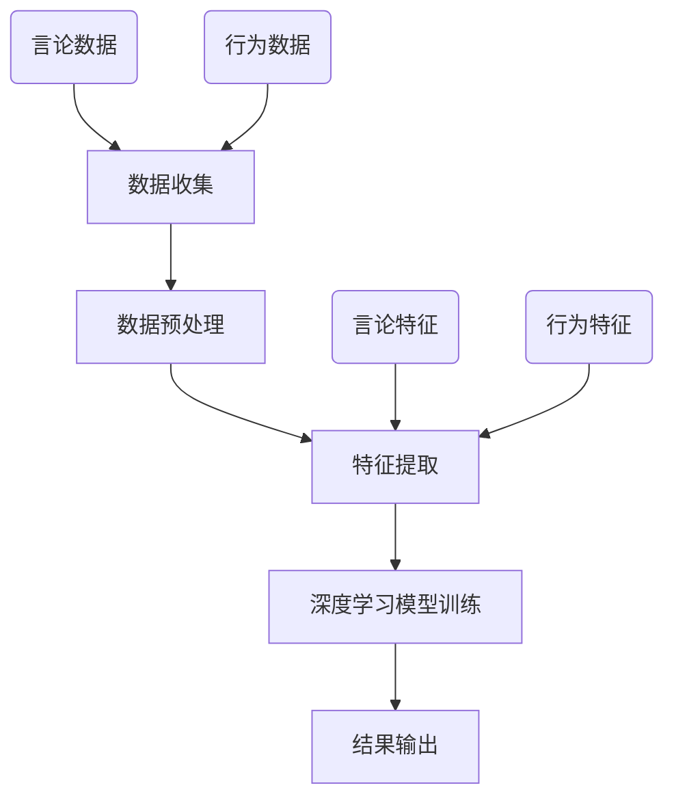

# 深度学习分析管理层言行一致性

> 关键词：深度学习、管理层言行一致性、自然语言处理、文本分析、情感分析、行为模式、机器学习算法

> 摘要：本文聚焦于利用深度学习技术来分析管理层言行一致性这一重要课题。首先介绍了研究背景，包括目的、预期读者、文档结构和相关术语。接着阐述了核心概念及联系，构建了清晰的理论架构。详细讲解了核心算法原理，通过Python代码示例进行说明，并给出了相关数学模型和公式。在项目实战部分，从开发环境搭建到源代码实现与解读，全面展示了如何运用深度学习技术开展分析工作。探讨了实际应用场景，为该技术的落地提供思路。推荐了一系列学习资源、开发工具框架和相关论文著作。最后总结了未来发展趋势与挑战，还提供了常见问题解答和扩展阅读参考资料，旨在为相关领域的研究和实践提供全面、深入的技术指导。

## 1. 背景介绍 
### 1.1 目的和范围
在当今复杂多变的商业环境中，管理层的言行一致性对于企业的稳定发展、员工的忠诚度以及企业的声誉都具有至关重要的影响。本研究的目的在于利用深度学习技术，对管理层的言论和行为进行系统、客观的分析，以评估其言行的一致性程度。

研究范围涵盖了各种企业场景下管理层的公开讲话、内部沟通信息以及实际决策和行动等数据。通过对这些数据的收集、整理和分析，旨在揭示管理层言行之间的潜在关系，为企业的管理优化、决策制定以及员工关系管理提供有价值的参考依据。

### 1.2 预期读者
本文的预期读者主要包括企业管理人员、人力资源专家、企业战略规划者、数据分析师以及对深度学习技术在商业领域应用感兴趣的研究人员和开发者。企业管理人员可以通过本文了解如何利用技术手段评估自身及团队的言行一致性，从而改进管理方式；人力资源专家可以借助相关分析结果优化员工关系管理和企业文化建设；数据分析师和开发者则可以从中获取技术实现的思路和方法，进一步探索深度学习在该领域的应用。

### 1.3 文档结构概述
本文将按照以下结构展开：首先介绍背景知识，包括研究目的、预期读者、文档结构和相关术语；接着阐述核心概念及联系，构建理论基础；详细讲解核心算法原理和具体操作步骤，并给出Python代码示例；介绍相关数学模型和公式，并举例说明；通过项目实战展示如何将理论应用于实际，包括开发环境搭建、源代码实现和代码解读；探讨实际应用场景；推荐学习资源、开发工具框架和相关论文著作；总结未来发展趋势与挑战；提供常见问题解答和扩展阅读参考资料。

### 1.4 术语表
#### 1.4.1 核心术语定义
- **深度学习**：一种基于人工神经网络的机器学习技术，通过构建多层神经网络模型，自动从大量数据中学习特征和模式，以实现对数据的分类、预测等任务。
- **管理层言行一致性**：指管理层在言语表达和实际行动中所体现出的理念、目标和价值观的相符程度。
- **自然语言处理（NLP）**：研究如何让计算机理解和处理人类语言的技术领域，包括文本分类、情感分析、命名实体识别等任务。
- **文本分析**：对文本数据进行处理和分析，以提取有价值信息的过程，如关键词提取、主题建模等。

#### 1.4.2 相关概念解释
- **情感分析**：自然语言处理的一个重要任务，旨在判断文本所表达的情感倾向，如积极、消极或中性。在分析管理层言行一致性时，情感分析可以帮助了解管理层言论和行为所传达的情感态度是否一致。
- **行为模式**：指管理层在一系列决策和行动中所表现出的相对稳定的方式和规律。通过对行为模式的分析，可以更好地理解管理层的实际行动与言论之间的关系。

#### 1.4.3 缩略词列表
- **NLP**：Natural Language Processing（自然语言处理）
- **CNN**：Convolutional Neural Network（卷积神经网络）
- **LSTM**：Long Short - Term Memory（长短期记忆网络）
- **RNN**：Recurrent Neural Network（循环神经网络）

## 2. 核心概念与联系 

### 核心概念原理
深度学习分析管理层言行一致性主要涉及自然语言处理和机器学习的相关技术。首先，需要对管理层的言论和行为数据进行收集和预处理。言论数据通常以文本形式存在，如演讲记录、报告等；行为数据可以是决策记录、业务操作数据等。

对于言论数据，利用自然语言处理技术进行文本分析，包括分词、词性标注、命名实体识别等操作，将文本转换为计算机能够处理的形式。然后，通过情感分析、主题建模等方法，提取言论的关键信息和情感倾向。

对于行为数据，需要进行特征工程，提取能够反映管理层行为模式的特征。例如，可以统计决策的频率、方向等特征。

最后，将言论和行为数据的特征进行整合，利用深度学习模型进行训练和分析。深度学习模型可以学习言论和行为之间的潜在关系，从而评估管理层言行的一致性。

### 架构的文本示意图
1. **数据收集层**：收集管理层的言论数据（如演讲、报告等文本信息）和行为数据（如决策记录、业务操作数据等）。
2. **数据预处理层**：对言论数据进行自然语言处理预处理，包括分词、词性标注、命名实体识别等；对行为数据进行特征工程，提取关键特征。
3. **特征提取层**：利用情感分析、主题建模等方法从言论数据中提取关键信息和情感倾向；从行为数据中提取反映行为模式的特征。
4. **深度学习模型层**：将言论和行为数据的特征进行整合，输入到深度学习模型（如CNN、LSTM等）中进行训练和分析。
5. **结果输出层**：输出管理层言行一致性的评估结果，如一致性得分、不一致的具体表现等。

### Mermaid 流程图


## 3. 核心算法原理 & 具体操作步骤 

### 核心算法原理
在深度学习分析管理层言行一致性中，常用的算法包括卷积神经网络（CNN）和长短期记忆网络（LSTM）。

#### 卷积神经网络（CNN）
CNN 是一种专门用于处理具有网格结构数据的神经网络，如图像、文本等。在文本分析中，CNN 可以自动提取文本的局部特征。其基本原理是通过卷积层对输入的文本进行卷积操作，提取文本中的特征。卷积层由多个卷积核组成，每个卷积核可以提取不同的特征。然后，通过池化层对卷积结果进行下采样，减少数据的维度，同时保留重要的特征信息。最后，通过全连接层将提取的特征进行整合，输出分类或预测结果。

#### 长短期记忆网络（LSTM）
LSTM 是一种特殊的循环神经网络（RNN），能够处理序列数据中的长期依赖关系。在分析管理层言行一致性时，言论和行为数据通常具有时间序列特征，LSTM 可以很好地捕捉这些特征。LSTM 通过门控机制来控制信息的流动，包括输入门、遗忘门和输出门。输入门决定哪些新的信息可以进入细胞状态；遗忘门决定哪些信息需要从细胞状态中遗忘；输出门决定哪些信息可以从细胞状态中输出。

### 具体操作步骤及 Python 源代码

#### 数据预处理
```python
import pandas as pd
import nltk
from nltk.corpus import stopwords
from nltk.tokenize import word_tokenize
from sklearn.preprocessing import LabelEncoder

# 下载停用词
nltk.download('stopwords')
nltk.download('punkt')

# 读取数据
data = pd.read_csv('management_data.csv')

# 言论数据预处理
def preprocess_text(text):
    # 转换为小写
    text = text.lower()
    # 分词
    tokens = word_tokenize(text)
    # 去除停用词
    stop_words = set(stopwords.words('english'))
    filtered_tokens = [token for token in tokens if token.isalpha() and token not in stop_words]
    return " ".join(filtered_tokens)

data['speech'] = data['speech'].apply(preprocess_text)

# 行为数据预处理
label_encoder = LabelEncoder()
data['action'] = label_encoder.fit_transform(data['action'])
```

#### 特征提取
```python
from sklearn.feature_extraction.text import TfidfVectorizer

# 言论数据特征提取
vectorizer = TfidfVectorizer()
speech_features = vectorizer.fit_transform(data['speech'])

# 行为数据特征
action_features = data['action'].values.reshape(-1, 1)
```

#### 构建深度学习模型（以 LSTM 为例）
```python
import tensorflow as tf
from tensorflow.keras.models import Sequential
from tensorflow.keras.layers import Embedding, LSTM, Dense

# 合并特征
import numpy as np
features = np.hstack((speech_features.toarray(), action_features))

# 划分训练集和测试集
from sklearn.model_selection import train_test_split
X_train, X_test, y_train, y_test = train_test_split(features, data['consistency_label'], test_size=0.2, random_state=42)

# 构建 LSTM 模型
model = Sequential()
model.add(Embedding(input_dim=features.shape[1], output_dim=128))
model.add(LSTM(128))
model.add(Dense(1, activation='sigmoid'))

# 编译模型
model.compile(optimizer='adam', loss='binary_crossentropy', metrics=['accuracy'])

# 训练模型
model.fit(X_train, y_train, epochs=10, batch_size=32, validation_data=(X_test, y_test))
```

## 4. 数学模型和公式 & 详细讲解 & 举例说明 

### 卷积神经网络（CNN）的数学模型和公式
#### 卷积操作
卷积操作是 CNN 的核心操作，其数学公式为：
$$
y_{i,j}^k = \sum_{m=0}^{M - 1}\sum_{n=0}^{N - 1}x_{i + m,j + n} \cdot w_{m,n}^k + b^k
$$
其中，$x$ 是输入数据，$w$ 是卷积核，$b$ 是偏置，$y$ 是卷积结果，$M$ 和 $N$ 是卷积核的大小，$k$ 表示第 $k$ 个卷积核。

例如，假设有一个输入矩阵 $x$ 为：
$$
x = \begin{bmatrix}
1 & 2 & 3 \\
4 & 5 & 6 \\
7 & 8 & 9
\end{bmatrix}
$$
卷积核 $w$ 为：
$$
w = \begin{bmatrix}
1 & 0 \\
0 & 1
\end{bmatrix}
$$
偏置 $b = 1$。则卷积结果 $y$ 为：
$$
y_{0,0} = x_{0,0} \cdot w_{0,0} + x_{0,1} \cdot w_{0,1} + x_{1,0} \cdot w_{1,0} + x_{1,1} \cdot w_{1,1} + b = 1 \cdot 1 + 2 \cdot 0 + 4 \cdot 0 + 5 \cdot 1 + 1 = 7
$$

#### 池化操作
池化操作通常用于减少数据的维度，常见的池化方法有最大池化和平均池化。最大池化的数学公式为：
$$
y_{i,j}^k = \max_{m,n \in \mathcal{R}} x_{i \cdot s + m,j \cdot s + n}^k
$$
其中，$\mathcal{R}$ 是池化窗口，$s$ 是步长。

### 长短期记忆网络（LSTM）的数学模型和公式
#### 遗忘门
遗忘门决定哪些信息需要从细胞状态中遗忘，其数学公式为：
$$
f_t = \sigma(W_f \cdot [h_{t - 1}, x_t] + b_f)
$$
其中，$f_t$ 是遗忘门的输出，$\sigma$ 是 sigmoid 函数，$W_f$ 是遗忘门的权重矩阵，$h_{t - 1}$ 是上一个时间步的隐藏状态，$x_t$ 是当前时间步的输入，$b_f$ 是遗忘门的偏置。

#### 输入门
输入门决定哪些新的信息可以进入细胞状态，其数学公式为：
$$
i_t = \sigma(W_i \cdot [h_{t - 1}, x_t] + b_i)
$$
$$
\tilde{C}_t = \tanh(W_C \cdot [h_{t - 1}, x_t] + b_C)
$$
其中，$i_t$ 是输入门的输出，$\tilde{C}_t$ 是候选细胞状态。

#### 细胞状态更新
细胞状态的更新公式为：
$$
C_t = f_t \odot C_{t - 1} + i_t \odot \tilde{C}_t
$$
其中，$\odot$ 表示逐元素相乘。

#### 输出门
输出门决定哪些信息可以从细胞状态中输出，其数学公式为：
$$
o_t = \sigma(W_o \cdot [h_{t - 1}, x_t] + b_o)
$$
$$
h_t = o_t \odot \tanh(C_t)
$$
其中，$o_t$ 是输出门的输出，$h_t$ 是当前时间步的隐藏状态。

## 5. 项目实战：代码实际案例和详细解释说明 

### 5.1  开发环境搭建
#### 安装 Python
首先，需要安装 Python 环境。可以从 Python 官方网站（https://www.python.org/downloads/） 下载适合自己操作系统的 Python 版本，并按照安装向导进行安装。

#### 安装依赖库
使用 pip 安装所需的依赖库，包括 pandas、nltk、sklearn、tensorflow 等。
```sh
pip install pandas nltk scikit-learn tensorflow
```

#### 下载数据集
准备一个包含管理层言论和行为数据的数据集，数据集可以是 CSV 格式，包含言论、行为和言行一致性标签等列。

### 5.2  源代码详细实现和代码解读
```python
import pandas as pd
import nltk
from nltk.corpus import stopwords
from nltk.tokenize import word_tokenize
from sklearn.preprocessing import LabelEncoder
from sklearn.feature_extraction.text import TfidfVectorizer
from sklearn.model_selection import train_test_split
import tensorflow as tf
from tensorflow.keras.models import Sequential
from tensorflow.keras.layers import Embedding, LSTM, Dense

# 下载停用词
nltk.download('stopwords')
nltk.download('punkt')

# 读取数据
data = pd.read_csv('management_data.csv')

# 言论数据预处理
def preprocess_text(text):
    # 转换为小写
    text = text.lower()
    # 分词
    tokens = word_tokenize(text)
    # 去除停用词
    stop_words = set(stopwords.words('english'))
    filtered_tokens = [token for token in tokens if token.isalpha() and token not in stop_words]
    return " ".join(filtered_tokens)

data['speech'] = data['speech'].apply(preprocess_text)

# 行为数据预处理
label_encoder = LabelEncoder()
data['action'] = label_encoder.fit_transform(data['action'])

# 言论数据特征提取
vectorizer = TfidfVectorizer()
speech_features = vectorizer.fit_transform(data['speech'])

# 行为数据特征
action_features = data['action'].values.reshape(-1, 1)

# 合并特征
import numpy as np
features = np.hstack((speech_features.toarray(), action_features))

# 划分训练集和测试集
X_train, X_test, y_train, y_test = train_test_split(features, data['consistency_label'], test_size=0.2, random_state=42)

# 构建 LSTM 模型
model = Sequential()
model.add(Embedding(input_dim=features.shape[1], output_dim=128))
model.add(LSTM(128))
model.add(Dense(1, activation='sigmoid'))

# 编译模型
model.compile(optimizer='adam', loss='binary_crossentropy', metrics=['accuracy'])

# 训练模型
model.fit(X_train, y_train, epochs=10, batch_size=32, validation_data=(X_test, y_test))
```
#### 代码解读
1. **数据读取**：使用 `pandas` 库读取 CSV 格式的数据集。
2. **言论数据预处理**：将言论文本转换为小写，进行分词操作，并去除停用词。
3. **行为数据预处理**：使用 `LabelEncoder` 对行为数据进行编码，将其转换为数值类型。
4. **特征提取**：使用 `TfidfVectorizer` 对言论数据进行特征提取，将行为数据转换为特征向量，并将两者合并。
5. **划分训练集和测试集**：使用 `train_test_split` 函数将数据集划分为训练集和测试集。
6. **构建 LSTM 模型**：使用 `Sequential` 模型构建 LSTM 网络，包括嵌入层、LSTM 层和全连接层。
7. **编译模型**：使用 `adam` 优化器和 `binary_crossentropy` 损失函数编译模型。
8. **训练模型**：使用训练集对模型