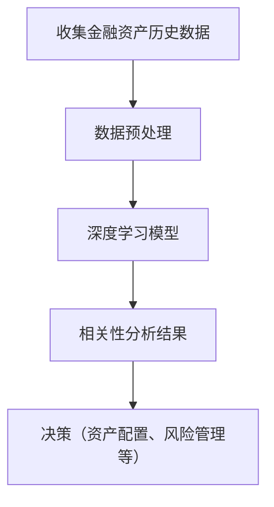

# 深度学习在金融资产相关性分析中的应用

> 关键词：深度学习、金融资产相关性分析、神经网络、时间序列、风险评估

> 摘要：本文深入探讨了深度学习在金融资产相关性分析中的应用。首先介绍了相关背景知识，包括目的、预期读者、文档结构和术语表。接着阐述了核心概念与联系，分析了深度学习模型在金融资产相关性分析中的原理和架构。详细讲解了核心算法原理，并给出Python代码示例。同时，介绍了相关的数学模型和公式，并举例说明。通过项目实战，展示了如何搭建开发环境、实现源代码并进行解读。还探讨了实际应用场景，推荐了学习资源、开发工具框架和相关论文著作。最后总结了未来发展趋势与挑战，提供了常见问题解答和扩展阅读参考资料，旨在为金融领域的从业者和研究者提供全面的技术指导。

## 1. 背景介绍 
### 1.1 目的和范围
在金融市场中，准确分析金融资产之间的相关性至关重要。它有助于投资者进行资产配置、风险管理和投资组合优化等决策。传统的相关性分析方法，如皮尔逊相关系数等，存在一定的局限性，难以捕捉金融数据中的复杂非线性关系。深度学习作为一种强大的机器学习技术，具有自动学习数据特征和模式的能力，能够挖掘金融资产数据中的潜在信息，为金融资产相关性分析提供更准确、更有效的方法。

本文的范围涵盖了深度学习在金融资产相关性分析中的各个方面，包括核心概念、算法原理、数学模型、项目实战、实际应用场景以及相关工具和资源推荐等。旨在帮助读者全面了解深度学习在该领域的应用，并能够将相关技术应用到实际的金融分析工作中。

### 1.2 预期读者
本文的预期读者包括金融领域的从业者，如投资经理、风险分析师、金融数据分析师等，他们希望借助深度学习技术提升金融资产相关性分析的准确性和效率。同时，也适合计算机科学和人工智能领域的研究者和开发者，他们对将深度学习应用于金融领域感兴趣，希望了解金融数据的特点和相关应用场景。此外，对于金融和技术交叉领域的学生和爱好者，本文也提供了一个系统学习深度学习在金融资产相关性分析中应用的资料。

### 1.3 文档结构概述
本文将按照以下结构进行组织：
- 核心概念与联系：介绍深度学习和金融资产相关性分析的核心概念，以及它们之间的联系，并通过文本示意图和Mermaid流程图进行展示。
- 核心算法原理 & 具体操作步骤：详细讲解深度学习在金融资产相关性分析中常用的算法原理，并给出Python源代码示例。
- 数学模型和公式 & 详细讲解 & 举例说明：介绍相关的数学模型和公式，并通过具体例子进行说明。
- 项目实战：通过一个实际的项目案例，展示如何搭建开发环境、实现源代码并进行解读。
- 实际应用场景：探讨深度学习在金融资产相关性分析中的实际应用场景。
- 工具和资源推荐：推荐学习资源、开发工具框架和相关论文著作。
- 总结：未来发展趋势与挑战：总结深度学习在金融资产相关性分析中的发展趋势和面临的挑战。
- 附录：常见问题与解答：提供常见问题的解答。
- 扩展阅读 & 参考资料：提供扩展阅读的建议和参考资料。

### 1.4 术语表
#### 1.4.1 核心术语定义
- **深度学习（Deep Learning）**：是一类基于人工神经网络的机器学习技术，通过构建多层神经网络模型，自动学习数据的特征和模式，以实现对数据的分类、预测等任务。
- **金融资产（Financial Assets）**：指一切代表未来收益或资产合法要求权的凭证，包括股票、债券、基金、期货等。
- **相关性分析（Correlation Analysis）**：研究两个或多个变量之间相互关系的统计方法，用于衡量变量之间的关联程度。
- **神经网络（Neural Network）**：由大量神经元组成的计算模型，模拟人类神经系统的信息处理方式，用于学习数据的特征和模式。
- **时间序列（Time Series）**：按时间顺序排列的一组数据，在金融领域中常用于分析资产价格的变化趋势。

#### 1.4.2 相关概念解释
- **非线性关系（Nonlinear Relationship）**：变量之间的关系不是简单的线性关系，无法用直线方程来描述。深度学习能够捕捉这种复杂的非线性关系。
- **过拟合（Overfitting）**：模型在训练数据上表现良好，但在测试数据上表现不佳的现象。在深度学习中，需要采取一些方法来防止过拟合，如正则化、早停等。
- **特征工程（Feature Engineering）**：对原始数据进行预处理和转换，提取有价值的特征，以提高模型的性能。在金融资产相关性分析中，特征工程包括对资产价格、交易量等数据的处理。

#### 1.4.3 缩略词列表
- **ANN（Artificial Neural Network）**：人工神经网络
- **RNN（Recurrent Neural Network）**：循环神经网络
- **LSTM（Long Short-Term Memory）**：长短期记忆网络
- **GRU（Gated Recurrent Unit）**：门控循环单元
- **CNN（Convolutional Neural Network）**：卷积神经网络

## 2. 核心概念与联系 

### 核心概念原理
#### 深度学习
深度学习是机器学习的一个分支，它通过构建多层神经网络来学习数据的特征和模式。神经网络由输入层、隐藏层和输出层组成，每层包含多个神经元。神经元之间通过权重连接，权重的大小决定了神经元之间的信息传递强度。在训练过程中，通过不断调整权重，使得模型的输出与真实标签之间的误差最小化。

#### 金融资产相关性分析
金融资产相关性分析旨在研究不同金融资产之间的关联程度。传统的相关性分析方法主要基于线性假设，如皮尔逊相关系数，它衡量的是两个变量之间的线性相关程度。然而，金融市场中的资产价格变化往往受到多种因素的影响，呈现出复杂的非线性关系。因此，需要更强大的方法来捕捉这些非线性关系，深度学习正是这样一种方法。

### 架构的文本示意图
深度学习在金融资产相关性分析中的架构可以描述如下：首先，收集金融资产的历史数据，包括价格、交易量等。然后，对数据进行预处理，如归一化、缺失值处理等。接着，将处理后的数据输入到深度学习模型中，如神经网络。模型通过学习数据的特征和模式，输出金融资产之间的相关性分析结果。最后，根据分析结果进行决策，如资产配置、风险管理等。

### Mermaid 流程图


## 3. 核心算法原理 & 具体操作步骤 

### 算法原理讲解
在金融资产相关性分析中，常用的深度学习算法包括循环神经网络（RNN）及其变体，如长短期记忆网络（LSTM）和门控循环单元（GRU），以及卷积神经网络（CNN）。下面以LSTM为例，介绍其原理。

LSTM是一种特殊的RNN，它能够解决传统RNN在处理长序列数据时的梯度消失问题。LSTM通过引入门控机制，控制信息的流动，从而能够更好地捕捉序列数据中的长期依赖关系。

LSTM单元包含三个门：输入门（$i_t$）、遗忘门（$f_t$）和输出门（$o_t$），以及一个细胞状态（$C_t$）。具体计算公式如下：

输入门：
$$i_t = \sigma(W_{ii}x_t + W_{hi}h_{t-1} + b_i)$$

遗忘门：
$$f_t = \sigma(W_{if}x_t + W_{hf}h_{t-1} + b_f)$$

输出门：
$$o_t = \sigma(W_{io}x_t + W_{ho}h_{t-1} + b_o)$$

候选细胞状态：
$$\tilde{C}_t = \tanh(W_{ic}x_t + W_{hc}h_{t-1} + b_c)$$

细胞状态更新：
$$C_t = f_t \odot C_{t-1} + i_t \odot \tilde{C}_t$$

隐藏状态更新：
$$h_t = o_t \odot \tanh(C_t)$$

其中，$x_t$ 是输入向量，$h_{t-1}$ 是上一时刻的隐藏状态，$W$ 是权重矩阵，$b$ 是偏置向量，$\sigma$ 是Sigmoid函数，$\tanh$ 是双曲正切函数，$\odot$ 表示逐元素相乘。

### Python源代码实现
```python
import numpy as np
import torch
import torch.nn as nn

# 定义LSTM模型
class LSTMModel(nn.Module):
    def __init__(self, input_size, hidden_size, num_layers, output_size):
        super(LSTMModel, self).__init__()
        self.hidden_size = hidden_size
        self.num_layers = num_layers
        self.lstm = nn.LSTM(input_size, hidden_size, num_layers, batch_first=True)
        self.fc = nn.Linear(hidden_size, output_size)

    def forward(self, x):
        h0 = torch.zeros(self.num_layers, x.size(0), self.hidden_size).to(x.device)
        c0 = torch.zeros(self.num_layers, x.size(0), self.hidden_size).to(x.device)
        out, _ = self.lstm(x, (h0, c0))
        out = self.fc(out[:, -1, :])
        return out

# 生成示例数据
input_size = 10
hidden_size = 20
num_layers = 2
output_size = 1
batch_size = 32
sequence_length = 5

x = torch.randn(batch_size, sequence_length, input_size)

# 初始化模型
model = LSTMModel(input_size, hidden_size, num_layers, output_size)

# 前向传播
output = model(x)
print(output.shape)
```

### 具体操作步骤
1. **数据准备**：收集金融资产的历史数据，并进行预处理，如归一化、划分训练集和测试集等。
2. **模型定义**：根据需求选择合适的深度学习模型，如LSTM，并定义模型的结构和参数。
3. **模型训练**：使用训练数据对模型进行训练，通过优化算法（如随机梯度下降）调整模型的权重，使得模型的损失函数最小化。
4. **模型评估**：使用测试数据对训练好的模型进行评估，计算评估指标（如均方误差、准确率等），评估模型的性能。
5. **相关性分析**：使用训练好的模型对金融资产之间的相关性进行分析，得到分析结果。

## 4. 数学模型和公式 & 详细讲解 & 举例说明 

### 数学模型和公式
#### 皮尔逊相关系数
皮尔逊相关系数是衡量两个变量之间线性相关程度的常用指标，其计算公式为：
$$r_{xy} = \frac{\sum_{i=1}^{n}(x_i - \bar{x})(y_i - \bar{y})}{\sqrt{\sum_{i=1}^{n}(x_i - \bar{x})^2 \sum_{i=1}^{n}(y_i - \bar{y})^2}}$$

其中，$x_i$ 和 $y_i$ 分别是变量 $x$ 和 $y$ 的第 $i$ 个观测值，$\bar{x}$ 和 $\bar{y}$ 分别是变量 $x$ 和 $y$ 的均值，$n$ 是观测值的数量。

#### 均方误差（MSE）
均方误差是衡量模型预测值与真实值之间误差的常用指标，其计算公式为：
$$MSE = \frac{1}{n} \sum_{i=1}^{n}(y_i - \hat{y}_i)^2$$

其中，$y_i$ 是真实值，$\hat{y}_i$ 是模型的预测值，$n$ 是样本数量。

### 详细讲解
#### 皮尔逊相关系数
皮尔逊相关系数的取值范围在 $[-1, 1]$ 之间。当 $r_{xy} = 1$ 时，表示两个变量之间存在完全正相关关系；当 $r_{xy} = -1$ 时，表示两个变量之间存在完全负相关关系；当 $r_{xy} = 0$ 时，表示两个变量之间不存在线性相关关系。

#### 均方误差
均方误差衡量的是模型预测值与真实值之间的平均平方误差。均方误差越小，说明模型的预测效果越好。

### 举例说明
假设我们有两个金融资产的价格序列 $x = [10, 12, 15, 13, 16]$ 和 $y = [20, 22, 25, 23, 26]$，我们可以计算它们之间的皮尔逊相关系数：

首先，计算均值：
$\bar{x} = \frac{10 + 12 + 15 + 13 + 16}{5} = 13.2$
$\bar{y} = \frac{20 + 22 + 25 + 23 + 26}{5} = 23.2$

然后，计算分子和分母：
分子：
$\sum_{i=1}^{5}(x_i - \bar{x})(y_i - \bar{y}) = (10 - 13.2)(20 - 23.2) + (12 - 13.2)(22 - 23.2) + (15 - 13.2)(25 - 23.2) + (13 - 13.2)(23 - 23.2) + (16 - 13.2)(26 - 23.2) = 20.8$

分母：
$\sqrt{\sum_{i=1}^{5}(x_i - \bar{x})^2 \sum_{i=1}^{5}(y_i - \bar{y})^2} = \sqrt{((10 - 13.2)^2 + (12 - 13.2)^2 + (15 - 13.2)^2 + (13 - 13.2)^2 + (16 - 13.2)^2) \times ((20 - 23.2)^2 + (22 - 23.2)^2 + (25 - 23.2)^2 + (23 - 23.2)^2 + (26 - 23.2)^2)} = 22.8$

最后，计算皮尔逊相关系数：
$r_{xy} = \frac{20.8}{22.8} \approx 0.91$

这表明两个金融资产的价格之间存在较强的正相关关系。

假设我们使用一个模型对 $y$ 进行预测，得到预测值 $\hat{y} = [21, 23, 24, 22, 25]$，我们可以计算均方误差：

$MSE = \frac{1}{5} \sum_{i=1}^{5}(y_i - \hat{y}_i)^2 = \frac{1}{5}((20 - 21)^2 + (22 - 23)^2 + (25 - 24)^2 + (23 - 22)^2 + (26 - 25)^2) = 0.8$

## 5. 项目实战：代码实际案例和详细解释说明 

### 5.1  开发环境搭建
#### 安装Python
首先，需要安装Python。建议使用Python 3.7及以上版本，可以从Python官方网站（https://www.python.org/downloads/）下载并安装。

#### 安装深度学习框架
本文使用PyTorch作为深度学习框架，可以使用以下命令安装：
```sh
pip install torch torchvision
```

#### 安装其他依赖库
还需要安装一些其他的依赖库，如NumPy、Pandas、Matplotlib等，可以使用以下命令安装：
```sh
pip install numpy pandas matplotlib
```

### 5.2  源代码详细实现和代码解读
```python
import numpy as np
import pandas as pd
import torch
import torch.nn as nn
import torch.optim as optim
from sklearn.preprocessing import MinMaxScaler
import matplotlib.pyplot as plt

# 读取数据
data = pd.read_csv('financial_assets.csv')
asset1 = data['asset1'].values.reshape(-1, 1)
asset2 = data['asset2'].values.reshape(-1, 1)

# 数据预处理
scaler1 = MinMaxScaler()
scaler2 = MinMaxScaler()
asset1_scaled = scaler1.fit_transform(asset1)
asset2_scaled = scaler2.fit_transform(asset2)

# 划分训练集和测试集
train_size = int(len(asset1_scaled) * 0.8)
train_asset1 = asset1_scaled[:train_size]
train_asset2 = asset2_scaled[:train_size]
test_asset1 = asset1_scaled[train_size:]
test_asset2 = asset2_scaled[train_size:]

# 准备训练数据
def create_sequences(data1, data2, seq_length):
    xs1, xs2, ys = [], [], []
    for i in range(len(data1) - seq_length):
        x1 = data1[i:i+seq_length]
        x2 = data2[i:i+seq_length]
        y = data2[i+seq_length]
        xs1.append(x1)
        xs2.append(x2)
        ys.append(y)
    return np.array(xs1), np.array(xs2), np.array(ys)

seq_length = 10
X_train1, X_train2, y_train = create_sequences(train_asset1, train_asset2, seq_length)
X_test1, X_test2, y_test = create_sequences(test_asset1, test_asset2, seq_length)

# 转换为PyTorch张量
X_train1 = torch.from_numpy(X_train1).float()
X_train2 = torch.from_numpy(X_train2).float()
y_train = torch.from_numpy(y_train).float()
X_test1 = torch.from_numpy(X_test1).float()
X_test2 = torch.from_numpy(X_test2).float()
y_test = torch.from_numpy(y_test).float()

# 定义LSTM模型
class LSTMModel(nn.Module):
    def __init__(self, input_size, hidden_size, num_layers, output_size):
        super(LSTMModel, self).__init__()
        self.hidden_size = hidden_size
        self.num_layers = num_layers
        self.lstm = nn.LSTM(input_size, hidden_size, num_layers, batch_first=True)
        self.fc = nn.Linear(hidden_size, output_size)

    def forward(self, x):
        h0 = torch.zeros(self.num_layers, x.size(0), self.hidden_size).to(x.device)
        c0 = torch.zeros(self.num_layers, x.size(0), self.hidden_size).to(x.device)
        out, _ = self.lstm(x, (h0, c0))
        out = self.fc(out[:, -1, :])
        return out

# 初始化模型
input_size = 1
hidden_size = 20
num_layers = 2
output_size = 1
model = LSTMModel(input_size, hidden_size, num_layers, output_size)

# 定义损失函数和优化器
criterion = nn.MSELoss()
optimizer = optim.Adam(model.parameters(), lr=0.001)

# 训练模型
num_epochs = 100
for epoch in range(num_epochs):
    outputs = model(X_train2)
    loss = criterion(outputs, y_train)

    optimizer.zero_grad()
    loss.backward()
    optimizer.step()

    if (epoch+1) % 10 == 0:
        print(f'Epoch [{epoch+1}/{num_epochs}], Loss: {loss.item():.4f}')

# 测试模型
model.eval()
with torch.no_grad():
    test_outputs = model(X_test2)
    test_loss = criterion(test_outputs, y_test)
    print(f'Test Loss: {test_loss.item():.4f}')

# 反归一化
test_outputs = scaler2.inverse_transform(test_outputs.numpy())
y_test = scaler2.inverse_transform(y_test.numpy())

# 绘制预测结果
plt.plot(y_test, label='Actual')
plt.plot(test_outputs, label='Predicted')
plt.xlabel('Time')
plt.ylabel('Asset Price')
plt.title('Financial Asset Price Prediction')
plt.legend()
plt.show()
```

### 5.3  代码解读与分析
1. **数据读取和预处理**：使用Pandas读取金融资产的历史数据，并使用MinMaxScaler对数据进行归一化处理，将数据缩放到 $[0, 1]$ 范围内。
2. **划分训练集和测试集**：将数据按照80%和20%的比例划分为训练集和测试集。
3. **准备训练数据**：定义 `create_sequences` 函数，将数据转换为适合LSTM模型输入的序列数据。
4. **定义LSTM模型**：定义一个LSTM模型，包含一个LSTM层和一个全连接层。
5. **定义损失函数和优化器**：使用均方误差（MSE）作为损失函数，使用Adam优化器进行模型训练。
6. **训练模型**：使用训练数据对模型进行训练，迭代100个epoch，每10个epoch打印一次损失值。
7. **测试模型**：使用测试数据对训练好的模型进行测试，计算测试损失值。
8. **反归一化和绘制预测结果**：将预测结果和真实值进行反归一化处理，并使用Matplotlib绘制预测结果和真实值的对比图。

## 6. 实际应用场景 
### 资产配置
通过分析金融资产之间的相关性，投资者可以合理配置资产，降低投资组合的风险。例如，如果两种资产之间的相关性较低，将它们同时纳入投资组合可以起到分散风险的作用。深度学习可以更准确地捕捉资产之间的复杂相关性，为资产配置提供更科学的依据。

### 风险管理
在金融风险管理中，准确评估资产之间的相关性至关重要。深度学习可以帮助金融机构更好地识别潜在的风险，如市场风险、信用风险等。通过分析资产之间的相关性变化，及时调整风险管理策略，降低风险损失。

### 投资组合优化
投资组合优化的目标是在给定风险水平下最大化投资回报。深度学习可以通过分析资产之间的相关性，优化投资组合的权重分配，提高投资组合的效率。例如，使用深度学习模型预测资产的未来收益和风险，然后根据预测结果调整投资组合的权重。

### 金融市场预测
深度学习可以通过分析金融资产之间的相关性，预测金融市场的走势。例如，通过分析股票、债券、期货等资产之间的相关性，预测股票市场的涨跌。这对于投资者和金融机构来说具有重要的参考价值。

## 7. 工具和资源推荐
### 7.1 学习资源推荐
#### 7.1.1 书籍推荐
- 《深度学习》（Deep Learning）：由Ian Goodfellow、Yoshua Bengio和Aaron Courville所著，是深度学习领域的经典教材，全面介绍了深度学习的基本概念、算法和应用。
- 《Python深度学习》（Deep Learning with Python）：由Francois Chollet所著，结合Keras框架，详细介绍了如何使用Python进行深度学习开发。
- 《金融时间序列分析》（Analysis of Financial Time Series）：由Ruey S. Tsay所著，介绍了金融时间序列的分析方法和模型，包括线性和非线性模型、波动率模型等。

#### 7.1.2 在线课程
- Coursera上的“深度学习专项课程”（Deep Learning Specialization）：由Andrew Ng教授授课，包括五门课程，全面介绍了深度学习的各个方面。
- edX上的“使用Python进行数据科学”（Data Science with Python）：介绍了使用Python进行数据科学和机器学习的方法和技术。
- Kaggle上的“深度学习微课程”（Deep Learning Micro-Course）：提供了深度学习的基础知识和实践经验，适合初学者。

#### 7.1.3 技术博客和网站
- Towards Data Science：是一个数据科学和机器学习领域的技术博客，提供了大量的技术文章和实践案例。
- Medium上的“深度学习”频道：汇集了深度学习领域的最新研究成果和技术文章。
- arXiv：是一个预印本平台，提供了大量的学术论文，包括深度学习在金融领域的应用研究。

### 7.2 开发工具框架推荐
#### 7.2.1 IDE和编辑器
- PyCharm：是一款专门为Python开发设计的集成开发环境（IDE），提供了丰富的功能和工具，如代码编辑、调试、版本控制等。
- Jupyter Notebook：是一个交互式的开发环境，适合进行数据分析和机器学习实验。可以在浏览器中编写和运行代码，同时可以添加文本说明和可视化图表。
- Visual Studio Code：是一款轻量级的代码编辑器，支持多种编程语言，包括Python。可以通过安装插件扩展其功能，如代码调试、代码格式化等。

#### 7.2.2 调试和性能分析工具
- PyTorch Profiler：是PyTorch提供的性能分析工具，可以帮助开发者分析模型的性能瓶颈，优化代码性能。
- TensorBoard：是TensorFlow提供的可视化工具，也可以用于PyTorch模型的可视化和调试。可以可视化模型的训练过程、损失函数曲线、参数分布等。
- cProfile：是Python内置的性能分析工具，可以帮助开发者分析代码的性能瓶颈，找出耗时较长的函数和代码段。

#### 7.2.3 相关框架和库
- PyTorch：是一个开源的深度学习框架，提供了丰富的神经网络层和优化算法，支持GPU加速。
- TensorFlow：是另一个流行的深度学习框架，由Google开发，提供了高级的API和分布式训练功能。
- Scikit-learn：是一个Python机器学习库，提供了各种机器学习算法和工具，如分类、回归、聚类等。
- Pandas：是一个Python数据处理库，提供了高效的数据结构和数据处理方法，适合处理金融数据。

### 7.3 相关论文著作推荐
#### 7.3.1 经典论文
- “Long Short-Term Memory”：由Sepp Hochreiter和Jürgen Schmidhuber发表，介绍了长短期记忆网络（LSTM）的原理和应用。
- “Gradient-based learning applied to document recognition”：由Yann LeCun、Léon Bottou、Yoshua Bengio和Patrick Haffner发表，介绍了卷积神经网络（CNN）在文档识别中的应用。
- “Efficient BackProp”：由Yoshua Bengio、Patrick Simard和Paolo Frasconi发表，介绍了神经网络的反向传播算法和优化方法。

#### 7.3.2 最新研究成果
- 在顶级学术会议（如NeurIPS、ICML、CVPR等）和学术期刊（如Journal of Financial Economics、Review of Financial Studies等）上搜索深度学习在金融资产相关性分析中的最新研究成果。
- arXiv上也有很多关于深度学习在金融领域应用的预印本论文，可以及时了解最新的研究动态。

#### 7.3.3 应用案例分析
- 一些金融机构和研究机构会发布深度学习在金融领域的应用案例分析报告，可以通过它们的官方网站或相关媒体获取。
- Kaggle上也有很多金融数据分析的竞赛和案例，可以学习其他参赛者的解决方案和经验。

## 8. 总结：未来发展趋势与挑战
### 未来发展趋势
- **多模态数据融合**：未来的研究可能会结合更多类型的数据，如文本数据、图像数据等，进行金融资产相关性分析。例如，通过分析新闻报道、社交媒体数据等文本信息，挖掘其中的情感和语义信息，与金融资产价格数据相结合，提高相关性分析的准确性。
- **强化学习应用**：强化学习可以用于金融资产的动态配置和交易决策。通过与环境进行交互，学习最优的投资策略，提高投资回报。未来可能会有更多的研究将强化学习应用于金融资产相关性分析和投资组合优化。
- **可解释性深度学习**：深度学习模型通常被视为“黑箱”，难以解释其决策过程。未来的研究将更加注重深度学习模型的可解释性，开发可解释的深度学习方法，让金融从业者更好地理解模型的决策依据，提高模型的可信度和实用性。
- **联邦学习**：在金融领域，数据隐私和安全是非常重要的问题。联邦学习可以在不共享原始数据的情况下，实现多个机构之间的模型训练和数据共享。未来可能会有更多的金融机构采用联邦学习技术进行金融资产相关性分析。

### 挑战
- **数据质量和数量**：金融数据通常存在噪声、缺失值等问题，需要进行大量的数据预处理工作。同时，金融数据的数量相对有限，可能会导致模型过拟合。如何提高数据质量和增加数据数量是一个挑战。
- **模型复杂度和计算资源**：深度学习模型通常比较复杂，需要大量的计算资源进行训练。在实际应用中，如何在有限的计算资源下训练高效的模型是一个挑战。
- **市场变化和不确定性**：金融市场是动态变化的，资产之间的相关性也会随着市场环境的变化而变化。如何让模型适应市场的变化，及时调整相关性分析结果是一个挑战。
- **监管和合规**：金融行业受到严格的监管，深度学习在金融领域的应用需要符合相关的监管要求和合规标准。如何确保模型的合法性和合规性是一个挑战。

## 9. 附录：常见问题与解答
### 问题1：深度学习在金融资产相关性分析中的优势是什么？
深度学习能够自动学习数据的特征和模式，捕捉金融数据中的复杂非线性关系，而传统的相关性分析方法（如皮尔逊相关系数）只能捕捉线性关系。因此，深度学习在金融资产相关性分析中具有更高的准确性和灵活性。

### 问题2：如何选择合适的深度学习模型进行金融资产相关性分析？
选择合适的深度学习模型需要考虑数据的特点和分析的目标。如果数据是时间序列数据，可以选择循环神经网络（RNN）及其变体，如LSTM和GRU；如果数据具有局部特征，可以选择卷积神经网络（CNN）。此外，还可以尝试不同的模型结构和参数，通过交叉验证等方法选择最优的模型。

### 问题3：如何解决深度学习模型在金融资产相关性分析中的过拟合问题？
可以采取以下方法解决过拟合问题：
- **增加数据量**：通过收集更多的金融数据，增加模型的训练样本，减少过拟合的风险。
- **正则化**：在模型的损失函数中添加正则化项，如L1和L2正则化，限制模型的复杂度。
- **早停**：在模型训练过程中，当验证集的损失不再下降时，停止训练，避免模型在训练集上过度拟合。
- **Dropout**：在神经网络中随机丢弃一些神经元，减少神经元之间的依赖关系，提高模型的泛化能力。

### 问题4：深度学习在金融资产相关性分析中的应用存在哪些风险？
深度学习在金融资产相关性分析中的应用存在以下风险：
- **模型风险**：深度学习模型可能存在过拟合、欠拟合等问题，导致模型的预测结果不准确。
- **数据风险**：金融数据可能存在噪声、缺失值等问题，影响模型的性能。此外，数据的质量和数量也可能不足，导致模型无法学习到有效的特征和模式。
- **市场风险**：金融市场是动态变化的，资产之间的相关性也会随着市场环境的变化而变化。深度学习模型可能无法及时适应市场的变化，导致分析结果不准确。
- **合规风险**：金融行业受到严格的监管，深度学习在金融领域的应用需要符合相关的监管要求和合规标准。如果模型的应用不符合规定，可能会面临法律风险。

## 10. 扩展阅读 & 参考资料
### 扩展阅读
- 《金融机器学习》（Machine Learning for Finance）：介绍了机器学习在金融领域的应用，包括风险管理、投资组合优化、交易策略等方面。
- 《人工智能时代的金融科技》（Fintech in the Age of Artificial Intelligence）：探讨了人工智能和金融科技的融合，以及它们对金融行业的影响。
- 《数据驱动的金融风险管理》（Data-Driven Financial Risk Management）：介绍了如何使用数据和机器学习方法进行金融风险管理。

### 参考资料
- Goodfellow, I., Bengio, Y., & Courville, A. (2016). Deep Learning. MIT Press.
- Chollet, F. (2017). Deep Learning with Python. Manning Publications.
- Tsay, R. S. (2014). Analysis of Financial Time Series. Wiley.
- Hochreiter, S., & Schmidhuber, J. (1997). Long Short-Term Memory. Neural Computation, 9(8), 1735-1780.
- LeCun, Y., Bottou, L., Bengio, Y., & Haffner, P. (1998). Gradient-based learning applied to document recognition. Proceedings of the IEEE, 86(11), 2278-2324.
- Bengio, Y., Simard, P., & Frasconi, P. (1994). Efficient BackProp. In Y. Chauvin & D. E. Rumelhart (Eds.), BackPropagation: Theory, Architectures, and Applications (pp. 9-50). Lawrence Erlbaum Associates.

作者：AI天才研究院/AI Genius Institute & 禅与计算机程序设计艺术 /Zen And The Art of Computer Programming