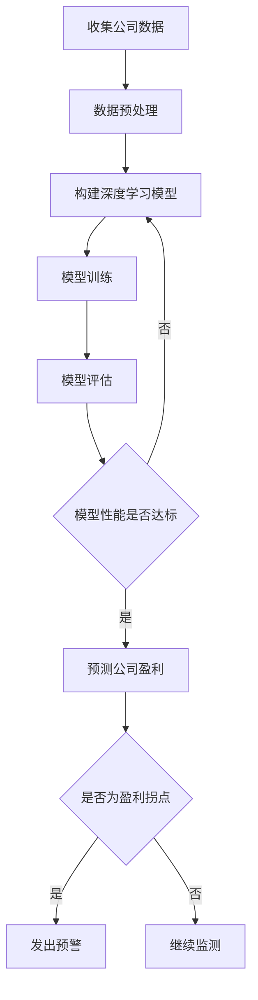

# 深度学习预测公司盈利拐点

> 关键词：深度学习、公司盈利拐点、预测模型、神经网络、金融分析

> 摘要：本文聚焦于利用深度学习技术预测公司盈利拐点。详细阐述了深度学习在金融领域的应用背景，深入剖析了核心概念与联系，包括相关模型架构和原理。通过具体的Python代码展示了核心算法原理和操作步骤，运用数学模型和公式进行理论支撑。提供了项目实战案例，涵盖开发环境搭建、源代码实现及解读。探讨了深度学习预测公司盈利拐点在实际金融场景中的应用，推荐了学习资源、开发工具框架和相关论文著作。最后总结了该领域的未来发展趋势与挑战，并给出常见问题解答和参考资料，旨在为相关研究和实践提供全面的技术指导。

## 1. 背景介绍 
### 1.1 目的和范围
在当今复杂多变的商业环境中，准确预测公司的盈利拐点对于投资者、管理者和金融分析师来说至关重要。盈利拐点的出现往往标志着公司经营状况的重大转变，可能带来巨大的投资机会或风险。本研究的目的是利用深度学习技术构建一个有效的预测模型，通过对公司的历史财务数据、市场数据等多源信息进行分析，提前预测公司盈利拐点的出现。

本研究的范围主要包括以下几个方面：
- 数据收集与预处理：收集与公司盈利相关的各类数据，并进行清洗、转换和特征工程处理。
- 深度学习模型选择与构建：选择适合预测公司盈利拐点的深度学习模型，如神经网络、循环神经网络等，并进行模型的训练和优化。
- 模型评估与验证：使用合适的评估指标对模型的性能进行评估，并通过交叉验证等方法验证模型的稳定性和可靠性。
- 实际应用与案例分析：将构建好的模型应用于实际的公司盈利预测中，并进行案例分析，验证模型的实际效果。

### 1.2 预期读者
本文的预期读者主要包括以下几类人群：
- 金融从业者：如投资者、基金经理、金融分析师等，他们可以通过本文了解如何利用深度学习技术预测公司盈利拐点，为投资决策提供参考。
- 数据科学家和机器学习工程师：他们可以从本文中获取关于深度学习在金融领域应用的具体案例和技术实现细节，为自己的研究和实践提供借鉴。
- 企业管理者：他们可以通过了解公司盈利拐点的预测方法，更好地掌握公司的经营状况，制定合理的发展战略。
- 学术研究人员：他们可以将本文作为研究深度学习在金融领域应用的参考资料，开展相关的学术研究。

### 1.3 文档结构概述
本文将按照以下结构进行组织：
- 背景介绍：介绍研究的目的、范围和预期读者，以及文档的结构概述。
- 核心概念与联系：阐述深度学习、公司盈利拐点等核心概念，并分析它们之间的联系，同时给出相关的文本示意图和Mermaid流程图。
- 核心算法原理 & 具体操作步骤：详细讲解用于预测公司盈利拐点的深度学习算法原理，并使用Python源代码展示具体的操作步骤。
- 数学模型和公式 & 详细讲解 & 举例说明：介绍预测模型所涉及的数学模型和公式，并进行详细讲解，通过具体的例子说明其应用。
- 项目实战：代码实际案例和详细解释说明：提供一个完整的项目实战案例，包括开发环境搭建、源代码详细实现和代码解读。
- 实际应用场景：探讨深度学习预测公司盈利拐点在实际金融场景中的应用。
- 工具和资源推荐：推荐相关的学习资源、开发工具框架和论文著作。
- 总结：未来发展趋势与挑战：总结该领域的未来发展趋势和面临的挑战。
- 附录：常见问题与解答：解答读者在阅读过程中可能遇到的常见问题。
- 扩展阅读 & 参考资料：提供相关的扩展阅读材料和参考资料。

### 1.4 术语表
#### 1.4.1 核心术语定义
- 深度学习（Deep Learning）：一种基于人工神经网络的机器学习技术，通过构建多层神经网络来学习数据的复杂特征和模式。
- 公司盈利拐点（Company Profit Inflection Point）：指公司盈利状况发生重大转变的时刻，通常表现为盈利增长速度的突然变化或盈利方向的逆转。
- 神经网络（Neural Network）：由大量的神经元组成的计算模型，用于模拟人类神经系统的信息处理过程。
- 循环神经网络（Recurrent Neural Network，RNN）：一种特殊的神经网络，能够处理序列数据，适用于时间序列分析和预测。
- 训练集（Training Set）：用于训练深度学习模型的数据集合。
- 测试集（Test Set）：用于评估深度学习模型性能的数据集合。

#### 1.4.2 相关概念解释
- 特征工程（Feature Engineering）：指从原始数据中提取和选择有意义的特征，以提高模型的性能和泛化能力。
- 过拟合（Overfitting）：指模型在训练集上表现良好，但在测试集上表现不佳的现象，通常是由于模型过于复杂导致的。
- 欠拟合（Underfitting）：指模型在训练集和测试集上的表现都不佳的现象，通常是由于模型过于简单导致的。
- 超参数（Hyperparameter）：指在模型训练过程中需要手动设置的参数，如学习率、迭代次数等。

#### 1.4.3 缩略词列表
- RNN：Recurrent Neural Network（循环神经网络）
- LSTM：Long Short-Term Memory（长短期记忆网络）
- GRU：Gated Recurrent Unit（门控循环单元）
- MSE：Mean Squared Error（均方误差）
- RMSE：Root Mean Squared Error（均方根误差）
- MAE：Mean Absolute Error（平均绝对误差）

## 2. 核心概念与联系 

### 核心概念原理
#### 深度学习
深度学习是机器学习的一个分支，它通过构建多层神经网络来自动学习数据的特征和模式。深度学习模型通常由输入层、隐藏层和输出层组成，其中隐藏层可以有多个。在训练过程中，模型通过不断调整神经元之间的连接权重，使得模型的输出与真实标签之间的误差最小化。

#### 公司盈利拐点
公司盈利拐点是指公司盈利状况发生重大转变的时刻。在盈利拐点之前，公司的盈利可能呈现出增长或下降的趋势；而在盈利拐点之后，盈利趋势可能会发生逆转。准确预测公司盈利拐点可以帮助投资者及时把握投资机会，避免投资风险。

#### 神经网络与盈利预测的联系
神经网络具有强大的非线性建模能力，能够处理复杂的金融数据。通过将公司的历史财务数据、市场数据等作为输入，神经网络可以学习到这些数据与公司盈利之间的复杂关系，从而预测公司未来的盈利情况。当模型检测到盈利趋势发生明显变化时，就可以认为可能出现了盈利拐点。

### 架构的文本示意图
```plaintext
输入层（公司历史财务数据、市场数据等）
  |
  v
隐藏层（多层神经网络）
  |
  v
输出层（预测的公司盈利情况）
  |
  v
判断是否为盈利拐点
```

### Mermaid 流程图


## 3. 核心算法原理 & 具体操作步骤 

### 算法原理
本研究使用循环神经网络（RNN）中的长短期记忆网络（LSTM）来预测公司盈利拐点。LSTM是一种特殊的RNN，它能够有效地处理序列数据中的长期依赖关系，适合用于时间序列预测。

LSTM的核心是细胞状态（Cell State）和三个门控机制：输入门（Input Gate）、遗忘门（Forget Gate）和输出门（Output Gate）。遗忘门决定了上一时刻的细胞状态有多少信息需要被遗忘；输入门决定了当前输入有多少信息需要被添加到细胞状态中；输出门决定了当前细胞状态有多少信息需要被输出。

### 具体操作步骤

#### 步骤1：数据准备
首先，我们需要收集公司的历史财务数据和市场数据，如营业收入、净利润、股价等。然后，对数据进行清洗和预处理，包括去除缺失值、归一化等操作。

```python
import pandas as pd
import numpy as np
from sklearn.preprocessing import MinMaxScaler

# 读取数据
data = pd.read_csv('company_data.csv')

# 去除缺失值
data = data.dropna()

# 选择需要的特征
features = data[['revenue', 'net_profit', 'stock_price']].values

# 数据归一化
scaler = MinMaxScaler()
scaled_features = scaler.fit_transform(features)
```

#### 步骤2：构建训练集和测试集
将处理后的数据划分为训练集和测试集，通常按照80:20的比例进行划分。

```python
train_size = int(len(scaled_features) * 0.8)
train_data = scaled_features[:train_size]
test_data = scaled_features[train_size:]

def create_sequences(data, seq_length):
    X = []
    y = []
    for i in range(len(data) - seq_length):
        X.append(data[i:i+seq_length])
        y.append(data[i+seq_length, 1])  # 预测净利润
    return np.array(X), np.array(y)

seq_length = 10
X_train, y_train = create_sequences(train_data, seq_length)
X_test, y_test = create_sequences(test_data, seq_length)
```

#### 步骤3：构建LSTM模型
使用Keras库构建LSTM模型。

```python
from keras.models import Sequential
from keras.layers import LSTM, Dense

model = Sequential()
model.add(LSTM(50, return_sequences=True, input_shape=(seq_length, X_train.shape[2])))
model.add(LSTM(50, return_sequences=False))
model.add(Dense(25))
model.add(Dense(1))

model.compile(optimizer='adam', loss='mean_squared_error')
```

#### 步骤4：模型训练
使用训练集对模型进行训练。

```python
model.fit(X_train, y_train, batch_size=32, epochs=50)
```

#### 步骤5：模型预测
使用训练好的模型对测试集进行预测。

```python
predictions = model.predict(X_test)

# 反归一化
predictions = scaler.inverse_transform(np.concatenate((X_test[:, -1, [0]], predictions, X_test[:, -1, [2]]), axis=1))[:, 1]
y_test = scaler.inverse_transform(np.concatenate((X_test[:, -1, [0]], y_test.reshape(-1, 1), X_test[:, -1, [2]]), axis=1))[:, 1]
```

#### 步骤6：判断盈利拐点
通过比较预测值和历史数据，判断是否出现盈利拐点。

```python
def detect_inflection_point(predictions):
    diff = np.diff(predictions)
    signs = np.sign(diff)
    sign_changes = np.where(np.diff(signs)!= 0)[0] + 1
    return sign_changes

inflection_points = detect_inflection_point(predictions)
print("盈利拐点位置：", inflection_points)
```

## 4. 数学模型和公式 & 详细讲解 & 举例说明 

### 数学模型
本研究使用的LSTM模型的数学表达式如下：

#### 遗忘门
$$f_t = \sigma(W_f[h_{t-1}, x_t] + b_f)$$

其中，$f_t$ 是遗忘门的输出，$\sigma$ 是sigmoid函数，$W_f$ 是遗忘门的权重矩阵，$h_{t-1}$ 是上一时刻的隐藏状态，$x_t$ 是当前时刻的输入，$b_f$ 是遗忘门的偏置向量。

#### 输入门
$$i_t = \sigma(W_i[h_{t-1}, x_t] + b_i)$$
$$\tilde{C}_t = \tanh(W_C[h_{t-1}, x_t] + b_C)$$

其中，$i_t$ 是输入门的输出，$\tilde{C}_t$ 是候选细胞状态，$W_i$ 和 $W_C$ 分别是输入门和候选细胞状态的权重矩阵，$b_i$ 和 $b_C$ 分别是输入门和候选细胞状态的偏置向量。

#### 细胞状态更新
$$C_t = f_t \odot C_{t-1} + i_t \odot \tilde{C}_t$$

其中，$C_t$ 是当前时刻的细胞状态，$\odot$ 表示逐元素相乘。

#### 输出门
$$o_t = \sigma(W_o[h_{t-1}, x_t] + b_o)$$
$$h_t = o_t \odot \tanh(C_t)$$

其中，$o_t$ 是输出门的输出，$h_t$ 是当前时刻的隐藏状态，$W_o$ 是输出门的权重矩阵，$b_o$ 是输出门的偏置向量。

### 详细讲解
- 遗忘门：决定了上一时刻的细胞状态有多少信息需要被遗忘。sigmoid函数的输出范围在0到1之间，0表示完全遗忘，1表示完全保留。
- 输入门：决定了当前输入有多少信息需要被添加到细胞状态中。sigmoid函数控制信息的添加程度，tanh函数生成候选细胞状态。
- 细胞状态更新：将遗忘门的输出和上一时刻的细胞状态相乘，再加上输入门的输出和候选细胞状态相乘的结果，得到当前时刻的细胞状态。
- 输出门：决定了当前细胞状态有多少信息需要被输出。sigmoid函数控制信息的输出程度，tanh函数对细胞状态进行激活。

### 举例说明
假设我们有一个简单的时间序列数据，输入向量 $x_t$ 的维度为2，隐藏状态 $h_{t-1}$ 的维度为3。遗忘门的权重矩阵 $W_f$ 的维度为 $(3, 5)$（因为 $[h_{t-1}, x_t]$ 的维度为5），偏置向量 $b_f$ 的维度为3。

首先，计算 $[h_{t-1}, x_t]$ 的拼接向量，然后将其与 $W_f$ 相乘，再加上 $b_f$，最后通过sigmoid函数得到遗忘门的输出 $f_t$。其他门的计算过程类似。

## 5. 项目实战：代码实际案例和详细解释说明 

### 5.1  开发环境搭建
为了运行本项目，需要搭建以下开发环境：
- Python 3.x：建议使用Python 3.7及以上版本。
- 深度学习框架：Keras和TensorFlow。可以使用以下命令进行安装：
```bash
pip install keras tensorflow
```
- 数据处理库：Pandas、NumPy和Scikit-learn。可以使用以下命令进行安装：
```bash
pip install pandas numpy scikit-learn
```

### 5.2  源代码详细实现和代码解读
以下是完整的项目源代码：

```python
import pandas as pd
import numpy as np
from sklearn.preprocessing import MinMaxScaler
from keras.models import Sequential
from keras.layers import LSTM, Dense

# 读取数据
data = pd.read_csv('company_data.csv')

# 去除缺失值
data = data.dropna()

# 选择需要的特征
features = data[['revenue', 'net_profit', 'stock_price']].values

# 数据归一化
scaler = MinMaxScaler()
scaled_features = scaler.fit_transform(features)

# 划分训练集和测试集
train_size = int(len(scaled_features) * 0.8)
train_data = scaled_features[:train_size]
test_data = scaled_features[train_size:]

def create_sequences(data, seq_length):
    X = []
    y = []
    for i in range(len(data) - seq_length):
        X.append(data[i:i+seq_length])
        y.append(data[i+seq_length, 1])  # 预测净利润
    return np.array(X), np.array(y)

seq_length = 10
X_train, y_train = create_sequences(train_data, seq_length)
X_test, y_test = create_sequences(test_data, seq_length)

# 构建LSTM模型
model = Sequential()
model.add(LSTM(50, return_sequences=True, input_shape=(seq_length, X_train.shape[2])))
model.add(LSTM(50, return_sequences=False))
model.add(Dense(25))
model.add(Dense(1))

model.compile(optimizer='adam', loss='mean_squared_error')

# 模型训练
model.fit(X_train, y_train, batch_size=32, epochs=50)

# 模型预测
predictions = model.predict(X_test)

# 反归一化
predictions = scaler.inverse_transform(np.concatenate((X_test[:, -1, [0]], predictions, X_test[:, -1, [2]]), axis=1))[:, 1]
y_test = scaler.inverse_transform(np.concatenate((X_test[:, -1, [0]], y_test.reshape(-1, 1), X_test[:, -1, [2]]), axis=1))[:, 1]

# 判断盈利拐点
def detect_inflection_point(predictions):
    diff = np.diff(predictions)
    signs = np.sign(diff)
    sign_changes = np.where(np.diff(signs)!= 0)[0] + 1
    return sign_changes

inflection_points = detect_inflection_point(predictions)
print("盈利拐点位置：", inflection_points)
```

### 代码解读与分析
- 数据读取与预处理：使用Pandas读取CSV文件，并去除缺失值。然后选择需要的特征，使用MinMaxScaler进行数据归一化。
- 训练集和测试集划分：将处理后的数据按照80:20的比例划分为训练集和测试集。
- 序列数据生成：使用 `create_sequences` 函数将数据转换为适合LSTM模型输入的序列数据。
- LSTM模型构建：使用Keras构建一个包含两个LSTM层和两个全连接层的模型，并使用 `adam` 优化器和均方误差损失函数进行编译。
- 模型训练：使用训练集对模型进行训练，设置批量大小为32，训练轮数为50。
- 模型预测：使用训练好的模型对测试集进行预测，并将预测结果进行反归一化。
- 盈利拐点判断：通过计算预测值的差分和符号变化，找出盈利拐点的位置。

## 6. 实际应用场景 
### 投资者决策
投资者可以利用深度学习预测公司盈利拐点，提前发现具有投资潜力的公司。当模型预测到公司即将出现盈利拐点时，投资者可以在适当的时机买入或卖出股票，以获取最大的投资收益。

### 企业战略规划
企业管理者可以通过预测公司盈利拐点，了解公司的经营状况和发展趋势，制定合理的战略规划。例如，在盈利拐点出现之前，企业可以提前调整业务布局，加大研发投入，以应对可能的市场变化。

### 金融机构风险评估
金融机构在为企业提供贷款或其他金融服务时，可以利用深度学习模型预测企业的盈利拐点，评估企业的还款能力和信用风险。如果预测到企业即将出现盈利下滑的拐点，金融机构可以采取相应的风险控制措施，如减少贷款额度、提高贷款利率等。

## 7. 工具和资源推荐
### 7.1 学习资源推荐
#### 7.1.1 书籍推荐
- 《深度学习》（Deep Learning）：由Ian Goodfellow、Yoshua Bengio和Aaron Courville合著，是深度学习领域的经典教材，涵盖了深度学习的基本原理、算法和应用。
- 《Python深度学习》（Deep Learning with Python）：由Francois Chollet所著，详细介绍了如何使用Python和Keras进行深度学习模型的开发和训练。
- 《金融机器学习》（Machine Learning for Asset Managers）：由Lopez de Prado所著，专门介绍了机器学习在金融领域的应用，包括股票预测、风险评估等。

#### 7.1.2 在线课程
- Coursera上的“深度学习专项课程”（Deep Learning Specialization）：由Andrew Ng教授授课，是深度学习领域最受欢迎的在线课程之一，涵盖了神经网络、卷积神经网络、循环神经网络等内容。
- edX上的“使用Python进行数据科学”（Data Science with Python）：该课程介绍了Python在数据科学中的应用，包括数据处理、机器学习和深度学习等方面的内容。

#### 7.1.3 技术博客和网站
- Medium：一个技术博客平台，上面有很多关于深度学习和金融科技的优质文章。
- Towards Data Science：专门发布数据科学和机器学习相关的文章，提供了很多实用的技术教程和案例分析。
- Kaggle：一个数据科学竞赛平台，上面有很多关于金融数据预测的竞赛和数据集，可以通过参与竞赛来提高自己的实践能力。

### 7.2 开发工具框架推荐
#### 7.2.1 IDE和编辑器
- PyCharm：一款功能强大的Python集成开发环境，提供了代码编辑、调试、版本控制等功能，适合专业的Python开发者使用。
- Jupyter Notebook：一个交互式的笔记本环境，支持Python、R等多种编程语言，可以方便地进行数据探索、模型训练和结果展示。

#### 7.2.2 调试和性能分析工具
- TensorBoard：TensorFlow提供的可视化工具，可以用于监控模型的训练过程、可视化模型的结构和性能指标等。
- Keras Tuner：一个用于超参数调优的工具，可以帮助用户快速找到最优的模型超参数。

#### 7.2.3 相关框架和库
- TensorFlow：一个开源的深度学习框架，提供了丰富的工具和库，支持各种深度学习模型的开发和训练。
- Keras：一个高级神经网络API，基于TensorFlow、Theano等后端，简化了深度学习模型的构建和训练过程。
- Scikit-learn：一个用于机器学习的Python库，提供了各种机器学习算法和工具，如数据预处理、模型选择、评估指标等。

### 7.3 相关论文著作推荐
#### 7.3.1 经典论文
- “Long Short-Term Memory”：由Sepp Hochreiter和Jürgen Schmidhuber发表于1997年，介绍了长短期记忆网络（LSTM）的原理和应用。
- “Deep Residual Learning for Image Recognition”：由Kaiming He等人发表于2015年，提出了残差网络（ResNet）的概念，解决了深度学习中的梯度消失问题。

#### 7.3.2 最新研究成果
- 在各大学术数据库（如IEEE Xplore、ACM Digital Library等）中搜索“深度学习预测公司盈利拐点”相关的论文，可以了解该领域的最新研究动态和成果。

#### 7.3.3 应用案例分析
- 一些金融科技公司和研究机构会发布关于深度学习在金融领域应用的案例分析报告，可以通过他们的官方网站或相关媒体渠道获取这些报告，学习实际应用中的经验和方法。

## 8. 总结：未来发展趋势与挑战
### 未来发展趋势
- 多模态数据融合：未来的预测模型将不仅仅依赖于公司的财务数据，还会融合更多的多模态数据，如文本数据、图像数据等，以提高预测的准确性。
- 强化学习应用：强化学习可以在动态环境中进行决策优化，将其应用于公司盈利拐点预测，可以更好地应对市场的不确定性。
- 可解释性深度学习：随着深度学习模型的复杂度不断增加，模型的可解释性变得越来越重要。未来的研究将更加关注如何提高深度学习模型的可解释性，以便更好地理解模型的决策过程。

### 挑战
- 数据质量和可用性：金融数据往往存在噪声、缺失值和异常值等问题，数据的质量和可用性会影响模型的性能。此外，获取高质量的金融数据也面临着一定的困难。
- 模型复杂度和计算资源：深度学习模型通常具有较高的复杂度，需要大量的计算资源进行训练和推理。如何在有限的计算资源下提高模型的效率是一个挑战。
- 市场不确定性：金融市场具有高度的不确定性，公司的盈利情况受到多种因素的影响，如宏观经济环境、政策变化等。如何在不确定的市场环境中准确预测公司盈利拐点是一个难题。

## 9. 附录：常见问题与解答
### 问题1：如何选择合适的特征用于预测公司盈利拐点？
答：选择合适的特征需要综合考虑多个因素。首先，可以选择与公司盈利直接相关的财务指标，如营业收入、净利润、毛利率等。其次，市场数据也可以作为重要的特征，如股价、成交量、市盈率等。此外，还可以考虑宏观经济数据、行业数据等外部因素。可以通过特征选择方法，如相关性分析、方差分析等，筛选出对预测结果影响较大的特征。

### 问题2：如何评估深度学习模型的性能？
答：可以使用多种评估指标来评估深度学习模型的性能，如均方误差（MSE）、均方根误差（RMSE）、平均绝对误差（MAE）等。这些指标可以衡量模型预测值与真实值之间的误差大小。此外，还可以使用准确率、召回率、F1值等指标来评估分类模型的性能。在评估模型性能时，需要注意避免过拟合和欠拟合的问题，可以通过交叉验证等方法来验证模型的稳定性和可靠性。

### 问题3：如何处理数据中的缺失值？
答：处理数据中的缺失值有多种方法。一种简单的方法是直接删除包含缺失值的记录，但这种方法会导致数据量减少。另一种方法是使用填充法，如均值填充、中位数填充、众数填充等，用特征的统计值来填充缺失值。还可以使用插值法，如线性插值、样条插值等，根据数据的变化趋势来填充缺失值。对于时间序列数据，还可以使用时间序列模型来预测缺失值。

### 问题4：如何调整深度学习模型的超参数？
答：调整深度学习模型的超参数可以使用多种方法。一种常用的方法是网格搜索，即通过遍历所有可能的超参数组合，选择性能最优的组合。另一种方法是随机搜索，随机选择超参数组合进行训练和评估，找到较优的组合。此外，还可以使用贝叶斯优化、遗传算法等方法来自动调整超参数。在调整超参数时，需要注意使用验证集来评估模型的性能，避免在测试集上进行超参数调整，以免导致过拟合。

## 10. 扩展阅读 & 参考资料
### 扩展阅读
- 《人工智能时代的金融科技》：介绍了人工智能在金融领域的应用现状和发展趋势，包括深度学习、机器学习、自然语言处理等技术在金融风险评估、投资决策、客户服务等方面的应用。
- 《大数据与金融》：探讨了大数据技术在金融领域的应用，包括数据挖掘、数据分析、数据可视化等方面的内容，以及如何利用大数据提高金融机构的竞争力和风险管理能力。

### 参考资料
- Goodfellow, I., Bengio, Y., & Courville, A. (2016). Deep Learning. MIT Press.
- Chollet, F. (2017). Deep Learning with Python. Manning Publications.
- Lopez de Prado, M. (2020). Machine Learning for Asset Managers. Cambridge University Press.

作者：AI天才研究院/AI Genius Institute & 禅与计算机程序设计艺术 /Zen And The Art of Computer Programming