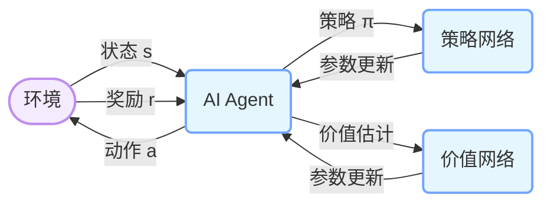

# 深度强化学习在AI Agent决策优化中的应用

> 关键词：深度强化学习、AI Agent、决策优化、马尔可夫决策过程、策略梯度算法

> 摘要：本文深入探讨了深度强化学习在AI Agent决策优化中的应用。首先介绍了深度强化学习和AI Agent的相关背景知识，包括目的、范围、预期读者等。接着阐述了核心概念，如马尔可夫决策过程、策略网络等，并给出了相应的架构示意图和流程图。详细讲解了核心算法原理，如策略梯度算法，并使用Python代码进行了具体实现。同时，介绍了相关的数学模型和公式，通过举例进行了说明。通过项目实战，展示了如何搭建开发环境、实现源代码并进行解读分析。还探讨了深度强化学习在多个实际应用场景中的应用，推荐了学习资源、开发工具框架和相关论文著作。最后总结了未来发展趋势与挑战，并给出了常见问题的解答和扩展阅读参考资料。

## 1. 背景介绍 
### 1.1 目的和范围
深度强化学习作为人工智能领域的一个重要分支，近年来取得了显著的进展。其目的在于让智能体（AI Agent）在与环境进行交互的过程中，通过不断地尝试和学习，找到最优的决策策略，以最大化长期累积奖励。本文的范围主要聚焦于深度强化学习在AI Agent决策优化方面的应用，涵盖了核心概念、算法原理、数学模型、项目实战以及实际应用场景等多个方面。通过对这些内容的深入探讨，帮助读者全面了解深度强化学习如何为AI Agent的决策提供有效的优化方案。

### 1.2 预期读者
本文预期读者包括对人工智能、机器学习和深度强化学习感兴趣的研究人员、开发者、学生以及相关领域的从业者。无论是初学者希望了解深度强化学习的基本概念和应用，还是有一定经验的专业人士想要深入研究其算法原理和实际应用案例，都能从本文中获得有价值的信息。

### 1.3 文档结构概述
本文将按照以下结构进行组织：首先介绍深度强化学习和AI Agent的核心概念及其相互联系，给出相关的原理和架构示意图；接着详细讲解核心算法原理，并使用Python代码进行具体实现；然后介绍相关的数学模型和公式，并通过举例进行说明；通过项目实战，展示如何在实际环境中应用深度强化学习进行AI Agent的决策优化；探讨深度强化学习在不同实际场景中的应用；推荐学习资源、开发工具框架和相关论文著作；最后总结未来发展趋势与挑战，给出常见问题的解答和扩展阅读参考资料。

### 1.4 术语表
#### 1.4.1 核心术语定义
- **深度强化学习（Deep Reinforcement Learning）**：结合了深度学习的强大表示能力和强化学习的决策优化机制，通过神经网络来学习最优策略的一种机器学习方法。
- **AI Agent（人工智能智能体）**：能够感知环境状态，并根据一定的策略采取行动以实现特定目标的智能实体。
- **马尔可夫决策过程（Markov Decision Process, MDP）**：一种用于描述智能体与环境交互的数学模型，具有马尔可夫性，即未来状态只依赖于当前状态和当前动作。
- **策略（Policy）**：智能体根据环境状态选择动作的规则，通常用函数 $\pi(a|s)$ 表示，其中 $s$ 是环境状态，$a$ 是动作。
- **奖励（Reward）**：环境在智能体采取某个动作后给予的反馈信号，用于衡量该动作的好坏，智能体的目标是最大化长期累积奖励。

#### 1.4.2 相关概念解释
- **价值函数（Value Function）**：用于评估在某个状态下采取某个动作或遵循某个策略的长期价值。常见的价值函数包括状态价值函数 $V(s)$ 和动作价值函数 $Q(s,a)$。
- **经验回放（Experience Replay）**：一种用于解决深度强化学习中数据相关性问题的技术，将智能体与环境交互的经验存储在经验池中，训练时随机从中采样进行学习。
- **策略梯度（Policy Gradient）**：一种直接优化策略的方法，通过计算策略网络的梯度来更新策略参数，使得策略朝着最大化累积奖励的方向发展。

#### 1.4.3 缩略词列表
- **MDP**：马尔可夫决策过程（Markov Decision Process）
- **DQN**：深度Q网络（Deep Q-Network）
- **A2C**：异步优势演员-评论家算法（Asynchronous Advantage Actor-Critic）
- **PPO**：近端策略优化算法（Proximal Policy Optimization）

## 2. 核心概念与联系 

### 2.1 深度强化学习的基本原理
深度强化学习的核心思想是让AI Agent在与环境进行交互的过程中，通过不断地尝试和学习，找到最优的决策策略。在每一个时间步 $t$，AI Agent感知到环境的当前状态 $s_t$，根据当前的策略 $\pi$ 选择一个动作 $a_t$ 执行，环境接收到动作后会转移到下一个状态 $s_{t+1}$，并给予AI Agent一个奖励 $r_t$。AI Agent的目标是通过学习一个最优策略 $\pi^*$，使得长期累积奖励 $R = \sum_{t=0}^{T} \gamma^t r_t$ 最大化，其中 $\gamma$ 是折扣因子，用于平衡即时奖励和未来奖励的重要性。

### 2.2 AI Agent的决策过程
AI Agent的决策过程可以看作是一个在环境中不断探索和利用的过程。在探索阶段，AI Agent会尝试不同的动作，以了解环境的动态和奖励机制；在利用阶段，AI Agent会根据已经学习到的策略选择能够获得最大奖励的动作。深度强化学习通过神经网络来表示策略和价值函数，使得AI Agent能够处理高维的状态和动作空间。

### 2.3 核心概念的架构示意图
下面是深度强化学习在AI Agent决策优化中的基本架构示意图：



在这个架构中，AI Agent与环境进行交互，根据策略网络选择动作，并根据环境反馈的奖励和价值网络的估计来更新策略网络和价值网络的参数。

### 2.4 核心概念的联系
深度强化学习的核心概念之间存在着紧密的联系。马尔可夫决策过程为深度强化学习提供了一个数学框架，用于描述AI Agent与环境的交互过程。策略是AI Agent在每个状态下选择动作的规则，而价值函数则用于评估策略的好坏。通过不断地更新策略和价值函数，AI Agent能够逐渐找到最优的决策策略。经验回放技术可以提高深度强化学习的稳定性和效率，而策略梯度算法则是直接优化策略的一种有效方法。

## 3. 核心算法原理 & 具体操作步骤 

### 3.1 策略梯度算法原理
策略梯度算法是深度强化学习中一种直接优化策略的方法。其基本思想是通过计算策略网络的梯度，使得策略朝着最大化累积奖励的方向更新。策略网络通常用一个神经网络 $\pi_{\theta}(a|s)$ 表示，其中 $\theta$ 是网络的参数。策略梯度算法的目标是最大化期望累积奖励 $J(\theta) = \mathbb{E}_{\tau \sim \pi_{\theta}} [\sum_{t=0}^{T} \gamma^t r_t]$，其中 $\tau$ 表示一个轨迹，即状态和动作的序列 $(s_0, a_0, s_1, a_1, \cdots, s_T, a_T)$。

根据策略梯度定理，策略梯度可以表示为：

$$\nabla_{\theta} J(\theta) = \mathbb{E}_{\tau \sim \pi_{\theta}} \left[ \sum_{t=0}^{T} \nabla_{\theta} \log \pi_{\theta}(a_t|s_t) \sum_{k=t}^{T} \gamma^{k-t} r_k \right]$$

### 3.2 具体操作步骤
以下是使用策略梯度算法进行AI Agent决策优化的具体操作步骤：

1. **初始化策略网络参数 $\theta$**：随机初始化策略网络的参数。
2. **与环境进行交互**：在每个时间步 $t$，AI Agent根据当前的策略 $\pi_{\theta}(a|s)$ 选择一个动作 $a_t$ 执行，环境接收到动作后会转移到下一个状态 $s_{t+1}$，并给予AI Agent一个奖励 $r_t$。
3. **记录轨迹**：记录每个时间步的状态 $s_t$、动作 $a_t$ 和奖励 $r_t$，形成一个轨迹 $\tau$。
4. **计算累积奖励**：对于轨迹中的每个时间步 $t$，计算从该时间步开始的累积奖励 $R_t = \sum_{k=t}^{T} \gamma^{k-t} r_k$。
5. **计算策略梯度**：根据策略梯度定理，计算策略网络的梯度 $\nabla_{\theta} J(\theta)$。
6. **更新策略网络参数**：使用梯度上升法更新策略网络的参数 $\theta$，即 $\theta \leftarrow \theta + \alpha \nabla_{\theta} J(\theta)$，其中 $\alpha$ 是学习率。
7. **重复步骤2-6**：不断重复上述步骤，直到策略收敛或达到最大训练步数。

### 3.3 Python代码实现
以下是一个使用PyTorch实现的简单策略梯度算法的示例代码：

```python
import torch
import torch.nn as nn
import torch.optim as optim
import numpy as np

# 定义策略网络
class PolicyNetwork(nn.Module):
    def __init__(self, input_dim, output_dim):
        super(PolicyNetwork, self).__init__()
        self.fc1 = nn.Linear(input_dim, 128)
        self.fc2 = nn.Linear(128, output_dim)
        self.softmax = nn.Softmax(dim=-1)

    def forward(self, x):
        x = torch.relu(self.fc1(x))
        x = self.fc2(x)
        x = self.softmax(x)
        return x

# 定义策略梯度算法
class PolicyGradient:
    def __init__(self, input_dim, output_dim, learning_rate=0.001, gamma=0.99):
        self.policy_network = PolicyNetwork(input_dim, output_dim)
        self.optimizer = optim.Adam(self.policy_network.parameters(), lr=learning_rate)
        self.gamma = gamma
        self.states = []
        self.actions = []
        self.rewards = []

    def select_action(self, state):
        state = torch.FloatTensor(state).unsqueeze(0)
        probs = self.policy_network(state)
        action = torch.multinomial(probs, 1).item()
        return action

    def store_transition(self, state, action, reward):
        self.states.append(state)
        self.actions.append(action)
        self.rewards.append(reward)

    def update(self):
        states = torch.FloatTensor(self.states)
        actions = torch.LongTensor(self.actions)
        rewards = np.array(self.rewards)

        # 计算累积奖励
        R = []
        running_reward = 0
        for r in reversed(rewards):
            running_reward = r + self.gamma * running_reward
            R.insert(0, running_reward)
        R = torch.FloatTensor(R)

        # 归一化累积奖励
        R = (R - R.mean()) / (R.std() + 1e-7)

        # 计算策略梯度
        probs = self.policy_network(states)
        log_probs = torch.log(probs.gather(1, actions.unsqueeze(1)))
        loss = -(log_probs.squeeze() * R).mean()

        # 更新策略网络参数
        self.optimizer.zero_grad()
        loss.backward()
        self.optimizer.step()

        # 清空记录
        self.states = []
        self.actions = []
        self.rewards = []

# 示例使用
if __name__ == "__main__":
    input_dim = 4
    output_dim = 2
    agent = PolicyGradient(input_dim, output_dim)

    # 模拟与环境交互
    for episode in range(100):
        state = np.random.randn(input_dim)
        for step in range(10):
            action = agent.select_action(state)
            next_state = np.random.randn(input_dim)
            reward = np.random.rand()
            agent.store_transition(state, action, reward)
            state = next_state
        agent.update()
```

在这个示例代码中，我们首先定义了一个简单的策略网络 `PolicyNetwork`，然后实现了策略梯度算法 `PolicyGradient`。在每个训练周期中，AI Agent与环境进行交互，记录状态、动作和奖励，然后根据这些记录更新策略网络的参数。

## 4. 数学模型和公式 & 详细讲解 & 举例说明 

### 4.1 马尔可夫决策过程（MDP）
马尔可夫决策过程是一个五元组 $(S, A, P, R, \gamma)$，其中：
- $S$ 是状态空间，表示环境可能处于的所有状态的集合。
- $A$ 是动作空间，表示AI Agent可以采取的所有动作的集合。
- $P(s_{t+1}|s_t, a_t)$ 是状态转移概率，表示在状态 $s_t$ 采取动作 $a_t$ 后转移到状态 $s_{t+1}$ 的概率。
- $R(s_t, a_t, s_{t+1})$ 是奖励函数，表示在状态 $s_t$ 采取动作 $a_t$ 后转移到状态 $s_{t+1}$ 时获得的奖励。
- $\gamma$ 是折扣因子，用于平衡即时奖励和未来奖励的重要性，取值范围为 $[0, 1]$。

### 4.2 价值函数
#### 4.2.1 状态价值函数
状态价值函数 $V^{\pi}(s)$ 表示在策略 $\pi$ 下，从状态 $s$ 开始的长期累积奖励的期望：

$$V^{\pi}(s) = \mathbb{E}_{\tau \sim \pi} \left[ \sum_{t=0}^{\infty} \gamma^t r_t | s_0 = s \right]$$

#### 4.2.2 动作价值函数
动作价值函数 $Q^{\pi}(s, a)$ 表示在策略 $\pi$ 下，从状态 $s$ 采取动作 $a$ 后，长期累积奖励的期望：

$$Q^{\pi}(s, a) = \mathbb{E}_{\tau \sim \pi} \left[ \sum_{t=0}^{\infty} \gamma^t r_t | s_0 = s, a_0 = a \right]$$

### 4.3 贝尔曼方程
贝尔曼方程描述了价值函数的递归关系。对于状态价值函数，贝尔曼方程可以表示为：

$$V^{\pi}(s) = \sum_{a \in A} \pi(a|s) \sum_{s' \in S} P(s'|s, a) [R(s, a, s') + \gamma V^{\pi}(s')]$$

对于动作价值函数，贝尔曼方程可以表示为：

$$Q^{\pi}(s, a) = \sum_{s' \in S} P(s'|s, a) [R(s, a, s') + \gamma \sum_{a' \in A} \pi(a'|s') Q^{\pi}(s', a')]$$

### 4.4 举例说明
假设我们有一个简单的网格世界环境，AI Agent需要从起点移动到终点。状态空间 $S$ 是网格世界中的所有位置，动作空间 $A$ 是上下左右四个方向。状态转移概率 $P(s_{t+1}|s_t, a_t)$ 表示在当前位置 $s_t$ 采取动作 $a_t$ 后移动到下一个位置 $s_{t+1}$ 的概率。奖励函数 $R(s_t, a_t, s_{t+1})$ 可以定义为：如果AI Agent到达终点，给予一个正奖励；如果AI Agent撞到墙壁，给予一个负奖励；否则，奖励为0。

假设我们使用一个简单的策略 $\pi$，即随机选择一个动作。我们可以使用贝尔曼方程来计算状态价值函数 $V^{\pi}(s)$ 和动作价值函数 $Q^{\pi}(s, a)$。例如，对于某个状态 $s$，我们可以根据贝尔曼方程计算出从该状态开始的长期累积奖励的期望，从而评估该状态的价值。

## 5. 项目实战：代码实际案例和详细解释说明 

### 5.1  开发环境搭建
#### 5.1.1 安装Python
首先，确保你已经安装了Python 3.6或更高版本。你可以从Python官方网站（https://www.python.org/downloads/）下载并安装Python。

#### 5.1.2 安装深度学习框架
我们使用PyTorch作为深度学习框架。可以使用以下命令安装PyTorch：

```bash
pip install torch torchvision
```

#### 5.1.3 安装其他依赖库
还需要安装一些其他的依赖库，如NumPy、Matplotlib等。可以使用以下命令安装：

```bash
pip install numpy matplotlib
```

### 5.2  源代码详细实现和代码解读
以下是一个使用深度Q网络（DQN）算法在OpenAI Gym的CartPole环境中进行AI Agent决策优化的示例代码：

```python
import torch
import torch.nn as nn
import torch.optim as optim
import numpy as np
import gym
import random
from collections import deque

# 定义深度Q网络
class DQN(nn.Module):
    def __init__(self, input_dim, output_dim):
        super(DQN, self).__init__()
        self.fc1 = nn.Linear(input_dim, 128)
        self.fc2 = nn.Linear(128, 128)
        self.fc3 = nn.Linear(128, output_dim)

    def forward(self, x):
        x = torch.relu(self.fc1(x))
        x = torch.relu(self.fc2(x))
        x = self.fc3(x)
        return x

# 定义DQN智能体
class DQNAgent:
    def __init__(self, input_dim, output_dim, learning_rate=0.001, gamma=0.99, epsilon=1.0, epsilon_decay=0.995, epsilon_min=0.01, batch_size=64, memory_size=10000):
        self.input_dim = input_dim
        self.output_dim = output_dim
        self.learning_rate = learning_rate
        self.gamma = gamma
        self.epsilon = epsilon
        self.epsilon_decay = epsilon_decay
        self.epsilon_min = epsilon_min
        self.batch_size = batch_size
        self.memory = deque(maxlen=memory_size)

        self.model = DQN(input_dim, output_dim)
        self.optimizer = optim.Adam(self.model.parameters(), lr=learning_rate)
        self.criterion = nn.MSELoss()

    def remember(self, state, action, reward, next_state, done):
        self.memory.append((state, action, reward, next_state, done))

    def act(self, state):
        if np.random.rand() <= self.epsilon:
            return random.randrange(self.output_dim)
        state = torch.FloatTensor(state).unsqueeze(0)
        q_values = self.model(state)
        action = torch.argmax(q_values).item()
        return action

    def replay(self):
        if len(self.memory) < self.batch_size:
            return
        minibatch = random.sample(self.memory, self.batch_size)
        states, actions, rewards, next_states, dones = zip(*minibatch)

        states = torch.FloatTensor(states)
        actions = torch.LongTensor(actions)
        rewards = torch.FloatTensor(rewards)
        next_states = torch.FloatTensor(next_states)
        dones = torch.FloatTensor(dones)

        q_values = self.model(states)
        q_values = q_values.gather(1, actions.unsqueeze(1)).squeeze()

        next_q_values = self.model(next_states)
        next_q_values = next_q_values.max(1)[0]
        target_q_values = rewards + (1 - dones) * self.gamma * next_q_values

        loss = self.criterion(q_values, target_q_values)
        self.optimizer.zero_grad()
        loss.backward()
        self.optimizer.step()

        if self.epsilon > self.epsilon_min:
            self.epsilon *= self.epsilon_decay

# 主训练循环
if __name__ == "__main__":
    env = gym.make('CartPole-v1')
    input_dim = env.observation_space.shape[0]
    output_dim = env.action_space.n

    agent = DQNAgent(input_dim, output_dim)

    episodes = 1000
    for episode in range(episodes):
        state = env.reset()
        total_reward = 0
        done = False
        while not done:
            action = agent.act(state)
            next_state, reward, done, _ = env.step(action)
            agent.remember(state, action, reward, next_state, done)
            agent.replay()
            state = next_state
            total_reward += reward
        print(f"Episode: {episode + 1}, Total Reward: {total_reward}")

    env.close()
```

### 5.3  代码解读与分析
#### 5.3.1 深度Q网络（DQN）定义
`DQN` 类定义了一个简单的三层全连接神经网络，用于近似动作价值函数 $Q(s, a)$。输入层的维度是环境状态的维度，输出层的维度是动作空间的维度。

#### 5.3.2 DQN智能体定义
`DQNAgent` 类实现了DQN算法的核心逻辑。其中，`remember` 方法用于将智能体与环境交互的经验存储在经验池中；`act` 方法用于根据当前的 $\epsilon$-贪心策略选择动作；`replay` 方法用于从经验池中随机采样一批经验进行训练，并更新Q网络的参数。

#### 5.3.3 主训练循环
在主训练循环中，智能体与环境进行交互，不断地选择动作、接收奖励，并将经验存储在经验池中。每隔一段时间，智能体从经验池中随机采样一批经验进行训练，更新Q网络的参数。随着训练的进行，智能体的 $\epsilon$ 值逐渐减小，从探索为主转变为利用为主。

## 6. 实际应用场景 
### 6.1 游戏领域
深度强化学习在游戏领域有着广泛的应用。例如，OpenAI的AlphaGo使用深度强化学习算法在围棋比赛中击败了人类冠军。在电子游戏中，深度强化学习可以用于训练智能体玩各种游戏，如《星际争霸》《Dota 2》等。通过与游戏环境进行交互，智能体可以学习到最优的游戏策略，提高游戏水平。

### 6.2 机器人控制
在机器人控制领域，深度强化学习可以用于优化机器人的决策策略。例如，机器人可以通过深度强化学习学习如何在复杂的环境中导航、抓取物体等。机器人可以根据环境的状态选择最优的动作，以完成特定的任务。

### 6.3 自动驾驶
自动驾驶是深度强化学习的一个重要应用场景。自动驾驶汽车可以通过深度强化学习学习如何在不同的路况和交通规则下做出最优的决策，如加速、减速、转弯等。通过与实际道路环境进行交互，自动驾驶汽车可以不断地优化自己的决策策略，提高行驶的安全性和效率。

### 6.4 资源管理
在资源管理领域，深度强化学习可以用于优化资源的分配和调度。例如，在云计算中，深度强化学习可以用于优化虚拟机的分配，以提高资源的利用率和性能。在能源管理中，深度强化学习可以用于优化电力系统的调度，以降低能源消耗和成本。

## 7. 工具和资源推荐
### 7.1 学习资源推荐
#### 7.1.1 书籍推荐
- 《Reinforcement Learning: An Introduction》（Richard S. Sutton和Andrew G. Barto著）：这是一本关于强化学习的经典教材，系统地介绍了强化学习的基本概念、算法和应用。
- 《Deep Reinforcement Learning Hands-On》（Max Lapan著）：这本书通过实际案例详细介绍了深度强化学习的实现方法和应用技巧。

#### 7.1.2 在线课程
- 《Deep Reinforcement Learning Specialization》（Coursera平台）：这是由DeepMind的研究人员开设的深度强化学习专项课程，涵盖了深度强化学习的各个方面。
- 《Reinforcement Learning》（David Silver授课）：这是伦敦大学学院开设的强化学习课程，课程内容丰富，讲解深入。

#### 7.1.3 技术博客和网站
- OpenAI博客（https://openai.com/blog/）：OpenAI发布了许多关于深度强化学习的最新研究成果和应用案例。
- DeepMind博客（https://deepmind.com/blog/）：DeepMind是深度强化学习领域的领先研究机构，其博客上有很多有价值的技术文章。

### 7.2 开发工具框架推荐
#### 7.2.1 IDE和编辑器
- PyCharm：一款专业的Python集成开发环境，提供了丰富的代码编辑、调试和测试功能。
- Jupyter Notebook：一种交互式的开发环境，适合进行数据探索和模型实验。

#### 7.2.2 调试和性能分析工具
- TensorBoard：TensorFlow提供的可视化工具，可以用于监控模型的训练过程和性能指标。
- PyTorch Profiler：PyTorch提供的性能分析工具，可以帮助开发者找出代码中的性能瓶颈。

#### 7.2.3 相关框架和库
- OpenAI Gym：一个用于开发和比较强化学习算法的工具包，提供了许多不同类型的环境。
- Stable Baselines3：一个基于PyTorch的深度强化学习库，提供了许多预训练的模型和算法实现。

### 7.3 相关论文著作推荐
#### 7.3.1 经典论文
- 《Playing Atari with Deep Reinforcement Learning》（Volodymyr Mnih等著）：这篇论文提出了深度Q网络（DQN）算法，开创了深度强化学习在游戏领域的应用。
- 《Asynchronous Methods for Deep Reinforcement Learning》（Volodymyr Mnih等著）：这篇论文提出了异步优势演员-评论家算法（A2C），提高了深度强化学习的训练效率。

#### 7.3.2 最新研究成果
- 《Proximal Policy Optimization Algorithms》（John Schulman等著）：这篇论文提出了近端策略优化算法（PPO），是一种高效的策略优化算法。
- 《Soft Actor-Critic: Off-Policy Maximum Entropy Deep Reinforcement Learning with a Stochastic Actor》（Tuomas Haarnoja等著）：这篇论文提出了软演员-评论家算法（SAC），结合了最大熵原理和深度强化学习。

#### 7.3.3 应用案例分析
- 《Mastering the Game of Go without Human Knowledge》（David Silver等著）：这篇论文介绍了AlphaGo Zero的实现方法，展示了深度强化学习在围棋领域的强大能力。
- 《OpenAI Five: An Open Research Platform for Cooperative AI》（OpenAI团队著）：这篇论文介绍了OpenAI Five在《Dota 2》游戏中的应用，展示了深度强化学习在多人合作游戏中的应用潜力。

## 8. 总结：未来发展趋势与挑战
### 8.1 未来发展趋势
#### 8.1.1 多智能体强化学习
随着人工智能技术的发展，多智能体系统的应用越来越广泛。多智能体强化学习将成为未来的一个重要研究方向，通过让多个智能体之间进行协作和竞争，以解决更复杂的问题。

#### 8.1.2 深度强化学习与其他技术的融合
深度强化学习可以与其他技术如计算机视觉、自然语言处理等进行融合，以实现更强大的智能系统。例如，结合计算机视觉技术，深度强化学习可以用于实现智能机器人的视觉导航和目标识别。

#### 8.1.3 强化学习在实际应用中的推广
随着深度强化学习算法的不断改进和优化，其在实际应用中的推广将越来越广泛。例如，在金融、医疗、交通等领域，深度强化学习可以用于优化决策策略，提高系统的性能和效率。

### 8.2 挑战
#### 8.2.1 样本效率问题
深度强化学习通常需要大量的样本进行训练，这使得训练过程非常耗时和耗资源。提高样本效率是深度强化学习面临的一个重要挑战。

#### 8.2.2 泛化能力问题
深度强化学习模型在训练环境中表现良好，但在新的环境中可能会出现性能下降的问题。提高模型的泛化能力是深度强化学习需要解决的另一个挑战。

#### 8.2.3 可解释性问题
深度强化学习模型通常是黑盒模型，难以解释其决策过程和依据。提高模型的可解释性是深度强化学习在实际应用中需要解决的一个关键问题。

## 9. 附录：常见问题与解答
### 9.1 深度强化学习和传统强化学习有什么区别？
传统强化学习通常使用手工特征和简单的函数逼近方法，而深度强化学习结合了深度学习的强大表示能力，使用神经网络来学习最优策略和价值函数。深度强化学习可以处理高维的状态和动作空间，在许多复杂任务中取得了更好的效果。

### 9.2 如何选择合适的深度强化学习算法？
选择合适的深度强化学习算法需要考虑多个因素，如任务的性质、状态和动作空间的维度、样本效率要求等。例如，如果任务是离散动作空间，DQN及其变种可能是一个不错的选择；如果任务是连续动作空间，策略梯度算法如A2C、PPO等可能更合适。

### 9.3 深度强化学习的训练过程中容易出现哪些问题？
深度强化学习的训练过程中容易出现以下问题：
- **不稳定性**：由于深度强化学习的训练过程是基于试错的，可能会出现训练不稳定的情况，导致模型性能波动较大。
- **过拟合**：如果训练数据有限，模型可能会过拟合训练数据，在新的环境中表现不佳。
- **探索与利用的平衡**：在训练过程中，需要平衡探索新的动作和利用已经学习到的经验，否则可能会陷入局部最优解。

### 9.4 如何提高深度强化学习的样本效率？
可以通过以下方法提高深度强化学习的样本效率：
- **使用经验回放**：将智能体与环境交互的经验存储在经验池中，训练时随机从中采样进行学习，减少数据的相关性。
- **使用优先经验回放**：根据经验的重要性对经验进行优先级排序，优先采样重要的经验进行学习。
- **使用模仿学习**：在训练初期，让智能体模仿专家的行为，快速学习到一些基本的策略。

## 10. 扩展阅读 & 参考资料
### 10.1 扩展阅读
- 《AI Superpowers: China, Silicon Valley, and the New World Order》（李开复著）：这本书介绍了人工智能的发展现状和未来趋势，以及中美在人工智能领域的竞争。
- 《The Master Algorithm: How the Quest for the Ultimate Learning Machine Will Remake Our World》（Pedro Domingos著）：这本书探讨了机器学习的发展历程和未来方向，介绍了各种机器学习算法的原理和应用。

### 10.2 参考资料
- Sutton, R. S., & Barto, A. G. (2018). Reinforcement Learning: An Introduction. MIT Press.
- Mnih, V., Kavukcuoglu, K., Silver, D., Rusu, A. A., Veness, J., Bellemare, M. G.,... & Petersen, S. (2015). Human-level control through deep reinforcement learning. Nature, 518(7540), 529-533.
- Schulman, J., Wolski, F., Dhariwal, P., Radford, A., & Klimov, O. (2017). Proximal policy optimization algorithms. arXiv preprint arXiv:1707.06347.

作者：AI天才研究院/AI Genius Institute & 禅与计算机程序设计艺术 /Zen And The Art of Computer Programming