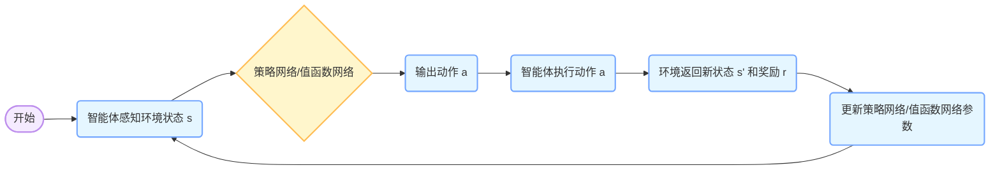

# 深度强化学习在AI Agent控制中的应用

> 关键词：深度强化学习、AI Agent控制、马尔可夫决策过程、策略网络、值函数网络

> 摘要：本文深入探讨了深度强化学习在AI Agent控制中的应用。首先介绍了相关背景知识，包括目的范围、预期读者等。接着阐述了深度强化学习和AI Agent控制的核心概念及联系，详细讲解了核心算法原理和具体操作步骤，通过Python代码进行了说明。同时给出了相关的数学模型和公式，并举例进行解释。在项目实战部分，搭建了开发环境，实现并解读了源代码。分析了深度强化学习在AI Agent控制中的实际应用场景，推荐了学习资源、开发工具框架和相关论文著作。最后总结了未来发展趋势与挑战，并提供了常见问题解答和扩展阅读参考资料。

## 1. 背景介绍 
### 1.1 目的和范围
深度强化学习在近年来取得了巨大的进展，尤其是在AI Agent控制领域展现出了强大的潜力。本文章的目的在于全面深入地探讨深度强化学习在AI Agent控制中的应用。范围涵盖了深度强化学习的基本概念、核心算法原理、数学模型，通过具体的项目实战来展示其在实际中的应用，同时分析其在不同场景下的应用情况，并提供相关的学习资源、开发工具和研究论文等。

### 1.2 预期读者
本文预期读者包括对人工智能、机器学习特别是深度强化学习感兴趣的科研人员、学生，以及从事相关领域开发的工程师。对于希望了解深度强化学习在AI Agent控制方面的理论和实践知识，并且有一定Python编程基础的人员来说，本文将是一个有价值的参考资料。

### 1.3 文档结构概述
本文首先介绍深度强化学习和AI Agent控制的背景知识，包括目的、预期读者和文档结构。接着阐述核心概念及它们之间的联系，通过文本示意图和Mermaid流程图进行说明。然后详细讲解核心算法原理和具体操作步骤，使用Python代码进行实现。给出相关的数学模型和公式，并举例说明。在项目实战部分，搭建开发环境，实现并解读源代码。分析实际应用场景，推荐学习资源、开发工具和相关论文。最后总结未来发展趋势与挑战，提供常见问题解答和扩展阅读参考资料。

### 1.4 术语表
#### 1.4.1 核心术语定义
- **深度强化学习（Deep Reinforcement Learning）**：结合了深度学习和强化学习的方法，利用深度神经网络来学习最优策略，以最大化长期累积奖励。
- **AI Agent（人工智能智能体）**：能够感知环境，根据环境信息做出决策并采取行动的智能实体。
- **马尔可夫决策过程（Markov Decision Process, MDP）**：一种用于描述强化学习问题的数学模型，具有状态、动作、奖励和转移概率等要素。
- **策略网络（Policy Network）**：在深度强化学习中，用于生成智能体动作策略的神经网络。
- **值函数网络（Value Function Network）**：用于估计在某个状态下采取某个动作或遵循某个策略所能获得的长期累积奖励的神经网络。

#### 1.4.2 相关概念解释
- **奖励（Reward）**：在强化学习中，环境根据智能体的动作给予的反馈信号，用于指导智能体学习最优策略。
- **状态（State）**：环境的一种表示，智能体根据当前状态来选择动作。
- **动作（Action）**：智能体在某个状态下可以采取的行为。
- **经验回放（Experience Replay）**：一种用于提高深度强化学习训练效率和稳定性的技术，将智能体的经验存储在经验池中，随机从中采样进行训练。

#### 1.4.3 缩略词列表
- **MDP**：Markov Decision Process（马尔可夫决策过程）
- **DQN**：Deep Q-Network（深度Q网络）
- **A2C**：Advantage Actor-Critic（优势演员 - 评论家算法）
- **PPO**：Proximal Policy Optimization（近端策略优化算法）

## 2. 核心概念与联系 

### 核心概念原理
#### 深度强化学习
深度强化学习是深度学习与强化学习的结合。强化学习的核心思想是智能体（Agent）通过与环境进行交互，根据环境反馈的奖励信号来学习最优策略，以最大化长期累积奖励。而深度学习则提供了强大的函数逼近能力，通过深度神经网络来学习复杂的策略和值函数。

深度强化学习的基本流程如下：智能体在每个时间步 $t$ 观察环境的状态 $s_t$，根据当前策略 $\pi$ 选择动作 $a_t$ 并执行，环境根据动作 $a_t$ 转移到新的状态 $s_{t+1}$，并给予智能体一个奖励 $r_t$。智能体的目标是学习一个策略 $\pi$，使得从任意初始状态开始，长期累积奖励 $R = \sum_{t=0}^{\infty} \gamma^t r_t$ 最大，其中 $\gamma$ 是折扣因子，用于权衡即时奖励和未来奖励。

#### AI Agent控制
AI Agent控制是指通过设计合适的算法和策略，使得智能体能够在不同的环境中自主地做出决策并采取行动。智能体的控制可以分为基于模型的控制和无模型的控制。基于模型的控制需要对环境的动态模型进行建模，而无模型的控制则直接从与环境的交互中学习策略。

在深度强化学习中，AI Agent的控制通常通过训练策略网络或值函数网络来实现。策略网络直接输出智能体在每个状态下的动作概率分布，而值函数网络则用于估计状态或状态 - 动作对的值，从而指导策略的优化。

### 架构的文本示意图
深度强化学习在AI Agent控制中的架构可以描述为：智能体通过传感器感知环境的状态，将状态输入到策略网络或值函数网络中。策略网络根据状态输出动作，智能体执行动作后，环境返回新的状态和奖励。奖励信号用于更新策略网络或值函数网络的参数，以提高智能体的性能。整个过程不断循环，直到智能体学习到最优策略。

### Mermaid流程图


## 3. 核心算法原理 & 具体操作步骤 

### 深度Q网络（DQN）算法原理
深度Q网络（DQN）是一种基于值函数的深度强化学习算法，其核心思想是使用深度神经网络来近似Q值函数 $Q(s, a)$，表示在状态 $s$ 下采取动作 $a$ 所能获得的最大长期累积奖励。

DQN的目标是最小化损失函数：
$$
L(\theta) = \mathbb{E}_{(s, a, r, s') \sim U(D)} \left[ \left( r + \gamma \max_{a'} Q(s', a'; \theta^-) - Q(s, a; \theta) \right)^2 \right]
$$
其中，$\theta$ 是Q网络的参数，$\theta^-$ 是目标Q网络的参数，$D$ 是经验回放池，$U(D)$ 表示从经验回放池中均匀采样。

### 具体操作步骤
1. **初始化**：初始化Q网络 $Q(s, a; \theta)$ 和目标Q网络 $Q(s, a; \theta^-)$，并将 $\theta^- = \theta$。初始化经验回放池 $D$。
2. **循环交互**：
    - 智能体观察当前状态 $s$。
    - 根据 $\epsilon$-贪心策略选择动作 $a$：以概率 $\epsilon$ 随机选择动作，以概率 $1 - \epsilon$ 选择 $Q(s, a; \theta)$ 最大的动作。
    - 执行动作 $a$，环境返回新状态 $s'$ 和奖励 $r$。
    - 将经验 $(s, a, r, s')$ 存储到经验回放池 $D$ 中。
    - 从经验回放池 $D$ 中随机采样一批经验 $(s_i, a_i, r_i, s_i')$。
    - 计算目标Q值：$y_i = r_i + \gamma \max_{a'} Q(s_i', a'; \theta^-)$。
    - 计算损失：$L(\theta) = \frac{1}{N} \sum_{i=1}^{N} \left( y_i - Q(s_i, a_i; \theta) \right)^2$。
    - 使用梯度下降法更新Q网络的参数 $\theta$。
    - 每隔一定步数，将目标Q网络的参数更新为 $\theta^- = \theta$。

### Python源代码实现
```python
import torch
import torch.nn as nn
import torch.optim as optim
import numpy as np
import random

# 定义Q网络
class QNetwork(nn.Module):
    def __init__(self, state_size, action_size):
        super(QNetwork, self).__init__()
        self.fc1 = nn.Linear(state_size, 64)
        self.fc2 = nn.Linear(64, 64)
        self.fc3 = nn.Linear(64, action_size)

    def forward(self, x):
        x = torch.relu(self.fc1(x))
        x = torch.relu(self.fc2(x))
        return self.fc3(x)

# 定义DQN智能体
class DQNAgent:
    def __init__(self, state_size, action_size):
        self.state_size = state_size
        self.action_size = action_size
        self.q_network = QNetwork(state_size, action_size)
        self.target_network = QNetwork(state_size, action_size)
        self.target_network.load_state_dict(self.q_network.state_dict())
        self.optimizer = optim.Adam(self.q_network.parameters(), lr=0.001)
        self.replay_buffer = []
        self.gamma = 0.99
        self.epsilon = 1.0
        self.epsilon_decay = 0.995
        self.epsilon_min = 0.01
        self.batch_size = 32

    def act(self, state):
        if np.random.rand() <= self.epsilon:
            return random.randrange(self.action_size)
        state = torch.FloatTensor(state).unsqueeze(0)
        q_values = self.q_network(state)
        action = torch.argmax(q_values, dim=1).item()
        return action

    def remember(self, state, action, reward, next_state, done):
        self.replay_buffer.append((state, action, reward, next_state, done))

    def replay(self):
        if len(self.replay_buffer) < self.batch_size:
            return
        minibatch = random.sample(self.replay_buffer, self.batch_size)
        states, actions, rewards, next_states, dones = zip(*minibatch)

        states = torch.FloatTensor(states)
        actions = torch.LongTensor(actions)
        rewards = torch.FloatTensor(rewards)
        next_states = torch.FloatTensor(next_states)
        dones = torch.FloatTensor(dones)

        q_values = self.q_network(states)
        q_values = q_values.gather(1, actions.unsqueeze(1)).squeeze(1)

        next_q_values = self.target_network(next_states)
        next_q_values = next_q_values.max(1)[0]
        next_q_values = next_q_values * (1 - dones)

        targets = rewards + self.gamma * next_q_values

        loss = nn.MSELoss()(q_values, targets)
        self.optimizer.zero_grad()
        loss.backward()
        self.optimizer.step()

        if self.epsilon > self.epsilon_min:
            self.epsilon *= self.epsilon_decay

    def update_target_network(self):
        self.target_network.load_state_dict(self.q_network.state_dict())
```

## 4. 数学模型和公式 & 详细讲解 & 举例说明 

### 马尔可夫决策过程（MDP）
马尔可夫决策过程是一种用于描述强化学习问题的数学模型，由一个四元组 $(S, A, P, R)$ 组成：
- $S$ 是状态空间，表示环境的所有可能状态。
- $A$ 是动作空间，表示智能体在每个状态下可以采取的所有可能动作。
- $P(s'|s, a)$ 是状态转移概率，表示在状态 $s$ 下采取动作 $a$ 后转移到状态 $s'$ 的概率。
- $R(s, a, s')$ 是奖励函数，表示在状态 $s$ 下采取动作 $a$ 并转移到状态 $s'$ 时获得的奖励。

### 值函数
#### 状态值函数
状态值函数 $V^{\pi}(s)$ 表示在策略 $\pi$ 下，从状态 $s$ 开始所能获得的长期累积奖励的期望：
$$
V^{\pi}(s) = \mathbb{E}_{\pi} \left[ \sum_{t=0}^{\infty} \gamma^t r_t | s_0 = s \right]
$$
其中，$\gamma$ 是折扣因子，$0 \leq \gamma \leq 1$。

#### 动作值函数
动作值函数 $Q^{\pi}(s, a)$ 表示在策略 $\pi$ 下，从状态 $s$ 开始采取动作 $a$ 后所能获得的长期累积奖励的期望：
$$
Q^{\pi}(s, a) = \mathbb{E}_{\pi} \left[ \sum_{t=0}^{\infty} \gamma^t r_t | s_0 = s, a_0 = a \right]
$$

### 贝尔曼方程
#### 状态值函数的贝尔曼方程
$$
V^{\pi}(s) = \sum_{a \in A} \pi(a|s) \sum_{s' \in S} P(s'|s, a) \left[ R(s, a, s') + \gamma V^{\pi}(s') \right]
$$

#### 动作值函数的贝尔曼方程
$$
Q^{\pi}(s, a) = \sum_{s' \in S} P(s'|s, a) \left[ R(s, a, s') + \gamma \sum_{a' \in A} \pi(a'|s') Q^{\pi}(s', a') \right]
$$

### 举例说明
考虑一个简单的网格世界环境，智能体在一个 $3 \times 3$ 的网格中移动，目标是从左上角 $(0, 0)$ 移动到右下角 $(2, 2)$。智能体可以采取上、下、左、右四个动作。每个状态 $s$ 表示智能体在网格中的位置，动作 $a$ 表示智能体的移动方向。当智能体到达目标位置时，获得奖励 $+1$，否则获得奖励 $-0.1$。

假设策略 $\pi$ 是随机策略，即智能体在每个状态下以相等的概率选择四个动作之一。我们可以使用贝尔曼方程来计算状态值函数和动作值函数。

例如，对于状态 $(0, 0)$，假设智能体采取向右的动作，转移到状态 $(0, 1)$，获得奖励 $-0.1$。根据贝尔曼方程，动作值函数 $Q^{\pi}((0, 0), \text{right})$ 可以计算为：
$$
Q^{\pi}((0, 0), \text{right}) = -0.1 + \gamma \sum_{a' \in A} \pi(a'|(0, 1)) Q^{\pi}((0, 1), a')
$$

状态值函数 $V^{\pi}((0, 0))$ 可以计算为：
$$
V^{\pi}((0, 0)) = \frac{1}{4} \sum_{a \in A} Q^{\pi}((0, 0), a)
$$

## 5. 项目实战：代码实际案例和详细解释说明 

### 5.1  开发环境搭建
#### 安装Python
首先，确保你已经安装了Python 3.x版本。可以从Python官方网站（https://www.python.org/downloads/） 下载并安装适合你操作系统的Python版本。

#### 安装必要的库
使用以下命令安装必要的库：
```sh
pip install torch numpy gym
```
- `torch`：PyTorch深度学习框架，用于构建和训练神经网络。
- `numpy`：用于数值计算。
- `gym`：OpenAI Gym是一个用于开发和比较强化学习算法的工具包，提供了各种环境供智能体进行训练。

### 5.2  源代码详细实现和代码解读
```python
import gym
from dqn_agent import DQNAgent  # 假设上面定义的DQNAgent类保存在dqn_agent.py文件中

# 创建环境
env = gym.make('CartPole-v1')
state_size = env.observation_space.shape[0]
action_size = env.action_space.n

# 创建智能体
agent = DQNAgent(state_size, action_size)

# 训练智能体
EPISODES = 1000
for episode in range(EPISODES):
    state = env.reset()
    total_reward = 0
    done = False
    while not done:
        action = agent.act(state)
        next_state, reward, done, _ = env.step(action)
        agent.remember(state, action, reward, next_state, done)
        agent.replay()
        state = next_state
        total_reward += reward
    if episode % 10 == 0:
        agent.update_target_network()
    print(f"Episode: {episode}, Total Reward: {total_reward}")

# 测试智能体
state = env.reset()
total_reward = 0
done = False
while not done:
    action = agent.act(state)
    next_state, reward, done, _ = env.step(action)
    state = next_state
    total_reward += reward
    env.render()
print(f"Test Total Reward: {total_reward}")

env.close()
```
### 代码解读与分析
1. **环境创建**：使用 `gym.make('CartPole-v1')` 创建一个CartPole环境。CartPole是一个经典的强化学习环境，智能体的目标是通过左右移动小车来保持杆子的平衡。
2. **智能体创建**：创建一个 `DQNAgent` 实例，传入状态空间大小和动作空间大小。
3. **训练过程**：在每个回合中，智能体与环境进行交互，根据当前状态选择动作，执行动作后获得新状态和奖励，并将经验存储到经验回放池中。然后从经验回放池中采样进行训练，更新Q网络的参数。每隔一定步数，更新目标Q网络的参数。
4. **测试过程**：训练完成后，对智能体进行测试，观察其在环境中的表现。在测试过程中，智能体根据当前状态选择动作，执行动作后更新状态和累积奖励，并渲染环境。
5. **结果分析**：通过观察每个回合的总奖励，可以评估智能体的训练效果。如果总奖励逐渐增加，说明智能体在不断学习和改进。

## 6. 实际应用场景 
### 游戏领域
深度强化学习在游戏领域有着广泛的应用。例如，AlphaGo通过深度强化学习算法击败了人类围棋冠军。在电子游戏中，智能体可以通过深度强化学习学习游戏策略，如在《星际争霸》《Dota 2》等游戏中，智能体可以学习如何进行资源管理、部队调度和战斗决策等。

### 机器人控制
在机器人控制领域，深度强化学习可以用于训练机器人完成各种任务，如机器人导航、抓取物体等。机器人可以通过与环境进行交互，学习如何在复杂的环境中移动和操作，以达到预定的目标。

### 自动驾驶
自动驾驶是深度强化学习的一个重要应用场景。自动驾驶汽车可以通过深度强化学习学习如何在不同的路况和交通规则下安全行驶。智能体可以根据传感器获取的环境信息，如摄像头图像、雷达数据等，选择合适的驾驶动作，如加速、减速、转弯等。

### 资源管理
在云计算、数据中心等领域，深度强化学习可以用于资源管理。例如，通过深度强化学习算法可以优化服务器的资源分配，提高资源利用率和系统性能。智能体可以根据系统的负载情况和用户需求，动态地调整资源分配策略。

## 7. 工具和资源推荐
### 7.1 学习资源推荐
#### 7.1.1 书籍推荐
- 《Reinforcement Learning: An Introduction》：由Richard S. Sutton和Andrew G. Barto所著，是强化学习领域的经典教材，全面介绍了强化学习的基本概念、算法和应用。
- 《Deep Reinforcement Learning Hands-On》：由Max Lapan所著，通过实际案例详细介绍了深度强化学习的实现方法和应用场景。

#### 7.1.2 在线课程
- Coursera上的《Reinforcement Learning Specialization》：由University of Alberta提供，包括多个课程，从基础的强化学习概念到高级的深度强化学习算法都有涉及。
- Udemy上的《Deep Reinforcement Learning in Python》：通过Python代码实现了多种深度强化学习算法，适合有一定Python基础的学习者。

#### 7.1.3 技术博客和网站
- OpenAI博客（https://openai.com/blog/）：OpenAI团队发布的关于人工智能和强化学习的最新研究成果和应用案例。
- Medium上的Towards Data Science（https://towardsdatascience.com/）：有许多关于深度强化学习的技术文章和教程。

### 7.2 开发工具框架推荐
#### 7.2.1 IDE和编辑器
- PyCharm：一款功能强大的Python集成开发环境，提供了代码编辑、调试、版本控制等功能。
- Jupyter Notebook：一种交互式的开发环境，适合进行数据探索、模型训练和结果可视化。

#### 7.2.2 调试和性能分析工具
- TensorBoard：TensorFlow提供的可视化工具，可以用于监控模型的训练过程、查看损失函数和准确率等指标。
- PyTorch Profiler：PyTorch提供的性能分析工具，可以帮助开发者找出代码中的性能瓶颈。

#### 7.2.3 相关框架和库
- PyTorch：一个开源的深度学习框架，提供了丰富的神经网络模块和优化算法，易于使用和扩展。
- TensorFlow：另一个广泛使用的深度学习框架，具有强大的分布式训练和部署能力。
- Stable Baselines3：一个基于PyTorch的深度强化学习库，提供了多种预训练的强化学习算法和环境。

### 7.3 相关论文著作推荐
#### 7.3.1 经典论文
- 《Playing Atari with Deep Reinforcement Learning》：首次提出了深度Q网络（DQN）算法，开启了深度强化学习在游戏领域的应用。
- 《Asynchronous Methods for Deep Reinforcement Learning》：提出了异步优势演员 - 评论家（A3C）算法，提高了深度强化学习的训练效率。

#### 7.3.2 最新研究成果
- 《Proximal Policy Optimization Algorithms》：提出了近端策略优化（PPO）算法，是一种高效的无模型强化学习算法。
- 《Soft Actor-Critic: Off-Policy Maximum Entropy Deep Reinforcement Learning with a Stochastic Actor》：提出了软演员 - 评论家（SAC）算法，结合了最大熵强化学习和无模型强化学习。

#### 7.3.3 应用案例分析
- 《Mastering the Game of Go without Human Knowledge》：介绍了AlphaGo Zero的实现原理和训练方法，展示了深度强化学习在复杂游戏中的强大能力。
- 《End-to-End Deep Reinforcement Learning for Autonomous Driving》：探讨了深度强化学习在自动驾驶中的应用，提出了一种端到端的自动驾驶模型。

## 8. 总结：未来发展趋势与挑战
### 未来发展趋势
- **多智能体强化学习**：随着智能系统的复杂化，多智能体系统的研究将越来越重要。多智能体强化学习可以用于解决多个智能体之间的协作和竞争问题，如自动驾驶中的车辆协同、机器人团队的任务分配等。
- **结合其他技术**：深度强化学习可以与其他技术如计算机视觉、自然语言处理等相结合，实现更加复杂的任务。例如，将深度强化学习与计算机视觉结合，使智能体能够在图像和视频中进行决策和行动。
- **应用拓展**：深度强化学习将在更多领域得到应用，如金融、医疗、教育等。在金融领域，深度强化学习可以用于投资决策和风险管理；在医疗领域，可以用于疾病诊断和治疗方案推荐。

### 挑战
- **样本效率**：深度强化学习通常需要大量的样本进行训练，样本效率较低。提高样本效率是当前深度强化学习研究的一个重要方向。
- **可解释性**：深度强化学习模型通常是黑盒模型，缺乏可解释性。在一些对安全性和可靠性要求较高的领域，如自动驾驶和医疗，模型的可解释性至关重要。
- **环境建模**：在实际应用中，环境往往是复杂和不确定的，如何准确地建模环境是一个挑战。此外，环境的动态变化也会影响智能体的性能。

## 9. 附录：常见问题与解答
### 问题1：深度强化学习和传统强化学习有什么区别？
传统强化学习通常使用手工特征和简单的函数逼近方法，如表格法和线性函数逼近。而深度强化学习使用深度神经网络来学习复杂的策略和值函数，能够处理高维的状态和动作空间。

### 问题2：如何选择合适的深度强化学习算法？
选择合适的深度强化学习算法需要考虑多个因素，如问题的类型（离散动作还是连续动作）、环境的复杂度、样本效率要求等。例如，对于离散动作问题，DQN及其变种是常用的算法；对于连续动作问题，A2C、PPO等算法更为合适。

### 问题3：深度强化学习的训练过程中容易出现哪些问题？
深度强化学习的训练过程中容易出现以下问题：
- **不稳定**：由于强化学习的奖励信号是稀疏和延迟的，训练过程容易出现不稳定的情况，如奖励波动大、收敛速度慢等。
- **过拟合**：深度神经网络容易过拟合训练数据，导致在测试环境中的性能下降。
- **探索与利用的平衡**：智能体需要在探索新的动作和利用已有的经验之间进行平衡，如果探索不足，智能体可能会陷入局部最优；如果探索过度，训练效率会降低。

### 问题4：如何提高深度强化学习的样本效率？
提高深度强化学习的样本效率可以采用以下方法：
- **经验回放**：将智能体的经验存储在经验池中，随机从中采样进行训练，提高数据的利用率。
- **优先经验回放**：根据经验的重要性对经验进行加权采样，优先选择重要的经验进行训练。
- **基于模型的强化学习**：对环境的动态模型进行建模，利用模型生成虚拟的经验进行训练，减少与真实环境的交互次数。

## 10. 扩展阅读 & 参考资料
- Sutton, R. S., & Barto, A. G. (2018). Reinforcement Learning: An Introduction. MIT press.
- Lapan, M. (2018). Deep Reinforcement Learning Hands-On. Packt Publishing Ltd.
- Mnih, V., Kavukcuoglu, K., Silver, D., Graves, A., Antonoglou, I., Wierstra, D., & Riedmiller, M. (2013). Playing Atari with Deep Reinforcement Learning. arXiv preprint arXiv:1312.5602.
- Mnih, V., Badia, A. P., Mirza, M., Graves, A., Lillicrap, T., Harley, T.,... & Kavukcuoglu, K. (2016). Asynchronous Methods for Deep Reinforcement Learning. In International conference on machine learning (pp. 1928-1937).
- Schulman, J., Wolski, F., Dhariwal, P., Radford, A., & Klimov, O. (2017). Proximal Policy Optimization Algorithms. arXiv preprint arXiv:1707.06347.
- Haarnoja, T., Zhou, A., Abbeel, P., & Levine, S. (2018). Soft Actor-Critic: Off-Policy Maximum Entropy Deep Reinforcement Learning with a Stochastic Actor. arXiv preprint arXiv:1801.01290.
- Silver, D., Schrittwieser, J., Simonyan, K., Antonoglou, I., Huang, A., Guez, A.,... & Dieleman, S. (2017). Mastering the Game of Go without Human Knowledge. Nature, 550(7676), 354-359.
- Chen, C., Wang, H., & Peng, X. (2017). End-to-End Deep Reinforcement Learning for Autonomous Driving. arXiv preprint arXiv:1704.02287.

作者：AI天才研究院/AI Genius Institute & 禅与计算机程序设计艺术 /Zen And The Art of Computer Programming