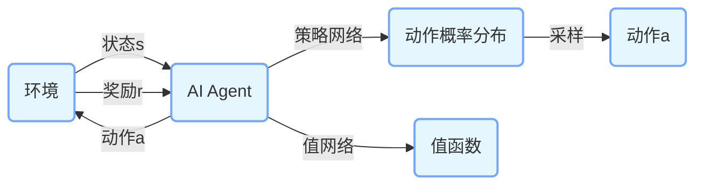

# 深度强化学习在AI Agent行为生成中的应用

> 关键词：深度强化学习、AI Agent、行为生成、马尔可夫决策过程、策略网络

> 摘要：本文深入探讨了深度强化学习在AI Agent行为生成中的应用。首先介绍了相关背景知识，包括目的、预期读者、文档结构和术语表。接着阐述了深度强化学习和AI Agent的核心概念及联系，并给出了原理和架构的示意图与流程图。详细讲解了核心算法原理，通过Python代码进行了示例。对涉及的数学模型和公式进行了详细说明并举例。通过项目实战展示了代码的实际案例和解读。分析了深度强化学习在AI Agent行为生成中的实际应用场景。推荐了相关的学习资源、开发工具框架和论文著作。最后总结了未来发展趋势与挑战，并给出了常见问题解答和扩展阅读参考资料，旨在为读者全面呈现深度强化学习在AI Agent行为生成领域的理论与实践。

## 1. 背景介绍 
### 1.1 目的和范围
深度强化学习作为机器学习领域的一个重要分支，近年来在多个领域取得了显著的成果。其核心在于智能体（Agent）通过与环境进行交互，不断学习以最大化累积奖励。本文章的目的是深入探讨深度强化学习在AI Agent行为生成中的应用，详细分析其原理、算法、实际应用场景等方面的内容。范围涵盖了从基本概念的介绍到具体算法的实现，再到实际项目的案例分析，以及相关学习资源和工具的推荐。

### 1.2 预期读者
本文预期读者包括对人工智能、机器学习、深度强化学习等领域感兴趣的研究人员、开发者、学生等。对于有一定编程基础和机器学习知识的读者，能够帮助他们深入理解深度强化学习在AI Agent行为生成中的应用；对于初学者，也可以作为入门的学习资料，引导他们逐步了解相关概念和技术。

### 1.3 文档结构概述
本文将按照以下结构进行阐述：首先介绍核心概念与联系，包括深度强化学习和AI Agent的基本概念、原理和架构；接着详细讲解核心算法原理和具体操作步骤，并通过Python代码进行示例；然后介绍相关的数学模型和公式，并举例说明；通过项目实战展示代码的实际案例和详细解释；分析深度强化学习在AI Agent行为生成中的实际应用场景；推荐相关的学习资源、开发工具框架和论文著作；最后总结未来发展趋势与挑战，给出常见问题解答和扩展阅读参考资料。

### 1.4 术语表
#### 1.4.1 核心术语定义
- **深度强化学习（Deep Reinforcement Learning）**：结合了深度学习和强化学习的方法，使用深度神经网络来近似值函数或策略函数，以解决复杂的决策问题。
- **AI Agent（人工智能智能体）**：能够感知环境、做出决策并采取行动的实体，其目标是在环境中最大化累积奖励。
- **马尔可夫决策过程（Markov Decision Process，MDP）**：一种用于描述顺序决策问题的数学模型，由状态集合、动作集合、状态转移概率、奖励函数和折扣因子组成。
- **策略网络（Policy Network）**：深度神经网络的一种，用于输出AI Agent在不同状态下采取各个动作的概率分布。
- **值函数（Value Function）**：表示从某个状态开始，遵循某个策略所能获得的期望累积奖励。

#### 1.4.2 相关概念解释
- **探索与利用（Exploration vs. Exploitation）**：在强化学习中，AI Agent需要在探索新的动作以发现更好的策略和利用已有的经验之间进行平衡。
- **经验回放（Experience Replay）**：一种用于训练深度强化学习模型的技术，将AI Agent与环境交互的经验存储在经验池中，然后随机从中采样进行训练，以提高训练的稳定性。
- **目标网络（Target Network）**：在深度Q网络（Deep Q-Network，DQN）中，为了提高训练的稳定性，使用一个目标网络来计算目标Q值。

#### 1.4.3 缩略词列表
- **MDP**：Markov Decision Process（马尔可夫决策过程）
- **DQN**：Deep Q-Network（深度Q网络）
- **PPO**：Proximal Policy Optimization（近端策略优化）
- **A2C**：Advantage Actor-Critic（优势演员-评论家算法）

## 2. 核心概念与联系 

### 2.1 深度强化学习原理
深度强化学习是强化学习与深度学习的结合。强化学习的基本思想是智能体在环境中不断尝试不同的动作，根据环境反馈的奖励来调整自己的行为策略，以最大化长期累积奖励。而深度学习则为强化学习提供了强大的函数逼近能力，通过深度神经网络可以处理高维的状态和动作空间。

深度强化学习的核心是学习一个策略函数 $\pi(a|s)$，它表示在状态 $s$ 下采取动作 $a$ 的概率。同时，还可以学习一个值函数 $V(s)$ 或 $Q(s,a)$，分别表示从状态 $s$ 开始的期望累积奖励和在状态 $s$ 下采取动作 $a$ 的期望累积奖励。

### 2.2 AI Agent行为生成原理
AI Agent的行为生成是指根据当前环境状态，智能体选择合适的动作来执行。在深度强化学习中，AI Agent通过策略网络根据当前状态输出动作的概率分布，然后根据这个概率分布采样得到具体的动作。例如，在一个游戏环境中，AI Agent根据当前游戏画面（状态），通过策略网络计算出各种操作（动作）的概率，然后选择概率最大的动作或进行随机采样得到要执行的动作。

### 2.3 核心概念架构示意图

这个示意图展示了AI Agent与环境的交互过程。环境向AI Agent提供当前状态 $s$，AI Agent通过策略网络计算动作概率分布，采样得到动作 $a$ 并执行，环境根据动作返回奖励 $r$。同时，AI Agent还可以通过值网络计算值函数。

## 3. 核心算法原理 & 具体操作步骤 

### 3.1 深度Q网络（DQN）算法原理
深度Q网络（DQN）是深度强化学习中的经典算法，它通过深度神经网络来近似Q值函数 $Q(s,a)$。DQN的目标是学习一个最优的Q值函数，使得在每个状态 $s$ 下选择Q值最大的动作能够最大化长期累积奖励。

DQN的核心思想是使用经验回放和目标网络来提高训练的稳定性。经验回放将AI Agent与环境交互的经验 $(s,a,r,s')$ 存储在经验池中，然后随机从中采样进行训练。目标网络则是一个与主网络结构相同但参数更新较慢的网络，用于计算目标Q值。

### 3.2 DQN算法具体操作步骤
1. **初始化**：初始化主网络 $Q$ 和目标网络 $\hat{Q}$ 的参数，初始化经验池 $D$。
2. **环境交互**：在每个时间步 $t$，AI Agent根据当前状态 $s_t$，通过主网络 $Q$ 计算Q值，选择动作 $a_t$ 并执行，环境返回奖励 $r_t$ 和下一个状态 $s_{t+1}$。
3. **经验存储**：将经验 $(s_t,a_t,r_t,s_{t+1})$ 存储到经验池 $D$ 中。
4. **经验回放**：从经验池 $D$ 中随机采样一个小批量的经验 $(s_i,a_i,r_i,s_{i+1})$。
5. **目标Q值计算**：使用目标网络 $\hat{Q}$ 计算目标Q值 $y_i = r_i + \gamma \max_{a'} \hat{Q}(s_{i+1},a')$，其中 $\gamma$ 是折扣因子。
6. **损失计算**：计算主网络 $Q$ 的损失 $L = \frac{1}{N} \sum_{i=1}^{N} (Q(s_i,a_i) - y_i)^2$，其中 $N$ 是小批量的大小。
7. **参数更新**：使用梯度下降法更新主网络 $Q$ 的参数。
8. **目标网络更新**：定期更新目标网络 $\hat{Q}$ 的参数，使其与主网络 $Q$ 的参数相同。

### 3.3 Python代码实现
```python
import torch
import torch.nn as nn
import torch.optim as optim
import numpy as np
import random

# 定义Q网络
class QNetwork(nn.Module):
    def __init__(self, input_dim, output_dim):
        super(QNetwork, self).__init__()
        self.fc1 = nn.Linear(input_dim, 64)
        self.fc2 = nn.Linear(64, 64)
        self.fc3 = nn.Linear(64, output_dim)

    def forward(self, x):
        x = torch.relu(self.fc1(x))
        x = torch.relu(self.fc2(x))
        return self.fc3(x)

# 定义DQN代理
class DQNAgent:
    def __init__(self, input_dim, output_dim, learning_rate=0.001, gamma=0.99, epsilon=1.0, epsilon_decay=0.995, epsilon_min=0.01, batch_size=64, memory_size=10000):
        self.input_dim = input_dim
        self.output_dim = output_dim
        self.learning_rate = learning_rate
        self.gamma = gamma
        self.epsilon = epsilon
        self.epsilon_decay = epsilon_decay
        self.epsilon_min = epsilon_min
        self.batch_size = batch_size
        self.memory = []
        self.memory_size = memory_size

        self.q_network = QNetwork(input_dim, output_dim)
        self.target_network = QNetwork(input_dim, output_dim)
        self.target_network.load_state_dict(self.q_network.state_dict())
        self.optimizer = optim.Adam(self.q_network.parameters(), lr=learning_rate)

    def remember(self, state, action, reward, next_state, done):
        if len(self.memory) > self.memory_size:
            self.memory.pop(0)
        self.memory.append((state, action, reward, next_state, done))

    def act(self, state):
        if np.random.rand() <= self.epsilon:
            return random.randrange(self.output_dim)
        state = torch.FloatTensor(state).unsqueeze(0)
        q_values = self.q_network(state)
        action = torch.argmax(q_values).item()
        return action

    def replay(self):
        if len(self.memory) < self.batch_size:
            return
        minibatch = random.sample(self.memory, self.batch_size)
        states, actions, rewards, next_states, dones = zip(*minibatch)

        states = torch.FloatTensor(states)
        actions = torch.LongTensor(actions)
        rewards = torch.FloatTensor(rewards)
        next_states = torch.FloatTensor(next_states)
        dones = torch.FloatTensor(dones)

        q_values = self.q_network(states).gather(1, actions.unsqueeze(1)).squeeze(1)
        next_q_values = self.target_network(next_states).max(1)[0]
        target_q_values = rewards + (1 - dones) * self.gamma * next_q_values

        loss = nn.MSELoss()(q_values, target_q_values)
        self.optimizer.zero_grad()
        loss.backward()
        self.optimizer.step()

        if self.epsilon > self.epsilon_min:
            self.epsilon *= self.epsilon_decay

    def update_target_network(self):
        self.target_network.load_state_dict(self.q_network.state_dict())
```

## 4. 数学模型和公式 & 详细讲解 & 举例说明 

### 4.1 马尔可夫决策过程（MDP）
马尔可夫决策过程（MDP）是描述强化学习问题的数学模型，它由一个五元组 $(S,A,P,R,\gamma)$ 组成：
- $S$ 是状态集合，表示环境的所有可能状态。
- $A$ 是动作集合，表示AI Agent可以采取的所有动作。
- $P(s'|s,a)$ 是状态转移概率，表示在状态 $s$ 下采取动作 $a$ 后转移到状态 $s'$ 的概率。
- $R(s,a)$ 是奖励函数，表示在状态 $s$ 下采取动作 $a$ 所获得的即时奖励。
- $\gamma$ 是折扣因子，取值范围为 $[0,1]$，用于权衡即时奖励和未来奖励。

MDP的核心性质是马尔可夫性，即未来的状态只取决于当前状态和动作，而与历史状态和动作无关。

### 4.2 值函数
值函数用于评估状态或状态-动作对的价值，主要有两种类型：
- **状态值函数 $V^{\pi}(s)$**：表示在策略 $\pi$ 下，从状态 $s$ 开始的期望累积奖励：
$$V^{\pi}(s) = \mathbb{E}_{\pi} \left[ \sum_{t=0}^{\infty} \gamma^t R_{t+1} \mid S_0 = s \right]$$
其中，$\mathbb{E}_{\pi}$ 表示在策略 $\pi$ 下的期望，$R_{t+1}$ 是在时间步 $t+1$ 获得的奖励。

- **动作值函数 $Q^{\pi}(s,a)$**：表示在策略 $\pi$ 下，从状态 $s$ 采取动作 $a$ 后，后续遵循策略 $\pi$ 所能获得的期望累积奖励：
$$Q^{\pi}(s,a) = \mathbb{E}_{\pi} \left[ \sum_{t=0}^{\infty} \gamma^t R_{t+1} \mid S_0 = s, A_0 = a \right]$$

### 4.3 贝尔曼方程
贝尔曼方程是强化学习中的重要方程，用于递归地计算值函数。对于状态值函数 $V^{\pi}(s)$，贝尔曼方程为：
$$V^{\pi}(s) = \sum_{a \in A} \pi(a|s) \sum_{s' \in S} P(s'|s,a) \left[ R(s,a) + \gamma V^{\pi}(s') \right]$$
对于动作值函数 $Q^{\pi}(s,a)$，贝尔曼方程为：
$$Q^{\pi}(s,a) = \sum_{s' \in S} P(s'|s,a) \left[ R(s,a) + \gamma \sum_{a' \in A} \pi(a'|s') Q^{\pi}(s',a') \right]$$

### 4.4 举例说明
考虑一个简单的格子世界环境，AI Agent需要从起点走到终点。环境有4个状态：起点、中间状态1、中间状态2和终点。AI Agent可以采取4个动作：上、下、左、右。状态转移概率 $P(s'|s,a)$ 表示在状态 $s$ 下采取动作 $a$ 后转移到状态 $s'$ 的概率，奖励函数 $R(s,a)$ 表示在状态 $s$ 下采取动作 $a$ 所获得的即时奖励。

假设折扣因子 $\gamma = 0.9$，策略 $\pi$ 是随机策略，即每个动作的概率都是 $0.25$。我们可以使用贝尔曼方程计算状态值函数 $V^{\pi}(s)$ 和动作值函数 $Q^{\pi}(s,a)$。

例如，对于起点状态 $s_0$，假设采取上动作 $a_0$ 转移到中间状态1的概率为 $0.8$，获得奖励 $1$，转移到其他状态的概率为 $0$；采取其他动作转移到其他状态的概率也可以类似定义。则根据贝尔曼方程可以计算 $Q^{\pi}(s_0,a_0)$ 和 $V^{\pi}(s_0)$。

## 5. 项目实战：代码实际案例和详细解释说明 

### 5.1  开发环境搭建
- **Python环境**：建议使用Python 3.7及以上版本，可以通过Anaconda或官方网站下载安装。
- **深度学习框架**：使用PyTorch作为深度学习框架，可以通过官方网站根据自己的CUDA版本选择合适的安装方式。
- **强化学习环境**：使用OpenAI Gym作为强化学习环境，可以通过`pip install gym`进行安装。

### 5.2  源代码详细实现和代码解读
```python
import gym
import torch
import torch.nn as nn
import torch.optim as optim
import numpy as np
import random

# 定义Q网络
class QNetwork(nn.Module):
    def __init__(self, input_dim, output_dim):
        super(QNetwork, self).__init__()
        self.fc1 = nn.Linear(input_dim, 64)
        self.fc2 = nn.Linear(64, 64)
        self.fc3 = nn.Linear(64, output_dim)

    def forward(self, x):
        x = torch.relu(self.fc1(x))
        x = torch.relu(self.fc2(x))
        return self.fc3(x)

# 定义DQN代理
class DQNAgent:
    def __init__(self, input_dim, output_dim, learning_rate=0.001, gamma=0.99, epsilon=1.0, epsilon_decay=0.995, epsilon_min=0.01, batch_size=64, memory_size=10000):
        self.input_dim = input_dim
        self.output_dim = output_dim
        self.learning_rate = learning_rate
        self.gamma = gamma
        self.epsilon = epsilon
        self.epsilon_decay = epsilon_decay
        self.epsilon_min = epsilon_min
        self.batch_size = batch_size
        self.memory = []
        self.memory_size = memory_size

        self.q_network = QNetwork(input_dim, output_dim)
        self.target_network = QNetwork(input_dim, output_dim)
        self.target_network.load_state_dict(self.q_network.state_dict())
        self.optimizer = optim.Adam(self.q_network.parameters(), lr=learning_rate)

    def remember(self, state, action, reward, next_state, done):
        if len(self.memory) > self.memory_size:
            self.memory.pop(0)
        self.memory.append((state, action, reward, next_state, done))

    def act(self, state):
        if np.random.rand() <= self.epsilon:
            return random.randrange(self.output_dim)
        state = torch.FloatTensor(state).unsqueeze(0)
        q_values = self.q_network(state)
        action = torch.argmax(q_values).item()
        return action

    def replay(self):
        if len(self.memory) < self.batch_size:
            return
        minibatch = random.sample(self.memory, self.batch_size)
        states, actions, rewards, next_states, dones = zip(*minibatch)

        states = torch.FloatTensor(states)
        actions = torch.LongTensor(actions)
        rewards = torch.FloatTensor(rewards)
        next_states = torch.FloatTensor(next_states)
        dones = torch.FloatTensor(dones)

        q_values = self.q_network(states).gather(1, actions.unsqueeze(1)).squeeze(1)
        next_q_values = self.target_network(next_states).max(1)[0]
        target_q_values = rewards + (1 - dones) * self.gamma * next_q_values

        loss = nn.MSELoss()(q_values, target_q_values)
        self.optimizer.zero_grad()
        loss.backward()
        self.optimizer.step()

        if self.epsilon > self.epsilon_min:
            self.epsilon *= self.epsilon_decay

    def update_target_network(self):
        self.target_network.load_state_dict(self.q_network.state_dict())

# 主训练函数
def train():
    env = gym.make('CartPole-v1')
    input_dim = env.observation_space.shape[0]
    output_dim = env.action_space.n
    agent = DQNAgent(input_dim, output_dim)

    num_episodes = 500
    for episode in range(num_episodes):
        state = env.reset()
        total_reward = 0
        done = False
        while not done:
            action = agent.act(state)
            next_state, reward, done, _ = env.step(action)
            agent.remember(state, action, reward, next_state, done)
            agent.replay()
            state = next_state
            total_reward += reward
        if episode % 10 == 0:
            agent.update_target_network()
        print(f"Episode {episode}: Total Reward = {total_reward}")

    env.close()

if __name__ == "__main__":
    train()
```

### 5.3  代码解读与分析
- **QNetwork类**：定义了一个简单的三层全连接神经网络，用于近似Q值函数。输入层的维度是环境状态的维度，输出层的维度是动作的数量。
- **DQNAgent类**：实现了DQN代理的主要功能，包括经验存储、动作选择、经验回放和目标网络更新。
    - `remember`方法：将AI Agent与环境交互的经验 $(s,a,r,s',d)$ 存储到经验池中。
    - `act`方法：根据当前状态选择动作，使用 $\epsilon$-贪心策略进行探索和利用的平衡。
    - `replay`方法：从经验池中随机采样一个小批量的经验，计算目标Q值和损失，然后使用梯度下降法更新主网络的参数。
    - `update_target_network`方法：定期更新目标网络的参数，使其与主网络的参数相同。
- **train函数**：主训练函数，创建环境和DQN代理，进行多轮训练。在每一轮训练中，AI Agent与环境交互，存储经验并进行经验回放，定期更新目标网络。

## 6. 实际应用场景 
### 6.1 游戏领域
深度强化学习在游戏领域有广泛的应用，例如在围棋、星际争霸等复杂游戏中，AI Agent通过深度强化学习可以学习到非常强大的策略。以围棋为例，AlphaGo通过深度强化学习结合蒙特卡罗树搜索，击败了人类顶尖棋手。在电子游戏中，AI Agent可以学习到如何在不同的游戏场景中做出最优决策，提高游戏的智能水平。

### 6.2 机器人控制
在机器人控制领域，深度强化学习可以用于机器人的运动规划、动作控制等方面。例如，机器人可以通过深度强化学习学习到如何在复杂的环境中导航、抓取物体等。通过与环境进行交互，机器人可以不断调整自己的动作策略，以实现高效的任务执行。

### 6.3 自动驾驶
自动驾驶是深度强化学习的一个重要应用场景。AI Agent可以学习到如何在不同的路况下做出最优的驾驶决策，例如加速、减速、转弯等。通过模拟不同的驾驶场景进行训练，AI Agent可以不断提高自己的驾驶技能，提高自动驾驶的安全性和可靠性。

### 6.4 资源管理
在云计算、数据中心等领域，深度强化学习可以用于资源管理。例如，通过深度强化学习可以优化服务器的资源分配，提高资源利用率，降低能源消耗。AI Agent可以根据不同的工作负载和资源需求，动态调整资源分配策略。

## 7. 工具和资源推荐
### 7.1 学习资源推荐
#### 7.1.1 书籍推荐
- 《Reinforcement Learning: An Introduction》：强化学习领域的经典教材，详细介绍了强化学习的基本概念、算法和理论。
- 《Deep Reinforcement Learning Hands-On》：通过实际案例介绍深度强化学习的应用，适合初学者快速上手。
- 《Artificial Intelligence: A Modern Approach》：人工智能领域的经典教材，涵盖了强化学习等多个方面的内容。

#### 7.1.2 在线课程
- Coursera上的《Reinforcement Learning Specialization》：由DeepMind的研究人员授课，系统介绍了强化学习的理论和实践。
- edX上的《Introduction to Artificial Intelligence》：涵盖了强化学习等人工智能的基础知识。
- OpenAI的Spinning Up：提供了深度强化学习的教程和代码实现，适合有一定编程基础的学习者。

#### 7.1.3 技术博客和网站
- OpenAI博客：发布了许多关于深度强化学习的最新研究成果和应用案例。
- DeepMind博客：分享了深度强化学习在多个领域的研究进展。
- Towards Data Science：一个数据科学和机器学习的博客平台，有很多关于深度强化学习的文章。

### 7.2 开发工具框架推荐
#### 7.2.1 IDE和编辑器
- PyCharm：一款功能强大的Python集成开发环境，适合开发深度强化学习项目。
- Jupyter Notebook：一个交互式的开发环境，适合进行数据分析和模型训练的实验。
- Visual Studio Code：一款轻量级的代码编辑器，支持多种编程语言和插件，适合快速开发。

#### 7.2.2 调试和性能分析工具
- TensorBoard：TensorFlow的可视化工具，可以用于监控模型的训练过程和性能指标。
- PyTorch Profiler：PyTorch的性能分析工具，可以帮助开发者找出代码中的性能瓶颈。
- NVIDIA Nsight Systems：用于GPU性能分析的工具，可以优化深度强化学习模型在GPU上的运行效率。

#### 7.2.3 相关框架和库
- PyTorch：一个开源的深度学习框架，提供了丰富的神经网络层和优化器，适合开发深度强化学习模型。
- TensorFlow：另一个广泛使用的深度学习框架，具有强大的分布式训练和部署能力。
- Stable Baselines3：一个基于PyTorch的深度强化学习库，提供了多种经典的强化学习算法的实现。

### 7.3 相关论文著作推荐
#### 7.3.1 经典论文
- "Human-level control through deep reinforcement learning"：介绍了深度Q网络（DQN）算法，开启了深度强化学习的新时代。
- "Mastering the game of Go with deep neural networks and tree search"：介绍了AlphaGo的实现原理，展示了深度强化学习在复杂游戏中的强大能力。
- "Proximal Policy Optimization Algorithms"：提出了近端策略优化（PPO）算法，是一种高效的策略梯度算法。

#### 7.3.2 最新研究成果
- 在arXiv上搜索“Deep Reinforcement Learning”可以找到许多最新的研究论文，涵盖了深度强化学习的各个方面，如算法改进、应用拓展等。
- 国际机器学习会议（ICML）、神经信息处理系统大会（NeurIPS）等顶级学术会议上也会发表很多关于深度强化学习的最新研究成果。

#### 7.3.3 应用案例分析
- 一些科技公司的博客会分享深度强化学习在实际业务中的应用案例，例如Google、Microsoft等公司的技术博客。
- 一些研究机构的报告也会对深度强化学习的应用案例进行分析和总结，例如OpenAI、DeepMind等机构的研究报告。

## 8. 总结：未来发展趋势与挑战
### 8.1 未来发展趋势
- **多智能体强化学习**：随着实际应用场景的复杂化，多智能体之间的协作和竞争成为研究的热点。多智能体强化学习可以用于解决自动驾驶、机器人协作等领域的问题。
- **无模型和基于模型的结合**：无模型强化学习具有较强的通用性，但样本效率较低；基于模型的强化学习可以利用环境模型进行规划，提高样本效率。未来的研究可能会将两者结合起来，发挥各自的优势。
- **与其他领域的融合**：深度强化学习可能会与计算机视觉、自然语言处理等领域进行更深入的融合，例如在机器人视觉导航、智能对话系统等方面的应用。

### 8.2 挑战
- **样本效率问题**：深度强化学习通常需要大量的样本进行训练，样本效率较低，这限制了其在一些实际场景中的应用。如何提高样本效率是当前研究的一个重要挑战。
- **可解释性问题**：深度强化学习模型通常是黑盒模型，其决策过程难以解释。在一些对安全性和可靠性要求较高的应用场景中，如自动驾驶、医疗诊断等，模型的可解释性是一个关键问题。
- **环境建模问题**：在一些复杂的实际环境中，准确地建模环境是非常困难的。环境模型的不准确会影响基于模型的强化学习算法的性能。

## 9. 附录：常见问题与解答
### 9.1 深度强化学习和传统强化学习有什么区别？
深度强化学习结合了深度学习和强化学习的方法，使用深度神经网络来近似值函数或策略函数，能够处理高维的状态和动作空间。而传统强化学习通常使用表格方法或线性函数逼近，在处理复杂问题时存在局限性。

### 9.2 如何选择合适的强化学习算法？
选择合适的强化学习算法需要考虑问题的特点，如状态和动作空间的维度、是否有环境模型、样本效率要求等。例如，如果状态和动作空间较小，可以使用传统的表格方法；如果状态和动作空间较大，可以使用深度强化学习算法，如DQN、PPO等。

### 9.3 深度强化学习训练不稳定怎么办？
深度强化学习训练不稳定可能是由于多种原因引起的，如学习率过大、目标网络更新不及时、经验回放不合理等。可以尝试调整学习率、增加目标网络的更新频率、使用更合理的经验回放策略等方法来提高训练的稳定性。

## 10. 扩展阅读 & 参考资料
- Sutton, R. S., & Barto, A. G. (2018). Reinforcement Learning: An Introduction. MIT press.
- Lapan, M. (2018). Deep Reinforcement Learning Hands-On. Packt Publishing Ltd.
- McCarthy, J. (2007). What Is Artificial Intelligence?. Stanford Artificial Intelligence Laboratory.
- Mnih, V., Kavukcuoglu, K., Silver, D., Rusu, A. A., Veness, J., Bellemare, M. G.,... & Petersen, S. (2015). Human-level control through deep reinforcement learning. Nature, 518(7540), 529-533.
- Silver, D., Huang, A., Maddison, C. J., Guez, A., Sifre, L., Van Den Driessche, G.,... & Dieleman, S. (2016). Mastering the game of Go with deep neural networks and tree search. nature, 529(7587), 484-489.
- Schulman, J., Wolski, F., Dhariwal, P., Radford, A., & Klimov, O. (2017). Proximal policy optimization algorithms. arXiv preprint arXiv:1707.06347.

作者：AI天才研究院/AI Genius Institute & 禅与计算机程序设计艺术 /Zen And The Art of Computer Programming