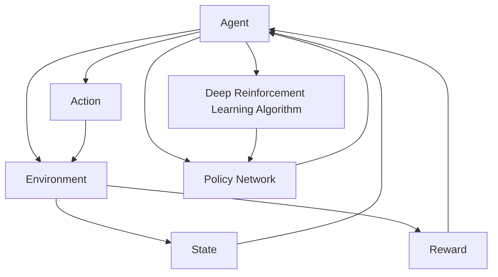

# 深度强化学习在AI Agent长期规划中的应用

> 关键词：深度强化学习、AI Agent、长期规划、马尔可夫决策过程、策略网络

> 摘要：本文深入探讨了深度强化学习在AI Agent长期规划中的应用。首先介绍了相关背景知识，包括目的、预期读者等。接着阐述了深度强化学习和AI Agent长期规划的核心概念及联系，详细讲解了核心算法原理和具体操作步骤，并给出了相应的Python源代码。通过数学模型和公式进一步剖析其理论基础，结合项目实战展示了代码的实际案例和详细解释。还探讨了实际应用场景，推荐了相关的工具和资源。最后总结了未来发展趋势与挑战，提供了常见问题与解答以及扩展阅读和参考资料，旨在为读者全面呈现深度强化学习在AI Agent长期规划中的关键作用和技术细节。

## 1. 背景介绍 
### 1.1 目的和范围
深度强化学习作为人工智能领域的重要分支，在解决复杂决策问题方面展现出了巨大的潜力。AI Agent的长期规划是指在动态、不确定的环境中，Agent能够制定一系列的决策，以实现长期的目标。本文章的目的在于深入探讨深度强化学习如何应用于AI Agent的长期规划中，涵盖了从理论基础到实际应用的各个方面。通过详细的讲解和案例分析，让读者全面了解深度强化学习在这一领域的工作原理、实现方法以及应用场景。

### 1.2 预期读者
本文预期读者包括对人工智能、机器学习、强化学习等领域感兴趣的研究人员、工程师、学生以及技术爱好者。无论是想要深入了解深度强化学习理论的学者，还是希望将其应用于实际项目的开发者，都能从本文中获得有价值的信息和启发。

### 1.3 文档结构概述
本文将按照以下结构进行组织：首先介绍相关背景知识，包括目的、预期读者等；接着阐述深度强化学习和AI Agent长期规划的核心概念及联系，通过文本示意图和Mermaid流程图进行直观展示；然后详细讲解核心算法原理和具体操作步骤，并给出Python源代码；通过数学模型和公式进一步剖析其理论基础，并举例说明；结合项目实战展示代码的实际案例和详细解释；探讨实际应用场景；推荐相关的工具和资源；最后总结未来发展趋势与挑战，提供常见问题与解答以及扩展阅读和参考资料。

### 1.4 术语表
#### 1.4.1 核心术语定义
- **深度强化学习（Deep Reinforcement Learning）**：结合了深度学习和强化学习的方法，利用深度神经网络来近似值函数或策略，以解决复杂的决策问题。
- **AI Agent（人工智能智能体）**：能够感知环境、做出决策并采取行动的智能实体，通过与环境的交互来实现特定的目标。
- **长期规划（Long - term Planning）**：在动态、不确定的环境中，为了实现长期目标而制定一系列决策的过程。
- **马尔可夫决策过程（Markov Decision Process，MDP）**：一种用于描述决策过程的数学模型，其中当前状态的转移只依赖于当前状态和采取的行动，而与历史状态无关。
- **策略网络（Policy Network）**：在深度强化学习中，用于生成智能体行动策略的深度神经网络。

#### 1.4.2 相关概念解释
- **状态（State）**：环境在某一时刻的描述，智能体根据当前状态来做出决策。
- **行动（Action）**：智能体在某一状态下可以采取的操作。
- **奖励（Reward）**：环境根据智能体的行动给予的反馈，用于衡量行动的好坏。
- **值函数（Value Function）**：用于评估在某个状态下智能体未来可能获得的累计奖励。

#### 1.4.3 缩略词列表
- **MDP**：Markov Decision Process（马尔可夫决策过程）
- **DQN**：Deep Q - Network（深度Q网络）
- **A2C**：Advantage Actor - Critic（优势演员 - 评论家算法）
- **PPO**：Proximal Policy Optimization（近端策略优化算法）

## 2. 核心概念与联系 

### 深度强化学习原理
深度强化学习是强化学习与深度学习的结合。强化学习的核心是智能体与环境的交互，智能体在环境中感知状态，采取行动，环境根据行动给予奖励反馈，智能体的目标是通过不断学习来最大化长期累积奖励。深度学习则提供了强大的函数逼近能力，通过深度神经网络来近似值函数或策略。

### AI Agent长期规划的概念
AI Agent的长期规划要求智能体不仅要考虑当前的奖励，还要考虑未来的长期利益。在复杂的环境中，短期的最优行动可能会导致长期的不良后果，因此需要智能体能够进行前瞻性的决策。

### 两者的联系
深度强化学习为AI Agent的长期规划提供了有效的解决方案。通过深度神经网络，智能体可以学习到复杂环境中的状态表示和最优策略，从而实现长期规划的目标。例如，在一个机器人导航任务中，深度强化学习可以帮助机器人学习到如何在复杂的环境中规划路径，以最快的速度到达目标位置，同时避免碰撞障碍物。

### 文本示意图
深度强化学习与AI Agent长期规划的关系可以用以下文本示意图表示：

智能体（Agent）在环境（Environment）中感知状态（State），根据策略网络（Policy Network）选择行动（Action），环境根据行动给予奖励（Reward）。智能体通过深度强化学习算法不断更新策略网络，以最大化长期累积奖励，从而实现长期规划的目标。

### Mermaid流程图


## 3. 核心算法原理 & 具体操作步骤 

### 深度Q网络（DQN）算法原理
深度Q网络（DQN）是深度强化学习中的经典算法，它通过一个深度神经网络来近似Q值函数。Q值函数 $Q(s, a)$ 表示在状态 $s$ 下采取行动 $a$ 后，智能体未来可能获得的累计奖励。

DQN的目标是学习一个最优的Q值函数 $Q^*(s, a)$，使得智能体在每个状态下都能选择具有最大Q值的行动。为了实现这一目标，DQN使用了经验回放和目标网络两个关键技术。

经验回放是指将智能体与环境的交互数据（状态、行动、奖励、下一状态）存储在一个经验池中，然后随机从经验池中采样数据来训练Q网络。这样可以打破数据之间的相关性，提高训练的稳定性。

目标网络是一个与Q网络结构相同的网络，其参数定期从Q网络中复制。在计算目标Q值时，使用目标网络来减少训练过程中的波动。

### DQN算法的Python实现

```python
import numpy as np
import torch
import torch.nn as nn
import torch.optim as optim
import random
from collections import deque

# 定义Q网络
class QNetwork(nn.Module):
    def __init__(self, state_size, action_size):
        super(QNetwork, self).__init__()
        self.fc1 = nn.Linear(state_size, 64)
        self.fc2 = nn.Linear(64, 64)
        self.fc3 = nn.Linear(64, action_size)

    def forward(self, x):
        x = torch.relu(self.fc1(x))
        x = torch.relu(self.fc2(x))
        return self.fc3(x)

# 定义DQN智能体
class DQNAgent:
    def __init__(self, state_size, action_size):
        self.state_size = state_size
        self.action_size = action_size
        self.memory = deque(maxlen=2000)
        self.gamma = 0.95  # 折扣因子
        self.epsilon = 1.0  # 探索率
        self.epsilon_min = 0.01
        self.epsilon_decay = 0.995
        self.learning_rate = 0.001
        self.model = QNetwork(state_size, action_size)
        self.target_model = QNetwork(state_size, action_size)
        self.optimizer = optim.Adam(self.model.parameters(), lr=self.learning_rate)
        self.criterion = nn.MSELoss()

    def remember(self, state, action, reward, next_state, done):
        self.memory.append((state, action, reward, next_state, done))

    def act(self, state):
        if np.random.rand() <= self.epsilon:
            return random.randrange(self.action_size)
        state = torch.FloatTensor(state).unsqueeze(0)
        act_values = self.model(state)
        action = np.argmax(act_values.detach().numpy())
        return action

    def replay(self, batch_size):
        minibatch = random.sample(self.memory, batch_size)
        for state, action, reward, next_state, done in minibatch:
            state = torch.FloatTensor(state).unsqueeze(0)
            next_state = torch.FloatTensor(next_state).unsqueeze(0)
            target = self.model(state).detach()
            if done:
                target[0][action] = reward
            else:
                t = self.target_model(next_state).detach()
                target[0][action] = reward + self.gamma * torch.max(t)
            self.optimizer.zero_grad()
            output = self.model(state)
            loss = self.criterion(output, target)
            loss.backward()
            self.optimizer.step()
        if self.epsilon > self.epsilon_min:
            self.epsilon *= self.epsilon_decay

    def update_target_model(self):
        self.target_model.load_state_dict(self.model.state_dict())
```

### 具体操作步骤
1. **初始化**：初始化Q网络和目标网络，设置超参数（如折扣因子、探索率、学习率等），初始化经验池。
2. **与环境交互**：智能体在环境中感知状态，根据当前的探索率选择行动（随机行动或根据Q网络选择最优行动），执行行动并获得奖励和下一状态。
3. **存储经验**：将状态、行动、奖励、下一状态和是否结束的信息存储到经验池中。
4. **经验回放**：从经验池中随机采样一批数据，计算目标Q值，更新Q网络的参数。
5. **更新目标网络**：定期将Q网络的参数复制到目标网络中。
6. **重复步骤2 - 5**：不断与环境交互，更新Q网络和目标网络，直到达到训练终止条件。

## 4. 数学模型和公式 & 详细讲解 & 举例说明 

### 马尔可夫决策过程（MDP）
马尔可夫决策过程是强化学习的数学基础，它可以用一个五元组 $(S, A, P, R, \gamma)$ 来表示：
- $S$：状态集合，表示环境可能处于的所有状态。
- $A$：行动集合，表示智能体在每个状态下可以采取的所有行动。
- $P(s'|s, a)$：状态转移概率，表示在状态 $s$ 下采取行动 $a$ 后，环境转移到状态 $s'$ 的概率。
- $R(s, a, s')$：奖励函数，表示在状态 $s$ 下采取行动 $a$ 并转移到状态 $s'$ 后，智能体获得的奖励。
- $\gamma$：折扣因子，取值范围为 $[0, 1]$，用于衡量未来奖励的重要性。

### 值函数
值函数是强化学习中的重要概念，用于评估在某个状态下智能体未来可能获得的累计奖励。主要有两种值函数：
- **状态值函数 $V^\pi(s)$**：表示在策略 $\pi$ 下，从状态 $s$ 开始，智能体未来可能获得的累计折扣奖励的期望，其数学公式为：
$$V^\pi(s) = \mathbb{E}_\pi\left[\sum_{t = 0}^{\infty}\gamma^tR_{t + 1}|S_0 = s\right]$$
- **动作值函数 $Q^\pi(s, a)$**：表示在策略 $\pi$ 下，从状态 $s$ 开始，采取行动 $a$ 后，智能体未来可能获得的累计折扣奖励的期望，其数学公式为：
$$Q^\pi(s, a) = \mathbb{E}_\pi\left[\sum_{t = 0}^{\infty}\gamma^tR_{t + 1}|S_0 = s, A_0 = a\right]$$

### 贝尔曼方程
贝尔曼方程描述了值函数的递归关系，对于状态值函数和动作值函数，分别有以下贝尔曼方程：
- **状态值函数的贝尔曼方程**：
$$V^\pi(s) = \sum_{a\in A}\pi(a|s)\sum_{s'\in S}P(s'|s, a)\left[R(s, a, s')+\gamma V^\pi(s')\right]$$
- **动作值函数的贝尔曼方程**：
$$Q^\pi(s, a) = \sum_{s'\in S}P(s'|s, a)\left[R(s, a, s')+\gamma\sum_{a'\in A}\pi(a'|s')Q^\pi(s', a')\right]$$

### 最优值函数和最优策略
最优状态值函数 $V^*(s)$ 和最优动作值函数 $Q^*(s, a)$ 分别定义为所有策略下的最大状态值函数和最大动作值函数：
$$V^*(s)=\max_{\pi}V^\pi(s)$$
$$Q^*(s, a)=\max_{\pi}Q^\pi(s, a)$$

最优策略 $\pi^*$ 是使得值函数达到最优的策略，即：
$$\pi^*(a|s)=\begin{cases}1, & a = \arg\max_{a\in A}Q^*(s, a)\\0, & otherwise\end{cases}$$

### 举例说明
考虑一个简单的网格世界环境，智能体的目标是从起点移动到终点。状态 $s$ 表示智能体在网格中的位置，行动 $a$ 包括上下左右四个方向的移动。奖励函数 $R(s, a, s')$ 定义为：如果智能体到达终点，获得奖励 +10；如果智能体撞到墙壁，获得奖励 -1；其他情况获得奖励 0。

假设折扣因子 $\gamma = 0.9$，初始状态 $s_0$ 为起点。智能体在状态 $s_0$ 下选择行动 $a_0$ 向右移动，转移到状态 $s_1$，获得奖励 $R(s_0, a_0, s_1) = 0$。根据贝尔曼方程，状态值函数 $V(s_0)$ 可以通过以下方式计算：

首先，计算在策略 $\pi$ 下，从状态 $s_0$ 采取行动 $a_0$ 后的后续状态的状态值函数 $V(s_1)$。假设 $V(s_1)$ 已经计算得到，那么：

$$V(s_0)=\sum_{a\in A}\pi(a|s_0)\sum_{s'\in S}P(s'|s_0, a)\left[R(s_0, a, s') + 0.9V(s')\right]$$

如果智能体的策略是随机选择行动，即 $\pi(a|s_0)=\frac{1}{4}$ 对于所有的行动 $a$，那么可以根据状态转移概率 $P(s'|s_0, a)$ 和奖励函数 $R(s_0, a, s')$ 计算出 $V(s_0)$ 的值。

## 5. 项目实战：代码实际案例和详细解释说明 

### 5.1  开发环境搭建
本项目使用Python语言进行开发，需要安装以下库：
- **PyTorch**：用于构建和训练深度神经网络。
- **NumPy**：用于数值计算。
- **Matplotlib**：用于可视化训练过程。

可以使用以下命令安装这些库：
```bash
pip install torch numpy matplotlib
```

### 5.2  源代码详细实现和代码解读
我们将使用OpenAI Gym的CartPole环境来演示深度强化学习在AI Agent长期规划中的应用。CartPole环境中，智能体的目标是通过左右移动小车，保持杆子的平衡。

```python
import gym
import numpy as np
import torch
import torch.nn as nn
import torch.optim as optim
import random
from collections import deque
import matplotlib.pyplot as plt

# 定义Q网络
class QNetwork(nn.Module):
    def __init__(self, state_size, action_size):
        super(QNetwork, self).__init__()
        self.fc1 = nn.Linear(state_size, 64)
        self.fc2 = nn.Linear(64, 64)
        self.fc3 = nn.Linear(64, action_size)

    def forward(self, x):
        x = torch.relu(self.fc1(x))
        x = torch.relu(self.fc2(x))
        return self.fc3(x)

# 定义DQN智能体
class DQNAgent:
    def __init__(self, state_size, action_size):
        self.state_size = state_size
        self.action_size = action_size
        self.memory = deque(maxlen=2000)
        self.gamma = 0.95  # 折扣因子
        self.epsilon = 1.0  # 探索率
        self.epsilon_min = 0.01
        self.epsilon_decay = 0.995
        self.learning_rate = 0.0