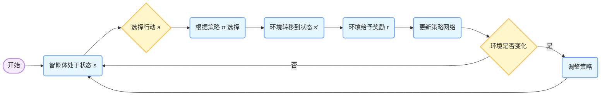

# 深度强化学习在动态环境推理适应中的研究

> 关键词：深度强化学习、动态环境、推理适应、马尔可夫决策过程、策略网络

> 摘要：本文围绕深度强化学习在动态环境推理适应中的研究展开。首先介绍了深度强化学习及动态环境的相关背景知识，明确研究的目的、范围与预期读者。接着深入阐述了深度强化学习的核心概念、算法原理，包括使用 Python 代码详细讲解关键算法。通过数学模型和公式对相关理论进行剖析，并举例说明。然后通过项目实战，展示了在动态环境中深度强化学习的代码实现与解读。探讨了深度强化学习在多个实际场景中的应用，推荐了学习、开发相关的工具和资源，分析了该领域未来的发展趋势与挑战，最后给出常见问题解答及扩展阅读参考资料，旨在全面深入地研究深度强化学习在动态环境中的推理适应能力。

## 1. 背景介绍 
### 1.1 目的和范围
深度强化学习作为机器学习领域的重要分支，在处理复杂决策问题上展现出强大的能力。然而，现实世界中的许多环境是动态变化的，如自动驾驶场景中交通流量的实时变化、机器人在未知环境中的探索等。本研究的目的在于探索深度强化学习如何在动态环境中进行有效的推理和适应，以提高智能体在动态环境中的决策性能和稳定性。研究范围涵盖深度强化学习的基本理论、常见算法在动态环境中的应用，以及通过实际案例验证相关方法的有效性。

### 1.2 预期读者
本文预期读者包括对深度强化学习、人工智能等领域感兴趣的科研人员、工程师、学生等。对于想要深入了解深度强化学习在动态环境中应用的初学者，本文将提供系统的知识讲解；对于有一定基础的专业人士，也可从文中获取关于动态环境推理适应的最新研究成果和实践经验。

### 1.3 文档结构概述
本文首先介绍相关背景知识，包括目的、预期读者等内容。接着阐述深度强化学习的核心概念与联系，通过文本示意图和 Mermaid 流程图进行直观展示。然后详细讲解核心算法原理和具体操作步骤，结合 Python 源代码进行说明。之后介绍相关的数学模型和公式，并举例说明。通过项目实战，展示代码实现和详细解读。探讨深度强化学习在实际应用场景中的应用。推荐学习、开发所需的工具和资源。最后总结未来发展趋势与挑战，给出常见问题解答和扩展阅读参考资料。

### 1.4 术语表
#### 1.4.1 核心术语定义
- **深度强化学习（Deep Reinforcement Learning）**：结合深度学习和强化学习的方法，通过深度神经网络来近似值函数或策略，以解决复杂的决策问题。
- **动态环境（Dynamic Environment）**：环境的状态、规则或奖励机制随时间变化的环境。
- **智能体（Agent）**：在环境中进行决策和行动的实体，通过与环境交互来学习最优策略。
- **策略（Policy）**：智能体在不同状态下选择行动的规则。
- **值函数（Value Function）**：评估智能体在某个状态或状态 - 行动对下的长期价值。

#### 1.4.2 相关概念解释
- **马尔可夫决策过程（Markov Decision Process，MDP）**：是描述强化学习问题的数学模型，由状态集合、行动集合、状态转移概率、奖励函数和折扣因子组成。在 MDP 中，智能体的决策仅依赖于当前状态，而与历史状态无关。
- **经验回放（Experience Replay）**：一种用于深度强化学习的训练技巧，将智能体与环境交互的经验存储在经验池中，训练时随机从经验池中采样进行学习，以提高数据的利用率和训练的稳定性。
- **探索与利用（Exploration and Exploitation）**：智能体在学习过程中需要在探索新的行动以发现更优策略和利用已有的经验之间进行平衡。

#### 1.4.3 缩略词列表
- **MDP**：Markov Decision Process（马尔可夫决策过程）
- **DQN**：Deep Q - Network（深度 Q 网络）
- **A2C**：Advantage Actor - Critic（优势行动者 - 评论者）
- **PPO**：Proximal Policy Optimization（近端策略优化）

## 2. 核心概念与联系 

### 深度强化学习核心概念原理
深度强化学习是强化学习与深度学习的结合。强化学习的基本框架基于智能体与环境的交互，智能体在环境中处于某个状态 $s$，根据策略 $\pi$ 选择一个行动 $a$，环境根据状态转移概率 $P(s'|s, a)$ 转移到下一个状态 $s'$，并给予智能体一个奖励 $r$。智能体的目标是学习一个最优策略 $\pi^*$，使得长期累积奖励最大化。

深度学习则为强化学习提供了强大的函数逼近能力。通过深度神经网络，可以近似值函数或策略。例如，在深度 Q 网络（DQN）中，使用一个深度神经网络 $Q(s, a; \theta)$ 来近似最优动作值函数 $Q^*(s, a)$，其中 $\theta$ 是网络的参数。

### 动态环境的特点
动态环境与静态环境不同，其状态、规则或奖励机制会随时间变化。例如，在一个机器人导航任务中，环境中的障碍物可能会移动，或者目标位置可能会改变。这种动态性增加了智能体学习和决策的难度，因为智能体需要不断适应环境的变化。

### 深度强化学习与动态环境的联系
深度强化学习为智能体在动态环境中进行推理和适应提供了一种有效的方法。通过不断与环境交互，智能体可以学习到环境的动态变化规律，并根据当前环境状态调整自己的策略。例如，在一个自动驾驶场景中，车辆可以通过深度强化学习算法，根据实时的交通流量、道路状况等信息，调整自己的行驶速度和路线。

### 文本示意图
```plaintext
智能体 <------ 状态、奖励 ------ 环境
  |                             |
  | 行动                         | 状态转移
  |                             |
  V                             V
策略网络（深度学习模型） <---- 训练
```

### Mermaid 流程图


## 3. 核心算法原理 & 具体操作步骤 

### 深度 Q 网络（DQN）算法原理
深度 Q 网络（DQN）是深度强化学习中的经典算法，其核心思想是使用一个深度神经网络 $Q(s, a; \theta)$ 来近似最优动作值函数 $Q^*(s, a)$。智能体通过与环境交互，收集经验 $(s, a, r, s')$ 并存储在经验池中。训练时，从经验池中随机采样一批经验，计算目标值 $y = r + \gamma \max_{a'} Q(s', a'; \theta^-)$，其中 $\gamma$ 是折扣因子，$\theta^-$ 是目标网络的参数。然后使用均方误差损失函数 $L(\theta) = \frac{1}{N} \sum_{i=1}^{N} (y_i - Q(s_i, a_i; \theta))^2$ 来更新网络参数 $\theta$。

### Python 代码实现
```python
import numpy as np
import torch
import torch.nn as nn
import torch.optim as optim
import random

# 定义 Q 网络
class QNetwork(nn.Module):
    def __init__(self, input_dim, output_dim):
        super(QNetwork, self).__init__()
        self.fc1 = nn.Linear(input_dim, 64)
        self.fc2 = nn.Linear(64, 64)
        self.fc3 = nn.Linear(64, output_dim)

    def forward(self, x):
        x = torch.relu(self.fc1(x))
        x = torch.relu(self.fc2(x))
        return self.fc3(x)

# 定义 DQN 智能体
class DQNAgent:
    def __init__(self, input_dim, output_dim, learning_rate=0.001, gamma=0.99, epsilon=1.0, epsilon_decay=0.995, epsilon_min=0.01, batch_size=64, memory_size=10000):
        self.input_dim = input_dim
        self.output_dim = output_dim
        self.learning_rate = learning_rate
        self.gamma = gamma
        self.epsilon = epsilon
        self.epsilon_decay = epsilon_decay
        self.epsilon_min = epsilon_min
        self.batch_size = batch_size
        self.memory = []
        self.memory_size = memory_size

        self.q_network = QNetwork(input_dim, output_dim)
        self.target_network = QNetwork(input_dim, output_dim)
        self.target_network.load_state_dict(self.q_network.state_dict())
        self.optimizer = optim.Adam(self.q_network.parameters(), lr=learning_rate)

    def remember(self, state, action, reward, next_state, done):
        if len(self.memory) > self.memory_size:
            self.memory.pop(0)
        self.memory.append((state, action, reward, next_state, done))

    def act(self, state):
        if np.random.rand() <= self.epsilon:
            return random.randrange(self.output_dim)
        state = torch.FloatTensor(state).unsqueeze(0)
        q_values = self.q_network(state)
        action = torch.argmax(q_values, dim=1).item()
        return action

    def replay(self):
        if len(self.memory) < self.batch_size:
            return
        minibatch = random.sample(self.memory, self.batch_size)
        states, actions, rewards, next_states, dones = zip(*minibatch)

        states = torch.FloatTensor(states)
        actions = torch.LongTensor(actions)
        rewards = torch.FloatTensor(rewards)
        next_states = torch.FloatTensor(next_states)
        dones = torch.FloatTensor(dones)

        q_values = self.q_network(states)
        next_q_values = self.target_network(next_states)
        max_next_q_values = torch.max(next_q_values, dim=1)[0]
        targets = q_values.clone()
        for i in range(self.batch_size):
            if dones[i]:
                targets[i][actions[i]] = rewards[i]
            else:
                targets[i][actions[i]] = rewards[i] + self.gamma * max_next_q_values[i]

        loss = nn.MSELoss()(self.q_network(states), targets)
        self.optimizer.zero_grad()
        loss.backward()
        self.optimizer.step()

        if self.epsilon > self.epsilon_min:
            self.epsilon *= self.epsilon_decay

    def update_target_network(self):
        self.target_network.load_state_dict(self.q_network.state_dict())
```

### 具体操作步骤
1. **初始化**：初始化 Q 网络和目标网络的参数，设置超参数（如学习率、折扣因子、探索率等），初始化经验池。
2. **交互阶段**：智能体在环境中进行交互，根据当前策略选择行动，执行行动并观察环境的反馈（状态、奖励），将经验 $(s, a, r, s')$ 存储在经验池中。
3. **训练阶段**：从经验池中随机采样一批经验，计算目标值，使用均方误差损失函数更新 Q 网络的参数。
4. **更新目标网络**：定期更新目标网络的参数，使其与 Q 网络的参数一致。
5. **重复步骤 2 - 4**：不断重复交互和训练过程，直到智能体学习到最优策略。

## 4. 数学模型和公式 & 详细讲解 & 举例说明 

### 马尔可夫决策过程（MDP）
马尔可夫决策过程是描述强化学习问题的数学模型，由一个五元组 $(S, A, P, R, \gamma)$ 组成，其中：
- $S$ 是状态集合，表示环境可能处于的所有状态。
- $A$ 是行动集合，表示智能体可以采取的所有行动。
- $P(s'|s, a)$ 是状态转移概率，表示在状态 $s$ 下采取行动 $a$ 后转移到状态 $s'$ 的概率。
- $R(s, a, s')$ 是奖励函数，表示在状态 $s$ 下采取行动 $a$ 并转移到状态 $s'$ 时智能体获得的奖励。
- $\gamma \in [0, 1]$ 是折扣因子，用于衡量未来奖励的重要性。

### 值函数
值函数用于评估智能体在某个状态或状态 - 行动对下的长期价值。常见的值函数包括状态值函数 $V^\pi(s)$ 和动作值函数 $Q^\pi(s, a)$。

- **状态值函数**：$V^\pi(s) = \mathbb{E}_\pi \left[ \sum_{t=0}^{\infty} \gamma^t r_t | s_0 = s \right]$，表示在策略 $\pi$ 下，从状态 $s$ 开始的长期累积奖励的期望值。
- **动作值函数**：$Q^\pi(s, a) = \mathbb{E}_\pi \left[ \sum_{t=0}^{\infty} \gamma^t r_t | s_0 = s, a_0 = a \right]$，表示在策略 $\pi$ 下，从状态 $s$ 采取行动 $a$ 开始的长期累积奖励的期望值。

### 贝尔曼方程
贝尔曼方程是强化学习中的重要方程，用于描述值函数的递归关系。

- **状态值函数的贝尔曼方程**：$V^\pi(s) = \sum_{a \in A} \pi(a|s) \sum_{s' \in S} P(s'|s, a) \left[ R(s, a, s') + \gamma V^\pi(s') \right]$
- **动作值函数的贝尔曼方程**：$Q^\pi(s, a) = \sum_{s' \in S} P(s'|s, a) \left[ R(s, a, s') + \gamma \sum_{a' \in A} \pi(a'|s') Q^\pi(s', a') \right]$

### 最优值函数和最优策略
最优状态值函数 $V^*(s)$ 和最优动作值函数 $Q^*(s, a)$ 定义为：
- $V^*(s) = \max_{\pi} V^\pi(s)$
- $Q^*(s, a) = \max_{\pi} Q^\pi(s, a)$

最优策略 $\pi^*$ 可以通过最优动作值函数得到：$\pi^*(a|s) = \begin{cases} 1, & \text{if } a = \arg \max_{a'} Q^*(s, a') \\ 0, & \text{otherwise} \end{cases}$

### 举例说明
考虑一个简单的网格世界环境，智能体的目标是从起点到达终点。环境的状态是智能体在网格中的位置，行动包括上下左右移动。奖励设置为：到达终点获得 +10 奖励，撞到障碍物获得 -1 奖励，其他情况获得 0 奖励。

假设智能体处于状态 $s$，可以采取行动 $a_1$ 和 $a_2$。如果采取行动 $a_1$，有 0.8 的概率转移到状态 $s_1$，获得奖励 $r_1 = 0$，有 0.2 的概率转移到状态 $s_2$，获得奖励 $r_2 = -1$；如果采取行动 $a_2$，有 0.6 的概率转移到状态 $s_3$，获得奖励 $r_3 = 0$，有 0.4 的概率转移到状态 $s_4$，获得奖励 $r_4 = 0$。假设折扣因子 $\gamma = 0.9$。

则动作值函数 $Q(s, a_1)$ 可以计算为：
$Q(s, a_1) = 0.8 \times (0 + 0.9 \times V(s_1)) + 0.2 \times (-1 + 0.9 \times V(s_2))$

通过不断迭代贝尔曼方程，可以计算出最优值函数和最优策略。

## 5. 项目实战：代码实际案例和详细解释说明 

### 5.1  开发环境搭建
#### 安装 Python
首先需要安装 Python 3.x 版本，可以从 Python 官方网站（https://www.python.org/downloads/） 下载并安装。

#### 安装依赖库
本项目需要使用 PyTorch、NumPy 等库，可以使用以下命令进行安装：
```bash
pip install torch numpy
```

### 5.2  源代码详细实现和代码解读
以下是一个使用 DQN 算法解决 CartPole 环境问题的完整代码示例：
```python
import gym
import numpy as np
import torch
import torch.nn as nn
import torch.optim as optim
import random

# 定义 Q 网络
class QNetwork(nn.Module):
    def __init__(