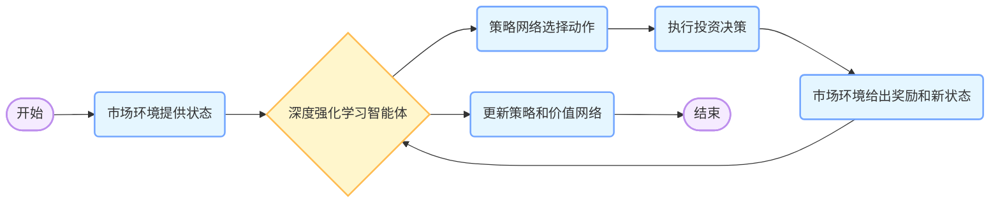

# 深度强化学习在动态风险预算中的应用

> 关键词：深度强化学习、动态风险预算、金融风险、策略优化、马尔可夫决策过程

> 摘要：本文深入探讨了深度强化学习在动态风险预算中的应用。首先介绍了相关背景知识，包括目的、预期读者等。接着阐述了深度强化学习和动态风险预算的核心概念及联系，给出了原理和架构的示意图与流程图。详细讲解了核心算法原理，并用Python代码进行阐述，同时介绍了相关数学模型和公式。通过项目实战展示了代码的实际案例并进行详细解释。分析了深度强化学习在动态风险预算中的实际应用场景，推荐了学习、开发相关的工具和资源，最后总结了未来发展趋势与挑战，解答了常见问题，并提供了扩展阅读和参考资料。

## 1. 背景介绍 
### 1.1 目的和范围
在金融领域，风险预算是一个至关重要的概念。传统的风险预算方法往往基于静态模型，难以适应市场的动态变化。深度强化学习作为一种强大的机器学习技术，具有在动态环境中进行决策和优化的能力。本文的目的是研究如何将深度强化学习应用于动态风险预算，以提高风险预算的准确性和适应性。

本文的范围涵盖了深度强化学习和动态风险预算的基本概念、核心算法原理、数学模型、实际应用案例以及相关工具和资源的推荐。通过理论分析和实际案例的结合，为读者提供一个全面的了解深度强化学习在动态风险预算中应用的视角。

### 1.2 预期读者
本文的预期读者包括金融领域的从业者，如投资经理、风险分析师等，他们希望了解如何利用先进的技术来优化风险预算策略。同时，也适合机器学习和人工智能领域的研究人员和开发者，他们对深度强化学习在金融领域的应用感兴趣。此外，对于对金融和技术交叉领域有兴趣的学生和爱好者，本文也提供了一个深入学习的机会。

### 1.3 文档结构概述
本文将按照以下结构进行组织：
1. **背景介绍**：介绍本文的目的、预期读者和文档结构，以及相关术语的定义。
2. **核心概念与联系**：阐述深度强化学习和动态风险预算的核心概念，以及它们之间的联系，并给出原理和架构的示意图与流程图。
3. **核心算法原理 & 具体操作步骤**：详细讲解深度强化学习的核心算法原理，并用Python代码进行阐述。
4. **数学模型和公式 & 详细讲解 & 举例说明**：介绍深度强化学习和动态风险预算的数学模型和公式，并进行详细讲解和举例说明。
5. **项目实战：代码实际案例和详细解释说明**：通过一个实际的项目案例，展示深度强化学习在动态风险预算中的应用，并对代码进行详细解释。
6. **实际应用场景**：分析深度强化学习在动态风险预算中的实际应用场景。
7. **工具和资源推荐**：推荐学习、开发相关的工具和资源，包括书籍、在线课程、技术博客、IDE、调试工具、相关框架和库等。
8. **总结：未来发展趋势与挑战**：总结深度强化学习在动态风险预算中的应用现状，分析未来发展趋势和面临的挑战。
9. **附录：常见问题与解答**：解答读者在阅读本文过程中可能遇到的常见问题。
10. **扩展阅读 & 参考资料**：提供扩展阅读的建议和相关参考资料。

### 1.4 术语表
#### 1.4.1 核心术语定义
- **深度强化学习（Deep Reinforcement Learning）**：结合了深度学习和强化学习的技术，通过神经网络来学习最优的策略，以最大化长期累积奖励。
- **动态风险预算（Dynamic Risk Budgeting）**：根据市场环境的变化动态调整风险预算的过程，以实现风险和收益的平衡。
- **马尔可夫决策过程（Markov Decision Process，MDP）**：一种用于描述动态决策问题的数学模型，其中当前状态的决策只依赖于当前状态，而与历史状态无关。
- **策略（Policy）**：在强化学习中，策略是指智能体在每个状态下选择动作的规则。
- **奖励（Reward）**：智能体在执行某个动作后获得的即时反馈，用于衡量该动作的好坏。
- **价值函数（Value Function）**：用于评估在某个状态下采取某个动作或遵循某个策略的长期价值。

#### 1.4.2 相关概念解释
- **探索与利用（Exploration vs. Exploitation）**：在强化学习中，智能体需要在探索新的动作和利用已有的经验之间进行平衡。探索可以帮助智能体发现更好的策略，而利用则可以最大化当前的奖励。
- **经验回放（Experience Replay）**：一种用于训练深度强化学习模型的技术，通过将智能体的经验存储在经验池中，并随机从中采样进行训练，以提高训练的效率和稳定性。
- **目标网络（Target Network）**：在深度强化学习中，目标网络用于计算目标值，以减少训练过程中的不稳定性。

#### 1.4.3 缩略词列表
- **DQN**：Deep Q-Network，深度Q网络
- **A2C**：Advantage Actor-Critic，优势演员-评论家算法
- **PPO**：Proximal Policy Optimization，近端策略优化算法

## 2. 核心概念与联系 
### 深度强化学习核心概念
深度强化学习是强化学习与深度学习的结合。强化学习的基本框架是智能体（Agent）在环境（Environment）中进行交互，智能体根据当前状态（State）选择动作（Action），环境根据智能体的动作给出奖励（Reward）并转移到下一个状态。智能体的目标是学习一个最优策略，使得长期累积奖励最大化。

深度学习则为强化学习提供了强大的函数逼近能力。通过使用神经网络，深度强化学习可以处理高维的状态和动作空间，从而解决复杂的决策问题。

### 动态风险预算核心概念
动态风险预算是指在金融投资过程中，根据市场环境的变化动态调整风险预算的过程。传统的风险预算方法通常基于静态的风险度量指标，如方差、VaR等，而动态风险预算则考虑了市场的动态变化，能够更灵活地应对不同的市场情况。

### 核心概念联系
深度强化学习与动态风险预算的联系在于，深度强化学习可以用于优化动态风险预算策略。在动态风险预算问题中，市场环境可以看作是强化学习中的环境，投资组合的风险和收益可以看作是奖励，投资决策可以看作是动作。通过深度强化学习算法，智能体可以学习到在不同市场状态下的最优投资策略，从而实现动态风险预算的目标。

### 原理和架构的文本示意图
```plaintext
+----------------+       +----------------+       +----------------+
|    市场环境    |       |    深度强化学习    |       |    投资组合    |
+----------------+       +----------------+       +----------------+
| - 市场数据     |       | - 策略网络       |       | - 资产配置     |
| - 宏观经济指标 | ----> | - 价值网络       | ----> | - 风险暴露     |
| - 行业动态     |       | - 训练算法       |       | - 收益情况     |
+----------------+       +----------------+       +----------------+
```

### Mermaid 流程图


## 3. 核心算法原理 & 具体操作步骤 
### 深度Q网络（DQN）算法原理
深度Q网络（DQN）是一种基于值函数的深度强化学习算法。其核心思想是使用神经网络来近似Q值函数，Q值函数表示在某个状态下采取某个动作的预期累积奖励。

DQN的目标是学习一个最优的Q值函数 $Q^*(s,a)$，使得智能体在每个状态下选择具有最大Q值的动作。具体来说，DQN通过最小化损失函数来更新神经网络的参数：

$$L(\theta) = \mathbb{E}_{(s,a,r,s') \sim U(D)} \left[ \left( r + \gamma \max_{a'} Q(s',a';\theta^-) - Q(s,a;\theta) \right)^2 \right]$$

其中，$\theta$ 是当前Q网络的参数，$\theta^-$ 是目标Q网络的参数，$D$ 是经验回放池，$\gamma$ 是折扣因子。

### DQN算法具体操作步骤
1. **初始化**：初始化Q网络 $Q(s,a;\theta)$ 和目标Q网络 $Q(s,a;\theta^-)$，并将 $\theta^- = \theta$。初始化经验回放池 $D$。
2. **环境交互**：在每个时间步 $t$：
    - 观察当前状态 $s_t$。
    - 根据 $\epsilon$-贪心策略选择动作 $a_t$：
        - 以概率 $\epsilon$ 随机选择一个动作。
        - 以概率 $1 - \epsilon$ 选择具有最大Q值的动作 $\arg\max_{a} Q(s_t,a;\theta)$。
    - 执行动作 $a_t$，并从环境中获得奖励 $r_t$ 和下一个状态 $s_{t+1}$。
    - 将经验 $(s_t,a_t,r_t,s_{t+1})$ 存储到经验回放池 $D$ 中。
3. **经验回放**：从经验回放池 $D$ 中随机采样一个小批量的经验 $(s,a,r,s')$。
4. **计算目标值**：计算目标Q值 $y = r + \gamma \max_{a'} Q(s',a';\theta^-)$。
5. **更新Q网络**：使用梯度下降法更新Q网络的参数 $\theta$，以最小化损失函数 $L(\theta)$。
6. **更新目标Q网络**：每隔一定的时间步，将目标Q网络的参数 $\theta^-$ 更新为当前Q网络的参数 $\theta$。

### Python代码实现
```python
import torch
import torch.nn as nn
import torch.optim as optim
import numpy as np
import random

# 定义Q网络
class QNetwork(nn.Module):
    def __init__(self, state_dim, action_dim):
        super(QNetwork, self).__init__()
        self.fc1 = nn.Linear(state_dim, 64)
        self.fc2 = nn.Linear(64, 64)
        self.fc3 = nn.Linear(64, action_dim)

    def forward(self, x):
        x = torch.relu(self.fc1(x))
        x = torch.relu(self.fc2(x))
        return self.fc3(x)

# 定义DQN智能体
class DQNAgent:
    def __init__(self, state_dim, action_dim, learning_rate=0.001, gamma=0.99, epsilon=1.0, epsilon_decay=0.995, epsilon_min=0.01, batch_size=64, memory_size=10000):
        self.state_dim = state_dim
        self.action_dim = action_dim
        self.learning_rate = learning_rate
        self.gamma = gamma
        self.epsilon = epsilon
        self.epsilon_decay = epsilon_decay
        self.epsilon_min = epsilon_min
        self.batch_size = batch_size
        self.memory = []
        self.memory_size = memory_size

        self.q_network = QNetwork(state_dim, action_dim)
        self.target_network = QNetwork(state_dim, action_dim)
        self.target_network.load_state_dict(self.q_network.state_dict())
        self.optimizer = optim.Adam(self.q_network.parameters(), lr=learning_rate)
        self.criterion = nn.MSELoss()

    def remember(self, state, action, reward, next_state):
        if len(self.memory) > self.memory_size:
            self.memory.pop(0)
        self.memory.append((state, action, reward, next_state))

    def act(self, state):
        if np.random.rand() <= self.epsilon:
            return random.randrange(self.action_dim)
        state = torch.FloatTensor(state).unsqueeze(0)
        q_values = self.q_network(state)
        action = torch.argmax(q_values).item()
        return action

    def replay(self):
        if len(self.memory) < self.batch_size:
            return
        minibatch = random.sample(self.memory, self.batch_size)
        states, actions, rewards, next_states = zip(*minibatch)

        states = torch.FloatTensor(states)
        actions = torch.LongTensor(actions)
        rewards = torch.FloatTensor(rewards)
        next_states = torch.FloatTensor(next_states)

        q_values = self.q_network(states)
        next_q_values = self.target_network(next_states)
        max_next_q_values = torch.max(next_q_values, dim=1)[0]

        targets = q_values.clone()
        for i in range(self.batch_size):
            targets[i][actions[i]] = rewards[i] + self.gamma * max_next_q_values[i]

        self.optimizer.zero_grad()
        loss = self.criterion(q_values, targets)
        loss.backward()
        self.optimizer.step()

        if self.epsilon > self.epsilon_min:
            self.epsilon *= self.epsilon_decay

    def update_target_network(self):
        self.target_network.load_state_dict(self.q_network.state_dict())
```

## 4. 数学模型和公式 & 详细讲解 & 举例说明 
### 马尔可夫决策过程（MDP）
马尔可夫决策过程是强化学习的基础数学模型，它可以用一个五元组 $\langle S, A, P, R, \gamma \rangle$ 来表示：
- $S$ 是状态空间，表示环境的所有可能状态。
- $A$ 是动作空间，表示智能体可以采取的所有可能动作。
- $P(s'|s,a)$ 是状态转移概率，表示在状态 $s$ 下采取动作 $a$ 后转移到状态 $s'$ 的概率。
- $R(s,a)$ 是奖励函数，表示在状态 $s$ 下采取动作 $a$ 后获得的即时奖励。
- $\gamma \in [0,1]$ 是折扣因子，用于衡量未来奖励的重要性。

### 价值函数
在MDP中，有两种重要的价值函数：状态价值函数 $V(s)$ 和动作价值函数 $Q(s,a)$。

状态价值函数 $V(s)$ 表示从状态 $s$ 开始，遵循某个策略 $\pi$ 所能获得的预期累积奖励：

$$V^{\pi}(s) = \mathbb{E}_{\pi} \left[ \sum_{t=0}^{\infty} \gamma^t R(s_t,a_t) \big| s_0 = s \right]$$

动作价值函数 $Q(s,a)$ 表示在状态 $s$ 下采取动作 $a$，然后遵循某个策略 $\pi$ 所能获得的预期累积奖励：

$$Q^{\pi}(s,a) = \mathbb{E}_{\pi} \left[ \sum_{t=0}^{\infty} \gamma^t R(s_t,a_t) \big| s_0 = s, a_0 = a \right]$$

### 最优价值函数和最优策略
最优状态价值函数 $V^*(s)$ 和最优动作价值函数 $Q^*(s,a)$ 分别表示在所有可能策略中能获得的最大预期累积奖励：

$$V^*(s) = \max_{\pi} V^{\pi}(s)$$

$$Q^*(s,a) = \max_{\pi} Q^{\pi}(s,a)$$

最优策略 $\pi^*$ 是指在每个状态下都能选择具有最大Q值的动作的策略：

$$\pi^*(s) = \arg\max_{a} Q^*(s,a)$$

### 贝尔曼方程
贝尔曼方程是价值函数的递归关系，它将当前状态的价值与下一个状态的价值联系起来。

状态价值函数的贝尔曼方程：

$$V^{\pi}(s) = \sum_{a \in A} \pi(a|s) \left[ R(s,a) + \gamma \sum_{s' \in S} P(s'|s,a) V^{\pi}(s') \right]$$

动作价值函数的贝尔曼方程：

$$Q^{\pi}(s,a) = R(s,a) + \gamma \sum_{s' \in S} P(s'|s,a) \sum_{a' \in A} \pi(a'|s') Q^{\pi}(s',a')$$

最优动作价值函数的贝尔曼方程：

$$Q^*(s,a) = R(s,a) + \gamma \sum_{s' \in S} P(s'|s,a) \max_{a'} Q^*(s',a')$$

### 举例说明
假设我们有一个简单的网格世界环境，智能体可以在一个 $3 \times 3$ 的网格中移动，目标是到达右下角的单元格。智能体可以采取四个动作：上、下、左、右。如果智能体到达目标单元格，将获得奖励 $+1$，否则获得奖励 $-0.1$。

状态空间 $S$ 包含 $9$ 个状态，动作空间 $A$ 包含 $4$ 个动作。状态转移概率 $P(s'|s,a)$ 取决于智能体的动作和网格的边界条件。奖励函数 $R(s,a)$ 根据智能体是否到达目标单元格来确定。

我们可以使用深度强化学习算法（如DQN）来学习最优策略，使得智能体能够尽快到达目标单元格。

## 5. 项目实战：代码实际案例和详细解释说明 
### 5.1  开发环境搭建
#### 安装Python
首先，确保你已经安装了Python 3.x 版本。可以从Python官方网站（https://www.python.org/downloads/） 下载并安装。

#### 安装必要的库
使用以下命令安装必要的Python库：
```sh
pip install torch numpy matplotlib
```

### 5.2  源代码详细实现和代码解读
```python
import torch
import torch.nn as nn
import torch.optim as optim
import numpy as np
import random
import matplotlib.pyplot as plt

# 定义Q网络
class QNetwork(nn.Module):
    def __init__(self, state_dim, action_dim):
        super(QNetwork, self).__init__()
        self.fc1 = nn.Linear(state_dim, 64)
        self.fc2 = nn.Linear(64, 64)
        self.fc3 = nn.Linear(64, action_dim)

    def forward(self, x):
        x = torch.relu(self.fc1(x))
        x = torch.relu(self.fc2(x))
        return self.fc3(x)

# 定义DQN智能体
class DQNAgent:
    def __init__(self, state_dim, action_dim, learning_rate=0.001, gamma=0.99, epsilon=1.0, epsilon_decay=0.995, epsilon_min=0.01, batch_size=64, memory_size=10000):
        self.state_dim = state_dim
        self.action_dim = action_dim
        self.learning_rate = learning_rate
        self.gamma = gamma
        self.epsilon = epsilon
        self.epsilon_decay = epsilon_decay
        self.epsilon_min = epsilon_min
        self.batch_size = batch_size
        self.memory = []
        self.memory_size = memory_size

        self.q_network = QNetwork(state_dim, action_dim)
        self.target_network = QNetwork(state_dim, action_dim)
        self.target_network.load_state_dict(self.q_network.state_dict())
        self.optimizer = optim.Adam(self.q_network.parameters(), lr=learning_rate)
        self.criterion = nn.MSELoss()

    def remember(self, state, action, reward, next_state):
        if len(self.memory) > self.memory_size:
            self.memory.pop(0)
        self.memory.append((state, action, reward, next_state))

    def act(self, state):
        if np.random.rand() <= self.epsilon:
            return random.randrange(self.action_dim)
        state = torch.FloatTensor(state).unsqueeze(0)
        q_values = self.q_network(state)
        action = torch.argmax(q_values).item()
        return action

    def replay(self):
        if len(self.memory) < self.batch_size:
            return
        minibatch = random.sample(self.memory, self.batch_size)
        states, actions, rewards, next_states = zip(*minibatch)

        states = torch.FloatTensor(states)
        actions = torch.LongTensor(actions)
        rewards = torch.FloatTensor(rewards)
        next_states = torch.FloatTensor(next_states)

        q_values = self.q_network(states)
        next_q_values = self.target_network(next_states)
        max_next_q_values = torch.max(next_q_values, dim=1)[0]

        targets = q_values.clone()
        for i in range(self.batch_size):
            targets[i][actions[i]] = rewards[i] + self.gamma * max_next_q_values[i]

        self.optimizer.zero_grad()
        loss = self.criterion(q_values, targets)
        loss.backward()
        self.optimizer.step()

        if self.epsilon > self.epsilon_min:
            self.epsilon *= self.epsilon_decay

    def update_target_network(self):
        self.target_network.load_state_dict(self.q_network.state_dict())

# 定义简单的金融环境
class FinancialEnvironment:
    def __init__(self):
        self.state_dim = 2
        self.action_dim = 2
        self.reset()

    def reset(self):
        self.state = np.random.rand(self.state_dim)
        return self.state

    def step(self, action):
        if action == 0:
            reward = np.sum(self.state)
        else:
            reward = -np.sum(self.state)
        next_state = np.random.rand(self.state_dim)
        done = False
        return next_state, reward, done

# 训练智能体
def train_agent(agent, env, episodes=1000):
    total_rewards = []
    for episode in range(episodes):
        state = env.reset()
        total_reward = 0
        done = False
        while not done:
            action = agent.act(state)
            next_state, reward, done = env.step(action)
            agent.remember(state, action, reward, next_state)
            agent.replay()
            state = next_state
            total_reward += reward
        agent.update_target_network()
        total_rewards.append(total_reward)
        if episode % 100 == 0:
            print(f"Episode {episode}: Total Reward = {total_reward}, Epsilon = {agent.epsilon}")
    return total_rewards

# 主函数
if __name__ == "__main__":
    env = FinancialEnvironment()
    state_dim = env.state_dim
    action_dim = env.action_dim
    agent = DQNAgent(state_dim, action_dim)
    total_rewards = train_agent(agent, env)

    # 绘制奖励曲线
    plt.plot(total_rewards)
    plt.xlabel('Episode')
    plt.ylabel('Total Reward')
    plt.title('Training Rewards')
    plt.show()
```

### 5.3  代码解读与分析
#### 代码结构
1. **QNetwork类**：定义了一个简单的三层全连接神经网络，用于近似Q值函数。
2. **DQNAgent类**：实现了DQN智能体的核心功能，包括经验回放、动作选择、网络更新等。
3. **FinancialEnvironment类**：定义了一个简单的金融环境，智能体可以在该环境中进行投资决策。
4. **train_agent函数**：用于训练智能体，通过与环境交互收集经验并更新网络参数。
5. **主函数**：创建环境和智能体，调用train_agent函数进行训练，并绘制奖励曲线。

#### 代码分析
- **QNetwork类**：使用ReLU激活函数增加网络的非线性，最后一层输出每个动作的Q值。
- **DQNAgent类**：
    - `remember` 方法用于将经验存储到经验回放池中。
    - `act` 方法根据 $\epsilon$-贪心策略选择动作。
    - `replay` 方法从经验回放池中随机采样经验，计算目标Q值并更新Q网络的参数。
    - `update_target_network` 方法用于更新目标Q网络的参数。
- **FinancialEnvironment类**：`reset` 方法重置环境状态，`step` 方法根据智能体的动作返回下一个状态、奖励和是否结束的标志。
- **train_agent函数**：在每个回合中，智能体与环境交互，收集经验并更新网络参数。每隔一定的回合更新目标Q网络的参数。
- **主函数**：创建环境和智能体，调用 `train_agent` 函数进行训练，并绘制奖励曲线，以便观察训练过程。

## 6. 实际应用场景 
### 投资组合管理
在投资组合管理中，深度强化学习可以用于动态调整资产配置，以实现风险和收益的平衡。通过将市场环境的各种因素作为状态输入，投资决策作为动作，投资组合的收益和风险作为奖励，深度强化学习智能体可以学习到在不同市场条件下的最优投资策略。

例如，在股票市场中，智能体可以根据股票的价格、成交量、市盈率等因素，动态调整投资组合中不同股票的权重，以最大化投资组合的收益并控制风险。

### 风险管理
深度强化学习可以用于金融机构的风险管理。通过对市场风险、信用风险等进行建模，智能体可以根据不同的风险指标和市场情况，动态调整风险预算。

例如，银行可以使用深度强化学习来管理信贷风险。智能体可以根据借款人的信用评分、收入情况、贷款金额等因素，决定是否批准贷款以及贷款的额度和利率，以控制信贷风险。

### 高频交易
在高频交易中，市场情况瞬息万变，需要快速做出决策。深度强化学习可以用于高频交易策略的优化。智能体可以根据市场的实时数据，如价格、成交量、买卖盘等，快速做出交易决策，以获取利润。

例如，智能体可以在极短的时间内判断是否买入或卖出股票，以捕捉市场的微小波动。

## 7. 工具和资源推荐
### 7.1 学习资源推荐
#### 7.1.1 书籍推荐
- 《强化学习：原理与Python实现》：这本书系统地介绍了强化学习的基本原理和算法，并通过Python代码进行了详细的实现和讲解。
- 《深度学习》：由深度学习领域的三位领军人物Ian Goodfellow、Yoshua Bengio和Aaron Courville撰写，全面介绍了深度学习的理论和实践。
- 《金融机器学习》：介绍了机器学习在金融领域的应用，包括风险预算、投资组合管理等方面的内容。

#### 7.1.2 在线课程
- Coursera上的“强化学习专项课程”：由DeepMind的研究人员授课，涵盖了强化学习的基础知识和高级算法。
- edX上的“深度学习基础”：由纽约大学的教授授课，介绍了深度学习的基本概念和算法。
- Udemy上的“金融科技：使用Python进行算法交易”：介绍了Python在金融交易中的应用，包括强化学习在交易策略中的应用。

#### 7.1.3 技术博客和网站
- OpenAI博客：提供了关于强化学习和人工智能的最新研究成果和应用案例。
- DeepMind博客：分享了DeepMind在强化学习领域的最新研究进展。
- Towards Data Science：一个数据科学和机器学习的社区，有很多关于深度强化学习和金融应用的文章。

### 7.2 开发工具框架推荐
#### 7.2.1 IDE和编辑器
- PyCharm：一款功能强大的Python集成开发环境，提供了代码编辑、调试、版本控制等功能。
- Jupyter Notebook：一个交互式的开发环境，适合进行数据探索和模型实验。
- Visual Studio Code：一款轻量级的代码编辑器，支持多种编程语言和插件，可用于Python开发。

#### 7.2.2 调试和性能分析工具
- TensorBoard：TensorFlow提供的可视化工具，可用于查看模型的训练过程、损失曲线等。
- PyTorch Profiler：PyTorch提供的性能分析工具，可用于分析模型的性能瓶颈。
- cProfile：Python标准库中的性能分析工具，可用于分析Python代码的性能。

#### 7.2.3 相关框架和库
- PyTorch：一个开源的深度学习框架，提供了丰富的神经网络层和优化算法，易于使用和扩展。
- TensorFlow：另一个广泛使用的深度学习框架，具有强大的分布式训练和部署能力。
- Stable Baselines3：一个基于PyTorch的强化学习库，提供了多种强化学习算法的实现和预训练模型。

### 7.3 相关论文著作推荐
#### 7.3.1 经典论文
- “Human-level control through deep reinforcement learning”：由DeepMind发表在Nature上的论文，介绍了深度Q网络（DQN）算法，并在Atari游戏中取得了人类水平的表现。
- “Asynchronous Methods for Deep Reinforcement Learning”：提出了异步优势演员-评论家（A3C）算法，提高了深度强化学习的训练效率。
- “Proximal Policy Optimization Algorithms”：介绍了近端策略优化（PPO）算法，是一种高效的策略梯度算法。

#### 7.3.2 最新研究成果
- 关注顶级学术会议，如NeurIPS、ICML、AAAI等，这些会议上会有很多关于深度强化学习和金融应用的最新研究成果。
- 关注知名学术期刊，如Journal of Financial Economics、Review of Financial Studies等，这些期刊会发表金融领域的前沿研究论文。

#### 7.3.3 应用案例分析
- 许多金融机构和科技公司会发布关于深度强化学习在金融领域应用的案例分析报告，可以通过他们的官方网站或行业媒体获取这些报告。

## 8. 总结：未来发展趋势与挑战
### 未来发展趋势
#### 多智能体强化学习
在金融市场中，存在多个参与者，如投资者、金融机构等。多智能体强化学习可以用于研究多个智能体之间的交互和竞争，从而更好地模拟金融市场的复杂动态。

#### 结合其他技术
深度强化学习可以与其他技术，如自然语言处理、计算机视觉等相结合，以获取更多的市场信息。例如，通过分析新闻文章和社交媒体数据，智能体可以更好地理解市场情绪和趋势。

#### 实际应用拓展
随着技术的不断发展，深度强化学习在金融领域的应用将不断拓展，如保险、养老金管理等领域。

### 面临的挑战
#### 数据质量和数量
深度强化学习需要大量的高质量数据进行训练。在金融领域，数据往往受到隐私和安全的限制，获取足够的数据可能是一个挑战。

#### 模型可解释性
深度强化学习模型通常是黑盒模型，难以解释其决策过程。在金融领域，模型的可解释性非常重要，因为监管机构和投资者需要了解模型的决策依据。

#### 市场不确定性
金融市场具有高度的不确定性，深度强化学习模型在面对突发的市场变化时可能表现不佳。如何提高模型的鲁棒性和适应性是一个亟待解决的问题。

## 9. 附录：常见问题与解答
### 问题1：深度强化学习和传统机器学习有什么区别？
深度强化学习与传统机器学习的主要区别在于学习方式和目标。传统机器学习通常是有监督学习或无监督学习，通过训练数据学习输入和输出之间的映射关系。而深度强化学习是通过智能体与环境的交互，以最大化长期累积奖励为目标，学习最优的策略。

### 问题2：深度强化学习在动态风险预算中的应用有哪些优势？
深度强化学习在动态风险预算中的应用具有以下优势：
- 能够适应市场的动态变化，根据不同的市场状态调整风险预算策略。
- 可以处理高维的状态和动作空间，考虑更多的市场因素。
- 能够自动学习最优的策略，不需要人工手动设计复杂的规则。

### 问题3：如何评估深度强化学习模型在动态风险预算中的性能？
可以使用以下指标来评估深度强化学习模型在动态风险预算中的性能：
- 投资组合的收益率：衡量投资组合的盈利能力。
- 风险指标：如方差、VaR等，衡量投资组合的风险水平。
- 夏普比率：衡量投资组合的风险调整后收益。

### 问题4：深度强化学习模型的训练时间通常有多长？
深度强化学习模型的训练时间取决于多个因素，如模型的复杂度、数据的规模、训练算法等。一般来说，训练时间可能从几小时到几天甚至更长时间不等。可以通过优化算法、使用GPU加速等方法来缩短训练时间。

## 10. 扩展阅读 & 参考资料
### 扩展阅读
- 《强化学习实战》：通过实际案例深入介绍强化学习的应用。
- 《人工智能：现代方法》：全面介绍人工智能的各个领域，包括强化学习。
- 《金融数学》：了解金融领域的数学基础，有助于更好地理解深度强化学习在金融中的应用。

### 参考资料
- Sutton, R. S., & Barto, A. G. (2018). Reinforcement learning: An introduction. MIT press.
- Goodfellow, I., Bengio, Y., & Courville, A. (2016). Deep learning. MIT press.
- Mnih, V., Kavukcuoglu, K., Silver, D., Rusu, A. A., Veness, J., Bellemare, M. G.,... & Petersen, S. (2015). Human-level control through deep reinforcement learning. Nature, 518(7540), 529-533.

作者：AI天才研究院/AI Genius Institute & 禅与计算机程序设计艺术 /Zen And The Art of Computer Programming