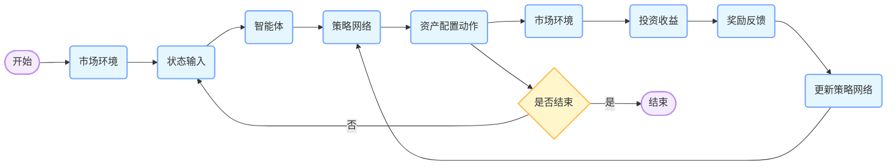

# 深度强化学习在投资组合管理中的应用

> 关键词：深度强化学习、投资组合管理、金融投资、算法交易、智能决策

> 摘要：本文聚焦于深度强化学习在投资组合管理中的应用。详细阐述了深度强化学习与投资组合管理的核心概念及其联系，深入分析了相关核心算法原理并给出具体操作步骤，同时介绍了涉及的数学模型和公式。通过项目实战展示了代码的实际应用和详细解读，探讨了深度强化学习在投资组合管理中的实际应用场景。此外，还推荐了相关的学习资源、开发工具框架以及论文著作。最后对深度强化学习在投资组合管理领域的未来发展趋势与挑战进行了总结，并给出常见问题的解答和扩展阅读参考资料。

## 1. 背景介绍 
### 1.1 目的和范围
投资组合管理的核心目标是在风险和收益之间找到平衡，通过合理配置资产来实现投资者的财务目标。传统的投资组合管理方法主要基于均值 - 方差分析、资本资产定价模型等理论，但这些方法在处理复杂的市场环境和大量的数据时存在一定的局限性。深度强化学习作为一种新兴的人工智能技术，具有强大的学习和决策能力，能够在动态的环境中不断优化策略。本文的目的在于探讨深度强化学习如何应用于投资组合管理，分析其原理、方法和实际效果，为投资者和金融从业者提供新的思路和方法。范围涵盖了深度强化学习的基本概念、核心算法，投资组合管理的基本理论，以及两者结合的具体应用和案例分析。

### 1.2 预期读者
本文的预期读者包括金融领域的从业者，如投资经理、交易员、金融分析师等，他们希望了解深度强化学习在投资组合管理中的应用，以提升投资决策的效率和准确性。同时，也适合人工智能和机器学习领域的研究人员和开发者，他们对金融领域的应用场景感兴趣，希望通过实际案例深入理解深度强化学习的应用。此外，对于有一定金融和编程基础的学生和爱好者，本文也能为他们提供有价值的学习资源。

### 1.3 文档结构概述
本文首先介绍了深度强化学习和投资组合管理的核心概念及其联系，为后续的内容奠定基础。接着详细阐述了核心算法原理和具体操作步骤，并通过 Python 代码进行了实现。然后介绍了相关的数学模型和公式，并通过具体例子进行了说明。在项目实战部分，展示了如何搭建开发环境，实现代码并进行解读分析。之后探讨了深度强化学习在投资组合管理中的实际应用场景。再推荐了相关的学习资源、开发工具框架和论文著作。最后总结了未来发展趋势与挑战，给出常见问题的解答和扩展阅读参考资料。

### 1.4 术语表
#### 1.4.1 核心术语定义
- **深度强化学习（Deep Reinforcement Learning）**：将深度学习的强大表示能力与强化学习的决策能力相结合的一种机器学习方法。通过智能体与环境进行交互，不断尝试不同的动作，根据环境反馈的奖励信号来学习最优策略。
- **投资组合管理（Portfolio Management）**：对投资者的资产进行合理配置和管理的过程，旨在实现投资目标，同时平衡风险和收益。
- **智能体（Agent）**：在深度强化学习中，智能体是一个能够感知环境状态，并根据策略选择动作的实体。在投资组合管理中，智能体可以看作是一个投资决策系统。
- **环境（Environment）**：智能体所处的外部世界，智能体与环境进行交互，环境会根据智能体的动作给出相应的奖励和新的状态。在投资组合管理中，环境可以是金融市场。
- **策略（Policy）**：智能体根据环境状态选择动作的规则。在投资组合管理中，策略决定了如何分配资产。
- **奖励（Reward）**：环境对智能体动作的反馈，用于指导智能体学习最优策略。在投资组合管理中，奖励可以是投资收益。

#### 1.4.2 相关概念解释
- **深度学习（Deep Learning）**：一种基于人工神经网络的机器学习方法，通过构建多层神经网络来学习数据的复杂特征和模式。
- **强化学习（Reinforcement Learning）**：一种通过智能体与环境进行交互，以最大化累积奖励为目标的机器学习方法。
- **均值 - 方差分析（Mean - Variance Analysis）**：一种传统的投资组合管理方法，通过计算资产的预期收益率和方差来衡量收益和风险，从而确定最优投资组合。
- **资本资产定价模型（Capital Asset Pricing Model, CAPM）**：用于描述资产预期收益率与市场风险之间关系的模型，为投资决策提供了理论依据。

#### 1.4.3 缩略词列表
- **DRL**：深度强化学习（Deep Reinforcement Learning）
- **RL**：强化学习（Reinforcement Learning）
- **ANN**：人工神经网络（Artificial Neural Network）
- **Q - learning**：一种基于价值的强化学习算法（Q - learning Algorithm）
- **A2C**：优势演员 - 评论家算法（Advantage Actor - Critic Algorithm）
- **PPO**：近端策略优化算法（Proximal Policy Optimization Algorithm）

## 2. 核心概念与联系 

### 2.1 深度强化学习核心概念
深度强化学习是强化学习与深度学习的结合。强化学习的基本框架由智能体、环境、状态、动作和奖励组成。智能体在环境中感知当前状态 $s_t$，根据策略 $\pi$ 选择动作 $a_t$，环境根据动作给出奖励 $r_t$ 并转移到新的状态 $s_{t + 1}$。智能体的目标是学习一个最优策略 $\pi^*$，使得累积奖励最大化。

深度学习则为强化学习提供了强大的函数逼近能力。通过使用深度神经网络（如多层感知机、卷积神经网络、循环神经网络等），可以对复杂的状态和动作空间进行建模。例如，在处理高维的金融市场数据时，深度神经网络可以自动提取数据中的特征，从而帮助智能体更好地理解环境。

### 2.2 投资组合管理核心概念
投资组合管理的目标是根据投资者的风险偏好和投资目标，将资金分配到不同的资产上，以实现最优的风险 - 收益平衡。常见的资产包括股票、债券、基金、期货等。投资组合管理的主要步骤包括资产选择、资产配置和组合调整。

资产选择是指从众多的资产中挑选出具有投资价值的资产。资产配置是指确定不同资产在投资组合中的比例。组合调整是指根据市场变化和投资者的需求，定期或不定期地调整投资组合的资产配置。

### 2.3 两者的联系
深度强化学习可以为投资组合管理提供更智能、更灵活的决策方法。在投资组合管理中，市场环境是动态变化的，传统的方法往往难以适应这种变化。而深度强化学习的智能体可以通过不断与市场环境进行交互，学习到最优的投资策略。

例如，智能体可以将市场的历史数据、当前的资产价格、宏观经济指标等作为状态输入，根据策略选择不同的资产配置动作。市场根据资产配置的结果给出投资收益作为奖励，智能体根据奖励不断调整策略，以实现长期的投资收益最大化。

### 2.4 核心概念原理和架构的文本示意图
深度强化学习在投资组合管理中的应用架构可以描述如下：

市场环境提供各种市场数据，包括资产价格、交易量、宏观经济指标等，作为智能体的输入状态。智能体内部包含一个深度神经网络，用于学习策略。根据输入状态，智能体通过策略网络选择资产配置动作，如买入、卖出或持有不同的资产。市场环境根据资产配置动作计算投资收益，并将收益作为奖励反馈给智能体。智能体根据奖励更新策略网络的参数，以提高策略的性能。

### 2.5 Mermaid 流程图


## 3. 核心算法原理 & 具体操作步骤 

### 3.1 Q - learning 算法原理及 Python 实现
#### 3.1.1 算法原理
Q - learning 是一种基于价值的强化学习算法，其核心思想是学习一个动作价值函数 $Q(s, a)$，表示在状态 $s$ 下采取动作 $a$ 的预期累积奖励。Q - learning 的更新公式为：

$$Q(s_t, a_t) \leftarrow Q(s_t, a_t) + \alpha [r_t + \gamma \max_{a} Q(s_{t + 1}, a) - Q(s_t, a_t)]$$

其中，$\alpha$ 是学习率，控制每次更新的步长；$\gamma$ 是折扣因子，用于衡量未来奖励的重要性；$r_t$ 是在状态 $s_t$ 采取动作 $a_t$ 后获得的即时奖励。

#### 3.1.2 Python 实现
```python
import numpy as np

class QLearningAgent:
    def __init__(self, state_size, action_size, learning_rate=0.1, discount_factor=0.9):
        self.state_size = state_size
        self.action_size = action_size
        self.learning_rate = learning_rate
        self.discount_factor = discount_factor
        self.q_table = np.zeros((state_size, action_size))

    def choose_action(self, state, epsilon=0.1):
        if np.random.uniform(0, 1) < epsilon:
            # 探索：随机选择动作
            action = np.random.choice(self.action_size)
        else:
            # 利用：选择 Q 值最大的动作
            action = np.argmax(self.q_table[state, :])
        return action

    def update_q_table(self, state, action, reward, next_state):
        # 根据 Q - learning 更新公式更新 Q 表
        max_q_next = np.max(self.q_table[next_state, :])
        self.q_table[state, action] += self.learning_rate * (reward + self.discount_factor * max_q_next - self.q_table[state, action])


# 示例使用
state_size = 10
action_size = 3
agent = QLearningAgent(state_size, action_size)
state = 0
action = agent.choose_action(state)
next_state = 1
reward = 1
agent.update_q_table(state, action, reward, next_state)
```

### 3.2 A2C 算法原理及 Python 实现
#### 3.2.1 算法原理
A2C（优势演员 - 评论家算法）是一种基于策略梯度的强化学习算法，结合了演员（Actor）和评论家（Critic）两个网络。演员网络用于学习策略 $\pi(a|s)$，即根据状态 $s$ 选择动作 $a$ 的概率分布；评论家网络用于学习状态价值函数 $V(s)$，表示在状态 $s$ 下的预期累积奖励。

A2C 的目标是最大化累积奖励，通过策略梯度算法更新演员网络的参数，同时使用时序差分学习更新评论家网络的参数。优势函数 $A(s, a) = Q(s, a) - V(s)$ 用于衡量在状态 $s$ 下采取动作 $a$ 相对于平均水平的优势。

#### 3.2.2 Python 实现
```python
import torch
import torch.nn as nn
import torch.optim as optim

# 定义演员网络
class Actor(nn.Module):
    def __init__(self, state_size, action_size):
        super(Actor, self).__init__()
        self.fc1 = nn.Linear(state_size, 64)
        self.fc2 = nn.Linear(64, action_size)
        self.softmax = nn.Softmax(dim=-1)

    def forward(self, x):
        x = torch.relu(self.fc1(x))
        x = self.softmax(self.fc2(x))
        return x

# 定义评论家网络
class Critic(nn.Module):
    def __init__(self, state_size):
        super(Critic, self).__init__()
        self.fc1 = nn.Linear(state_size, 64)
        self.fc2 = nn.Linear(64, 1)

    def forward(self, x):
        x = torch.relu(self.fc1(x))
        x = self.fc2(x)
        return x

# A2C 智能体
class A2CAgent:
    def __init__(self, state_size, action_size, learning_rate_actor=0.001, learning_rate_critic=0.001, gamma=0.99):
        self.state_size = state_size
        self.action_size = action_size
        self.gamma = gamma

        self.actor = Actor(state_size, action_size)
        self.critic = Critic(state_size)

        self.optimizer_actor = optim.Adam(self.actor.parameters(), lr=learning_rate_actor)
        self.optimizer_critic = optim.Adam(self.critic.parameters(), lr=learning_rate_critic)

    def choose_action(self, state):
        state = torch.FloatTensor(state).unsqueeze(0)
        probs = self.actor(state)
        action = torch.multinomial(probs, 1).item()
        return action

    def update(self, state, action, reward, next_state, done):
        state = torch.FloatTensor(state).unsqueeze(0)
        next_state = torch.FloatTensor(next_state).unsqueeze(0)
        reward = torch.FloatTensor([reward])

        value = self.critic(state)
        next_value = self.critic(next_state)

        if done:
            target = reward
        else:
            target = reward + self.gamma * next_value

        advantage = target - value

        # 更新评论家网络
        critic_loss = advantage.pow(2).mean()
        self.optimizer_critic.zero_grad()
        critic_loss.backward(retain_graph=True)
        self.optimizer_critic.step()

        # 更新演员网络
        probs = self.actor(state)
        log_probs = torch.log(probs.squeeze(0))[action]
        actor_loss = -log_probs * advantage.detach()
        self.optimizer_actor.zero_grad()
        actor_loss.backward()
        self.optimizer_actor.step()


# 示例使用
state_size = 10
action_size = 3
agent = A2CAgent(state_size, action_size)
state = np.random.rand(state_size)
action = agent.choose_action(state)
next_state = np.random.rand(state_size)
reward = 1
done = False
agent.update(state, action, reward, next_state, done)
```

### 3.3 PPO 算法原理及 Python 实现
#### 3.3.1 算法原理
PPO（近端策略优化算法）是一种基于策略梯度的强化学习算法，通过限制策略更新的步长来提高算法的稳定性和样本效率。PPO 有两种主要的实现方式：PPO - Clip 和 PPO - Penalty。

PPO - Clip 的目标函数为：

$$L^{CLIP}(\theta) = \hat{\mathbb{E}}_t [\min(r_t(\theta) \hat{A}_t, \text{clip}(r_t(\theta), 1 - \epsilon, 1 + \epsilon) \hat{A}_t)]$$

其中，$r_t(\theta) = \frac{\pi_{\theta}(a_t|s_t)}{\pi_{\theta_{old}}(a_t|s_t)}$ 是新旧策略的概率比，$\hat{A}_t$ 是优势估计，$\epsilon$ 是裁剪参数。

#### 3.3.2 Python 实现
```python
import torch
import torch.nn as nn
import torch.optim as optim
import numpy as np

# 定义策略网络
class PolicyNetwork(nn.Module):
    def __init__(self, state_size, action_size):
        super(PolicyNetwork, self).__init__()
        self.fc1 = nn.Linear(state_size, 64)
        self.fc2 = nn.Linear(64, action_size)
        self.softmax = nn.Softmax(dim=-1)

    def forward(self, x):
        x = torch.relu(self.fc1(x))
        x = self.softmax(self.fc2(x))
        return x

# 定义价值网络
class ValueNetwork(nn.Module):
    def __init__(self, state_size):
        super(ValueNetwork, self).__init__()
        self.fc1 = nn.Linear(state_size, 64)
        self.fc2 = nn.Linear(64, 1)

    def forward(self, x):
        x = torch.relu(self.fc1(x))
        x = self.fc2(x)
        return x

# PPO 智能体
class PPOAgent:
    def __init__(self, state_size, action_size, learning_rate=0.001, gamma=0.99, epsilon=0.2):
        self.state_size = state_size
        self.action_size = action_size
        self.gamma = gamma
        self.epsilon = epsilon

        self.policy = PolicyNetwork(state_size, action_size)
        self.policy_old = PolicyNetwork(state_size, action_size)
        self.policy_old.load_state_dict(self.policy.state_dict())

        self.value = ValueNetwork(state_size)

        self.optimizer_policy = optim.Adam(self.policy.parameters(), lr=learning_rate)
        self.optimizer_value = optim.Adam(self.value.parameters(), lr=learning_rate)

    def choose_action(self, state):
        state = torch.FloatTensor(state).unsqueeze(0)
        probs = self.policy_old(state)
        action = torch.multinomial(probs, 1).item()
        log_prob = torch.log(probs.squeeze(0)[action])
        return action, log_prob

    def update(self, states, actions, log_probs_old, rewards, dones):
        states = torch.FloatTensor(states)
        actions = torch.LongTensor(actions)
        log_probs_old = torch.FloatTensor(log_probs_old)
        rewards = torch.FloatTensor(rewards)
        dones = torch.FloatTensor(dones)

        values = self.value(states).squeeze()
        returns = []
        R = 0
        for r, d in zip(reversed(rewards), reversed(dones)):
            if d:
                R = 0
            R = r + self.gamma * R
            returns.insert(0, R)
        returns = torch.FloatTensor(returns)
        advantages = returns - values

        probs = self.policy(states)
        log_probs = torch.log(probs.gather(1, actions.unsqueeze(1)).squeeze())
        ratio = torch.exp(log_probs - log_probs_old)

        surr1 = ratio * advantages
        surr2 = torch.clamp(ratio, 1 - self.epsilon, 1 + self.epsilon) * advantages
        policy_loss = -torch.min(surr1, surr2).mean()

        value_loss = (returns - self.value(states).squeeze()).pow(2).mean()

        self.optimizer_policy.zero_grad()
        policy_loss.backward(retain_graph=True)
        self.optimizer_policy.step()

        self.optimizer_value.zero_grad()
        value_loss.backward()
        self.optimizer_value.step()

        self.policy_old.load_state_dict(self.policy.state_dict())


# 示例使用
state_size = 10
action_size = 3
agent = PPOAgent(state_size, action_size)
states = []
actions = []
log_probs = []
rewards = []
dones = []
for _ in range(10):
    state = np.random.rand(state_size)
    action, log_prob = agent.choose_action(state)
    next_state = np.random.rand(state_size)
    reward = 1
    done = False
    states.append(state)
    actions.append(action)
    log_probs.append(log_prob)
    rewards.append(reward)
    dones.append(done)
agent.update(states, actions, log_probs, rewards, dones)
```

### 3.4 具体操作步骤
1. **数据准备**：收集金融市场的历史数据，包括资产价格、交易量、宏观经济指标等。对数据进行预处理，如归一化、缺失值处理等。
2. **环境构建**：将金融市场抽象为一个环境，定义状态、动作和奖励。状态可以是市场数据的特征向量，动作可以是资产配置的决策，奖励可以是投资收益。
3. **智能体初始化**：选择合适的深度强化学习算法，如 Q - learning、A2C 或 PPO，初始化智能体的网络参数。
4. **训练过程**：智能体与环境进行交互，根据当前状态选择动作，环境根据动作给出奖励和新的状态。智能体根据奖励更新策略网络的参数，不断学习最优策略。
5. **评估和优化**：在训练过程中，定期评估智能体的性能，如计算投资组合的收益率、夏普比率等。根据评估结果调整算法的超参数，如学习率、折扣因子等，以提高智能体的性能。

## 4. 数学模型和公式 & 详细讲解 & 举例说明 

### 4.1 投资组合收益和风险的数学模型
#### 4.1.1 投资组合收益
假设投资组合中有 $n$ 种资产，第 $i$ 种资产的权重为 $w_i$，其收益率为 $r_i$，则投资组合的收益率 $R_p$ 为：

$$R_p = \sum_{i = 1}^{n} w_i r_i$$

其中，$\sum_{i = 1}^{n} w_i = 1$。

例如，一个投资组合包含三种资产，权重分别为 $w_1 = 0.3$，$w_2 = 0.4$，$w_3 = 0.3$，三种资产的收益率分别为 $r_1 = 0.1$，$r_2 = 0.05$，$r_3 = 0.08$，则投资组合的收益率为：

$$R_p = 0.3\times0.1 + 0.4\times0.05 + 0.3\times0.08 = 0.074$$

#### 4.1.2 投资组合风险（方差）
投资组合的风险通常用方差 $\sigma_p^2$ 来衡量，其计算公式为：

$$\sigma_p^2 = \sum_{i = 1}^{n} \sum_{j = 1}^{n} w_i w_j \sigma_{ij}$$

其中，$\sigma_{ij}$ 是资产 $i$ 和资产 $j$ 的协方差。当 $i = j$ 时，$\sigma_{ii} = \sigma_i^2$ 是资产 $i$ 的方差。

例如，对于一个包含两种资产的投资组合，权重分别为 $w_1 = 0.5$，$w_2 = 0.5$，资产 1 的方差为 $\sigma_1^2 = 0.04$，资产 2 的方差为 $\sigma_2^2 = 0.09$，资产 1 和资产 2 的协方差为 $\sigma_{12} = 0.02$，则投资组合的方差为：

$$\sigma_p^2 = 0.5^2\times0.04 + 0.5^2\times0.09 + 2\times0.5\times0.5\times0.02 = 0.0325$$

### 4.2 深度强化学习中的数学模型
#### 4.2.1 价值函数
在深度强化学习中，价值函数用于衡量状态或状态 - 动作对的价值。常见的价值函数有状态价值函数 $V(s)$ 和动作价值函数 $Q(s, a)$。

状态价值函数 $V(s)$ 表示从状态 $s$ 开始，遵循策略 $\pi$ 所能获得的预期累积奖励：

$$V^{\pi}(s) = \mathbb{E}_{\pi} \left[ \sum_{t = 0}^{\infty} \gamma^t r_t | s_0 = s \right]$$

动作价值函数 $Q(s, a)$ 表示在状态 $s$ 下采取动作 $a$，然后遵循策略 $\pi$ 所能获得的预期累积奖励：

$$Q^{\pi}(s, a) = \mathbb{E}_{\pi} \left[ \sum_{t = 0}^{\infty} \gamma^t r_t | s_0 = s, a_0 = a \right]$$

其中，$\gamma \in [0, 1]$ 是折扣因子。

#### 4.2.2 策略梯度
策略梯度算法通过最大化累积奖励来更新策略网络的参数。策略梯度的计算公式为：

$$\nabla_{\theta} J(\theta) = \mathbb{E}_{\pi_{\theta}} \left[ \nabla_{\theta} \log \pi_{\theta}(a|s) A^{\pi_{\theta}}(s, a) \right]$$

其中，$J(\theta)$ 是策略的目标函数，$\pi_{\theta}(a|s)$ 是策略网络输出的动作概率分布，$A^{\pi_{\theta}}(s, a)$ 是优势函数。

### 4.3 深度强化学习在投资组合管理中的应用公式
#### 4.3.1 奖励设计
在投资组合管理中，奖励可以设计为投资组合的收益率，即：

$$r_t = R_{p,t} - R_{p,t - 1}$$

其中，$R_{p,t}$ 是时刻 $t$ 的投资组合收益率。

#### 4.3.2 状态表示
状态可以用市场数据的特征向量表示，例如：

$$s_t = [p_{1,t}, p_{2,t}, \cdots, p_{n,t}, v_{1,t}, v_{2,t}, \cdots, v_{n,t}, m_1, m_2, \cdots, m_k]$$

其中，$p_{i,t}$ 是第 $i$ 种资产在时刻 $t$ 的价格，$v_{i,t}$ 是第 $i$ 种资产在时刻 $t$ 的交易量，$m_j$ 是宏观经济指标。

#### 4.3.3 动作表示
动作可以表示为资产的权重向量，即：

$$a_t = [w_{1,t}, w_{2,t}, \cdots, w_{n,t}]$$

其中，$\sum_{i = 1}^{n} w_{i,t} = 1$。

## 5. 项目实战：代码实际案例和详细解释说明 

### 5.1  开发环境搭建
#### 5.1.1 安装 Python
首先需要安装 Python 环境，建议使用 Python 3.7 及以上版本。可以从 Python 官方网站（https://www.python.org/downloads/）下载安装包，按照安装向导进行安装。

#### 5.1.2 安装必要的库
使用以下命令安装必要的 Python 库：
```bash
pip install numpy pandas torch matplotlib
```
- `numpy`：用于数值计算。
- `pandas`：用于数据处理和分析。
- `torch`：用于深度学习模型的构建和训练。
- `matplotlib`：用于数据可视化。

### 5.2  源代码详细实现和代码解读
#### 5.2.1 数据加载和预处理
```python
import pandas as pd
import numpy as np

# 加载数据
def load_data(file_path):
    data = pd.read_csv(file_path)
    return data

# 数据预处理
def preprocess_data(data):
    # 处理缺失值
    data = data.dropna()
    # 提取特征
    features = data[['open', 'high', 'low', 'close', 'volume']].values
    # 归一化处理
    features = (features - np.mean(features, axis=0)) / np.std(features, axis=0)
    return features

# 示例使用
file_path = 'stock_data.csv'
data = load_data(file_path)
features = preprocess_data(data)
```
代码解读：
- `load_data` 函数用于从 CSV 文件中加载数据。
- `preprocess_data` 函数用于处理缺失值，提取特征，并对特征进行归一化处理。

#### 5.2.2 环境构建
```python
import gym
from gym import spaces

class PortfolioEnv(gym.Env):
    def __init__(self, features, num_assets):
        self.features = features
        self.num_assets = num_assets
        self.state_size = features.shape[1] * num_assets
        self.action_size = num_assets

        # 定义动作空间和状态空间
        self.action_space = spaces.Box(low=0, high=1, shape=(self.action_size,))
        self.observation_space = spaces.Box(low=-np.inf, high=np.inf, shape=(self.state_size,))

        self.current_step = 0

    def reset(self):
        self.current_step = 0
        state = self.features[self.current_step].flatten()
        return state

    def step(self, action):
        # 计算投资组合收益
        action = action / np.sum(action)  # 确保权重之和为 1
        next_step = self.current_step + 1
        if next_step >= len(self.features):
            done = True
            reward = 0
            next_state = self.features[-1].flatten()
        else:
            done = False
            current_prices = self.features[self.current_step, :, -1]
            next_prices = self.features[next_step, :, -1]
            returns = (next_prices - current_prices) / current_prices
            portfolio_return = np.dot(action, returns)
            reward = portfolio_return
            next_state = self.features[next_step].flatten()
            self.current_step = next_step

        return next_state, reward, done, {}


# 示例使用
num_assets = 3
env = PortfolioEnv(features.reshape(-1, num_assets, 5), num_assets)
state = env.reset()
action = np.random.rand(num_assets)
next_state, reward, done, _ = env.step(action)
```
代码解读：
- `PortfolioEnv` 类继承自 `gym.Env`，用于构建投资组合管理环境。
- `__init__` 方法初始化环境的参数，包括特征数据、资产数量、动作空间和状态空间。
- `reset` 方法用于重置环境，返回初始状态。
- `step` 方法根据动作计算投资组合收益，返回下一个状态、奖励、是否结束的标志和额外信息。

#### 5.2.3 智能体训练
```python
from PPOAgent import PPOAgent

# 初始化智能体
agent = PPOAgent(state_size=env.state_size, action_size=env.action_size)

# 训练参数
num_episodes = 100
max_steps_per_episode = 100

# 训练过程
for episode in range(num_episodes):
    state = env.reset()
    total_reward = 0
    for step in range(max_steps_per_episode):
        action, log_prob = agent.choose_action(state)
        next_state, reward, done, _ = env.step(action)
        agent.remember(state, action, log_prob, reward, done)
        state = next_state
        total_reward += reward
        if done:
            break
    agent.update()
    print(f"Episode {episode + 1}: Total Reward = {total_reward}")
```
代码解读：
- 初始化 PPO 智能体。
- 设定训练参数，包括训练的回合数和每个回合的最大步数。
- 在每个回合中，智能体与环境进行交互，选择动作，获得奖励，并更新记忆。
- 每个回合结束后，智能体更新策略网络的参数。

### 5.3  代码解读与分析
#### 5.3.1 数据加载和预处理
数据加载和预处理是项目的基础，通过 `pandas` 库加载 CSV 文件，并对数据进行缺失值处理和归一化处理。归一化处理可以使不同特征具有相同的尺度，有助于提高模型的训练效果。

#### 5.3.2 环境构建
使用 `gym` 库构建投资组合管理环境，将金融市场抽象为一个环境，定义了状态、动作和奖励。状态是市场数据的特征向量，动作是资产的权重向量，奖励是投资组合的收益率。通过与环境的交互，智能体可以学习到最优的投资策略。

#### 5.3.3 智能体训练
使用 PPO 算法训练智能体，智能体在每个回合中与环境进行交互，根据当前状态选择动作，环境根据动作给出奖励和新的状态。智能体将这些信息存储在记忆中，并在每个回合结束后更新策略网络的参数。通过不断的训练，智能体可以逐渐学习到最优的投资策略。

## 6. 实际应用场景 
### 6.1 量化投资
深度强化学习在量化投资中具有广泛的应用。量化投资通过使用数学模型和计算机算法来进行投资决策，深度强化学习可以帮助量化投资者更好地处理复杂的市场数据和动态变化的市场环境。例如，智能体可以根据历史数据和实时市场信息，自动调整投资组合的资产配置，以实现最优的风险 - 收益平衡。

### 6.2 算法交易
算法交易是指使用计算机程序自动执行交易指令的交易方式。深度强化学习可以用于算法交易中的交易策略优化。智能体可以根据市场行情和交易规则，学习到最优的交易时机和交易数量，从而提高交易的效率和盈利能力。

### 6.3 风险管理
在投资组合管理中，风险管理是至关重要的。深度强化学习可以帮助投资者更好地管理风险。例如，智能体可以通过学习市场的波动规律和资产之间的相关性，动态调整投资组合的资产配置，以降低投资组合的风险。

### 6.4 资产配置咨询
深度强化学习可以为投资者提供资产配置咨询服务。智能体可以根据投资者的风险偏好、投资目标和市场情况，为投资者推荐最优的资产配置方案。投资者可以根据智能体的建议，进行合理的资产配置，以实现自己的投资目标。

## 7. 工具和资源推荐
### 7.1 学习资源推荐
#### 7.1.1 书籍推荐
- 《强化学习：原理与Python实现》：本书系统地介绍了强化学习的基本原理、算法和应用，并通过Python代码进行了实现。适合初学者入门强化学习。
- 《深度学习》：由深度学习领域的三位顶级专家 Ian Goodfellow、Yoshua Bengio 和 Aaron Courville 合著，是深度学习领域的经典教材，涵盖了深度学习的基本概念、模型和算法。
- 《金融机器学习》：本书介绍了机器学习在金融领域的应用，包括量化投资、风险管理、算法交易等方面。通过实际案例和代码实现，帮助读者掌握金融机器学习的方法和技巧。

#### 7.1.2 在线课程
- Coursera 上的 “强化学习专项课程”：由 DeepMind 的 David Silver 教授授课，系统地介绍了强化学习的理论和实践。
- edX 上的 “深度学习基础”：由微软的 Siraj Raval 教授授课，适合初学者入门深度学习。
- Udemy 上的 “金融机器学习实战”：通过实际案例和代码实现，帮助读者掌握金融机器学习的方法和技巧。

#### 7.1.3 技术博客和网站
- OpenAI 博客（https://openai.com/blog/）：OpenAI 是人工智能领域的领先研究机构，其博客上发布了许多关于强化学习、深度学习等方面的最新研究成果和技术文章。
- Medium 上的 Towards Data Science（https://towardsdatascience.com/）：是一个数据科学和机器学习领域的技术博客平台，上面有许多关于深度强化学习、金融机器学习等方面的优秀文章。
- 知乎上的人工智能和金融科技相关话题：知乎上有许多关于人工智能和金融科技的讨论和分享，可以帮助读者了解最新的技术动态和应用案例。

### 7.2 开发工具框架推荐
#### 7.2.1 IDE和编辑器
- PyCharm：是一款专业的 Python 集成开发环境，具有代码编辑、调试、版本控制等功能，适合开发深度学习和强化学习项目。
- Jupyter Notebook：是一个交互式的开发环境，可以实时运行代码、展示结果和可视化数据，适合进行数据探索和模型实验。
- Visual Studio Code：是一款轻量级的代码编辑器，支持多种编程语言和插件，具有丰富的扩展功能，适合快速开发和调试代码。

#### 7.2.2 调试和性能分析工具
- TensorBoard：是 TensorFlow 提供的一个可视化工具，可以用于可视化模型的训练过程、损失函数的变化、模型的结构等信息，帮助开发者调试和优化模型。
- PyTorch Profiler：是 PyTorch 提供的一个性能分析工具，可以用于分析模型的运行时间、内存使用情况等信息，帮助开发者优化模型的性能。
- cProfile：是 Python 标准库中的一个性能分析工具，可以用于分析 Python 代码的运行时间和函数调用情况，帮助开发者找出代码中的性能瓶颈。

#### 7.2.3 相关框架和库
- PyTorch：是一个开源的深度学习框架，具有动态图、易于使用等特点，广泛应用于深度学习和强化学习领域。
- TensorFlow：是一个开源的深度学习框架，具有强大的分布式训练和部署能力，广泛应用于工业界和学术界。
- Stable Baselines3：是一个基于 PyTorch 的强化学习库，提供了多种强化学习算法的实现，如 A2C、PPO、DQN 等，方便开发者快速实现强化学习项目。

### 7.3 相关论文著作推荐
#### 7.3.1 经典论文
- “Playing Atari with Deep Reinforcement Learning”：这篇论文是深度强化学习领域的经典之作，首次提出了使用深度神经网络来学习 Atari 游戏的策略，开创了深度强化学习的先河。
- “Human - Level Control through Deep Reinforcement Learning”：这篇论文提出了深度 Q 网络（DQN）算法，实现了在 Atari 游戏上达到人类水平的控制能力。
- “Proximal Policy Optimization Algorithms”：这篇论文提出了近端策略优化（PPO）算法，通过限制策略更新的步长，提高了强化学习算法的稳定性和样本效率。

#### 7.3.2 最新研究成果
- “Deep Reinforcement Learning for Portfolio Management”：这篇论文研究了深度强化学习在投资组合管理中的应用，提出了一种基于深度强化学习的投资组合管理策略。
- “Risk - Averse Deep Reinforcement Learning for Financial Portfolio Management”：这篇论文考虑了投资组合管理中的风险因素，提出了一种风险厌恶的深度强化学习方法。
- “Multi - Agent Deep Reinforcement Learning for Algorithmic Trading”：这篇论文研究了多智能体深度强化学习在算法交易中的应用，通过多个智能体之间的协作，提高了算法交易的性能。

#### 7.3.3 应用案例分析
- “Applying Deep Reinforcement Learning to Algorithmic Trading”：这篇文章介绍了深度强化学习在算法交易中的应用案例，通过实际数据和实验结果，展示了深度强化学习在算法交易中的有效性。
- “Deep Reinforcement Learning for Cryptocurrency Trading”：这篇文章研究了深度强化学习在加密货币交易中的应用，提出了一种基于深度强化学习的加密货币交易策略。
- “Using Deep Reinforcement Learning to Optimize Investment Portfolios”：这篇文章介绍了深度强化学习在投资组合优化中的应用案例，通过实际数据和实验结果，展示了深度强化学习在投资组合优化中的优势。

## 8. 总结：未来发展趋势与挑战
### 8.1 未来发展趋势
#### 8.1.1 多智能体深度强化学习
在投资组合管理中，多个投资者或交易员的决策可能会相互影响。多智能体深度强化学习可以用于模拟多个投资者之间的交互和竞争，从而更好地优化投资组合管理策略。例如，多个智能体可以在同一个市场环境中进行交易，通过协作或竞争来实现各自的投资目标。

#### 8.1.2 结合其他技术
深度强化学习可以与其他技术相结合，如自然语言处理、计算机视觉等，以获取更多的市场信息和知识。例如，通过自然语言处理技术分析新闻文章和社交媒体数据，了解市场情绪和投资者的预期；通过计算机视觉技术分析图表和图像，识别市场趋势和模式。

#### 8.1.3 实时学习和适应
金融市场是动态变化的，深度强化学习模型需要具备实时学习和适应的能力。未来的研究将注重开发能够实时更新策略的深度强化学习算法，以应对市场的快速变化。

#### 8.1.4 可解释性和透明度
随着深度强化学习在投资组合管理中的应用越来越广泛，模型的可解释性和透明度变得越来越重要。投资者和监管机构需要了解模型的决策过程和依据，以评估模型的风险和可靠性。未来的研究将致力于开发具有可解释性和透明度的深度强化学习模型。

### 8.2 挑战
#### 8.2.1 数据质量和数量
深度强化学习需要大量的高质量数据来进行训练。在投资组合管理中，数据的质量和数量可能会受到限制。例如，金融市场数据可能存在噪声、缺失值和异常值，需要进行复杂的数据预处理和清洗。此外，一些新兴市场或金融产品的数据可能非常有限，难以满足深度强化学习模型的训练需求。

#### 8.2.2 模型稳定性和泛化能力
深度强化学习模型的稳定性和泛化能力是一个挑战。在训练过程中，模型可能会出现过拟合或欠拟合的问题，导致在实际应用中性能不佳。此外，金融市场的环境是复杂多变的，模型需要具备良好的泛化能力，能够在不同的市场条件下都能表现出较好的性能。

#### 8.2.3 计算资源和时间成本
深度强化学习模型的训练通常需要大量的计算资源和时间。在投资组合管理中，需要实时做出决策，因此模型的训练和推理速度至关重要。如何在有限的计算资源和时间内训练出高效的深度强化学习模型是一个亟待解决的问题。

#### 8.2.4 法律法规和伦理问题
深度强化学习在投资组合管理中的应用可能会涉及到法律法规和伦理问题。例如，模型的决策过程可能会受到监管机构的审查，需要符合相关的法律法规。此外，模型的应用可能会对市场产生影响，需要考虑伦理和社会责任。

## 9. 附录：常见问题与解答
### 9.1 深度强化学习在投资组合管理中的应用效果如何？
深度强化学习在投资组合管理中的应用效果取决于多种因素，如数据质量、模型选择、超参数调整等。在一些实验和实际应用中，深度强化学习模型能够取得比传统方法更好的投资收益和风险控制效果。然而，金融市场是复杂多变的，模型的性能也会受到市场环境的影响。因此，需要进行充分的实验和评估，以确定深度强化学习在具体投资组合管理中的应用效果。

### 9.2 如何选择适合投资组合管理的深度强化学习算法？
选择适合投资组合管理的深度强化学习算法需要考虑多个因素，如问题的复杂度、数据的规模、计算资源等。一般来说，基于策略梯度的算法（如 A2C、PPO）适用于连续动作空间和复杂的环境，而基于价值的算法（如 Q - learning、DQN）适用于离散动作空间。此外，还可以根据算法的稳定性、样本效率和收敛速度等指标进行选择。

### 9.3 深度强化学习模型的训练需要多长时间？
深度强化学习模型的训练时间取决于多个因素，如模型的复杂度、数据的规模、计算资源等。在一些简单的实验中，模型的训练可能只需要几分钟或几小时；而在复杂