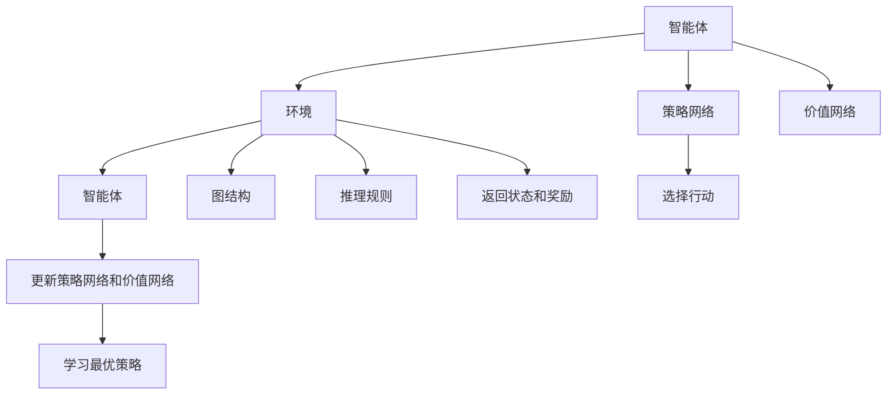

# 深度强化学习在推理路径规划中的应用

> 关键词：深度强化学习、推理路径规划、马尔可夫决策过程、策略网络、价值网络

> 摘要：本文深入探讨了深度强化学习在推理路径规划中的应用。首先介绍了相关背景知识，包括目的范围、预期读者等。接着阐述了深度强化学习和推理路径规划的核心概念及联系，给出了原理和架构的示意图与流程图。详细讲解了核心算法原理，并用Python代码进行说明，同时给出了相关数学模型和公式。通过项目实战展示了代码的实际案例和详细解释。分析了深度强化学习在推理路径规划中的实际应用场景，推荐了相关的学习资源、开发工具框架和论文著作。最后总结了未来发展趋势与挑战，并提供了常见问题解答和扩展阅读参考资料。

## 1. 背景介绍 
### 1.1 目的和范围
在许多实际应用场景中，如智能机器人导航、知识图谱推理等，都需要进行有效的推理路径规划。推理路径规划的目标是在给定的环境中，找到一条从起始状态到目标状态的最优或近似最优路径。传统的路径规划方法在处理复杂环境和大规模问题时存在一定的局限性。深度强化学习作为一种强大的机器学习方法，能够在复杂环境中通过智能体与环境的交互学习到最优策略，为推理路径规划提供了新的解决方案。本文的目的是深入研究深度强化学习在推理路径规划中的应用，介绍相关的理论知识、算法原理、实际案例，并探讨其未来发展趋势与挑战。范围涵盖了深度强化学习的基本概念、推理路径规划的问题描述、核心算法的实现、实际应用场景分析以及相关工具和资源的推荐。

### 1.2 预期读者
本文预期读者包括对人工智能、机器学习、路径规划等领域感兴趣的研究人员、工程师和学生。对于有一定编程基础和机器学习知识的读者，本文可以帮助他们深入理解深度强化学习在推理路径规划中的应用原理和实现方法；对于初学者，本文可以作为一个入门指南，引导他们了解相关领域的基本概念和研究方向。

### 1.3 文档结构概述
本文将按照以下结构进行组织：
- 核心概念与联系：介绍深度强化学习和推理路径规划的核心概念，以及它们之间的联系，给出原理和架构的示意图与流程图。
- 核心算法原理 & 具体操作步骤：详细讲解深度强化学习在推理路径规划中常用的算法原理，并用Python代码进行具体实现。
- 数学模型和公式 & 详细讲解 & 举例说明：给出深度强化学习和推理路径规划的数学模型和公式，并进行详细讲解和举例说明。
- 项目实战：代码实际案例和详细解释说明：通过一个实际的推理路径规划项目，展示代码的实现过程和详细解释。
- 实际应用场景：分析深度强化学习在推理路径规划中的实际应用场景。
- 工具和资源推荐：推荐相关的学习资源、开发工具框架和论文著作。
- 总结：未来发展趋势与挑战：总结深度强化学习在推理路径规划中的未来发展趋势和面临的挑战。
- 附录：常见问题与解答：提供常见问题的解答。
- 扩展阅读 & 参考资料：提供扩展阅读的资料和参考文献。

### 1.4 术语表
#### 1.4.1 核心术语定义
- **深度强化学习（Deep Reinforcement Learning）**：将深度学习与强化学习相结合的一种机器学习方法，通过神经网络来近似值函数或策略函数，以解决复杂的决策问题。
- **推理路径规划（Reasoning Path Planning）**：在给定的环境中，根据一定的推理规则和目标，找到一条从起始状态到目标状态的最优或近似最优路径。
- **智能体（Agent）**：在强化学习中，智能体是与环境进行交互的实体，通过感知环境状态并采取行动来最大化累积奖励。
- **环境（Environment）**：智能体所处的外部世界，智能体的行动会影响环境的状态，环境会根据智能体的行动返回新的状态和奖励。
- **状态（State）**：环境在某一时刻的描述，智能体根据当前状态来选择行动。
- **行动（Action）**：智能体在某一状态下可以采取的操作。
- **奖励（Reward）**：环境根据智能体的行动返回的一个标量值，用于表示该行动的好坏，智能体的目标是最大化累积奖励。
- **策略（Policy）**：智能体根据当前状态选择行动的规则，通常用一个函数表示。
- **值函数（Value Function）**：表示在某一状态下，智能体按照某一策略行动所能获得的期望累积奖励。

#### 1.4.2 相关概念解释
- **马尔可夫决策过程（Markov Decision Process, MDP）**：是一个用于描述智能体与环境交互的数学模型，具有马尔可夫性质，即未来的状态只取决于当前状态和当前行动，而与过去的状态和行动无关。
- **Q学习（Q-Learning）**：一种无模型的强化学习算法，通过学习Q值函数来找到最优策略。Q值表示在某一状态下采取某一行动所能获得的最大期望累积奖励。
- **深度Q网络（Deep Q-Network, DQN）**：将深度学习与Q学习相结合的一种算法，使用神经网络来近似Q值函数，能够处理高维状态空间。
- **策略梯度（Policy Gradient）**：一类直接优化策略函数的强化学习算法，通过计算策略的梯度来更新策略参数，以最大化累积奖励。

#### 1.4.3 缩略词列表
- **DRL**：深度强化学习（Deep Reinforcement Learning）
- **RPP**：推理路径规划（Reasoning Path Planning）
- **MDP**：马尔可夫决策过程（Markov Decision Process）
- **Q-Learning**：Q学习
- **DQN**：深度Q网络（Deep Q-Network）
- **PG**：策略梯度（Policy Gradient）

## 2. 核心概念与联系 

### 深度强化学习核心概念
深度强化学习是强化学习与深度学习的结合。强化学习的核心是智能体与环境的交互过程，智能体在环境中感知状态 $s$，根据策略 $\pi$ 选择行动 $a$，环境根据行动返回新的状态 $s'$ 和奖励 $r$。智能体的目标是通过不断地与环境交互，学习到一个最优策略，使得累积奖励最大化。

深度学习则为强化学习提供了强大的函数逼近能力。在深度强化学习中，通常使用神经网络来近似值函数或策略函数。例如，深度Q网络（DQN）使用神经网络来近似Q值函数 $Q(s,a)$，策略梯度算法使用神经网络来表示策略 $\pi(s,a)$。

### 推理路径规划核心概念
推理路径规划是在一个给定的图结构中，根据一定的推理规则和目标，找到一条从起始节点到目标节点的最优或近似最优路径。图中的节点可以表示不同的状态，边表示状态之间的转移关系。推理规则可以是逻辑规则、概率规则等，用于指导路径的选择。

### 核心概念联系
深度强化学习可以很好地应用于推理路径规划问题。我们可以将推理路径规划问题建模为一个马尔可夫决策过程（MDP）。在这个MDP中，状态 $s$ 可以表示图中的当前节点，行动 $a$ 可以表示从当前节点到相邻节点的转移，奖励 $r$ 可以根据推理规则和目标来设计，例如，如果到达目标节点则给予正奖励，否则给予负奖励或零奖励。

智能体通过与图环境进行交互，不断学习到最优的路径选择策略。深度强化学习算法可以利用神经网络的强大表达能力，在大规模的图结构中找到最优或近似最优的推理路径。

### 原理和架构的文本示意图
```plaintext
+----------------+          +----------------+          +----------------+
|   智能体 (Agent) | -------> |   环境 (Environment)  | -------> |   智能体 (Agent) |
|                  |          |                  |          |                  |
|  策略网络 (Policy Network) |          |  图结构 (Graph)   |          |  更新策略网络 |
|  价值网络 (Value Network) |          |  推理规则 (Rules) |          |  和价值网络  |
|                  |          |                  |          |                  |
|  选择行动 (Select Action) |          |  返回状态和奖励  |          |  学习最优策略 |
+----------------+          +----------------+          +----------------+
```

### Mermaid 流程图


## 3. 核心算法原理 & 具体操作步骤 

### 深度Q网络（DQN）算法原理
深度Q网络（DQN）是一种基于Q学习的深度强化学习算法。Q学习的目标是学习一个Q值函数 $Q(s,a)$，表示在状态 $s$ 下采取行动 $a$ 所能获得的最大期望累积奖励。DQN使用神经网络来近似Q值函数。

#### 算法步骤
1. **初始化**：初始化Q网络 $Q(s,a;\theta)$ 的参数 $\theta$，经验回放缓冲区 $D$。
2. **循环**：
    - 初始化环境，得到初始状态 $s_1$。
    - 对于每一个时间步 $t$：
        - 以概率 $\epsilon$ 随机选择一个行动 $a_t$，否则选择 $Q(s_t,a;\theta)$ 最大的行动。
        - 执行行动 $a_t$，得到新的状态 $s_{t+1}$ 和奖励 $r_t$。
        - 将 $(s_t,a_t,r_t,s_{t+1})$ 存储到经验回放缓冲区 $D$ 中。
        - 从经验回放缓冲区 $D$ 中随机采样一个小批量的数据 $(s_i,a_i,r_i,s_{i+1})$。
        - 计算目标Q值：$y_i = r_i + \gamma \max_{a'} Q(s_{i+1},a';\theta^-)$，其中 $\theta^-$ 是目标网络的参数，$\gamma$ 是折扣因子。
        - 计算损失函数：$L(\theta) = \frac{1}{N} \sum_{i=1}^{N} (y_i - Q(s_i,a_i;\theta))^2$。
        - 使用梯度下降法更新Q网络的参数 $\theta$。
        - 定期更新目标网络的参数 $\theta^- = \theta$。

### Python代码实现
```python
import torch
import torch.nn as nn
import torch.optim as optim
import numpy as np
import random

# 定义Q网络
class QNetwork(nn.Module):
    def __init__(self, input_dim, output_dim):
        super(QNetwork, self).__init__()
        self.fc1 = nn.Linear(input_dim, 64)
        self.fc2 = nn.Linear(64, 64)
        self.fc3 = nn.Linear(64, output_dim)

    def forward(self, x):
        x = torch.relu(self.fc1(x))
        x = torch.relu(self.fc2(x))
        return self.fc3(x)

# 定义DQN智能体
class DQNAgent:
    def __init__(self, input_dim, output_dim, learning_rate=0.001, gamma=0.99, epsilon=1.0, epsilon_decay=0.995, epsilon_min=0.01, batch_size=64, memory_size=10000):
        self.input_dim = input_dim
        self.output_dim = output_dim
        self.learning_rate = learning_rate
        self.gamma = gamma
        self.epsilon = epsilon
        self.epsilon_decay = epsilon_decay
        self.epsilon_min = epsilon_min
        self.batch_size = batch_size
        self.memory = []
        self.memory_size = memory_size

        self.q_network = QNetwork(input_dim, output_dim)
        self.target_network = QNetwork(input_dim, output_dim)
        self.target_network.load_state_dict(self.q_network.state_dict())
        self.optimizer = optim.Adam(self.q_network.parameters(), lr=learning_rate)
        self.criterion = nn.MSELoss()

    def remember(self, state, action, reward, next_state):
        if len(self.memory) > self.memory_size:
            self.memory.pop(0)
        self.memory.append((state, action, reward, next_state))

    def act(self, state):
        if np.random.rand() <= self.epsilon:
            return random.randrange(self.output_dim)
        state = torch.FloatTensor(state).unsqueeze(0)
        q_values = self.q_network(state)
        action = torch.argmax(q_values).item()
        return action

    def replay(self):
        if len(self.memory) < self.batch_size:
            return
        minibatch = random.sample(self.memory, self.batch_size)
        states, actions, rewards, next_states = zip(*minibatch)

        states = torch.FloatTensor(states)
        actions = torch.LongTensor(actions)
        rewards = torch.FloatTensor(rewards)
        next_states = torch.FloatTensor(next_states)

        q_values = self.q_network(states)
        q_values = q_values.gather(1, actions.unsqueeze(1)).squeeze(1)

        next_q_values = self.target_network(next_states)
        next_q_values = next_q_values.max(1)[0]
        target_q_values = rewards + self.gamma * next_q_values

        loss = self.criterion(q_values, target_q_values)
        self.optimizer.zero_grad()
        loss.backward()
        self.optimizer.step()

        if self.epsilon > self.epsilon_min:
            self.epsilon *= self.epsilon_decay

    def update_target_network(self):
        self.target_network.load_state_dict(self.q_network.state_dict())
```

### 策略梯度算法原理
策略梯度算法直接优化策略函数 $\pi(s,a;\theta)$，通过计算策略的梯度来更新策略参数 $\theta$，以最大化累积奖励。

#### 算法步骤
1. **初始化**：初始化策略网络 $\pi(s,a;\theta)$ 的参数 $\theta$。
2. **循环**：
    - 初始化环境，得到初始状态 $s_1$。
    - 对于每一个时间步 $t$：
        - 根据策略 $\pi(s_t,a;\theta)$ 采样一个行动 $a_t$。
        - 执行行动 $a_t$，得到新的状态 $s_{t+1}$ 和奖励 $r_t$。
        - 记录 $(s_t,a_t,r_t)$。
    - 计算累积奖励 $R_t = \sum_{k=t}^{T} \gamma^{k-t} r_k$，其中 $T$ 是终止时间步，$\gamma$ 是折扣因子。
    - 计算损失函数：$L(\theta) = -\frac{1}{T} \sum_{t=1}^{T} \log \pi(s_t,a_t;\theta) R_t$。
    - 使用梯度下降法更新策略网络的参数 $\theta$。

### Python代码实现
```python
import torch
import torch.nn as nn
import torch.optim as optim
import numpy as np

# 定义策略网络
class PolicyNetwork(nn.Module):
    def __init__(self, input_dim, output_dim):
        super(PolicyNetwork, self).__init__()
        self.fc1 = nn.Linear(input_dim, 64)
        self.fc2 = nn.Linear(64, 64)
        self.fc3 = nn.Linear(64, output_dim)
        self.softmax = nn.Softmax(dim=1)

    def forward(self, x):
        x = torch.relu(self.fc1(x))
        x = torch.relu(self.fc2(x))
        x = self.fc3(x)
        return self.softmax(x)

# 定义策略梯度智能体
class PolicyGradientAgent:
    def __init__(self, input_dim, output_dim, learning_rate=0.001, gamma=0.99):
        self.input_dim = input_dim
        self.output_dim = output_dim
        self.learning_rate = learning_rate
        self.gamma = gamma

        self.policy_network = PolicyNetwork(input_dim, output_dim)
        self.optimizer = optim.Adam(self.policy_network.parameters(), lr=learning_rate)

    def act(self, state):
        state = torch.FloatTensor(state).unsqueeze(0)
        probs = self.policy_network(state)
        action = torch.multinomial(probs, 1).item()
        return action

    def update(self, states, actions, rewards):
        states = torch.FloatTensor(states)
        actions = torch.LongTensor(actions)
        rewards = torch.FloatTensor(rewards)

        # 计算累积奖励
        discounted_rewards = []
        cumulative_reward = 0
        for reward in reversed(rewards):
            cumulative_reward = reward + self.gamma * cumulative_reward
            discounted_rewards.insert(0, cumulative_reward)
        discounted_rewards = torch.FloatTensor(discounted_rewards)

        # 计算策略梯度
        probs = self.policy_network(states)
        log_probs = torch.log(probs.gather(1, actions.unsqueeze(1)).squeeze(1))
        loss = -(log_probs * discounted_rewards).mean()

        # 更新策略网络参数
        self.optimizer.zero_grad()
        loss.backward()
        self.optimizer.step()
```

## 4. 数学模型和公式 & 详细讲解 & 举例说明 

### 马尔可夫决策过程（MDP）
马尔可夫决策过程是一个五元组 $(S,A,P,R,\gamma)$，其中：
- $S$ 是状态空间，表示环境所有可能的状态。
- $A$ 是行动空间，表示智能体在每个状态下可以采取的行动。
- $P(s'|s,a)$ 是状态转移概率，表示在状态 $s$ 下采取行动 $a$ 后转移到状态 $s'$ 的概率。
- $R(s,a,s')$ 是奖励函数，表示在状态 $s$ 下采取行动 $a$ 转移到状态 $s'$ 时获得的奖励。
- $\gamma \in [0,1]$ 是折扣因子，用于平衡即时奖励和未来奖励。

### 值函数和Q值函数
- **状态值函数 $V^{\pi}(s)$**：表示在策略 $\pi$ 下，从状态 $s$ 开始所能获得的期望累积奖励，定义为：
$$V^{\pi}(s) = \mathbb{E}_{\pi} \left[ \sum_{t=0}^{\infty} \gamma^t r_{t+1} \big| s_0 = s \right]$$
其中，$\mathbb{E}_{\pi}$ 表示在策略 $\pi$ 下的期望，$r_{t+1}$ 是在时间步 $t+1$ 获得的奖励。

- **Q值函数 $Q^{\pi}(s,a)$**：表示在策略 $\pi$ 下，从状态 $s$ 采取行动 $a$ 后所能获得的期望累积奖励，定义为：
$$Q^{\pi}(s,a) = \mathbb{E}_{\pi} \left[ \sum_{t=0}^{\infty} \gamma^t r_{t+1} \big| s_0 = s, a_0 = a \right]$$

### 最优值函数和最优Q值函数
- **最优状态值函数 $V^*(s)$**：表示在所有可能的策略下，从状态 $s$ 开始所能获得的最大期望累积奖励，定义为：
$$V^*(s) = \max_{\pi} V^{\pi}(s)$$

- **最优Q值函数 $Q^*(s,a)$**：表示在所有可能的策略下，从状态 $s$ 采取行动 $a$ 后所能获得的最大期望累积奖励，定义为：
$$Q^*(s,a) = \max_{\pi} Q^{\pi}(s,a)$$

### 贝尔曼方程
- **状态值函数的贝尔曼方程**：
$$V^{\pi}(s) = \sum_{a \in A} \pi(a|s) \sum_{s' \in S} P(s'|s,a) \left[ R(s,a,s') + \gamma V^{\pi}(s') \right]$$
该方程表示状态 $s$ 的值函数等于在策略 $\pi$ 下采取所有可能行动的加权和，每个行动的权重是该行动的概率，行动的价值是即时奖励加上折扣后的下一个状态的值函数。

- **Q值函数的贝尔曼方程**：
$$Q^{\pi}(s,a) = \sum_{s' \in S} P(s'|s,a) \left[ R(s,a,s') + \gamma \sum_{a' \in A} \pi(a'|s') Q^{\pi}(s',a') \right]$$

- **最优Q值函数的贝尔曼方程**：
$$Q^*(s,a) = \sum_{s' \in S} P(s'|s,a) \left[ R(s,a,s') + \gamma \max_{a'} Q^*(s',a') \right]$$

### 举例说明
假设我们有一个简单的网格世界，智能体可以在网格中上下左右移动。状态 $s$ 表示智能体在网格中的位置，行动 $a$ 表示智能体的移动方向（上、下、左、右）。如果智能体移动到目标位置，获得奖励 $+1$，否则获得奖励 $0$。折扣因子 $\gamma = 0.9$。

- 初始状态 $s_0$ 是网格的左上角，目标状态是网格的右下角。
- 策略 $\pi$ 是随机选择一个行动。
- 状态转移概率 $P(s'|s,a)$ 在没有障碍物的情况下，按照行动的方向确定下一个状态，否则保持当前状态。

我们可以使用贝尔曼方程来计算状态值函数和Q值函数。例如，对于状态 $s_0$，根据状态值函数的贝尔曼方程：
$$V^{\pi}(s_0) = \frac{1}{4} \sum_{a \in \{上,下,左,右\}} \sum_{s' \in S} P(s'|s_0,a) \left[ R(s_0,a,s') + 0.9 V^{\pi}(s') \right]$$

通过迭代求解贝尔曼方程，我们可以得到最优值函数和最优策略。

## 5. 项目实战：代码实际案例和详细解释说明 

### 5.1  开发环境搭建
#### 安装Python
首先需要安装Python，建议使用Python 3.7及以上版本。可以从Python官方网站（https://www.python.org/downloads/） 下载并安装。

#### 安装必要的库
使用以下命令安装必要的库：
```sh
pip install torch numpy
```
- `torch`：用于深度学习模型的构建和训练。
- `numpy`：用于数值计算。

### 5.2  源代码详细实现和代码解读
我们以一个简单的图结构推理路径规划问题为例，使用DQN算法来实现。

```python
import torch
import torch.nn as nn
import torch.optim as optim
import numpy as np
import random

# 定义Q网络
class QNetwork(nn.Module):
    def __init__(self, input_dim, output_dim):
        super(QNetwork, self).__init__()
        self.fc1 = nn.Linear(input_dim, 64)
        self.fc2 = nn.Linear(64, 64)
        self.fc3 = nn.Linear(64, output_dim)

    def forward(self, x):
        x = torch.relu(self.fc1(x))
        x = torch.relu(self.fc2(x))
        return self.fc3(x)

# 定义DQN智能体
class DQNAgent:
    def __init__(self, input_dim, output_dim, learning_rate=0.001, gamma=0.99, epsilon=1.0, epsilon_decay=0.995, epsilon_min=0.01, batch_size=64, memory_size=10000):
        self.input_dim = input_dim
        self.output_dim = output_dim
        self.learning_rate = learning_rate
        self.gamma = gamma
        self.epsilon = epsilon
        self.epsilon_decay = epsilon_decay
        self.epsilon_min = epsilon_min
        self.batch_size = batch_size
        self.memory = []
        self.memory_size = memory_size

        self.q_network = QNetwork(input_dim, output_dim)
        self.target_network = QNetwork(input_dim, output_dim)
        self.target_network.load_state_dict(self.q_network.state_dict())
        self.optimizer = optim.Adam(self.q_network.parameters(), lr=learning_rate)
        self.criterion = nn.MSELoss()

    def remember(self, state, action, reward, next_state):
        if len(self.memory) > self.memory_size:
            self.memory.pop(0)
        self.memory.append((state, action, reward, next_state))

    def act(self, state):
        if np.random.rand() <= self.epsilon:
            return random.randrange(self.output_dim)
        state = torch.FloatTensor(state).unsqueeze(0)
        q_values = self.q_network(state)
        action = torch.argmax(q_values).item()
        return action

    def replay(self):
        if len(self.memory) < self.batch_size:
            return
        minibatch = random.sample(self.memory, self.batch_size)
        states, actions, rewards, next_states = zip(*minibatch)

        states = torch.FloatTensor(states)
        actions = torch.LongTensor(actions)
        rewards = torch.FloatTensor(rewards)
        next_states = torch.FloatTensor(next_states)

        q_values = self.q_network(states)
        q_values = q_values.gather(1, actions.unsqueeze(1)).squeeze(1)

        next_q_values = self.target_network(next_states)
        next_q_values = next_q_values.max(1)[0]
        target_q_values = rewards + self.gamma * next_q_values

        loss = self.criterion(q_values, target_q_values)
        self.optimizer.zero_grad()
        loss.backward()
        self.optimizer.step()

        if self.epsilon > self.epsilon_min:
            self.epsilon *= self.epsilon_decay

    def update_target_network(self):
        self.target_network.load_state_dict(self.q_network.state_dict())

# 定义图环境
class GraphEnv:
    def __init__(self, graph, start_node, goal_node):
        self.graph = graph
        self.start_node = start_node
        self.goal_node = goal_node
        self.current_node = start_node

    def reset(self):
        self.current_node = self.start_node
        return self._get_state()

    def step(self, action):
        next_node = self.graph[self.current_node][action]
        reward = 1 if next_node == self.goal_node else 0
        done = next_node == self.goal_node
        self.current_node = next_node
        next_state = self._get_state()
        return next_state, reward, done

    def _get_state(self):
        state = np.zeros(len(self.graph))
        state[self.current_node] = 1
        return state

# 主函数
def main():
    # 定义图结构
    graph = {
        0: [1, 2],
        1: [0, 3],
        2: [0, 3],
        3: [1, 2]
    }
    start_node = 0
    goal_node = 3

    env = GraphEnv(graph, start_node, goal_node)
    input_dim = len(graph)
    output_dim = len(graph[start_node])

    agent = DQNAgent(input_dim, output_dim)

    num_episodes = 1000
    for episode in range(num_episodes):
        state = env.reset()
        done = False
        total_reward = 0

        while not done:
            action = agent.act(state)
            next_state, reward, done = env.step(action)
            agent.remember(state, action, reward, next_state)
            agent.replay()
            state = next_state
            total_reward += reward

        if episode % 10 == 0:
            agent.update_target_network()
        print(f"Episode {episode}: Total Reward = {total_reward}")

if __name__ == "__main__":
    main()
```

### 5.3  代码解读与分析
#### QNetwork类
- 这是一个简单的三层全连接神经网络，用于近似Q值函数。输入维度是状态的维度，输出维度是行动的维度。
- `forward` 方法定义了网络的前向传播过程，使用ReLU激活函数。

#### DQNAgent类
- `__init__` 方法初始化智能体的参数，包括学习率、折扣因子、探索率等，同时初始化Q网络和目标网络，并定义优化器和损失函数。
- `remember` 方法用于将经验 $(s,a,r,s')$ 存储到经验回放缓冲区中。
- `act` 方法根据探索率选择行动，以一定概率随机选择行动，否则选择Q值最大的行动。
- `replay` 方法从经验回放缓冲区中随机采样一个小批量的数据，计算目标Q值和损失函数，并使用梯度下降法更新Q网络的参数。
- `update_target_network` 方法定期更新目标网络的参数，使其与Q网络的参数一致。

#### GraphEnv类
- `__init__` 方法初始化图环境，包括图结构、起始节点和目标节点。
- `reset` 方法将当前节点重置为起始节点，并返回当前状态。
- `step` 方法根据行动更新当前节点，计算奖励和终止标志，并返回下一个状态。
- `_get_state` 方法将当前节点转换为状态向量。

#### 主函数
- 定义图结构、起始节点和目标节点，创建图环境和DQN智能体。
- 进行多个回合的训练，每个回合中智能体与环境进行交互，存储经验并进行学习。
- 定期更新目标网络的参数，并打印每个回合的总奖励。

通过这个项目实战，我们可以看到如何使用DQN算法解决简单的图结构推理路径规划问题。

## 6. 实际应用场景 
### 智能机器人导航
在智能机器人导航中，机器人需要在复杂的环境中找到一条从起始位置到目标位置的最优路径。深度强化学习可以用于推理路径规划，将机器人的当前位置和环境信息作为状态，机器人的移动方向作为行动，到达目标位置的奖励作为正奖励，碰撞障碍物的惩罚作为负奖励。通过不断地与环境交互学习，机器人可以学习到最优的导航策略。

### 知识图谱推理
知识图谱是一种语义网络，用于表示实体之间的关系。在知识图谱推理中，需要找到一条从起始实体到目标实体的推理路径。深度强化学习可以将知识图谱中的实体和关系作为状态和行动，根据推理规则设计奖励函数，通过学习最优策略来找到推理路径。

### 游戏AI
在游戏中，AI需要根据游戏状态选择最优的行动来获得胜利。深度强化学习可以用于游戏中的推理路径规划，例如在迷宫游戏中，AI需要找到一条从起点到终点的路径；在策略游戏中，AI需要根据游戏局势选择最优的策略。

### 物流配送路径规划
在物流配送中，需要为车辆规划一条最优的配送路径，以最小化运输成本和时间。深度强化学习可以将车辆的当前位置、货物信息和交通状况作为状态，车辆的行驶方向和停靠点作为行动，根据运输成本和时间设计奖励函数，通过学习最优策略来规划配送路径。

## 7. 工具和资源推荐
### 7.1 学习资源推荐
#### 7.1.1 书籍推荐
- 《Reinforcement Learning: An Introduction》：由Richard S. Sutton和Andrew G. Barto所著，是强化学习领域的经典教材，全面介绍了强化学习的基本概念、算法和应用。
- 《Deep Reinforcement Learning Hands-On》：由Max Lapan所著，通过实际案例介绍了深度强化学习的实现方法和应用技巧。
- 《Artificial Intelligence: A Modern Approach》：由Stuart Russell和Peter Norvig所著，是人工智能领域的经典教材，涵盖了强化学习、机器学习等多个方面的内容。

#### 7.1.2 在线课程
- Coursera上的“Reinforcement Learning Specialization”：由University of Alberta提供，包括强化学习的基础、深度强化学习等多个课程。
- edX上的“Introduction to Artificial Intelligence”：由UC Berkeley提供，介绍了人工智能的基本概念和方法，包括强化学习。
- OpenAI的Spinning Up：提供了深度强化学习的教程和代码实现，适合初学者学习。

#### 7.1.3 技术博客和网站
- OpenAI博客：发布了许多关于深度强化学习的最新研究成果和应用案例。
- DeepMind博客：DeepMind是深度强化学习领域的领先研究机构，其博客上有很多高质量的研究文章。
- arXiv：一个预印本平台，包含了大量的深度强化学习相关的研究论文。

### 7.2 开发工具框架推荐
#### 7.2.1 IDE和编辑器
- PyCharm：一款专业的Python IDE，提供了丰富的代码编辑、调试和项目管理功能。
- Jupyter Notebook：一个交互式的开发环境，适合进行数据分析和模型实验。
- Visual Studio Code：一款轻量级的代码编辑器，支持多种编程语言和插件扩展。

#### 7.2.2 调试和性能分析工具
- TensorBoard：一个可视化工具，用于查看深度学习模型的训练过程和性能指标。
- PyTorch Profiler：PyTorch提供的性能分析工具，可以帮助分析模型的运行时间和内存使用情况。
- cProfile：Python内置的性能分析工具，可以分析代码的执行时间和函数调用次数。

#### 7.2.3 相关框架和库
- PyTorch：一个开源的深度学习框架，提供了丰富的神经网络层和优化算法，支持GPU加速。
- TensorFlow：另一个流行的深度学习框架，具有广泛的应用和社区支持。
- Gym：OpenAI开发的一个用于强化学习的工具包，提供了多种环境和基准测试。

### 7.3 相关论文著作推荐
#### 7.3.1 经典论文
- “Human-level control through deep reinforcement learning”：发表于Nature杂志，介绍了深度Q网络（DQN）算法，首次将深度学习与强化学习相结合，在Atari游戏中取得了人类水平的表现。
- “Asynchronous Methods for Deep Reinforcement Learning”：提出了异步优势演员-评论家（A3C）算法，提高了深度强化学习的训练效率。
- “Proximal Policy Optimization Algorithms”：提出了近端策略优化（PPO）算法，是一种高效的策略梯度算法。

#### 7.3.2 最新研究成果
- 关注arXiv上的最新论文，特别是关于深度强化学习在推理路径规划、多智能体系统等方面的研究。
- 参加国际人工智能和机器学习会议，如NeurIPS、ICML、AAAI等，了解最新的研究动态。

#### 7.3.3 应用案例分析
- 许多公司和研究机构会发布深度强化学习在实际应用中的案例分析，如Google DeepMind在游戏、机器人控制等方面的应用，OpenAI在自动驾驶、自然语言处理等方面的应用。可以通过他们的官方网站和博客了解相关案例。

## 8. 总结：未来发展趋势与挑战
### 未来发展趋势
- **多智能体深度强化学习**：在实际应用中，往往需要多个智能体协同工作来完成任务。多智能体深度强化学习可以研究多个智能体之间的协作和竞争关系，提高系统的整体性能。例如，在物流配送中，可以使用多个机器人协同完成货物的运输任务。
- **结合其他技术**：将深度强化学习与其他技术如计算机视觉、自然语言处理等相结合，可以解决更复杂的问题。例如，在智能机器人导航中，结合计算机视觉技术可以让机器人更好地感知环境，提高导航的准确性。
- **可解释性深度强化学习**：随着深度强化学习在一些关键领域的应用，如医疗、金融等，对模型的可解释性要求越来越高。未来的研究将致力于开发可解释性的深度强化学习算法，让人们能够理解模型的决策过程。

### 挑战
- **样本效率**：深度强化学习通常需要大量的样本进行训练，这在实际应用中可能会受到时间和资源的限制。提高样本效率是深度强化学习面临的一个重要挑战，可以通过改进算法、使用先验知识等方法来解决。
- **环境复杂性**：实际环境往往非常复杂，具有不确定性和动态性。如何在复杂环境中学习到有效的策略是深度强化学习需要解决的问题。可以通过引入更复杂的模型结构、使用分层强化学习等方法来应对环境复杂性。
- **安全性**：在一些应用场景中，如自动驾驶、机器人控制等，安全性是至关重要的。深度强化学习模型可能会产生不安全的行为，如何保证模型的安全性是一个亟待解决的问题。可以通过设计安全奖励函数、使用安全约束等方法来提高模型的安全性。

## 9. 附录：常见问题与解答
### 深度强化学习和传统强化学习有什么区别？
传统强化学习通常使用表格来存储值函数或策略，适用于状态和行动空间较小的问题。而深度强化学习使用神经网络来近似值函数或策略，能够处理高维状态空间和复杂的环境。

### 深度强化学习在推理路径规划中的优势是什么？
深度强化学习可以在复杂的环境中自动学习到最优或近似最优的推理路径，不需要手动设计复杂的规则。同时，深度强化学习具有很强的泛化能力，能够适应不同的环境和任务。

### 如何选择合适的深度强化学习算法？
选择合适的深度强化学习算法需要考虑问题的特点，如状态和行动空间的大小、环境的复杂性、是否需要处理连续行动等。如果状态和行动空间较小，可以考虑使用传统的Q学习算法；如果状态空间较大，可以使用深度Q网络（DQN）或策略梯度算法；如果需要处理连续行动，可以使用深度确定性策略梯度（DDPG）等算法。

### 深度强化学习的训练过程中容易出现哪些问题？
深度强化学习的训练过程中容易出现不稳定、收敛慢、过拟合等问题。可以通过使用经验回放、目标网络、正则化等方法来解决这些问题。

## 10. 扩展阅读 & 参考资料
### 扩展阅读
- 阅读更多关于深度强化学习的论文和书籍，深入了解不同的算法和应用场景。
- 参与开源项目，学习其他开发者的代码实现和经验。
- 关注相关领域的研究动态，参加学术会议和研讨会。

### 参考资料
- Sutton, R. S., & Barto, A. G. (2018). Reinforcement Learning: An Introduction. MIT press.
- Lapan, M. (2018). Deep Reinforcement Learning Hands-On. Packt Publishing.
- Mnih, V., Kavukcuoglu, K., Silver, D., Rusu, A. A., Veness, J., Bellemare, M. G.,... & Petersen, S. (2015). Human-level control through deep reinforcement learning. Nature, 518(7540), 529-533.
- Mnih, V., Badia, A. P., Mirza, M., Graves, A., Lillicrap, T., Harley, T.,... & Kavukcuoglu, K. (2016). Asynchronous Methods for Deep Reinforcement Learning. In International Conference on Machine Learning (pp. 1928-1937).
- Schulman, J., Wolski, F., Dhariwal, P., Radford, A., & Klimov, O. (2017). Proximal Policy Optimization Algorithms. arXiv preprint arXiv:1707.06347.

作者：AI天才研究院/AI Genius Institute & 禅与计算机程序设计艺术 /Zen And The Art of Computer Programming