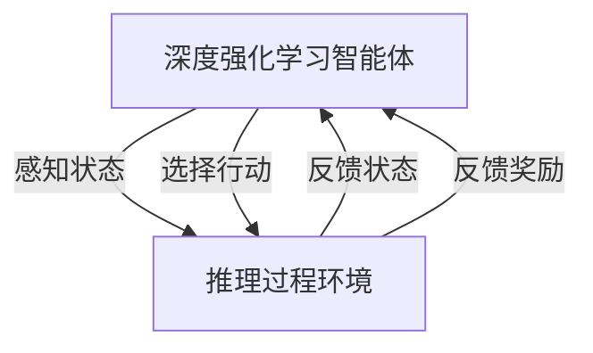

# 深度强化学习在推理过程监督中的创新

> 关键词：深度强化学习、推理过程监督、智能决策、策略优化、环境交互

> 摘要：本文聚焦于深度强化学习在推理过程监督中的创新应用。深度强化学习作为一种强大的机器学习范式，通过智能体与环境的交互不断优化策略。在推理过程监督领域，其创新应用为提高推理的准确性、效率和可靠性提供了新的途径。文章深入探讨了深度强化学习的核心概念、算法原理、数学模型，通过项目实战展示其在实际场景中的应用，并对相关工具和资源进行推荐，最后总结了未来发展趋势与挑战。

## 1. 背景介绍 
### 1.1 目的和范围
在当今复杂的信息环境中，推理过程的准确性和效率至关重要。深度强化学习作为一种新兴的技术手段，为推理过程的监督提供了新的思路和方法。本文章的目的在于详细阐述深度强化学习在推理过程监督中的创新应用，涵盖其核心概念、算法原理、数学模型、实际应用场景等多个方面，旨在为相关领域的研究人员和从业者提供全面的参考。

### 1.2 预期读者
本文预期读者包括人工智能、机器学习领域的研究人员、学者，对深度强化学习和推理过程监督感兴趣的技术爱好者，以及从事相关项目开发的工程师和从业者。

### 1.3 文档结构概述
本文首先介绍深度强化学习和推理过程监督的背景知识，包括目的、预期读者和文档结构。接着阐述核心概念与联系，通过文本示意图和 Mermaid 流程图展示其原理和架构。然后详细讲解核心算法原理和具体操作步骤，使用 Python 源代码进行阐述。随后介绍数学模型和公式，并举例说明。通过项目实战展示代码实际案例和详细解释说明。接着探讨实际应用场景，推荐相关工具和资源。最后总结未来发展趋势与挑战，提供常见问题与解答和扩展阅读参考资料。

### 1.4 术语表
#### 1.4.1 核心术语定义
- **深度强化学习（Deep Reinforcement Learning）**：结合了深度学习的强大表示能力和强化学习的决策优化能力，通过智能体与环境的交互来学习最优策略。
- **推理过程监督（Inference Process Supervision）**：对推理过程进行监控和指导，确保推理的准确性、效率和可靠性。
- **智能体（Agent）**：在深度强化学习中，智能体是与环境进行交互的实体，通过感知环境状态并采取行动来最大化累积奖励。
- **环境（Environment）**：智能体所处的外部世界，智能体的行动会对环境产生影响，环境会反馈相应的状态和奖励。
- **策略（Policy）**：智能体根据当前环境状态选择行动的规则，通常表示为一个函数。
- **奖励（Reward）**：环境对智能体行动的反馈，用于指导智能体学习最优策略。

#### 1.4.2 相关概念解释
- **深度学习（Deep Learning）**：一种基于人工神经网络的机器学习方法，通过多层神经网络自动学习数据的特征表示。
- **强化学习（Reinforcement Learning）**：一种通过智能体与环境的交互来学习最优策略的机器学习方法，智能体的目标是最大化累积奖励。
- **推理（Inference）**：从已知信息中得出结论的过程，在人工智能领域中，通常指根据模型的输入数据生成输出结果的过程。

#### 1.4.3 缩略词列表
- **DRL**：深度强化学习（Deep Reinforcement Learning）
- **RL**：强化学习（Reinforcement Learning）
- **ANN**：人工神经网络（Artificial Neural Network）

## 2. 核心概念与联系 

### 深度强化学习原理
深度强化学习结合了深度学习和强化学习的优势。深度学习通过多层神经网络学习复杂的函数表示，能够自动提取数据的特征。强化学习则通过智能体与环境的交互，根据环境的反馈（奖励）来学习最优策略。智能体在每个时间步 $t$ 感知环境的状态 $s_t$，根据策略 $\pi$ 选择行动 $a_t$，环境根据智能体的行动转移到下一个状态 $s_{t+1}$，并给予智能体一个奖励 $r_t$。智能体的目标是学习一个最优策略 $\pi^*$，使得累积奖励最大化。

### 推理过程监督原理
推理过程监督的目的是确保推理过程的准确性、效率和可靠性。在推理过程中，通过对推理步骤、中间结果和最终结论的监控，及时发现和纠正可能出现的错误。监督可以基于规则、模型或人类专家的知识。

### 核心概念联系
深度强化学习可以应用于推理过程监督中，通过智能体与推理环境的交互来学习最优的监督策略。智能体可以根据推理过程的状态（如中间结果、推理步骤等）选择合适的监督行动（如提示、纠正、终止等），环境根据智能体的行动给予相应的奖励。通过不断的交互和学习，智能体可以逐渐优化监督策略，提高推理过程的质量。

### 文本示意图
```plaintext
深度强化学习智能体 <---- 感知状态 ----> 推理过程环境
深度强化学习智能体 ---- 选择行动 ----> 推理过程环境
推理过程环境 ---- 反馈奖励 ----> 深度强化学习智能体
```

### Mermaid 流程图


## 3. 核心算法原理 & 具体操作步骤 

### 深度 Q 网络（DQN）算法原理
深度 Q 网络（DQN）是一种经典的深度强化学习算法，它将深度学习与 Q 学习相结合。Q 学习是一种基于值函数的强化学习方法，通过学习状态 - 行动对的 Q 值来确定最优策略。DQN 使用一个深度神经网络来近似 Q 值函数，从而能够处理高维的状态空间。

#### 算法步骤
1. **初始化**：初始化深度神经网络 $Q(s, a; \theta)$，其中 $\theta$ 是网络的参数，初始化经验回放缓冲区 $D$。
2. **循环**：
    - 智能体根据当前状态 $s$ 选择行动 $a$，可以使用 $\epsilon$-贪心策略。
    - 执行行动 $a$，观察环境的下一个状态 $s'$ 和奖励 $r$。
    - 将转移 $(s, a, r, s')$ 存储到经验回放缓冲区 $D$ 中。
    - 从经验回放缓冲区 $D$ 中随机采样一批转移 $(s_i, a_i, r_i, s_i')$。
    - 计算目标 Q 值 $y_i = r_i + \gamma \max_{a'} Q(s_i', a'; \theta^-)$，其中 $\gamma$ 是折扣因子，$\theta^-$ 是目标网络的参数。
    - 使用均方误差损失函数 $L(\theta) = \frac{1}{N} \sum_{i=1}^{N} (y_i - Q(s_i, a_i; \theta))^2$ 来更新网络参数 $\theta$。
    - 定期更新目标网络的参数 $\theta^- = \theta$。

### Python 源代码实现
```python
import torch
import torch.nn as nn
import torch.optim as optim
import numpy as np
import random

# 定义深度 Q 网络
class DQN(nn.Module):
    def __init__(self, input_dim, output_dim):
        super(DQN, self).__init__()
        self.fc1 = nn.Linear(input_dim, 64)
        self.fc2 = nn.Linear(64, 64)
        self.fc3 = nn.Linear(64, output_dim)

    def forward(self, x):
        x = torch.relu(self.fc1(x))
        x = torch.relu(self.fc2(x))
        return self.fc3(x)

# 定义深度强化学习智能体
class DQNAgent:
    def __init__(self, input_dim, output_dim, learning_rate=0.001, gamma=0.99, epsilon=1.0, epsilon_decay=0.995, epsilon_min=0.01, batch_size=64, memory_size=10000):
        self.input_dim = input_dim
        self.output_dim = output_dim
        self.learning_rate = learning_rate
        self.gamma = gamma
        self.epsilon = epsilon
        self.epsilon_decay = epsilon_decay
        self.epsilon_min = epsilon_min
        self.batch_size = batch_size
        self.memory_size = memory_size
        self.memory = []
        self.model = DQN(input_dim, output_dim)
        self.target_model = DQN(input_dim, output_dim)
        self.target_model.load_state_dict(self.model.state_dict())
        self.optimizer = optim.Adam(self.model.parameters(), lr=learning_rate)
        self.criterion = nn.MSELoss()

    def remember(self, state, action, reward, next_state):
        self.memory.append((state, action, reward, next_state))
        if len(self.memory) > self.memory_size:
            self.memory.pop(0)

    def act(self, state):
        if np.random.rand() <= self.epsilon:
            return random.randrange(self.output_dim)
        state = torch.FloatTensor(state).unsqueeze(0)
        q_values = self.model(state)
        action = torch.argmax(q_values).item()
        return action

    def replay(self):
        if len(self.memory) < self.batch_size:
            return
        minibatch = random.sample(self.memory, self.batch_size)
        states, actions, rewards, next_states = zip(*minibatch)
        states = torch.FloatTensor(states)
        actions = torch.LongTensor(actions)
        rewards = torch.FloatTensor(rewards)
        next_states = torch.FloatTensor(next_states)

        q_values = self.model(states)
        q_values = q_values.gather(1, actions.unsqueeze(1)).squeeze(1)

        next_q_values = self.target_model(next_states)
        next_q_values = next_q_values.max(1)[0]
        target_q_values = rewards + self.gamma * next_q_values

        loss = self.criterion(q_values, target_q_values)
        self.optimizer.zero_grad()
        loss.backward()
        self.optimizer.step()

        if self.epsilon > self.epsilon_min:
            self.epsilon *= self.epsilon_decay

    def update_target_model(self):
        self.target_model.load_state_dict(self.model.state_dict())
```

### 具体操作步骤
1. **环境定义**：定义推理过程环境，包括状态空间、行动空间和奖励函数。
2. **智能体初始化**：初始化 DQNAgent 智能体，设置相关参数。
3. **训练循环**：在每个训练回合中，智能体与环境进行交互，选择行动，观察奖励和下一个状态，将转移存储到经验回放缓冲区中，并进行经验回放和目标网络更新。
4. **测试**：在训练完成后，使用训练好的智能体进行测试，观察推理过程的监督效果。

## 4. 数学模型和公式 & 详细讲解 & 举例说明 

### 价值函数
在强化学习中，价值函数用于评估状态或状态 - 行动对的价值。常见的价值函数包括状态价值函数 $V(s)$ 和行动价值函数 $Q(s, a)$。

#### 状态价值函数
状态价值函数 $V(s)$ 表示从状态 $s$ 开始，遵循策略 $\pi$ 所能获得的期望累积奖励：
$$V^{\pi}(s) = \mathbb{E}_{\pi} \left[ \sum_{t=0}^{\infty} \gamma^t r_t \mid s_0 = s \right]$$
其中，$\gamma$ 是折扣因子，$0 \leq \gamma \leq 1$，用于权衡当前奖励和未来奖励的重要性。

#### 行动价值函数
行动价值函数 $Q(s, a)$ 表示在状态 $s$ 采取行动 $a$，然后遵循策略 $\pi$ 所能获得的期望累积奖励：
$$Q^{\pi}(s, a) = \mathbb{E}_{\pi} \left[ \sum_{t=0}^{\infty} \gamma^t r_t \mid s_0 = s, a_0 = a \right]$$

### 贝尔曼方程
贝尔曼方程是强化学习中的核心方程，用于描述价值函数的递归关系。

#### 状态价值函数的贝尔曼方程
$$V^{\pi}(s) = \sum_{a} \pi(a \mid s) \sum_{s', r} p(s', r \mid s, a) \left[ r + \gamma V^{\pi}(s') \right]$$
其中，$\pi(a \mid s)$ 是策略 $\pi$ 在状态 $s$ 选择行动 $a$ 的概率，$p(s', r \mid s, a)$ 是环境的状态转移概率。

#### 行动价值函数的贝尔曼方程
$$Q^{\pi}(s, a) = \sum_{s', r} p(s', r \mid s, a) \left[ r + \gamma \sum_{a'} \pi(a' \mid s') Q^{\pi}(s', a') \right]$$

### 最优价值函数和最优策略
最优状态价值函数 $V^*(s)$ 和最优行动价值函数 $Q^*(s, a)$ 分别表示在所有可能的策略中，从状态 $s$ 开始所能获得的最大期望累积奖励和在状态 $s$ 采取行动 $a$ 所能获得的最大期望累积奖励。

#### 最优行动价值函数的贝尔曼最优方程
$$Q^*(s, a) = \sum_{s', r} p(s', r \mid s, a) \left[ r + \gamma \max_{a'} Q^*(s', a') \right]$$

最优策略 $\pi^*$ 可以通过贪心策略从最优行动价值函数中得到：
$$\pi^*(a \mid s) = \begin{cases} 1, & \text{if } a = \arg \max_{a'} Q^*(s, a') \\ 0, & \text{otherwise} \end{cases}$$

### 举例说明
考虑一个简单的推理过程环境，状态空间 $S = \{s_1, s_2\}$，行动空间 $A = \{a_1, a_2\}$，奖励函数 $r(s, a)$ 如下：
| 状态 | 行动 | 奖励 |
| ---- | ---- | ---- |
| $s_1$ | $a_1$ | 1 |
| $s_1$ | $a_2$ | 0 |
| $s_2$ | $a_1$ | 0 |
| $s_2$ | $a_2$ | 2 |

假设折扣因子 $\gamma = 0.9$，我们可以通过贝尔曼方程计算最优行动价值函数 $Q^*(s, a)$。

首先，初始化 $Q^*(s, a)$ 为 0。然后，迭代更新 $Q^*(s, a)$ 直到收敛。

对于状态 $s_1$：
- 当采取行动 $a_1$ 时：
  - $Q^*(s_1, a_1) = r(s_1, a_1) + \gamma \max_{a'} Q^*(s', a')$
  - 假设状态转移到 $s_2$，则 $Q^*(s_1, a_1) = 1 + 0.9 \max\{Q^*(s_2, a_1), Q^*(s_2, a_2)\}$
  - 由于 $Q^*(s_2, a_1) = 0$，$Q^*(s_2, a_2) = 2$，所以 $Q^*(s_1, a_1) = 1 + 0.9 \times 2 = 2.8$
- 当采取行动 $a_2$ 时：
  - $Q^*(s_1, a_2) = r(s_1, a_2) + \gamma \max_{a'} Q^*(s', a')$
  - 假设状态转移到 $s_2$，则 $Q^*(s_1, a_2) = 0 + 0.9 \max\{Q^*(s_2, a_1), Q^*(s_2, a_2)\}$
  - 所以 $Q^*(s_1, a_2) = 0 + 0.9 \times 2 = 1.8$

对于状态 $s_2$：
- 当采取行动 $a_1$ 时：
  - $Q^*(s_2, a_1) = r(s_2, a_1) + \gamma \max_{a'} Q^*(s', a')$
  - 假设状态转移到 $s_1$，则 $Q^*(s_2, a_1) = 0 + 0.9 \max\{Q^*(s_1, a_1), Q^*(s_1, a_2)\}$
  - 所以 $Q^*(s_2, a_1) = 0 + 0.9 \times 2.8 = 2.52$
- 当采取行动 $a_2$ 时：
  - $Q^*(s_2, a_2) = r(s_2, a_2) + \gamma \max_{a'} Q^*(s', a')$
  - 假设状态转移到 $s_1$，则 $Q^*(s_2, a_2) = 2 + 0.9 \max\{Q^*(s_1, a_1), Q^*(