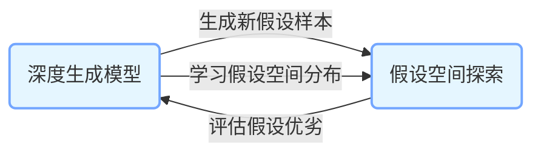

# 深度生成模型在假设空间探索中的应用

> 关键词：深度生成模型、假设空间探索、生成对抗网络、变分自编码器、概率模型

> 摘要：本文深入探讨了深度生成模型在假设空间探索中的应用。首先介绍了相关背景知识，包括目的范围、预期读者等。接着阐述了深度生成模型和假设空间探索的核心概念及联系，给出了相应的原理和架构示意图与流程图。详细讲解了核心算法原理和具体操作步骤，通过Python代码进行说明。同时，介绍了相关的数学模型和公式，并举例说明。在项目实战部分，给出了开发环境搭建、源代码实现及解读。还探讨了实际应用场景，推荐了学习资源、开发工具框架和相关论文著作。最后总结了未来发展趋势与挑战，解答了常见问题，并提供了扩展阅读和参考资料。

## 1. 背景介绍 
### 1.1 目的和范围
深度生成模型近年来在人工智能领域取得了显著的进展，其能够学习数据的分布并生成新的数据样本。假设空间探索则是在众多可能的假设中寻找最优假设的过程。本文章的目的在于深入研究深度生成模型如何应用于假设空间探索，揭示其内在的原理和方法。范围涵盖了常见的深度生成模型，如生成对抗网络（GAN）、变分自编码器（VAE）等在不同领域假设空间探索中的应用。

### 1.2 预期读者
本文预期读者包括人工智能领域的研究人员、工程师、学生以及对深度生成模型和假设空间探索感兴趣的技术爱好者。对于希望深入了解如何利用深度生成模型解决假设空间探索问题的读者，本文将提供系统而深入的知识。

### 1.3 文档结构概述
本文首先介绍背景知识，为后续内容奠定基础。接着阐述核心概念与联系，让读者对深度生成模型和假设空间探索有清晰的认识。然后详细讲解核心算法原理和具体操作步骤，结合Python代码进行说明。之后介绍相关的数学模型和公式，并举例说明。在项目实战部分，给出开发环境搭建、源代码实现及解读。再探讨实际应用场景，推荐学习资源、开发工具框架和相关论文著作。最后总结未来发展趋势与挑战，解答常见问题，并提供扩展阅读和参考资料。

### 1.4 术语表
#### 1.4.1 核心术语定义
- **深度生成模型**：一类基于深度学习的模型，能够学习数据的概率分布并生成与训练数据相似的新数据样本。常见的深度生成模型包括生成对抗网络（GAN）、变分自编码器（VAE）等。
- **假设空间**：所有可能的假设构成的集合。在机器学习中，假设是对数据的一种解释或预测规则。
- **假设空间探索**：在假设空间中寻找最优假设的过程，通常通过某种搜索策略来实现。

#### 1.4.2 相关概念解释
- **生成对抗网络（GAN）**：由生成器和判别器组成的对抗性模型。生成器试图生成逼真的数据样本，判别器则试图区分生成的样本和真实的样本。通过两者的对抗训练，生成器逐渐学习到数据的分布。
- **变分自编码器（VAE）**：一种基于变分推断的自编码器。它不仅能够学习数据的编码表示，还能对编码空间进行采样以生成新的数据样本。

#### 1.4.3 缩略词列表
- **GAN**：Generative Adversarial Networks（生成对抗网络）
- **VAE**：Variational Autoencoder（变分自编码器）

## 2. 核心概念与联系 

### 深度生成模型原理
深度生成模型的核心目标是学习数据的概率分布 $P(X)$，其中 $X$ 表示数据样本。通过学习这个分布，模型可以生成新的数据样本。以生成对抗网络（GAN）为例，它由生成器 $G(z)$ 和判别器 $D(x)$ 组成，其中 $z$ 是随机噪声向量，$x$ 是数据样本。生成器的作用是将随机噪声 $z$ 映射到数据空间，生成假样本 $G(z)$。判别器的作用是判断输入的样本是真实样本 $x$ 还是生成的假样本 $G(z)$。两者通过对抗训练不断优化，最终生成器能够生成逼真的数据样本。

变分自编码器（VAE）则是通过编码器 $q_{\phi}(z|x)$ 将输入数据 $x$ 编码为潜在变量 $z$ 的分布，解码器 $p_{\theta}(x|z)$ 则将潜在变量 $z$ 解码为数据样本 $x$。通过最大化证据下界（ELBO）来优化模型参数 $\phi$ 和 $\theta$，从而学习到数据的分布。

### 假设空间探索原理
假设空间探索的目标是在所有可能的假设 $H$ 中找到最优假设 $h^*$，使得在给定的数据集 $D$ 上的损失函数 $L(h, D)$ 最小。常见的假设空间探索方法包括随机搜索、网格搜索、遗传算法等。在深度学习中，假设通常对应于模型的参数，探索假设空间就是寻找最优的模型参数。

### 核心概念联系
深度生成模型可以为假设空间探索提供新的思路和方法。一方面，深度生成模型可以生成新的假设样本，从而扩大假设空间的探索范围。另一方面，深度生成模型可以学习假设空间的分布，从而指导假设空间的搜索过程。例如，在GAN中，生成器可以生成新的假设样本，判别器可以评估这些假设的优劣，从而引导生成器生成更优的假设。

### 文本示意图
```plaintext
深度生成模型
├── 生成对抗网络（GAN）
│   ├── 生成器（G）
│   │   └── 输入：随机噪声 z
│   │   └── 输出：生成的假样本 G(z)
│   └── 判别器（D）
│       └── 输入：真实样本 x 或生成的假样本 G(z)
│       └── 输出：判断结果（真或假）
├── 变分自编码器（VAE）
│   ├── 编码器（q）
│   │   └── 输入：数据样本 x
│   │   └── 输出：潜在变量 z 的分布 q(z|x)
│   └── 解码器（p）
│       └── 输入：潜在变量 z
│       └── 输出：生成的数据样本 p(x|z)

假设空间探索
├── 假设空间 H
│   └── 所有可能的假设 h
├── 损失函数 L
│   └── 输入：假设 h 和数据集 D
│   └── 输出：损失值 L(h, D)
├── 搜索策略
│   └── 如随机搜索、网格搜索、遗传算法等
└── 最优假设 h*
    └── 使得 L(h*, D) 最小

深度生成模型与假设空间探索的联系
├── 深度生成模型生成新的假设样本
├── 深度生成模型学习假设空间的分布
└── 指导假设空间的搜索过程
```

### Mermaid 流程图


## 3. 核心算法原理 & 具体操作步骤 

### 生成对抗网络（GAN）算法原理
GAN的核心思想是通过生成器和判别器的对抗训练来学习数据的分布。生成器 $G(z)$ 接收随机噪声 $z$ 作为输入，生成假样本 $G(z)$。判别器 $D(x)$ 接收真实样本 $x$ 或生成的假样本 $G(z)$ 作为输入，输出一个概率值，表示输入样本是真实样本的概率。

GAN的目标是最大化判别器的准确率，同时最小化生成器生成的假样本被判别器识别为假的概率。具体来说，GAN的目标函数可以表示为：

$$\min_G \max_D V(D, G) = \mathbb{E}_{x \sim p_{data}(x)}[\log D(x)] + \mathbb{E}_{z \sim p_z(z)}[\log(1 - D(G(z)))]$$

其中，$p_{data}(x)$ 是真实数据的分布，$p_z(z)$ 是随机噪声的分布。

### 生成对抗网络（GAN）具体操作步骤
1. **初始化**：随机初始化生成器 $G$ 和判别器 $D$ 的参数。
2. **训练判别器**：
    - 从真实数据分布 $p_{data}(x)$ 中采样一批真实样本 $x$。
    - 从随机噪声分布 $p_z(z)$ 中采样一批随机噪声 $z$，通过生成器 $G$ 生成一批假样本 $G(z)$。
    - 计算判别器的损失函数：
      $$L_D = -\mathbb{E}_{x \sim p_{data}(x)}[\log D(x)] - \mathbb{E}_{z \sim p_z(z)}[\log(1 - D(G(z)))]$$
    - 使用梯度下降法更新判别器 $D$ 的参数，使得 $L_D$ 最小化。
3. **训练生成器**：
    - 从随机噪声分布 $p_z(z)$ 中采样一批随机噪声 $z$，通过生成器 $G$ 生成一批假样本 $G(z)$。
    - 计算生成器的损失函数：
      $$L_G = -\mathbb{E}_{z \sim p_z(z)}[\log D(G(z))]$$
    - 使用梯度下降法更新生成器 $G$ 的参数，使得 $L_G$ 最小化。
4. **重复步骤2和3**：直到达到预设的训练次数或收敛条件。

### Python代码实现
```python
import torch
import torch.nn as nn
import torch.optim as optim
import numpy as np
import matplotlib.pyplot as plt

# 定义生成器
class Generator(nn.Module):
    def __init__(self, input_dim, output_dim):
        super(Generator, self).__init__()
        self.model = nn.Sequential(
            nn.Linear(input_dim, 128),
            nn.LeakyReLU(0.2),
            nn.Linear(128, output_dim),
            nn.Tanh()
        )

    def forward(self, z):
        return self.model(z)

# 定义判别器
class Discriminator(nn.Module):
    def __init__(self, input_dim):
        super(Discriminator, self).__init__()
        self.model = nn.Sequential(
            nn.Linear(input_dim, 128),
            nn.LeakyReLU(0.2),
            nn.Linear(128, 1),
            nn.Sigmoid()
        )

    def forward(self, x):
        return self.model(x)

# 超参数设置
input_dim = 100
output_dim = 1
batch_size = 32
epochs = 100
learning_rate = 0.0002

# 初始化生成器和判别器
generator = Generator(input_dim, output_dim)
discriminator = Discriminator(output_dim)

# 定义损失函数和优化器
criterion = nn.BCELoss()
generator_optimizer = optim.Adam(generator.parameters(), lr=learning_rate)
discriminator_optimizer = optim.Adam(discriminator.parameters(), lr=learning_rate)

# 生成真实数据
def generate_real_data(batch_size):
    return torch.FloatTensor(np.random.normal(0, 1, (batch_size, output_dim)))

# 训练GAN
for epoch in range(epochs):
    # 训练判别器
    discriminator_optimizer.zero_grad()

    # 真实数据
    real_data = generate_real_data(batch_size)
    real_labels = torch.ones(batch_size, 1)
    real_output = discriminator(real_data)
    real_loss = criterion(real_output, real_labels)

    # 生成假数据
    z = torch.FloatTensor(np.random.normal(0, 1, (batch_size, input_dim)))
    fake_data = generator(z)
    fake_labels = torch.zeros(batch_size, 1)
    fake_output = discriminator(fake_data.detach())
    fake_loss = criterion(fake_output, fake_labels)

    # 判别器总损失
    discriminator_loss = real_loss + fake_loss
    discriminator_loss.backward()
    discriminator_optimizer.step()

    # 训练生成器
    generator_optimizer.zero_grad()
    z = torch.FloatTensor(np.random.normal(0, 1, (batch_size, input_dim)))
    fake_data = generator(z)
    fake_labels = torch.ones(batch_size, 1)
    fake_output = discriminator(fake_data)
    generator_loss = criterion(fake_output, fake_labels)
    generator_loss.backward()
    generator_optimizer.step()

    if epoch % 10 == 0:
        print(f'Epoch [{epoch}/{epochs}], Generator Loss: {generator_loss.item():.4f}, Discriminator Loss: {discriminator_loss.item():.4f}')

# 生成样本进行可视化
z = torch.FloatTensor(np.random.normal(0, 1, (1000, input_dim)))
generated_samples = generator(z).detach().numpy()
plt.hist(generated_samples, bins=50)
plt.show()
```

### 变分自编码器（VAE）算法原理
VAE的核心思想是通过变分推断来学习数据的潜在表示。编码器 $q_{\phi}(z|x)$ 将输入数据 $x$ 编码为潜在变量 $z$ 的分布，解码器 $p_{\theta}(x|z)$ 则将潜在变量 $z$ 解码为数据样本 $x$。

VAE的目标是最大化证据下界（ELBO），可以表示为：

$$\mathcal{L}(\phi, \theta; x) = \mathbb{E}_{q_{\phi}(z|x)}[\log p_{\theta}(x|z)] - D_{KL}(q_{\phi}(z|x) || p(z))$$

其中，$\mathbb{E}_{q_{\phi}(z|x)}[\log p_{\theta}(x|z)]$ 是重构损失，表示解码器将潜在变量 $z$ 解码为数据样本 $x$ 的能力；$D_{KL}(q_{\phi}(z|x) || p(z))$ 是KL散度，表示编码器学习到的潜在变量分布 $q_{\phi}(z|x)$ 与先验分布 $p(z)$ 之间的差异。

### 变分自编码器（VAE）具体操作步骤
1. **初始化**：随机初始化编码器 $q_{\phi}$ 和解码器 $p_{\theta}$ 的参数。
2. **前向传播**：
    - 输入数据 $x$，通过编码器 $q_{\phi}$ 得到潜在变量 $z$ 的均值 $\mu$ 和方差 $\sigma^2$。
    - 从正态分布 $N(\mu, \sigma^2)$ 中采样得到潜在变量 $z$。
    - 通过解码器 $p_{\theta}$ 将潜在变量 $z$ 解码为数据样本 $\hat{x}$。
3. **计算损失函数**：
    - 计算重构损失：
      $$L_{recon} = -\mathbb{E}_{q_{\phi}(z|x)}[\log p_{\theta}(x|z)]$$
    - 计算KL散度：
      $$L_{kl} = D_{KL}(q_{\phi}(z|x) || p(z))$$
    - 总损失函数：
      $$L = L_{recon} + L_{kl}$$
4. **反向传播**：使用梯度下降法更新编码器 $q_{\phi}$ 和解码器 $p_{\theta}$ 的参数，使得 $L$ 最小化。
5. **重复步骤2 - 4**：直到达到预设的训练次数或收敛条件。

### Python代码实现
```python
import torch
import torch.nn as nn
import torch.optim as optim
import numpy as np
import matplotlib.pyplot as plt

# 定义VAE编码器
class Encoder(nn.Module):
    def __init__(self, input_dim, hidden_dim, latent_dim):
        super(Encoder, self).__init__()
        self.fc1 = nn.Linear(input_dim, hidden_dim)
        self.fc_mu = nn.Linear(hidden_dim, latent_dim)
        self.fc_logvar = nn.Linear(hidden_dim, latent_dim)
        self.relu = nn.ReLU()

    def forward(self, x):
        h = self.relu(self.fc1(x))
        mu = self.fc_mu(h)
        logvar = self.fc_logvar(h)
        return mu, logvar

# 定义VAE解码器
class Decoder(nn.Module):
    def __init__(self, latent_dim, hidden_dim, output_dim):
        super(Decoder, self).__init__()
        self.fc1 = nn.Linear(latent_dim, hidden_dim)
        self.fc2 = nn.Linear(hidden_dim, output_dim)
        self.relu = nn.ReLU()
        self.sigmoid = nn.Sigmoid()

    def forward(self, z):
        h = self.relu(self.fc1(z))
        x_recon = self.sigmoid(self.fc2(h))
        return x_recon

# 定义VAE模型
class VAE(nn.Module):
    def __init__(self, input_dim, hidden_dim, latent_dim):
        super(VAE, self).__init__()
        self.encoder = Encoder(input_dim, hidden_dim, latent_dim)
        self.decoder = Decoder(latent_dim, hidden_dim, input_dim)

    def reparameterize(self, mu, logvar):
        std = torch.exp(0.5 * logvar)
        eps = torch.randn_like(std)
        return mu + eps * std

    def forward(self, x):
        mu, logvar = self.encoder(x)
        z = self.reparameterize(mu, logvar)
        x_recon = self.decoder(z)
        return x_recon, mu, logvar

# 超参数设置
input_dim = 784
hidden_dim = 400
latent_dim = 20
batch_size = 128
epochs = 10
learning_rate = 0.001

# 初始化VAE模型
vae = VAE(input_dim, hidden_dim, latent_dim)

# 定义损失函数和优化器
criterion = nn.BCELoss(reduction='sum')
optimizer = optim.Adam(vae.parameters(), lr=learning_rate)

# 训练VAE
for epoch in range(epochs):
    # 模拟数据加载
    data = torch.randn(batch_size, input_dim)
    optimizer.zero_grad()

    # 前向传播
    x_recon, mu, logvar = vae(data)

    # 计算重构损失
    recon_loss = criterion(x_recon, data)

    # 计算KL散度
    kl_loss = -0.5 * torch.sum(1 + logvar - mu.pow(2) - logvar.exp())

    # 总损失
    loss = recon_loss + kl_loss

    # 反向传播
    loss.backward()
    optimizer.step()

    if epoch % 1 == 0:
        print(f'Epoch [{epoch}/{epochs}], Loss: {loss.item():.4f}, Recon Loss: {recon_loss.item():.4f}, KL Loss: {kl_loss.item():.4f}')

# 生成样本进行可视化
z = torch.randn(16, latent_dim)
generated_samples = vae.decoder(z).detach().numpy()
plt.figure(figsize=(4, 4))
for i in range(16):
    plt.subplot(4, 4, i + 1)
    plt.imshow(generated_samples[i].reshape(28, 28), cmap='gray')
    plt.axis('off')
plt.show()
```

## 4. 数学模型和公式 & 详细讲解 & 举例说明 

### 生成对抗网络（GAN）数学模型和公式
#### 目标函数
GAN的目标函数为：

$$\min_G \max_D V(D, G) = \mathbb{E}_{x \sim p_{data}(x)}[\log D(x)] + \mathbb{E}_{z \sim p_z(z)}[\log(1 - D(G(z)))]$$

详细讲解：
- $\mathbb{E}_{x \sim p_{data}(x)}[\log D(x)]$：表示判别器对真实样本的判断能力。当判别器能够准确判断真实样本为真时，$D(x)$ 接近1，$\log D(x)$ 接近0，这一项的值越大。
- $\mathbb{E}_{z \sim p_z(z)}[\log(1 - D(G(z)))]$：表示判别器对生成样本的判断能力。当判别器能够准确判断生成样本为假时，$D(G(z))$ 接近0，$\log(1 - D(G(z)))$ 接近0，这一项的值越大。
- 生成器的目标是最小化 $V(D, G)$，即让判别器难以区分生成样本和真实样本。判别器的目标是最大化 $V(D, G)$，即准确区分生成样本和真实样本。

举例说明：
假设真实数据分布 $p_{data}(x)$ 是一个高斯分布，随机噪声分布 $p_z(z)$ 是一个均匀分布。生成器的任务是将均匀分布的随机噪声映射到高斯分布的真实数据分布上。判别器的任务是判断输入样本是来自高斯分布还是生成器生成的样本。通过对抗训练，生成器逐渐学习到高斯分布的特征，生成的样本越来越接近真实样本。

### 变分自编码器（VAE）数学模型和公式
#### 证据下界（ELBO）
VAE的目标是最大化证据下界（ELBO），公式为：

$$\mathcal{L}(\phi, \theta; x) = \mathbb{E}_{q_{\phi}(z|x)}[\log p_{\theta}(x|z)] - D_{KL}(q_{\phi}(z|x) || p(z))$$

详细讲解：
- $\mathbb{E}_{q_{\phi}(z|x)}[\log p_{\theta}(x|z)]$：重构损失，表示解码器将潜在变量 $z$ 解码为数据样本 $x$ 的能力。当解码器能够准确重构输入数据时，这一项的值越大。
- $D_{KL}(q_{\phi}(z|x) || p(z))$：KL散度，表示编码器学习到的潜在变量分布 $q_{\phi}(z|x)$ 与先验分布 $p(z)$ 之间的差异。当编码器学习到的潜在变量分布接近先验分布时，这一项的值越小。

举例说明：
假设输入数据是手写数字图像，编码器将图像编码为潜在变量 $z$ 的分布，解码器将潜在变量 $z$ 解码为手写数字图像。通过最大化ELBO，编码器学习到的潜在变量分布接近先验分布，解码器能够准确重构输入图像。同时，由于潜在变量分布接近先验分布，我们可以从先验分布中采样潜在变量 $z$，并通过解码器生成新的手写数字图像。

### 假设空间探索中的数学模型和公式
#### 损失函数
在假设空间探索中，我们通常使用损失函数 $L(h, D)$ 来评估假设 $h$ 在数据集 $D$ 上的性能。常见的损失函数包括均方误差（MSE）、交叉熵损失等。

均方误差（MSE）公式为：

$$MSE(h, D) = \frac{1}{n} \sum_{i=1}^{n} (y_i - h(x_i))^2$$

其中，$n$ 是数据集 $D$ 中的样本数量，$x_i$ 是输入样本，$y_i$ 是真实标签，$h(x_i)$ 是假设 $h$ 对输入样本 $x_i$ 的预测值。

交叉熵损失公式为：

$$CE(h, D) = -\frac{1}{n} \sum_{i=1}^{n} \sum_{j=1}^{k} y_{ij} \log h_{ij}(x_i)$$

其中，$k$ 是类别数量，$y_{ij}$ 是样本 $i$ 属于类别 $j$ 的真实标签（0或1），$h_{ij}(x_i)$ 是假设 $h$ 对样本 $i$ 属于类别 $j$ 的预测概率。

#### 搜索策略
常见的假设空间搜索策略包括随机搜索、网格搜索和遗传算法等。

随机搜索是在假设空间中随机选择假设进行评估，直到找到最优假设或达到预设的搜索次数。

网格搜索是在假设空间中定义一个网格，对网格中的每个点对应的假设进行评估，选择损失函数最小的假设作为最优假设。

遗传算法是一种基于生物进化原理的搜索算法，通过选择、交叉和变异等操作不断优化假设，直到找到最优假设。

## 5. 项目实战：代码实际案例和详细解释说明 

### 5.1  开发环境搭建
#### 安装Python
首先需要安装Python，建议使用Python 3.7及以上版本。可以从Python官方网站（https://www.python.org/downloads/） 下载并安装。

#### 安装深度学习框架
本项目使用PyTorch作为深度学习框架，可以使用以下命令安装：

```sh
pip install torch torchvision
```

#### 安装其他依赖库
还需要安装一些其他的依赖库，如NumPy、Matplotlib等，可以使用以下命令安装：

```sh
pip install numpy matplotlib
```

### 5.2  源代码详细实现和代码解读
#### 生成对抗网络（GAN）代码实现
```python
import torch
import torch.nn as nn
import torch.optim as optim
import numpy as np
import matplotlib.pyplot as plt

# 定义生成器
class Generator(nn.Module):
    def __init__(self, input_dim, output_dim):
        super(Generator, self).__init__()
        self.model = nn.Sequential(
            nn.Linear(input_dim, 128),
            nn.LeakyReLU(0.2),
            nn.Linear(128, output_dim),
            nn.Tanh()
        )

    def forward(self, z):
        return self.model(z)

# 定义判别器
class Discriminator(nn.Module):
    def __init__(self, input_dim):
        super(Discriminator, self).__init__()
        self.model = nn.Sequential(
            nn.Linear(input_dim, 128),
            nn.LeakyReLU(0.2),
            nn.Linear(128, 1),
            nn.Sigmoid()
        )

    def forward(self, x):
        return self.model(x)

# 超参数设置
input_dim = 100
output_dim = 1
batch_size = 32
epochs = 100
learning_rate = 0.0002

# 初始化生成器和判别器
generator = Generator(input_dim, output_dim)
discriminator = Discriminator(output_dim)

# 定义损失函数和优化器
criterion = nn.BCELoss()
generator_optimizer = optim.Adam(generator.parameters(), lr=learning_rate)
discriminator_optimizer = optim.Adam(discriminator.parameters(), lr=learning_rate)

# 生成真实数据
def generate_real_data(batch_size):
    return torch.FloatTensor(np.random.normal(0, 1, (batch_size, output_dim)))

# 训练GAN
for epoch in range(epochs):
    # 训练判别器
    discriminator_optimizer.zero_grad()

    # 真实数据
    real_data = generate_real_data(batch_size)
    real_labels = torch.ones(batch_size, 1)
    real_output = discriminator(real_data)
    real_loss = criterion(real_output, real_labels)

    # 生成假数据
    z = torch.FloatTensor(np.random.normal(0, 1, (batch_size, input_dim)))
    fake_data = generator(z)
    fake_labels = torch.zeros(batch_size, 1)
    fake_output = discriminator(fake_data.detach())
    fake_loss = criterion(fake_output, fake_labels)

    # 判别器总损失
    discriminator_loss = real_loss + fake_loss
    discriminator_loss.backward()
    discriminator_optimizer.step()

    # 训练生成器
    generator_optimizer.zero_grad()
    z = torch.FloatTensor(np.random.normal(0, 1, (batch_size, input_dim)))
    fake_data = generator(z)
    fake_labels = torch.ones(batch_size, 1)
    fake_output = discriminator(fake_data)
    generator_loss = criterion(fake_output, fake_labels)
    generator_loss.backward()
    generator_optimizer.step()

    if epoch % 10 == 0:
        print(f'Epoch [{epoch}/{epochs}], Generator Loss: {generator_loss.item():.4f}, Discriminator Loss: {discriminator_loss.item():.4f}')

# 生成样本进行可视化
z = torch.FloatTensor(np.random.normal(0, 1, (1000, input_dim)))
generated_samples = generator(z).detach().numpy()
plt.hist(generated_samples, bins=50)
plt.show()
```

#### 代码解读
1. **定义生成器和判别器**：
    - `Generator` 类定义了生成器的网络结构，接收随机噪声 $z$ 作为输入，输出生成的假样本。
    - `Discriminator` 类定义了判别器的网络结构，接收真实样本或生成的假样本作为输入，输出一个概率值，表示输入样本是真实样本的概率。
2. **超参数设置**：
    - `input_dim`：随机噪声的维度。
    - `output_dim`：生成样本的维度。
    - `batch_size`：每次训练使用的样本数量。
    - `epochs`：训练的轮数。
    - `learning_rate`：学习率，控制参数更新的步长。
3. **初始化生成器和判别器**：
    - 使用 `Generator` 和 `Discriminator` 类初始化生成器和判别器。
4. **定义损失函数和优化器**：
    - 使用二元交叉熵损失函数 `nn.BCELoss()` 作为判别器和生成器的损失函数。
    - 使用Adam优化器 `optim.Adam()` 分别对生成器和判别器的参数进行更新。
5. **生成真实数据**：
    - `generate_real_data` 函数生成一批符合正态分布的真实数据。
6. **训练GAN**：
    - 交替训练判别器和生成器，直到达到预设的训练轮数。
    - 在训练判别器时，计算判别器对真实样本和生成样本的损失，然后更新判别器的参数。
    - 在训练生成器时，计算生成器生成的样本被判别器判断为真的损失，然后更新生成器的参数。
7. **生成样本进行可视化**：
    - 生成一批随机噪声，通过生成器生成样本，然后使用直方图可视化生成样本的分布。

#### 变分自编码器（VAE）代码实现
```python
import torch
import torch.nn as nn
import torch.optim as optim
import numpy as np
import matplotlib.pyplot as plt

# 定义VAE编码器
class Encoder(nn.Module):
    def __init__(self, input_dim, hidden_dim, latent_dim):
        super(Encoder, self).__init__()
        self.fc1 = nn.Linear(input_dim, hidden_dim)
        self.fc_mu = nn.Linear(hidden_dim, latent_dim)
        self.fc_logvar = nn.Linear(hidden_dim, latent_dim)
        self.relu = nn.ReLU()

    def forward(self, x):
        h = self.relu(self.fc1(x))
        mu = self.fc_mu(h)
        logvar = self.fc_logvar(h)
        return mu, logvar

# 定义VAE解码器
class Decoder(nn.Module):
    def __init__(self, latent_dim, hidden_dim, output_dim):
        super(Decoder, self).__init__()
        self.fc1 = nn.Linear(latent_dim, hidden_dim)
        self.fc2 = nn.Linear(hidden_dim, output_dim)
        self.relu = nn.ReLU()
        self.sigmoid = nn.Sigmoid()

    def forward(self, z):
        h = self.relu(self.fc1(z))
        x_recon = self.sigmoid(self.fc2(h))
        return x_recon

# 定义VAE模型
class VAE(nn.Module):
    def __init__(self, input_dim, hidden_dim, latent_dim):
        super(VAE, self).__init__()
        self.encoder = Encoder(input_dim, hidden_dim, latent_dim)
        self.decoder = Decoder(latent_dim, hidden_dim, input_dim)

    def reparameterize(self, mu, logvar):
        std = torch.exp(0.5 * logvar)
        eps = torch.randn_like(std)
        return mu + eps * std

    def forward(self, x):
        mu, logvar = self.encoder(x)
        z = self.reparameterize(mu, logvar)
        x_recon = self.decoder(z)
        return x_recon, mu, logvar

# 超参数设置
input_dim = 784
hidden_dim = 400
latent_dim = 20
batch_size = 128
epochs = 10
learning_rate = 0.001

# 初始化VAE模型
vae = VAE(input_dim, hidden_dim, latent_dim)

# 定义损失函数和优化器
criterion = nn.BCELoss(reduction='sum')
optimizer = optim.Adam(vae.parameters(), lr=learning_rate)

# 训练VAE
for epoch in range(epochs):
    # 模拟数据加载
    data = torch.randn(batch_size, input_dim)
    optimizer.zero_grad()

    # 前向传播
    x_recon, mu, logvar = vae(data)

    # 计算重构损失
    recon_loss = criterion(x_recon, data)

    # 计算KL散度
    kl_loss = -0.5 * torch.sum(1 + logvar - mu.pow(2) - logvar.exp())

    # 总损失
    loss = recon_loss + kl_loss

    # 反向传播
    loss.backward()
    optimizer.step()

    if epoch % 1 == 0:
        print(f'Epoch [{epoch}/{epochs}], Loss: {loss.item():.4f}, Recon Loss: {recon_loss.item():.4f}, KL Loss: {kl_loss.item():.4f}')

# 生成样本进行可视化
z = torch.randn(16, latent_dim)
generated_samples = vae.decoder(z).detach().numpy()
plt.figure(figsize=(4, 4))
for i in range(16):
    plt.subplot(4, 4, i + 1)
    plt.imshow(generated_samples[i].reshape(28, 28), cmap='gray')
    plt.axis('off')
plt.show()
```

#### 代码解读
1. **定义编码器、解码器和VAE模型**：
    - `Encoder` 类定义了编码器的网络结构，接收输入数据 $x$，输出潜在变量 $z$ 的均值 $\mu$ 和方差 $\log\sigma^2$。
    - `Decoder` 类定义了解码器的网络结构，接收潜在变量 $z$，输出重构的数据样本 $\hat{x}$。
    - `VAE` 类定义了VAE模型的整体结构，包括编码器、解码器和重参数化操作。
2. **超参数设置**：
    - `input_dim`：输入数据的维度。
    - `hidden_dim`：隐藏层的维度。
    - `latent_dim`：潜在变量的维度。
    - `batch_size`：每次训练使用的样本数量。
    - `epochs`：训练的轮数。
    - `learning_rate`：学习率，控制参数更新的步长。
3. **初始化VAE模型**：
    - 使用 `VAE` 类初始化VAE模型。
4. **定义损失函数和优化器**：
    - 使用二元交叉熵损失函数 `nn.BCELoss(reduction='sum')` 作为重构损失。
    - 使用Adam优化器 `optim.Adam()` 对VAE模型的参数进行更新。
5. **训练VAE**：
    - 进行多轮训练，每轮训练中，计算重构损失和KL散度，然后将两者相加得到总损失。
    - 使用反向传播更新VAE模型的参数。
6. **生成样本进行可视化**：
    - 生成一批随机的潜在变量 $z$，通过解码器生成样本，然后使用图像可视化生成样本。

### 5.3  代码解读与分析
#### 生成对抗网络（GAN）代码分析
- **优点**：
    - 能够生成高质量的样本，特别是在图像生成领域取得了很好的效果。
    - 不需要显式地定义数据的概率分布，通过对抗训练自动学习数据的分布。
- **缺点**：
    - 训练过程不稳定，容易出现梯度消失或梯度爆炸的问题。
    - 难以评估生成样本的质量，缺乏明确的评价指标。

#### 变分自编码器（VAE）代码分析
- **优点**：
    - 训练过程相对稳定，能够学习到数据的潜在表示。
    - 可以通过对潜在变量进行采样生成新的样本，具有一定的可解释性。
- **缺点**：
    - 生成样本的质量相对较低，可能存在模糊的问题。
    - 对先验分布的选择比较敏感，不同的先验分布可能会影响模型的性能。

## 6. 实际应用场景 
### 图像生成
深度生成模型在图像生成领域有广泛的应用。例如，使用GAN可以生成逼真的人脸图像、风景图像等。在假设空间探索中，可以将不同的生成模型参数看作不同的假设，通过探索假设空间找到最优的生成模型参数，从而生成更高质量的图像。

### 数据增强
在机器学习中，数据增强是提高模型性能的重要手段。深度生成模型可以生成新的数据样本，从而扩充训练数据集。在假设空间探索中，可以探索不同的数据增强策略，如不同的生成模型、不同的噪声分布等，找到最优的数据增强方案。

### 异常检测
深度生成模型可以学习正常数据的分布，通过比较生成样本和输入样本的差异来检测异常样本。在假设空间探索中，可以探索不同的生成模型和异常检测阈值，找到最优的异常检测方案。

### 药物设计
在药物设计中，需要寻找具有特定生物活性的分子结构。深度生成模型可以生成新的分子结构，通过筛选这些分子结构找到潜在的药物分子。在假设空间探索中，可以探索不同的生成模型和筛选策略，找到最优的药物设计方案。

### 自然语言处理
在自然语言处理中，深度生成模型可以用于文本生成、机器翻译等任务。在假设空间探索中，可以探索不同的语言模型架构、训练参数等，找到最优的自然语言处理模型。

## 7. 工具和资源推荐
### 7.1 学习资源推荐
#### 7.1.1 书籍推荐
- 《深度学习》（Deep Learning）：由Ian Goodfellow、Yoshua Bengio和Aaron Courville合著，是深度学习领域的经典教材，全面介绍了深度学习的基本概念、算法和应用。
- 《动手学深度学习》（Dive into Deep Learning）：由 Aston Zhang、Zachary C. Lipton、Mu Li和Alexander J. Smola合著，提供了丰富的代码示例和实践项目，适合初学者快速上手深度学习。
- 《生成对抗网络实战》（GANs in Action）：由Jakub Langr和Viktor Haltakov合著，详细介绍了生成对抗网络的原理和应用，通过实际案例帮助读者理解和掌握GANs。

#### 7.1.2 在线课程
- Coursera上的“深度学习专项课程”（Deep Learning Specialization）：由Andrew Ng教授授课，包括五门课程，全面介绍了深度学习的各个方面，是学习深度学习的优质课程。
- edX上的“深度强化学习”（Deep Reinforcement Learning）：由Pieter Abbeel教授授课，介绍了深度强化学习的基本概念、算法和应用，适合对强化学习感兴趣的读者。
- 哔哩哔哩上的“李宏毅机器学习”：由李宏毅教授授课，以生动有趣的方式讲解机器学习和深度学习的知识，适合初学者入门。

#### 7.1.3 技术博客和网站
- Medium上的Towards Data Science：是一个专注于数据科学和机器学习的技术博客，提供了大量的高质量文章和教程。
- arXiv：是一个预印本服务器，收录了大量的学术论文，包括深度学习、生成模型等领域的最新研究成果。
- OpenAI博客：OpenAI团队发布的博客，介绍了他们在人工智能领域的最新研究和进展。

### 7.2 开发工具框架推荐
#### 7.2.1 IDE和编辑器
- PyCharm：是一款专业的Python集成开发环境，提供了丰富的代码编辑、调试和项目管理功能，适合开发深度学习项目。
- Jupyter Notebook：是一个交互式的开发环境，支持Python、R等多种编程语言，适合进行数据分析和模型实验。
- Visual Studio Code：是一款轻量级的代码编辑器，支持多种编程语言和插件，通过安装相关插件可以用于深度学习开发。

#### 7.2.2 调试和性能分析工具
- TensorBoard：是TensorFlow提供的可视化工具，可以用于可视化模型的训练过程、损失函数变化、模型结构等，帮助开发者调试和优化模型。
- PyTorch Profiler：是PyTorch提供的性能分析工具，可以用于分析模型的性能瓶颈，帮助开发者优化模型的运行效率。
- NVIDIA Nsight Systems：是NVIDIA提供的性能分析工具，支持GPU加速的深度学习模型，能够帮助开发者分析GPU的使用情况和性能瓶颈。

#### 7.2.3 相关框架和库
- PyTorch：是一个开源的深度学习框架，具有动态图机制、易于使用和高效的特点，广泛应用于学术界和工业界。
- TensorFlow：是Google开发的开源深度学习框架，具有强大的分布式训练和部署能力，在工业界有广泛的应用。
- Keras：是一个高级神经网络API，基于TensorFlow、Theano等后端，提供了简单易用的接口，适合快速搭建和训练深度学习模型。

### 7.3 相关论文著作推荐
#### 7.3.1 经典论文
- “Generative Adversarial Nets”：由Ian Goodfellow等人发表，首次提出了生成对抗网络的概念，开创了生成模型的新领域。
- “Auto-Encoding Variational Bayes”：由Diederik P. Kingma和Max Welling发表，提出了变分自编码器的概念，为生成模型的发展提供了新的思路。
- “DeepDream: Visualizing Neural Networks through Deep Dreaming”：由Google Brain团队发表，介绍了DeepDream算法，通过神经网络生成奇幻的图像，展示了深度生成模型的创造力。

#### 7.3.2 最新研究成果
- “Diffusion Models Beat GANs on Image Synthesis”：提出了基于扩散模型的图像生成方法，在图像生成质量上取得了优于GAN的效果。
- “DALL-E 2: Creating Images from Text”：OpenAI发布的DALL-E 2模型，能够根据文本描述生成高质量的图像，展示了深度生成模型在文本到图像生成领域的强大能力。
- “Improving Language Understanding by Generative Pre-Training”：由OpenAI发表，提出了GPT模型，通过无监督的预训练和有监督的微调，在自然语言处理任务中取得了显著的效果。

#### 7.3.3 应用案例分析
- “Generative Adversarial Networks for Medical Image Synthesis: A Review”：综述了生成对抗网络在医学图像合成领域的应用，分析了不同的应用场景和方法。
- “Using Deep Generative Models for Drug Discovery”：介绍了深度生成模型在药物发现领域的应用，包括分子生成、药物设计等方面的案例。
- “Generative Adversarial Networks in Autonomous Driving: A Survey”：综述了生成对抗网络在自动驾驶领域的应用，包括场景生成、数据增强等方面的案例。

## 8. 总结：未来发展趋势与挑战
### 未来发展趋势
#### 模型性能提升
未来深度生成模型将不断提升生成样本的质量和多样性。例如，通过改进