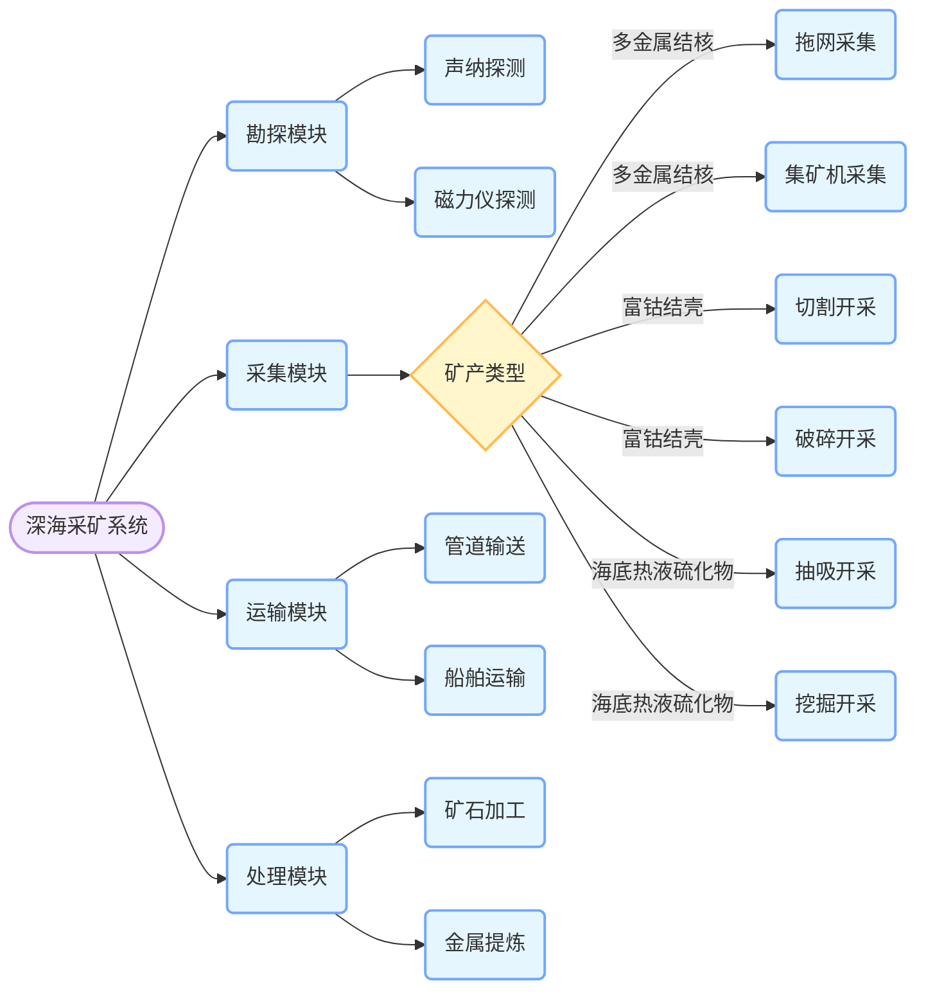

# 深海采矿技术的进步与矿产资源投资

> 关键词：深海采矿技术、矿产资源投资、技术进步、资源评估、投资风险

> 摘要：本文围绕深海采矿技术的进步与矿产资源投资展开深入探讨。首先介绍了深海采矿技术发展的背景以及研究的目的、范围、预期读者等内容。接着阐述了深海采矿的核心概念与联系，包括相关原理和架构，并给出了相应的示意图和流程图。详细讲解了核心算法原理和具体操作步骤，运用Python代码进行了说明，同时给出了数学模型和公式并举例。通过项目实战展示了代码案例和详细解释。分析了深海采矿技术在不同领域的实际应用场景。推荐了学习、开发工具框架以及相关论文著作等资源。最后总结了深海采矿技术未来的发展趋势与挑战，还列出了常见问题解答和扩展阅读参考资料，旨在为关注深海采矿技术和矿产资源投资的读者提供全面而深入的知识和指导。

## 1. 背景介绍 
### 1.1 目的和范围
随着陆地矿产资源的逐渐枯竭和全球对矿产资源需求的持续增长，深海矿产资源作为一种潜在的巨大资源储备，日益受到关注。本文的目的在于深入探讨深海采矿技术的进步情况以及与之相关的矿产资源投资问题。范围涵盖深海采矿技术的原理、发展现状、核心算法、数学模型，以及在实际项目中的应用案例和投资分析等方面。

### 1.2 预期读者
本文预期读者包括从事深海采矿技术研究的科研人员、对深海矿产资源投资感兴趣的投资者、相关领域的工程师以及关注资源开发与利用的政策制定者等。

### 1.3 文档结构概述
本文首先介绍背景信息，为读者构建整体认知框架。接着阐述深海采矿的核心概念与联系，帮助读者理解基本原理。通过核心算法原理和数学模型的讲解，深入剖析技术细节。项目实战部分展示实际应用案例，增强读者的实践认知。分析实际应用场景，让读者了解其现实意义。推荐相关工具和资源，为读者提供学习和研究的方向。最后总结未来发展趋势与挑战，解答常见问题，并列出扩展阅读参考资料。

### 1.4 术语表
#### 1.4.1 核心术语定义
- **深海采矿**：指在海洋水深较深区域（通常认为超过 200 米）进行矿产资源开采的活动，包括对多金属结核、富钴结壳、海底热液硫化物等资源的开采。
- **多金属结核**：又称锰结核，是一种富含锰、铁、镍、铜、钴等多种金属元素的海底自生矿物，通常呈结核状分布在深海海底。
- **富钴结壳**：是一种生长在海底硬质基岩表面的富含钴、锰、镍、铂等金属元素的壳状沉积物。
- **海底热液硫化物**：是由海底热液活动形成的一种富含铜、锌、铅、金、银等金属元素的硫化物矿床。

#### 1.4.2 相关概念解释
- **深海环境**：深海具有高压、低温、黑暗、缺氧等特殊环境条件，这些条件对采矿设备和技术提出了极高的要求。
- **资源评估**：对深海矿产资源的储量、品位、分布等特征进行调查和分析，以确定其开发价值和可行性。

#### 1.4.3 缩略词列表
- **ROV**：Remote Operated Vehicle，遥控水下机器人
- **AUV**：Autonomous Underwater Vehicle，自主水下航行器
- **DSM**：Deep - Sea Mining，深海采矿

## 2. 核心概念与联系 

### 核心概念原理
深海采矿的核心原理是利用各种先进的技术和设备，在深海环境下对矿产资源进行勘探、采集、运输和处理。勘探阶段主要使用声纳、磁力仪等设备来探测海底矿产资源的分布和储量。采集阶段则根据不同的矿产类型采用相应的采集方法，如对于多金属结核可以使用拖网、集矿机等设备进行采集；对于富钴结壳可以使用切割、破碎等方法进行开采；对于海底热液硫化物可以采用抽吸、挖掘等方式。运输阶段需要将采集到的矿石从海底运输到海面，通常采用管道输送或船舶运输等方式。处理阶段则是对采集到的矿石进行加工和提炼，提取出有用的金属元素。

### 架构示意图


该架构图展示了深海采矿系统的主要组成部分，包括勘探、采集、运输和处理模块。勘探模块通过声纳和磁力仪等设备进行资源探测；采集模块根据不同的矿产类型采用不同的采集方法；运输模块将矿石从海底运输到海面；处理模块对矿石进行加工和提炼。各个模块相互关联，共同构成了深海采矿的完整流程。

## 3. 核心算法原理 & 具体操作步骤 

### 核心算法原理 - 资源储量估算算法
资源储量估算在深海采矿中至关重要，它直接影响到投资决策和开采计划。以下是一个基于网格法的资源储量估算算法的Python实现：

```python
import numpy as np

def resource_reserve_estimation(grid_size, ore_density, ore_concentration, exploration_data):
    """
    资源储量估算函数
    :param grid_size: 网格大小（米）
    :param ore_density: 矿石密度（吨/立方米）
    :param ore_concentration: 矿石品位（百分比）
    :param exploration_data: 勘探数据（二维数组，表示每个网格的矿石厚度）
    :return: 资源储量（吨）
    """
    total_volume = 0
    rows, cols = exploration_data.shape
    for i in range(rows):
        for j in range(cols):
            volume = grid_size * grid_size * exploration_data[i][j]
            total_volume += volume
    reserve = total_volume * ore_density * (ore_concentration / 100)
    return reserve

# 示例数据
grid_size = 100  # 网格大小为100米
ore_density = 2.5  # 矿石密度为2.5吨/立方米
ore_concentration = 5  # 矿石品位为5%
exploration_data = np.random.rand(10, 10) * 10  # 随机生成10x10的勘探数据，表示每个网格的矿石厚度

reserve = resource_reserve_estimation(grid_size, ore_density, ore_concentration, exploration_data)
print(f"估算的资源储量为: {reserve} 吨")
```

### 具体操作步骤
1. **数据准备**：收集勘探数据，包括海底地形、矿石分布、矿石厚度等信息，并将其整理成适合算法处理的格式，如二维数组。
2. **参数设置**：确定网格大小、矿石密度、矿石品位等参数。网格大小根据勘探精度和计算效率进行选择；矿石密度和品位可以通过实验室分析或参考相关资料获得。
3. **算法计算**：调用资源储量估算函数，将准备好的数据和参数传入函数中进行计算。
4. **结果分析**：根据计算得到的资源储量结果，评估该区域的矿产资源开发价值，并为投资决策提供依据。

## 4. 数学模型和公式 & 详细讲解 & 举例说明 

### 资源储量估算数学模型
资源储量估算的基本数学模型基于体积和密度的关系。假设将勘探区域划分为若干个网格，每个网格的体积可以通过网格面积和矿石厚度计算得到。资源储量则是所有网格内矿石的质量总和。

设网格大小为 $L$（米），矿石密度为 $\rho$（吨/立方米），矿石品位为 $C$（百分比），第 $i$ 行第 $j$ 列网格的矿石厚度为 $h_{ij}$（米），勘探区域的行数为 $m$，列数为 $n$。

则每个网格的体积 $V_{ij}$ 为：
$$V_{ij}=L\times L\times h_{ij}$$

整个勘探区域的总体积 $V$ 为：
$$V=\sum_{i = 1}^{m}\sum_{j = 1}^{n}V_{ij}=\sum_{i = 1}^{m}\sum_{j = 1}^{n}L^{2}h_{ij}$$

资源储量 $R$（吨）为：
$$R = V\times\rho\times\frac{C}{100}$$

### 详细讲解
上述公式的推导基于基本的物理原理。首先，通过网格法将勘探区域离散化，便于计算每个小区域的体积。然后，将所有网格的体积相加得到总体积。最后，根据矿石密度和品位计算出矿石的质量，即资源储量。

### 举例说明
假设网格大小 $L = 100$ 米，矿石密度 $\rho = 2.5$ 吨/立方米，矿石品位 $C = 5\%$，勘探区域为一个 $3\times3$ 的网格，矿石厚度数据如下：

|  | 列1 | 列2 | 列3 |
| --- | --- | --- | --- |
| 行1 | 2 | 3 | 1 |
| 行2 | 4 | 2 | 3 |
| 行3 | 1 | 2 | 2 |

首先计算每个网格的体积：

$V_{11}=100\times100\times2 = 20000$ 立方米

$V_{12}=100\times100\times3 = 30000$ 立方米

$V_{13}=100\times100\times1 = 10000$ 立方米

$V_{21}=100\times100\times4 = 40000$ 立方米

$V_{22}=100\times100\times2 = 20000$ 立方米

$V_{23}=100\times100\times3 = 30000$ 立方米

$V_{31}=100\times100\times1 = 10000$ 立方米

$V_{32}=100\times100\times2 = 20000$ 立方米

$V_{33}=100\times100\times2 = 20000$ 立方米

总体积 $V = 20000 + 30000 + 10000 + 40000 + 20000 + 30000 + 10000 + 20000 + 20000 = 200000$ 立方米

资源储量 $R = 200000\times2.5\times\frac{5}{100}= 25000$ 吨

## 5. 项目实战：代码实际案例和详细解释说明 

### 5.1  开发环境搭建
- **操作系统**：建议使用Linux或Windows操作系统。
- **Python环境**：安装Python 3.7及以上版本。可以从Python官方网站（https://www.python.org/downloads/）下载安装包进行安装。
- **开发工具**：推荐使用PyCharm作为开发工具，它具有强大的代码编辑、调试和项目管理功能。可以从JetBrains官方网站（https://www.jetbrains.com/pycharm/download/）下载安装。
- **依赖库安装**：在命令行中使用以下命令安装所需的依赖库：
```bash
pip install numpy
```

### 5.2  源代码详细实现和代码解读
```python
import numpy as np

def resource_reserve_estimation(grid_size, ore_density, ore_concentration, exploration_data):
    """
    资源储量估算函数
    :param grid_size: 网格大小（米）
    :param ore_density: 矿石密度（吨/立方米）
    :param ore_concentration: 矿石品位（百分比）
    :param exploration_data: 勘探数据（二维数组，表示每个网格的矿石厚度）
    :return: 资源储量（吨）
    """
    total_volume = 0
    rows, cols = exploration_data.shape
    for i in range(rows):
        for j in range(cols):
            volume = grid_size * grid_size * exploration_data[i][j]
            total_volume += volume
    reserve = total_volume * ore_density * (ore_concentration / 100)
    return reserve

# 示例数据
grid_size = 100  # 网格大小为100米
ore_density = 2.5  # 矿石密度为2.5吨/立方米
ore_concentration = 5  # 矿石品位为5%
exploration_data = np.random.rand(10, 10) * 10  # 随机生成10x10的勘探数据，表示每个网格的矿石厚度

reserve = resource_reserve_estimation(grid_size, ore_density, ore_concentration, exploration_data)
print(f"估算的资源储量为: {reserve} 吨")
```

### 代码解读与分析
- **导入库**：`import numpy as np` 导入NumPy库，用于处理多维数组和数学运算。
- **定义函数**：`resource_reserve_estimation` 函数接受四个参数：网格大小、矿石密度、矿石品位和勘探数据。函数内部通过两层循环遍历勘探数据的每个网格，计算每个网格的体积并累加到总体积中。最后，根据总体积、矿石密度和品位计算资源储量。
- **示例数据**：定义了网格大小、矿石密度、矿石品位和勘探数据。勘探数据使用 `np.random.rand(10, 10) * 10` 随机生成一个 $10\times10$ 的二维数组，表示每个网格的矿石厚度。
- **调用函数**：调用 `resource_reserve_estimation` 函数计算资源储量，并将结果打印输出。

## 6. 实际应用场景 
### 海洋科研机构
海洋科研机构可以利用深海采矿技术进行海底资源勘探和研究，了解深海矿产资源的分布、形成机制和生态环境影响。通过采集深海矿石样本，进行实验室分析，为科学研究提供数据支持。

### 矿业公司
矿业公司是深海采矿技术的主要应用者。他们可以利用先进的采矿技术和设备，对深海矿产资源进行商业开采。通过资源评估和投资分析，选择具有开发价值的矿区进行开采，获取经济利益。

### 国防领域
深海采矿技术在国防领域也有一定的应用。例如，海底电缆铺设和维护需要对海底地形和地质条件有深入的了解，深海采矿技术可以为其提供相关的技术支持。此外，深海矿产资源中的一些稀有金属对于国防工业具有重要的战略意义。

### 环保组织
环保组织关注深海采矿对海洋生态环境的影响。他们可以利用深海采矿技术进行环境监测和评估，了解采矿活动对海洋生物、水质和生态系统的影响，为制定环境保护政策提供科学依据。

## 7. 工具和资源推荐
### 7.1 学习资源推荐
#### 7.1.1 书籍推荐
- 《海洋矿产资源开发与利用》：全面介绍了海洋矿产资源的种类、分布、勘探和开采技术，以及相关的政策和法规。
- 《深海工程技术》：详细阐述了深海工程的基本原理、技术和应用，包括深海采矿、海洋平台建设等方面的内容。
- 《海洋地质学》：提供了海洋地质的基础知识，对于理解深海矿产资源的形成和分布具有重要的参考价值。

#### 7.1.2 在线课程
- Coursera上的“海洋资源与环境”课程：由知名高校的教授授课，涵盖了海洋资源的勘探、开发和保护等方面的内容。
- edX上的“深海工程与技术”课程：介绍了深海工程的前沿技术和应用案例，适合对深海采矿技术感兴趣的学习者。

#### 7.1.3 技术博客和网站
- 中国海洋学会官网：提供了海洋科学研究、技术开发和产业发展等方面的最新资讯和研究成果。
- 国际海底管理局官网：发布了关于深海采矿的政策、法规和管理信息，以及相关的研究报告和数据。

### 7.2 开发工具框架推荐
#### 7.2.1 IDE和编辑器
- PyCharm：功能强大的Python集成开发环境，提供了代码编辑、调试、版本控制等功能，适合Python开发。
- Visual Studio Code：轻量级的代码编辑器，支持多种编程语言和插件扩展，可用于开发各种类型的项目。

#### 7.2.2 调试和性能分析工具
- Py-Spy：用于分析Python程序的性能瓶颈，找出耗时的函数和代码段。
- PDB：Python自带的调试工具，可以在代码中设置断点，逐步执行代码，查看变量的值和程序的执行流程。

#### 7.2.3 相关框架和库
- NumPy：用于处理多维数组和数学运算，是Python科学计算的基础库。
- Pandas：用于数据处理和分析，提供了高效的数据结构和数据操作方法。

### 7.3 相关论文著作推荐
#### 7.3.1 经典论文
- “The Future of Deep - Sea Mining”：探讨了深海采矿的发展趋势和面临的挑战，对深海采矿的未来发展进行了展望。
- “Environmental Impacts of Deep - Sea Mining”：研究了深海采矿对海洋生态环境的影响，提出了相应的环境保护措施。

#### 7.3.2 最新研究成果
- 可以通过学术数据库如IEEE Xplore、ACM Digital Library等搜索关于深海采矿技术和资源评估的最新研究论文。

#### 7.3.3 应用案例分析
- 一些矿业公司和科研机构会发布深海采矿项目的应用案例报告，可以通过相关公司的官网或行业报告网站获取这些信息。

## 8. 总结：未来发展趋势与挑战
### 未来发展趋势
- **技术创新**：随着科技的不断进步，深海采矿技术将不断创新和完善。例如，更先进的勘探设备将提高资源勘探的精度和效率；智能化的采矿设备将提高采矿的自动化程度和安全性。
- **资源多元化**：除了传统的多金属结核、富钴结壳和海底热液硫化物等资源，未来深海采矿可能会涉及更多类型的矿产资源，如稀土元素等。
- **国际合作加强**：深海采矿是一个全球性的问题，需要国际社会的共同参与和合作。未来，各国之间将加强在深海采矿技术研发、资源勘探和环境保护等方面的合作。

### 挑战
- **技术难题**：深海环境的特殊性给采矿技术带来了诸多挑战，如高压、低温、黑暗等条件对设备的性能和可靠性要求极高。此外，深海采矿的远程操作和通信技术也需要进一步提高。
- **环境保护**：深海采矿可能会对海洋生态环境造成一定的影响，如破坏海底生态系统、影响海洋生物的生存和繁衍等。如何在开发资源的同时保护好海洋环境，是深海采矿面临的重要挑战。
- **投资风险**：深海采矿项目的投资巨大，且存在诸多不确定性因素，如资源储量的不确定性、市场价格的波动等。投资者需要充分评估投资风险，制定合理的投资策略。

## 9. 附录：常见问题与解答
### 问题1：深海采矿对海洋生态环境有哪些影响？
解答：深海采矿可能会对海洋生态环境造成多方面的影响。例如，采矿活动可能会破坏海底生态系统，导致底栖生物的栖息地丧失；采矿过程中产生的悬浮物和废弃物可能会影响海洋水质，对海洋生物的生存和繁衍造成威胁；此外，采矿设备的噪音和灯光也可能会干扰海洋生物的正常行为。

### 问题2：深海采矿技术的发展面临哪些技术难题？
解答：深海采矿技术面临的技术难题主要包括：适应深海高压、低温、黑暗等特殊环境的设备设计和制造；远程操作和通信技术，确保在深海环境下能够实时控制采矿设备；高效的矿石采集和运输技术，提高采矿效率和降低成本。

### 问题3：深海矿产资源投资的风险有哪些？
解答：深海矿产资源投资的风险主要包括：资源储量的不确定性，勘探数据可能存在误差，实际资源储量可能与预期不符；市场价格波动风险，矿产资源的市场价格受全球经济形势、供需关系等因素影响较大；技术风险，深海采矿技术仍在不断发展和完善中，可能会出现技术难题导致项目进度延迟或成本增加；环境风险，深海采矿可能会对海洋生态环境造成影响，面临环保法规和社会舆论的压力。

## 10. 扩展阅读 & 参考资料
### 扩展阅读
- 《海洋科技前沿》杂志：关注海洋科技领域的最新研究成果和发展动态，包括深海采矿技术、海洋资源开发等方面的内容。
- 《自然》、《科学》等国际顶级学术期刊：发表了许多关于海洋科学和深海采矿的前沿研究论文，可以从中了解到该领域的最新研究进展。

### 参考资料
- 国际海底管理局发布的相关报告和法规文件。
- 各国海洋科研机构和矿业公司发布的研究报告和项目案例。
- 相关学术论文和书籍，如前文推荐的《海洋矿产资源开发与利用》、《深海工程技术》等。

作者：AI天才研究院/AI Genius Institute & 禅与计算机程序设计艺术 /Zen And The Art of Computer Programming