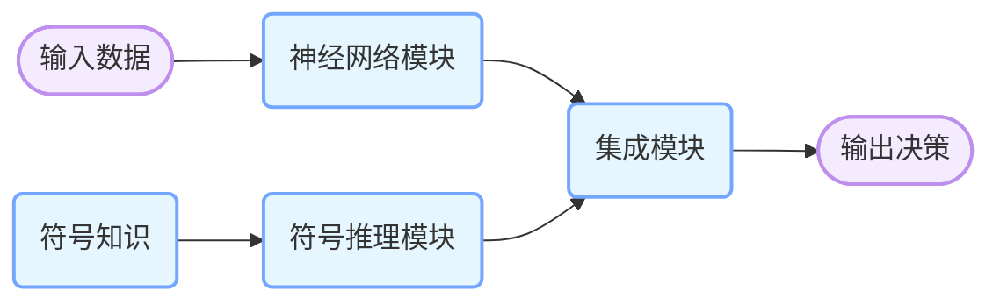

# 混合决策系统中神经符号推理的集成方法

> 关键词：混合决策系统、神经符号推理、集成方法、深度学习、符号逻辑

> 摘要：本文聚焦于混合决策系统中神经符号推理的集成方法。详细阐述了神经符号推理的核心概念与联系，深入剖析其核心算法原理和具体操作步骤，并借助数学模型和公式进行理论支撑。通过项目实战案例展示了集成方法在实际中的应用，探讨了其在不同场景下的实际用途。同时推荐了相关的学习资源、开发工具框架以及论文著作。最后对未来发展趋势与挑战进行了总结，旨在为相关领域的研究和实践提供全面且深入的参考。

## 1. 背景介绍 
### 1.1 目的和范围
在当今复杂多变的决策场景中，单一的决策系统往往难以满足实际需求。混合决策系统结合了不同类型的决策方法，以充分发挥各自的优势。神经符号推理的集成方法旨在将神经网络强大的学习能力与符号推理的逻辑表达和解释性相结合，提高决策系统的性能、可解释性和泛化能力。本文的范围涵盖了神经符号推理集成方法的核心概念、算法原理、数学模型、实际应用以及相关工具和资源等方面。

### 1.2 预期读者
本文预期读者包括人工智能、机器学习、计算机科学等领域的研究人员、工程师和学生。对于那些对混合决策系统、神经符号推理感兴趣，希望深入了解其原理和应用的专业人士，本文将提供有价值的参考。

### 1.3 文档结构概述
本文首先介绍神经符号推理的背景知识，包括相关术语和概念。接着阐述核心概念与联系，通过文本示意图和 Mermaid 流程图展示其架构。然后详细讲解核心算法原理和具体操作步骤，结合 Python 源代码进行说明。之后介绍数学模型和公式，并举例说明。通过项目实战案例展示集成方法的实际应用，包括开发环境搭建、源代码实现和代码解读。探讨实际应用场景，推荐相关的工具和资源。最后总结未来发展趋势与挑战，提供常见问题解答和扩展阅读参考资料。

### 1.4 术语表
#### 1.4.1 核心术语定义
- **混合决策系统**：结合多种不同决策方法的系统，旨在综合各方法的优势，提高决策的准确性和可靠性。
- **神经符号推理**：将神经网络的学习能力与符号推理的逻辑表达相结合的推理方法。
- **神经网络**：一种模仿人类神经系统的计算模型，通过大量的神经元连接进行信息处理和学习。
- **符号推理**：基于符号逻辑和规则进行推理和决策的方法。

#### 1.4.2 相关概念解释
- **深度学习**：神经网络的一个分支，通过多层神经网络进行特征学习和模式识别。
- **知识图谱**：一种以图的形式表示知识的方法，包含实体和实体之间的关系。
- **可解释性**：指模型的决策过程和结果能够被人类理解和解释的程度。

#### 1.4.3 缩略词列表
- **DNN**：深度神经网络（Deep Neural Network）
- **MLP**：多层感知机（Multilayer Perceptron）
- **KG**：知识图谱（Knowledge Graph）

## 2. 核心概念与联系 
神经符号推理集成方法的核心在于将神经网络和符号推理有机结合。神经网络擅长从数据中学习复杂的模式和特征，但缺乏明确的逻辑表达和解释性；而符号推理则能够基于明确的规则和逻辑进行推理，但在处理复杂数据和学习能力方面相对较弱。通过集成这两种方法，可以充分发挥它们的优势，实现更强大的决策能力。

### 核心概念原理
神经符号推理的集成可以通过多种方式实现，常见的方法包括将符号知识融入神经网络的训练过程、使用神经网络对符号表示进行学习和推理，以及将神经网络的输出转换为符号表示进行进一步的推理。

例如，在一个基于知识图谱的问答系统中，可以使用神经网络对问题进行语义理解和特征提取，然后将提取的特征与知识图谱中的符号信息相结合，进行推理和回答。这样既利用了神经网络的语言处理能力，又借助了知识图谱的逻辑结构和知识表示。

### 架构的文本示意图
```plaintext
+-------------------+           +-------------------+
|  神经网络模块     |           |  符号推理模块     |
|  （数据学习与      |           |  （规则推理与      |
|   特征提取）      |           |   逻辑判断）      |
+-------------------+           +-------------------+
           |                               |
           |                               |
           +------------+ +--------------+
                        | |
                        v v
              +-------------------+
              |  集成模块         |
              |  （信息融合与      |
              |   决策生成）      |
              +-------------------+
```

### Mermaid 流程图


## 3. 核心算法原理 & 具体操作步骤 
### 核心算法原理
神经符号推理的集成算法主要涉及到如何将神经网络和符号推理进行有效的结合。一种常见的方法是通过将符号知识转化为神经网络的约束条件，在神经网络的训练过程中引入这些约束，从而使神经网络的学习过程更加符合符号逻辑。

例如，在一个分类问题中，我们可以定义一些符号规则，如“如果特征 A 大于某个阈值，且特征 B 小于另一个阈值，则属于类别 C”。然后将这些规则转化为神经网络的损失函数的一部分，使得神经网络在训练过程中尽量满足这些规则。

### 具体操作步骤
#### 步骤 1：数据预处理
将输入数据进行清洗、归一化等预处理操作，以便神经网络能够更好地进行学习。同时，将符号知识进行整理和表示，例如将规则转化为逻辑表达式。

#### 步骤 2：神经网络模型构建
选择合适的神经网络架构，如多层感知机（MLP）、卷积神经网络（CNN）等，并进行初始化。

#### 步骤 3：符号知识融入
将符号知识转化为神经网络的约束条件，并添加到损失函数中。例如，可以使用拉格朗日乘子法将约束条件引入损失函数。

#### 步骤 4：模型训练
使用训练数据对神经网络进行训练，通过优化损失函数来更新网络参数。

#### 步骤 5：推理与决策
使用训练好的模型对新的数据进行推理，将神经网络的输出与符号推理相结合，生成最终的决策结果。

### Python 源代码详细阐述
```python
import torch
import torch.nn as nn
import torch.optim as optim

# 步骤 1：数据预处理
# 假设我们有一个简单的二维数据集
X = torch.tensor([[1.0, 2.0], [2.0, 3.0], [3.0, 4.0], [4.0, 5.0]], dtype=torch.float32)
y = torch.tensor([0, 0, 1, 1], dtype=torch.long)

# 步骤 2：神经网络模型构建
class SimpleNet(nn.Module):
    def __init__(self):
        super(SimpleNet, self).__init__()
        self.fc1 = nn.Linear(2, 10)
        self.fc2 = nn.Linear(10, 2)

    def forward(self, x):
        x = torch.relu(self.fc1(x))
        x = self.fc2(x)
        return x

model = SimpleNet()

# 步骤 3：符号知识融入
# 假设我们有一个符号规则：如果第一个特征大于 2 且第二个特征大于 3，则属于类别 1
def symbolic_constraint_loss(output, input):
    mask = (input[:, 0] > 2) & (input[:, 1] > 3)
    predicted_classes = torch.argmax(output, dim=1)
    constraint_loss = torch.mean((predicted_classes[mask] - 1) ** 2)
    return constraint_loss

# 步骤 4：模型训练
criterion = nn.CrossEntropyLoss()
optimizer = optim.Adam(model.parameters(), lr=0.001)

for epoch in range(100):
    optimizer.zero_grad()
    outputs = model(X)
    ce_loss = criterion(outputs, y)
    sc_loss = symbolic_constraint_loss(outputs, X)
    total_loss = ce_loss + 0.1 * sc_loss  # 引入符号约束损失
    total_loss.backward()
    optimizer.step()

# 步骤 5：推理与决策
new_X = torch.tensor([[5.0, 6.0]], dtype=torch.float32)
with torch.no_grad():
    new_outputs = model(new_X)
    predicted_class = torch.argmax(new_outputs, dim=1)
    print(f"Predicted class: {predicted_class.item()}")
```

## 4. 数学模型和公式 & 详细讲解 & 举例说明 
### 数学模型
神经符号推理的集成可以用以下数学模型来表示。假设我们有一个神经网络 $f_{\theta}(x)$，其中 $\theta$ 是网络的参数，$x$ 是输入数据。同时，我们有一组符号规则 $R = \{r_1, r_2, \cdots, r_n\}$。

我们的目标是在满足符号规则的前提下，最小化神经网络的损失函数 $L(f_{\theta}(x), y)$，其中 $y$ 是真实标签。可以将这个问题表示为一个带约束的优化问题：

$$
\begin{aligned}
\min_{\theta} &\quad L(f_{\theta}(x), y) + \lambda \sum_{i=1}^{n} C(r_i, f_{\theta}(x)) \\
\text{s.t.} &\quad C(r_i, f_{\theta}(x)) \geq 0, \quad i = 1, 2, \cdots, n
\end{aligned}
$$

其中，$C(r_i, f_{\theta}(x))$ 是符号规则 $r_i$ 的约束函数，$\lambda$ 是一个超参数，用于控制符号规则的权重。

### 详细讲解
- **损失函数 $L(f_{\theta}(x), y)$**：通常使用交叉熵损失、均方误差损失等常见的损失函数，用于衡量神经网络的预测结果与真实标签之间的差异。
- **约束函数 $C(r_i, f_{\theta}(x))$**：根据具体的符号规则定义。例如，如果规则是“如果 $x_1 > a$ 且 $x_2 < b$，则 $f_{\theta}(x)$ 属于类别 $c$”，则约束函数可以定义为：

$$
C(r, f_{\theta}(x)) = \begin{cases}
0, & \text{if } (x_1 > a \text{ and } x_2 < b) \text{ and } \text{argmax}(f_{\theta}(x)) = c \\
1, & \text{otherwise}
\end{cases}
$$

- **超参数 $\lambda$**：控制符号规则的权重。$\lambda$ 越大，模型在训练过程中越倾向于满足符号规则；$\lambda$ 越小，模型更注重最小化神经网络的损失函数。

### 举例说明
假设我们有一个二分类问题，输入数据 $x = [x_1, x_2]$，真实标签 $y \in \{0, 1\}$。神经网络的输出为 $f_{\theta}(x) = [p_0, p_1]$，其中 $p_0$ 和 $p_1$ 分别是属于类别 0 和类别 1 的概率。

符号规则为：如果 $x_1 > 2$ 且 $x_2 > 3$，则属于类别 1。

损失函数使用交叉熵损失：

$$
L(f_{\theta}(x), y) = - \sum_{i=0}^{1} y_i \log(p_i)
$$

约束函数为：

$$
C(r, f_{\theta}(x)) = \begin{cases}
0, & \text{if } (x_1 > 2 \text{ and } x_2 > 3) \text{ and } \text{argmax}(f_{\theta}(x)) = 1 \\
1, & \text{otherwise}
\end{cases}
$$

总损失函数为：

$$
L_{total} = L(f_{\theta}(x), y) + \lambda C(r, f_{\theta}(x))
$$

在训练过程中，通过优化总损失函数来更新神经网络的参数 $\theta$。

## 5. 项目实战：代码实际案例和详细解释说明 
### 5.1  开发环境搭建
#### 安装 Python
确保你已经安装了 Python 3.6 或更高版本。可以从 Python 官方网站（https://www.python.org/downloads/）下载并安装。

#### 安装 PyTorch
使用以下命令安装 PyTorch：
```sh
pip install torch torchvision
```

#### 安装其他依赖库
根据项目需求，可能需要安装其他依赖库，如 NumPy、Pandas 等。可以使用以下命令安装：
```sh
pip install numpy pandas
```

### 5.2  源代码详细实现和代码解读
```python
import torch
import torch.nn as nn
import torch.optim as optim
import numpy as np

# 步骤 1：数据生成
# 生成一个简单的二维数据集
np.random.seed(42)
X = np.random.randn(100, 2)
y = (X[:, 0] > 0) & (X[:, 1] > 0).astype(int)
X = torch.tensor(X, dtype=torch.float32)
y = torch.tensor(y, dtype=torch.long)

# 步骤 2：神经网络模型构建
class BinaryClassifier(nn.Module):
    def __init__(self):
        super(BinaryClassifier, self).__init__()
        self.fc1 = nn.Linear(2, 10)
        self.fc2 = nn.Linear(10, 2)

    def forward(self, x):
        x = torch.relu(self.fc1(x))
        x = self.fc2(x)
        return x

model = BinaryClassifier()

# 步骤 3：符号知识融入
# 符号规则：如果第一个特征大于 0 且第二个特征大于 0，则属于类别 1
def symbolic_constraint_loss(output, input):
    mask = (input[:, 0] > 0) & (input[:, 1] > 0)
    predicted_classes = torch.argmax(output, dim=1)
    constraint_loss = torch.mean((predicted_classes[mask] - 1) ** 2)
    return constraint_loss

# 步骤 4：模型训练
criterion = nn.CrossEntropyLoss()
optimizer = optim.Adam(model.parameters(), lr=0.001)
lambda_constraint = 0.1

for epoch in range(200):
    optimizer.zero_grad()
    outputs = model(X)
    ce_loss = criterion(outputs, y)
    sc_loss = symbolic_constraint_loss(outputs, X)
    total_loss = ce_loss + lambda_constraint * sc_loss
    total_loss.backward()
    optimizer.step()

    if (epoch + 1) % 10 == 0:
        print(f'Epoch [{epoch+1}/200], Loss: {total_loss.item():.4f}')

# 步骤 5：模型评估
with torch.no_grad():
    outputs = model(X)
    predicted_classes = torch.argmax(outputs, dim=1)
    accuracy = (predicted_classes == y).float().mean()
    print(f'Accuracy: {accuracy.item():.4f}')
```

### 代码解读与分析
- **数据生成**：使用 NumPy 生成一个简单的二维数据集，并将其转换为 PyTorch 张量。
- **神经网络模型构建**：定义一个简单的两层神经网络，包含一个输入层、一个隐藏层和一个输出层。
- **符号知识融入**：定义符号约束损失函数，根据符号规则计算约束损失。
- **模型训练**：使用交叉熵损失和符号约束损失的加权和作为总损失函数，使用 Adam 优化器进行模型训练。
- **模型评估**：在训练完成后，使用训练数据对模型进行评估，计算模型的准确率。

通过引入符号约束损失，模型在训练过程中会更加注重满足符号规则，从而提高模型的可解释性和决策的准确性。

## 6. 实际应用场景 
### 医疗诊断
在医疗诊断中，神经符号推理的集成方法可以结合医学知识图谱和患者的临床数据进行诊断。神经网络可以对患者的影像数据、病历文本等进行特征提取和分析，而符号推理则可以根据医学知识和规则进行逻辑判断和推理。例如，根据患者的症状、检查结果和医学指南，判断患者可能患有哪种疾病，并给出相应的治疗建议。

### 金融风险评估
在金融领域，神经符号推理可以用于风险评估和投资决策。神经网络可以对金融数据进行学习和预测，如股票价格走势、信用风险等。符号推理则可以结合金融规则和市场知识进行风险评估和决策。例如，根据公司的财务报表、市场趋势和监管要求，评估公司的信用风险，并决定是否给予贷款或投资。

### 智能交通
在智能交通系统中，神经符号推理可以用于交通流量预测、路径规划和自动驾驶决策。神经网络可以对交通传感器数据、地图信息等进行学习和分析，而符号推理则可以根据交通规则和逻辑进行决策。例如，根据实时交通流量和交通规则，规划最优的行车路线，或者在自动驾驶中进行决策，如是否超车、是否停车等。

## 7. 工具和资源推荐
### 7.1 学习资源推荐
#### 7.1.1 书籍推荐
- 《深度学习》（Deep Learning）：由 Ian Goodfellow、Yoshua Bengio 和 Aaron Courville 所著，是深度学习领域的经典教材，涵盖了神经网络、深度学习算法等方面的内容。
- 《人工智能：一种现代的方法》（Artificial Intelligence: A Modern Approach）：由 Stuart Russell 和 Peter Norvig 所著，是人工智能领域的权威教材，介绍了人工智能的基本概念、算法和应用。

#### 7.1.2 在线课程
- Coursera 上的“深度学习专项课程”（Deep Learning Specialization）：由 Andrew Ng 教授授课，包括神经网络、卷积神经网络、循环神经网络等深度学习的核心内容。
- edX 上的“人工智能导论”（Introduction to Artificial Intelligence）：由麻省理工学院（MIT）的教师授课，介绍了人工智能的基本概念、算法和应用。

#### 7.1.3 技术博客和网站
- Medium 上的 Towards Data Science：提供了大量关于数据科学、机器学习和深度学习的技术文章和教程。
- arXiv：一个预印本服务器，提供了最新的学术研究论文，包括神经符号推理、人工智能等领域的研究成果。

### 7.2 开发工具框架推荐
#### 7.2.1 IDE和编辑器
- PyCharm：一款专门为 Python 开发设计的集成开发环境（IDE），提供了代码编辑、调试、版本控制等功能。
- Jupyter Notebook：一个交互式的开发环境，适合进行数据探索、模型训练和可视化等工作。

#### 7.2.2 调试和性能分析工具
- TensorBoard：一个用于可视化深度学习模型训练过程和性能的工具，可以帮助开发者监控模型的损失函数、准确率等指标。
- PyTorch Profiler：用于分析 PyTorch 模型的性能，帮助开发者找出模型中的性能瓶颈。

#### 7.2.3 相关框架和库
- PyTorch：一个开源的深度学习框架，提供了丰富的神经网络层和优化算法，易于使用和扩展。
- TensorFlow：另一个广泛使用的深度学习框架，具有强大的分布式训练和部署能力。
- NetworkX：一个用于创建、操作和研究复杂网络的 Python 库，可用于知识图谱的构建和分析。

### 7.3 相关论文著作推荐
#### 7.3.1 经典论文
- “Neural-Symbolic Learning and Reasoning: Contributions and Challenges”：该论文介绍了神经符号学习和推理的基本概念、方法和挑战，是该领域的经典文献。
- “Combining Neural Networks and Symbolic AI: A Survey”：对神经网络和符号人工智能的结合方法进行了全面的综述，为后续的研究提供了重要的参考。

#### 7.3.2 最新研究成果
- 关注顶级学术会议，如 NeurIPS（神经信息处理系统大会）、ICML（国际机器学习会议）、AAAI（美国人工智能协会会议）等，这些会议上会发布神经符号推理领域的最新研究成果。

#### 7.3.3 应用案例分析
- 一些实际应用案例的论文，如医疗诊断、金融风险评估等领域的应用，展示了神经符号推理在实际场景中的有效性和实用性。

## 8. 总结：未来发展趋势与挑战
### 未来发展趋势
- **更紧密的集成方式**：未来的研究将探索更紧密的神经符号推理集成方式，使神经网络和符号推理能够更好地相互协作，充分发挥各自的优势。
- **可解释性的提升**：随着人工智能在关键领域的应用越来越广泛，对模型可解释性的要求也越来越高。神经符号推理的集成方法有望在提高模型可解释性方面取得更大的进展。
- **跨领域应用的拓展**：神经符号推理的集成方法将在更多领域得到应用，如教育、农业、工业制造等，为各领域的决策和问题解决提供更强大的支持。

### 挑战
- **符号知识的表示和获取**：如何有效地表示和获取符号知识是一个挑战。符号知识通常需要人工整理和标注，成本较高，且难以覆盖所有的情况。
- **集成方法的复杂性**：神经符号推理的集成方法通常比较复杂，需要解决神经网络和符号推理之间的兼容性、协同工作等问题。
- **计算资源的需求**：神经符号推理的集成方法通常需要大量的计算资源，特别是在处理大规模数据和复杂模型时，计算成本较高。

## 9. 附录：常见问题与解答
### 问题 1：神经符号推理和传统的机器学习方法有什么区别？
神经符号推理结合了神经网络的学习能力和符号推理的逻辑表达，而传统的机器学习方法主要依赖于数据驱动的学习，缺乏明确的逻辑解释。神经符号推理可以在学习数据模式的同时，利用符号规则进行推理和决策，提高模型的可解释性和泛化能力。

### 问题 2：如何选择合适的符号规则？
选择合适的符号规则需要结合具体的应用场景和问题。可以从领域知识、专家经验、历史数据等方面获取符号规则。同时，需要对符号规则进行评估和验证，确保其有效性和合理性。

### 问题 3：神经符号推理的集成方法对数据有什么要求？
神经符号推理的集成方法对数据的要求与传统的机器学习方法类似，需要有足够的训练数据，并且数据质量要高。此外，还需要有相应的符号知识来支持符号推理。

## 10. 扩展阅读 & 参考资料
- Goodfellow, I., Bengio, Y., & Courville, A. (2016). Deep Learning. MIT Press.
- Russell, S. J., & Norvig, P. (2020). Artificial Intelligence: A Modern Approach. Pearson.
- Towards Data Science. https://towardsdatascience.com/
- arXiv. https://arxiv.org/

作者：AI天才研究院/AI Genius Institute & 禅与计算机程序设计艺术 /Zen And The Art of Computer Programming