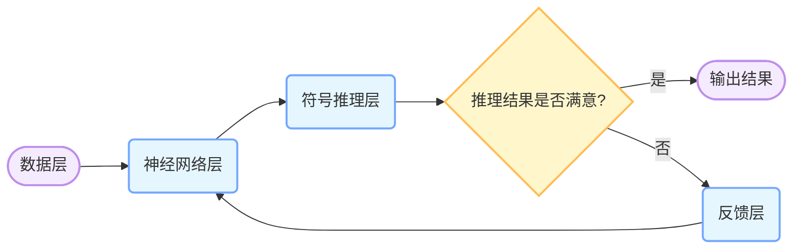

# 混合推理优化框架中神经符号集成的新方法

> 关键词：混合推理优化框架、神经符号集成、新方法、人工智能、知识表示、推理机制

> 摘要：本文聚焦于混合推理优化框架中神经符号集成的新方法。在人工智能不断发展的当下，单纯的神经网络或符号推理都存在一定局限性，而神经符号集成旨在结合两者优势，实现更高效、智能的推理。文章深入探讨了神经符号集成的核心概念、算法原理、数学模型，通过项目实战展示其实际应用，分析了相关应用场景，并推荐了学习、开发工具与资源，最后对其未来发展趋势与挑战进行了总结，以期为该领域的研究与实践提供全面且深入的参考。

## 1. 背景介绍 
### 1.1 目的和范围
随着人工智能技术的快速发展，人们对智能系统的推理能力和效率提出了更高的要求。传统的符号推理系统具有精确性和可解释性，但在处理复杂、模糊的现实世界数据时面临挑战；而神经网络虽然在模式识别、数据拟合等方面表现出色，但缺乏明确的语义表示和可解释性。因此，将神经网络与符号推理相结合的神经符号集成方法成为研究热点。本文的目的在于介绍混合推理优化框架中神经符号集成的新方法，详细阐述其原理、算法、应用等方面，范围涵盖理论基础、技术实现以及实际应用案例等。

### 1.2 预期读者
本文预期读者包括人工智能领域的研究人员、开发者、学生以及对智能推理技术感兴趣的专业人士。对于希望深入了解神经符号集成技术的初学者，本文提供了系统的基础知识和入门引导；对于有一定经验的研究人员和开发者，文中的新方法和实际应用案例将为其研究和实践提供新的思路和参考。

### 1.3 文档结构概述
本文首先介绍了混合推理优化框架中神经符号集成的背景信息，包括目的、预期读者和文档结构概述等。接着阐述了核心概念与联系，通过文本示意图和 Mermaid 流程图展示神经符号集成的原理和架构。然后详细讲解了核心算法原理及具体操作步骤，并用 Python 源代码进行阐述。随后介绍了数学模型和公式，并通过举例说明其应用。之后通过项目实战展示代码实际案例并进行详细解释说明。再分析了实际应用场景，推荐了相关的工具和资源。最后总结了未来发展趋势与挑战，提供了常见问题与解答以及扩展阅读和参考资料。

### 1.4 术语表
#### 1.4.1 核心术语定义
- **混合推理优化框架**：一种结合多种推理方式，旨在提高推理效率和准确性的框架。
- **神经符号集成**：将神经网络的学习能力与符号推理的逻辑表达和可解释性相结合的方法。
- **神经网络**：一种模仿人类神经系统的计算模型，通过对大量数据的学习来实现模式识别、预测等功能。
- **符号推理**：基于符号逻辑和规则进行推理的方法，具有明确的语义表示和可解释性。

#### 1.4.2 相关概念解释
- **知识表示**：将现实世界的知识以计算机能够理解和处理的形式进行表示，如逻辑表达式、语义网络等。
- **推理机制**：根据已知的知识和事实，推导出新的结论的方法和过程。
- **可解释性**：指模型的决策过程和结果能够被人类理解和解释的程度。

#### 1.4.3 缩略词列表
- **AI**：Artificial Intelligence，人工智能
- **NN**：Neural Network，神经网络
- **SR**：Symbolic Reasoning，符号推理

## 2. 核心概念与联系 

### 神经符号集成的原理
神经符号集成的核心思想是将神经网络的感知和学习能力与符号推理的逻辑表达和可解释性相结合。神经网络可以自动从大量数据中学习特征和模式，而符号推理则可以利用逻辑规则和知识进行精确的推理。通过神经符号集成，可以实现对复杂问题的高效推理和决策。

### 神经符号集成的架构
神经符号集成的架构通常包括以下几个部分：
1. **数据层**：负责收集和预处理原始数据，将其转换为适合神经网络和符号推理处理的形式。
2. **神经网络层**：通过对数据的学习，提取特征和模式，为符号推理提供输入。
3. **符号推理层**：根据神经网络提供的信息和预先定义的逻辑规则，进行推理和决策。
4. **反馈层**：将符号推理的结果反馈给神经网络，用于调整网络参数，提高推理的准确性。

### 文本示意图
神经符号集成的架构可以用以下文本示意图表示：

数据层 -> 神经网络层 -> 符号推理层 -> 反馈层

### Mermaid 流程图


## 3. 核心算法原理 & 具体操作步骤 

### 核心算法原理
神经符号集成的核心算法通常包括以下几个步骤：
1. **数据预处理**：对原始数据进行清洗、归一化等处理，将其转换为适合神经网络和符号推理处理的形式。
2. **神经网络训练**：使用预处理后的数据训练神经网络，使其能够自动提取特征和模式。
3. **符号规则定义**：根据领域知识和问题需求，定义符号推理的逻辑规则。
4. **神经符号集成推理**：将神经网络的输出作为符号推理的输入，根据符号规则进行推理和决策。
5. **反馈调整**：根据推理结果，调整神经网络的参数，提高推理的准确性。

### 具体操作步骤及 Python 源代码实现

```python
import numpy as np
from sklearn.preprocessing import StandardScaler
from sklearn.neural_network import MLPClassifier
import sympy as sp

# 数据预处理
def preprocess_data(X):
    scaler = StandardScaler()
    X_scaled = scaler.fit_transform(X)
    return X_scaled

# 神经网络训练
def train_neural_network(X, y):
    mlp = MLPClassifier(hidden_layer_sizes=(10, 10), max_iter=1000)
    mlp.fit(X, y)
    return mlp

# 符号规则定义
def define_symbolic_rules():
    # 定义符号变量
    x1, x2 = sp.symbols('x1 x2')
    # 定义规则
    rule1 = sp.Or(x1 > 0, x2 < 0)
    return rule1

# 神经符号集成推理
def neural_symbolic_inference(mlp, X, rule):
    y_pred = mlp.predict(X)
    results = []
    for i in range(len(X)):
        x1, x2 = X[i][0], X[i][1]
        substitution = {sp.symbols('x1'): x1, sp.symbols('x2'): x2}
        rule_result = sp.simplify(rule.subs(substitution))
        results.append((y_pred[i], rule_result))
    return results

# 反馈调整
def feedback_adjustment(mlp, X, y_true, results):
    # 根据推理结果调整神经网络参数
    # 这里简单示例，不做具体实现
    pass

# 主函数
def main():
    # 生成示例数据
    X = np.random.rand(100, 2)
    y = np.random.randint(0, 2, 100)
    
    # 数据预处理
    X_scaled = preprocess_data(X)
    
    # 神经网络训练
    mlp = train_neural_network(X_scaled, y)
    
    # 符号规则定义
    rule = define_symbolic_rules()
    
    # 神经符号集成推理
    results = neural_symbolic_inference(mlp, X_scaled, rule)
    
    # 反馈调整
    feedback_adjustment(mlp, X_scaled, y, results)
    
    print("推理结果:", results)

if __name__ == "__main__":
    main()
```

## 4. 数学模型和公式 & 详细讲解 & 举例说明 

### 神经网络的数学模型
神经网络通常由多个神经元组成，每个神经元的输出可以表示为：

$$
y = f\left(\sum_{i=1}^{n} w_{i}x_{i} + b\right)
$$

其中，$x_{i}$ 是输入信号，$w_{i}$ 是权重，$b$ 是偏置，$f$ 是激活函数。

### 符号推理的逻辑表达式
符号推理通常使用逻辑表达式来表示规则，如逻辑与（$\land$）、逻辑或（$\lor$）、逻辑非（$\neg$）等。例如，规则“如果 $x1$ 大于 0 或者 $x2$ 小于 0，则结果为真”可以表示为：

$$
\text{result} = x1 > 0 \lor x2 < 0
$$

### 神经符号集成的数学模型
神经符号集成的数学模型可以表示为：

$$
\text{output} = \text{SR}(\text{NN}(x), R)
$$

其中，$\text{NN}(x)$ 是神经网络的输出，$R$ 是符号推理的规则，$\text{SR}$ 是符号推理函数。

### 举例说明
假设有一个二维输入数据 $x = [1, -2]$，神经网络的输出为 $y_{nn} = 1$，符号规则为 $x1 > 0 \lor x2 < 0$。将输入数据代入符号规则中，可得：

$$
1 > 0 \lor -2 < 0 = \text{True}
$$

最终的推理结果为 $(y_{nn}, \text{True}) = (1, \text{True})$。

## 5. 项目实战：代码实际案例和详细解释说明 

### 5.1  开发环境搭建
1. **安装 Python**：确保系统中安装了 Python 3.x 版本。
2. **安装依赖库**：使用以下命令安装所需的依赖库：
```sh
pip install numpy scikit-learn sympy
```

### 5.2  源代码详细实现和代码解读

```python
import numpy as np
from sklearn.preprocessing import StandardScaler
from sklearn.neural_network import MLPClassifier
import sympy as sp

# 数据预处理
def preprocess_data(X):
    """
    对输入数据进行标准化处理
    :param X: 输入数据
    :return: 标准化后的数据
    """
    scaler = StandardScaler()
    X_scaled = scaler.fit_transform(X)
    return X_scaled

# 神经网络训练
def train_neural_network(X, y):
    """
    训练神经网络
    :param X: 输入数据
    :param y: 标签数据
    :return: 训练好的神经网络模型
    """
    mlp = MLPClassifier(hidden_layer_sizes=(10, 10), max_iter=1000)
    mlp.fit(X, y)
    return mlp

# 符号规则定义
def define_symbolic_rules():
    """
    定义符号推理的规则
    :return: 符号规则表达式
    """
    # 定义符号变量
    x1, x2 = sp.symbols('x1 x2')
    # 定义规则
    rule1 = sp.Or(x1 > 0, x2 < 0)
    return rule1

# 神经符号集成推理
def neural_symbolic_inference(mlp, X, rule):
    """
    进行神经符号集成推理
    :param mlp: 训练好的神经网络模型
    :param X: 输入数据
    :param rule: 符号规则表达式
    :return: 推理结果
    """
    y_pred = mlp.predict(X)
    results = []
    for i in range(len(X)):
        x1, x2 = X[i][0], X[i][1]
        substitution = {sp.symbols('x1'): x1, sp.symbols('x2'): x2}
        rule_result = sp.simplify(rule.subs(substitution))
        results.append((y_pred[i], rule_result))
    return results

# 反馈调整
def feedback_adjustment(mlp, X, y_true, results):
    """
    根据推理结果调整神经网络参数
    :param mlp: 训练好的神经网络模型
    :param X: 输入数据
    :param y_true: 真实标签数据
    :param results: 推理结果
    :return: 无
    """
    # 这里简单示例，不做具体实现
    pass

# 主函数
def main():
    """
    主函数，执行整个神经符号集成推理流程
    :return: 无
    """
    # 生成示例数据
    X = np.random.rand(100, 2)
    y = np.random.randint(0, 2, 100)
    
    # 数据预处理
    X_scaled = preprocess_data(X)
    
    # 神经网络训练
    mlp = train_neural_network(X_scaled, y)
    
    # 符号规则定义
    rule = define_symbolic_rules()
    
    # 神经符号集成推理
    results = neural_symbolic_inference(mlp, X_scaled, rule)
    
    # 反馈调整
    feedback_adjustment(mlp, X_scaled, y, results)
    
    print("推理结果:", results)

if __name__ == "__main__":
    main()
```

### 5.3  代码解读与分析
1. **数据预处理**：使用 `StandardScaler` 对输入数据进行标准化处理，将数据转换为均值为 0，标准差为 1 的分布，有助于提高神经网络的训练效果。
2. **神经网络训练**：使用 `MLPClassifier` 训练一个多层感知器神经网络，隐藏层大小为 (10, 10)，最大迭代次数为 1000。
3. **符号规则定义**：使用 `sympy` 库定义符号推理的规则，这里定义了一个简单的逻辑或规则。
4. **神经符号集成推理**：将神经网络的预测结果与符号规则的推理结果相结合，得到最终的推理结果。
5. **反馈调整**：根据推理结果调整神经网络的参数，提高推理的准确性，这里只是简单示例，未做具体实现。

## 6. 实际应用场景 
### 智能医疗诊断
在智能医疗诊断中，神经符号集成可以结合医学影像数据（如 X 光、CT 等）和医学知识（如诊断规则、临床指南等）进行疾病诊断。神经网络可以从医学影像中提取特征，符号推理则可以根据医学知识对这些特征进行分析和判断，从而提高诊断的准确性和可解释性。

### 自动驾驶
在自动驾驶中，神经符号集成可以结合传感器数据（如摄像头、雷达等）和交通规则进行决策。神经网络可以对传感器数据进行处理和分析，符号推理则可以根据交通规则对车辆的行驶状态进行判断和决策，从而提高自动驾驶的安全性和可靠性。

### 智能客服
在智能客服中，神经符号集成可以结合用户的问题和知识库进行回答。神经网络可以对用户的问题进行语义理解和分类，符号推理则可以根据知识库中的知识对用户的问题进行回答，从而提高智能客服的准确性和效率。

## 7. 工具和资源推荐
### 7.1 学习资源推荐
#### 7.1.1 书籍推荐
- 《人工智能：一种现代的方法》：全面介绍了人工智能的各个领域，包括知识表示、推理、机器学习等。
- 《深度学习》：深入讲解了深度学习的原理、算法和应用。
- 《符号逻辑与机械定理证明》：介绍了符号逻辑和机械定理证明的基本概念和方法。

#### 7.1.2 在线课程
- Coursera 上的“人工智能基础”课程：由知名高校的教授授课，系统介绍了人工智能的基础知识。
- edX 上的“深度学习”课程：提供了深度学习的理论和实践指导。
- Udemy 上的“神经符号集成技术”课程：专门介绍了神经符号集成的原理和应用。

#### 7.1.3 技术博客和网站
- Medium：有许多关于人工智能和神经符号集成的技术文章和案例分享。
- arXiv：提供了大量的学术论文和研究成果。
- AI Stack Exchange：一个人工智能领域的问答社区，可以在这里交流和学习。

### 7.2 开发工具框架推荐
#### 7.2.1 IDE和编辑器
- PyCharm：一款专业的 Python 集成开发环境，提供了丰富的代码编辑、调试和分析功能。
- Jupyter Notebook：一个交互式的开发环境，适合进行数据探索、模型训练和可视化。
- Visual Studio Code：一款轻量级的代码编辑器，支持多种编程语言和插件扩展。

#### 7.2.2 调试和性能分析工具
- TensorBoard：用于可视化神经网络的训练过程和性能指标。
- Py-Spy：一个用于分析 Python 程序性能的工具。
- cProfile：Python 内置的性能分析模块，可以帮助定位程序中的性能瓶颈。

#### 7.2.3 相关框架和库
- TensorFlow：一个开源的机器学习框架，提供了丰富的深度学习模型和工具。
- PyTorch：另一个流行的深度学习框架，具有动态图和易于使用的特点