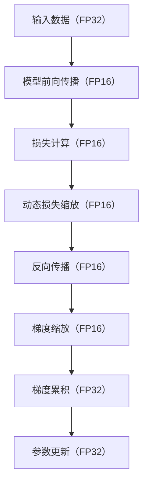

# 混合精度训练在大规模语言模型中的实践

> 关键词：混合精度训练、大规模语言模型、深度学习、浮点数精度、计算效率

> 摘要：本文围绕混合精度训练在大规模语言模型中的实践展开。首先介绍了混合精度训练的背景，包括其目的、适用读者和文档结构等。接着详细阐述了核心概念，如不同浮点数精度的特点和它们之间的联系，并通过示意图和流程图展示。深入讲解了核心算法原理，用Python代码进行了详细说明，同时给出了相关数学模型和公式，并举例解释。通过项目实战，从开发环境搭建到源代码实现及解读，展示了混合精度训练的实际操作。还探讨了其实际应用场景，推荐了学习资源、开发工具框架和相关论文著作。最后总结了未来发展趋势与挑战，并对常见问题进行了解答，为相关领域的研究者和开发者提供了全面的参考。

## 1. 背景介绍 
### 1.1 目的和范围
在当今人工智能领域，大规模语言模型如GPT - 3、BERT等取得了显著的成果，但训练这些模型面临着巨大的计算资源和时间成本挑战。混合精度训练作为一种有效的优化技术，旨在通过同时使用不同精度的浮点数来提高训练效率，减少内存占用，从而加速大规模语言模型的训练过程。本文的范围涵盖了混合精度训练的基本概念、算法原理、实际应用以及在大规模语言模型训练中的具体实践。

### 1.2 预期读者
本文主要面向深度学习领域的研究者、开发者和工程师，尤其是对大规模语言模型训练感兴趣，希望通过优化训练过程来提高效率的人员。同时，对于对计算机科学中数值计算和优化技术有一定了解的读者也具有参考价值。

### 1.3 文档结构概述
本文首先介绍混合精度训练的相关背景知识，包括目的、预期读者和文档结构。接着详细阐述核心概念，如不同浮点数精度的特点和它们之间的联系。然后深入讲解核心算法原理，并用Python代码进行详细说明。之后给出相关数学模型和公式，并举例解释。通过项目实战，展示混合精度训练在大规模语言模型中的实际操作，包括开发环境搭建、源代码实现及解读。还探讨了其实际应用场景，推荐了学习资源、开发工具框架和相关论文著作。最后总结未来发展趋势与挑战，并对常见问题进行解答。

### 1.4 术语表
#### 1.4.1 核心术语定义
- **混合精度训练（Mixed Precision Training）**：在深度学习训练过程中，同时使用不同精度的浮点数（如单精度浮点数FP32和半精度浮点数FP16）进行计算，以提高计算效率和减少内存占用。
- **单精度浮点数（FP32）**：一种32位的浮点数表示方法，通常用于深度学习中以保证计算的准确性，但占用较多的内存和计算资源。
- **半精度浮点数（FP16）**：一种16位的浮点数表示方法，占用内存较少，计算速度较快，但表示范围和精度相对较低。
- **动态损失缩放（Dynamic Loss Scaling）**：在混合精度训练中，为了避免半精度浮点数下溢问题，动态调整损失值的缩放因子，以保证梯度计算的准确性。

#### 1.4.2 相关概念解释
- **数值下溢（Underflow）**：当计算结果的绝对值小于浮点数所能表示的最小非零值时，会发生数值下溢，导致计算结果变为零，影响训练的稳定性。
- **数值溢出（Overflow）**：当计算结果的绝对值大于浮点数所能表示的最大值时，会发生数值溢出，导致计算结果变为无穷大，同样影响训练的稳定性。

#### 1.4.3 缩略词列表
- **FP32**：单精度浮点数（32 - bit Floating Point）
- **FP16**：半精度浮点数（16 - bit Floating Point）
- **DNN**：深度神经网络（Deep Neural Network）
- **GPU**：图形处理器（Graphics Processing Unit）

## 2. 核心概念与联系 
### 核心概念原理
在深度学习中，传统的训练方式通常使用单精度浮点数（FP32）进行计算。FP32具有较高的精度和较大的表示范围，能够保证计算的准确性，但它占用的内存较多，计算速度相对较慢。随着大规模语言模型的发展，模型参数数量急剧增加，训练所需的内存和计算资源也大幅提升，这使得使用FP32进行训练变得效率低下。

半精度浮点数（FP16）占用的内存仅为FP32的一半，计算速度更快。然而，FP16的表示范围和精度相对较低，容易出现数值下溢和溢出问题。混合精度训练的核心思想是结合FP32和FP16的优势，在计算密集型的操作（如矩阵乘法）中使用FP16以提高计算效率，而在需要高精度的操作（如参数更新）中使用FP32以保证训练的稳定性。

### 架构的文本示意图
```plaintext
混合精度训练架构

输入数据（FP32）
    |
    v
模型前向传播（FP16）
    |
    v
损失计算（FP16）
    |
    v
动态损失缩放（FP16）
    |
    v
反向传播（FP16）
    |
    v
梯度缩放（FP16）
    |
    v
梯度累积（FP32）
    |
    v
参数更新（FP32）
```

### Mermaid流程图


## 3. 核心算法原理 & 具体操作步骤 
### 核心算法原理
混合精度训练的核心算法主要包括动态损失缩放和梯度累积。动态损失缩放是为了避免FP16下溢问题，通过动态调整损失值的缩放因子，使得梯度在FP16表示范围内能够被准确计算。梯度累积是为了在不增加内存占用的情况下模拟更大的批量大小，将多个小批量的梯度累积起来，然后进行一次参数更新。

### 具体操作步骤
1. **数据加载**：将输入数据以FP32格式加载到内存中。
2. **模型初始化**：将模型参数初始化为FP32格式。
3. **前向传播**：将输入数据转换为FP16格式，进行模型的前向传播计算，得到预测结果。
4. **损失计算**：在FP16格式下计算损失值。
5. **动态损失缩放**：对损失值进行缩放，以避免FP16下溢问题。
6. **反向传播**：在FP16格式下进行反向传播，计算梯度。
7. **梯度缩放**：将缩放后的梯度还原为原始梯度。
8. **梯度累积**：将梯度累积到FP32格式的梯度缓冲区中。
9. **参数更新**：根据累积的梯度，在FP32格式下更新模型参数。

### Python源代码详细阐述
```python
import torch
import torch.nn as nn
import torch.optim as optim
from torch.cuda.amp import GradScaler, autocast

# 定义一个简单的神经网络模型
class SimpleModel(nn.Module):
    def __init__(self):
        super(SimpleModel, self).__init__()
        self.fc1 = nn.Linear(10, 20)
        self.fc2 = nn.Linear(20, 1)

    def forward(self, x):
        x = torch.relu(self.fc1(x))
        x = self.fc2(x)
        return x

# 初始化模型和优化器
model = SimpleModel().cuda()
optimizer = optim.SGD(model.parameters(), lr=0.001)

# 初始化梯度缩放器
scaler = GradScaler()

# 模拟训练数据
inputs = torch.randn(32, 10).cuda()
labels = torch.randn(32, 1).cuda()

# 训练循环
for epoch in range(10):
    optimizer.zero_grad()

    # 自动混合精度上下文
    with autocast():
        outputs = model(inputs)
        loss = nn.MSELoss()(outputs, labels)

    # 动态损失缩放
    scaler.scale(loss).backward()

    # 梯度缩放和参数更新
    scaler.step(optimizer)
    scaler.update()

    print(f'Epoch {epoch + 1}, Loss: {loss.item()}')
```

## 4. 数学模型和公式 & 详细讲解 & 举例说明 
### 数学模型和公式
#### 动态损失缩放
设原始损失值为 $L$，缩放因子为 $\alpha$，则缩放后的损失值为 $L' = \alpha \cdot L$。在反向传播过程中，计算得到的梯度也会相应地缩放，设原始梯度为 $g$，缩放后的梯度为 $g'$，则 $g' = \alpha \cdot g$。在参数更新之前，需要将缩放后的梯度还原为原始梯度，即 $g = \frac{g'}{\alpha}$。

#### 梯度累积
设小批量的梯度为 $g_i$，累积的梯度为 $G$，则 $G = \sum_{i = 1}^{n} g_i$，其中 $n$ 为累积的小批量数量。在进行参数更新时，使用累积的梯度 $G$ 进行更新。

### 详细讲解
动态损失缩放的目的是为了避免FP16下溢问题。由于FP16的表示范围较小，当损失值较小时，其梯度可能会下溢为零。通过缩放损失值，可以将梯度放大到FP16能够表示的范围内，从而保证梯度计算的准确性。在反向传播完成后，需要将缩放后的梯度还原为原始梯度，以保证参数更新的正确性。

梯度累积可以在不增加内存占用的情况下模拟更大的批量大小。在训练大规模语言模型时，由于内存限制，无法使用较大的批量大小。通过梯度累积，可以将多个小批量的梯度累积起来，然后进行一次参数更新，从而达到与使用大批量相同的效果。

### 举例说明
假设原始损失值 $L = 0.0001$，缩放因子 $\alpha = 1024$，则缩放后的损失值 $L' = 1024 \times 0.0001 = 0.1024$。在反向传播过程中，计算得到的缩放后的梯度 $g'$ 可以在FP16表示范围内准确计算。在参数更新之前，将缩放后的梯度 $g'$ 除以缩放因子 $\alpha$，得到原始梯度 $g$。

假设每次小批量的梯度为 $g_1 = [0.1, 0.2, 0.3]$，$g_2 = [0.2, 0.3, 0.4]$，$g_3 = [0.3, 0.4, 0.5]$，累积的小批量数量 $n = 3$，则累积的梯度 $G = g_1 + g_2 + g_3 = [0.6, 0.9, 1.2]$。在进行参数更新时，使用累积的梯度 $G$ 进行更新。

## 5. 项目实战：代码实际案例和详细解释说明 
### 5.1  开发环境搭建
#### 硬件环境
- **GPU**：建议使用NVIDIA GPU，如NVIDIA V100、A100等，这些GPU支持半精度浮点数计算，能够显著提高混合精度训练的效率。
- **CPU**：多核CPU，用于数据加载和预处理等操作。

#### 软件环境
- **操作系统**：Linux系统，如Ubuntu 18.04或更高版本。
- **深度学习框架**：PyTorch 1.6或更高版本，支持自动混合精度训练。
- **CUDA**：与GPU对应的CUDA版本，如CUDA 11.0或更高版本。
- **cuDNN**：与CUDA版本对应的cuDNN库。

### 5.2  源代码详细实现和代码解读
```python
import torch
import torch.nn as nn
import torch.optim as optim
from torch.cuda.amp import GradScaler, autocast
from torch.utils.data import DataLoader, Dataset

# 自定义数据集类
class CustomDataset(Dataset):
    def __init__(self, data, labels):
        self.data = data
        self.labels = labels

    def __len__(self):
        return len(self.data)

    def __getitem__(self, idx):
        return self.data[idx], self.labels[idx]

# 定义一个简单的神经网络模型
class SimpleModel(nn.Module):
    def __init__(self):
        super(SimpleModel, self).__init__()
        self.fc1 = nn.Linear(10, 20)
        self.fc2 = nn.Linear(20, 1)

    def forward(self, x):
        x = torch.relu(self.fc1(x))
        x = self.fc2(x)
        return x

# 初始化模型和优化器
model = SimpleModel().cuda()
optimizer = optim.SGD(model.parameters(), lr=0.001)

# 初始化梯度缩放器
scaler = GradScaler()

# 模拟训练数据
data = torch.randn(100, 10)
labels = torch.randn(100, 1)

# 创建数据集和数据加载器
dataset = CustomDataset(data, labels)
dataloader = DataLoader(dataset, batch_size=32, shuffle=True)

# 训练循环
num_epochs = 10
for epoch in range(num_epochs):
    running_loss = 0.0
    for inputs, targets in dataloader:
        inputs = inputs.cuda()
        targets = targets.cuda()

        optimizer.zero_grad()

        # 自动混合精度上下文
        with autocast():
            outputs = model(inputs)
            loss = nn.MSELoss()(outputs, targets)

        # 动态损失缩放
        scaler.scale(loss).backward()

        # 梯度缩放和参数更新
        scaler.step(optimizer)
        scaler.update()

        running_loss += loss.item()

    print(f'Epoch {epoch + 1}, Loss: {running_loss / len(dataloader)}')
```

### 代码解读与分析
1. **自定义数据集类**：`CustomDataset` 类继承自 `torch.utils.data.Dataset`，用于封装训练数据和标签。通过实现 `__len__` 和 `__getitem__` 方法，可以方便地使用 `DataLoader` 进行数据加载。
2. **神经网络模型**：`SimpleModel` 类定义了一个简单的两层全连接神经网络，包含一个ReLU激活函数。
3. **初始化模型和优化器**：将模型移动到GPU上，并使用随机梯度下降（SGD）优化器进行参数更新。
4. **初始化梯度缩放器**：`GradScaler` 用于动态调整损失值的缩放因子，避免FP16下溢问题。
5. **数据加载**：使用 `DataLoader` 加载训练数据，设置批量大小为32，并进行随机打乱。
6. **训练循环**：在每个epoch中，遍历数据加载器，对每个小批量的数据进行前向传播、损失计算、反向传播和参数更新。使用 `autocast` 上下文管理器实现自动混合精度训练，在该上下文中的计算将使用FP16进行。使用 `scaler.scale` 对损失值进行缩放，使用 `scaler.step` 进行梯度缩放和参数更新，使用 `scaler.update` 更新缩放因子。

## 6. 实际应用场景 
### 大规模语言模型训练
在训练像GPT - 3、BERT这样的大规模语言模型时，模型参数数量巨大，训练所需的内存和计算资源非常高。混合精度训练可以显著减少内存占用，提高计算效率，从而加速模型的训练过程。例如，在OpenAI的GPT - 3训练中，使用了混合精度训练技术，大大缩短了训练时间。

### 实时推理
在实时推理场景中，如智能客服、语音识别等，需要快速得到推理结果。混合精度训练可以在不损失太多精度的情况下，提高模型的推理速度，满足实时性要求。

### 资源受限环境
在一些资源受限的环境中，如移动设备、嵌入式系统等，内存和计算资源有限。混合精度训练可以减少模型的内存占用，使得模型能够在这些设备上运行。

## 7. 工具和资源推荐
### 7.1 学习资源推荐
#### 7.1.1 书籍推荐
- 《深度学习》（Deep Learning）：由Ian Goodfellow、Yoshua Bengio和Aaron Courville撰写，是深度学习领域的经典教材，涵盖了深度学习的基本概念、算法和应用。
- 《动手学深度学习》（Dive into Deep Learning）：由 Aston Zhang、Zachary C. Lipton、Mu Li和Alexander J. Smola撰写，提供了丰富的代码示例和实践指导，适合初学者学习深度学习。

#### 7.1.2 在线课程
- Coursera上的《深度学习专项课程》（Deep Learning Specialization）：由Andrew Ng教授讲授，包括深度学习基础、卷积神经网络、循环神经网络等多个课程，是学习深度学习的优质资源。
- edX上的《使用PyTorch进行深度学习》（Introduction to Deep Learning with PyTorch）：介绍了PyTorch深度学习框架的基本使用和应用，适合初学者快速上手。

#### 7.1.3 技术博客和网站
- Medium上的Towards Data Science：提供了大量关于深度学习、机器学习等领域的技术文章和实践经验分享。
- arXiv：是一个预印本数据库，包含了最新的学术研究成果，可用于了解混合精度训练等领域的前沿进展。

### 7.2 开发工具框架推荐
#### 7.2.1 IDE和编辑器
- PyCharm：是一款专门为Python开发设计的集成开发环境，提供了丰富的代码编辑、调试和分析功能。
- Jupyter Notebook：是一个交互式的开发环境，适合进行数据分析、模型训练和实验验证。

#### 7.2.2 调试和性能分析工具
- TensorBoard：是TensorFlow提供的可视化工具，可用于监控模型训练过程中的损失值、准确率等指标，以及可视化模型的结构和参数分布。
- NVIDIA Nsight Compute：是NVIDIA提供的性能分析工具，可用于分析GPU的计算性能，帮助优化混合精度训练的代码。

#### 7.2.3 相关框架和库
- PyTorch：是一个开源的深度学习框架，支持自动混合精度训练，提供了丰富的深度学习模型和工具。
- TensorFlow：是另一个广泛使用的深度学习框架，也支持混合精度训练，具有强大的分布式训练和部署能力。

### 7.3 相关论文著作推荐
#### 7.3.1 经典论文
- 《Mixed Precision Training》：由Paulius Micikevicius等人发表，首次提出了混合精度训练的概念和方法，是该领域的经典论文。
- 《Deep Residual Learning for Image Recognition》：由Kaiming He等人发表，介绍了残差网络（ResNet）的设计和训练方法，其中也涉及到了混合精度训练的应用。

#### 7.3.2 最新研究成果
- 在arXiv上搜索“Mixed Precision Training for Large - Scale Language Models”，可以找到关于混合精度训练在大规模语言模型中最新的研究成果。

#### 7.3.3 应用案例分析
- 一些知名科技公司如Google、OpenAI等会在其官方博客或学术会议上分享混合精度训练在实际项目中的应用案例，可以关注这些信息了解实际应用中的经验和技巧。

## 8. 总结：未来发展趋势与挑战
### 未来发展趋势
- **更高精度的混合训练**：随着硬件技术的不断发展，可能会出现比FP16更高精度但占用内存更少的浮点数表示方法，进一步提高混合精度训练的效率和精度。
- **自适应混合精度策略**：目前的混合精度训练大多采用固定的精度组合和损失缩放策略，未来可能会发展出自适应的混合精度策略，根据模型的特点和训练阶段自动调整精度和缩放因子。
- **在更多领域的应用**：除了大规模语言模型和计算机视觉领域，混合精度训练有望在更多领域得到应用，如医疗影像分析、金融预测等。

### 挑战
- **数值稳定性问题**：尽管动态损失缩放等技术可以在一定程度上解决FP16下溢和溢出问题，但在某些复杂的模型和训练场景下，数值稳定性仍然是一个挑战。
- **硬件兼容性问题**：不同的GPU硬件对混合精度训练的支持程度不同，可能会导致在不同硬件平台上的训练效果和性能存在差异。
- **模型可解释性问题**：混合精度训练可能会对模型的可解释性产生一定影响，如何在提高训练效率的同时保证模型的可解释性是一个需要解决的问题。

## 9. 附录：常见问题与解答
### 问题1：混合精度训练一定会提高训练效率吗？
不一定。混合精度训练在大多数情况下可以提高训练效率，尤其是在计算密集型的任务中。但在某些情况下，如模型规模较小或计算量较小时，混合精度训练可能不会带来明显的效率提升，甚至可能由于额外的损失缩放和梯度处理操作而导致性能下降。

### 问题2：如何选择合适的损失缩放因子？
目前大多数深度学习框架（如PyTorch）提供了动态损失缩放功能，会自动调整损失缩放因子。一般情况下，使用默认的动态损失缩放设置即可。如果需要手动调整，可以根据经验和实验结果进行尝试，但需要注意避免数值溢出和下溢问题。

### 问题3：混合精度训练会影响模型的准确性吗？
在大多数情况下，混合精度训练不会显著影响模型的准确性。通过合理的损失缩放和梯度处理技术，可以保证模型训练的稳定性和准确性。但在某些对精度要求极高的任务中，可能需要进行额外的调整和验证。

### 问题4：混合精度训练可以在CPU上使用吗？
目前大多数混合精度训练技术是针对GPU设计的，因为GPU具有专门的半精度浮点数计算单元。虽然理论上可以在CPU上实现混合精度训练，但由于CPU缺乏对FP16的高效支持，训练效率可能不会有明显提升。

## 10. 扩展阅读 & 参考资料
- Goodfellow, I., Bengio, Y., & Courville, A. (2016). Deep Learning. MIT Press.
- Zhang, A., Lipton, Z. C., Li, M., & Smola, A. J. (2020). Dive into Deep Learning.
- Micikevicius, P., Narang, S., Alben, J., Diamos, G., Elsen, E., Garcia, D.,... & Wu, H. (2017). Mixed Precision Training. arXiv preprint arXiv:1710.03740.
- He, K., Zhang, X., Ren, S., & Sun, J. (2015). Deep Residual Learning for Image Recognition. arXiv preprint arXiv:1512.03385.

作者：AI天才研究院/AI Genius Institute & 禅与计算机程序设计艺术 /Zen And The Art of Computer Programming