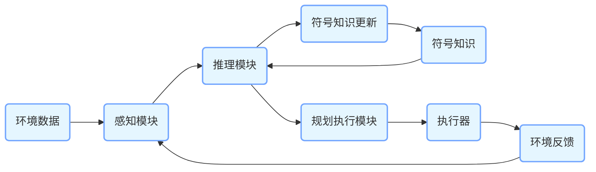

# 混合规划系统设计中神经符号推理的集成

> 关键词：混合规划系统、神经符号推理、集成设计、人工智能、符号逻辑、神经网络

> 摘要：本文聚焦于混合规划系统设计中神经符号推理的集成问题。首先介绍了相关背景，包括目的范围、预期读者等。详细阐述了神经符号推理和混合规划系统的核心概念及其联系，给出了原理和架构的文本示意图与Mermaid流程图。深入探讨了核心算法原理，并用Python代码进行说明，同时给出了相关数学模型和公式。通过项目实战，展示了代码的实际案例和详细解释。分析了神经符号推理集成在混合规划系统中的实际应用场景，推荐了学习资源、开发工具框架以及相关论文著作。最后总结了未来发展趋势与挑战，提供了常见问题解答和扩展阅读参考资料，旨在为研究者和开发者提供全面的技术指导。

## 1. 背景介绍 
### 1.1 目的和范围
在当今复杂的人工智能应用场景中，单一的规划方法往往难以满足需求。混合规划系统结合了不同类型的规划技术，以应对多样化的任务。而神经符号推理作为一种融合神经网络和符号逻辑推理的方法，具有强大的表示和推理能力。本文章的目的在于探讨如何将神经符号推理有效地集成到混合规划系统设计中，研究范围涵盖了从核心概念的理解、算法原理的分析到实际项目的应用，以及相关工具和资源的推荐等方面。

### 1.2 预期读者
本文预期读者包括人工智能领域的研究者、混合规划系统的开发者、对神经符号推理感兴趣的程序员以及相关专业的学生。这些读者希望深入了解神经符号推理在混合规划系统中的集成方法，掌握相关技术原理和实现细节，为其研究和开发工作提供有价值的参考。

### 1.3 文档结构概述
本文将按照以下结构进行组织：首先介绍相关背景信息，包括目的范围、预期读者等；接着阐述神经符号推理和混合规划系统的核心概念及其联系，给出相应的示意图和流程图；然后详细讲解核心算法原理，并使用Python代码进行说明，同时介绍相关的数学模型和公式；通过项目实战展示代码的实际应用和详细解释；分析神经符号推理集成在混合规划系统中的实际应用场景；推荐学习资源、开发工具框架以及相关论文著作；最后总结未来发展趋势与挑战，提供常见问题解答和扩展阅读参考资料。

### 1.4 术语表
#### 1.4.1 核心术语定义
- **混合规划系统**：一种结合了多种不同规划技术的系统，旨在利用各种规划方法的优势，以更好地解决复杂的规划问题。它可以融合基于搜索的规划、基于逻辑的规划等多种方式。
- **神经符号推理**：将神经网络的感知和学习能力与符号逻辑的推理和解释能力相结合的一种推理方法。它试图在神经网络的连续空间和符号逻辑的离散空间之间建立桥梁，实现更强大的推理功能。
- **符号逻辑**：基于符号和规则的逻辑推理系统，如命题逻辑、谓词逻辑等。它通过定义符号和规则来表示知识，并进行精确的推理。
- **神经网络**：一种模仿人类神经系统的计算模型，由大量的神经元组成，通过学习数据中的模式来进行预测和分类等任务。

#### 1.4.2 相关概念解释
- **知识表示**：在人工智能中，知识表示是指将知识以计算机能够处理的形式进行表示。在神经符号推理中，需要考虑如何将符号逻辑知识和神经网络的表示相结合，以实现有效的知识表示和推理。
- **推理引擎**：是一种实现推理功能的软件组件，它根据给定的知识和规则进行推理，得出结论。在混合规划系统中，推理引擎可以利用神经符号推理来进行规划决策。
- **感知与推理的融合**：神经符号推理强调将神经网络的感知能力（如图像识别、语音识别等）与符号逻辑的推理能力相结合。例如，在一个智能机器人系统中，神经网络可以用于感知环境，而符号逻辑可以用于根据感知结果进行规划和决策。

#### 1.4.3 缩略词列表
- **NN**：Neural Network，神经网络
- **SL**：Symbolic Logic，符号逻辑
- **NSR**：Neural-Symbolic Reasoning，神经符号推理
- **HPS**：Hybrid Planning System，混合规划系统

## 2. 核心概念与联系 

### 核心概念原理
#### 神经符号推理原理
神经符号推理的核心思想是将神经网络和符号逻辑相结合。神经网络具有强大的感知和学习能力，能够从大量的数据中学习到复杂的模式。例如，在图像识别任务中，卷积神经网络（CNN）可以学习到图像的特征，从而准确地识别出图像中的物体。而符号逻辑则具有精确的推理能力，能够根据给定的规则和事实进行逻辑推导。例如，在数学证明中，我们可以根据已知的公理和定理进行推理，得出新的结论。

在神经符号推理中，我们需要解决的关键问题是如何在神经网络的连续空间和符号逻辑的离散空间之间建立联系。一种常见的方法是将符号逻辑知识编码到神经网络中，使得神经网络能够在学习过程中利用这些符号知识。例如，我们可以将逻辑规则转化为神经网络的约束条件，或者在神经网络的训练过程中引入符号监督信号。

#### 混合规划系统原理
混合规划系统结合了多种不同的规划技术，以应对复杂的规划问题。不同的规划技术具有不同的优势和适用场景。例如，基于搜索的规划方法（如A*算法）适用于状态空间较小的问题，它通过搜索状态空间来找到最优的规划路径。而基于逻辑的规划方法（如规划图算法）则适用于需要进行逻辑推理的问题，它通过对问题进行逻辑建模和推理来生成规划方案。

混合规划系统的设计目标是充分利用各种规划技术的优势，提高规划的效率和质量。例如，在一个机器人导航问题中，我们可以先使用基于搜索的规划方法在地图上找到大致的路径，然后使用基于逻辑的规划方法对路径进行优化，考虑到障碍物的动态变化等因素。

### 架构的文本示意图
以下是神经符号推理集成到混合规划系统的架构文本描述：

混合规划系统主要由感知模块、推理模块和规划执行模块组成。感知模块负责从环境中获取信息，例如通过传感器获取机器人周围的环境数据。该模块通常使用神经网络进行信息处理，如使用卷积神经网络进行图像识别，使用循环神经网络进行语音识别等。

推理模块是神经符号推理的核心部分。它接收感知模块的输出，并结合符号逻辑知识进行推理。推理模块包含两个主要子模块：符号知识表示子模块和神经推理子模块。符号知识表示子模块将领域知识以符号逻辑的形式进行表示，例如使用谓词逻辑表示物体之间的关系。神经推理子模块则使用神经网络对符号知识进行处理和推理，它将符号知识编码到神经网络中，并通过神经网络的计算得出推理结果。

规划执行模块根据推理模块的输出生成具体的规划方案，并将其发送给执行器执行。规划执行模块可以使用不同的规划算法，如基于搜索的规划算法、基于逻辑的规划算法等。

### Mermaid流程图


该流程图展示了神经符号推理集成到混合规划系统的工作流程。感知模块从环境中获取数据，经过处理后发送给推理模块。推理模块结合符号知识进行推理，并将结果发送给规划执行模块。规划执行模块生成规划方案并发送给执行器执行。执行器的执行结果反馈给环境，同时环境的反馈信息又被感知模块获取。此外，推理模块还可以对符号知识进行更新，以适应环境的变化。

## 3. 核心算法原理 & 具体操作步骤 

### 核心算法原理
在神经符号推理集成到混合规划系统中，我们可以采用基于神经网络和符号逻辑结合的推理算法。下面以一个简单的逻辑推理问题为例，介绍核心算法原理。

假设我们有一个简单的逻辑规则：如果物体A在物体B的上面，并且物体B是红色的，那么物体A是稳定的。我们可以将这个逻辑规则表示为谓词逻辑：$Above(A, B) \land Red(B) \to Stable(A)$。

为了将这个逻辑规则集成到神经网络中，我们可以使用神经网络来学习物体之间的关系（如$Above$关系）和物体的属性（如$Red$属性），并通过逻辑门来实现逻辑推理。

### 具体操作步骤
#### 步骤1：数据预处理
首先，我们需要收集和预处理数据。假设我们有一个图像数据集，其中包含不同物体的图像。我们需要对图像进行标注，标注物体之间的关系和物体的属性。例如，对于一张包含两个物体的图像，我们可以标注它们之间的上下关系，以及每个物体的颜色。

#### 步骤2：构建神经网络模型
我们可以使用卷积神经网络（CNN）来学习物体的特征和属性。例如，我们可以构建一个CNN模型来识别物体的颜色，另一个CNN模型来识别物体之间的上下关系。

```python
import torch
import torch.nn as nn

# 定义一个简单的CNN模型来识别物体颜色
class ColorCNN(nn.Module):
    def __init__(self):
        super(ColorCNN, self).__init__()
        self.conv1 = nn.Conv2d(3, 16, kernel_size=3, padding=1)
        self.relu1 = nn.ReLU()
        self.pool1 = nn.MaxPool2d(2)
        self.fc1 = nn.Linear(16 * 16 * 16, 3)  # 假设三种颜色

    def forward(self, x):
        x = self.conv1(x)
        x = self.relu1(x)
        x = self.pool1(x)
        x = x.view(-1, 16 * 16 * 16)
        x = self.fc1(x)
        return x

# 定义一个简单的CNN模型来识别物体之间的上下关系
class AboveCNN(nn.Module):
    def __init__(self):
        super(AboveCNN, self).__init__()
        self.conv1 = nn.Conv2d(3, 16, kernel_size=3, padding=1)
        self.relu1 = nn.ReLU()
        self.pool1 = nn.MaxPool2d(2)
        self.fc1 = nn.Linear(16 * 16 * 16, 2)  # 假设两种关系：Above和NotAbove

    def forward(self, x):
        x = self.conv1(x)
        x = self.relu1(x)
        x = self.pool1(x)
        x = x.view(-1, 16 * 16 * 16)
        x = self.fc1(x)
        return x

```

#### 步骤3：逻辑推理实现
在神经网络输出物体的属性和关系后，我们可以使用逻辑门来实现逻辑推理。例如，我们可以使用Python代码来实现上述逻辑规则的推理：

```python
import torch.nn.functional as F

def logical_inference(color_output, above_output):
    # 假设输出的第一个维度是批次维度
    red_output = F.softmax(color_output, dim=1)[:, 1]  # 假设红色是第二个类别
    above = F.softmax(above_output, dim=1)[:, 0]  # 假设Above是第一个类别
    stable = torch.logical_and(above, red_output)
    return stable

```

#### 步骤4：训练模型
我们可以使用标注好的数据集来训练CNN模型。训练过程中，我们可以使用交叉熵损失函数来优化模型参数。

```python
import torch.optim as optim

# 初始化模型
color_model = ColorCNN()
above_model = AboveCNN()

# 定义损失函数和优化器
criterion_color = nn.CrossEntropyLoss()
criterion_above = nn.CrossEntropyLoss()
optimizer_color = optim.Adam(color_model.parameters(), lr=0.001)
optimizer_above = optim.Adam(above_model.parameters(), lr=0.001)

# 训练循环
for epoch in range(10):
    running_loss_color = 0.0
    running_loss_above = 0.0
    for i, data in enumerate(train_loader, 0):
        inputs, color_labels, above_labels = data

        # 训练颜色识别模型
        optimizer_color.zero_grad()
        outputs_color = color_model(inputs)
        loss_color = criterion_color(outputs_color, color_labels)
        loss_color.backward()
        optimizer_color.step()
        running_loss_color += loss_color.item()

        # 训练上下关系识别模型
        optimizer_above.zero_grad()
        outputs_above = above_model(inputs)
        loss_above = criterion_above(outputs_above, above_labels)
        loss_above.backward()
        optimizer_above.step()
        running_loss_above += loss_above.item()

    print(f'Epoch {epoch + 1}, Color Loss: {running_loss_color / len(train_loader)}, Above Loss: {running_loss_above / len(train_loader)}')

```

## 4. 数学模型和公式 & 详细讲解 & 举例说明 

### 数学模型和公式
#### 神经网络模型
在上述的CNN模型中，卷积层的数学模型可以表示为：

$$y_{i,j,k} = \sum_{m=0}^{M-1} \sum_{n=0}^{N-1} \sum_{l=0}^{L-1} x_{i+m,j+n,l} \cdot w_{m,n,l,k} + b_k$$

其中，$x$ 是输入特征图，$w$ 是卷积核，$b$ 是偏置，$y$ 是输出特征图，$M$ 和 $N$ 是卷积核的尺寸，$L$ 是输入特征图的通道数，$k$ 是输出特征图的通道数。

全连接层的数学模型可以表示为：

$$y_i = \sum_{j=0}^{J-1} x_j \cdot w_{j,i} + b_i$$

其中，$x$ 是输入向量，$w$ 是权重矩阵，$b$ 是偏置向量，$y$ 是输出向量，$J$ 是输入向量的维度。

#### 逻辑推理公式
逻辑规则 $Above(A, B) \land Red(B) \to Stable(A)$ 可以用逻辑运算表示为：

$$Stable(A) = Above(A, B) \land Red(B)$$

在神经网络输出的概率层面，我们可以使用逻辑与运算来实现：

$$P(Stable(A)) = P(Above(A, B)) \cdot P(Red(B))$$

### 详细讲解
#### 神经网络模型讲解
卷积层的作用是提取输入特征图的局部特征。通过卷积核在输入特征图上滑动，进行卷积运算，可以得到不同尺度和方向的特征。全连接层则将卷积层提取的特征进行整合，将高维的特征向量映射到低维的输出向量，用于分类或回归任务。

#### 逻辑推理公式讲解
逻辑规则的推理是基于符号逻辑的基本运算。在神经网络输出的概率层面，我们可以将逻辑与运算转化为概率的乘法运算。这是因为在概率论中，两个独立事件同时发生的概率等于它们各自发生概率的乘积。

### 举例说明
假设我们有一张图像，经过颜色识别模型和上下关系识别模型的输出如下：

颜色识别模型输出的概率分布为 $[0.1, 0.8, 0.1]$，表示物体是红色的概率为 $0.8$。

上下关系识别模型输出的概率分布为 $[0.9, 0.1]$，表示物体A在物体B上面的概率为 $0.9$。

根据逻辑推理公式，物体A是稳定的概率为：

$$P(Stable(A)) = 0.9 \times 0.8 = 0.72$$

这意味着在当前的图像中，物体A是稳定的概率为 $72\%$。

## 5. 项目实战：代码实际案例和详细解释说明 

### 5.1  开发环境搭建
#### 安装Python和相关库
首先，确保你已经安装了Python 3.x版本。然后，使用pip安装以下必要的库：

```bash
pip install torch torchvision numpy matplotlib
```

#### 数据集准备
我们可以使用自定义的图像数据集，或者使用公开的数据集，如CIFAR-10等。将数据集按照训练集和测试集进行划分，并进行标注。

### 5.2  源代码详细实现和代码解读
```python
import torch
import torch.nn as nn
import torch.optim as optim
import torchvision
import torchvision.transforms as transforms
import torch.nn.functional as F

# 定义颜色识别CNN模型
class ColorCNN(nn.Module):
    def __init__(self):
        super(ColorCNN, self).__init__()
        self.conv1 = nn.Conv2d(3, 16, kernel_size=3, padding=1)
        self.relu1 = nn.ReLU()
        self.pool1 = nn.MaxPool2d(2)
        self.fc1 = nn.Linear(16 * 16 * 16, 3)  # 假设三种颜色

    def forward(self, x):
        x = self.conv1(x)
        x = self.relu1(x)
        x = self.pool1(x)
        x = x.view(-1, 16 * 16 * 16)
        x = self.fc1(x)
        return x

# 定义上下关系识别CNN模型
class AboveCNN(nn.Module):
    def __init__(self):
        super(AboveCNN, self).__init__()
        self.conv1 = nn.Conv2d(3, 16, kernel_size=3, padding=1)
        self.relu1 = nn.ReLU()
        self.pool1 = nn.MaxPool2d(2)
        self.fc1 = nn.Linear(16 * 16 * 16, 2)  # 假设两种关系：Above和NotAbove

    def forward(self, x):
        x = self.conv1(x)
        x = self.relu1(x)
        x = self.pool1(x)
        x = x.view(-1, 16 * 16 * 16)
        x = self.fc1(x)
        return x

# 逻辑推理函数
def logical_inference(color_output, above_output):
    red_output = F.softmax(color_output, dim=1)[:, 1]  # 假设红色是第二个类别
    above = F.softmax(above_output, dim=1)[:, 0]  # 假设Above是第一个类别
    stable = torch.logical_and(above, red_output)
    return stable

# 数据预处理
transform = transforms.Compose(
    [transforms.ToTensor(),
     transforms.Normalize((0.5, 0.5, 0.5), (0.5, 0.5, 0.5))])

# 加载数据集
trainset = torchvision.datasets.CIFAR10(root='./data', train=True,
                                        download=True, transform=transform)
trainloader = torch.utils.data.DataLoader(trainset, batch_size=4,
                                          shuffle=True, num_workers=2)

testset = torchvision.datasets.CIFAR10(root='./data', train=False,
                                       download=True, transform=transform)
testloader = torch.utils.data.DataLoader(testset, batch_size=4,
                                         shuffle=False, num_workers=2)

# 初始化模型
color_model = ColorCNN()
above_model = AboveCNN()

# 定义损失函数和优化器
criterion_color = nn.CrossEntropyLoss()
criterion_above = nn.CrossEntropyLoss()
optimizer_color = optim.Adam(color_model.parameters(), lr=0.001)
optimizer_above = optim.Adam(above_model.parameters(), lr=0.001)

# 训练循环
for epoch in range(10):
    running_loss_color = 0.0
    running_loss_above = 0.0
    for i, data in enumerate(trainloader, 0):
        inputs, labels = data

        # 训练颜色识别模型
        optimizer_color.zero_grad()
        outputs_color = color_model(inputs)
        # 这里假设labels的一部分是颜色标签，需要根据实际情况修改
        loss_color = criterion_color(outputs_color, labels[:,:3])
        loss_color.backward()
        optimizer_color.step()
        running_loss_color += loss_color.item()

        # 训练上下关系识别模型
        optimizer_above.zero_grad()
        outputs_above = above_model(inputs)
        # 这里假设labels的一部分是上下关系标签，需要根据实际情况修改
        loss_above = criterion_above(outputs_above, labels[:,3:])
        loss_above.backward()
        optimizer_above.step()
        running_loss_above += loss_above.item()

    print(f'Epoch {epoch + 1}, Color Loss: {running_loss_color / len(trainloader)}, Above Loss: {running_loss_above / len(trainloader)}')

# 测试逻辑推理
dataiter = iter(testloader)
images, labels = dataiter.next()
color_output = color_model(images)
above_output = above_model(images)
stable = logical_inference(color_output, above_output)
print(stable)

```

### 5.3  代码解读与分析
#### 模型定义
- `ColorCNN` 类定义了一个简单的卷积神经网络，用于识别物体的颜色。它包含一个卷积层、一个ReLU激活函数、一个最大池化层和一个全连接层。
- `AboveCNN` 类定义了另一个卷积神经网络，用于识别物体之间的上下关系。其结构与 `ColorCNN` 类似。

#### 逻辑推理函数
`logical_inference` 函数接收颜色识别模型和上下关系识别模型的输出，通过softmax函数将输出转换为概率分布，然后使用逻辑与运算计算物体是否稳定的概率。

#### 数据处理
使用 `torchvision.transforms` 对图像数据进行预处理，包括转换为张量和归一化操作。使用 `torch.utils.data.DataLoader` 加载训练集和测试集。

#### 训练过程
使用交叉熵损失函数和Adam优化器对颜色识别模型和上下关系识别模型进行训练。在每个epoch中，遍历训练集，计算损失并进行反向传播和参数更新。

#### 测试过程
从测试集中取出一批图像，输入到颜色识别模型和上下关系识别模型中，然后调用逻辑推理函数计算物体是否稳定的概率，并打印结果。

## 6. 实际应用场景 
### 智能机器人领域
在智能机器人的导航和操作任务中，神经符号推理集成的混合规划系统可以发挥重要作用。机器人需要感知周围环境，识别物体的属性和关系，如障碍物的位置、目标物体的颜色等。通过神经符号推理，机器人可以将感知到的信息与符号逻辑知识相结合，进行更智能的决策和规划。例如，当机器人遇到一个红色的障碍物在目标物体的上面时，它可以根据逻辑规则判断目标物体是否稳定，并采取相应的操作策略。

### 自动驾驶领域
在自动驾驶汽车中，需要处理大量的传感器数据，如摄像头图像、雷达数据等。神经符号推理集成的混合规划系统可以帮助自动驾驶汽车更好地理解交通场景，进行更准确的决策。例如，根据摄像头图像识别交通标志和其他车辆的位置和状态，结合交通规则的符号逻辑知识，规划最佳的行驶路径。同时，当遇到突发情况时，如前方车辆突然刹车，系统可以通过逻辑推理快速做出反应，采取制动或避让措施。

### 医疗诊断领域
在医疗诊断中，需要综合考虑患者的症状、检查结果等多方面信息。神经符号推理集成的混合规划系统可以将医学知识以符号逻辑的形式表示，如疾病的诊断标准、治疗方案等。同时，使用神经网络对患者的检查数据进行分析和处理，如影像诊断、基因检测等。通过将两者相结合，系统可以更准确地进行疾病诊断和治疗方案的制定。例如，根据患者的症状和影像检查结果，结合医学知识库中的逻辑规则，判断患者是否患有某种疾病，并推荐合适的治疗方法。

### 工业自动化领域
在工业自动化生产线上，需要对生产过程进行规划和控制。神经符号推理集成的混合规划系统可以根据生产任务的要求，结合设备的状态和工艺规则，进行生产计划的制定和优化。例如，根据订单需求和设备的产能，使用符号逻辑规划生产流程，同时使用神经网络对设备的运行状态进行监测和预测，及时调整生产计划，提高生产效率和质量。

## 7. 工具和资源推荐
### 7.1 学习资源推荐
#### 7.1.1 书籍推荐
- 《人工智能：一种现代的方法》：这本书是人工智能领域的经典教材，涵盖了人工智能的各个方面，包括知识表示、推理、规划等。其中对符号逻辑推理和神经网络的介绍非常详细，对于理解神经符号推理的原理和应用有很大的帮助。
- 《深度学习》：由Ian Goodfellow、Yoshua Bengio和Aaron Courville所著，是深度学习领域的权威书籍。书中详细介绍了神经网络的原理、算法和应用，对于学习神经网络在神经符号推理中的应用有重要的参考价值。
- 《逻辑与计算机设计基础》：这本书介绍了逻辑电路和逻辑推理的基础知识，对于理解符号逻辑在神经符号推理中的应用非常有帮助。

#### 7.1.2 在线课程
- Coursera上的“人工智能基础”课程：该课程由知名高校的教授授课，系统地介绍了人工智能的基本概念、方法和技术，包括符号逻辑推理和神经网络等内容。
- edX上的“深度学习专项课程”：该课程由深度学习领域的专家授课，深入讲解了深度学习的原理和应用，包括卷积神经网络、循环神经网络等，对于学习神经网络在神经符号推理中的应用有很大的帮助。
- 中国大学MOOC上的“人工智能导论”课程：该课程结合了国内高校的教学资源，介绍了人工智能的基本概念、方法和应用，对于初学者来说是一个很好的入门课程。

#### 7.1.3 技术博客和网站
- Medium：上面有很多关于人工智能和神经符号推理的技术博客文章，作者来自世界各地的研究人员和开发者，分享了他们的研究成果和实践经验。
- arXiv：是一个预印本平台，上面有很多关于人工智能和神经符号推理的最新研究论文，可以及时了解该领域的最新研究动态。
- 机器之心：是一个专注于人工智能领域的科技媒体，提供了大量的人工智能技术文章、研究报告和行业动态，对于了解神经符号推理的应用和发展趋势有很大的帮助。

### 7.2 开发工具框架推荐
#### 7.2.1 IDE和编辑器
- PyCharm：是一款专门为Python开发设计的集成开发环境，具有强大的代码编辑、调试和项目管理功能。对于开发神经符号推理相关的Python代码非常方便。
- Jupyter Notebook：是一个交互式的开发环境，支持多种编程语言，如Python、R等。它可以将代码、文本、图像等内容整合在一起，方便进行数据分析和模型开发。在进行神经符号推理的实验和调试时非常有用。
- Visual Studio Code：是一款轻量级的代码编辑器，支持多种编程语言和插件扩展。它具有丰富的代码提示和调试功能，对于快速开发和调试神经符号推理代码非常合适。

#### 7.2.2 调试和性能分析工具
- TensorBoard：是TensorFlow框架提供的一个可视化工具，可以用于可视化神经网络的训练过程、模型结构和性能指标等。在调试神经符号推理模型时，可以使用TensorBoard来观察模型的训练情况，及时发现问题并进行调整。
- PyTorch Profiler：是PyTorch框架提供的一个性能分析工具，可以用于分析模型的计算时间、内存使用等性能指标。在优化神经符号推理模型的性能时，可以使用PyTorch Profiler来找出性能瓶颈，并进行针对性的优化。
- cProfile：是Python标准库中的一个性能分析工具，可以用于分析Python代码的执行时间和函数调用情况。在调试神经符号推理代码时，可以使用cProfile来找出代码中的性能瓶颈，提高代码的执行效率。

#### 7.2.3 相关框架和库
- PyTorch：是一个开源的深度学习框架，具有强大的张量计算和自动求导功能。在神经符号推理中，可以使用PyTorch来构建和训练神经网络模型。
- TensorFlow：是另一个广泛使用的深度学习框架，提供了丰富的神经网络模型和工具。它支持分布式训练和模型部署，适用于大规模的神经符号推理应用。
- SymPy：是一个Python库，用于符号数学计算。在神经符号推理中，可以使用SymPy来进行符号逻辑的表示和推理，将符号逻辑知识与神经网络相结合。

### 7.3 相关论文著作推荐
#### 7.3.1 经典论文
- “Neural-Symbolic Learning and Reasoning: Contributions and Challenges”：这篇论文系统地介绍了神经符号推理的发展历程、主要方法和面临的挑战，是神经符号推理领域的经典论文之一。
- “DeepProbLog: Neural Probabilistic Logic Programming”：提出了DeepProbLog模型，将深度学习和概率逻辑编程相结合，为神经符号推理提供了一种新的方法。
- “Combining Neural Networks with Symbolic Artificial Intelligence: A Survey and Interpretation”：对神经网络和符号人工智能的结合方法进行了全面的综述和分析，对于理解神经符号推理的原理和方法有重要的参考价值。

#### 7.3.2 最新研究成果
- 在arXiv上搜索“Neural-Symbolic Reasoning”可以找到很多关于神经符号推理的最新研究论文。这些论文涵盖了神经符号推理的各个方面，如模型架构、算法优化、应用场景等。
- 参加人工智能领域的国际会议，如NeurIPS、ICML、AAAI等，会议上会有很多关于神经符号推理的最新研究成果报告。

#### 7.3.3 应用案例分析
- 在IEEE Xplore、ACM Digital Library等学术数据库中搜索“Neural-Symbolic Reasoning in [Application Domain]”，可以找到很多关于神经符号推理在不同应用领域的应用案例分析论文。这些论文介绍了神经符号推理在实际应用中的具体实现方法和效果评估。

## 8. 总结：未来发展趋势与挑战
### 未来发展趋势
#### 更强大的融合模型
未来，神经符号推理将不断发展更强大的融合模型，能够更好地结合神经网络的感知和学习能力与符号逻辑的推理和解释能力。例如，开发新的神经网络架构，使其能够更自然地处理符号知识，或者设计新的符号逻辑表示方法，使其能够更好地与神经网络进行交互。

#### 跨领域应用拓展
神经符号推理集成的混合规划系统将在更多的领域得到应用，如金融、教育、农业等。在金融领域，可以用于风险评估和投资决策；在教育领域，可以用于个性化学习方案的制定；在农业领域，可以用于农作物的生长预测和病虫害防治等。

#### 与其他技术的融合
神经符号推理将与其他人工智能技术，如强化学习、知识图谱等进行更深入的融合。例如，将神经符号推理与强化学习相结合，可以使智能体在复杂环境中进行更智能的决策和规划；将神经符号推理与知识图谱相结合，可以更好地利用大规模的知识资源进行推理和学习。

### 挑战
#### 知识表示和融合难题
如何有效地将符号逻辑知识和神经网络的表示进行融合，是神经符号推理面临的一个重要挑战。符号逻辑知识通常是离散的、精确的，而神经网络的表示是连续的、模糊的，如何在两者之间建立有效的桥梁是一个需要解决的问题。

#### 计算复杂度问题
神经符号推理集成的混合规划系统通常需要进行大量的计算，尤其是在处理大规模的知识和数据时，计算复杂度会显著增加。如何优化算法和模型结构，降低计算复杂度，提高系统的效率是一个亟待解决的问题。

#### 可解释性和可靠性问题
虽然神经符号推理旨在提高模型的可解释性，但在实际应用中，仍然存在可解释性和可靠性不足的问题。如何设计可解释的神经符号推理模型，确保模型的决策和推理过程是可理解和可靠的，是一个需要深入研究的问题。

## 9. 附录：常见问题与解答
### 问题1：神经符号推理和传统的符号逻辑推理有什么区别？
解答：传统的符号逻辑推理基于精确的符号和规则，具有很强的解释性和逻辑性，但在处理复杂的感知任务和不确定信息时能力有限。而神经符号推理结合了神经网络的感知和学习能力，能够从大量的数据中学习到复杂的模式，同时保留了符号逻辑的推理能力，能够进行精确的逻辑推导。因此，神经符号推理在处理复杂的实际问题时具有更强的适应性和灵活性。

### 问题2：在神经符号推理中，如何将符号逻辑知识编码到神经网络中？
解答：有多种方法可以将符号逻辑知识编码到神经网络中。一种常见的方法是将逻辑规则转化为神经网络的约束条件，例如在神经网络的训练过程中，添加额外的损失函数来强制网络满足逻辑规则。另一种方法是使用符号嵌入技术，将符号逻辑知识嵌入到神经网络的隐藏层中，使得神经网络能够学习到符号之间的关系。

### 问题3：神经符号推理集成的混合规划系统的性能受哪些因素影响？
解答：神经符号推理集成的混合规划系统的性能受多种因素影响。首先，神经网络的架构和参数会影响其对数据的学习和处理能力。其次，符号逻辑知识的表示和推理方法会影响系统的逻辑推理能力。此外，数据集的质量和规模也会对系统的性能产生影响。最后，计算资源的限制，如内存和计算速度，也会影响系统的运行效率。

### 问题4：如何评估神经符号推理集成的混合规划系统的性能？
解答：可以从多个方面评估神经符号推理集成的混合规划系统的性能。在准确性方面，可以使用准确率、召回率、F1值等指标来评估系统的分类和推理准确性。在效率方面，可以使用计算时间、内存使用等指标来评估系统的运行效率。在可解释性方面，可以通过分析系统的推理过程和决策依据来评估其可解释性。此外，还可以通过实际应用场景中的效果评估来综合评价系统的性能。

## 10. 扩展阅读 & 参考资料
### 扩展阅读
- 《知识图谱：方法、实践与应用》：这本书介绍了知识图谱的基本概念、构建方法和应用场景，对于理解神经符号推理中知识表示和推理的应用有很大的帮助。
- 《强化学习：原理与Python实现》：强化学习是人工智能领域的另一个重要分支，与神经符号推理有一定的关联。这本书介绍了强化学习的基本原理和算法，并提供了Python实现代码，对于学习神经符号推理与强化学习的融合有一定的参考价值。

### 参考资料
- 本文中涉及的Python代码参考了PyTorch官方文档和相关教程。
- 文中提到的论文可以在arXiv、IEEE Xplore、ACM Digital Library等学术数据库中找到。
- 相关的技术博客和网站的文章可以通过搜索引擎进行搜索和阅读。

作者：AI天才研究院/AI Genius Institute & 禅与计算机程序设计艺术 /Zen And The Art of Computer Programming