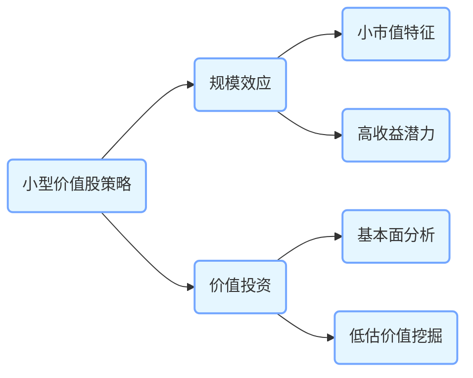

# 爱德华·拉姆的小型价值股策略：规模效应与价值投资

> 关键词：爱德华·拉姆、小型价值股策略、规模效应、价值投资、股票投资

> 摘要：本文围绕爱德华·拉姆的小型价值股策略展开，深入探讨规模效应与价值投资在该策略中的体现。首先介绍相关背景知识，包括目的范围、预期读者等内容；接着阐述核心概念及联系，通过文本示意图和 Mermaid 流程图进行清晰展示；详细讲解核心算法原理，结合 Python 源代码说明具体操作步骤；运用数学模型和公式进行理论分析，并举例说明；通过项目实战展示代码实现与解读；探讨实际应用场景；推荐相关工具和资源；最后总结未来发展趋势与挑战，解答常见问题并提供扩展阅读与参考资料，旨在帮助投资者更好地理解和运用小型价值股策略。

## 1. 背景介绍 
### 1.1 目的和范围
本文旨在全面深入地剖析爱德华·拉姆的小型价值股策略，详细探究规模效应与价值投资在其中所起到的关键作用。通过对该策略的核心概念、算法原理、数学模型等方面的阐述，为投资者提供系统且深入的理论支持，使其能够更好地理解这一策略的内在逻辑和应用方法。同时，结合实际案例和代码实现，帮助投资者将理论知识转化为实际操作能力，提升投资决策的科学性和准确性。本文的范围涵盖了从理论基础到实际应用的各个环节，不仅包括对策略本身的详细解读，还涉及到相关工具和资源的推荐，以及对未来发展趋势和挑战的分析。

### 1.2 预期读者
本文主要面向对股票投资领域有浓厚兴趣的投资者，无论是专业的投资人士，还是初涉投资市场的新手，都能从本文中获取有价值的信息。对于专业投资者而言，本文深入的理论分析和实际案例可能会为他们的投资策略提供新的思路和视角；而对于新手投资者，本文通俗易懂的讲解和详细的操作步骤可以帮助他们快速了解小型价值股策略，为其投资实践打下坚实的基础。此外，金融领域的研究人员、学者也可以将本文作为参考资料，用于相关课题的研究和探讨。

### 1.3 文档结构概述
本文将按照以下结构进行组织：首先在背景介绍部分，明确文章的目的、范围、预期读者以及文档的整体结构，并对相关术语进行详细解释。接着，在核心概念与联系章节，阐述小型价值股策略、规模效应和价值投资的核心概念，并通过文本示意图和 Mermaid 流程图展示它们之间的联系。然后，详细讲解核心算法原理，给出具体的操作步骤，并使用 Python 源代码进行说明。在数学模型和公式章节，运用数学方法对策略进行分析，并通过具体例子加深理解。项目实战部分将展示如何搭建开发环境，实现源代码并进行详细解读。之后，探讨该策略的实际应用场景，推荐相关的工具和资源。最后，总结未来发展趋势与挑战，解答常见问题并提供扩展阅读与参考资料。

### 1.4 术语表
#### 1.4.1 核心术语定义
- **小型价值股**：指市值相对较小且具有价值投资特征的股票。通常这类股票被市场低估，具有较低的市盈率、市净率等估值指标。
- **规模效应**：在股票投资中，规模效应是指市值较小的股票往往比市值较大的股票具有更高的收益率。这一现象可能是由于小市值股票的流动性较差、信息不对称程度较高等因素导致的。
- **价值投资**：一种投资策略，强调通过分析股票的内在价值，寻找被市场低估的股票进行投资。价值投资者通常关注公司的基本面，如财务状况、盈利能力、股息政策等。
- **市盈率（P/E）**：股票价格与每股收益的比率，反映了投资者为获取公司每一元盈利所愿意支付的价格。
- **市净率（P/B）**：股票价格与每股净资产的比率，用于衡量股票价格相对于每股净资产的高低。

#### 1.4.2 相关概念解释
- **股票市值**：指一家上市公司的发行股份按市场价格计算出来的股票总价值，其计算方法为每股股票的市场价格乘以发行总股数。
- **内在价值**：股票的内在价值是指股票未来现金流量的现值，它是基于公司的基本面和未来发展前景进行评估的。
- **市场有效性**：指市场能够迅速、准确地反映所有可用信息的程度。在有效市场中，股票价格能够及时反映公司的基本面信息，投资者很难通过分析公开信息获得超额收益。

#### 1.4.3 缩略词列表
- **P/E**：市盈率（Price-to-Earnings Ratio）
- **P/B**：市净率（Price-to-Book Ratio）

## 2. 核心概念与联系 

### 核心概念原理
#### 小型价值股
小型价值股结合了小市值和价值被低估两个特点。从市值角度来看，小型企业通常在市场中的知名度较低，业务规模相对较小，但其具有较大的成长潜力。当市场对这类企业的发展前景存在低估时，就会出现价值被低估的情况。例如，一些新兴行业的小型企业，由于其技术或商业模式尚未被市场充分认可，股价可能被压低，但实际上其具有独特的竞争优势和良好的发展前景。

#### 规模效应
规模效应的原理在于小市值股票的流动性相对较差，市场关注度较低，导致信息传播不充分。这使得小市值股票的价格可能无法及时反映其真实价值，从而为投资者提供了获取超额收益的机会。此外，小市值企业在成长过程中，由于基数较小，其业绩增长可能会带来更大的股价波动，从而有可能获得更高的收益率。

#### 价值投资
价值投资的核心原理是认为股票价格会围绕其内在价值波动。投资者通过对公司的财务报表、行业地位、竞争优势等基本面因素进行分析，评估股票的内在价值。当股票价格低于其内在价值时，投资者认为该股票被低估，从而买入；当股票价格高于其内在价值时，投资者则会考虑卖出。

### 架构的文本示意图
```plaintext
           小型价值股策略
          /                 \
  规模效应                 价值投资
  |       |                 |       |
小市值特征 高收益潜力       基本面分析 低估价值挖掘
```

### Mermaid 流程图


## 3. 核心算法原理 & 具体操作步骤 

### 核心算法原理
爱德华·拉姆的小型价值股策略核心在于筛选出具有规模效应和价值投资特征的小型价值股。具体算法思路是：首先根据股票的市值筛选出小型股票，然后通过计算市盈率、市净率等估值指标，筛选出被低估的股票。最后，对筛选出的股票进行综合评估，选择具有较高投资价值的股票进行投资。

### 具体操作步骤
#### 步骤 1：数据收集
收集股票的相关数据，包括市值、市盈率、市净率、每股收益等。这些数据可以从金融数据提供商（如 Bloomberg、Wind 等）或证券交易所的官方网站获取。

#### 步骤 2：筛选小型股票
根据市值对股票进行排序，选择市值较小的一部分股票作为候选股票。例如，可以选择市值排名后 20% 的股票。

#### 步骤 3：筛选价值被低估的股票
计算候选股票的市盈率和市净率，选择市盈率和市净率较低的股票。例如，可以选择市盈率低于行业平均水平且市净率低于 1 的股票。

#### 步骤 4：综合评估
对筛选出的股票进行综合评估，考虑公司的财务状况、盈利能力、行业前景等因素。可以使用多因素模型对股票进行打分，选择得分较高的股票进行投资。

### Python 源代码实现
```python
import pandas as pd

# 步骤 1：数据收集
# 假设数据存储在 CSV 文件中
data = pd.read_csv('stock_data.csv')

# 步骤 2：筛选小型股票
# 按照市值升序排序
sorted_data = data.sort_values(by='market_cap')
# 选择市值排名后 20% 的股票
small_stocks = sorted_data.tail(int(len(sorted_data) * 0.2))

# 步骤 3：筛选价值被低估的股票
# 计算行业平均市盈率
industry_avg_pe = small_stocks['pe_ratio'].mean()
# 选择市盈率低于行业平均水平且市净率低于 1 的股票
undervalued_stocks = small_stocks[(small_stocks['pe_ratio'] < industry_avg_pe) & (small_stocks['pb_ratio'] < 1)]

# 步骤 4：综合评估
# 假设使用简单的打分模型，根据市盈率和市净率进行打分
undervalued_stocks['score'] = 1 / undervalued_stocks['pe_ratio'] + 1 / undervalued_stocks['pb_ratio']
# 选择得分较高的前 10 只股票
selected_stocks = undervalued_stocks.nlargest(10, 'score')

print(selected_stocks)
```

## 4. 数学模型和公式 & 详细讲解 & 举例说明 

### 数学模型和公式
#### 市盈率（P/E）
市盈率的计算公式为：
$$P/E = \frac{股价}{每股收益}$$
市盈率反映了投资者为获取公司每一元盈利所愿意支付的价格。一般来说，市盈率越低，说明股票越被低估。

#### 市净率（P/B）
市净率的计算公式为：
$$P/B = \frac{股价}{每股净资产}$$
市净率用于衡量股票价格相对于每股净资产的高低。市净率小于 1 通常表示股票价格低于其净资产价值，可能被低估。

#### 多因素模型
在综合评估股票时，可以使用多因素模型对股票进行打分。假设使用市盈率和市净率两个因素进行打分，得分公式为：
$$Score = \frac{1}{P/E} + \frac{1}{P/B}$$
得分越高，说明股票的投资价值越高。

### 详细讲解
市盈率和市净率是价值投资中常用的估值指标。市盈率通过比较股价和每股收益，反映了市场对公司盈利的预期。如果一家公司的市盈率较低，可能意味着市场对其未来盈利增长的预期较低，或者该公司的股价被低估。市净率则从资产的角度评估股票的价值，市净率较低的股票可能具有较高的安全边际。

多因素模型通过综合考虑多个因素，对股票的投资价值进行更全面的评估。在上述公式中，使用市盈率和市净率的倒数作为得分因素，是因为市盈率和市净率越低，其倒数越大，说明股票的投资价值越高。

### 举例说明
假设股票 A 的股价为 10 元，每股收益为 1 元，每股净资产为 5 元；股票 B 的股价为 20 元，每股收益为 2 元，每股净资产为 10 元。

计算股票 A 的市盈率和市净率：
$$P/E_A = \frac{10}{1} = 10$$
$$P/B_A = \frac{10}{5} = 2$$

计算股票 B 的市盈率和市净率：
$$P/E_B = \frac{20}{2} = 10$$
$$P/B_B = \frac{20}{10} = 2$$

假设行业平均市盈率为 15，由于股票 A 和股票 B 的市盈率都低于行业平均水平，且市净率都为 2，需要进一步使用多因素模型进行评估。

计算股票 A 的得分：
$$Score_A = \frac{1}{10} + \frac{1}{2} = 0.1 + 0.5 = 0.6$$

计算股票 B 的得分：
$$Score_B = \frac{1}{10} + \frac{1}{2} = 0.1 + 0.5 = 0.6$$

由于股票 A 和股票 B 的得分相同，说明它们在当前评估体系下具有相同的投资价值。

## 5. 项目实战：代码实际案例和详细解释说明 

### 5.1 开发环境搭建
#### 安装 Python
首先需要安装 Python 环境，建议使用 Python 3.7 及以上版本。可以从 Python 官方网站（https://www.python.org/downloads/）下载并安装。

#### 安装必要的库
使用以下命令安装所需的库：
```sh
pip install pandas
```
pandas 是一个用于数据处理和分析的强大库，在本项目中用于读取和处理股票数据。

### 5.2 源代码详细实现和代码解读
```python
import pandas as pd

# 步骤 1：数据收集
# 假设数据存储在 CSV 文件中
data = pd.read_csv('stock_data.csv')

# 代码解读：使用 pandas 的 read_csv 函数读取存储在 CSV 文件中的股票数据。
# 'stock_data.csv' 是数据文件的名称，需要根据实际情况进行修改。

# 步骤 2：筛选小型股票
# 按照市值升序排序
sorted_data = data.sort_values(by='market_cap')
# 选择市值排名后 20% 的股票
small_stocks = sorted_data.tail(int(len(sorted_data) * 0.2))

# 代码解读：首先使用 sort_values 函数按照市值（'market_cap'）对数据进行升序排序。
# 然后使用 tail 函数选择排序后数据的后 20% 作为小型股票。

# 步骤 3：筛选价值被低估的股票
# 计算行业平均市盈率
industry_avg_pe = small_stocks['pe_ratio'].mean()
# 选择市盈率低于行业平均水平且市净率低于 1 的股票
undervalued_stocks = small_stocks[(small_stocks['pe_ratio'] < industry_avg_pe) & (small_stocks['pb_ratio'] < 1)]

# 代码解读：使用 mean 函数计算小型股票的平均市盈率，作为行业平均市盈率。
# 然后使用布尔索引筛选出市盈率低于行业平均水平且市净率低于 1 的股票。

# 步骤 4：综合评估
# 假设使用简单的打分模型，根据市盈率和市净率进行打分
undervalued_stocks['score'] = 1 / undervalued_stocks['pe_ratio'] + 1 / undervalued_stocks['pb_ratio']
# 选择得分较高的前 10 只股票
selected_stocks = undervalued_stocks.nlargest(10, 'score')

# 代码解读：根据市盈率和市净率的倒数之和计算每只股票的得分。
# 使用 nlargest 函数选择得分较高的前 10 只股票作为最终的投资候选股票。

print(selected_stocks)
```

### 5.3 代码解读与分析
通过上述代码，我们实现了爱德华·拉姆的小型价值股策略的核心算法。首先，从 CSV 文件中读取股票数据，然后按照市值筛选出小型股票，接着根据市盈率和市净率筛选出价值被低估的股票，最后使用简单的打分模型对筛选出的股票进行综合评估，选择得分较高的股票作为投资候选股票。

在实际应用中，需要注意数据的准确性和完整性。同时，可以根据实际情况调整筛选条件和打分模型，以提高策略的有效性。例如，可以考虑更多的财务指标，如股息率、净资产收益率等，来更全面地评估股票的投资价值。

## 6. 实际应用场景 
### 个人投资者
对于个人投资者而言，爱德华·拉姆的小型价值股策略提供了一种相对稳健的投资方法。个人投资者可以根据自己的风险承受能力和投资目标，选择适合自己的小型价值股进行投资。由于小型价值股通常具有较高的成长潜力，长期投资可能会获得较高的收益。同时，通过分散投资多只小型价值股，可以降低投资风险。

### 机构投资者
机构投资者如基金公司、保险公司等，可以将小型价值股策略纳入其投资组合中。通过大规模的资金投入和专业的研究团队，机构投资者可以更深入地分析小型价值股的投资价值，提高投资组合的收益水平。此外，小型价值股与大盘股的相关性较低，将其纳入投资组合可以起到分散风险的作用。

### 量化投资
在量化投资领域，爱德华·拉姆的小型价值股策略可以通过计算机程序进行自动化执行。量化投资者可以使用历史数据对策略进行回测和优化，不断调整筛选条件和参数，以提高策略的盈利能力。同时，量化投资可以实现快速的交易执行，提高投资效率。

## 7. 工具和资源推荐
### 7.1 学习资源推荐
#### 7.1.1 书籍推荐
- 《聪明的投资者》（The Intelligent Investor）：作者本杰明·格雷厄姆（Benjamin Graham）是价值投资的鼻祖，本书是价值投资领域的经典著作，详细阐述了价值投资的理念和方法。
- 《漫步华尔街》（A Random Walk Down Wall Street）：作者伯顿·马尔基尔（Burton G. Malkiel）在书中介绍了各种投资策略和市场理论，对小型价值股策略也有一定的涉及。
- 《怎样选择成长股》（Common Stocks and Uncommon Profits）：作者菲利普·费雪（Philip A. Fisher）强调了寻找具有成长潜力的股票的重要性，对于理解小型价值股的成长特性有很大帮助。

#### 7.1.2 在线课程
- Coursera 上的“投资学原理”（Principles of Investment）课程：由知名高校的教授授课，系统介绍了投资学的基本原理和方法，包括股票投资策略。
- Udemy 上的“量化投资实战”（Quantitative Investment Practical）课程：专注于量化投资领域，讲解了如何使用 Python 进行量化交易策略的开发和实现。

#### 7.1.3 技术博客和网站
- Seeking Alpha（https://seekingalpha.com/）：提供丰富的股票分析和投资观点，有很多关于小型价值股的研究报告和文章。
- Alpha Architect（https://alphaarchitect.com/）：专注于量化投资和因子投资，发布了许多关于小型价值股策略的研究成果和实证分析。

### 7.2 开发工具框架推荐
#### 7.2.1 IDE和编辑器
- PyCharm：一款专业的 Python 集成开发环境，提供丰富的代码编辑、调试和项目管理功能，适合开发复杂的量化投资策略。
- Jupyter Notebook：一种交互式的开发环境，支持 Python 代码的实时运行和可视化展示，方便进行数据分析和策略验证。

#### 7.2.2 调试和性能分析工具
- PDB：Python 自带的调试工具，可以帮助开发者定位代码中的错误和问题。
- cProfile：Python 的性能分析工具，可以分析代码的运行时间和函数调用情况，帮助优化代码性能。

#### 7.2.3 相关框架和库
- Pandas：用于数据处理和分析的强大库，在量化投资中广泛应用于数据读取、清洗和计算。
- NumPy：提供高效的数值计算功能，是许多科学计算和数据分析库的基础。
- Scikit-learn：用于机器学习和数据挖掘的库，可以用于构建多因素模型和进行股票预测。

### 7.3 相关论文著作推荐
#### 7.3.1 经典论文
- Fama, Eugene F., and Kenneth R. French. "The Cross-Section of Expected Stock Returns." The Journal of Finance 47.2 (1992): 427-465. 该论文提出了著名的 Fama-French 三因子模型，其中包括规模因子和价值因子，对小型价值股策略的理论基础有重要贡献。
- Lakonishok, Josef, Andrei Shleifer, and Robert W. Vishny. "Contrarian Investment, Extrapolation, and Risk." The Journal of Finance 49.5 (1994): 1541-1578. 本文研究了价值投资策略的有效性，通过实证分析证明了价值股的长期表现优于成长股。

#### 7.3.2 最新研究成果
- Asness, Clifford S., Andrea Frazzini, and Lasse Heje Pedersen. "Quality Minus Junk." The Journal of Financial Economics 123.1 (2017): 1-27. 该研究提出了质量因子，并探讨了质量因子与价值因子和规模因子的关系，为小型价值股策略的优化提供了新的思路。
- Novy-Marx, Robert. "The Other Side of Value: The Gross Profitability Premium." The Journal of Financial Economics 108.1 (2013): 1-28. 本文发现了毛利率因子在股票定价中的重要作用，丰富了小型价值股策略的评估指标。

#### 7.3.3 应用案例分析
- Arnott, Robert D., and Denis Chaves. "The Surprising Alpha from Malkiel's Monkey and Upside-Down Strategies." Financial Analysts Journal 70.1 (2014): 17-44. 该案例分析了不同投资策略的表现，包括小型价值股策略，通过实际数据展示了小型价值股策略的优势和风险。

## 8. 总结：未来发展趋势与挑战
### 未来发展趋势
#### 智能化和自动化
随着人工智能和机器学习技术的不断发展，小型价值股策略将越来越多地与智能化和自动化相结合。通过使用深度学习算法，可以更准确地预测小型价值股的未来表现，提高投资决策的效率和准确性。同时，自动化交易系统可以实现策略的实时执行，减少人为因素的干扰。

#### 多因子融合
未来的小型价值股策略将不再局限于规模效应和价值投资两个因素，而是会融合更多的因子，如质量因子、动量因子等。通过多因子融合，可以更全面地评估股票的投资价值，提高策略的盈利能力和稳定性。

#### 全球化投资
随着全球金融市场的一体化，投资者将有更多的机会投资于不同国家和地区的小型价值股。全球化投资可以进一步分散投资风险，提高投资组合的收益水平。同时，不同国家和地区的小型价值股市场可能存在差异，投资者可以通过深入研究和分析，挖掘出具有独特投资价值的小型价值股。

### 挑战
#### 数据质量和可靠性
小型价值股策略的有效性依赖于准确和可靠的数据。然而，小型企业的信息披露可能不够充分，数据质量可能存在问题。此外，金融数据的获取和处理也面临着一定的挑战，如数据的及时性、完整性等。因此，如何确保数据的质量和可靠性是实施小型价值股策略的关键挑战之一。

#### 市场环境变化
股票市场是复杂多变的，市场环境的变化可能会影响小型价值股策略的表现。例如，宏观经济形势的变化、政策法规的调整、行业竞争格局的改变等，都可能导致小型价值股的投资价值发生变化。投资者需要及时关注市场环境的变化，调整投资策略，以适应市场的变化。

#### 竞争加剧
随着小型价值股策略的 popularity 不断提高，越来越多的投资者和机构开始关注和应用这一策略。竞争的加剧可能会导致小型价值股的价格被高估，从而降低策略的收益水平。投资者需要不断创新和优化策略，提高自身的竞争力，以在激烈的市场竞争中获得超额收益。

## 9. 附录：常见问题与解答
### 问题 1：小型价值股策略适合短期投资还是长期投资？
小型价值股策略更适合长期投资。小型价值股通常具有较高的成长潜力，但成长过程可能需要较长的时间。短期内，小型价值股的价格可能会受到市场波动的影响，出现较大的波动。而长期来看，随着公司的成长和价值的回归，小型价值股有望获得较高的收益。

### 问题 2：如何判断一只股票是否为小型价值股？
可以从市值和估值指标两个方面来判断。一般来说，市值相对较小的股票可以被认为是小型股票。估值指标方面，可以关注市盈率、市净率等指标，市盈率和市净率较低的股票可能被低估，具有价值投资的特征。此外，还可以结合公司的基本面情况，如财务状况、盈利能力、行业前景等，进行综合判断。

### 问题 3：小型价值股策略的风险如何控制？
可以通过分散投资、定期调整投资组合等方式来控制风险。分散投资可以降低单只股票的风险，避免因个别股票的波动对投资组合造成较大影响。定期调整投资组合可以根据市场情况和股票的表现，及时调整投资组合中的股票，确保投资组合的合理性和稳定性。

### 问题 4：量化投资在小型价值股策略中的应用有哪些优势？
量化投资在小型价值股策略中的应用具有以下优势：一是可以提高投资决策的效率和准确性，通过计算机程序对大量数据进行分析和处理，快速筛选出符合条件的小型价值股；二是可以避免人为因素的干扰，减少情绪对投资决策的影响；三是可以实现策略的实时执行，及时把握投资机会。

## 10. 扩展阅读 & 参考资料
### 扩展阅读
- 《投资最重要的事》（The Most Important Thing Illuminated）：作者霍华德·马克斯（Howard Marks）分享了他在投资领域的经验和见解，对理解投资的本质和风险有很大帮助。
- 《金融炼金术》（The Alchemy of Finance）：作者乔治·索罗斯（George Soros）阐述了他的反身性理论，对股票市场的运行机制有独特的见解。

### 参考资料
- Bloomberg 金融数据库：提供全球金融市场的实时数据和分析报告。
- Wind 金融终端：国内专业的金融数据服务平台，提供丰富的股票数据和研究报告。

作者：AI天才研究院/AI Genius Institute & 禅与计算机程序设计艺术 /Zen And The Art of Computer Programming