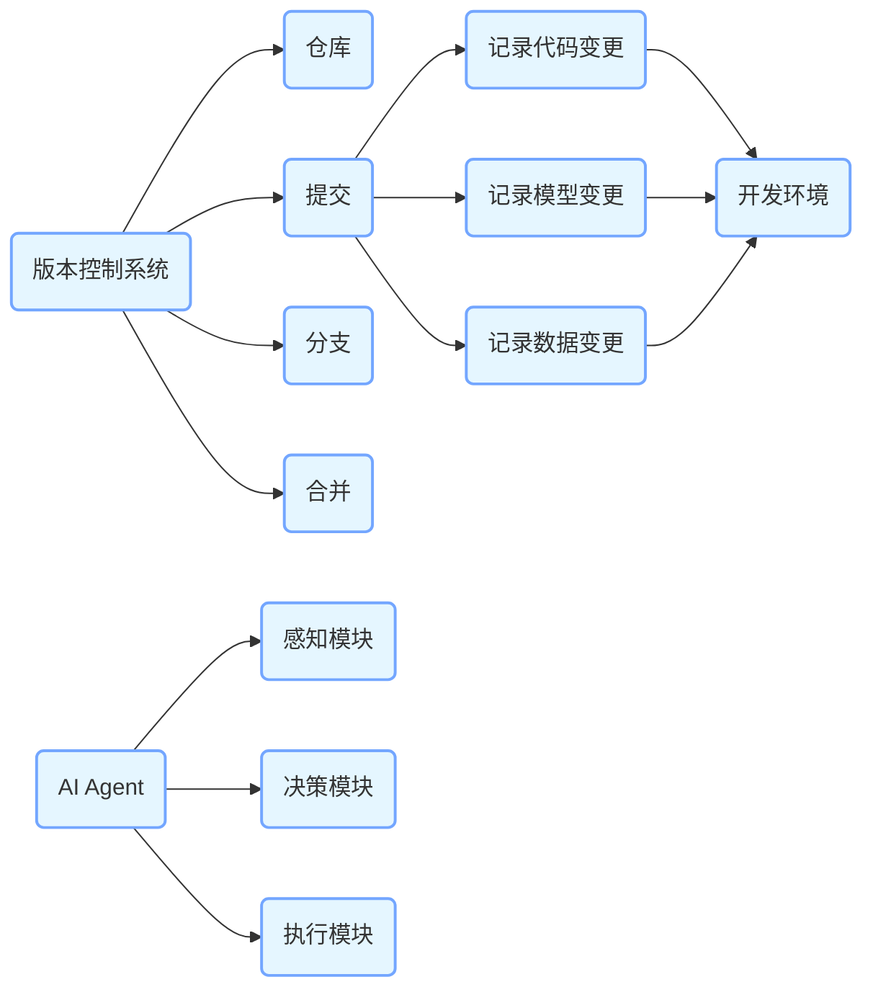

# 版本控制：管理AI Agent的演进

> 关键词：版本控制、AI Agent、代码管理、模型演进、软件开发

> 摘要：本文聚焦于版本控制在管理AI Agent演进过程中的应用。首先介绍了版本控制对于AI Agent开发的重要性和背景知识，接着阐述了核心概念和联系，包括版本控制与AI Agent的交互原理。详细讲解了核心算法原理和具体操作步骤，并通过Python代码示例进行说明。探讨了相关的数学模型和公式，同时给出项目实战案例，包含开发环境搭建、源代码实现及解读。分析了版本控制在不同实际场景中的应用，推荐了学习资源、开发工具框架和相关论文著作。最后总结了未来发展趋势与挑战，并提供常见问题解答和扩展阅读参考资料，旨在为开发者提供全面深入的指导，帮助其更好地利用版本控制管理AI Agent的演进。

## 1. 背景介绍 
### 1.1 目的和范围
随着人工智能技术的飞速发展，AI Agent在各个领域得到了广泛应用。AI Agent是能够感知环境并采取行动以实现特定目标的软件实体，其开发和演进是一个复杂且持续的过程。版本控制作为软件开发中不可或缺的一部分，对于管理AI Agent的演进具有至关重要的意义。

本文的目的是深入探讨版本控制在AI Agent开发中的应用，包括如何使用版本控制系统记录和管理AI Agent的代码、模型、数据等的变更，以及如何通过版本控制实现协作开发、回滚错误变更、追踪问题等功能。范围涵盖了版本控制的基本概念、核心算法、数学模型、实际应用案例以及相关的工具和资源推荐。

### 1.2 预期读者
本文预期读者包括AI开发者、软件工程师、数据科学家、项目经理以及对版本控制和AI Agent开发感兴趣的技术爱好者。无论您是初学者还是有一定经验的专业人士，都可以从本文中获取关于版本控制在管理AI Agent演进方面的有价值信息。

### 1.3 文档结构概述
本文将按照以下结构进行组织：
- 核心概念与联系：介绍版本控制和AI Agent的核心概念，以及它们之间的联系和交互原理。
- 核心算法原理 & 具体操作步骤：详细讲解版本控制的核心算法，如哈希算法、差异算法等，并给出具体的操作步骤，同时使用Python代码进行示例。
- 数学模型和公式 & 详细讲解 & 举例说明：探讨版本控制中涉及的数学模型和公式，如版本图的表示和操作，并通过具体例子进行说明。
- 项目实战：代码实际案例和详细解释说明：提供一个实际的项目案例，包括开发环境搭建、源代码实现和详细的代码解读。
- 实际应用场景：分析版本控制在不同实际场景中的应用，如多团队协作开发、模型迭代优化等。
- 工具和资源推荐：推荐学习版本控制和AI Agent开发的相关资源，包括书籍、在线课程、技术博客、开发工具框架和相关论文著作。
- 总结：未来发展趋势与挑战：总结版本控制在管理AI Agent演进方面的未来发展趋势和面临的挑战。
- 附录：常见问题与解答：解答读者在学习和实践过程中可能遇到的常见问题。
- 扩展阅读 & 参考资料：提供进一步学习和研究的扩展阅读材料和参考资料。

### 1.4 术语表
#### 1.4.1 核心术语定义
- **版本控制（Version Control）**：也称为源代码管理，是一种记录一个或多个文件内容变化，以便将来查阅特定版本修订情况的系统。
- **AI Agent（人工智能代理）**：能够感知环境并根据感知到的信息采取行动以实现特定目标的软件实体。
- **仓库（Repository）**：版本控制系统中用于存储项目文件和版本历史记录的地方。
- **提交（Commit）**：将文件的当前状态保存到版本控制系统中，并生成一个唯一的版本号。
- **分支（Branch）**：在版本控制系统中，分支是项目的一个独立副本，允许开发者在不影响主分支的情况下进行独立开发。
- **合并（Merge）**：将一个分支上的更改合并到另一个分支上的操作。

#### 1.4.2 相关概念解释
- **分布式版本控制系统（Distributed Version Control System，DVCS）**：每个开发者都拥有完整的项目仓库副本，开发者可以在本地进行提交、分支管理等操作，然后再与其他开发者的副本进行同步。常见的分布式版本控制系统有Git、Mercurial等。
- **集中式版本控制系统（Centralized Version Control System，CVCS）**：所有的项目文件和版本历史记录都存储在一个中央服务器上，开发者需要从中央服务器获取文件进行开发，并将更改提交到中央服务器。常见的集中式版本控制系统有Subversion、CVS等。

#### 1.4.3 缩略词列表
- **DVCS**：Distributed Version Control System，分布式版本控制系统
- **CVCS**：Centralized Version Control System，集中式版本控制系统
- **AI**：Artificial Intelligence，人工智能

## 2. 核心概念与联系 

### 版本控制的核心概念
版本控制是软件开发中的一项关键技术，它允许开发者跟踪和管理代码、文档、数据等的变更历史。通过版本控制，开发者可以方便地回滚到之前的版本，查看文件的修改记录，协作开发时避免冲突等。

版本控制的核心组件包括仓库、提交、分支和合并。仓库是存储项目文件和版本历史记录的地方，提交是将文件的当前状态保存到仓库中并生成一个唯一的版本号，分支允许开发者在不影响主分支的情况下进行独立开发，合并则是将一个分支上的更改合并到另一个分支上。

### AI Agent的核心概念
AI Agent是一种能够感知环境并根据感知到的信息采取行动以实现特定目标的软件实体。AI Agent通常由感知模块、决策模块和执行模块组成。感知模块负责收集环境信息，决策模块根据感知到的信息进行决策，执行模块根据决策结果采取行动。

AI Agent的开发涉及到多个方面，包括算法设计、模型训练、数据处理等。在开发过程中，需要不断地对AI Agent进行改进和优化，这就需要对AI Agent的代码、模型、数据等进行有效的管理。

### 版本控制与AI Agent的联系
版本控制对于管理AI Agent的演进具有重要意义。在AI Agent的开发过程中，版本控制可以帮助开发者：
- **记录变更历史**：记录AI Agent的代码、模型、数据等的变更历史，方便开发者随时查看和回溯。
- **协作开发**：多个开发者可以同时在不同的分支上进行开发，然后通过合并操作将各自的更改整合到一起，避免冲突。
- **模型迭代**：在模型训练过程中，版本控制可以帮助开发者记录不同版本的模型参数和训练数据，方便比较不同模型的性能。
- **问题追踪**：当出现问题时，开发者可以通过版本控制查看代码的变更历史，找出问题所在。

### 核心概念原理和架构的文本示意图
```plaintext
+------------------+       +------------------+
|   版本控制系统   |       |     AI Agent     |
+------------------+       +------------------+
| - 仓库            |       | - 感知模块       |
| - 提交            |       | - 决策模块       |
| - 分支            |       | - 执行模块       |
| - 合并            |       +------------------+
+------------------+             |
         |                      |
         | 记录代码、模型、数据变更 |
         |                      |
+------------------+             |
|  开发环境（代码编辑器、训练工具等） |
+------------------+
```

### Mermaid流程图


## 3. 核心算法原理 & 具体操作步骤 

### 哈希算法
哈希算法是版本控制中常用的一种算法，用于生成文件或目录的唯一标识符。在Git中，使用SHA-1哈希算法生成每个提交的唯一哈希值。

以下是一个使用Python实现SHA-1哈希算法的示例代码：
```python
import hashlib

def sha1_hash(data):
    hash_object = hashlib.sha1(data.encode())
    return hash_object.hexdigest()

# 示例数据
data = "Hello, World!"
hash_value = sha1_hash(data)
print(f"SHA-1 Hash: {hash_value}")
```
### 差异算法
差异算法用于计算两个文件或版本之间的差异。在版本控制中，差异算法可以帮助我们只保存文件的变更部分，而不是整个文件，从而节省存储空间。

以下是一个简单的差异算法示例，用于计算两个字符串之间的差异：
```python
def diff_strings(str1, str2):
    diff = []
    len1 = len(str1)
    len2 = len(str2)
    i = 0
    j = 0
    while i < len1 or j < len2:
        if i < len1 and j < len2 and str1[i] == str2[j]:
            i += 1
            j += 1
        elif i < len1:
            diff.append(('delete', str1[i]))
            i += 1
        else:
            diff.append(('add', str2[j]))
            j += 1
    return diff

# 示例字符串
str1 = "abcdef"
str2 = "abcef"
diff = diff_strings(str1, str2)
print(f"Diff: {diff}")
```
### 具体操作步骤
#### 初始化仓库
在使用版本控制管理AI Agent项目之前，需要先初始化一个仓库。以Git为例，可以使用以下命令初始化一个新的仓库：
```bash
git init
```
#### 添加文件到暂存区
将需要进行版本控制的文件添加到暂存区：
```bash
git add <file_name>
```
#### 提交文件到仓库
将暂存区的文件提交到仓库，并添加提交信息：
```bash
git commit -m "Initial commit"
```
#### 创建分支
创建一个新的分支进行独立开发：
```bash
git branch <branch_name>
```
#### 切换分支
切换到指定的分支：
```bash
git checkout <branch_name>
```
#### 合并分支
将一个分支上的更改合并到当前分支：
```bash
git merge <branch_name>
```

## 4. 数学模型和公式 & 详细讲解 & 举例说明 

### 版本图的数学模型
版本控制中的版本历史可以用有向无环图（Directed Acyclic Graph，DAG）来表示，称为版本图。版本图中的每个节点表示一个提交，每条有向边表示一个提交的父提交。

### 版本图的表示
设 $V$ 是版本图中所有节点（提交）的集合，$E$ 是所有有向边的集合。对于任意一条有向边 $(u, v) \in E$，表示提交 $u$ 是提交 $v$ 的父提交。

### 版本图的操作
#### 查找共同祖先
在合并两个分支时，需要找到两个分支的共同祖先。可以使用深度优先搜索（DFS）算法来查找共同祖先。

以下是一个使用Python实现查找共同祖先的示例代码：
```python
def find_common_ancestor(graph, commit1, commit2):
    visited1 = set()
    stack1 = [commit1]
    while stack1:
        current = stack1.pop()
        visited1.add(current)
        for parent in graph.get(current, []):
            stack1.append(parent)

    stack2 = [commit2]
    while stack2:
        current = stack2.pop()
        if current in visited1:
            return current
        for parent in graph.get(current, []):
            stack2.append(parent)
    return None

# 示例版本图
graph = {
    'C': ['B'],
    'B': ['A'],
    'D': ['B'],
    'E': ['D']
}
commit1 = 'C'
commit2 = 'E'
common_ancestor = find_common_ancestor(graph, commit1, commit2)
print(f"Common Ancestor: {common_ancestor}")
```
### 举例说明
假设有以下版本图：
```plaintext
A <- B <- C
      |
      +-> D <- E
```
节点 $A$、$B$、$C$、$D$、$E$ 表示提交，箭头表示父提交关系。如果要合并分支 $C$ 和 $E$，则需要找到它们的共同祖先。通过上述代码可以计算出共同祖先是 $B$。

## 5. 项目实战：代码实际案例和详细解释说明 

### 5.1  开发环境搭建
#### 安装Git
首先需要安装Git版本控制系统。可以从Git官方网站（https://git-scm.com/）下载并安装适合您操作系统的版本。

#### 创建项目目录
创建一个新的项目目录，并在该目录下初始化Git仓库：
```bash
mkdir ai_agent_project
cd ai_agent_project
git init
```
#### 安装Python和相关库
假设我们使用Python开发AI Agent，需要安装Python和相关的库。可以从Python官方网站（https://www.python.org/）下载并安装Python，然后使用pip安装所需的库，例如：
```bash
pip install numpy pandas scikit-learn
```

### 5.2  源代码详细实现和代码解读
以下是一个简单的AI Agent示例，实现了一个基于规则的聊天机器人：
```python
import random

# 定义规则
rules = {
    "你好": ["你好！", "您好！", "哈喽！"],
    "再见": ["再见！", "下次再见！", "拜拜！"]
}

# 聊天机器人类
class ChatBot:
    def __init__(self):
        pass

    def respond(self, message):
        if message in rules:
            return random.choice(rules[message])
        else:
            return "我不太明白你的意思。"

# 主程序
if __name__ == "__main__":
    bot = ChatBot()
    while True:
        message = input("你：")
        if message.lower() == "退出":
            break
        response = bot.respond(message)
        print(f"机器人：{response}")
```
### 代码解读：
- `rules` 字典定义了聊天机器人的规则，键是用户输入的消息，值是机器人的回复列表。
- `ChatBot` 类是聊天机器人的核心类，`__init__` 方法用于初始化机器人，`respond` 方法根据用户输入的消息返回相应的回复。
- 主程序通过一个无限循环不断接收用户输入的消息，直到用户输入“退出”为止。

### 5.3  代码解读与分析
#### 版本控制操作
将上述代码添加到Git仓库中：
```bash
git add chatbot.py
git commit -m "Initial commit of chatbot"
```
现在我们对代码进行一些修改，例如添加一个新的规则：
```python
rules = {
    "你好": ["你好！", "您好！", "哈喽！"],
    "再见": ["再见！", "下次再见！", "拜拜！"],
    "吃饭了吗": ["吃了，你呢？", "还没吃，你吃了吗？"]
}
```
然后将修改后的代码提交到仓库：
```bash
git add chatbot.py
git commit -m "Add new rule for '吃饭了吗'"
```
通过版本控制，我们可以方便地记录代码的变更历史，并且可以随时回滚到之前的版本。

## 6. 实际应用场景 
### 多团队协作开发
在大型AI Agent项目中，通常会有多个团队同时进行开发。版本控制可以帮助不同团队之间进行有效的协作。每个团队可以在自己的分支上进行开发，然后定期将自己的更改合并到主分支上。通过版本控制，团队成员可以方便地查看其他成员的更改，避免冲突。

### 模型迭代优化
在AI Agent的开发过程中，模型的迭代优化是一个持续的过程。版本控制可以帮助开发者记录不同版本的模型参数和训练数据，方便比较不同模型的性能。开发者可以在不同的分支上尝试不同的模型结构和参数，然后选择性能最优的模型合并到主分支上。

### 问题追踪和修复
当AI Agent出现问题时，版本控制可以帮助开发者快速定位问题所在。通过查看代码的变更历史，开发者可以找出是哪个提交引入了问题，然后回滚到之前的版本或者进行修复。

### 合规和审计
在一些行业中，如金融、医疗等，对软件的合规性和审计有严格的要求。版本控制可以帮助企业记录软件的开发过程和变更历史，满足合规性和审计的要求。

## 7. 工具和资源推荐
### 7.1 学习资源推荐
#### 7.1.1 书籍推荐
- 《Pro Git》：一本全面介绍Git版本控制系统的书籍，适合初学者和有一定经验的开发者。
- 《Effective Version Control》：讲解版本控制的基本概念和最佳实践，帮助读者更好地理解和使用版本控制系统。
- 《AI Superpowers: China, Silicon Valley, and the New World Order》：虽然不是专门关于版本控制的书籍，但可以帮助读者了解AI领域的发展趋势和应用场景。

#### 7.1.2 在线课程
- Coursera上的“Version Control with Git”：由专业讲师讲解Git版本控制系统的使用方法和技巧。
- edX上的“Introduction to Version Control”：介绍版本控制的基本概念和常见的版本控制系统。
- Udemy上的“AI and Machine Learning for Beginners”：帮助初学者了解AI和机器学习的基础知识。

#### 7.1.3 技术博客和网站
- Git官方文档（https://git-scm.com/doc）：提供了详细的Git使用手册和教程。
- GitHub官方博客（https://github.blog/）：分享GitHub的最新功能和使用技巧。
- Towards Data Science（https://towardsdatascience.com/）：一个专注于数据科学和人工智能的技术博客，有很多关于AI Agent开发的文章。

### 7.2 开发工具框架推荐
#### 7.2.1 IDE和编辑器
- Visual Studio Code：一款轻量级的代码编辑器，支持多种编程语言和版本控制系统，有丰富的插件生态系统。
- PyCharm：专门为Python开发设计的集成开发环境，提供了强大的代码编辑、调试和版本控制功能。
- IntelliJ IDEA：一款功能强大的Java集成开发环境，也支持其他编程语言和版本控制系统。

#### 7.2.2 调试和性能分析工具
- GitKraken：一款可视化的Git客户端，提供了直观的界面和强大的版本控制功能，方便开发者进行调试和问题追踪。
- Sourcetree：另一款可视化的Git客户端，支持多种版本控制系统，具有简洁易用的界面。
- cProfile：Python内置的性能分析工具，可以帮助开发者找出代码中的性能瓶颈。

#### 7.2.3 相关框架和库
- GitPython：一个Python库，提供了使用Python操作Git仓库的接口，方便开发者在Python代码中集成版本控制功能。
- DVC（Data Version Control）：一个用于数据版本控制的工具，可以帮助开发者管理AI项目中的数据。
- MLflow：一个开源的机器学习平台，提供了模型管理、实验跟踪和版本控制等功能。

### 7.3 相关论文著作推荐
#### 7.3.1 经典论文
- “A Distributed Version Control System”：介绍了分布式版本控制系统的基本原理和设计思想。
- “Version Control for Machine Learning”：探讨了版本控制在机器学习领域的应用和挑战。
- “Git: A Distributed Version Control System”：详细介绍了Git版本控制系统的实现原理和算法。

#### 7.3.2 最新研究成果
- 关注顶级学术会议，如NeurIPS、ICML、CVPR等，这些会议上会有很多关于AI Agent开发和版本控制的最新研究成果。
- 查阅知名学术期刊，如Journal of Artificial Intelligence Research（JAIR）、Artificial Intelligence等，获取最新的研究论文。

#### 7.3.3 应用案例分析
- 一些知名科技公司的技术博客会分享他们在AI Agent开发和版本控制方面的应用案例，如Google AI Blog、Facebook AI Research等。
- 开源项目的文档和README文件中也会有很多关于版本控制和项目管理的实践经验。

## 8. 总结：未来发展趋势与挑战
### 未来发展趋势
- **智能化版本控制**：随着人工智能技术的发展，版本控制系统可能会引入智能化的功能，如自动合并冲突、智能代码审查等，提高开发效率。
- **数据版本控制的重要性增加**：在AI Agent开发中，数据的重要性越来越凸显。未来的版本控制系统可能会更加注重数据版本控制，提供更强大的数据管理功能。
- **与AI开发工具的深度集成**：版本控制系统将与AI开发工具，如深度学习框架、模型管理平台等进行更深度的集成，为开发者提供一站式的开发体验。

### 挑战
- **大规模数据的版本控制**：AI Agent开发通常涉及到大规模的数据，如何高效地进行数据版本控制是一个挑战。
- **模型可重复性和可解释性**：在版本控制中，如何保证模型的可重复性和可解释性是一个需要解决的问题。
- **多模态数据的版本控制**：随着AI Agent的发展，多模态数据（如文本、图像、音频等）的使用越来越普遍，如何对多模态数据进行有效的版本控制也是一个挑战。

## 9. 附录：常见问题与解答
### 问题1：版本控制和备份有什么区别？
版本控制不仅可以记录文件的当前状态，还可以记录文件的变更历史，方便开发者查看和回溯。备份只是将文件的当前状态复制到另一个地方，不具备版本控制的功能。

### 问题2：如何处理合并冲突？
当合并分支时出现冲突，需要手动解决冲突。可以使用版本控制系统提供的工具，如Git的`git mergetool`，来帮助解决冲突。解决冲突后，将修改后的文件添加到暂存区并提交。

### 问题3：如何查看某个文件的修改历史？
可以使用版本控制系统提供的命令，如Git的`git log <file_name>`，来查看某个文件的修改历史。

### 问题4：如何回滚到之前的版本？
可以使用版本控制系统提供的命令，如Git的`git checkout <commit_hash>`，来回滚到指定的版本。

## 10. 扩展阅读 & 参考资料
### 扩展阅读
- 《AI: A Modern Approach》：一本经典的人工智能教材，涵盖了AI Agent的基本概念和算法。
- 《Python Machine Learning》：介绍了使用Python进行机器学习的方法和技巧，适合AI Agent开发者学习。
- 《Data Science Handbook》：提供了数据科学的全面知识，包括数据处理、数据分析和机器学习等方面。

### 参考资料
- Git官方文档（https://git-scm.com/doc）
- GitHub官方文档（https://docs.github.com/）
- DVC官方文档（https://dvc.org/doc）
- MLflow官方文档（https://mlflow.org/docs/latest/index.html）

作者：AI天才研究院/AI Genius Institute & 禅与计算机程序设计艺术 /Zen And The Art of Computer Programming