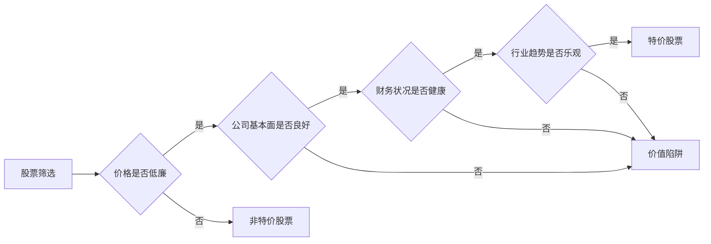

# 特价股票与价值陷阱的区分方法

> 关键词：特价股票、价值陷阱、区分方法、财务分析、市场趋势

> 摘要：在股票投资领域，准确区分特价股票与价值陷阱是投资者面临的重要挑战。特价股票意味着存在被低估的投资机会，而价值陷阱则可能使投资者遭受重大损失。本文旨在深入探讨区分两者的方法，从背景知识介绍入手，阐述核心概念及联系，详细讲解相关算法原理和数学模型，通过项目实战案例进行具体说明，分析实际应用场景，推荐相关工具和资源，最后总结未来发展趋势与挑战，并提供常见问题解答和参考资料，帮助投资者更好地把握投资机会，规避风险。

## 1. 背景介绍 
### 1.1 目的和范围
本文章的主要目的是为投资者提供一套全面、系统的区分特价股票与价值陷阱的方法。通过深入分析相关概念、原理和实际案例，帮助投资者在复杂多变的股票市场中准确识别具有投资价值的特价股票，避免陷入价值陷阱。范围涵盖了股票市场的各个方面，包括公司基本面分析、财务指标研究、市场趋势判断等。

### 1.2 预期读者
本文预期读者主要包括股票投资者、金融分析师、投资顾问以及对股票投资感兴趣的相关人士。无论是新手投资者还是有一定经验的专业人士，都可以从本文中获取有价值的信息和方法，提升自己的投资决策能力。

### 1.3 文档结构概述
本文将按照以下结构进行阐述：首先介绍背景知识，包括目的、预期读者和文档结构概述等；接着讲解核心概念与联系，通过文本示意图和 Mermaid 流程图进行直观展示；然后详细阐述核心算法原理和具体操作步骤，使用 Python 源代码进行说明；再介绍数学模型和公式，并举例说明；之后通过项目实战案例，包括开发环境搭建、源代码实现和代码解读等进行具体分析；分析实际应用场景；推荐相关工具和资源；最后总结未来发展趋势与挑战，提供常见问题解答和参考资料。

### 1.4 术语表
#### 1.4.1 核心术语定义
- **特价股票**：指市场价格低于其内在价值的股票，通常是由于市场短期情绪、行业暂时困境等原因导致股价被低估，具有一定的投资价值。
- **价值陷阱**：表面上看股票价格很低，似乎具有投资价值，但实际上公司基本面存在严重问题，如业绩持续下滑、行业前景不佳等，股价可能会继续下跌，投资者买入后可能遭受损失。

#### 1.4.2 相关概念解释
- **内在价值**：指股票所代表的公司的真实价值，通常通过对公司的财务状况、盈利能力、行业地位等多方面因素进行综合评估得出。
- **市场价格**：指股票在证券市场上的实时交易价格，受到市场供求关系、投资者情绪等多种因素的影响。

#### 1.4.3 缩略词列表
- **PE**：市盈率（Price Earnings Ratio），指股票价格与每股收益的比率，反映了市场对公司盈利的预期。
- **PB**：市净率（Price to Book Ratio），指股票价格与每股净资产的比率，反映了市场对公司净资产的估值。

## 2. 核心概念与联系 

### 核心概念原理
特价股票和价值陷阱是股票投资中两个重要的概念，它们都与股票的价格和内在价值密切相关。特价股票的出现往往是由于市场的短期非理性行为，导致股票价格低于其内在价值。投资者通过深入研究公司基本面和行业趋势，发现这些被低估的股票，从而获得投资机会。

而价值陷阱则是一种假象，股票价格虽然看似低廉，但公司的基本面存在严重问题，如财务状况恶化、行业竞争激烈、管理层能力不足等。这些问题可能导致公司的业绩持续下滑，股价进一步下跌，投资者买入后可能陷入长期亏损的困境。

### 架构的文本示意图
特价股票和价值陷阱的区分主要基于对公司基本面、财务状况、行业趋势等多方面因素的综合分析。具体架构如下：

| 分析维度 | 特价股票特征 | 价值陷阱特征 |
| --- | --- | --- |
| 公司基本面 | 具有竞争优势、行业地位稳固、管理层能力强 | 缺乏竞争优势、行业地位下降、管理层决策失误 |
| 财务状况 | 盈利能力稳定、现金流充足、资产负债结构合理 | 盈利能力下降、现金流紧张、资产负债结构恶化 |
| 行业趋势 | 所处行业前景良好、具有增长潜力 | 所处行业面临困境、发展前景黯淡 |

### Mermaid 流程图


## 3. 核心算法原理 & 具体操作步骤 

### 核心算法原理
区分特价股票与价值陷阱的核心算法原理是通过对多个关键指标进行综合分析，评估股票的内在价值和潜在风险。常用的指标包括市盈率（PE）、市净率（PB）、净资产收益率（ROE）、现金流等。通过计算这些指标，并与同行业平均水平进行比较，可以初步判断股票是否被低估或存在潜在风险。

### 具体操作步骤
1. **数据收集**：收集目标股票的财务报表、行业研究报告、市场数据等相关信息。
2. **指标计算**：根据收集到的数据，计算市盈率（PE）、市净率（PB）、净资产收益率（ROE）、现金流等关键指标。
3. **指标比较**：将计算得到的指标与同行业平均水平进行比较，判断股票的估值水平和财务状况。
4. **基本面分析**：深入研究公司的基本面，包括公司的竞争优势、行业地位、管理层能力等。
5. **行业趋势分析**：分析所处行业的发展趋势、市场前景、竞争格局等。
6. **综合评估**：根据以上分析结果，综合评估股票是否为特价股票或价值陷阱。

### Python 源代码实现
```python
import pandas as pd

# 定义计算市盈率的函数
def calculate_pe(price, earnings_per_share):
    if earnings_per_share == 0:
        return None
    return price / earnings_per_share

# 定义计算市净率的函数
def calculate_pb(price, book_value_per_share):
    if book_value_per_share == 0:
        return None
    return price / book_value_per_share

# 定义计算净资产收益率的函数
def calculate_roe(net_income, shareholders_equity):
    if shareholders_equity == 0:
        return None
    return (net_income / shareholders_equity) * 100

# 示例数据
data = {
    '股票代码': ['000001', '000002'],
    '股价': [10, 20],
    '每股收益': [1, 2],
    '每股净资产': [5, 10],
    '净利润': [1000, 2000],
    '股东权益': [5000, 10000]
}

df = pd.DataFrame(data)

# 计算指标
df['PE'] = df.apply(lambda row: calculate_pe(row['股价'], row['每股收益']), axis=1)
df['PB'] = df.apply(lambda row: calculate_pb(row['股价'], row['每股净资产']), axis=1)
df['ROE'] = df.apply(lambda row: calculate_roe(row['净利润'], row['股东权益']), axis=1)

print(df)
```

## 4. 数学模型和公式 & 详细讲解 & 举例说明 

### 数学模型和公式
1. **市盈率（PE）**：
   - 公式：$PE = \frac{股价}{每股收益}$
   - 讲解：市盈率反映了市场对公司盈利的预期。一般来说，市盈率越低，说明股票越被低估；市盈率越高，说明市场对公司的预期越高，但也可能存在泡沫。
2. **市净率（PB）**：
   - 公式：$PB = \frac{股价}{每股净资产}$
   - 讲解：市净率反映了市场对公司净资产的估值。市净率越低，说明股票越被低估；市净率越高，说明市场对公司的净资产预期越高。
3. **净资产收益率（ROE）**：
   - 公式：$ROE = \frac{净利润}{股东权益} \times 100\%$
   - 讲解：净资产收益率反映了公司运用自有资本的效率。ROE 越高，说明公司的盈利能力越强。

### 详细讲解
这些指标可以从不同角度反映股票的投资价值和风险。市盈率主要关注公司的盈利情况，市净率关注公司的净资产价值，净资产收益率关注公司的盈利能力和资本利用效率。在实际应用中，需要综合考虑这些指标，并结合公司的基本面和行业趋势进行分析。

### 举例说明
假设某股票的股价为 10 元，每股收益为 1 元，每股净资产为 5 元，净利润为 1000 万元，股东权益为 5000 万元。
- 计算市盈率：$PE = \frac{10}{1} = 10$
- 计算市净率：$PB = \frac{10}{5} = 2$
- 计算净资产收益率：$ROE = \frac{1000}{5000} \times 100\% = 20\%$

通过与同行业平均水平进行比较，可以判断该股票的估值水平和财务状况。如果同行业平均市盈率为 15，平均市净率为 3，平均净资产收益率为 15%，则该股票的市盈率和市净率较低，净资产收益率较高，可能被低估，具有一定的投资价值。

## 5. 项目实战：代码实际案例和详细解释说明 

### 5.1  开发环境搭建
1. **安装 Python**：从 Python 官方网站（https://www.python.org/downloads/）下载并安装 Python 3.x 版本。
2. **安装必要的库**：使用 pip 安装 pandas、numpy 等必要的库。
```sh
pip install pandas numpy
```

### 5.2  源代码详细实现和代码解读
```python
import pandas as pd

# 定义计算市盈率的函数
def calculate_pe(price, earnings_per_share):
    if earnings_per_share == 0:
        return None
    return price / earnings_per_share

# 定义计算市净率的函数
def calculate_pb(price, book_value_per_share):
    if book_value_per_share == 0:
        return None
    return price / book_value_per_share

# 定义计算净资产收益率的函数
def calculate_roe(net_income, shareholders_equity):
    if shareholders_equity == 0:
        return None
    return (net_income / shareholders_equity) * 100

# 读取股票数据文件
data = pd.read_csv('stock_data.csv')

# 计算指标
data['PE'] = data.apply(lambda row: calculate_pe(row['股价'], row['每股收益']), axis=1)
data['PB'] = data.apply(lambda row: calculate_pb(row['股价'], row['每股净资产']), axis=1)
data['ROE'] = data.apply(lambda row: calculate_roe(row['净利润'], row['股东权益']), axis=1)

# 筛选出可能的特价股票
potential_bargain_stocks = data[(data['PE'] < 10) & (data['PB'] < 2) & (data['ROE'] > 15)]

# 打印结果
print(potential_bargain_stocks)
```

### 代码解读与分析
1. **函数定义**：定义了计算市盈率、市净率和净资产收益率的函数，用于计算相关指标。
2. **数据读取**：使用 pandas 的 read_csv 函数读取股票数据文件。
3. **指标计算**：使用 apply 方法和 lambda 函数计算每个股票的市盈率、市净率和净资产收益率。
4. **筛选特价股票**：根据设定的条件筛选出可能的特价股票。
5. **结果输出**：打印筛选出的特价股票信息。

## 6. 实际应用场景 
1. **个人投资者**：个人投资者可以利用本文介绍的方法，在股票市场中筛选出具有投资价值的特价股票，避免陷入价值陷阱，提高投资收益。
2. **金融机构**：金融机构如基金公司、证券公司等，可以将这些方法应用于投资研究和决策过程中，优化投资组合，降低投资风险。
3. **投资顾问**：投资顾问可以根据这些方法为客户提供专业的投资建议，帮助客户做出更明智的投资决策。

## 7. 工具和资源推荐
### 7.1 学习资源推荐
#### 7.1.1 书籍推荐
- 《聪明的投资者》（The Intelligent Investor）：本杰明·格雷厄姆（Benjamin Graham）著，被誉为投资领域的圣经，介绍了价值投资的基本理念和方法。
- 《怎样选择成长股》（Common Stocks and Uncommon Profits）：菲利普·费雪（Philip Fisher）著，阐述了如何选择具有成长潜力的股票。

#### 7.1.2 在线课程
- Coursera 上的“投资学原理”课程：由知名大学教授授课，系统介绍投资学的基本原理和方法。
- 网易云课堂上的“股票投资实战技巧”课程：结合实际案例，讲解股票投资的实战技巧。

#### 7.1.3 技术博客和网站
- 雪球网：国内知名的投资交流社区，提供股票分析、投资策略等内容。
- 东方财富网：提供丰富的股票市场数据和资讯，以及专业的分析工具。

### 7.2 开发工具框架推荐
#### 7.2.1 IDE和编辑器
- PyCharm：一款专业的 Python 集成开发环境，提供代码编辑、调试、版本控制等功能。
- Visual Studio Code：一款轻量级的代码编辑器，支持多种编程语言，具有丰富的插件生态系统。

#### 7.2.2 调试和性能分析工具
- pdb：Python 自带的调试工具，用于调试 Python 代码。
- cProfile：Python 自带的性能分析工具，用于分析代码的性能瓶颈。

#### 7.2.3 相关框架和库
- pandas：用于数据处理和分析的 Python 库，提供了高效的数据结构和数据操作方法。
- numpy：用于科学计算的 Python 库，提供了高效的数组操作和数学函数。

### 7.3 相关论文著作推荐
#### 7.3.1 经典论文
- Fama, Eugene F., and Kenneth R. French. "The Cross‐Section of Expected Stock Returns." The Journal of Finance 47.2 (1992): 427-465. 该论文提出了著名的 Fama-French 三因子模型，对股票收益的影响因素进行了深入研究。
- Sharpe, William F. "Capital Asset Prices: A Theory of Market Equilibrium under Conditions of Risk." The Journal of Finance 19.3 (1964): 425-442. 该论文提出了资本资产定价模型（CAPM），为投资组合理论和资产定价提供了重要的理论基础。

#### 7.3.2 最新研究成果
- 通过 Google Scholar 等学术搜索引擎，可以查找关于股票投资、价值评估等领域的最新研究成果。

#### 7.3.3 应用案例分析
- 一些金融研究机构和咨询公司会发布股票投资的应用案例分析报告，可以通过相关网站或数据库获取。

## 8. 总结：未来发展趋势与挑战
### 未来发展趋势
1. **智能化分析**：随着人工智能和机器学习技术的不断发展，未来股票投资分析将越来越智能化。通过大数据分析和深度学习算法，可以更准确地识别特价股票和价值陷阱。
2. **全球化投资**：随着全球经济一体化的加速，投资者将有更多机会参与全球股票市场的投资。因此，需要综合考虑不同国家和地区的经济、政治、文化等因素，进行更加全面的投资分析。
3. **社会责任投资**：越来越多的投资者开始关注企业的社会责任和可持续发展。未来，社会责任投资将成为股票投资的一个重要趋势，投资者在选择股票时将更加注重企业的环境、社会和治理（ESG）表现。

### 挑战
1. **数据质量和可靠性**：股票投资分析需要大量的数据支持，但数据的质量和可靠性可能存在问题。不准确或不完整的数据可能导致分析结果出现偏差，影响投资决策。
2. **市场不确定性**：股票市场受到多种因素的影响，如宏观经济环境、政策变化、突发事件等，市场不确定性较大。准确预测市场走势和股票价格变化仍然是一个挑战。
3. **技术更新换代**：随着技术的不断发展，股票投资分析的方法和工具也在不断更新换代。投资者需要不断学习和掌握新的技术和方法，以适应市场的变化。

## 9. 附录：常见问题与解答
### 问题 1：如何判断一个公司的基本面是否良好？
答：可以从公司的竞争优势、行业地位、管理层能力、产品或服务质量等方面进行判断。例如，公司是否具有独特的技术、品牌优势，是否在行业中占据领先地位，管理层是否具有丰富的经验和良好的决策能力等。

### 问题 2：市盈率和市净率越低，股票就一定是特价股票吗？
答：不一定。市盈率和市净率只是参考指标，不能单纯地根据这两个指标来判断股票是否为特价股票。还需要结合公司的基本面、行业趋势、财务状况等因素进行综合分析。