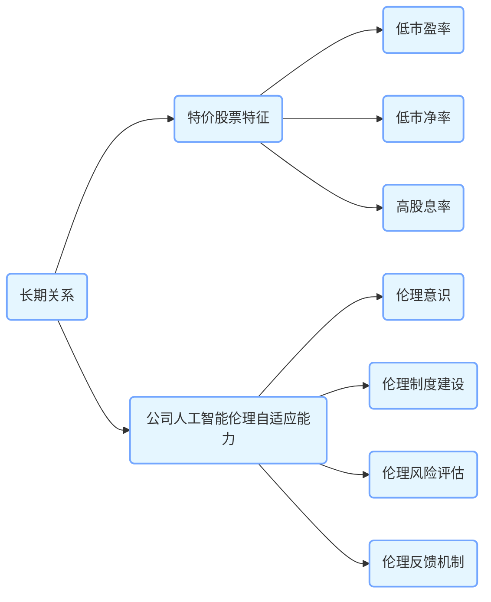

# 特价股票与公司人工智能伦理自适应能力的长期关系分析

> 关键词：特价股票、人工智能伦理自适应能力、长期关系、财务分析、伦理评估

> 摘要：本文旨在深入探讨特价股票与公司人工智能伦理自适应能力之间的长期关系。通过对相关核心概念的阐述、算法原理的分析、数学模型的构建以及实际案例的研究，揭示特价股票的特征、公司人工智能伦理自适应能力的内涵及其相互影响机制。文章还探讨了这种关系在实际应用场景中的体现，推荐了相关的学习资源、开发工具和研究论文，最后对未来发展趋势与挑战进行了总结，并解答了常见问题。

## 1. 背景介绍 
### 1.1 目的和范围
在当今金融市场和科技发展的大背景下，特价股票一直是投资者关注的焦点，而随着人工智能技术在各行业的广泛应用，公司的人工智能伦理自适应能力也日益受到重视。本研究的目的在于分析特价股票与公司人工智能伦理自适应能力之间的长期关系，为投资者、企业管理者和监管机构提供决策参考。研究范围涵盖了不同行业的上市公司，通过对其财务数据、人工智能应用情况以及伦理实践的综合分析，揭示两者之间的内在联系。

### 1.2 预期读者
本文预期读者包括金融投资者、企业管理者、人工智能研究人员、监管机构工作人员以及对金融与科技交叉领域感兴趣的学者和爱好者。投资者可以从本文中获取有关特价股票投资决策的新视角；企业管理者可以了解人工智能伦理自适应能力对公司长期价值的影响，从而制定更合理的发展战略；研究人员可以在本文的基础上开展进一步的学术研究；监管机构可以借鉴本文的研究成果，制定相关的政策和法规。

### 1.3 文档结构概述
本文将按照以下结构展开：首先介绍核心概念，包括特价股票和公司人工智能伦理自适应能力的定义和相互联系；接着阐述核心算法原理和具体操作步骤，通过Python代码进行详细说明；然后构建数学模型和公式，并举例说明；再通过实际项目案例分析代码实现和解读；之后探讨实际应用场景；推荐相关的工具和资源；最后总结未来发展趋势与挑战，解答常见问题，并提供扩展阅读和参考资料。

### 1.4 术语表
#### 1.4.1 核心术语定义
- **特价股票**：指市场价格低于其内在价值的股票，通常由于市场短期波动、公司短期负面事件等因素导致。
- **人工智能伦理自适应能力**：公司在应用人工智能技术过程中，能够根据伦理准则和社会期望，及时调整自身的人工智能系统和业务行为的能力。
- **长期关系**：指在较长时间周期内，特价股票的表现与公司人工智能伦理自适应能力之间的相互影响和关联。

#### 1.4.2 相关概念解释
- **内在价值**：股票的内在价值是基于公司的基本面因素，如盈利能力、资产状况、行业前景等计算得出的理论价值。
- **人工智能伦理准则**：一系列规范人工智能技术开发、应用和管理的道德原则，包括公平性、透明度、隐私保护等。
- **伦理自适应**：公司能够感知外部伦理环境的变化，并通过内部机制调整人工智能系统和业务流程，以符合伦理要求。

#### 1.4.3 缩略词列表
- **AI**：人工智能（Artificial Intelligence）
- **ESG**：环境、社会和治理（Environmental, Social and Governance）

## 2. 核心概念与联系 
### 2.1 特价股票的特征
特价股票通常具有以下特征：
- **低市盈率（P/E）**：市盈率是股票价格与每股收益的比率，低市盈率意味着股票价格相对较低，可能被市场低估。
- **低市净率（P/B）**：市净率是股票价格与每股净资产的比率，低市净率表示股票价格低于公司的净资产价值。
- **高股息率**：股息率是股息与股票价格的比率，高股息率说明公司向股东分配的利润较多，股票具有一定的投资价值。

### 2.2 公司人工智能伦理自适应能力的内涵
公司的人工智能伦理自适应能力包括以下几个方面：
- **伦理意识**：公司管理层和员工对人工智能伦理问题的认识和重视程度。
- **伦理制度建设**：建立完善的人工智能伦理管理制度和流程，确保人工智能系统的开发和应用符合伦理准则。
- **伦理风险评估**：对人工智能系统可能带来的伦理风险进行识别、评估和控制。
- **伦理反馈机制**：能够及时收集和处理内外部关于人工智能伦理的反馈信息，并据此调整公司的人工智能策略和行为。

### 2.3 特价股票与公司人工智能伦理自适应能力的联系
从长期来看，公司的人工智能伦理自适应能力可能会对特价股票的表现产生影响。具有较强人工智能伦理自适应能力的公司，能够更好地应对伦理挑战，减少潜在的法律风险和声誉损失，从而提升公司的长期价值。这种价值提升可能会反映在股票价格上，使得原本的特价股票逐渐回归其内在价值。反之，缺乏人工智能伦理自适应能力的公司可能会面临伦理困境，导致股价下跌，甚至沦为特价股票。

### 2.4 文本示意图
```plaintext
特价股票 <----> 公司人工智能伦理自适应能力
|                   |
|                   |
市场因素         伦理意识
财务指标         伦理制度建设
行业竞争         伦理风险评估
                 伦理反馈机制
```

### 2.5 Mermaid 流程图


## 3. 核心算法原理 & 具体操作步骤 
### 3.1 特价股票筛选算法
我们可以使用Python编写一个简单的算法来筛选特价股票。以下是具体的代码实现：
```python
import pandas as pd

def select_bargain_stocks(data, pe_threshold=10, pb_threshold=1, dividend_yield_threshold=0.05):
    """
    筛选特价股票的函数
    :param data: 包含股票财务数据的DataFrame，列名包括 'PE', 'PB', 'DividendYield'
    :param pe_threshold: 市盈率阈值
    :param pb_threshold: 市净率阈值
    :param dividend_yield_threshold: 股息率阈值
    :return: 筛选出的特价股票DataFrame
    """
    bargain_stocks = data[(data['PE'] < pe_threshold) & (data['PB'] < pb_threshold) & (data['DividendYield'] > dividend_yield_threshold)]
    return bargain_stocks

# 示例数据
data = pd.DataFrame({
    'StockCode': ['000001', '000002', '000003'],
    'PE': [8, 12, 6],
    'PB': [0.8, 1.2, 0.6],
    'DividendYield': [0.06, 0.03, 0.08]
})

# 筛选特价股票
bargain_stocks = select_bargain_stocks(data)
print(bargain_stocks)
```
### 3.2 算法原理讲解
上述代码的原理是通过设置市盈率、市净率和股息率的阈值，筛选出符合条件的特价股票。具体步骤如下：
1. 定义筛选函数 `select_bargain_stocks`，接受包含股票财务数据的 `DataFrame` 和阈值作为参数。
2. 在函数内部，使用布尔索引筛选出市盈率低于 `pe_threshold`、市净率低于 `pb_threshold` 且股息率高于 `dividend_yield_threshold` 的股票。
3. 返回筛选出的特价股票 `DataFrame`。

### 3.3 公司人工智能伦理自适应能力评估算法
为了评估公司的人工智能伦理自适应能力，我们可以构建一个综合指标体系，包括伦理意识、伦理制度建设、伦理风险评估和伦理反馈机制等方面。以下是一个简单的示例代码：
```python
def evaluate_ai_ethics_adaptability(awareness_score, institution_score, risk_assessment_score, feedback_score):
    """
    评估公司人工智能伦理自适应能力的函数
    :param awareness_score: 伦理意识得分
    :param institution_score: 伦理制度建设得分
    :param risk_assessment_score: 伦理风险评估得分
    :param feedback_score: 伦理反馈机制得分
    :return: 综合评估得分
    """
    total_score = 0.2 * awareness_score + 0.3 * institution_score + 0.3 * risk_assessment_score + 0.2 * feedback_score
    return total_score

# 示例得分
awareness_score = 80
institution_score = 70
risk_assessment_score = 75
feedback_score = 85

# 评估得分
adaptability_score = evaluate_ai_ethics_adaptability(awareness_score, institution_score, risk_assessment_score, feedback_score)
print(f"公司人工智能伦理自适应能力综合评估得分: {adaptability_score}")
```
### 3.4 算法原理讲解
上述代码的原理是通过加权平均的方法计算公司人工智能伦理自适应能力的综合评估得分。具体步骤如下：
1. 定义评估函数 `evaluate_ai_ethics_adaptability`，接受伦理意识、伦理制度建设、伦理风险评估和伦理反馈机制的得分作为参数。
2. 根据各方面的重要性设置权重，分别为 0.2、0.3、0.3 和 0.2。
3. 计算加权平均得分，作为公司人工智能伦理自适应能力的综合评估得分。

## 4. 数学模型和公式 & 详细讲解 & 举例说明 
### 4.1 特价股票筛选的数学模型
特价股票筛选的数学模型可以表示为：
$$
\begin{cases}
PE < PE_{threshold} \\
PB < PB_{threshold} \\
DividendYield > DividendYield_{threshold}
\end{cases}
$$
其中，$PE$ 表示市盈率，$PE_{threshold}$ 表示市盈率阈值；$PB$ 表示市净率，$PB_{threshold}$ 表示市净率阈值；$DividendYield$ 表示股息率，$DividendYield_{threshold}$ 表示股息率阈值。

例如，假设我们设置 $PE_{threshold} = 10$，$PB_{threshold} = 1$，$DividendYield_{threshold} = 0.05$。对于某只股票，其市盈率为 8，市净率为 0.8，股息率为 0.06，满足上述条件，因此该股票被筛选为特价股票。

### 4.2 公司人工智能伦理自适应能力评估的数学模型
公司人工智能伦理自适应能力评估的数学模型可以表示为：
$$
Score = w_1 \times AwarenessScore + w_2 \times InstitutionScore + w_3 \times RiskAssessmentScore + w_4 \times FeedbackScore
$$
其中，$Score$ 表示综合评估得分，$w_1$、$w_2$、$w_3$、$w_4$ 分别表示伦理意识、伦理制度建设、伦理风险评估和伦理反馈机制的权重，且 $w_1 + w_2 + w_3 + w_4 = 1$；$AwarenessScore$、$InstitutionScore$、$RiskAssessmentScore$、$FeedbackScore$ 分别表示各方面的得分。

例如，假设 $w_1 = 0.2$，$w_2 = 0.3$，$w_3 = 0.3$，$w_4 = 0.2$，某公司的伦理意识得分 $AwarenessScore = 80$，伦理制度建设得分 $InstitutionScore = 70$，伦理风险评估得分 $RiskAssessmentScore = 75$，伦理反馈机制得分 $FeedbackScore = 85$，则该公司的综合评估得分 $Score$ 为：
$$
\begin{align*}
Score &= 0.2 \times 80 + 0.3 \times 70 + 0.3 \times 75 + 0.2 \times 85 \\
&= 16 + 21 + 22.5 + 17 \\
&= 76.5
\end{align*}
$$

### 4.3 特价股票与公司人工智能伦理自适应能力关系的数学模型
为了研究特价股票与公司人工智能伦理自适应能力之间的长期关系，我们可以构建一个回归模型：
$$
StockReturn = \beta_0 + \beta_1 \times AI_Ethics_Adaptability + \beta_2 \times X_2 + \cdots + \beta_n \times X_n + \epsilon
$$
其中，$StockReturn$ 表示股票的长期回报率，$AI_Ethics_Adaptability$ 表示公司人工智能伦理自适应能力的综合评估得分，$X_2, \cdots, X_n$ 表示其他控制变量，如公司规模、行业因素等，$\beta_0, \beta_1, \cdots, \beta_n$ 表示回归系数，$\epsilon$ 表示误差项。

通过对历史数据进行回归分析，我们可以估计出回归系数 $\beta_1$，从而判断公司人工智能伦理自适应能力对股票长期回报率的影响。如果 $\beta_1$ 显著为正，则说明公司人工智能伦理自适应能力越强，股票的长期回报率越高；反之，如果 $\beta_1$ 显著为负，则说明公司人工智能伦理自适应能力越强，股票的长期回报率越低。

## 5. 项目实战：代码实际案例和详细解释说明 
### 5.1  开发环境搭建
在进行项目实战之前，我们需要搭建开发环境。以下是具体的步骤：
1. **安装 Python**：建议使用 Python 3.7 及以上版本，可以从 Python 官方网站（https://www.python.org/downloads/）下载安装包进行安装。
2. **安装必要的库**：我们需要安装 `pandas`、`numpy`、`scikit-learn` 等库，可以使用 `pip` 命令进行安装：
```sh
pip install pandas numpy scikit-learn
```
3. **选择 IDE**：可以选择 PyCharm、Jupyter Notebook 等集成开发环境，方便代码的编写和调试。

### 5.2  源代码详细实现和代码解读
以下是一个完整的项目实战代码示例，用于分析特价股票与公司人工智能伦理自适应能力之间的长期关系：
```python
import pandas as pd
import numpy as np
from sklearn.linear_model import LinearRegression

# 示例数据
data = pd.DataFrame({
    'StockCode': ['000001', '000002', '000003', '000004', '000005'],
    'PE': [8, 12, 6, 9, 7],
    'PB': [0.8, 1.2, 0.6, 0.9, 0.7],
    'DividendYield': [0.06, 0.03, 0.08, 0.05, 0.07],
    'AI_Ethics_Adaptability': [70, 60, 80, 75, 72],
    'StockReturn': [0.1, 0.05, 0.15, 0.12, 0.11]
})

# 筛选特价股票
bargain_stocks = data[(data['PE'] < 10) & (data['PB'] < 1) & (data['DividendYield'] > 0.05)]
print("特价股票:")
print(bargain_stocks)

# 构建回归模型
X = bargain_stocks[['AI_Ethics_Adaptability']]
y = bargain_stocks['StockReturn']
model = LinearRegression()
model.fit(X, y)

# 输出回归结果
print("\n回归结果:")
print(f"截距: {model.intercept_}")
print(f"斜率: {model.coef_[0]}")
```
### 5.3  代码解读与分析
上述代码的主要步骤如下：
1. **数据准备**：创建一个包含股票财务数据、人工智能伦理自适应能力得分和股票回报率的 `DataFrame`。
2. **筛选特价股票**：使用布尔索引筛选出市盈率低于 10、市净率低于 1 且股息率高于 0.05 的股票。
3. **构建回归模型**：使用 `sklearn` 库中的 `LinearRegression` 类构建线性回归模型，以公司人工智能伦理自适应能力得分作为自变量，股票回报率作为因变量。
4. **模型训练**：调用 `fit` 方法对模型进行训练。
5. **输出回归结果**：输出回归模型的截距和斜率，斜率表示公司人工智能伦理自适应能力对股票回报率的影响程度。

通过对回归结果的分析，我们可以判断公司人工智能伦理自适应能力与特价股票长期回报率之间的关系。如果斜率为正，则说明公司人工智能伦理自适应能力越强，特价股票的长期回报率越高；反之，如果斜率为负，则说明公司人工智能伦理自适应能力越强，特价股票的长期回报率越低。

## 6. 实际应用场景 
### 6.1 投资者决策
对于投资者来说，了解特价股票与公司人工智能伦理自适应能力之间的长期关系可以帮助他们做出更明智的投资决策。投资者可以筛选出具有较强人工智能伦理自适应能力的特价股票，这些股票可能具有更高的长期投资价值。同时，投资者也可以关注公司的人工智能伦理实践，避免投资那些存在伦理风险的公司。

### 6.2 企业战略规划
企业管理者可以通过提升公司的人工智能伦理自适应能力，增强公司的长期竞争力。具有较强伦理自适应能力的公司能够更好地应对社会舆论和监管要求，减少潜在的法律风险和声誉损失，从而提升公司的市场形象和股价表现。企业管理者可以制定相应的人工智能伦理战略，加强伦理制度建设和员工培训，提高公司的整体伦理水平。

### 6.3 监管机构政策制定
监管机构可以根据特价股票与公司人工智能伦理自适应能力之间的关系，制定相关的政策和法规。例如，要求上市公司披露其人工智能伦理实践情况，加强对人工智能技术应用的伦理监管，促进金融市场的健康发展。监管机构还可以鼓励企业提升人工智能伦理自适应能力，推动整个行业的可持续发展。

## 7. 工具和资源推荐
### 7.1 学习资源推荐
#### 7.1.1 书籍推荐
- 《人工智能伦理》：本书系统介绍了人工智能伦理的基本概念、理论和实践，为读者提供了全面的人工智能伦理知识体系。
- 《财务分析与估值》：帮助读者掌握财务分析的方法和技巧，了解如何评估股票的内在价值。
- 《机器学习实战》：通过实际案例介绍机器学习算法的应用，对于理解人工智能技术有很大帮助。

#### 7.1.2 在线课程
- Coursera 上的“人工智能伦理”课程：由知名教授授课，深入讲解人工智能伦理的前沿问题和解决方案。
- edX 上的“财务分析基础”课程：系统介绍财务分析的基本原理和方法。
- 网易云课堂上的“Python 数据分析实战”课程：帮助学习者掌握 Python 在数据分析领域的应用。

#### 7.1.3 技术博客和网站
- Medium：有许多关于人工智能、金融投资等领域的优质博客文章，提供了最新的行业动态和技术见解。
- Seeking Alpha：专注于金融市场分析和投资研究，为投资者提供有价值的信息和建议。
- Towards Data Science：是一个数据科学和人工智能领域的专业网站，发布了大量的技术文章和案例分析。

### 7.2 开发工具框架推荐
#### 7.2.1 IDE和编辑器
- PyCharm：是一款专业的 Python 集成开发环境，提供了丰富的代码编辑、调试和项目管理功能。
- Jupyter Notebook：是一个交互式的开发环境，适合进行数据分析和模型开发，支持多种编程语言。
- Visual Studio Code：是一款轻量级的代码编辑器，具有丰富的插件扩展功能，可用于 Python 开发。

#### 7.2.2 调试和性能分析工具
- Py-Spy：用于分析 Python 程序的性能瓶颈，找出耗时的代码段。
- PDB：Python 自带的调试工具，可用于调试 Python 代码，定位程序中的错误。
- Profiler：Python 标准库中的性能分析模块，可用于分析程序的运行时间和内存使用情况。

#### 7.2.3 相关框架和库
- Pandas：是一个强大的数据分析库，提供了高效的数据结构和数据处理功能，适用于金融数据的分析和处理。
- Numpy：是 Python 科学计算的基础库，提供了高效的多维数组对象和数学函数，用于数值计算和矩阵运算。
- Scikit-learn：是一个常用的机器学习库，提供了丰富的机器学习算法和工具，可用于构建回归模型和分类模型。

### 7.3 相关论文著作推荐
#### 7.3.1 经典论文
- “The Ethics of Artificial Intelligence”：该论文探讨了人工智能伦理的核心问题和挑战，为后续的研究奠定了基础。
- “Value Investing: The Use of Historical Financial Statement Information to Separate Winners from Losers”：介绍了价值投资的理论和方法，对于理解特价股票的筛选有重要参考价值。
- “Corporate Social Responsibility and Financial Performance: A Meta - analysis”：研究了企业社会责任与财务绩效之间的关系，对公司人工智能伦理自适应能力与股价表现的研究有一定的启示作用。

#### 7.3.2 最新研究成果
- 关注顶级学术期刊，如《Journal of Financial Economics》、《Management Science》、《Artificial Intelligence》等，这些期刊经常发表关于金融、人工智能和伦理等领域的最新研究成果。
- 参加相关的学术会议，如国际人工智能联合会议（IJCAI）、金融研究年会（AFA）等，与国内外的专家学者交流最新的研究进展。

#### 7.3.3 应用案例分析
- 分析知名企业在人工智能伦理实践方面的案例，如谷歌、微软等公司在人工智能研发和应用过程中的伦理考量和应对措施。
- 研究金融机构在投资决策中如何考虑公司的人工智能伦理因素，如一些社会责任投资基金的投资策略和实践。

## 8. 总结：未来发展趋势与挑战
### 8.1 未来发展趋势
- **人工智能伦理重要性日益凸显**：随着人工智能技术的不断发展和应用，人工智能伦理问题将受到越来越多的关注。公司的人工智能伦理自适应能力将成为衡量其竞争力的重要指标之一。
- **数据驱动的分析方法不断完善**：利用大数据和机器学习技术，对特价股票和公司人工智能伦理自适应能力进行更精准的分析和预测将成为未来的发展趋势。
- **跨学科研究不断深入**：金融、人工智能和伦理等领域的跨学科研究将不断深入，为解决实际问题提供更全面的理论和方法支持。

### 8.2 挑战
- **伦理标准的不确定性**：目前，人工智能伦理标准尚未统一，不同国家和地区、不同行业对伦理问题的认识和理解存在差异，这给公司的人工智能伦理自适应能力评估带来了困难。
- **数据质量和隐私保护**：在进行数据分析时，数据质量和隐私保护是重要的挑战。确保数据的准确性、完整性和安全性，同时保护个人隐私，是需要解决的关键问题。
- **技术创新与伦理约束的平衡**：在推动人工智能技术创新的同时，如何平衡技术创新与伦理约束之间的关系，避免技术滥用带来的伦理风险，是未来需要面对的重要挑战。

## 9. 附录：常见问题与解答
### 9.1 如何确定特价股票的筛选阈值？
特价股票的筛选阈值可以根据市场情况、行业特点和个人投资偏好进行调整。一般来说，市盈率低于 10、市净率低于 1、股息率高于 5% 可以作为一个参考标准，但具体阈值需要结合实际情况进行分析。

### 9.2 如何评估公司的人工智能伦理自适应能力？
评估公司的人工智能伦理自适应能力可以从伦理意识、伦理制度建设、伦理风险评估和伦理反馈机制等方面进行综合考量。可以通过问卷调查、实地考察、分析公司公开报告等方式获取相关信息，并根据建立的指标体系进行评分。

### 9.3 特价股票与公司人工智能伦理自适应能力之间的关系是否稳定？
特价股票与公司人工智能伦理自适应能力之间的关系受到多种因素的影响，如市场环境、行业竞争、公司战略等，因此这种关系并不是绝对稳定的。在不同的时间和市场条件下，两者之间的关系可能会发生变化。

### 9.4 如何利用研究结果进行投资决策？
投资者可以将公司的人工智能伦理自适应能力作为投资决策的一个参考因素。筛选出具有较强人工智能伦理自适应能力的特价股票，并结合其他基本面因素和技术分析方法，进行综合评估和决策。同时，投资者也需要注意风险控制，避免盲目跟风投资。

## 10. 扩展阅读 & 参考资料
### 10.1 扩展阅读
- 《人工智能时代的人类未来》：探讨了人工智能技术对人类社会的影响和未来发展趋势。
- 《金融科技前沿》：介绍了金融科技领域的最新技术和应用，包括人工智能在金融领域的应用。
- 《企业伦理与社会责任》：深入研究了企业伦理和社会责任的理论和实践，为理解公司的人工智能伦理自适应能力提供了更广阔的视角。

### 10.2 参考资料
- 中国证券监督管理委员会官方网站：提供了上市公司的财务数据和相关法规政策。
- 人工智能伦理研究机构的报告和论文：如 IEEE 人工智能伦理全球倡议组织发布的相关报告。
- 金融数据提供商的数据库：如 Wind 资讯、东方财富等，提供了丰富的金融数据和分析工具。

作者：AI天才研究院/AI Genius Institute & 禅与计算机程序设计艺术 /Zen And The Art of Computer Programming