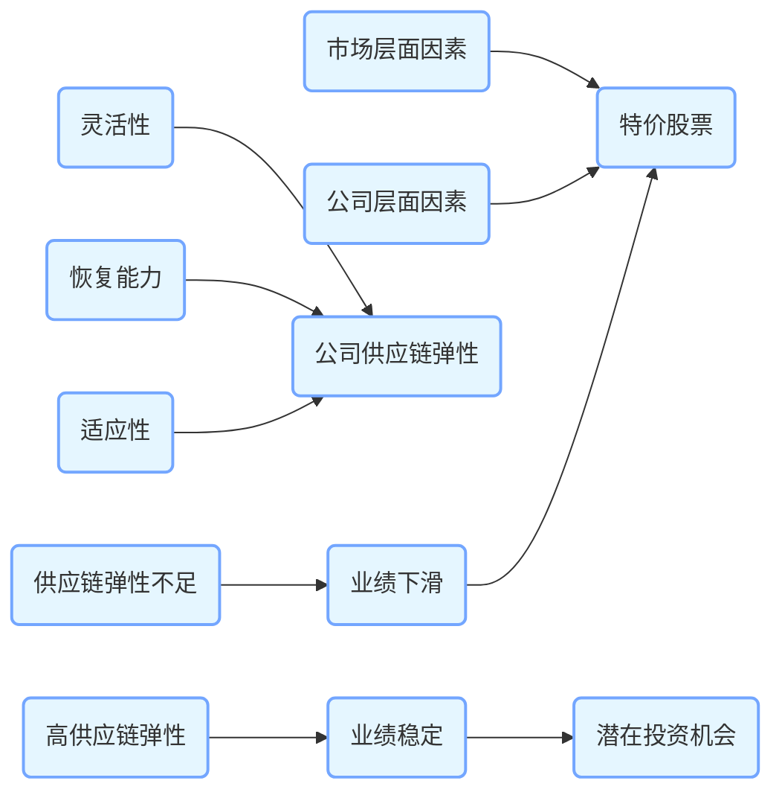

# 特价股票与公司供应链弹性的关系探讨

> 关键词：特价股票、公司供应链弹性、股票定价、供应链管理、市场分析、风险评估、投资策略

> 摘要：本文旨在深入探讨特价股票与公司供应链弹性之间的关系。通过对相关核心概念的阐述、算法原理的分析、数学模型的构建以及实际案例的研究，揭示特价股票背后公司供应链弹性的影响因素和作用机制。同时，分析其在实际应用场景中的表现，为投资者提供参考，并对未来的发展趋势和挑战进行总结。

## 1. 背景介绍 
### 1.1 目的和范围
本研究的主要目的是全面剖析特价股票与公司供应链弹性之间的内在联系。通过综合运用多种分析方法，从理论和实践两个层面探讨这种关系对公司经营和股票市场表现的影响。研究范围涵盖不同行业的上市公司，分析其供应链弹性对股票价格形成特价的影响因素，以及特价股票所反映出的公司供应链潜在问题或优势。

### 1.2 预期读者
本文预期读者包括金融投资者、股票分析师、供应链管理专业人士、企业管理者以及对金融市场和供应链领域感兴趣的研究人员。对于投资者而言，了解特价股票与公司供应链弹性的关系有助于制定更合理的投资策略；供应链管理专业人士可以从股票市场的角度审视公司供应链的价值；企业管理者能够借鉴相关分析方法优化自身供应链管理；研究人员则可在此基础上开展更深入的学术研究。

### 1.3 文档结构概述
本文将按照以下结构展开：首先介绍核心概念与联系，明确特价股票和公司供应链弹性的定义及相互关系；接着阐述核心算法原理和具体操作步骤，通过Python代码详细说明相关分析方法；然后构建数学模型并进行详细讲解和举例说明；随后通过项目实战，给出代码实际案例并进行详细解释；分析实际应用场景，探讨这种关系在不同场景下的表现；推荐相关的工具和资源，包括学习资源、开发工具框架和论文著作；最后总结未来发展趋势与挑战，解答常见问题并提供扩展阅读和参考资料。

### 1.4 术语表
#### 1.4.1 核心术语定义
- **特价股票**：指在股票市场中，价格相对其内在价值或行业平均水平明显偏低的股票。这种低价可能是由于市场短期波动、公司特定事件或投资者情绪等多种因素导致。
- **公司供应链弹性**：指公司供应链在面临内外部干扰（如自然灾害、市场需求变化、供应商问题等）时，能够迅速调整和恢复，维持其运营绩效和服务水平的能力。

#### 1.4.2 相关概念解释
- **股票内在价值**：是指股票未来现金流的现值，通过对公司的财务状况、盈利能力、行业前景等因素进行综合评估得出。
- **供应链干扰**：包括但不限于原材料供应中断、运输延误、需求预测偏差、劳动力短缺等事件，这些事件可能影响供应链的正常运作。

#### 1.4.3 缩略词列表
- **P/E**：市盈率（Price-to-Earnings Ratio），是股票价格与每股收益的比率，用于衡量股票的估值水平。
- **ROE**：净资产收益率（Return on Equity），反映股东权益的收益水平，用以衡量公司运用自有资本的效率。

## 2. 核心概念与联系 
### 2.1 特价股票的形成机制
特价股票的形成通常与多种因素相关。从市场层面来看，宏观经济环境的变化、行业竞争态势的加剧可能导致整个行业的股票价格下跌，部分公司的股票可能因此成为特价股票。例如，当经济衰退时，消费者需求下降，一些消费类公司的业绩受到影响，其股票价格可能随之走低。

从公司自身层面来看，公司的财务困境、管理问题、负面事件等都可能导致其股票价格被低估。比如，公司的债务过高、盈利能力下降、发生重大质量事故等，都会引起投资者的担忧，从而压低股票价格。

### 2.2 公司供应链弹性的内涵
公司供应链弹性主要体现在以下几个方面：
- **灵活性**：能够快速调整生产计划、采购策略和物流安排，以适应市场需求的变化。例如，当市场对某种产品的需求突然增加时，公司能够迅速增加原材料采购、扩大生产规模，并及时将产品送达客户手中。
- **恢复能力**：在遭受供应链干扰后，能够迅速恢复正常运营。比如，当供应商发生火灾导致原材料供应中断时，公司能够及时找到替代供应商，恢复生产。
- **适应性**：能够适应外部环境的变化，如政策法规的调整、技术创新等。例如，随着环保政策的加强，公司能够调整原材料采购和生产工艺，以满足环保要求。

### 2.3 特价股票与公司供应链弹性的联系
公司供应链弹性对特价股票的形成和发展具有重要影响。一方面，供应链弹性不足的公司更容易受到供应链干扰的影响，导致业绩下滑，进而使股票价格下跌成为特价股票。例如，一家依赖单一供应商的公司，如果该供应商出现问题，公司的生产将受到严重影响，利润下降，股票价格也会随之走低。

另一方面，具有高供应链弹性的公司在面对市场变化和供应链干扰时，能够更好地维持业绩稳定，其股票价格可能相对坚挺，甚至在市场波动中被低估形成特价股票。这种情况下，投资者如果能够识别公司的供应链弹性优势，可能会发现潜在的投资机会。

### 2.4 核心概念原理和架构的文本示意图
```plaintext
特价股票形成因素
├── 市场层面
│   ├── 宏观经济环境变化
│   ├── 行业竞争态势加剧
├── 公司层面
│   ├── 财务困境
│   ├── 管理问题
│   ├── 负面事件

公司供应链弹性要素
├── 灵活性
│   ├── 生产计划调整
│   ├── 采购策略变更
│   ├── 物流安排优化
├── 恢复能力
│   ├── 替代供应商寻找
│   ├── 生产恢复措施
├── 适应性
│   ├── 政策法规适应
│   ├── 技术创新应对

特价股票与公司供应链弹性关系
├── 供应链弹性不足 → 业绩下滑 → 特价股票
├── 高供应链弹性 → 业绩稳定 → 潜在投资机会
```

### 2.5 Mermaid 流程图


## 3. 核心算法原理 & 具体操作步骤 
### 3.1 特价股票筛选算法
#### 3.1.1 算法原理
我们可以通过比较股票的市盈率（P/E）和市净率（P/B）等估值指标与行业平均水平，筛选出可能的特价股票。一般来说，如果一只股票的P/E和P/B值明显低于行业平均水平，且公司的基本面没有明显恶化，那么这只股票可能被低估成为特价股票。

#### 3.1.2 Python源代码实现
```python
import pandas as pd

def select_bargain_stocks(data, industry_avg_pe, industry_avg_pb):
    """
    筛选特价股票
    :param data: 包含股票数据的DataFrame，列名包括 'PE', 'PB'
    :param industry_avg_pe: 行业平均市盈率
    :param industry_avg_pb: 行业平均市净率
    :return: 筛选出的特价股票DataFrame
    """
    bargain_stocks = data[(data['PE'] < industry_avg_pe) & (data['PB'] < industry_avg_pb)]
    return bargain_stocks

# 示例数据
stock_data = pd.DataFrame({
    'StockCode': ['000001', '000002', '000003'],
    'PE': [10, 15, 20],
    'PB': [1.2, 1.5, 2.0]
})

industry_avg_pe = 18
industry_avg_pb = 1.8

bargain_stocks = select_bargain_stocks(stock_data, industry_avg_pe, industry_avg_pb)
print(bargain_stocks)
```
#### 3.1.3 代码解释
上述代码定义了一个`select_bargain_stocks`函数，该函数接受一个包含股票数据的DataFrame和行业平均市盈率、市净率作为输入。函数内部通过比较股票的P/E和P/B值与行业平均水平，筛选出符合条件的特价股票，并返回一个新的DataFrame。

### 3.2 公司供应链弹性评估算法
#### 3.2.1 算法原理
我们可以通过构建一个供应链弹性评估指标体系，对公司的供应链弹性进行量化评估。评估指标可以包括供应商数量、库存周转率、交付准时率等。根据这些指标的权重，计算出公司的供应链弹性得分。

#### 3.2.2 Python源代码实现
```python
def calculate_supply_chain_resilience_score(supplier_count, inventory_turnover, delivery_on_time_rate):
    """
    计算公司供应链弹性得分
    :param supplier_count: 供应商数量
    :param inventory_turnover: 库存周转率
    :param delivery_on_time_rate: 交付准时率
    :return: 供应链弹性得分
    """
    # 假设各指标权重
    weight_supplier_count = 0.3
    weight_inventory_turnover = 0.3
    weight_delivery_on_time_rate = 0.4

    # 计算得分
    score = (supplier_count * weight_supplier_count +
             inventory_turnover * weight_inventory_turnover +
             delivery_on_time_rate * weight_delivery_on_time_rate)
    return score

# 示例数据
supplier_count = 5
inventory_turnover = 8
delivery_on_time_rate = 0.9

resilience_score = calculate_supply_chain_resilience_score(supplier_count, inventory_turnover, delivery_on_time_rate)
print(f"公司供应链弹性得分: {resilience_score}")
```
#### 3.2.3 代码解释
上述代码定义了一个`calculate_supply_chain_resilience_score`函数，该函数接受供应商数量、库存周转率和交付准时率作为输入。函数内部根据预设的权重，计算出公司的供应链弹性得分。

## 4. 数学模型和公式 & 详细讲解 & 举例说明 
### 4.1 特价股票估值模型
#### 4.1.1 模型原理
我们可以使用股息贴现模型（Dividend Discount Model，DDM）来估算股票的内在价值，从而判断股票是否为特价股票。DDM模型的基本思想是，股票的内在价值等于其未来股息的现值之和。

#### 4.1.2 数学公式
$$V = \frac{D_1}{r - g}$$
其中，$V$ 表示股票的内在价值，$D_1$ 表示下一期预计股息，$r$ 表示投资者要求的回报率，$g$ 表示股息的增长率。

#### 4.1.3 详细讲解
该公式的推导基于永续增长的假设，即股息以固定的增长率 $g$ 无限期增长。分母 $r - g$ 表示股息的贴现率，分子 $D_1$ 表示下一期的股息。通过比较股票的内在价值 $V$ 和市场价格 $P$，如果 $V > P$，则股票可能被低估成为特价股票。

#### 4.1.4 举例说明
假设某公司下一期预计股息 $D_1 = 1$ 元，投资者要求的回报率 $r = 0.1$，股息的增长率 $g = 0.05$。则该股票的内在价值为：
$$V = \frac{1}{0.1 - 0.05} = 20 \text{ 元}$$
如果该股票的市场价格为 $15$ 元，由于 $V > P$，则该股票可能被低估成为特价股票。

### 4.2 公司供应链弹性评估模型
#### 4.2.1 模型原理
我们可以使用加权平均法来构建公司供应链弹性评估模型。通过对多个评估指标进行加权求和，得到公司的供应链弹性得分。

#### 4.2.2 数学公式
$$S = \sum_{i=1}^{n} w_i \times x_i$$
其中，$S$ 表示公司的供应链弹性得分，$w_i$ 表示第 $i$ 个评估指标的权重，$x_i$ 表示第 $i$ 个评估指标的数值，$n$ 表示评估指标的数量。

#### 4.2.3 详细讲解
该公式通过对各个评估指标进行加权求和，综合考虑了不同指标对供应链弹性的影响。权重 $w_i$ 的确定需要根据实际情况进行调整，以反映各个指标的重要程度。

#### 4.2.4 举例说明
假设我们使用供应商数量、库存周转率和交付准时率三个指标来评估公司的供应链弹性，其权重分别为 $w_1 = 0.3$，$w_2 = 0.3$，$w_3 = 0.4$，对应的指标数值分别为 $x_1 = 5$，$x_2 = 8$，$x_3 = 0.9$。则该公司的供应链弹性得分 $S$ 为：
$$S = 0.3 \times 5 + 0.3 \times 8 + 0.4 \times 0.9 = 1.5 + 2.4 + 0.36 = 4.26$$

## 5. 项目实战：代码实际案例和详细解释说明 
### 5.1  开发环境搭建
#### 5.1.1 安装Python
首先，确保你已经安装了Python 3.x版本。你可以从Python官方网站（https://www.python.org/downloads/）下载并安装适合你操作系统的Python版本。

#### 5.1.2 安装必要的库
在项目中，我们将使用`pandas`库进行数据处理。你可以使用以下命令安装`pandas`库：
```sh
pip install pandas
```

### 5.2  源代码详细实现和代码解读
#### 5.2.1 数据准备
假设我们已经从某个数据源获取了一批股票的相关数据，包括股票代码、市盈率、市净率、供应商数量、库存周转率和交付准时率等信息，并将其存储在一个CSV文件中。以下是读取数据的代码：
```python
import pandas as pd

# 读取数据
data = pd.read_csv('stock_data.csv')
print(data.head())
```
#### 5.2.2 筛选特价股票
使用前面介绍的特价股票筛选算法，筛选出可能的特价股票：
```python
industry_avg_pe = 18
industry_avg_pb = 1.8

bargain_stocks = select_bargain_stocks(data, industry_avg_pe, industry_avg_pb)
print(bargain_stocks)
```
#### 5.2.3 评估公司供应链弹性
使用前面介绍的公司供应链弹性评估算法，计算筛选出的特价股票对应的公司的供应链弹性得分：
```python
bargain_stocks['SupplyChainResilienceScore'] = bargain_stocks.apply(
    lambda row: calculate_supply_chain_resilience_score(
        row['SupplierCount'], row['InventoryTurnover'], row['DeliveryOnTimeRate']
    ),
    axis=1
)
print(bargain_stocks)
```
#### 5.2.4 分析特价股票与供应链弹性的关系
我们可以进一步分析特价股票的供应链弹性得分分布情况，例如计算平均分、最高分和最低分：
```python
average_score = bargain_stocks['SupplyChainResilienceScore'].mean()
max_score = bargain_stocks['SupplyChainResilienceScore'].max()
min_score = bargain_stocks['SupplyChainResilienceScore'].min()

print(f"平均供应链弹性得分: {average_score}")
print(f"最高供应链弹性得分: {max_score}")
print(f"最低供应链弹性得分: {min_score}")
```

### 5.3  代码解读与分析
- **数据准备**：使用`pandas`库的`read_csv`函数读取存储股票数据的CSV文件，并打印前几行数据进行查看。
- **筛选特价股票**：调用`select_bargain_stocks`函数，根据行业平均市盈率和市净率筛选出可能的特价股票。
- **评估公司供应链弹性**：使用`apply`方法对筛选出的特价股票对应的公司数据进行逐行处理，调用`calculate_supply_chain_resilience_score`函数计算供应链弹性得分，并将结果添加到DataFrame中。
- **分析关系**：计算特价股票的供应链弹性得分的平均分、最高分和最低分，以便进一步分析特价股票与供应链弹性的关系。

## 6. 实际应用场景 
### 6.1 投资者决策
对于投资者来说，了解特价股票与公司供应链弹性的关系可以帮助他们做出更明智的投资决策。当投资者发现一只特价股票时，通过评估其公司的供应链弹性，可以判断该股票是否具有投资价值。如果公司具有较高的供应链弹性，那么即使当前股票价格被低估，也有可能在未来随着公司业绩的提升而上涨。相反，如果公司的供应链弹性不足，那么股票价格的下跌可能是由于公司基本面的问题，投资风险相对较高。

### 6.2 企业战略规划
企业管理者可以通过分析自身公司的供应链弹性与股票市场表现的关系，制定更合理的战略规划。如果公司的股票价格被低估，但供应链弹性较高，企业可以加大市场宣传力度，提高投资者对公司的认知度，从而提升股票价格。如果公司的供应链弹性不足，企业则需要采取措施优化供应链管理，提高供应链的灵活性、恢复能力和适应性，以增强公司的竞争力和抗风险能力。

### 6.3 行业研究与分析
行业研究人员可以通过研究特价股票与公司供应链弹性的关系，了解行业内不同公司的供应链状况和市场竞争力。这有助于发现行业内的潜在问题和发展趋势，为行业政策制定和企业发展提供参考。例如，如果某个行业内大部分特价股票对应的公司都存在供应链弹性不足的问题，那么行业协会可以组织相关培训和交流活动，帮助企业提高供应链管理水平。

## 7. 工具和资源推荐
### 7.1 学习资源推荐
#### 7.1.1 书籍推荐
- 《供应链管理：战略、规划与运营》（Supply Chain Management: Strategy, Planning, and Operation）：这本书全面介绍了供应链管理的理论和实践，包括供应链战略、采购管理、生产计划、物流配送等方面的内容，是学习供应链管理的经典教材。
- 《聪明的投资者》（The Intelligent Investor）：由本杰明·格雷厄姆（Benjamin Graham）所著，是价值投资领域的经典著作。书中介绍了如何评估股票的内在价值，寻找被低估的股票，对于投资者理解特价股票的概念和投资策略具有重要的指导意义。

#### 7.1.2 在线课程
- Coursera平台上的“供应链管理基础”（Foundations of Supply Chain Management）课程：该课程由知名高校的教授授课，系统地介绍了供应链管理的基本概念、方法和工具，适合初学者学习。
- edX平台上的“金融市场”（Financial Markets）课程：由耶鲁大学的罗伯特·席勒（Robert Shiller）教授授课，讲解了金融市场的运行机制、股票定价原理等内容，对于理解股票市场和特价股票的形成机制有很大帮助。

#### 7.1.3 技术博客和网站
- Seeking Alpha（https://seekingalpha.com/）：一个提供股票分析、投资策略和市场评论的网站，有很多专业的投资者和分析师在上面分享他们的观点和研究成果，对于了解特价股票的市场动态和分析方法很有帮助。
- Supply Chain Dive（https://www.supplychaindive.com/）：专注于供应链领域的新闻和分析，提供最新的供应链行业动态、趋势和案例，有助于了解公司供应链弹性的相关信息。

### 7.2 开发工具框架推荐
#### 7.2.1 IDE和编辑器
- PyCharm：一款专业的Python集成开发环境（IDE），提供了丰富的代码编辑、调试和分析功能，适合Python开发人员使用。
- Jupyter Notebook：一个交互式的开发环境，支持多种编程语言，尤其适合数据处理和分析。可以方便地进行代码编写、运行和可视化展示。

#### 7.2.2 调试和性能分析工具
- pdb：Python自带的调试器，可以帮助开发人员逐行调试代码，查找问题所在。
- cProfile：Python的性能分析模块，可以分析代码的运行时间和函数调用次数，帮助开发人员优化代码性能。

#### 7.2.3 相关框架和库
- pandas：一个强大的数据处理和分析库，提供了丰富的数据结构和函数，适合处理和分析股票数据和供应链相关数据。
- numpy：Python的数值计算库，提供了高效的数组操作和数学函数，在数据分析和模型计算中经常使用。

### 7.3 相关论文著作推荐
#### 7.3.1 经典论文
- “The Bullwhip Effect in Supply Chains”（供应链中的牛鞭效应）：由Hau L. Lee等人发表，该论文详细阐述了供应链中牛鞭效应的产生原因和影响，对于理解供应链的复杂性和弹性具有重要意义。
- “Security Analysis”（证券分析）：由本杰明·格雷厄姆和戴维·多德（David Dodd）所著，是价值投资领域的经典论文，提出了评估股票内在价值的方法和原则。

#### 7.3.2 最新研究成果
- 关注《Management Science》（管理科学）、《Operations Research》（运筹学）等顶级学术期刊，这些期刊经常发表关于供应链管理和金融市场的最新研究成果。
- 参加相关的学术会议，如INFORMS Annual Meeting（运筹学与管理科学学会年会），可以了解到该领域的前沿研究动态。

#### 7.3.3 应用案例分析
- 《Harvard Business Review》（哈佛商业评论）上经常发表一些关于企业供应链管理和投资决策的案例分析，通过阅读这些案例可以学习到实际应用中的经验和教训。
- 一些咨询公司的研究报告，如麦肯锡（McKinsey）、波士顿咨询集团（BCG）等发布的关于供应链和金融市场的报告，也提供了很多有价值的应用案例和分析。

## 8. 总结：未来发展趋势与挑战
### 8.1 未来发展趋势
- **数字化转型加速**：随着信息技术的不断发展，公司将越来越多地采用数字化手段来提升供应链弹性。例如，利用物联网、大数据、人工智能等技术实现供应链的实时监控、预测和优化，提高供应链的灵活性和响应速度。
- **绿色供应链成为主流**：环保意识的增强和政策法规的要求将促使企业更加注重绿色供应链的建设。企业将选择更环保的原材料供应商，优化物流配送路线，减少碳排放，以提高供应链的可持续性和弹性。
- **供应链金融创新**：供应链金融将不断创新，为企业提供更多的融资渠道和风险管理工具。例如，基于区块链技术的供应链金融平台可以实现供应链上各参与方的信息共享和信任传递，降低融资成本和风险。

### 8.2 挑战
- **数据安全和隐私问题**：数字化转型过程中，公司需要收集和处理大量的供应链数据，这带来了数据安全和隐私问题。一旦数据泄露，可能会给企业带来巨大的损失。
- **供应链复杂性增加**：全球化和多元化的发展使得供应链变得越来越复杂，涉及到更多的供应商、合作伙伴和物流环节。这增加了供应链管理的难度和风险，对企业的供应链弹性提出了更高的要求。
- **市场不确定性加剧**：宏观经济环境的不确定性、贸易政策的变化和自然灾害等因素都可能对供应链造成干扰。企业需要具备更强的应对能力，以在不确定的市场环境中保持供应链的稳定。

## 9. 附录：常见问题与解答
### 9.1 如何确定行业平均市盈率和市净率？
可以通过金融数据提供商（如Wind、东方财富等）获取行业内所有上市公司的市盈率和市净率数据，然后计算平均值。也可以参考专业的金融研究报告或分析师的观点。

### 9.2 供应链弹性评估指标的权重如何确定？
供应链弹性评估指标的权重确定需要综合考虑多个因素，如行业特点、企业战略、指标的重要性等。可以采用专家打分法、层次分析法等方法来确定权重。

### 9.3 特价股票一定具有投资价值吗？
不一定。特价股票可能是由于市场短期波动、公司特定事件或投资者情绪等多种因素导致的。在投资特价股票之前，需要对公司的基本面、财务状况、供应链弹性等进行全面评估，以判断其是否具有投资价值。

## 10. 扩展阅读 & 参考资料
### 10.1 扩展阅读
- 《供应链风险管理》（Supply Chain Risk Management）：深入探讨了供应链风险管理的理论和实践，对于理解供应链弹性与风险的关系有很大帮助。
- 《行为金融学》（Behavioral Finance）：介绍了投资者的心理和行为对金融市场的影响，有助于理解特价股票的形成机制。

### 10.2 参考资料
- 金融数据提供商的网站，如Wind、东方财富等，提供了丰富的股票数据和行业信息。
- 相关学术期刊和会议论文，如《Management Science》、《Operations Research》等，为研究提供了理论支持和最新研究成果。

作者：AI天才研究院/AI Genius Institute & 禅与计算机程序设计艺术 /Zen And The Art of Computer Programming