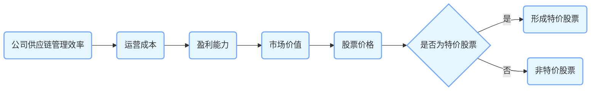

# 特价股票与公司供应链管理效率的关系

> 关键词：特价股票、公司供应链管理效率、财务指标、市场表现、风险管理、运营成本、竞争力

> 摘要：本文旨在深入探讨特价股票与公司供应链管理效率之间的关系。通过对相关核心概念的阐述、算法原理的剖析、数学模型的构建、实际案例的分析，揭示两者之间内在的联系和影响机制。研究发现，公司供应链管理效率的高低会显著影响其财务状况和市场表现，进而与特价股票的形成和表现存在紧密关联。了解这种关系有助于投资者做出更明智的决策，也有助于企业优化供应链管理以提升自身价值。

## 1. 背景介绍 
### 1.1 目的和范围
本研究的主要目的是全面分析特价股票与公司供应链管理效率之间的关系。范围涵盖了不同行业、不同规模的公司，通过对相关理论和实际案例的研究，探究供应链管理效率如何影响公司的财务指标、市场价值，进而影响股票价格成为特价股票的可能性。同时，也研究特价股票的出现对公司供应链管理决策的潜在反馈作用。

### 1.2 预期读者
本文预期读者包括金融投资者、企业管理者、供应链管理专业人士、学术研究人员以及对金融市场和企业运营管理感兴趣的人士。投资者可以从本文中获取关于选股的新视角和决策依据；企业管理者可以了解供应链管理效率对公司市场价值的重要性，从而优化管理策略；学术研究人员可以在此基础上进行更深入的理论探讨；而对相关领域感兴趣的人士可以通过本文拓宽知识视野。

### 1.3 文档结构概述
本文首先介绍背景信息，包括研究目的、预期读者和文档结构概述。接着阐述核心概念与联系，通过文本示意图和 Mermaid 流程图展示特价股票和公司供应链管理效率的原理和架构。然后详细讲解核心算法原理和具体操作步骤，结合 Python 源代码进行说明。之后构建数学模型和公式，并举例说明。再通过项目实战，给出代码实际案例并详细解释。随后探讨实际应用场景，推荐相关工具和资源。最后总结未来发展趋势与挑战，提供常见问题与解答以及扩展阅读和参考资料。

### 1.4 术语表
#### 1.4.1 核心术语定义
- **特价股票**：通常指价格相对其内在价值被低估的股票，可能由于市场短期波动、行业竞争、公司特定事件等因素导致股价低于其应有的水平。
- **公司供应链管理效率**：是指公司在供应链的各个环节，包括采购、生产、运输、销售等，以最小的成本和最短的时间实现最大的产出和客户满意度的能力。

#### 1.4.2 相关概念解释
- **供应链**：是围绕核心企业，通过对信息流、物流、资金流的控制，从采购原材料开始，制成中间产品以及最终产品，最后由销售网络把产品送到消费者手中的将供应商、制造商、分销商、零售商、直到最终用户连成一个整体的功能网链结构。
- **股票内在价值**：是指股票未来现金流入的现值，它是股票的真实价值，也叫理论价值。

#### 1.4.3 缩略词列表
- **ERP**：Enterprise Resource Planning，企业资源计划，是指建立在信息技术基础上，以系统化的管理思想，为企业决策层及员工提供决策运行手段的管理平台。
- **SCM**：Supply Chain Management，供应链管理，是指使供应链运作达到最优化，以最少的成本，令供应链从采购开始，到满足最终客户的所有过程。

## 2. 核心概念与联系 

### 2.1 特价股票的形成原理
特价股票的形成往往受到多种因素的影响。从市场层面来看，宏观经济环境的变化、行业竞争格局的调整、市场情绪的波动等都可能导致股票价格的下跌。例如，当宏观经济处于衰退期时，市场整体需求下降，企业的业绩可能受到影响，投资者对股票的预期降低，从而导致股价下跌。从公司层面来看，公司自身的经营问题、财务困境、重大负面事件等也会使股票价格被低估。比如公司出现重大的产品质量问题、管理层丑闻等，会引发投资者的恐慌，导致股价大幅下跌。

### 2.2 公司供应链管理效率的内涵
公司供应链管理效率体现在多个方面。在采购环节，高效的供应链管理能够确保以合理的价格获取高质量的原材料，同时优化采购流程，减少采购周期和库存积压。在生产环节，通过合理的生产计划和调度，提高生产效率，降低生产成本，保证产品质量的稳定性。在物流环节，优化运输路线和配送方式，提高货物的运输速度和准确性，降低物流成本。在销售环节，及时响应客户需求，提高客户满意度，促进产品的销售。

### 2.3 两者的联系
公司供应链管理效率的高低直接影响其运营成本和盈利能力。高效的供应链管理可以降低采购成本、生产成本和物流成本，提高产品质量和客户满意度，从而增加公司的利润。公司的盈利能力增强会提升其市场价值，进而影响股票价格。如果公司的供应链管理效率低下，导致成本上升、利润下降，市场对公司的预期会降低，股票价格可能会下跌，形成特价股票。反之，如果公司能够不断优化供应链管理，提高效率，其股票价格可能会得到提升，摆脱特价股票的范畴。

### 2.4 文本示意图
特价股票与公司供应链管理效率的关系可以用以下文本示意图表示：

公司供应链管理效率（采购效率、生产效率、物流效率、销售效率） -> 运营成本（降低或增加） -> 盈利能力（增强或减弱） -> 市场价值（提升或下降） -> 股票价格（上涨或下跌） -> 特价股票（形成或消除）

### 2.5 Mermaid 流程图


## 3. 核心算法原理 & 具体操作步骤 

### 3.1 核心算法原理
为了分析特价股票与公司供应链管理效率的关系，我们可以采用多因素回归分析的方法。多因素回归分析可以帮助我们确定多个自变量（如供应链管理效率的各个指标）对因变量（股票价格或股票是否为特价股票）的影响程度。

假设我们有以下变量：
- $Y$：股票价格或股票是否为特价股票的虚拟变量（1 表示是特价股票，0 表示不是）
- $X_1$：采购成本占比
- $X_2$：生产效率指标（如单位时间产量）
- $X_3$：物流成本占比
- $X_4$：销售效率指标（如销售周期）

我们可以建立如下的回归模型：

$Y = \beta_0 + \beta_1X_1 + \beta_2X_2 + \beta_3X_3 + \beta_4X_4 + \epsilon$

其中，$\beta_0$ 是截距项，$\beta_1, \beta_2, \beta_3, \beta_4$ 是回归系数，$\epsilon$ 是误差项。

### 3.2 具体操作步骤
1. **数据收集**：收集不同公司的股票价格数据、财务报表数据以及供应链管理相关数据，包括采购成本、生产效率、物流成本、销售效率等指标。
2. **数据预处理**：对收集到的数据进行清洗、整理和标准化处理，去除异常值和缺失值，确保数据的质量和一致性。
3. **模型建立**：根据上述回归模型，使用统计软件（如 Python 中的 `statsmodels` 库）进行模型拟合。
4. **模型评估**：使用相关的评估指标（如 $R^2$ 值、调整后的 $R^2$ 值、F 检验等）评估模型的拟合效果和显著性。
5. **结果分析**：分析回归系数的正负和大小，确定各个自变量对因变量的影响方向和程度。

### 3.3 Python 源代码实现
```python
import pandas as pd
import statsmodels.api as sm

# 假设我们已经收集到了数据并存储在一个 CSV 文件中
data = pd.read_csv('stock_supply_chain_data.csv')

# 定义自变量和因变量
X = data[['采购成本占比', '生产效率指标', '物流成本占比', '销售效率指标']]
Y = data['股票价格']

# 添加常数项
X = sm.add_constant(X)

# 建立回归模型
model = sm.OLS(Y, X)

# 拟合模型
results = model.fit()

# 打印模型结果
print(results.summary())
```

## 4. 数学模型和公式 & 详细讲解 & 举例说明 

### 4.1 数学模型和公式
如前面所述，我们建立的多因素回归模型为：

$Y = \beta_0 + \beta_1X_1 + \beta_2X_2 + \beta_3X_3 + \beta_4X_4 + \epsilon$

其中：
- $Y$ 是因变量，代表股票价格或股票是否为特价股票的虚拟变量。
- $\beta_0$ 是截距项，表示当所有自变量都为 0 时，因变量的取值。
- $\beta_1, \beta_2, \beta_3, \beta_4$ 是回归系数，分别表示自变量 $X_1, X_2, X_3, X_4$ 对因变量 $Y$ 的影响程度。
- $\epsilon$ 是误差项，代表模型中无法解释的随机因素。

### 4.2 详细讲解
- **截距项 $\beta_0$**：在实际应用中，截距项可能没有明确的经济意义，它只是为了使模型能够更好地拟合数据。
- **回归系数 $\beta_i$**：回归系数的正负表示自变量与因变量之间的正相关或负相关关系。例如，如果 $\beta_1$ 为负，说明采购成本占比越高，股票价格越低，即采购成本占比与股票价格呈负相关关系。回归系数的大小表示自变量对因变量的影响程度，系数的绝对值越大，影响程度越大。
- **误差项 $\epsilon$**：误差项反映了模型中未考虑到的因素对因变量的影响。在理想情况下，误差项应该服从均值为 0 的正态分布。

### 4.3 举例说明
假设我们通过回归分析得到以下结果：

$\hat{Y} = 10 - 0.5X_1 + 0.3X_2 - 0.2X_3 + 0.1X_4$

其中，$\hat{Y}$ 是股票价格的预测值。

如果一家公司的采购成本占比为 20%，生产效率指标为 50，物流成本占比为 10%，销售效率指标为 30，则该公司股票价格的预测值为：

$\hat{Y} = 10 - 0.5\times20 + 0.3\times50 - 0.2\times10 + 0.1\times30$

$= 10 - 10 + 15 - 2 + 3$

$= 16$

这意味着根据我们的模型预测，该公司的股票价格为 16 元。

## 5. 项目实战：代码实际案例和详细解释说明 

### 5.1 开发环境搭建
1. **安装 Python**：从 Python 官方网站（https://www.python.org/downloads/）下载并安装适合你操作系统的 Python 版本。建议安装 Python 3.7 及以上版本。
2. **安装必要的库**：使用以下命令安装所需的库：
```sh
pip install pandas statsmodels
```
3. **准备数据**：收集相关公司的股票价格数据、财务报表数据以及供应链管理相关数据，并将其整理成 CSV 文件，确保文件中的列名与代码中的变量名一致。

### 5.2 源代码详细实现和代码解读
```python
import pandas as pd
import statsmodels.api as sm

# 读取数据
data = pd.read_csv('stock_supply_chain_data.csv')

# 定义自变量和因变量
X = data[['采购成本占比', '生产效率指标', '物流成本占比', '销售效率指标']]
Y = data['股票价格']

# 添加常数项
X = sm.add_constant(X)

# 建立回归模型
model = sm.OLS(Y, X)

# 拟合模型
results = model.fit()

# 打印模型结果
print(results.summary())
```

**代码解读**：
1. **导入库**：`pandas` 用于数据处理和分析，`statsmodels.api` 用于建立和拟合回归模型。
2. **读取数据**：使用 `pd.read_csv` 函数读取存储在 CSV 文件中的数据。
3. **定义自变量和因变量**：从数据中提取所需的自变量和因变量。
4. **添加常数项**：使用 `sm.add_constant` 函数为自变量添加常数项，以便进行回归分析。
5. **建立回归模型**：使用 `sm.OLS` 函数建立普通最小二乘回归模型。
6. **拟合模型**：使用 `model.fit` 方法拟合模型。
7. **打印模型结果**：使用 `results.summary` 方法打印模型的详细结果，包括回归系数、$R^2$ 值、F 检验等。

### 5.3 代码解读与分析
- **回归系数**：回归系数的正负和大小反映了自变量对因变量的影响方向和程度。例如，如果采购成本占比的回归系数为负，说明采购成本占比越高，股票价格越低。
- **$R^2$ 值**：$R^2$ 值表示模型对数据的拟合程度，取值范围在 0 到 1 之间，越接近 1 表示拟合效果越好。
- **F 检验**：F 检验用于检验整个回归模型的显著性。如果 F 检验的 p 值小于设定的显著性水平（通常为 0.05），则说明回归模型是显著的。

通过对代码结果的分析，我们可以了解各个供应链管理效率指标对股票价格的影响，从而为投资决策和企业供应链管理提供参考。

## 6. 实际应用场景 

### 6.1 投资者决策
投资者可以利用特价股票与公司供应链管理效率的关系来筛选有潜力的投资标的。通过分析公司的供应链管理效率指标，如采购成本、生产效率、物流成本等，判断公司的运营状况和盈利能力。如果发现一家公司的供应链管理效率较高，但股票价格却被低估，可能是一个投资机会。投资者可以进一步深入研究该公司，评估其未来的发展前景，做出合理的投资决策。

### 6.2 企业管理决策
企业管理者可以通过关注股票价格和市场表现，了解市场对公司供应链管理效率的评价。如果公司的股票价格持续下跌，可能暗示着供应链管理存在问题。管理者可以通过分析相关指标，找出供应链管理中的薄弱环节，采取相应的改进措施，如优化采购流程、提高生产效率、降低物流成本等，以提升公司的竞争力和市场价值。

### 6.3 行业分析
分析师可以利用这种关系对整个行业进行分析。通过比较不同公司的供应链管理效率和股票价格，了解行业内的竞争格局和发展趋势。例如，如果某个行业内大部分公司的供应链管理效率较低，股票价格普遍被低估，可能预示着该行业面临着较大的挑战，需要进行产业升级和优化。

## 7. 工具和资源推荐
### 7.1 学习资源推荐
#### 7.1.1 书籍推荐
- 《供应链管理：战略、规划与运营》（苏尼尔·乔普拉、彼得·梅因德尔著）：这本书全面介绍了供应链管理的理论和实践，包括采购、生产、物流、销售等各个环节的管理方法和策略。
- 《聪明的投资者》（本杰明·格雷厄姆著）：被誉为投资界的圣经，介绍了价值投资的理念和方法，对于理解特价股票的投资机会有很大的帮助。
- 《财务报表分析与证券定价》（斯蒂芬·彭曼著）：详细讲解了如何通过分析财务报表来评估公司的价值和投资潜力。

#### 7.1.2 在线课程
- Coursera 上的“供应链管理基础”课程：由知名高校的教授授课，系统地介绍了供应链管理的基本概念、方法和工具。
- edX 上的“投资学原理”课程：涵盖了投资的基本理论和实践，包括股票投资、债券投资等内容。
- 中国大学 MOOC 上的“财务报表分析”课程：帮助学习者掌握财务报表分析的方法和技巧，为投资决策提供依据。

#### 7.1.3 技术博客和网站
- Seeking Alpha：提供专业的金融分析和投资建议，包括对特价股票的研究和分析。
- Supply Chain Dive：专注于供应链管理领域的新闻和资讯，提供最新的行业动态和趋势分析。
- 雪球网：国内知名的投资交流平台，投资者可以在上面分享自己的投资经验和观点，讨论特价股票的投资机会。

### 7.2 开发工具框架推荐
#### 7.2.1 IDE和编辑器
- PyCharm：一款功能强大的 Python 集成开发环境，提供代码编辑、调试、版本控制等功能，适合进行数据分析和建模。
- Jupyter Notebook：一种交互式的开发环境，支持多种编程语言，方便进行数据探索、可视化和模型开发。

#### 7.2.2 调试和性能分析工具
- pdb：Python 内置的调试工具，可以帮助开发者逐行调试代码，找出问题所在。
-