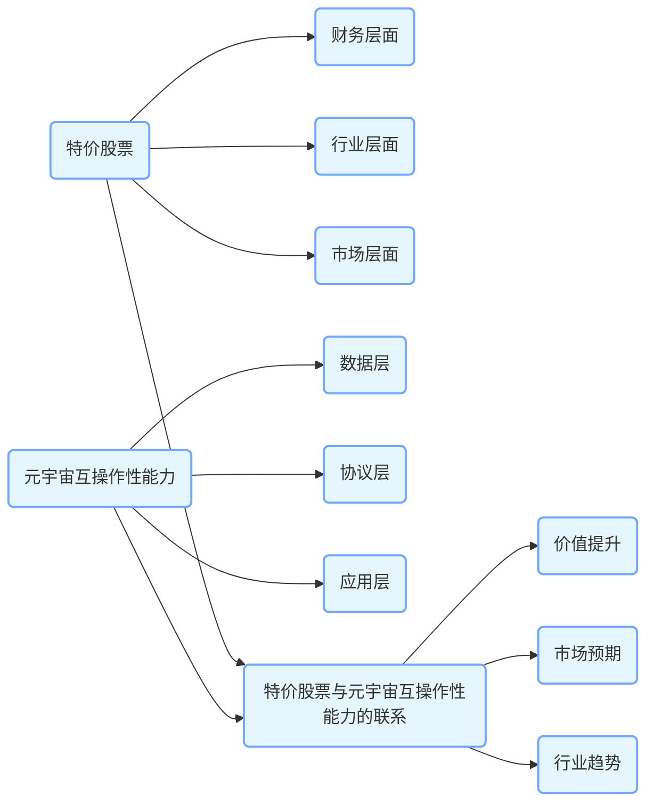

# 特价股票与公司元宇宙互操作性能力的潜在关联研究

> 关键词：特价股票、元宇宙互操作性能力、潜在关联、市场分析、财务评估

> 摘要：本文旨在深入研究特价股票与公司元宇宙互操作性能力之间的潜在关联。通过对相关概念的介绍、核心算法原理的阐述、数学模型的构建、实际案例的分析等，全面探讨两者之间可能存在的联系。研究不仅有助于投资者更好地理解特价股票的价值和潜力，也为公司在元宇宙领域的发展提供决策参考，同时对市场趋势的把握和行业发展方向的预测具有重要意义。

## 1. 背景介绍 
### 1.1 目的和范围
本研究的主要目的是揭示特价股票与公司元宇宙互操作性能力之间的潜在关联。在当今数字化快速发展的时代，元宇宙概念逐渐兴起，成为众多行业关注的焦点。而特价股票作为股票市场中的一个特殊类别，其价格往往低于其内在价值。探究两者之间的联系，有助于投资者挖掘具有潜力的投资标的，同时也能为公司在元宇宙战略布局方面提供有价值的信息。
研究范围涵盖了股票市场中被定义为特价股票的公司，以及这些公司在元宇宙领域的发展情况，包括其互操作性能力的评估和分析。通过对不同行业、不同规模公司的研究，试图找出普遍适用的规律和潜在关联。

### 1.2 预期读者
本文的预期读者主要包括以下几类人群：
1. **投资者**：希望通过了解特价股票与公司元宇宙互操作性能力的关联，寻找更有潜力的投资机会，提高投资回报率。
2. **公司管理者**：有助于他们认识到元宇宙互操作性能力对公司股票价值的影响，从而制定合理的发展战略，提升公司在市场中的竞争力。
3. **金融分析师**：为他们的研究和分析提供新的视角和方法，丰富对股票市场和元宇宙行业的理解。
4. **学术研究人员**：作为相关领域研究的参考资料，推动学术研究的发展。

### 1.3 文档结构概述
本文将按照以下结构进行阐述：
1. **核心概念与联系**：介绍特价股票、元宇宙互操作性能力的定义和原理，以及两者之间可能存在的联系。
2. **核心算法原理 & 具体操作步骤**：详细讲解用于分析两者关联的核心算法，并给出具体的操作步骤。
3. **数学模型和公式 & 详细讲解 & 举例说明**：构建数学模型，用公式表达两者之间的关系，并通过具体例子进行说明。
4. **项目实战：代码实际案例和详细解释说明**：通过实际的代码案例，展示如何运用上述算法和模型进行分析，并对代码进行详细解读。
5. **实际应用场景**：探讨两者关联在实际中的应用场景，如投资决策、公司战略规划等。
6. **工具和资源推荐**：推荐相关的学习资源、开发工具和研究论文，帮助读者进一步深入学习和研究。
7. **总结：未来发展趋势与挑战**：总结研究成果，分析未来的发展趋势和可能面临的挑战。
8. **附录：常见问题与解答**：解答读者在阅读过程中可能遇到的常见问题。
9. **扩展阅读 & 参考资料**：提供相关的扩展阅读材料和参考资料，方便读者进一步查阅。

### 1.4 术语表
#### 1.4.1 核心术语定义
- **特价股票**：指市场价格明显低于其内在价值的股票。内在价值可以通过多种方法进行评估，如财务分析、行业比较等。
- **元宇宙**：是一个虚拟的、与现实世界相互关联的数字空间，用户可以在其中进行社交、娱乐、工作等活动。它融合了虚拟现实（VR）、增强现实（AR）、区块链、人工智能等多种技术。
- **元宇宙互操作性能力**：指公司在元宇宙生态系统中，实现不同平台、不同应用之间数据、资产、用户等要素的交互和共享的能力。

#### 1.4.2 相关概念解释
- **股票内在价值**：是指股票所代表的公司的真实价值，它基于公司的财务状况、盈利能力、市场竞争力等因素。内在价值的评估是一个复杂的过程，需要综合考虑多个因素。
- **元宇宙生态系统**：由各种元宇宙平台、应用、开发者、用户等组成的一个有机整体。在这个生态系统中，各个参与者之间相互关联、相互影响。
- **数据交互**：指不同系统或平台之间进行数据传输和共享的过程。在元宇宙中，数据交互是实现互操作性的关键环节。

#### 1.4.3 缩略词列表
- **VR**：Virtual Reality，虚拟现实
- **AR**：Augmented Reality，增强现实
- **AI**：Artificial Intelligence，人工智能

## 2. 核心概念与联系 

### 2.1 特价股票的原理和架构
特价股票的出现通常是由于市场的错误定价或公司的短期困境导致的。市场错误定价可能是由于投资者的情绪波动、信息不对称等原因造成的。例如，当市场整体下跌时，一些基本面良好的公司股票也可能被过度抛售，从而导致价格低于其内在价值。
公司的短期困境可能包括财务危机、经营不善、行业竞争等因素。但如果这些困境是暂时的，并且公司有能力克服它们，那么其股票就可能成为特价股票。
特价股票的架构可以从以下几个方面来理解：
1. **财务层面**：包括公司的资产负债表、利润表、现金流量表等。通过分析这些财务报表，可以评估公司的盈利能力、偿债能力、运营能力等，从而判断其内在价值。
2. **行业层面**：考虑公司所处的行业环境、市场竞争状况、行业发展趋势等因素。如果公司所处的行业具有良好的发展前景，而其股票价格却被低估，那么它可能是一只特价股票。
3. **市场层面**：关注市场的整体走势、投资者的情绪、政策法规等因素。这些因素会影响股票的供求关系，从而导致价格波动。

### 2.2 元宇宙互操作性能力的原理和架构
元宇宙互操作性能力的实现基于多种技术和标准。其中，区块链技术是实现数据安全和可信交互的关键。通过区块链的分布式账本，可以确保数据的不可篡改和可追溯性。
虚拟现实和增强现实技术则为用户提供了沉浸式的体验，使得用户可以在不同的元宇宙平台之间自由切换和交互。人工智能技术可以用于智能合约的执行、数据分析和处理等方面，提高互操作性的效率和准确性。
元宇宙互操作性能力的架构可以分为以下几个层次：
1. **数据层**：负责存储和管理元宇宙中的各种数据，包括用户信息、资产信息、交易记录等。数据层需要具备高可用性、高安全性和高扩展性。
2. **协议层**：定义了不同平台和应用之间进行数据交互和通信的规则和标准。常见的协议包括区块链协议、网络通信协议等。
3. **应用层**：提供各种元宇宙应用，如社交应用、游戏应用、商业应用等。这些应用需要遵循协议层的规则，实现与其他应用的互操作性。

### 2.3 特价股票与元宇宙互操作性能力的联系
特价股票与公司的元宇宙互操作性能力之间可能存在以下几种联系：
1. **价值提升**：如果一家公司具有较强的元宇宙互操作性能力，那么它在元宇宙生态系统中具有更大的竞争优势。这可能会带来更多的业务机会和收入增长，从而提升公司的内在价值。当市场认识到这一点时，其股票价格可能会上涨，特价股票的状况可能会得到改善。
2. **市场预期**：投资者对公司在元宇宙领域的发展前景有一定的预期。如果公司在元宇宙互操作性方面取得了重要进展，投资者可能会对其未来发展充满信心，从而增加对其股票的需求，推动股价上升。
3. **行业趋势**：元宇宙是未来的发展趋势之一。具有较强元宇宙互操作性能力的公司更有可能适应行业的发展变化，保持竞争力。因此，这类公司的股票可能更具有投资价值，即使目前价格较低，也可能成为潜在的特价股票。

### 2.4 文本示意图
```plaintext
特价股票
|
|-- 财务层面
|   |-- 盈利能力
|   |-- 偿债能力
|   |-- 运营能力
|
|-- 行业层面
|   |-- 行业环境
|   |-- 市场竞争
|   |-- 行业趋势
|
|-- 市场层面
|   |-- 市场走势
|   |-- 投资者情绪
|   |-- 政策法规

元宇宙互操作性能力
|
|-- 数据层
|   |-- 用户信息
|   |-- 资产信息
|   |-- 交易记录
|
|-- 协议层
|   |-- 区块链协议
|   |-- 网络通信协议
|
|-- 应用层
|   |-- 社交应用
|   |-- 游戏应用
|   |-- 商业应用

特价股票与元宇宙互操作性能力的联系
|
|-- 价值提升
|-- 市场预期
|-- 行业趋势
```

### 2.5 Mermaid 流程图


## 3. 核心算法原理 & 具体操作步骤 

### 3.1 核心算法原理
为了分析特价股票与公司元宇宙互操作性能力之间的潜在关联，我们可以采用以下核心算法：
1. **特价股票筛选算法**：通过对股票的财务指标、市场指标等进行综合评估，筛选出可能的特价股票。常用的财务指标包括市盈率（PE）、市净率（PB）、股息率等；市场指标包括股票的历史价格走势、成交量等。
2. **元宇宙互操作性能力评估算法**：从技术层面、业务层面和市场层面等多个角度对公司的元宇宙互操作性能力进行评估。技术层面可以考虑公司所采用的技术架构、专利情况等；业务层面可以关注公司的元宇宙业务布局、合作伙伴等；市场层面可以分析公司在元宇宙市场中的份额、用户评价等。
3. **关联分析算法**：将筛选出的特价股票与评估后的公司元宇宙互操作性能力进行关联分析。可以采用相关性分析、回归分析等统计方法，找出两者之间的潜在关联。

### 3.2 Python 源代码实现

```python
import pandas as pd
import numpy as np
from sklearn.linear_model import LinearRegression
from scipy.stats import pearsonr

# 特价股票筛选函数
def select_bargain_stocks(data, pe_threshold=10, pb_threshold=1):
    """
    筛选特价股票
    :param data: 包含股票财务指标的 DataFrame
    :param pe_threshold: 市盈率阈值
    :param pb_threshold: 市净率阈值
    :return: 特价股票列表
    """
    bargain_stocks = data[(data['PE'] < pe_threshold) & (data['PB'] < pb_threshold)]
    return bargain_stocks.index.tolist()

# 元宇宙互操作性能力评估函数
def evaluate_metaverse_interoperability(data):
    """
    评估公司元宇宙互操作性能力
    :param data: 包含公司元宇宙相关信息的 DataFrame
    :return: 元宇宙互操作性能力得分
    """
    # 简单示例：假设从技术、业务、市场三个方面评估，各占 1/3 权重
    tech_score = data['Tech_Score']
    business_score = data['Business_Score']
    market_score = data['Market_Score']
    total_score = (tech_score + business_score + market_score) / 3
    return total_score

# 关联分析函数
def correlation_analysis(bargain_stocks, interoperability_scores):
    """
    关联分析特价股票与元宇宙互操作性能力
    :param bargain_stocks: 特价股票列表
    :param interoperability_scores: 元宇宙互操作性能力得分列表
    :return: 相关性系数和 p 值
    """
    bargain_stock_scores = [interoperability_scores[i] for i in bargain_stocks]
    all_scores = interoperability_scores.tolist()
    corr, p_value = pearsonr(bargain_stock_scores, all_scores)
    return corr, p_value

# 示例数据
stock_data = pd.DataFrame({
    'PE': [8, 12, 6, 15],
    'PB': [0.8, 1.2, 0.6, 1.5],
    'Tech_Score': [70, 80, 60, 90],
    'Business_Score': [65, 75, 55, 85],
    'Market_Score': [72, 82, 62, 92]
}, index=['Stock1', 'Stock2', 'Stock3', 'Stock4'])

# 筛选特价股票
bargain_stocks = select_bargain_stocks(stock_data)

# 评估元宇宙互操作性能力
interoperability_scores = evaluate_metaverse_interoperability(stock_data)

# 关联分析
corr, p_value = correlation_analysis(bargain_stocks, interoperability_scores)

print("特价股票列表:", bargain_stocks)
print("元宇宙互操作性能力得分:", interoperability_scores)
print("相关性系数:", corr)
print("p 值:", p_value)
```

### 3.3 具体操作步骤
1. **数据收集**：收集股票的财务指标数据和公司的元宇宙相关信息，包括技术指标、业务指标和市场指标等。可以从金融数据提供商、公司年报、行业报告等渠道获取数据。
2. **数据预处理**：对收集到的数据进行清洗、整理和标准化处理，确保数据的质量和一致性。
3. **特价股票筛选**：使用特价股票筛选算法，根据设定的阈值筛选出可能的特价股票。
4. **元宇宙互操作性能力评估**：运用元宇宙互操作性能力评估算法，对公司的元宇宙互操作性能力进行评估，得到相应的得分。
5. **关联分析**：将筛选出的特价股票与评估后的元宇宙互操作性能力得分进行关联分析，计算相关性系数和 p 值。
6. **结果分析**：根据关联分析的结果，判断特价股票与公司元宇宙互操作性能力之间是否存在显著的关联。如果相关性系数较高且 p 值较小，则说明两者之间存在较强的关联。

## 4. 数学模型和公式 & 详细讲解 & 举例说明 

### 4.1 数学模型构建
为了更准确地描述特价股票与公司元宇宙互操作性能力之间的关系，我们可以构建以下数学模型：

设 $S$ 表示特价股票的集合，$I$ 表示公司元宇宙互操作性能力的得分向量。对于每一只股票 $s_i \in S$，其对应的元宇宙互操作性能力得分为 $I_i$。

我们可以使用线性回归模型来描述两者之间的关系：

$$I_i = \beta_0 + \beta_1X_{i1} + \beta_2X_{i2} + \cdots + \beta_nX_{in} + \epsilon_i$$

其中，$X_{ij}$ 表示影响股票是否为特价股票的第 $j$ 个因素，如市盈率、市净率等；$\beta_0$ 为截距项，$\beta_1, \beta_2, \cdots, \beta_n$ 为回归系数；$\epsilon_i$ 为误差项。

### 4.2 公式详细讲解
- **回归系数 $\beta_j$**：表示在其他因素不变的情况下，第 $j$ 个因素每变化一个单位，元宇宙互操作性能力得分的平均变化量。如果 $\beta_j > 0$，则说明该因素与元宇宙互操作性能力得分呈正相关；如果 $\beta_j < 0$，则说明呈负相关。
- **误差项 $\epsilon_i$**：反映了模型无法解释的随机因素对元宇宙互操作性能力得分的影响。误差项通常假设服从正态分布，即 $\epsilon_i \sim N(0, \sigma^2)$。

### 4.3 举例说明
假设我们有以下数据：

| 股票代码 | 市盈率（$X_1$） | 市净率（$X_2$） | 元宇宙互操作性能力得分（$I$） |
| ---- | ---- | ---- | ---- |
| Stock1 | 8 | 0.8 | 70 |
| Stock2 | 12 | 1.2 | 80 |
| Stock3 | 6 | 0.6 | 60 |
| Stock4 | 15 | 1.5 | 90 |

我们使用 Python 的 `sklearn` 库来拟合线性回归模型：

```python
import numpy as np
from sklearn.linear_model import LinearRegression

# 输入数据
X = np.array([[8, 0.8], [12, 1.2], [6, 0.6], [15, 1.5]])
y = np.array([70, 80, 60, 90])

# 拟合线性回归模型
model = LinearRegression()
model.fit(X, y)

# 输出回归系数和截距
print("截距项:", model.intercept_)
print("回归系数:", model.coef_)
```

运行上述代码后，我们可以得到截距项和回归系数的值。根据这些值，我们可以得到具体的线性回归方程：

$$I = \beta_0 + \beta_1X_1 + \beta_2X_2$$

通过这个方程，我们可以预测不同市盈率和市净率下公司的元宇宙互操作性能力得分。例如，当市盈率为 10，市净率为 1 时，我们可以将 $X_1 = 10$，$X_2 = 1$ 代入方程中，计算出对应的元宇宙互操作性能力得分。

## 5. 项目实战：代码实际案例和详细解释说明 

### 5.1 开发环境搭建
为了运行本项目的代码，我们需要搭建以下开发环境：
1. **Python 环境**：建议使用 Python 3.7 及以上版本。可以从 Python 官方网站（https://www.python.org/downloads/）下载并安装。
2. **依赖库安装**：使用 `pip` 命令安装所需的依赖库，包括 `pandas`、`numpy`、`scikit-learn`、`scipy` 等。可以使用以下命令进行安装：
```sh
pip install pandas numpy scikit-learn scipy
```
3. **开发工具**：可以使用任意 Python 开发工具，如 PyCharm、Jupyter Notebook 等。

### 5.2 源代码详细实现和代码解读

```python
import pandas as pd
import numpy as np
from sklearn.linear_model import LinearRegression
from scipy.stats import pearsonr

# 特价股票筛选函数
def select_bargain_stocks(data, pe_threshold=10, pb_threshold=1):
    """
    筛选特价股票
    :param data: 包含股票财务指标的 DataFrame
    :param pe_threshold: 市盈率阈值
    :param pb_threshold: 市净率阈值
    :return: 特价股票列表
    """
    # 根据市盈率和市净率阈值筛选出特价股票
    bargain_stocks = data[(data['PE'] < pe_threshold) & (data['PB'] < pb_threshold)]
    return bargain_stocks.index.tolist()

# 元宇宙互操作性能力评估函数
def evaluate_metaverse_interoperability(data):
    """
    评估公司元宇宙互操作性能力
    :param data: 包含公司元宇宙相关信息的 DataFrame
    :return: 元宇宙互操作性能力得分
    """
    # 简单示例：假设从技术、业务、市场三个方面评估，各占 1/3 权重
    tech_score = data['Tech_Score']
    business_score = data['Business_Score']
    market_score = data['Market_Score']
    total_score = (tech_score + business_score + market_score) / 3
    return total_score

# 关联分析函数
def correlation_analysis(bargain_stocks, interoperability_scores):
    """
    关联分析特价股票与元宇宙互操作性能力
    :param bargain_stocks: 特价股票列表
    :param interoperability_scores: 元宇宙互操作性能力得分列表
    :return: 相关性系数和 p 值
    """
    # 提取特价股票对应的元宇宙互操作性能力得分
    bargain_stock_scores = [interoperability_scores[i] for i in bargain_stocks]
    all_scores = interoperability_scores.tolist()
    # 计算相关性系数和 p 值
    corr, p_value = pearsonr(bargain_stock_scores, all_scores)
    return corr, p_value

# 示例数据
stock_data = pd.DataFrame({
    'PE': [8, 12, 6, 15],
    'PB': [0.8, 1.2, 0.6, 1.5],
    'Tech_Score': [70, 80, 60, 90],
    'Business_Score': [65, 75, 55, 85],
    'Market_Score': [72, 82, 62, 92]
}, index=['Stock1', 'Stock2', 'Stock3', 'Stock4'])

# 筛选特价股票
bargain_stocks = select_bargain_stocks(stock_data)

# 评估元宇宙互操作性能力
interoperability_scores = evaluate_metaverse_interoperability(stock_data)

# 关联分析
corr, p_value = correlation_analysis(bargain_stocks, interoperability_scores)

print("特价股票列表:", bargain_stocks)
print("元宇宙互操作性能力得分:", interoperability_scores)
print("相关性系数:", corr)
print("p 值:", p_value)
```

### 代码解读与分析
1. **特价股票筛选函数 `select_bargain_stocks`**：该函数接受一个包含股票财务指标的 `DataFrame` 以及市盈率和市净率的阈值作为输入。通过比较市盈率和市净率与阈值的大小，筛选出满足条件的特价股票，并返回其索引列表。
2. **元宇宙互操作性能力评估函数 `evaluate_metaverse_interoperability`**：该函数接受一个包含公司元宇宙相关信息的 `DataFrame` 作为输入。在这个示例中，我们假设从技术、业务、市场三个方面评估公司的元宇宙互操作性能力，各方面得分的权重均为 1/3。通过计算三个方面得分的平均值，得到公司的元宇宙互操作性能力总得分。
3. **关联分析函数 `correlation_analysis`**：该函数接受特价股票列表和元宇宙互操作性能力得分列表作为输入。首先，提取特价股票对应的元宇宙互操作性能力得分，然后使用 `scipy.stats.pearsonr` 函数计算这些得分与所有得分之间的相关性系数和 p 值。
4. **示例数据**：我们创建了一个包含 4 只股票的示例 `DataFrame`，其中包含市盈率、市净率、技术得分、业务得分和市场得分等信息。
5. **主程序**：调用上述三个函数，依次进行特价股票筛选、元宇宙互操作性能力评估和关联分析，并输出结果。

通过这个代码示例，我们可以看到如何使用 Python 实现特价股票与公司元宇宙互操作性能力的关联分析。在实际应用中，我们可以根据具体需求对代码进行扩展和优化，例如增加更多的财务指标和元宇宙相关指标，改进评估方法等。

## 6. 实际应用场景 

### 6.1 投资决策
投资者可以利用特价股票与公司元宇宙互操作性能力的关联分析结果，进行更明智的投资决策。如果发现某只特价股票对应的公司具有较强的元宇宙互操作性能力，那么这只股票可能具有较大的投资潜力。投资者可以进一步深入研究该公司的业务模式、发展战略等，判断其未来的增长空间。例如，当市场上某家科技公司的股票价格因短期市场波动而下跌，但该公司在元宇宙领域拥有先进的技术和广泛的合作伙伴，其元宇宙互操作性能力较强，那么投资者可以考虑在适当的时候买入该股票。

### 6.2 公司战略规划
公司管理者可以通过分析自身在元宇宙互操作性能力方面的优势和劣势，以及与特价股票的关联，制定合理的战略规划。如果公司发现自己的股票被市场低估，而自身在元宇宙领域具有一定的互操作性能力，那么可以加大在元宇宙方面的投入，进一步提升自身的竞争力，吸引更多的投资者。例如，公司可以加大研发力度，开发更具互操作性的元宇宙产品和服务；或者与其他公司进行合作，拓展元宇宙业务版图。

### 6.3 市场趋势预测
金融分析师可以利用这种关联分析来预测市场趋势。如果发现越来越多具有较强元宇宙互操作性能力的公司股票成为特价股票，那么可能预示着市场对元宇宙行业的认知存在偏差，未来这些股票的价格可能会上涨。分析师可以根据这一趋势，向投资者提供相关的投资建议，同时也可以为市场研究机构提供有价值的参考信息。

### 6.4 行业竞争分析
通过对不同公司的特价股票情况和元宇宙互操作性能力进行比较分析，可以了解行业内的竞争态势。对于那些在元宇宙互操作性方面具有优势，但股票价格被低估的公司，可能是行业内的潜在竞争者。其他公司可以借鉴这些公司的经验，加强自身在元宇宙领域的发展，提高市场竞争力。例如，一家传统游戏公司可以通过分析竞争对手在元宇宙互操作性方面的优势，调整自己的产品策略，开发更具互操作性的游戏产品。

## 7. 工具和资源推荐

### 7.1 学习资源推荐
#### 7.1.1 书籍推荐
- 《元宇宙通证》：本书全面介绍了元宇宙的概念、技术、经济等方面的知识，对于理解元宇宙的底层逻辑和发展趋势具有重要的参考价值。
- 《财务报表分析从入门到精通》：帮助读者掌握财务报表分析的方法和技巧，对于筛选特价股票和评估公司价值非常有帮助。
- 《Python 数据分析实战》：介绍了如何使用 Python 进行数据分析，包括数据处理、可视化、机器学习等方面的内容，是学习数据分析的经典书籍。

#### 7.1.2 在线课程
- Coursera 上的“元宇宙：技术与应用”课程：由知名教授授课，深入讲解元宇宙的技术原理和应用场景。
- Udemy 上的“股票投资分析实战”课程：提供了股票投资分析的方法和工具，帮助学习者掌握投资技巧。
- 中国大学 MOOC 上的“Python 编程基础”课程：适合初学者学习 Python 编程，为后续的数据分析和算法实现打下基础。

#### 7.1.3 技术博客和网站
- 元宇宙前沿（https://metaversefrontier.com）：专注于元宇宙领域的最新技术、行业动态和研究成果，提供了丰富的资讯和深度分析文章。
- 雪球网（https://xueqiu.com）：国内知名的股票投资社区，提供了大量的股票分析报告、投资者交流和讨论的平台。
- Python 官方文档（https://docs.python.org）：学习 Python 编程的权威资料，包含了 Python 语言的详细文档和示例代码。

### 7.2 开发工具框架推荐
#### 7.2.1 IDE和编辑器
- PyCharm：一款功能强大的 Python 集成开发环境，提供了代码编辑、调试、版本控制等一系列功能，适合专业的 Python 开发者使用。
- Jupyter Notebook：一个交互式的开发环境，支持多种编程语言，尤其适合数据分析和机器学习领域的开发。用户可以在浏览器中编写代码、运行代码并查看结果，方便进行代码的测试和验证。
- Visual Studio Code：一款轻量级的代码编辑器，支持多种编程语言和插件扩展。通过安装 Python 相关的插件，可以实现 Python 代码的高效开发。

#### 7.2.2 调试和性能分析工具
- Py-Spy：一个用于分析 Python 程序性能的工具，可以实时监控程序的 CPU 使用率、函数调用情况等，帮助开发者找出性能瓶颈。
- PDB：Python 自带的调试器，通过在代码中设置断点，可以逐步执行代码，查看变量的值和程序的执行流程，方便进行调试和排查错误。
- Memory Profiler：用于分析 Python 程序内存使用情况的工具，可以帮助开发者找出内存泄漏和高内存占用的问题。

#### 7.2.3 相关框架和库
- Pandas：一个强大的数据处理和分析库，提供了丰富的数据结构和数据操作方法，如数据读取、清洗、转换、统计分析等，是数据分析的必备工具。
- NumPy：一个用于科学计算的基础库，提供了高效的多维数组对象和各种数学函数，为数据分析和机器学习提供了强大的支持。
- Scikit-learn：一个常用的机器学习库，提供了各种机器学习算法和工具，如分类、回归、聚类、降维等，方便开发者进行机器学习模型的开发和训练。

### 7.3 相关论文著作推荐
#### 7.3.1 经典论文
- 《The Metaverse and its Potential for Social and Economic Change》：探讨了元宇宙对社会和经济的潜在影响，为元宇宙的研究提供了理论基础。
- 《Value Investing: The Use of Historical Financial Statement Information to Separate Winners from Losers》：介绍了价值投资的方法和理论，对于筛选特价股票具有重要的指导意义。
- 《Correlation Analysis in Financial Markets》：阐述了金融市场中相关性分析的原理和方法，为研究特价股票与公司元宇宙互操作性能力的关联提供了理论支持。

#### 7.3.2 最新研究成果
- 定期关注顶级学术期刊，如《ACM Transactions on Multimedia Computing, Communications, and Applications》、《Journal of Financial Economics》等，了解元宇宙和金融领域的最新研究进展。
- 参加相关的学术会议，如元宇宙国际会议（Metaverse International Conference）、金融科技学术研讨会等，与国内外的专家学者交流最新的研究成果。

#### 7.3.3 应用案例分析
- 一些知名的咨询公司和研究机构会发布关于元宇宙和金融领域的应用案例分析报告，如麦肯锡、波士顿咨询等。这些报告通过实际案例分析，展示了元宇宙技术在金融行业的应用场景和效果，具有很强的参考价值。

## 8. 总结：未来发展趋势与挑战

### 8.1 未来发展趋势
1. **元宇宙市场的持续增长**：随着技术的不断进步和用户需求的增加，元宇宙市场有望持续增长。越来越多的公司将进入元宇宙领域，推动元宇宙生态系统的不断完善。这将为具有元宇宙互操作性能力的公司带来更多的发展机会，也可能使得相关的特价股票更具投资价值。
2. **技术创新推动互操作性提升**：未来，虚拟现实、增强现实、区块链、人工智能等技术将不断创新和发展，为元宇宙互操作性能力的提升提供技术支持。公司将能够实现更高效、更安全的数据交互和资产共享，进一步增强元宇宙的吸引力和竞争力。
3. **投资关注度增加**：随着元宇宙概念的普及和市场的发展，投资者对元宇宙相关股票的关注度将不断增加。具有较强元宇宙互操作性能力的公司股票可能会受到更多投资者的青睐，从而推动其价格上涨。
4. **行业整合与合作加强**：为了实现更好的元宇宙互操作性，公司之间的整合与合作将加强。通过合作，公司可以共享资源、技术和用户，提高整个行业的发展水平。这也将对特价股票的市场表现产生影响。

### 8.2 挑战
1. **技术难题**：实现元宇宙的互操作性面临着诸多技术难题，如数据安全、标准统一、跨平台兼容性等。解决这些技术难题需要大量的研发投入和时间，可能会影响公司的发展进度和市场表现。
2. **市场不确定性**：元宇宙市场仍处于发展初期，市场需求和发展方向存在较大的不确定性。投资者对元宇宙的认知和接受程度也存在差异，这可能导致市场波动较大，增加了投资风险。
3. **监管政策**：元宇宙涉及到虚拟资产、数据隐私、社交安全等多个方面的问题，需要相应的监管政策来规范市场秩序。监管政策的不确定性可能会对公司的发展和股票价格产生影响。
4. **竞争激烈**：随着元宇宙市场的发展，越来越多的公司将进入该领域，竞争将日益激烈。具有元宇宙互操作性能力的公司需要不断提升自身的竞争力，才能在市场中立足。

## 9. 附录：常见问题与解答

### 9.1 什么是特价股票？
特价股票是指市场价格明显低于其内在价值的股票。内在价值可以通过对公司的财务状况、盈利能力、行业前景等因素进行综合评估来确定。特价股票的出现可能是由于市场的错误定价、公司的短期困境等原因导致的。

### 9.2 如何评估公司的元宇宙互操作性能力？
可以从技术层面、业务层面和市场层面等多个角度对公司的元宇宙互操作性能力进行评估。技术层面可以考虑公司所采用的技术架构、专利情况等；业务层面可以关注公司的元宇宙业务布局、合作伙伴等；市场层面可以分析公司在元宇宙市场中的份额、用户评价等。

### 9.3 特价股票与公司元宇宙互操作性能力之间的关联一定存在吗？
不一定。虽然理论上具有较强元宇宙互操作性能力的公司可能具有更高的价值，但市场是复杂多变的，受到多种因素的影响。特价股票的形成可能是由于多种原因导致的，与公司的元宇宙互操作性能力之间的关联可能并不明显。需要通过深入的分析和研究来判断两者之间是否存在潜在关联。

### 9.4 如何利用关联分析结果进行投资决策？
关联分析结果可以作为投资决策的参考之一。如果发现某只特价股票对应的公司具有较强的元宇宙互操作性能力，那么可以进一步深入研究该公司的业务模式、发展战略、财务状况等，评估其未来的增长潜力。同时，还需要考虑市场风险、行业竞争等因素，综合做出投资决策。

### 9.5 元宇宙互操作性能力的提升对公司有哪些好处？
元宇宙互操作性能力的提升可以为公司带来以下好处：
1. **拓展业务范围**：实现与其他平台和应用的互操作性，公司可以拓展自己的业务范围，吸引更多的用户和合作伙伴。
2. **提高用户体验**：用户可以在不同的元宇宙平台之间自由切换和交互，提高用户的使用体验和满意度。
3. **增强竞争力**：在元宇宙市场中，具有较强互操作性能力的公司更容易脱颖而出，增强自身的竞争力。
4. **创造新的商业机会**：互操作性能力的提升可以为公司创造新的商业机会，如虚拟资产交易、跨平台合作等。

## 10. 扩展阅读 & 参考资料

### 10.1 扩展阅读
- 《元宇宙改变一切》：深入探讨了元宇宙对各个行业的影响和变革，为读者提供了更广阔的视野。
- 《聪明的投资者》：价值投资的经典著作，介绍了投资的基本原则和方法，对投资者具有重要的指导意义。
- 《区块链技术原理与应用》：详细讲解了区块链技术的原理和应用场景，对于理解元宇宙中的数据安全和可信交互具有重要的帮助。

### 10.2 参考资料
- 金融数据提供商，如东方财富网、Wind 资讯等，提供了丰富的股票财务数据和市场信息。
- 公司年报和公告，是了解公司业务和财务状况的重要来源。
- 行业研究报告，如艾瑞咨询、赛迪顾问等发布的元宇宙行业研究报告，为研究元宇宙市场提供了权威的数据和分析。

作者：AI天才研究院/AI Genius Institute & 禅与计算机程序设计艺术 /Zen And The Art of Computer Programming