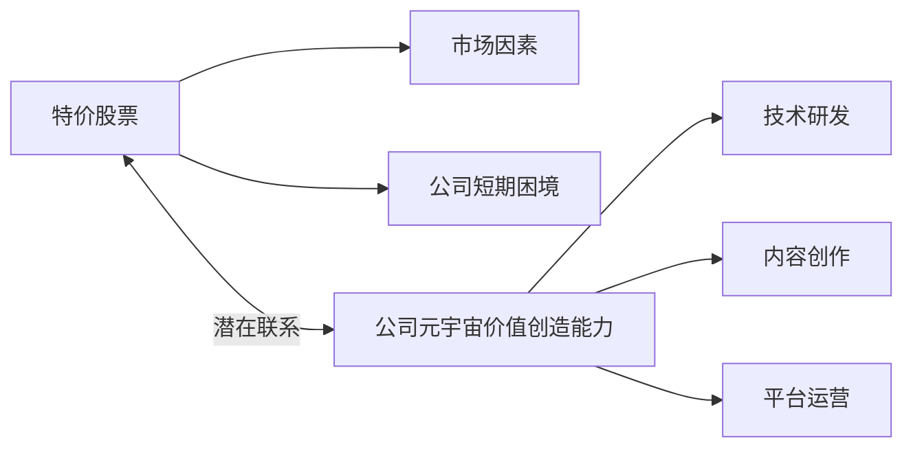

# 特价股票与公司元宇宙价值创造能力的潜在联系

> 关键词：特价股票、元宇宙、价值创造能力、潜在联系、投资分析

> 摘要：本文深入探讨了特价股票与公司元宇宙价值创造能力之间的潜在联系。首先介绍了研究的背景、目的、预期读者和文档结构等信息，接着阐述了特价股票和公司元宇宙价值创造能力的核心概念及两者的联系。详细讲解了相关的核心算法原理、数学模型和公式，并通过项目实战展示代码案例。分析了该联系在实际中的应用场景，推荐了学习资源、开发工具框架和相关论文著作。最后总结了未来发展趋势与挑战，解答常见问题并提供扩展阅读和参考资料，旨在为投资者和相关研究人员提供全面的理论和实践指导。

## 1. 背景介绍 
### 1.1 目的和范围
本研究的主要目的是探究特价股票与公司元宇宙价值创造能力之间可能存在的潜在联系。在当今金融市场和科技发展的背景下，元宇宙概念逐渐兴起，众多公司纷纷涉足这一领域。而特价股票往往因其价格较低受到投资者的关注。通过研究两者的联系，有助于投资者更全面地评估投资价值，判断具有元宇宙发展潜力的公司的股票是否被低估或高估。

研究范围涵盖了不同行业中参与元宇宙业务的公司，分析这些公司的特价股票特征以及它们在元宇宙领域的价值创造能力表现。同时，考虑宏观经济环境、行业竞争态势等因素对两者关系的影响。

### 1.2 预期读者
本文预期读者主要包括金融投资者，尤其是对科技股和新兴概念投资感兴趣的人群。他们希望通过了解特价股票与公司元宇宙价值创造能力的联系，做出更明智的投资决策。此外，也适合金融分析师、研究元宇宙经济的学者以及对科技金融交叉领域有兴趣的专业人士阅读，为他们的研究和分析提供参考。

### 1.3 文档结构概述
本文首先对核心概念进行介绍，明确特价股票和公司元宇宙价值创造能力的定义和内涵，并分析两者之间的联系。接着详细阐述核心算法原理和具体操作步骤，通过Python代码进行展示。然后介绍相关的数学模型和公式，并举例说明其应用。在项目实战部分，给出实际代码案例并进行详细解释。之后分析实际应用场景，推荐相关的学习资源、开发工具框架和论文著作。最后总结未来发展趋势与挑战，解答常见问题并提供扩展阅读和参考资料。

### 1.4 术语表
#### 1.4.1 核心术语定义
- **特价股票**：指价格相对较低，通常低于市场平均估值或公司内在价值的股票。其价格低可能是由于市场短期波动、行业负面消息、公司短期业绩不佳等因素导致。
- **元宇宙**：是一个融合了虚拟现实（VR）、增强现实（AR）、区块链、人工智能等多种技术的虚拟世界，用户可以在其中进行社交、娱乐、工作、消费等活动，具有经济系统和社交体系。
- **公司元宇宙价值创造能力**：指公司在元宇宙领域通过技术研发、内容创作、平台运营等方式，为自身和用户创造经济价值和社会价值的能力。

#### 1.4.2 相关概念解释
- **股票估值**：是对股票内在价值的评估，常用的方法有市盈率法、市净率法、现金流折现法等。通过这些方法可以判断股票价格是否合理，是否为特价股票。
- **元宇宙经济系统**：元宇宙中的经济系统包括虚拟货币、数字资产交易、虚拟土地买卖等，公司在这个经济系统中的参与程度和影响力是衡量其元宇宙价值创造能力的重要方面。

#### 1.4.3 缩略词列表
- **VR**：Virtual Reality，虚拟现实
- **AR**：Augmented Reality，增强现实

## 2. 核心概念与联系 

### 2.1 特价股票的概念原理
特价股票的出现往往是由于市场的非理性行为或公司的短期困境。从市场角度来看，投资者情绪的波动、宏观经济环境的变化等都可能导致股票价格偏离其内在价值。例如，当市场出现恐慌性抛售时，很多股票价格会大幅下跌，即使公司的基本面并没有发生实质性变化，也可能出现特价股票。

从公司角度来看，短期的业绩下滑、负面新闻等也会使股票价格受到影响。比如公司某一季度的财报显示利润下降，可能会引发投资者的担忧，导致股票价格下跌成为特价股票。

### 2.2 公司元宇宙价值创造能力的概念原理
公司的元宇宙价值创造能力主要体现在以下几个方面：
- **技术研发能力**：拥有先进的VR、AR、区块链等技术，能够开发出高质量的元宇宙应用和平台。例如，英伟达在图形处理技术方面的优势使其在元宇宙硬件支持领域具有较强的价值创造能力。
- **内容创作能力**：能够提供丰富多样的元宇宙内容，如虚拟游戏、虚拟社交场景等。像Roblox这样的平台，拥有大量用户创作的游戏内容，吸引了众多用户，具有较高的元宇宙价值创造能力。
- **平台运营能力**：有效地运营元宇宙平台，管理用户社区，促进虚拟经济的发展。例如，Decentraland通过建立虚拟土地交易市场和用户社交体系，实现了平台的持续发展。

### 2.3 两者的联系
特价股票与公司元宇宙价值创造能力之间可能存在以下潜在联系：
- **价值低估**：如果一家公司在元宇宙领域具有较强的价值创造能力，但由于市场对元宇宙概念的认知不足或公司短期业绩不佳等原因，其股票价格可能被低估成为特价股票。投资者如果能够发现这种潜在联系，就有可能获得投资机会。
- **发展潜力**：特价股票对应的公司可能正处于元宇宙业务的发展初期，虽然目前股票价格低，但随着公司在元宇宙领域的不断发展和价值创造能力的提升，股票价格有望上涨。

### 2.4 文本示意图
```plaintext
特价股票 <---- 市场因素、公司短期困境
              |
              | 潜在联系
              |
公司元宇宙价值创造能力 ----> 技术研发、内容创作、平台运营
```

### 2.5 Mermaid流程图


## 3. 核心算法原理 & 具体操作步骤 

### 3.1 核心算法原理
为了分析特价股票与公司元宇宙价值创造能力的联系，我们可以采用多因素分析算法。该算法综合考虑多个因素，包括股票的价格指标、公司的财务指标以及元宇宙相关的技术和业务指标。

具体来说，我们可以构建一个综合评分模型，将各个因素进行量化并赋予相应的权重，计算出每个公司的综合得分。得分较高且股票价格较低的公司可能存在特价股票与较强元宇宙价值创造能力的潜在联系。

### 3.2 Python源代码实现
```python
import pandas as pd

# 定义各因素的权重
weights = {
    'price_ratio': 0.3,  # 价格比率权重
    'financial_ratio': 0.3,  # 财务比率权重
    'metaverse_index': 0.4  # 元宇宙指数权重
}

def calculate_score(data):
    """
    计算综合得分
    :param data: 包含各因素数据的DataFrame
    :return: 综合得分
    """
    score = (data['price_ratio'] * weights['price_ratio'] +
             data['financial_ratio'] * weights['financial_ratio'] +
             data['metaverse_index'] * weights['metaverse_index'])
    return score

# 示例数据
data = {
    'company': ['Company A', 'Company B', 'Company C'],
    'price_ratio': [0.8, 0.6, 0.9],
    'financial_ratio': [0.7, 0.8, 0.6],
    'metaverse_index': [0.9, 0.7, 0.8]
}
df = pd.DataFrame(data)

# 计算综合得分
df['score'] = calculate_score(df)

# 筛选出综合得分高且价格比率低的公司
selected_companies = df[df['price_ratio'] < 0.8][df['score'] > 0.7]

print(selected_companies)
```

### 3.3 具体操作步骤
1. **数据收集**：收集股票的价格数据、公司的财务报表数据以及与元宇宙相关的技术研发投入、业务布局等数据。
2. **数据预处理**：对收集到的数据进行清洗、标准化等处理，确保数据的质量和可比性。
3. **因素量化**：将各个因素进行量化，例如将股票价格与内在价值的比率作为价格比率，将公司的净利润率、资产负债率等作为财务比率，将公司在元宇宙领域的专利数量、用户数量等作为元宇宙指数。
4. **权重确定**：根据各因素的重要性确定相应的权重。
5. **综合得分计算**：使用上述Python代码中的`calculate_score`函数计算每个公司的综合得分。
6. **筛选分析**：筛选出综合得分高且股票价格低的公司，进行进一步的分析和研究。

## 4. 数学模型和公式 & 详细讲解 & 举例说明 

### 4.1 数学模型
我们构建的综合评分模型可以用以下数学公式表示：

$$S = w_1P + w_2F + w_3M$$

其中，$S$ 表示综合得分，$P$ 表示价格比率，$F$ 表示财务比率，$M$ 表示元宇宙指数，$w_1$、$w_2$、$w_3$ 分别表示价格比率、财务比率和元宇宙指数的权重，且满足 $w_1 + w_2 + w_3 = 1$。

### 4.2 详细讲解
- **价格比率 $P$**：反映了股票价格与内在价值的关系。$P$ 值越低，说明股票价格相对越低，越有可能是特价股票。可以通过市盈率、市净率等指标来计算价格比率。
- **财务比率 $F$**：衡量公司的财务健康状况和盈利能力。常用的财务比率包括净利润率、资产负债率等。$F$ 值越高，说明公司的财务状况越好。
- **元宇宙指数 $M$**：评估公司在元宇宙领域的价值创造能力。可以通过公司在元宇宙技术研发投入、专利数量、用户数量、业务收入等方面的数据来构建元宇宙指数。$M$ 值越高，说明公司在元宇宙领域的价值创造能力越强。

### 4.3 举例说明
假设公司A的价格比率 $P = 0.8$，财务比率 $F = 0.7$，元宇宙指数 $M = 0.9$，权重 $w_1 = 0.3$，$w_2 = 0.3$，$w_3 = 0.4$。

则公司A的综合得分 $S$ 为：

$$S = 0.3\times0.8 + 0.3\times0.7 + 0.4\times0.9$$
$$S = 0.24 + 0.21 + 0.36$$
$$S = 0.81$$

通过计算综合得分，我们可以对不同公司进行比较和筛选，找出具有潜在投资价值的公司。

## 5. 项目实战：代码实际案例和详细解释说明 

### 5.1  开发环境搭建
- **Python环境**：建议使用Python 3.7及以上版本。可以通过Anaconda或Python官方网站下载安装。
- **相关库安装**：需要安装`pandas`库用于数据处理和分析。可以使用以下命令进行安装：
```sh
pip install pandas
```

### 5.2  源代码详细实现和代码解读
```python
import pandas as pd

# 定义各因素的权重
weights = {
    'price_ratio': 0.3,  # 价格比率权重
    'financial_ratio': 0.3,  # 财务比率权重
    'metaverse_index': 0.4  # 元宇宙指数权重
}

def calculate_score(data):
    """
    计算综合得分
    :param data: 包含各因素数据的DataFrame
    :return: 综合得分
    """
    score = (data['price_ratio'] * weights['price_ratio'] +
             data['financial_ratio'] * weights['financial_ratio'] +
             data['metaverse_index'] * weights['metaverse_index'])
    return score

# 示例数据
data = {
    'company': ['Company A', 'Company B', 'Company C'],
    'price_ratio': [0.8, 0.6, 0.9],
    'financial_ratio': [0.7, 0.8, 0.6],
    'metaverse_index': [0.9, 0.7, 0.8]
}
df = pd.DataFrame(data)

# 计算综合得分
df['score'] = calculate_score(df)

# 筛选出综合得分高且价格比率低的公司
selected_companies = df[df['price_ratio'] < 0.8][df['score'] > 0.7]

print(selected_companies)
```

#### 代码解读
1. **导入库**：导入`pandas`库，用于数据处理和分析。
2. **定义权重**：定义了价格比率、财务比率和元宇宙指数的权重，存储在字典`weights`中。
3. **定义计算综合得分的函数**：`calculate_score`函数接受一个包含各因素数据的`DataFrame`作为输入，根据权重计算综合得分。
4. **创建示例数据**：使用字典`data`创建示例数据，并将其转换为`DataFrame`对象`df`。
5. **计算综合得分**：调用`calculate_score`函数计算每个公司的综合得分，并将结果存储在`df`的`score`列中。
6. **筛选公司**：筛选出价格比率小于0.8且综合得分大于0.7的公司，存储在`selected_companies`中。
7. **输出结果**：打印筛选出的公司信息。

### 5.3  代码解读与分析
通过上述代码，我们可以实现对特价股票与公司元宇宙价值创造能力的初步分析。代码的核心在于构建综合评分模型，综合考虑多个因素来评估公司的投资价值。

在实际应用中，我们可以根据具体情况调整各因素的权重和筛选条件，以适应不同的市场环境和投资目标。同时，需要注意数据的准确性和可靠性，确保分析结果的有效性。

## 6. 实际应用场景 
### 6.1 投资决策
投资者可以利用本文介绍的方法，分析特价股票与公司元宇宙价值创造能力的联系，寻找具有潜在投资价值的股票。例如，通过筛选综合得分高且价格比率低的公司，投资者可以发现那些被市场低估但在元宇宙领域具有发展潜力的公司，从而做出更明智的投资决策。

### 6.2 公司战略规划
公司管理者可以通过评估自身在元宇宙领域的价值创造能力，结合股票价格情况，制定合理的战略规划。如果公司的股票价格被低估，但元宇宙价值创造能力较强，公司可以加大在元宇宙领域的投入，提升市场对公司的认知度，从而提高股票价格。

### 6.3 金融研究
金融研究人员可以深入研究特价股票与公司元宇宙价值创造能力的关系，探索新的投资理论和方法。通过分析大量的案例和数据，揭示两者之间的内在规律，为金融市场的发展提供理论支持。

## 7. 工具和资源推荐
### 7.1 学习资源推荐
#### 7.1.1 书籍推荐
- 《元宇宙通证》：全面介绍了元宇宙的概念、经济系统和通证机制，有助于读者深入了解元宇宙的经济层面。
- 《金融市场学》：提供了金融市场的基本理论和分析方法，对于理解股票价格的形成和波动具有重要意义。

#### 7.1.2 在线课程
- Coursera上的“Financial Markets”课程：由耶鲁大学教授罗伯特·席勒（Robert Shiller）授课，讲解了金融市场的基本原理和投资策略。
- edX上的“Introduction to Blockchain and Cryptocurrencies”课程：介绍了区块链和加密货币的基本概念和技术，对于理解元宇宙的底层技术有帮助。

#### 7.1.3 技术博客和网站
- CoinDesk：提供了关于区块链、加密货币和元宇宙的最新新闻和分析。
- Seeking Alpha：是一个金融分析和投资建议的平台，有很多关于股票投资和公司分析的文章。

### 7.2 开发工具框架推荐
#### 7.2.1 IDE和编辑器
- PyCharm：是一款专业的Python集成开发环境，提供了丰富的代码编辑、调试和分析功能。
- Jupyter Notebook：适合进行数据分析和可视化，支持Python、R等多种编程语言。

#### 7.2.2 调试和性能分析工具
- PDB：Python自带的调试工具，可以帮助开发者定位和解决代码中的问题。
- cProfile：Python的性能分析工具，可以分析代码的运行时间和资源消耗情况。

#### 7.2.3 相关框架和库
- Pandas：用于数据处理和分析，提供了高效的数据结构和数据操作方法。
- NumPy：是Python的数值计算库，提供了多维数组和矩阵运算的功能。

### 7.3 相关论文著作推荐
#### 7.3.1 经典论文
- “The Efficient Market Hypothesis and Its Critics”：探讨了有效市场假说及其批评，对于理解股票价格的合理性具有重要意义。
- “Blockchain Technology and Its Applications in the Financial Industry”：介绍了区块链技术在金融行业的应用，为元宇宙的金融体系构建提供了理论基础。

#### 7.3.2 最新研究成果
- 关注顶级学术期刊如《Journal of Financial Economics》、《Management Science》等上关于元宇宙、金融科技和投资分析的最新研究论文。

#### 7.3.3 应用案例分析
- 研究一些知名公司在元宇宙领域的发展案例，如英伟达、Roblox等，分析它们的商业模式、技术创新和市场表现，从中获取经验和启示。

## 8. 总结：未来发展趋势与挑战
### 8.1 未来发展趋势
- **元宇宙市场的持续增长**：随着技术的不断进步和用户需求的增加，元宇宙市场将持续扩大。更多的公司将进入元宇宙领域，推动元宇宙经济的发展，从而为具有元宇宙价值创造能力的公司带来更多的发展机会。
- **特价股票与元宇宙价值的进一步关联**：市场对元宇宙的认知将逐渐加深，投资者将更加关注公司在元宇宙领域的价值创造能力。特价股票与公司元宇宙价值创造能力之间的联系将更加明显，投资者可以通过深入分析两者的关系获得更高的投资回报。
- **技术创新推动价值提升**：VR、AR、区块链等技术的不断创新将提升公司在元宇宙领域的价值创造能力。例如，更先进的VR设备将提供更沉浸式的元宇宙体验，区块链技术将保障元宇宙经济系统的安全和公平。

### 8.2 挑战
- **技术不确定性**：元宇宙相关技术仍处于发展阶段，存在技术瓶颈和不确定性。例如，VR设备的续航能力、分辨率等问题尚未得到完全解决，区块链技术的扩展性和性能也有待提高。这些技术问题可能会影响公司在元宇宙领域的价值创造能力。
- **市场竞争激烈**：随着元宇宙市场的发展，越来越多的公司将进入该领域，市场竞争将日益激烈。公司需要不断提升自身的技术实力、内容创作能力和平台运营能力，才能在竞争中脱颖而出。否则，即使公司拥有特价股票，也可能无法实现价值提升。
- **监管政策风险**：元宇宙作为一个新兴领域，监管政策尚不完善。政府可能会出台相关政策对元宇宙市场进行规范和监管，这可能会对公司的发展产生影响。例如，对虚拟货币交易的监管可能会影响元宇宙经济系统的运行。

## 9. 附录：常见问题与解答
### 9.1 如何确定各因素的权重？
确定各因素的权重可以采用主观赋权法和客观赋权法。主观赋权法是根据专家的经验和判断来确定权重，例如德尔菲法。客观赋权法是根据数据的特征和关系来确定权重，例如主成分分析法、熵权法等。在实际应用中，可以结合两种方法，综合考虑专家意见和数据特征来确定合理的权重。

### 9.2 数据的准确性和可靠性如何保证？
为了保证数据的准确性和可靠性，需要从多个渠道收集数据，并进行数据验证和清洗。可以参考权威的金融数据库、公司公告、行业报告等数据源。同时，对收集到的数据进行异常值处理、缺失值填充等操作，确保数据的质量。

### 9.3 该方法是否适用于所有行业的公司？
该方法主要适用于参与元宇宙业务的公司。对于那些与元宇宙无关的传统行业公司，元宇宙指数可能无法准确反映其价值创造能力，因此该方法的适用性有限。在应用该方法时，需要根据公司的实际情况进行调整和改进。

## 10. 扩展阅读 & 参考资料
### 扩展阅读
- 《元宇宙改变一切》：深入探讨了元宇宙对社会、经济和生活的影响。
- 《智能时代》：介绍了人工智能、大数据等技术的发展趋势和应用，与元宇宙技术密切相关。

### 参考资料
- 各公司的财务报表和公告
- 金融数据库如Wind、Bloomberg等提供的数据
- 相关行业报告和研究机构发布的研究成果

作者：AI天才研究院/AI Genius Institute & 禅与计算机程序设计艺术 /Zen And The Art of Computer Programming