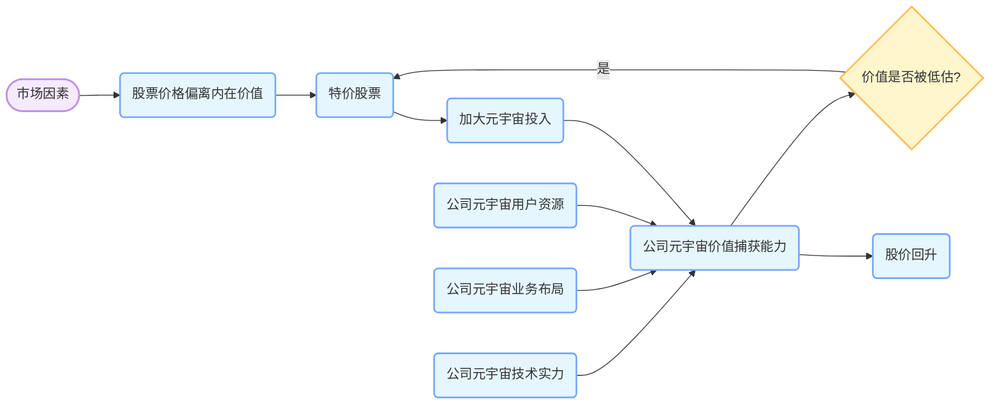

# 特价股票与公司元宇宙价值捕获能力的潜在联系

> 关键词：特价股票、公司元宇宙、价值捕获能力、潜在联系、股票估值、元宇宙经济

> 摘要：本文旨在深入探讨特价股票与公司元宇宙价值捕获能力之间的潜在联系。首先介绍相关背景知识，包括目的、预期读者等内容。接着阐述核心概念，剖析特价股票和公司元宇宙价值捕获能力的原理与架构。通过核心算法原理和数学模型，从定量角度分析两者联系。结合项目实战案例，详细解读代码实现和应用过程。探讨实际应用场景，为投资者和企业提供参考。推荐相关工具和资源，助力进一步研究。最后总结未来发展趋势与挑战，解答常见问题并提供扩展阅读资料。通过全面的研究，帮助读者更好地理解特价股票与公司元宇宙价值捕获能力之间的复杂关系，为投资决策和企业战略规划提供有价值的见解。

## 1. 背景介绍 
### 1.1 目的和范围
随着元宇宙概念的兴起，众多公司纷纷布局相关领域，试图在这个新兴的数字世界中捕获价值。与此同时，股票市场中也出现了一些被认为是“特价”的股票。本研究的目的在于探究这些特价股票与公司元宇宙价值捕获能力之间是否存在潜在联系，这种联系的性质和强度如何，以及如何利用这种联系为投资决策和企业战略规划提供参考。研究范围涵盖了全球范围内涉足元宇宙业务的上市公司，通过对其股票价格、财务数据、业务布局等多方面的分析，来揭示两者之间的关系。

### 1.2 预期读者
本文的预期读者包括股票投资者、金融分析师、企业战略规划者、元宇宙领域的研究人员以及对新兴技术和金融市场交叉领域感兴趣的人士。投资者可以从本文中获取关于特价股票投资的新视角，金融分析师可以借鉴相关分析方法和结论，企业战略规划者可以了解元宇宙价值捕获能力对公司股价的影响，研究人员可以在此基础上开展更深入的学术研究。

### 1.3 文档结构概述
本文共分为十个部分。第一部分为背景介绍，阐述研究的目的、预期读者、文档结构概述和术语表。第二部分介绍核心概念与联系，包括特价股票和公司元宇宙价值捕获能力的原理和架构，并通过文本示意图和 Mermaid 流程图进行展示。第三部分讲解核心算法原理和具体操作步骤，使用 Python 源代码详细阐述分析过程。第四部分介绍数学模型和公式，对两者联系进行定量分析，并举例说明。第五部分通过项目实战，展示代码实际案例并进行详细解释说明。第六部分探讨实际应用场景。第七部分推荐相关工具和资源，包括学习资源、开发工具框架和相关论文著作。第八部分总结未来发展趋势与挑战。第九部分为附录，解答常见问题。第十部分提供扩展阅读和参考资料。

### 1.4 术语表
#### 1.4.1 核心术语定义
- **特价股票**：指市场价格低于其内在价值的股票，通常是由于市场短期的错误定价、行业周期波动或公司短期负面事件等原因导致。
- **公司元宇宙价值捕获能力**：指公司在元宇宙领域中，通过技术创新、业务模式创新、用户资源积累等方式，获取经济价值和竞争优势的能力。

#### 1.4.2 相关概念解释
- **元宇宙**：是一个虚拟的、与现实世界相互映射的数字空间，融合了虚拟现实、增强现实、区块链、人工智能等多种技术，用户可以在其中进行社交、娱乐、工作、学习等各种活动。
- **股票内在价值**：是指股票未来现金流的现值，通过对公司的财务状况、行业前景、竞争优势等多方面因素进行分析和评估得出。

#### 1.4.3 缩略词列表
- **AR**：增强现实（Augmented Reality）
- **VR**：虚拟现实（Virtual Reality）
- **AI**：人工智能（Artificial Intelligence）
- **NFT**：非同质化代币（Non - Fungible Token）

## 2. 核心概念与联系 

### 2.1 特价股票原理
特价股票的出现往往是由于市场的无效性。市场参与者的情绪、信息不对称、短期的宏观经济波动等因素都可能导致股票价格偏离其内在价值。例如，当市场对某个行业过度悲观时，该行业内的优质公司股票可能会被低估，成为特价股票。从财务分析的角度来看，特价股票通常具有较低的市盈率、市净率等估值指标，但其公司的基本面仍然良好，具有较强的盈利能力和发展潜力。

### 2.2 公司元宇宙价值捕获能力原理
公司元宇宙价值捕获能力主要基于其在元宇宙领域的技术实力、业务布局和用户资源。技术实力是基础，包括虚拟现实、增强现实、区块链、人工智能等关键技术的研发和应用能力。业务布局方面，公司需要明确在元宇宙中的定位和商业模式，例如是提供元宇宙平台、开发元宇宙内容还是提供相关的技术服务。用户资源是公司在元宇宙中实现价值的重要保障，拥有大量活跃用户的公司更容易在元宇宙经济中获得收益。

### 2.3 两者联系架构
特价股票与公司元宇宙价值捕获能力之间可能存在以下联系：一方面，公司在元宇宙领域的价值捕获能力被市场低估，导致其股票价格下跌成为特价股票。例如，一些公司虽然在元宇宙技术研发和业务布局方面投入了大量资源，但由于市场对元宇宙概念的理解不够深入，或者公司的业务成果尚未完全显现，其股票价格没有得到合理反映。另一方面，特价股票的公司可能会加大在元宇宙领域的投入，以提升其价值捕获能力，从而实现股价的回升。

### 2.4 文本示意图
特价股票与公司元宇宙价值捕获能力的联系可以用以下文本示意图表示：

市场因素（情绪、信息不对称等） -> 股票价格偏离内在价值 -> 特价股票
公司元宇宙技术实力 + 业务布局 + 用户资源 -> 公司元宇宙价值捕获能力
公司元宇宙价值捕获能力被低估 -> 特价股票
特价股票公司 -> 加大元宇宙投入 -> 提升价值捕获能力 -> 股价回升

### 2.5 Mermaid 流程图


## 3. 核心算法原理 & 具体操作步骤 

### 3.1 核心算法原理
我们可以通过构建一个综合评估模型来分析特价股票与公司元宇宙价值捕获能力之间的联系。该模型主要包括两个部分：股票估值模型和公司元宇宙价值评估模型。

#### 3.1.1 股票估值模型
我们使用现金流折现模型（DCF）来评估股票的内在价值。该模型的基本思想是将股票未来的现金流折现到当前时刻，以确定其内在价值。具体公式为：

$$V = \sum_{t=1}^{n} \frac{CF_t}{(1 + r)^t} + \frac{TV}{(1 + r)^n}$$

其中，$V$ 表示股票的内在价值，$CF_t$ 表示第 $t$ 期的现金流，$r$ 表示折现率，$TV$ 表示终值，$n$ 表示预测期数。

#### 3.1.2 公司元宇宙价值评估模型
公司元宇宙价值评估模型综合考虑公司的技术实力、业务布局和用户资源等因素。我们可以采用层次分析法（AHP）来确定各因素的权重，然后通过打分法对各因素进行量化评估。具体步骤如下：
1. 构建层次结构模型，将公司元宇宙价值作为目标层，技术实力、业务布局和用户资源作为准则层，各因素的具体指标作为方案层。
2. 构造判断矩阵，通过专家打分法确定各因素之间的相对重要性。
3. 计算权重向量，通过求解判断矩阵的特征值和特征向量，得到各因素的权重。
4. 对各因素进行量化评估，根据公司的实际情况对各因素的具体指标进行打分。
5. 计算公司元宇宙价值得分，将各因素的得分乘以其权重，然后相加得到公司元宇宙价值得分。

### 3.2 具体操作步骤

#### 3.2.1 数据收集
收集相关公司的财务数据，包括现金流、净利润、资产负债表等，用于股票估值模型。同时，收集公司在元宇宙领域的技术研发投入、业务布局情况、用户数量等数据，用于公司元宇宙价值评估模型。

#### 3.2.2 股票估值
使用 Python 实现现金流折现模型，计算股票的内在价值。以下是一个简单的 Python 代码示例：

```python
import numpy as np

def dcf_valuation(cash_flows, discount_rate, terminal_value, num_years):
    present_values = []
    for t in range(1, num_years + 1):
        present_value = cash_flows[t - 1] / (1 + discount_rate) ** t
        present_values.append(present_value)
    terminal_value_pv = terminal_value / (1 + discount_rate) ** num_years
    total_value = np.sum(present_values) + terminal_value_pv
    return total_value

# 示例数据
cash_flows = [100, 120, 150, 180, 200]
discount_rate = 0.1
terminal_value = 1000
num_years = 5

intrinsic_value = dcf_valuation(cash_flows, discount_rate, terminal_value, num_years)
print(f"股票内在价值: {intrinsic_value}")
```

#### 3.2.3 公司元宇宙价值评估
使用 Python 实现层次分析法和打分法，计算公司元宇宙价值得分。以下是一个简单的 Python 代码示例：

```python
import numpy as np

# 构造判断矩阵
A = np.array([[1, 3, 5],
              [1/3, 1, 3],
              [1/5, 1/3, 1]])

# 计算特征值和特征向量
eigenvalues, eigenvectors = np.linalg.eig(A)
max_eigenvalue_index = np.argmax(eigenvalues)
weights = eigenvectors[:, max_eigenvalue_index] / np.sum(eigenvectors[:, max_eigenvalue_index])

# 各因素得分
scores = np.array([80, 70, 90])

# 计算公司元宇宙价值得分
metaverse_value_score = np.dot(weights, scores)
print(f"公司元宇宙价值得分: {metaverse_value_score}")
```

#### 3.2.4 分析联系
将股票的内在价值与市场价格进行比较，确定是否为特价股票。同时，将公司元宇宙价值得分与股票价格进行相关性分析，以确定两者之间的潜在联系。

## 4. 数学模型和公式 & 详细讲解 & 举例说明 

### 4.1 股票估值模型
#### 4.1.1 公式
$$V = \sum_{t=1}^{n} \frac{CF_t}{(1 + r)^t} + \frac{TV}{(1 + r)^n}$$

#### 4.1.2 详细讲解
- $V$：股票的内在价值，即股票未来现金流的现值总和。
- $CF_t$：第 $t$ 期的现金流，可以是公司的净利润、自由现金流等。现金流的预测需要综合考虑公司的历史数据、行业发展趋势、宏观经济环境等因素。
- $r$：折现率，反映了投资者对投资风险的预期。折现率的确定通常基于无风险利率和风险溢价，无风险利率可以选择国债收益率，风险溢价则需要根据公司的行业特点、财务状况、市场竞争等因素进行调整。
- $TV$：终值，是指预测期结束后公司的价值。终值的计算方法有多种，常见的是使用永续增长模型，即 $TV=\frac{CF_{n+1}}{r - g}$，其中 $CF_{n+1}$ 是预测期结束后下一期的现金流，$g$ 是永续增长率。
- $n$：预测期数，通常根据公司的业务特点和行业发展趋势来确定，一般为 5 - 10 年。

#### 4.1.3 举例说明
假设某公司未来 5 年的现金流分别为 100 万元、120 万元、150 万元、180 万元、200 万元，折现率为 10%，终值为 1000 万元。则该公司股票的内在价值为：

$$V = \frac{100}{(1 + 0.1)^1} + \frac{120}{(1 + 0.1)^2} + \frac{150}{(1 + 0.1)^3} + \frac{180}{(1 + 0.1)^4} + \frac{200}{(1 + 0.1)^5} + \frac{1000}{(1 + 0.1)^5}$$

```python
import numpy as np

cash_flows = [100, 120, 150, 180, 200]
discount_rate = 0.1
terminal_value = 1000
num_years = 5

present_values = []
for t in range(1, num_years + 1):
    present_value = cash_flows[t - 1] / (1 + discount_rate) ** t
    present_values.append(present_value)
terminal_value_pv = terminal_value / (1 + discount_rate) ** num_years
total_value = np.sum(present_values) + terminal_value_pv

print(f"股票内在价值: {total_value}")
```

### 4.2 公司元宇宙价值评估模型
#### 4.2.1 层次分析法公式
层次分析法的核心是构造判断矩阵 $A=(a_{ij})_{n\times n}$，其中 $a_{ij}$ 表示因素 $i$ 相对于因素 $j$ 的重要性程度。判断矩阵需要满足 $a_{ij}>0$，$a_{ji}=\frac{1}{a_{ij}}$，$a_{ii}=1$。

通过求解判断矩阵的特征方程 $|A - \lambda I| = 0$，得到最大特征值 $\lambda_{max}$ 和对应的特征向量 $W$，将特征向量归一化后得到各因素的权重向量。

一致性指标 $CI=\frac{\lambda_{max}-n}{n - 1}$，随机一致性指标 $RI$ 可以通过查表得到，一致性比率 $CR=\frac{CI}{RI}$。当 $CR<0.1$ 时，认为判断矩阵具有满意的一致性。

#### 4.2.2 详细讲解
- 构造判断矩阵：通过专家打分法确定各因素之间的相对重要性，例如，当因素 $i$ 比因素 $j$ 稍微重要时，$a_{ij}=3$；当因素 $i$ 比因素 $j$ 强烈重要时，$a_{ij}=7$ 等。
- 求解特征值和特征向量：使用线性代数的方法求解判断矩阵的特征值和特征向量，得到各因素的权重。
- 一致性检验：为了保证判断矩阵的合理性和可靠性，需要进行一致性检验。当一致性比率 $CR<0.1$ 时，认为判断矩阵的一致性是可以接受的，否则需要重新调整判断矩阵。

#### 4.2.3 举例说明
假设我们要评估公司元宇宙价值，准则层包括技术实力、业务布局和用户资源三个因素。通过专家打分法构造判断矩阵如下：

$$A = \begin{bmatrix}
1 & 3 & 5 \\
\frac{1}{3} & 1 & 3 \\
\frac{1}{5} & \frac{1}{3} & 1
\end{bmatrix}$$

```python
import numpy as np

A = np.array([[1, 3, 5],
              [1/3, 1, 3],
              [1/5, 1/3, 1]])

# 计算特征值和特征向量
eigenvalues, eigenvectors = np.linalg.eig(A)
max_eigenvalue_index = np.argmax(eigenvalues)
weights = eigenvectors[:, max_eigenvalue_index] / np.sum(eigenvectors[:, max_eigenvalue_index])

# 一致性检验
n = A.shape[0]
lambda_max = eigenvalues[max_eigenvalue_index].real
CI = (lambda_max - n) / (n - 1)
RI = 0.58  # 当 n = 3 时，RI 的值
CR = CI / RI

if CR < 0.1:
    print("判断矩阵具有满意的一致性")
else:
    print("判断矩阵一致性不满足要求，需要重新调整")

print(f"各因素权重: {weights}")
```

假设各因素的得分分别为技术实力 80 分，业务布局 70 分，用户资源 90 分，则公司元宇宙价值得分：

```python
scores = np.array([80, 70, 90])
metaverse_value_score = np.dot(weights, scores)
print(f"公司元宇宙价值得分: {metaverse_value_score}")
```

## 5. 项目实战：代码实际案例和详细解释说明 

### 5.1  开发环境搭建
#### 5.1.1 安装 Python
首先，需要安装 Python 环境。可以从 Python 官方网站（https://www.python.org/downloads/） 下载适合自己操作系统的 Python 安装包，按照安装向导进行安装。

#### 5.1.2 安装必要的库
在命令行中使用以下命令安装所需的 Python 库：
```sh
pip install numpy pandas matplotlib
```
- `numpy`：用于数值计算和矩阵运算。
- `pandas`：用于数据处理和分析。
- `matplotlib`：用于数据可视化。

### 5.2  源代码详细实现和代码解读
#### 5.2.1 数据收集与预处理
```python
import pandas as pd

# 模拟收集公司财务数据和元宇宙相关数据
financial_data = pd.DataFrame({
    'Year': [2018, 2019, 2020, 2021, 2022],
    'CashFlow': [100, 120, 150, 180, 200]
})

metaverse_data = pd.DataFrame({
    'Factor': ['Technology', 'BusinessLayout', 'UserResource'],
    'Score': [80, 70, 90]
})

# 数据预处理
financial_data['DiscountFactor'] = (1 + 0.1) ** (financial_data['Year'] - 2018)
financial_data['PresentValue'] = financial_data['CashFlow'] / financial_data['DiscountFactor']

# 打印预处理后的数据
print("财务数据预处理结果:")
print(financial_data)
print("\n元宇宙数据:")
print(metaverse_data)
```
代码解读：
- 首先，使用 `pandas` 库创建了两个数据框，分别存储公司的财务数据和元宇宙相关数据。
- 然后，对财务数据进行预处理，计算了每个年份的折现因子和现金流的现值。
- 最后，打印出预处理后的数据，方便查看。

#### 5.2.2 股票估值
```python
import numpy as np

# 假设终值为 1000
terminal_value = 1000
discount_rate = 0.1
num_years = financial_data.shape[0]

terminal_value_pv = terminal_value / (1 + discount_rate) ** num_years
total_value = financial_data['PresentValue'].sum() + terminal_value_pv

print(f"\n股票内在价值: {total_value}")
```
代码解读：
- 定义了终值、折现率和预测期数。
- 计算了终值的现值。
- 将各年现金流的现值和终值的现值相加，得到股票的内在价值。

#### 5.2.3 公司元宇宙价值评估
```python
import numpy as np

# 构造判断矩阵
A = np.array([[1, 3, 5],
              [1/3, 1, 3],
              [1/5, 1/3, 1]])

# 计算特征值和特征向量
eigenvalues, eigenvectors = np.linalg.eig(A)
max_eigenvalue_index = np.argmax(eigenvalues)
weights = eigenvectors[:, max_eigenvalue_index] / np.sum(eigenvectors[:, max_eigenvalue_index])

# 一致性检验
n = A.shape[0]
lambda_max = eigenvalues[max_eigenvalue_index].real
CI = (lambda_max - n) / (n - 1)
RI = 0.58  # 当 n = 3 时，RI 的值
CR = CI / RI

if CR < 0.1:
    print("判断矩阵具有满意的一致性")
else:
    print("判断矩阵一致性不满足要求，需要重新调整")

# 计算公司元宇宙价值得分
scores = metaverse_data['Score'].values
metaverse_value_score = np.dot(weights, scores)

print(f"\n公司元宇宙价值得分: {metaverse_value_score}")
```
代码解读：
- 构造了判断矩阵，用于层次分析法。
- 计算了判断矩阵的特征值和特征向量，得到各因素的权重。
- 进行了一致性检验，确保判断矩阵的合理性。
- 将各因素的得分与权重相乘，得到公司元宇宙价值得分。

### 5.3  代码解读与分析
#### 5.3.1 数据收集与预处理
数据收集是整个项目的基础，准确、全面的数据对于后续的分析和评估至关重要。在这个案例中，我们模拟了公司的财务数据和元宇宙相关数据，实际应用中需要从可靠的数据源获取真实数据。数据预处理的目的是将原始数据转换为适合分析的格式，例如计算折现因子和现值等。

#### 5.3.2 股票估值
股票估值模型基于现金流折现的原理，通过预测公司未来的现金流并将其折现到当前时刻，得到股票的内在价值。在实际应用中，现金流的预测和折现率的确定是关键环节，需要综合考虑多种因素。

#### 5.3.3 公司元宇宙价值评估
公司元宇宙价值评估采用层次分析法，通过构造判断矩阵和计算权重，综合考虑了技术实力、业务布局和用户资源等因素。一致性检验是确保判断矩阵合理性的重要步骤，如果一致性不满足要求，需要重新调整判断矩阵。

## 6. 实际应用场景 
### 6.1 投资决策
对于股票投资者来说，了解特价股票与公司元宇宙价值捕获能力之间的潜在联系可以帮助他们发现被低估的投资机会。如果一家公司在元宇宙领域具有较强的价值捕获能力，但由于市场短期的错误定价导致其股票价格成为特价股票，投资者可以在适当的时候买入该股票，等待公司在元宇宙领域的价值得到市场认可，从而实现股价的回升。

### 6.2 企业战略规划
对于企业来说，明确自身在元宇宙领域的价值捕获能力以及与股票价格的关系，可以帮助企业制定合理的战略规划。如果企业的股票被市场低估，企业可以加大在元宇宙领域的投入，提升自身的价值捕获能力，从而吸引投资者，提高股价。同时，企业也可以根据市场对元宇宙概念的反应，调整自身的业务布局和发展方向。

### 6.3 金融分析
金融分析师可以利用相关的分析方法和模型，对涉足元宇宙业务的上市公司进行评估和分析。通过比较不同公司的元宇宙价值捕获能力和股票估值，为投资者提供专业的投资建议。同时，金融分析师也可以关注市场对元宇宙概念的情绪变化，及时发现市场的投资机会和风险。

## 7. 工具和资源推荐
### 7.1 学习资源推荐
#### 7.1.1 书籍推荐
- 《金融学》：全面介绍了金融市场的基本原理和金融工具的定价方法，对于理解股票估值和投资决策有很大帮助。
- 《人工智能：现代方法》：详细介绍了人工智能的基本概念、算法和应用，对于了解元宇宙领域的相关技术有重要参考价值。
- 《区块链技术原理与应用》：深入讲解了区块链的技术原理和应用场景，区块链是元宇宙的重要支撑技术之一。

#### 7.1.2 在线课程
- Coursera 上的“Financial Markets”课程：由耶鲁大学教授 Robert Shiller 讲授，系统介绍了金融市场的理论和实践。
- edX 上的“Artificial Intelligence”课程：由麻省理工学院等知名高校的教授授课，涵盖了人工智能的各个方面。
- Udemy 上的“Blockchain A-Z™: Learn How To Build Your First Blockchain”课程：通过实践项目帮助学习者掌握区块链的开发和应用。

#### 7.1.3 技术博客和网站
- Medium：有许多关于金融、科技和元宇宙的技术博客文章，作者来自不同的领域和背景，可以提供多元化的观点和见解。
- CoinDesk：专注于区块链和加密货币领域的新闻和分析，对于了解元宇宙与区块链的结合有很大帮助。
- TechCrunch：提供最新的科技行业动态和创业公司的报道，有助于了解元宇宙领域的创新和发展趋势。

### 7.2 开发工具框架推荐
#### 7.2.1 IDE和编辑器
- PyCharm：是一款专门为 Python 开发设计的集成开发环境，具有强大的代码编辑、调试和分析功能。
- Visual Studio Code：是一款轻量级的代码编辑器，支持多种编程语言和插件扩展，适合快速开发和调试。

#### 7.2.2 调试和性能分析工具
- Py-Spy：是一个用于 Python 代码性能分析的工具，可以帮助开发者找出代码中的性能瓶颈。
- pdb：是 Python 内置的调试器，可以在代码中设置断点，逐步执行代码，帮助开发者调试程序。

#### 7.2.3 相关框架和库
- NumPy：用于数值计算和矩阵运算，是 Python 中科学计算的基础库。
- Pandas：用于数据处理和分析，提供了高效的数据结构和数据分析工具。
- Matplotlib：用于数据可视化，可以绘制各种类型的图表和图形。

### 7.3 相关论文著作推荐
#### 7.3.1 经典论文
- “The Capital Asset Pricing Model: Theory and Evidence”：该论文对资本资产定价模型进行了深入的理论分析和实证研究，是金融领域的经典文献之一。
- “A Mathematical Theory of Communication”：奠定了信息论的基础，对于理解信息在元宇宙中的传播和处理有重要意义。

#### 7.3.2 最新研究成果
- 关注顶级学术期刊如《Journal of Financial Economics》《Artificial Intelligence》《IEEE Transactions on Virtual Reality and 3D User Interfaces》等，这些期刊发表了关于金融、人工智能和元宇宙的最新研究成果。

#### 7.3.3 应用案例分析
- 一些知名咨询公司如麦肯锡、波士顿咨询集团等发布的关于元宇宙的研究报告和应用案例分析，可以帮助读者了解元宇宙在不同行业的应用实践和发展趋势。

## 8. 总结：未来发展趋势与挑战
### 8.1 未来发展趋势
#### 8.1.1 元宇宙市场规模扩大
随着技术的不断进步和用户需求的增加，元宇宙市场规模有望持续扩大。越来越多的公司将进入元宇宙领域，推动元宇宙经济的发展。这将为具有元宇宙价值捕获能力的公司带来更多的发展机会，也可能导致股票市场对相关公司的关注度进一步提高。

#### 8.1.2 技术创新推动价值提升
虚拟现实、增强现实、区块链、人工智能等技术的不断创新将为元宇宙的发展提供强大的动力。公司通过技术创新可以提升自身在元宇宙领域的价值捕获能力，从而提高公司的竞争力和股票价值。例如，更先进的虚拟现实技术可以提供更沉浸式的用户体验，吸引更多用户进入元宇宙。

#### 8.1.3 监管政策逐渐完善
随着元宇宙市场的发展，监管政策也将逐渐完善。合理的监管政策将有助于规范市场秩序，保护投资者的利益，促进元宇宙市场的健康发展。这将对特价股票与公司元宇宙价值捕获能力之间的关系产生影响，投资者需要关注监管政策的变化。

### 8.2 挑战
#### 8.2.1 技术不确定性
元宇宙涉及多种前沿技术，这些技术的发展和应用存在一定的不确定性。例如，虚拟现实和增强现实技术的普及程度、区块链技术的性能和安全性等问题都可能影响公司在元宇宙领域的价值捕获能力。这增加了投资者评估公司元宇宙价值的难度。

#### 8.2.2 市场竞争激烈
随着元宇宙市场的发展，竞争将日益激烈。众多公司纷纷布局元宇宙领域，市场份额的争夺将异常激烈。一些公司可能由于竞争压力无法实现预期的价值捕获能力，导致其股票价格下跌。投资者需要准确判断公司的竞争优势和发展潜力。

#### 8.2.3 估值困难
由于元宇宙是一个新兴领域，目前还缺乏统一的估值标准和方法。公司在元宇宙领域的价值捕获能力难以准确量化，这给股票估值带来了困难。投资者需要综合考虑多种因素，采用多种估值方法，才能更准确地评估特价股票与公司元宇宙价值捕获能力之间的关系。

## 9. 附录：常见问题与解答
### 9.1 什么是特价股票？
特价股票是指市场价格低于其内在价值的股票。通常是由于市场短期的错误定价、行业周期波动或公司短期负面事件等原因导致。

### 9.2 如何评估公司元宇宙价值捕获能力？
可以采用层次分析法综合考虑公司的技术实力、业务布局和用户资源等因素。通过构造判断矩阵确定各因素的权重，然后对各因素进行量化评估，最后计算公司元宇宙价值得分。

### 9.3 股票估值模型有哪些局限性？
股票估值模型的局限性主要包括现金流预测的不确定性、折现率的主观性、终值计算的困难等。这些因素都可能导致估值结果与实际情况存在偏差。

### 9.4 元宇宙领域的投资风险有哪些？
元宇宙领域的投资风险包括技术不确定性、市场竞争激烈、监管政策变化等。投资者需要充分了解这些风险，做好风险防范措施。

## 10. 扩展阅读 & 参考资料
### 10.1 扩展阅读
- 《元宇宙通证》：深入探讨了元宇宙经济体系和通证的作用。
- 《未来呼啸而来》：介绍了多种前沿技术的发展趋势及其对未来社会的影响。

### 10.2 参考资料
- 公司的财务报表和年报，可从证券交易所网站或公司官方网站获取。
- 行业研究报告，可从咨询公司、行业协会等机构获取。
- 相关学术论文，可从学术数据库如知网、万方、Web of Science 等获取。

作者：AI天才研究院/AI Genius Institute & 禅与计算机程序设计艺术 /Zen And The Art of Computer Programming