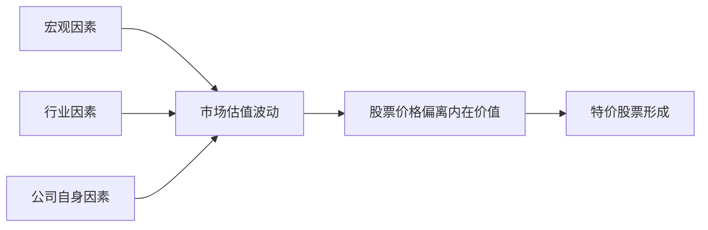
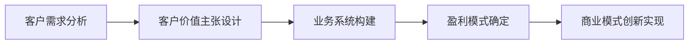
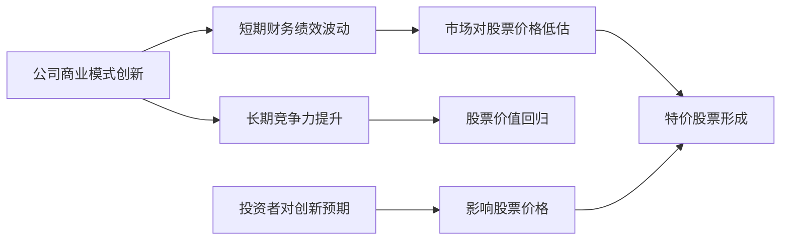

# 特价股票与公司商业模式创新的关系探讨

> 关键词：特价股票、公司商业模式创新、市场价值、竞争优势、财务绩效

> 摘要：本文旨在深入探讨特价股票与公司商业模式创新之间的关系。通过对相关核心概念的阐述、算法原理的分析、数学模型的构建以及实际案例的研究，揭示特价股票产生的原因与商业模式创新的内在联系，探讨商业模式创新如何影响特价股票的价值，以及特价股票对公司推进商业模式创新的作用。同时，分析了两者关系在实际应用场景中的体现，推荐了相关的学习资源、开发工具和研究论文，最后对未来发展趋势与挑战进行了总结，并解答了常见问题。

## 1. 背景介绍 
### 1.1 目的和范围
本研究的目的在于全面剖析特价股票与公司商业模式创新之间的相互关系。范围涵盖了特价股票的定义、形成机制，公司商业模式创新的内涵、方式和效果，以及两者在金融市场和企业经营中的相互作用。通过理论分析和实际案例研究，为投资者、企业管理者和研究人员提供有价值的参考。

### 1.2 预期读者
本文预期读者包括金融投资者，他们可以通过了解特价股票与商业模式创新的关系，做出更明智的投资决策；企业管理者，有助于他们认识到商业模式创新对公司股票价值的影响，从而推动企业的创新发展；以及金融和管理领域的研究人员，为他们的学术研究提供新的视角和思路。

### 1.3 文档结构概述
本文首先介绍相关背景，明确研究目的和范围。接着阐述核心概念及其联系，包括特价股票和公司商业模式创新的原理和架构，并给出相应的流程图。然后分析核心算法原理和具体操作步骤，通过Python代码进行详细阐述。随后构建数学模型和公式，进行详细讲解并举例说明。再通过项目实战，展示代码实际案例并进行详细解释。之后探讨实际应用场景，推荐相关的工具和资源。最后总结未来发展趋势与挑战，解答常见问题，并提供扩展阅读和参考资料。

### 1.4 术语表
#### 1.4.1 核心术语定义
- **特价股票**：指在市场上价格相对其内在价值被低估的股票。这种低估可能是由于市场短期波动、信息不对称、行业整体低迷等多种因素导致。
- **公司商业模式创新**：企业为了获得可持续的竞争优势和更高的市场价值，对其业务系统、盈利模式、客户价值主张等方面进行重新设计和变革的过程。

#### 1.4.2 相关概念解释
- **股票内在价值**：是指股票未来预期现金流的现值，它基于公司的基本面、盈利能力、成长潜力等因素来评估。
- **竞争优势**：企业在市场中相对于竞争对手所具有的独特优势，能够使其在市场中获得更高的市场份额、利润和客户忠诚度。

#### 1.4.3 缩略词列表
- **P/E**：市盈率（Price-to-Earnings Ratio），是指股票价格除以每股收益的比率，用于衡量股票的估值水平。
- **ROE**：净资产收益率（Return on Equity），是指净利润与平均股东权益的百分比，反映了公司运用自有资本的效率。

## 2. 核心概念与联系 
### 2.1 特价股票原理和架构
特价股票的形成主要源于市场的非有效性。市场参与者的情绪、信息传播的不及时和不准确等因素，会导致股票价格偏离其内在价值。其架构可以从以下几个方面理解：
- **宏观因素**：宏观经济形势、政策法规变化等会影响整个市场的估值水平，导致部分股票价格被低估。
- **行业因素**：行业竞争加剧、技术变革等因素可能使某些行业内的公司股票价格受到压制。
- **公司自身因素**：公司短期业绩不佳、管理问题等可能导致市场对其股票的预期降低，从而出现价格低估。

以下是特价股票形成的Mermaid流程图：


### 2.2 公司商业模式创新原理和架构
公司商业模式创新的原理在于通过对企业的价值创造逻辑进行重构，以适应市场变化和客户需求。其架构主要包括以下几个关键要素：
- **客户价值主张**：明确企业为客户提供的独特价值，满足客户未被满足的需求。
- **业务系统**：设计企业的业务流程、合作伙伴网络等，以实现客户价值主张。
- **盈利模式**：确定企业如何从提供的产品或服务中获取利润。

以下是公司商业模式创新的Mermaid流程图：


### 2.3 特价股票与公司商业模式创新的联系
特价股票与公司商业模式创新之间存在着紧密的联系。一方面，公司进行商业模式创新可能会在短期内影响其财务绩效，导致市场对其股票价格的低估，从而形成特价股票。另一方面，成功的商业模式创新能够提升公司的长期竞争力和市场价值，使特价股票的价值得到回归。此外，投资者对公司商业模式创新的预期也会影响股票价格，如果市场对创新的前景持怀疑态度，可能会导致股票价格低于其内在价值。

以下是两者联系的Mermaid流程图：


## 3. 核心算法原理 & 具体操作步骤 
### 3.1 特价股票的识别算法
我们可以通过比较股票的市场价格和其内在价值来识别特价股票。一种常用的方法是使用市盈率（P/E）和净资产收益率（ROE）来估算股票的内在价值。以下是Python代码示例：

```python
import pandas as pd

# 定义一个函数来计算股票的内在价值
def calculate_intrinsic_value(pe_ratio, roe, earnings_per_share):
    """
    计算股票的内在价值
    :param pe_ratio: 市盈率
    :param roe: 净资产收益率
    :param earnings_per_share: 每股收益
    :return: 股票的内在价值
    """
    # 假设合理的市盈率为行业平均市盈率
    industry_average_pe = 20
    # 计算内在价值
    intrinsic_value = (roe / 100) * industry_average_pe * earnings_per_share
    return intrinsic_value

# 示例数据
data = {
    'stock_code': ['000001', '000002', '000003'],
    'market_price': [10, 15, 20],
    'pe_ratio': [15, 18, 22],
    'roe': [12, 15, 10],
    'earnings_per_share': [1, 1.2, 1.5]
}

df = pd.DataFrame(data)

# 计算每只股票的内在价值
df['intrinsic_value'] = df.apply(lambda row: calculate_intrinsic_value(row['pe_ratio'], row['roe'], row['earnings_per_share']), axis=1)

# 识别特价股票
df['is_bargain_stock'] = df['market_price'] < df['intrinsic_value']

print(df)
```

### 3.2 操作步骤
1. **数据收集**：收集股票的市场价格、市盈率、净资产收益率和每股收益等数据。可以从金融数据提供商如东方财富、Wind等获取这些数据。
2. **计算内在价值**：使用上述代码中的函数计算每只股票的内在价值。
3. **识别特价股票**：比较股票的市场价格和内在价值，如果市场价格低于内在价值，则认为该股票是特价股票。

## 4. 数学模型和公式 & 详细讲解 & 举例说明 
### 4.1 股票内在价值模型
我们使用的股票内在价值模型基于市盈率和净资产收益率。公式如下：
$$V = \frac{ROE}{100} \times P/E_{avg} \times EPS$$
其中，$V$ 表示股票的内在价值，$ROE$ 是净资产收益率，$P/E_{avg}$ 是行业平均市盈率，$EPS$ 是每股收益。

### 4.2 详细讲解
- **净资产收益率（ROE）**：反映了公司运用自有资本的效率，ROE越高，说明公司盈利能力越强。
- **行业平均市盈率（$P/E_{avg}$）**：作为一个参考标准，用于衡量股票的估值水平。不同行业的平均市盈率可能会有所不同。
- **每股收益（EPS）**：表示每股股票所享有的公司净利润，是衡量公司盈利能力的重要指标。

### 4.3 举例说明
假设某股票的ROE为15%，行业平均市盈率为20，每股收益为1.2元。则该股票的内在价值为：
$$V = \frac{15}{100} \times 20 \times 1.2 = 3.6$$（元）
如果该股票的市场价格为3元，由于市场价格低于内在价值，我们可以认为该股票是特价股票。

## 5. 项目实战：代码实际案例和详细解释说明 
### 5.1  开发环境搭建
- **操作系统**：Windows、Linux或Mac OS均可。
- **Python环境**：建议使用Python 3.7及以上版本。可以从Python官方网站（https://www.python.org/downloads/）下载并安装。
- **依赖库**：需要安装pandas库，用于数据处理。可以使用以下命令进行安装：
```sh
pip install pandas
```

### 5.2  源代码详细实现和代码解读
以下是完整的源代码：

```python
import pandas as pd

# 定义一个函数来计算股票的内在价值
def calculate_intrinsic_value(pe_ratio, roe, earnings_per_share):
    """
    计算股票的内在价值
    :param pe_ratio: 市盈率
    :param roe: 净资产收益率
    :param earnings_per_share: 每股收益
    :return: 股票的内在价值
    """
    # 假设合理的市盈率为行业平均市盈率
    industry_average_pe = 20
    # 计算内在价值
    intrinsic_value = (roe / 100) * industry_average_pe * earnings_per_share
    return intrinsic_value

# 示例数据
data = {
    'stock_code': ['000001', '000002', '000003'],
    'market_price': [10, 15, 20],
    'pe_ratio': [15, 18, 22],
    'roe': [12, 15, 10],
    'earnings_per_share': [1, 1.2, 1.5]
}

df = pd.DataFrame(data)

# 计算每只股票的内在价值
df['intrinsic_value'] = df.apply(lambda row: calculate_intrinsic_value(row['pe_ratio'], row['roe'], row['earnings_per_share']), axis=1)

# 识别特价股票
df['is_bargain_stock'] = df['market_price'] < df['intrinsic_value']

print(df)
```

### 代码解读
1. **导入库**：导入pandas库，用于数据处理。
2. **定义计算内在价值的函数**：`calculate_intrinsic_value` 函数接受市盈率、净资产收益率和每股收益作为输入，返回股票的内在价值。
3. **创建示例数据**：使用字典创建一个包含股票代码、市场价格、市盈率、净资产收益率和每股收益的数据。
4. **创建DataFrame**：使用 `pd.DataFrame` 函数将字典数据转换为DataFrame对象。
5. **计算内在价值**：使用 `apply` 方法和 `lambda` 函数对DataFrame中的每一行应用 `calculate_intrinsic_value` 函数，计算每只股票的内在价值。
6. **识别特价股票**：通过比较市场价格和内在价值，判断每只股票是否为特价股票，并将结果存储在 `is_bargain_stock` 列中。
7. **打印结果**：打印包含股票信息和是否为特价股票的DataFrame。

### 5.3  代码解读与分析
通过上述代码，我们可以方便地识别特价股票。代码的核心在于计算股票的内在价值，并与市场价格进行比较。需要注意的是，行业平均市盈率的选择会影响内在价值的计算结果，因此在实际应用中需要根据具体行业进行调整。此外，该模型只是一个简单的估值模型，实际的股票价值还受到许多其他因素的影响，如宏观经济形势、行业前景、公司管理水平等。

## 6. 实际应用场景 
### 6.1 投资者决策
投资者可以通过识别特价股票，结合对公司商业模式创新的分析，做出更明智的投资决策。如果一家公司正在进行商业模式创新，但股票价格被低估，投资者可以考虑买入该股票，等待创新带来的价值提升。例如，特斯拉在早期进行电动汽车商业模式创新时，股票价格曾被市场低估，但随着其创新的成功，股票价格大幅上涨。

### 6.2 企业战略规划
企业管理者可以通过研究特价股票与商业模式创新的关系，了解市场对公司创新的反应。如果公司股票被低估，管理者可以评估商业模式创新的效果，调整创新策略，以提升公司的市场价值。例如，苹果公司在推出新产品和服务时，会密切关注市场对其股票价格的反应，根据反馈调整商业模式。

### 6.3 金融研究
金融研究人员可以通过对特价股票和公司商业模式创新的研究，深入了解市场的有效性和企业创新的价值。研究结果可以为金融理论的发展提供新的实证依据，也可以为投资者和企业管理者提供决策参考。

## 7. 工具和资源推荐
### 7.1 学习资源推荐
#### 7.1.1 书籍推荐
- 《聪明的投资者》（The Intelligent Investor）：作者本杰明·格雷厄姆（Benjamin Graham），被誉为投资界的圣经，介绍了价值投资的理念和方法，对识别特价股票有很大帮助。
- 《创新者的窘境》（The Innovator's Dilemma）：作者克莱顿·克里斯坦森（Clayton Christensen），探讨了企业在创新过程中面临的挑战和机遇，对理解公司商业模式创新有重要启示。

#### 7.1.2 在线课程
- Coursera上的“Financial Markets”课程：由耶鲁大学教授罗伯特·席勒（Robert Shiller）授课，介绍了金融市场的基本原理和投资策略。
- edX上的“Business Model Innovation”课程：讲解了商业模式创新的方法和案例。

#### 7.1.3 技术博客和网站
- 雪球网（https://xueqiu.com/）：国内知名的财经社区，提供股票行情、分析和讨论。
- Seeking Alpha（https://seekingalpha.com/）：国际知名的金融分析网站，提供股票研究报告和投资建议。

### 7.2 开发工具框架推荐
#### 7.2.1 IDE和编辑器
- PyCharm：功能强大的Python集成开发环境，适合开发和调试Python代码。
- Jupyter Notebook：交互式笔记本，方便进行数据探索和代码演示。

#### 7.2.2 调试和性能分析工具
- pdb：Python内置的调试器，用于调试Python代码。
- cProfile：Python标准库中的性能分析工具，用于分析代码的性能瓶颈。

#### 7.2.3 相关框架和库
- pandas：用于数据处理和分析的Python库。
- numpy：用于科学计算的Python库。

### 7.3 相关论文著作推荐
#### 7.3.1 经典论文
- Fama, E. F., & French, K. R. (1992). The cross-section of expected stock returns. Journal of Finance, 47(2), 427-465. 该论文提出了Fama-French三因子模型，对股票收益的横截面进行了分析。
- Christensen, C. M. (1997). The innovator's dilemma: When new technologies cause great firms to fail. Harvard Business School Press. 介绍了颠覆性创新的概念和理论。

#### 7.3.2 最新研究成果
- 可以通过Google Scholar、IEEE Xplore等学术搜索引擎搜索最新的关于特价股票和公司商业模式创新的研究论文。

#### 7.3.3 应用案例分析
- 《哈佛商业评论》（Harvard Business Review）上经常发表关于企业商业模式创新的案例分析文章，可以从中了解不同行业的创新实践。

## 8. 总结：未来发展趋势与挑战
### 8.1 未来发展趋势
- **技术驱动的商业模式创新加速**：随着人工智能、大数据、区块链等新兴技术的发展，企业将有更多的机会进行商业模式创新。这可能会导致更多的特价股票出现，同时也为投资者带来更多的投资机会。
- **市场对创新的认知更加理性**：随着投资者教育的普及和市场的成熟，市场对公司商业模式创新的认知将更加理性。投资者将更加注重创新的质量和可持续性，而不仅仅是短期的市场炒作。
- **跨行业融合的商业模式创新增多**：不同行业之间的界限将越来越模糊，企业将通过跨行业融合进行商业模式创新。例如，金融科技公司将金融服务与科技应用相结合，创造出全新的商业模式。

### 8.2 挑战
- **创新的不确定性**：商业模式创新具有很高的不确定性，企业可能投入大量资源但无法取得预期的效果。这可能导致公司股票价格长期低迷，给投资者带来损失。
- **市场竞争加剧**：随着越来越多的企业进行商业模式创新，市场竞争将更加激烈。企业需要不断创新和优化商业模式，以保持竞争优势。否则，即使曾经的创新企业也可能被市场淘汰，其股票价格也会受到影响。
- **监管政策的挑战**：商业模式创新可能会突破现有的监管框架，给监管带来挑战。监管政策的不确定性可能会影响企业的创新进程和股票价格。

## 9. 附录：常见问题与解答
### 9.1 如何准确评估公司商业模式创新的效果？
评估公司商业模式创新的效果可以从多个方面进行，包括财务指标（如营收增长、利润提升、ROE等）、市场指标（如市场份额扩大、客户满意度提高等）和创新指标（如新产品或服务的推出、专利数量等）。同时，还需要考虑创新的可持续性和对公司长期竞争力的影响。

### 9.2 特价股票一定是因为公司商业模式创新导致的吗？
不一定。特价股票的形成可能有多种原因，如市场短期波动、行业整体低迷、公司短期业绩不佳等。公司商业模式创新只是其中一个可能的因素。

### 9.3 如何选择适合的行业平均市盈率来计算股票内在价值？
可以参考行业内同类型公司的平均市盈率，或者使用专业金融机构发布的行业平均市盈率数据。同时，还需要考虑行业的发展阶段、竞争格局等因素。

## 10. 扩展阅读 & 参考资料
- 格雷厄姆, B., & 多德, D. (2009). 证券分析. 海南出版社.
- 克里斯坦森, C. M., 雷纳, M. E., & 麦克唐纳, R. (2013). 创新者的解答. 中信出版社.
- 东方财富网（https://www.eastmoney.com/）
- Wind金融终端

作者：AI天才研究院/AI Genius Institute & 禅与计算机程序设计艺术 /Zen And The Art of Computer Programming