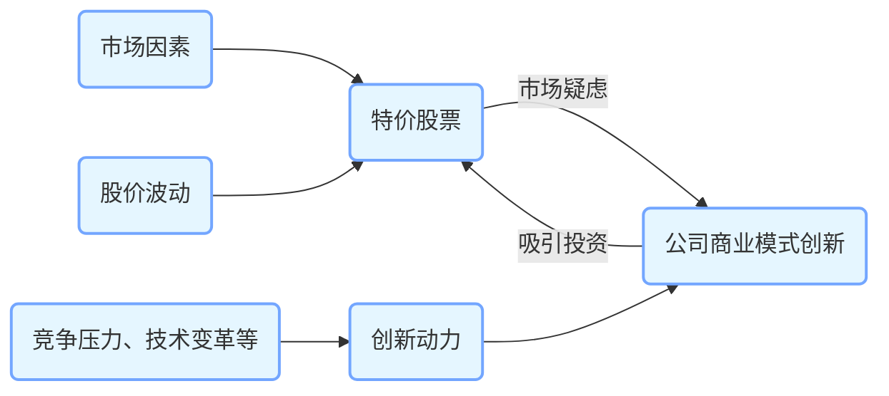

# 特价股票与公司商业模式创新的关联性研究

> 关键词：特价股票、公司商业模式创新、关联性、股票估值、企业发展战略

> 摘要：本文旨在深入研究特价股票与公司商业模式创新之间的关联性。通过对特价股票的定义、形成原因及特征进行分析，探讨公司商业模式创新的内涵、动力与类型。从理论和实践层面阐述两者之间的相互影响机制，并借助数学模型和实际案例进行验证。文章还介绍了相关的开发环境搭建、代码实现与解读，分析了实际应用场景，推荐了学习资源、开发工具和相关论文著作。最后总结了未来发展趋势与挑战，解答了常见问题并提供扩展阅读与参考资料，以期为投资者和企业管理者提供有价值的决策依据。

## 1. 背景介绍 
### 1.1 目的和范围
本研究的目的是揭示特价股票与公司商业模式创新之间的内在联系。通过系统分析，帮助投资者更好地理解特价股票背后的企业基本面变化，为投资决策提供参考；同时，为企业管理者提供关于商业模式创新对股票市场影响的洞察，指导企业制定合理的发展战略。研究范围涵盖了不同行业的上市公司，分析其特价股票的表现与商业模式创新举措之间的关系。

### 1.2 预期读者
本文预期读者包括金融投资者、企业管理者、学术研究人员以及对金融市场和企业管理感兴趣的人士。投资者可以从本文中获取关于特价股票投资价值的分析方法和决策思路；企业管理者可以借鉴商业模式创新的案例和理论，推动企业的可持续发展；学术研究人员可以在本文的基础上开展进一步的深入研究。

### 1.3 文档结构概述
本文首先介绍背景信息，包括研究目的、预期读者和文档结构。接着阐述核心概念，如特价股票和公司商业模式创新的定义、特征及联系，并通过流程图展示其关系。然后详细讲解核心算法原理和具体操作步骤，运用 Python 代码进行示例。之后引入数学模型和公式，结合实际例子进行说明。通过项目实战，展示代码实现和解读。分析实际应用场景，推荐相关的学习资源、开发工具和论文著作。最后总结未来发展趋势与挑战，解答常见问题并提供扩展阅读与参考资料。

### 1.4 术语表
#### 1.4.1 核心术语定义
- **特价股票**：指在股票市场中，价格相对其内在价值被低估的股票。这种低估可能是由于市场情绪、行业竞争、短期业绩波动等因素导致。
- **公司商业模式创新**：企业为了适应市场变化、提高竞争力，对自身的业务系统、盈利模式、客户价值主张等方面进行重新设计和优化的过程。

#### 1.4.2 相关概念解释
- **股票内在价值**：根据公司的基本面因素，如盈利能力、资产状况、发展前景等，通过一定的估值方法计算得出的股票的合理价值。
- **业务系统**：企业为了实现客户价值主张，所涉及的各个业务环节和合作伙伴之间的关系网络。
- **盈利模式**：企业通过何种方式获取收入和利润，包括产品定价、收费方式、成本结构等。

#### 1.4.3 缩略词列表
- **PE**：市盈率（Price-to-Earnings Ratio），指股票价格除以每股收益的比率，用于衡量股票的估值水平。
- **ROE**：净资产收益率（Return on Equity），反映股东权益的收益水平，用以衡量公司运用自有资本的效率。

## 2. 核心概念与联系 

### 2.1 特价股票的定义与特征
特价股票是指其市场价格低于其内在价值的股票。从市场表现来看，特价股票往往具有较低的市盈率、市净率等估值指标。其形成原因可能包括市场对公司短期业绩的过度担忧、行业负面消息的影响、公司内部管理问题等。例如，某公司由于一次偶然的生产事故导致短期业绩下滑，市场恐慌情绪导致其股价大幅下跌，从而形成特价股票。

### 2.2 公司商业模式创新的内涵与动力
公司商业模式创新是企业对自身运营方式的根本性变革。其内涵包括重新定义客户价值主张、优化业务系统、创新盈利模式等方面。企业进行商业模式创新的动力主要来自市场竞争压力、技术变革、消费者需求变化等因素。例如，随着互联网技术的发展，传统零售企业通过开展电商业务、线上线下融合等方式进行商业模式创新，以适应市场变化。

### 2.3 特价股票与公司商业模式创新的联系
特价股票与公司商业模式创新之间存在着密切的联系。一方面，公司商业模式创新可能是特价股票形成的原因之一。当企业进行商业模式创新时，市场可能对其创新的前景存在疑虑，导致股价下跌形成特价股票。另一方面，特价股票也可能为企业提供进行商业模式创新的契机。低价的股票可以吸引更多的投资者关注，为企业筹集资金用于创新项目。同时，企业管理者也可能意识到需要通过商业模式创新来提升公司价值，从而推动股价回升。

### 2.4 文本示意图
特价股票与公司商业模式创新的联系可以用以下文本示意图表示：

特价股票 <-> 公司商业模式创新
|                   |
|                   |
市场因素           创新动力
|                   |
|                   |
股价波动           竞争压力、技术变革等

### 2.5 Mermaid 流程图


## 3. 核心算法原理 & 具体操作步骤 

### 3.1 股票内在价值评估算法
评估股票内在价值是判断是否为特价股票的关键。常用的方法是现金流折现法（DCF）。该方法的核心思想是将公司未来的现金流按照一定的折现率折现到当前，得到股票的内在价值。

#### 3.1.1 算法原理
现金流折现法的公式为：

$$V = \sum_{t=1}^{n} \frac{CF_t}{(1 + r)^t} + \frac{TV}{(1 + r)^n}$$

其中，$V$ 表示股票的内在价值，$CF_t$ 表示第 $t$ 期的现金流，$r$ 表示折现率，$n$ 表示预测期数，$TV$ 表示终值。

#### 3.1.2 Python 代码实现
```python
def dcf_valuation(cash_flows, discount_rate, terminal_value):
    n = len(cash_flows)
    present_value = 0
    for t in range(n):
        present_value += cash_flows[t] / ((1 + discount_rate) ** (t + 1))
    present_value += terminal_value / ((1 + discount_rate) ** n)
    return present_value

# 示例数据
cash_flows = [100, 120, 150, 180, 200]
discount_rate = 0.1
terminal_value = 2500

intrinsic_value = dcf_valuation(cash_flows, discount_rate, terminal_value)
print(f"股票内在价值: {intrinsic_value}")
```

### 3.2 商业模式创新评估指标算法
评估公司商业模式创新可以从多个维度进行，如创新投入、创新产出等。这里我们以创新投入占比和新产品销售收入占比为例。

#### 3.2.1 算法原理
- 创新投入占比 = 研发投入 / 营业收入
- 新产品销售收入占比 = 新产品销售收入 / 总销售收入

#### 3.2.2 Python 代码实现
```python
def innovation_input_ratio(research_input, operating_income):
    return research_input / operating_income

def new_product_sales_ratio(new_product_sales, total_sales):
    return new_product_sales / total_sales

# 示例数据
research_input = 500
operating_income = 5000
new_product_sales = 1000
total_sales = 5000

input_ratio = innovation_input_ratio(research_input, operating_income)
sales_ratio = new_product_sales_ratio(new_product_sales, total_sales)

print(f"创新投入占比: {input_ratio * 100}%")
print(f"新产品销售收入占比: {sales_ratio * 100}%")
```

### 3.3 具体操作步骤
1. **数据收集**：收集公司的财务报表数据，包括现金流、研发投入、营业收入、新产品销售收入等。
2. **计算股票内在价值**：使用现金流折现法计算股票的内在价值。
3. **评估商业模式创新**：计算创新投入占比和新产品销售收入占比等指标，评估公司的商业模式创新程度。
4. **比较与判断**：将股票的市场价格与内在价值进行比较，判断是否为特价股票。同时，结合商业模式创新指标，分析两者之间的关系。

## 4. 数学模型和公式 & 详细讲解 & 举例说明 

### 4.1 现金流折现法详细讲解
现金流折现法是一种基于未来现金流预测的股票估值方法。其核心在于将公司未来的现金流按照一定的折现率折现到当前，以反映货币的时间价值。

#### 4.1.1 现金流预测
现金流预测是现金流折现法的关键步骤。通常需要对公司的营业收入、成本、折旧等进行预测，从而得到每年的自由现金流。自由现金流是指公司在满足运营和投资需求后剩余的现金流量，可用于分配给股东或进行再投资。

#### 4.1.2 折现率选择
折现率反映了投资者对投资风险的预期。一般来说，折现率可以选择公司的加权平均资本成本（WACC）。WACC 的计算公式为：

$$WACC = w_e \times r_e + w_d \times r_d \times (1 - T)$$

其中，$w_e$ 和 $w_d$ 分别表示股权和债务的权重，$r_e$ 表示股权成本，$r_d$ 表示债务成本，$T$ 表示所得税税率。

#### 4.1.3 终值计算
终值是指预测期结束后公司的价值。常用的终值计算方法是永续增长模型，公式为：

$$TV = \frac{CF_{n+1}}{r - g}$$

其中，$CF_{n+1}$ 表示预测期结束后下一期的现金流，$r$ 表示折现率，$g$ 表示永续增长率。

#### 4.1.4 举例说明
假设某公司未来 5 年的自由现金流分别为 100 万元、120 万元、150 万元、180 万元、200 万元，折现率为 10%，永续增长率为 3%。预测期结束后下一期的现金流为 200×(1 + 3%) = 206 万元。

首先计算终值：

$$TV = \frac{206}{0.1 - 0.03} = 2942.86 \text{（万元）}$$

然后计算股票的内在价值：

$$V = \frac{100}{(1 + 0.1)^1} + \frac{120}{(1 + 0.1)^2} + \frac{150}{(1 + 0.1)^3} + \frac{180}{(1 + 0.1)^4} + \frac{200}{(1 + 0.1)^5} + \frac{2942.86}{(1 + 0.1)^5} \approx 2238.57 \text{（万元）}$$

### 4.2 商业模式创新评估指标公式详细讲解
#### 4.2.1 创新投入占比
创新投入占比反映了公司对创新的重视程度和资源投入力度。较高的创新投入占比通常意味着公司更愿意投入资源进行研发和创新活动，有望推动商业模式的创新。

#### 4.2.2 新产品销售收入占比
新产品销售收入占比反映了公司商业模式创新的成果。较高的新产品销售收入占比表明公司通过创新推出的新产品得到了市场的认可，商业模式创新取得了一定的成效。

#### 4.2.3 举例说明
假设某公司的研发投入为 500 万元，营业收入为 5000 万元，新产品销售收入为 1000 万元，总销售收入为 5000 万元。

创新投入占比 = 500 / 5000 = 0.1 = 10%
新产品销售收入占比 = 1000 / 5000 = 0.2 = 20%

这表明该公司在创新方面投入了一定的资源，并且新产品的销售情况较好，商业模式创新有一定的成效。

## 5. 项目实战：代码实际案例和详细解释说明 

### 5.1  开发环境搭建
#### 5.1.1 安装 Python
首先需要安装 Python 编程语言。可以从 Python 官方网站（https://www.python.org/downloads/）下载适合自己操作系统的 Python 版本，并按照安装向导进行安装。

#### 5.1.2 安装必要的库
在本项目中，需要使用一些常用的 Python 库，如 Pandas、Numpy 等。可以使用以下命令进行安装：
```sh
pip install pandas numpy
```

### 5.2  源代码详细实现和代码解读
#### 5.2.1 数据读取与预处理
```python
import pandas as pd

# 读取财务数据文件
data = pd.read_csv('financial_data.csv')

# 数据预处理
# 去除缺失值
data = data.dropna()

# 提取所需列
cash_flows = data['cash_flow'].values
research_input = data['research_input'].values[0]
operating_income = data['operating_income'].values[0]
new_product_sales = data['new_product_sales'].values[0]
total_sales = data['total_sales'].values[0]
```
代码解读：
- 首先使用 Pandas 库的 `read_csv` 函数读取财务数据文件。
- 然后使用 `dropna` 函数去除数据中的缺失值。
- 最后提取所需的列，如现金流、研发投入、营业收入等。

#### 5.2.2 股票内在价值计算
```python
discount_rate = 0.1
terminal_value = 2500

intrinsic_value = dcf_valuation(cash_flows, discount_rate, terminal_value)
print(f"股票内在价值: {intrinsic_value}")
```
代码解读：
- 定义折现率和终值。
- 调用之前定义的 `dcf_valuation` 函数计算股票的内在价值。
- 打印计算结果。

#### 5.2.3 商业模式创新评估
```python
input_ratio = innovation_input_ratio(research_input, operating_income)
sales_ratio = new_product_sales_ratio(new_product_sales, total_sales)

print(f"创新投入占比: {input_ratio * 100}%")
print(f"新产品销售收入占比: {sales_ratio * 100}%")
```
代码解读：
- 调用之前定义的 `innovation_input_ratio` 和 `new_product_sales_ratio` 函数计算创新投入占比和新产品销售收入占比。
- 打印计算结果。

### 5.3  代码解读与分析
通过以上代码，我们完成了股票内在价值的计算和商业模式创新的评估。从代码实现可以看出，数据预处理是非常重要的一步，它可以确保数据的质量，提高计算结果的准确性。同时，使用函数封装计算逻辑可以提高代码的复用性和可维护性。

在实际应用中，我们可以根据计算结果判断股票是否为特价股票，并分析公司的商业模式创新程度。如果股票的市场价格低于内在价值，且公司的商业模式创新指标较好，那么该股票可能具有投资价值。

## 6. 实际应用场景 
### 6.1 投资者决策
对于投资者来说，研究特价股票与公司商业模式创新的关联性可以帮助他们做出更明智的投资决策。当发现某只股票价格被低估，同时公司正在进行积极的商业模式创新时，投资者可以考虑买入该股票，期待公司通过创新提升价值，从而推动股价上涨。例如，在互联网电商行业，一些新兴电商平台在发展初期可能股价较低，但通过创新的商业模式，如社交电商、直播带货等，吸引了大量用户和投资者的关注，股价也随之大幅上涨。

### 6.2 企业战略制定
企业管理者可以通过分析特价股票与商业模式创新的关系，制定合理的企业发展战略。如果企业股价被低估，管理者可以考虑加大商业模式创新的力度，通过推出新产品、拓展新市场、优化业务流程等方式提升公司价值，从而吸引投资者，推动股价回升。例如，传统制造业企业可以通过向智能制造转型，引入工业互联网、大数据等新技术，创新商业模式，提高生产效率和产品质量，增强市场竞争力。

### 6.3 行业研究与分析
对于行业研究人员来说，研究特价股票与公司商业模式创新的关联性可以深入了解行业的发展趋势和竞争格局。通过分析不同企业的商业模式创新情况和股价表现，可以发现行业中的创新先锋和潜在的发展机会。例如，在新能源汽车行业，一些企业通过创新的电池技术、智能驾驶系统等商业模式，成为行业的领导者，而另一些企业则可能因为缺乏创新而面临困境。研究人员可以通过对这些企业的分析，为行业的发展提供参考建议。

## 7. 工具和资源推荐
### 7.1 学习资源推荐
#### 7.1.1 书籍推荐
- 《证券分析》（Security Analysis）：由本杰明·格雷厄姆（Benjamin Graham）和大卫·多德（David Dodd）所著，是价值投资领域的经典著作，介绍了股票估值的基本方法和理论。
- 《创新者的窘境》（The Innovator's Dilemma）：作者克莱顿·克里斯坦森（Clayton Christensen），探讨了企业在面对技术变革和市场变化时，如何进行商业模式创新以保持竞争力。
- 《商业模式新生代》（Business Model Generation）：由亚历山大·奥斯特瓦德（Alexander Osterwalder）和伊夫·皮尼厄（Yves Pigneur）合著，提供了一种实用的商业模式设计工具和方法。

#### 7.1.2 在线课程
- Coursera 上的“Financial Markets”：由耶鲁大学教授罗伯特·席勒（Robert Shiller）授课，介绍了金融市场的基本原理和投资策略。
- edX 上的“Business Model Innovation”：该课程深入探讨了商业模式创新的理论和实践，提供了案例分析和实践项目。
- Udemy 上的“Python for Finance: Investment Fundamentals & Data Analytics”：教授如何使用 Python 进行金融数据分析和投资决策。

#### 7.1.3 技术博客和网站
- Seeking Alpha：提供股票分析、投资策略和市场评论等内容，是投资者获取信息和交流的重要平台。
- TechCrunch：专注于科技行业的新闻和分析，报道了许多创新企业的商业模式和发展动态。
- Towards Data Science：发布关于数据科学、机器学习和金融分析等领域的技术文章，提供了很多实用的代码示例和案例分析。

### 7.2 开发工具框架推荐
#### 7.2.1 IDE和编辑器
- PyCharm：一款专业的 Python 集成开发环境，提供了代码编辑、调试、版本控制等功能，适合开发大型 Python 项目。
- Jupyter Notebook：一种交互式的开发环境，支持 Python、R 等多种编程语言，方便进行数据探索和分析。
- Visual Studio Code：一款轻量级的代码编辑器，具有丰富的插件生态系统，可用于 Python 开发和数据分析。

#### 7.2.2 调试和性能分析工具
- pdb：Python 自带的调试器，可以帮助开发者定位代码中的错误和问题。
- cProfile：Python 的性能分析工具，用于分析代码的运行时间和资源消耗情况。
- Py-Spy：一个用于分析 Python 程序性能的命令行工具，可以实时监测程序的运行状态。

#### 7.2.3 相关框架和库
- Pandas：用于数据处理和分析的 Python 库，提供了高效的数据结构和数据操作方法。
- Numpy：Python 的数值计算库，支持大规模数组和矩阵运算。
- Scikit-learn：用于机器学习的 Python 库，提供了各种机器学习算法和工具。

### 7.3 相关论文著作推荐
#### 7.3.1 经典论文
- “The Capital Asset Pricing Model: Theory and Evidence”：由 Eugene F. Fama 和 Kenneth R. French 撰写，对资本资产定价模型进行了深入研究和实证分析。
- “Disruptive Technologies: Catching the Wave”：克莱顿·克里斯坦森（Clayton Christensen）的早期论文，提出了颠覆性技术和商业模式创新的概念。
- “The Theory of the Growth of the Firm”：作者 Edith Penrose，探讨了企业成长的理论和机制，对商业模式创新有一定的启示作用。

#### 7.3.2 最新研究成果
- 可以关注《Journal of Financial Economics》《Management Science》《Strategic Management Journal》等学术期刊，获取关于金融市场、企业管理和商业模式创新的最新研究成果。
- 参加相关的学术会议，如美国金融协会年会（AFA Annual Meeting）、战略管理协会年会（SMS Annual Conference）等，与国内外的学者和专家交流最新的研究进展。

#### 7.3.3 应用案例分析
- 可以参考一些商业案例书籍和网站，如哈佛商业评论案例库（Harvard Business Review Case Studies）、麦肯锡商业案例集（McKinsey Business Cases）等，了解不同行业企业的商业模式创新案例和实践经验。

## 8. 总结：未来发展趋势与挑战
### 8.1 未来发展趋势
#### 8.1.1 技术驱动的商业模式创新加速
随着人工智能、大数据、区块链等新兴技术的不断发展，企业将更加依赖技术创新来推动商业模式的变革。例如，人工智能可以帮助企业实现精准营销和个性化服务，大数据可以为企业提供决策支持和市场洞察，区块链可以提高供应链的透明度和安全性。这些技术的应用将加速企业商业模式创新的步伐，创造更多的商业机会。

#### 8.1.2 投资者对商业模式创新的关注度提高
投资者将越来越关注企业的商业模式创新能力，将其作为评估企业价值和投资潜力的重要指标。具有创新商业模式的企业将更容易获得投资者的青睐，从而获得更多的资金支持。同时，投资者也将更加注重企业的长期发展潜力，而不仅仅关注短期的财务业绩。

#### 8.1.3 行业融合与跨界竞争加剧
不同行业之间的界限将越来越模糊，行业融合和跨界竞争将成为未来的发展趋势。企业需要不断创新商业模式，拓展业务领域，以应对来自不同行业的竞争。例如，互联网企业可能会进入金融、医疗等传统行业，传统制造业企业也可能会涉足物联网、新能源等新兴领域。

### 8.2 挑战
#### 8.2.1 创新风险与不确定性
商业模式创新往往伴随着较高的风险和不确定性。企业在进行创新时，可能会面临技术难题、市场接受度低、资金短缺等问题。一旦创新失败，企业可能会遭受巨大的损失。因此，企业需要建立有效的风险管理机制，降低创新风险。

#### 8.2.2 数据安全与隐私保护
随着技术的发展，企业在商业模式创新过程中需要收集和处理大量的数据。然而，数据安全和隐私保护问题也日益突出。企业需要加强数据安全管理，遵守相关的法律法规，保护用户的隐私和数据安全。否则，一旦发生数据泄露事件，将对企业的声誉和业务造成严重影响。

#### 8.2.3 人才短缺
商业模式创新需要具备跨学科知识和创新能力的人才。然而，目前市场上这类人才相对短缺。企业需要加强人才培养和引进，建立创新型的企业文化，吸引和留住优秀的人才。同时，高校和科研机构也需要加强相关专业的建设，培养更多适应市场需求的创新型人才。

## 9. 附录：常见问题与解答
### 9.1 如何准确评估股票的内在价值？
评估股票的内在价值需要综合考虑多个因素，如公司的盈利能力、资产状况、发展前景等。常用的方法包括现金流折现法、市盈率法、市净率法等。在使用这些方法时，需要注意数据的准确性和可靠性，同时要对未来的现金流、盈利增长等进行合理的预测。此外，还可以参考同行业其他公司的估值水平，进行比较分析。

### 9.2 商业模式创新一定能带来股价上涨吗？
不一定。商业模式创新虽然有可能提升公司的价值，但并不一定能立即反映在股价上。股价受到多种因素的影响，包括市场情绪、宏观经济环境、行业竞争等。即使公司进行了成功的商业模式创新，市场也可能需要一段时间来认识和认可其价值。因此，投资者在关注商业模式创新的同时，还需要综合考虑其他因素，做出合理的投资决策。

### 9.3 如何判断企业的商业模式创新是否有效？
可以从多个维度来判断企业的商业模式创新是否有效。一方面，可以关注创新投入和产出指标，如创新投入占比、新产品销售收入占比等。较高的创新投入占比和新产品销售收入占比通常意味着商业模式创新取得了一定的成效。另一方面，可以观察企业的市场份额、客户满意度、盈利能力等指标的变化。如果这些指标在商业模式创新后得到了提升，说明创新是有效的。

### 9.4 特价股票是否都具有投资价值？
不是。特价股票可能是由于多种原因导致价格被低估，有些可能是因为公司存在根本性的问题，如财务困境、管理不善等。在投资特价股票时，需要深入分析公司的基本面，判断其价格低估是暂时的还是长期的。同时，要结合公司的商业模式创新情况，评估其未来的发展潜力。只有那些具有良好基本面和创新潜力的特价股票才具有投资价值。

## 10. 扩展阅读 & 参考资料
### 10.1 扩展阅读
- 《穷查理宝典：查理·芒格的智慧箴言录》（Poor Charlie's Almanack: The Wit and Wisdom of Charles T. Munger）：介绍了查理·芒格的投资哲学和思维方式，对投资者有很大的启发。
- 《从 0 到 1：开启商业与未来的秘密》（Zero to One: Notes on Startups, or How to Build the Future）：作者彼得·蒂尔（Peter Thiel）分享了创业和创新的经验和见解。
- 《精益创业》（The Lean Startup）：埃里克·莱斯（Eric Ries）提出了精益创业的理念和方法，帮助创业者快速验证商业模式。

### 10.2 参考资料
- 上市公司的财务报表和年报，可从证券交易所网站或公司官方网站获取。
- 金融数据提供商，如 Bloomberg、Wind 等，提供了丰富的金融数据和分析工具。
- 行业研究报告和咨询机构的研究成果，如麦肯锡、波士顿咨询等公司发布的报告。

作者：AI天才研究院/AI Genius Institute & 禅与计算机程序设计艺术 /Zen And The Art of Computer Programming