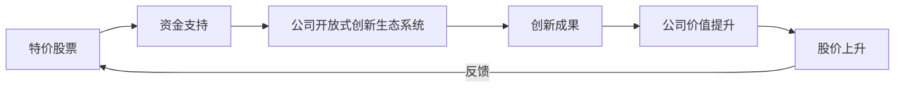

# 特价股票与公司开放式创新生态系统的潜在关联研究

> 关键词：特价股票、公司开放式创新生态系统、潜在关联、创新驱动、价值评估

> 摘要：本文旨在深入研究特价股票与公司开放式创新生态系统之间的潜在关联。通过对特价股票的定义、形成原因及特点进行剖析，同时详细阐述公司开放式创新生态系统的概念、构成要素和运行机制，分析两者之间可能存在的相互影响和作用。运用数学模型、实际案例等方法，探讨特价股票对开放式创新生态系统的支持作用以及创新生态系统对特价股票价值的提升。此外，还对相关实际应用场景、可利用的工具和资源进行介绍，最后总结未来发展趋势与挑战，并解答常见问题。

## 1. 背景介绍 
### 1.1 目的和范围
本研究的目的在于揭示特价股票与公司开放式创新生态系统之间隐藏的联系，为投资者、企业管理者和研究人员提供新的视角和决策依据。范围涵盖了特价股票的界定、公司开放式创新生态系统的各个层面，以及两者之间相互作用的机制和影响。通过理论分析、案例研究和数据验证，全面深入地探讨这一潜在关联。

### 1.2 预期读者
本文预期读者包括金融投资者，他们可以从特价股票与创新生态系统的关联中寻找投资机会；企业管理者，有助于他们认识到创新生态系统对公司股价的影响以及特价股票对创新的支持作用；学术研究人员，为相关领域的研究提供新的思路和方向；以及对金融和创新领域感兴趣的广大爱好者。

### 1.3 文档结构概述
本文首先介绍研究的背景信息，包括目的、预期读者和文档结构。接着阐述核心概念，如特价股票和公司开放式创新生态系统，并展示它们之间的联系。然后详细讲解核心算法原理和具体操作步骤，用数学模型和公式进行量化分析并举例说明。通过项目实战部分给出实际代码案例及详细解释。随后介绍实际应用场景和推荐相关工具和资源。最后进行总结，分析未来发展趋势与挑战，解答常见问题并提供扩展阅读和参考资料。

### 1.4 术语表
#### 1.4.1 核心术语定义
- **特价股票**：指市场价格低于其内在价值的股票。这种低价可能由于市场短期波动、信息不对称、行业竞争等多种因素导致。
- **公司开放式创新生态系统**：是公司与外部合作伙伴（如供应商、客户、科研机构、竞争对手等）共同构建的一个创新合作网络。通过资源共享、知识交流和协同创新，实现技术突破和业务增长。

#### 1.4.2 相关概念解释
- **内在价值**：是股票所代表的公司的真实价值，通常基于公司的资产、盈利能力、发展前景等因素进行评估。
- **协同创新**：指不同主体之间通过合作，整合各自的优势资源，共同开展创新活动，以实现创新效率和效果的提升。

#### 1.4.3 缩略词列表
- **ROI**：Return on Investment，投资回报率
- **R&D**：Research and Development，研究与开发

## 2. 核心概念与联系 

### 2.1 特价股票的概念和特点
特价股票是金融市场中一个引人关注的现象。其价格低于内在价值，可能是由于市场对公司的短期负面评价、行业整体不景气或者突发的市场事件等原因造成。从投资者的角度来看，特价股票具有潜在的投资价值，一旦市场对公司的认知发生改变，股价可能会出现大幅上涨。

### 2.2 公司开放式创新生态系统的概念和构成要素
公司开放式创新生态系统是一个复杂的网络，由多个要素构成。主要包括：
- **核心企业**：通常是发起和主导创新生态系统的公司，具有较强的资源整合能力和创新引领能力。
- **合作伙伴**：如供应商提供原材料和零部件创新，客户反馈需求信息促进产品创新，科研机构提供技术支持和人才培养。
- **创新资源**：包括资金、技术、知识、人才等，这些资源在生态系统中流动和共享，推动创新活动的开展。
- **创新机制**：如合作协议、激励机制、知识共享平台等，保障创新生态系统的有效运行。

### 2.3 特价股票与公司开放式创新生态系统的联系
特价股票与公司开放式创新生态系统之间存在着潜在的联系。一方面，特价股票可能为公司开放式创新生态系统提供资金支持。当公司股价被低估时，公司可以通过发行股票等方式以较低的成本筹集资金，用于投入创新项目。另一方面，一个良好的开放式创新生态系统可以提升公司的创新能力和竞争力，从而改善公司的基本面，使市场重新评估公司价值，推动股价上升，消除特价股票的状态。

### 2.4 核心概念原理和架构的文本示意图
特价股票与公司开放式创新生态系统的关系可以用以下示意图表示：

特价股票 <----> 资金支持 ----> 公司开放式创新生态系统
                         |
                         V
                 创新成果 ----> 公司价值提升 ----> 股价上升

### 2.5 Mermaid 流程图


## 3. 核心算法原理 & 具体操作步骤 

### 3.1 特价股票的价值评估算法
评估特价股票的价值是判断其与公司开放式创新生态系统关联的基础。常用的方法是基于现金流折现模型（DCF）。

#### 算法原理
现金流折现模型的基本思想是将公司未来的现金流按照一定的折现率折现到当前，得到公司的内在价值。公式如下：

$$V = \sum_{t=1}^{n} \frac{CF_t}{(1 + r)^t}$$

其中，$V$ 表示公司的内在价值，$CF_t$ 表示第 $t$ 期的现金流，$r$ 表示折现率，$n$ 表示预测的期数。

#### Python 代码实现
```python
def dcf_valuation(cash_flows, discount_rate):
    total_value = 0
    for i, cf in enumerate(cash_flows):
        total_value += cf / ((1 + discount_rate) ** (i + 1))
    return total_value

# 示例数据
cash_flows = [100, 120, 150, 180, 200]
discount_rate = 0.1

value = dcf_valuation(cash_flows, discount_rate)
print(f"公司的内在价值为: {value}")
```

### 3.2 开放式创新生态系统的创新绩效评估算法
评估开放式创新生态系统的创新绩效可以使用创新产出指标和创新效率指标。

#### 算法原理
创新产出指标可以用专利数量、新产品销售额等表示。创新效率指标可以用研发投入产出比来衡量，公式如下：

$$R\&D\ Efficiency = \frac{Innovation\ Output}{R\&D\ Investment}$$

#### Python 代码实现
```python
def rnd_efficiency(innovation_output, rnd_investment):
    return innovation_output / rnd_investment

# 示例数据
innovation_output = 500
rnd_investment = 200

efficiency = rnd_efficiency(innovation_output, rnd_investment)
print(f"创新效率为: {efficiency}")
```

### 3.3 具体操作步骤
1. **数据收集**：收集公司的财务数据、创新相关数据（如专利信息、研发投入等）。
2. **特价股票价值评估**：使用现金流折现模型等方法评估公司股票的内在价值，与市场价格对比判断是否为特价股票。
3. **开放式创新生态系统评估**：计算创新产出指标和创新效率指标，评估创新生态系统的绩效。
4. **关联分析**：分析特价股票与创新生态系统之间的关系，如特价股票筹集的资金对创新投入的影响，创新成果对股价的影响等。

## 4. 数学模型和公式 & 详细讲解 & 举例说明 

### 4.1 特价股票与创新投入的关系模型
假设公司通过发行特价股票筹集的资金为 $F$，用于创新投入的比例为 $\alpha$，则创新投入 $I$ 可以表示为：

$$I = \alpha F$$

#### 详细讲解
$\alpha$ 表示公司将筹集资金用于创新的意愿和能力。当 $\alpha$ 较大时，说明公司更倾向于将资金投入到创新活动中，有利于开放式创新生态系统的发展。

#### 举例说明
假设某公司发行特价股票筹集了 1000 万元资金，$\alpha = 0.6$，则创新投入 $I = 0.6 \times 1000 = 600$ 万元。

### 4.2 创新产出与公司价值的关系模型
假设创新产出 $O$ 与公司价值 $V$ 之间存在线性关系：

$$V = \beta O + \gamma$$

其中，$\beta$ 表示创新产出对公司价值的边际贡献，$\gamma$ 表示其他因素对公司价值的影响。

#### 详细讲解
$\beta$ 反映了创新产出对公司价值的提升程度。当 $\beta$ 较大时，说明创新产出对公司价值的影响显著。

#### 举例说明
假设 $\beta = 2$，$\gamma = 100$，创新产出 $O = 200$，则公司价值 $V = 2 \times 200 + 100 = 500$。

### 4.3 股价与公司价值的关系模型
根据有效市场假说，股价 $P$ 应该反映公司的内在价值 $V$，但实际中存在一定的偏差：

$$P = kV + \epsilon$$

其中，$k$ 表示市场对公司价值的定价系数，$\epsilon$ 表示随机误差。

#### 详细讲解
$k$ 受市场情绪、宏观经济环境等因素影响。当 $k > 1$ 时，股价高于公司内在价值；当 $k < 1$ 时，股价低于公司内在价值，可能出现特价股票。

#### 举例说明
假设 $k = 0.8$，公司内在价值 $V = 500$，则股价 $P = 0.8 \times 500 = 400$。

## 5. 项目实战：代码实际案例和详细解释说明 

### 5.1  开发环境搭建
- **操作系统**：Windows 10 或 macOS
- **编程语言**：Python 3.7 及以上
- **开发工具**：PyCharm 或 Jupyter Notebook
- **所需库**：`pandas`、`numpy`、`matplotlib`

安装所需库的命令如下：
```sh
pip install pandas numpy matplotlib
```

### 5.2  源代码详细实现和代码解读
#### 数据收集和预处理
```python
import pandas as pd

# 模拟收集公司的财务数据和创新数据
data = {
    'Year': [2016, 2017, 2018, 2019, 2020],
    'Cash_Flow': [100, 120, 150, 180, 200],
    'R&D_Investment': [20, 25, 30, 35, 40],
    'Patent_Number': [5, 6, 8, 10, 12]
}

df = pd.DataFrame(data)

# 数据预处理：计算创新产出（假设以专利数量表示）和研发效率
df['Innovation_Output'] = df['Patent_Number']
df['R&D_Efficiency'] = df['Innovation_Output'] / df['R&D_Investment']

print(df)
```
代码解读：首先使用 `pandas` 库创建一个包含公司财务数据和创新数据的 DataFrame。然后计算创新产出和研发效率，并将结果添加到 DataFrame 中。

#### 特价股票价值评估
```python
discount_rate = 0.1

def dcf_valuation(cash_flows, discount_rate):
    total_value = 0
    for i, cf in enumerate(cash_flows):
        total_value += cf / ((1 + discount_rate) ** (i + 1))
    return total_value

cash_flows = df['Cash_Flow'].tolist()
value = dcf_valuation(cash_flows, discount_rate)
print(f"公司的内在价值为: {value}")
```
代码解读：定义了现金流折现模型的函数 `dcf_valuation`，并使用 DataFrame 中的现金流数据计算公司的内在价值。

#### 创新绩效评估
```python
innovation_output = df['Innovation_Output'].sum()
rnd_investment = df['R&D_Investment'].sum()

efficiency = rnd_efficiency(innovation_output, rnd_investment)
print(f"创新效率为: {efficiency}")
```
代码解读：计算总的创新产出和研发投入，然后使用之前定义的 `rnd_efficiency` 函数计算创新效率。

### 5.3  代码解读与分析
通过以上代码，我们完成了数据收集、预处理、特价股票价值评估和创新绩效评估的任务。从数据预处理中可以清晰地看到公司的财务和创新数据的变化趋势。特价股票价值评估让我们了解公司的内在价值，与市场价格对比可以判断是否为特价股票。创新绩效评估则反映了公司开放式创新生态系统的运行效率。通过这些分析，我们可以进一步探讨特价股票与创新生态系统之间的关联。

## 6. 实际应用场景 
### 6.1 投资决策
投资者可以通过分析特价股票与公司开放式创新生态系统的关联，寻找具有潜在价值的投资机会。如果一家公司的股票被低估，且其开放式创新生态系统运行良好，有较高的创新潜力，那么该股票可能是一个很好的投资选择。

### 6.2 企业战略规划
企业管理者可以认识到特价股票对创新生态系统的资金支持作用，在股价被低估时，合理利用股票发行等方式筹集资金，加大创新投入，推动开放式创新生态系统的发展。同时，通过提升创新绩效，改善公司基本面，提升股价。

### 6.3 政策制定
政府和监管机构可以根据特价股票与创新生态系统的关系，制定相关政策，鼓励企业开展开放式创新活动。例如，对通过发行特价股票筹集资金用于创新的企业给予税收优惠等支持。

## 7. 工具和资源推荐
### 7.1 学习资源推荐
#### 7.1.1 书籍推荐
- 《金融市场与金融机构》：全面介绍金融市场的基本原理和金融机构的运作，有助于了解股票市场的基本知识。
- 《创新管理：技术、市场与组织变革的集成》：深入探讨企业创新管理的理论和实践，对理解公司开放式创新生态系统有很大帮助。

#### 7.1.2 在线课程
- Coursera 上的“Financial Markets”：由耶鲁大学教授授课，讲解金融市场的各种概念和投资策略。
- edX 上的“Open Innovation: Strategies and Models”：介绍开放式创新的战略和模式，提升对开放式创新生态系统的认识。

#### 7.1.3 技术博客和网站
- Seeking Alpha：提供大量的股票分析和投资建议，有助于了解特价股票的市场动态。
- Harvard Business Review：发表关于企业管理和创新的前沿文章，对研究公司开放式创新生态系统有参考价值。

### 7.2 开发工具框架推荐
#### 7.2.1 IDE和编辑器
- PyCharm：功能强大的 Python 集成开发环境，适合进行数据分析和代码开发。
- Jupyter Notebook：交互式的编程环境，方便进行数据探索和代码演示。

#### 7.2.2 调试和性能分析工具
- PDB：Python 自带的调试器，可用于调试 Python 代码。
- cProfile：Python 标准库中的性能分析工具，可帮助分析代码的性能瓶颈。

#### 7.2.3 相关框架和库
- Pandas：用于数据处理和分析的 Python 库，提供了丰富的数据结构和数据操作方法。
- Numpy：高性能的数值计算库，支持大规模数组和矩阵运算。
- Matplotlib：用于数据可视化的 Python 库，可绘制各种图表。

### 7.3 相关论文著作推荐
#### 7.3.1 经典论文
- Chesbrough, H. W. (2003). Open innovation: The new imperative for creating and profiting from technology. Harvard Business School Press. 该论文首次提出了开放式创新的概念，对开放式创新理论的发展具有重要意义。
- Fama, E. F., & French, K. R. (1992). The cross-section of expected stock returns. Journal of Finance, 47(2), 427-465. 提出了著名的 Fama-French 三因子模型，用于解释股票收益率的差异。

#### 7.3.2 最新研究成果
- 关注顶级学术期刊如《Management Science》、《Strategic Management Journal》等，上面会发表关于创新管理和金融市场的最新研究成果。

#### 7.3.3 应用案例分析
- 一些商业杂志如《Fortune》、《Businessweek》会报道企业的创新实践和金融案例，可从中学习特价股票与开放式创新生态系统关联的实际应用。

## 8. 总结：未来发展趋势与挑战
### 8.1 未来发展趋势
- **数据驱动的决策**：随着大数据和人工智能技术的发展，未来对特价股票和开放式创新生态系统的分析将更加依赖数据。通过挖掘海量的市场数据和企业创新数据，能够更准确地评估两者之间的关联，为投资和企业决策提供更科学的依据。
- **跨界融合创新**：开放式创新生态系统将进一步跨越行业边界，不同行业的企业之间开展更广泛的合作创新。特价股票可能成为促进这种跨界融合创新的重要资金来源，推动新兴产业的发展。
- **政策支持加强**：政府和监管机构将更加重视企业的创新发展，出台更多支持政策。例如，鼓励企业通过发行特价股票筹集资金用于创新，为开放式创新生态系统的建设提供良好的政策环境。

### 8.2 挑战
- **数据质量和隐私问题**：数据驱动的分析依赖于高质量的数据，但市场数据和企业创新数据可能存在不准确、不完整的问题。同时，数据隐私保护也是一个重要挑战，如何在保护数据隐私的前提下进行有效的数据分析是需要解决的问题。
- **创新不确定性**：开放式创新生态系统中的创新活动具有较高的不确定性，创新成果不一定能够转化为实际的经济效益。特价股票筹集的资金投入到创新项目中，可能面临失败的风险，影响公司的财务状况和股价。
- **市场波动和风险**：股票市场受到宏观经济环境、政策变化等多种因素的影响，具有较大的波动性。特价股票的价格可能受到市场波动的影响，难以准确判断其与开放式创新生态系统的关联。

## 9. 附录：常见问题与解答
### 9.1 如何准确判断一只股票是否为特价股票？
判断一只股票是否为特价股票需要综合考虑多个因素。可以使用现金流折现模型等方法评估公司的内在价值，与市场价格进行对比。同时，还需要分析公司的基本面，如盈利能力、行业地位、创新能力等。此外，市场情绪和宏观经济环境也会影响股票价格，需要进行全面的分析。

### 9.2 开放式创新生态系统中的合作伙伴选择有哪些标准？
选择合作伙伴时，需要考虑以下标准：
- **资源互补性**：合作伙伴应具备与核心企业不同的资源和能力，能够实现资源共享和优势互补。
- **创新能力**：合作伙伴应具有较强的创新能力，能够为创新生态系统带来新的技术和思路。
- **合作意愿**：合作伙伴应具有良好的合作意愿，愿意与核心企业共同开展创新活动，分享创新成果。
- **信誉和可靠性**：合作伙伴应具有良好的信誉和可靠性，能够保证合作的顺利进行。

### 9.3 特价股票筹集的资金一定能促进开放式创新生态系统的发展吗？
不一定。虽然特价股票筹集的资金可以为创新生态系统提供资金支持，但资金的使用效率和创新项目的实施效果受到多种因素的影响。如果公司没有合理规划资金的使用，或者创新项目的管理不善，资金可能无法有效促进创新生态系统的发展。此外，创新活动本身具有不确定性，即使有资金投入，也不一定能够取得预期的创新成果。

## 10. 扩展阅读 & 参考资料
### 扩展阅读
- 《创新者的窘境》：探讨了企业在创新过程中面临的挑战和困境，对理解开放式创新生态系统的发展有一定的启示。
- 《聪明的投资者》：投资领域的经典著作，介绍了价值投资的理念和方法，有助于深入理解特价股票的投资价值。

### 参考资料
- 相关学术期刊和论文，如《Journal of Financial Economics》、《Research Policy》等。
- 金融数据提供商的报告和分析，如 Bloomberg、Wind 等。
- 企业的年报和公告，可获取公司的财务数据和创新信息。

作者：AI天才研究院/AI Genius Institute & 禅与计算机程序设计艺术 /Zen And The Art of Computer Programming