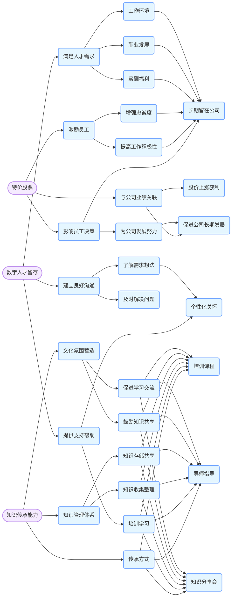

# 特价股票与公司数字人才留存与知识传承能力的关系探讨

> 关键词：特价股票；数字人才留存；知识传承能力；公司治理；激励机制

> 摘要：本文旨在深入探讨特价股票与公司数字人才留存以及知识传承能力之间的关系。通过对相关核心概念的阐述、算法原理的分析、数学模型的构建，结合实际案例进行研究。首先介绍了研究的背景、目的和范围，明确预期读者和文档结构。接着详细解释核心概念及其联系，阐述核心算法原理和操作步骤。利用数学模型和公式进一步分析三者之间的关系，并通过举例进行说明。在项目实战部分，给出代码实际案例及详细解读。最后探讨了实际应用场景，推荐了相关工具和资源，总结未来发展趋势与挑战，解答常见问题并提供扩展阅读和参考资料。

## 1. 背景介绍 
### 1.1 目的和范围
在当今数字化时代，数字人才对于公司的发展至关重要。公司不仅需要吸引优秀的数字人才，更要注重人才的留存和知识的传承，以保持持续的创新能力和竞争力。特价股票作为一种激励手段，在公司治理中被广泛应用。本研究的目的在于深入探究特价股票与公司数字人才留存以及知识传承能力之间的内在联系，分析特价股票如何影响数字人才的决策，以及对公司知识传承产生的作用。研究范围涵盖了不同行业、不同规模的公司，通过理论分析和实际案例相结合的方式进行全面研究。

### 1.2 预期读者
本文的预期读者主要包括公司管理层、人力资源专家、金融分析师、学术研究人员以及对公司治理和人才管理感兴趣的人士。公司管理层可以从中获取关于如何利用特价股票激励数字人才、提高人才留存率和知识传承能力的策略和建议；人力资源专家可以了解特价股票在人才激励体系中的应用和效果；金融分析师可以从财务和市场的角度分析特价股票对公司价值的影响；学术研究人员可以在此基础上进行更深入的理论研究；对公司治理和人才管理感兴趣的人士可以获得相关的知识和见解。

### 1.3 文档结构概述
本文共分为十个部分。第一部分为背景介绍，阐述研究的目的、范围、预期读者和文档结构概述，并给出术语表。第二部分介绍核心概念与联系，包括特价股票、数字人才留存和知识传承能力的定义、原理和架构，同时给出文本示意图和 Mermaid 流程图。第三部分讲解核心算法原理和具体操作步骤，使用 Python 源代码进行详细阐述。第四部分构建数学模型和公式，详细讲解其含义，并通过举例进行说明。第五部分为项目实战，包括开发环境搭建、源代码详细实现和代码解读以及代码分析。第六部分探讨实际应用场景。第七部分推荐相关的工具和资源，包括学习资源、开发工具框架和相关论文著作。第八部分总结未来发展趋势与挑战。第九部分为附录，解答常见问题。第十部分提供扩展阅读和参考资料。

### 1.4 术语表
#### 1.4.1 核心术语定义
- **特价股票**：指公司以低于市场价格向特定对象（如员工、管理层等）发行的股票，通常作为一种激励手段，旨在提高员工的工作积极性和忠诚度，促进公司的长期发展。
- **数字人才留存**：指公司能够吸引和保留具有数字化技能和知识的人才，使其在公司内长期工作，为公司的数字化转型和发展做出贡献。
- **知识传承能力**：指公司在人才流动的情况下，能够有效地将老员工的知识和经验传递给新员工，确保公司的知识体系得以延续和发展，提高公司的整体竞争力。

#### 1.4.2 相关概念解释
- **股权激励**：是一种通过给予员工公司股权的方式，使员工成为公司的所有者之一，从而将员工的利益与公司的利益紧密结合，激励员工为公司的长期发展努力工作的激励机制。特价股票是股权激励的一种形式。
- **数字技能**：指在数字化时代，人们所具备的利用数字技术进行信息处理、数据分析、软件开发、网络营销等方面的能力。
- **知识管理**：指公司对其内部的知识资源进行有效的收集、整理、存储、传播和应用的过程，以提高公司的创新能力和竞争力。知识传承是知识管理的重要环节。

#### 1.4.3 缩略词列表
- **HR**：Human Resources，人力资源
- **ROI**：Return on Investment，投资回报率
- **AI**：Artificial Intelligence，人工智能
- **ML**：Machine Learning，机器学习

## 2. 核心概念与联系 
### 核心概念原理
#### 特价股票
特价股票的原理基于股权激励的思想。公司通过向员工提供特价股票，使员工成为公司的股东之一，分享公司的发展成果。员工持有特价股票后，其个人利益与公司的股价表现和长期发展紧密相关。当公司业绩良好、股价上涨时，员工持有的股票价值也会增加，从而获得经济上的回报。这种激励机制可以提高员工的工作积极性和忠诚度，促使他们更加努力地为公司工作，为公司的长期发展贡献力量。

#### 数字人才留存
数字人才留存的原理在于满足数字人才的需求和期望。数字人才通常具有较高的技能水平和创新能力，他们对工作环境、职业发展机会、薪酬待遇等方面有较高的要求。公司要想留住数字人才，需要提供具有竞争力的薪酬福利、良好的工作氛围、丰富的学习和成长机会以及广阔的职业发展空间。同时，公司还需要关注数字人才的个性化需求，建立良好的沟通机制，及时了解他们的想法和需求，为他们提供必要的支持和帮助。

#### 知识传承能力
知识传承能力的原理在于建立有效的知识管理体系。公司需要将老员工的知识和经验进行系统的整理和存储，形成知识资产。然后通过培训、导师制度、知识分享会等方式，将这些知识资产传递给新员工。同时，公司还需要营造一种知识共享的文化氛围，鼓励员工之间相互学习和交流，促进知识的传承和创新。

### 架构的文本示意图
```plaintext
特价股票
├── 激励员工
│   ├── 提高工作积极性
│   ├── 增强忠诚度
├── 影响员工决策
│   ├── 长期留在公司
│   ├── 为公司发展努力
├── 与公司业绩关联
│   ├── 股价上涨获利
│   ├── 促进公司长期发展

数字人才留存
├── 满足人才需求
│   ├── 薪酬福利
│   ├── 职业发展
│   ├── 工作环境
├── 提供支持帮助
│   ├── 培训学习
│   ├── 个性化关怀
├── 建立良好沟通
│   ├── 了解需求想法
│   ├── 及时解决问题

知识传承能力
├── 知识管理体系
│   ├── 知识收集整理
│   ├── 知识存储共享
├── 传承方式
│   ├── 培训课程
│   ├── 导师指导
│   ├── 知识分享会
├── 文化氛围营造
│   ├── 鼓励知识共享
│   ├── 促进学习交流
```

### Mermaid 流程图


从流程图中可以看出，特价股票通过激励员工和影响员工决策，促进公司长期发展，同时也有助于数字人才的留存。数字人才留存过程中提供的培训学习等支持帮助以及知识管理体系的建立，都与知识传承能力的提升密切相关。知识传承能力的提升又可以进一步促进数字人才的发展和公司的长期发展，形成一个良性循环。

## 3. 核心算法原理 & 具体操作步骤 
### 核心算法原理
我们可以使用一个简单的决策模型来分析特价股票对数字人才留存的影响。假设数字人才在考虑是否留在公司时，会综合考虑多个因素，包括薪酬待遇、职业发展机会、工作环境、特价股票的潜在收益等。我们可以将这些因素量化，然后通过加权求和的方式得到一个综合得分，根据综合得分来判断数字人才是否会留在公司。

设数字人才考虑的因素有 $n$ 个，分别为 $x_1, x_2, \cdots, x_n$，对应的权重为 $w_1, w_2, \cdots, w_n$，其中 $x_i$ 表示第 $i$ 个因素的量化得分，$w_i$ 表示第 $i$ 个因素的权重，且 $\sum_{i=1}^{n} w_i = 1$。则综合得分 $S$ 可以表示为：

$$S = \sum_{i=1}^{n} w_i x_i$$

当 $S$ 大于某个阈值 $T$ 时，数字人才会选择留在公司；当 $S$ 小于等于 $T$ 时，数字人才可能会选择离开公司。

### 具体操作步骤
#### 步骤 1：确定考虑的因素和权重
首先，需要确定数字人才在考虑是否留在公司时会考虑的因素。常见的因素包括薪酬待遇、职业发展机会、工作环境、特价股票的潜在收益等。然后，根据公司的实际情况和数字人才的需求，确定每个因素的权重。例如，可以通过问卷调查、专家评估等方式来确定权重。

#### 步骤 2：量化每个因素的得分
对于每个因素，需要将其量化为一个具体的得分。例如，薪酬待遇可以根据数字人才的实际工资、奖金、福利等进行量化；职业发展机会可以根据公司提供的培训课程、晋升空间等进行量化；工作环境可以根据办公设施、团队氛围等进行量化；特价股票的潜在收益可以根据当前股价、预计股价涨幅等进行量化。

#### 步骤 3：计算综合得分
根据上述公式，将每个因素的得分和对应的权重代入，计算出综合得分 $S$。

#### 步骤 4：判断数字人才是否会留在公司
将计算得到的综合得分 $S$ 与阈值 $T$ 进行比较。如果 $S > T$，则认为数字人才会留在公司；如果 $S \leq T$，则认为数字人才可能会离开公司。

### Python 源代码实现
```python
# 定义考虑的因素和权重
factors = ['薪酬待遇', '职业发展机会', '工作环境', '特价股票潜在收益']
weights = [0.3, 0.3, 0.2, 0.2]

# 量化每个因素的得分
scores = {
    '薪酬待遇': 80,
    '职业发展机会': 70,
    '工作环境': 75,
    '特价股票潜在收益': 85
}

# 计算综合得分
S = 0
for i in range(len(factors)):
    factor = factors[i]
    weight = weights[i]
    score = scores[factor]
    S += weight * score

# 设定阈值
T = 75

# 判断数字人才是否会留在公司
if S > T:
    print("数字人才会留在公司")
else:
    print("数字人才可能会离开公司")
```

### 代码解释
- 首先，定义了考虑的因素和对应的权重。这里将薪酬待遇、职业发展机会、工作环境和特价股票潜在收益作为考虑的因素，并分别赋予了相应的权重。
- 然后，使用字典 `scores` 来存储每个因素的量化得分。
- 接着，通过循环遍历每个因素，将其得分和对应的权重相乘，并累加到综合得分 $S$ 中。
- 最后，设定阈值 $T$，并将综合得分 $S$ 与阈值进行比较，根据比较结果输出数字人才是否会留在公司的判断。

## 4. 数学模型和公式 & 详细讲解 & 举例说明 
### 数学模型和公式
#### 特价股票对数字人才留存的影响模型
设 $R$ 表示数字人才留存率，$P$ 表示特价股票的吸引力，$C$ 表示公司其他方面的综合吸引力（包括薪酬待遇、职业发展机会、工作环境等），$k_1$ 和 $k_2$ 为系数。则可以建立如下的线性模型：

$$R = k_1 P + k_2 C$$

其中，$P$ 可以通过特价股票的折扣率、预计股价涨幅等因素来衡量；$C$ 可以通过综合得分 $S$ 来表示。

#### 知识传承能力的评估模型
设 $K$ 表示知识传承能力，$N_1$ 表示知识收集和整理的效率，$N_2$ 表示知识存储和共享的效果，$N_3$ 表示知识传承方式的有效性，$a_1$、$a_2$ 和 $a_3$ 为系数。则可以建立如下的线性模型：

$$K = a_1 N_1 + a_2 N_2 + a_3 N_3$$

### 详细讲解
#### 特价股票对数字人才留存的影响模型
该模型表明，数字人才留存率 $R$ 与特价股票的吸引力 $P$ 和公司其他方面的综合吸引力 $C$ 呈线性关系。系数 $k_1$ 和 $k_2$ 表示特价股票和公司其他方面对数字人才留存率的影响程度。如果 $k_1$ 较大，说明特价股票对数字人才留存率的影响较大；如果 $k_2$ 较大，说明公司其他方面对数字人才留存率的影响较大。

#### 知识传承能力的评估模型
该模型表明，知识传承能力 $K$ 与知识收集和整理的效率 $N_1$、知识存储和共享的效果 $N_2$ 以及知识传承方式的有效性 $N_3$ 呈线性关系。系数 $a_1$、$a_2$ 和 $a_3$ 表示这三个因素对知识传承能力的影响程度。通过评估这三个因素的得分，可以计算出公司的知识传承能力。

### 举例说明
#### 特价股票对数字人才留存的影响模型举例
假设某公司的特价股票折扣率为 20%，预计股价涨幅为 30%，经过量化计算得到特价股票的吸引力 $P = 80$。公司其他方面的综合得分 $S = 75$，即公司其他方面的综合吸引力 $C = 75$。已知系数 $k_1 = 0.4$，$k_2 = 0.6$。则可以计算出数字人才留存率 $R$：

$$R = 0.4 \times 80 + 0.6 \times 75 = 32 + 45 = 77$$

这意味着该公司的数字人才留存率预计为 77%。

#### 知识传承能力的评估模型举例
假设某公司的知识收集和整理的效率 $N_1 = 80$，知识存储和共享的效果 $N_2 = 75$，知识传承方式的有效性 $N_3 = 85$。已知系数 $a_1 = 0.3$，$a_2 = 0.3$，$a_3 = 0.4$。则可以计算出公司的知识传承能力 $K$：

$$K = 0.3 \times 80 + 0.3 \times 75 + 0.4 \times 85 = 24 + 22.5 + 34 = 80.5$$

这意味着该公司的知识传承能力评分为 80.5 分。

## 5. 项目实战：代码实际案例和详细解释说明 
### 5.1  开发环境搭建
为了实现上述算法和模型，我们可以使用 Python 编程语言。以下是开发环境搭建的步骤：

#### 步骤 1：安装 Python
首先，需要从 Python 官方网站（https://www.python.org/downloads/）下载并安装 Python。建议安装 Python 3.7 及以上版本。

#### 步骤 2：安装必要的库
我们需要安装一些必要的 Python 库，如 `numpy` 和 `pandas`。可以使用以下命令来安装：

```sh
pip install numpy pandas
```

#### 步骤 3：选择开发工具
可以选择使用集成开发环境（IDE），如 PyCharm、Jupyter Notebook 等。这里我们选择使用 Jupyter Notebook，它可以方便地进行代码编写、调试和可视化。可以使用以下命令来安装 Jupyter Notebook：

```sh
pip install jupyter
```

安装完成后，可以在命令行中输入以下命令启动 Jupyter Notebook：

```sh
jupyter notebook
```

### 5.2  源代码详细实现和代码解读
#### 实现特价股票对数字人才留存的影响模型
```python
import numpy as np

# 定义系数
k1 = 0.4
k2 = 0.6

# 定义特价股票的吸引力和公司其他方面的综合吸引力
P = 80
C = 75

# 计算数字人才留存率
R = k1 * P + k2 * C

print(f"数字人才留存率: {R}%")
```

#### 代码解读
- 首先，导入了 `numpy` 库，虽然在这个简单的示例中没有直接使用 `numpy`，但在实际应用中可能会用到它进行数值计算。
- 然后，定义了系数 $k_1$ 和 $k_2$，以及特价股票的吸引力 $P$ 和公司其他方面的综合吸引力 $C$。
- 接着，根据公式 $R = k_1 P + k_2 C$ 计算数字人才留存率 $R$。
- 最后，使用 `print` 函数输出数字人才留存率。

#### 实现知识传承能力的评估模型
```python
import numpy as np

# 定义系数
a1 = 0.3
a2 = 0.3
a3 = 0.4

# 定义知识收集和整理的效率、知识存储和共享的效果、知识传承方式的有效性
N1 = 80
N2 = 75
N3 = 85

# 计算知识传承能力
K = a1 * N1 + a2 * N2 + a3 * N3

print(f"知识传承能力评分: {K}")
```

#### 代码解读
- 同样，导入了 `numpy` 库。
- 定义了系数 $a_1$、$a_2$ 和 $a_3$，以及知识收集和整理的效率 $N_1$、知识存储和共享的效果 $N_2$ 和知识传承方式的有效性 $N_3$。
- 根据公式 $K = a_1 N_1 + a_2 N_2 + a_3 N_3$ 计算知识传承能力 $K$。
- 使用 `print` 函数输出知识传承能力评分。

### 5.3  代码解读与分析
#### 代码优点
- 代码结构简单，易于理解和实现。通过使用线性模型，将复杂的问题简化为简单的数学计算，方便进行分析和预测。
- 代码具有一定的可扩展性。可以根据实际情况调整系数和输入参数，以适应不同的公司和场景。

#### 代码局限性
- 模型过于简化。实际情况中，数字人才留存和知识传承能力受到多种因素的影响，这些因素之间可能存在复杂的非线性关系，而线性模型无法准确地描述这些关系。
- 输入参数的确定具有一定的主观性。例如，特价股票的吸引力、公司其他方面的综合吸引力等参数的量化可能存在一定的误差，这会影响模型的准确性。

## 6. 实际应用场景 
### 吸引和留住数字人才
公司可以通过提供特价股票来吸引和留住优秀的数字人才。对于数字人才来说，特价股票不仅是一种经济上的激励，更是对他们能力和贡献的认可。当数字人才看到自己的利益与公司的发展紧密相关时，他们会更有动力为公司努力工作，并且更愿意长期留在公司。例如，一些科技公司会向新入职的数字人才提供一定数量的特价股票，作为入职奖励。这些数字人才在获得特价股票后，会更加关注公司的发展，积极参与公司的项目，为公司的创新和发展做出贡献。

### 促进知识传承
特价股票可以与知识传承机制相结合，促进公司内部的知识传承。公司可以设立知识传承奖励机制，对于在知识传承方面做出贡献的员工给予一定数量的特价股票作为奖励。这样可以激励老员工积极地将自己的知识和经验传授给新员工，同时也可以提高新员工学习和吸收知识的积极性。例如，某公司规定，老员工每成功培养一名新员工，并且新员工在一定时间内能够独立完成工作任务，老员工就可以获得一定数量的特价股票。通过这种方式，公司有效地促进了知识的传承，提高了公司的整体竞争力。

### 提高公司业绩和股价
当公司通过特价股票激励数字人才，提高了人才留存率和知识传承能力后，公司的创新能力和运营效率会得到提升，从而促进公司业绩的增长。公司业绩的增长又会推动股价的上涨，使持有特价股票的员工获得更高的收益。这种良性循环可以进一步增强员工的忠诚度和工作积极性，促进公司的长期发展。例如，一家互联网公司通过实施特价股票激励计划，吸引和留住了大量优秀的数字人才，公司的业务不断拓展，业绩持续增长，股价也随之大幅上涨。持有特价股票的员工获得了丰厚的回报，同时也更加坚定了为公司长期服务的决心。

## 7. 工具和资源推荐
### 7.1 学习资源推荐
#### 7.1.1 书籍推荐
- 《股权激励实战手册》：本书详细介绍了股权激励的理论和实践，包括股权激励的模式、方案设计、实施步骤等内容，对于理解特价股票等股权激励手段具有重要的参考价值。
- 《数字人才管理》：探讨了数字时代人才管理的特点和方法，介绍了如何吸引、培养和留住数字人才，以及如何促进数字人才的知识传承和创新。
- 《知识管理：理论与实践》：系统阐述了知识管理的基本概念、方法和技术，对于建立有效的知识传承体系具有重要的指导意义。

#### 7.1.2 在线课程
- Coursera 上的“Corporate Finance”：该课程涵盖了公司金融的基本理论和方法，包括股权激励等内容，通过学习该课程可以深入了解特价股票的财务原理和应用。
- edX 上的“Digital Talent Management in the 21st Century”：专门介绍了数字时代的人才管理策略和方法，对于提升数字人才留存和知识传承能力具有重要的启示作用。
- Udemy 上的“Knowledge Management for Business Success”：提供了知识管理的实践案例和操作技巧，帮助学习者掌握知识传承的有效方法。

#### 7.1.3 技术博客和网站
- Harvard Business Review（https://hbr.org/）：提供了丰富的商业管理和人力资源管理方面的文章和研究成果，对于了解特价股票、数字人才留存和知识传承等领域的最新趋势和最佳实践具有重要的参考价值。
- McKinsey & Company（https://www.mckinsey.com/）：全球著名的管理咨询公司，其网站上发布了许多关于企业战略、人才管理和知识管理的研究报告和分析文章，具有很高的权威性和实用性。
- TechCrunch（https://techcrunch.com/）：专注于科技行业的新闻和分析，对于了解数字人才市场的动态和科技公司的人才管理策略具有重要的帮助。

### 7.2 开发工具框架推荐
#### 7.2.1 IDE和编辑器
- PyCharm：是一款专门为 Python 开发设计的集成开发环境，具有代码自动补全、调试、版本控制等功能，适合开发 Python 程序，实现上述算法和模型。
- Jupyter Notebook：是一个基于 Web 的交互式计算环境，支持多种编程语言，尤其适合数据科学和机器学习领域的开发。可以方便地进行代码编写、调试和可视化，对于分析和展示数据具有很大的优势。

#### 7.2.2 调试和性能分析工具
- PDB：Python 自带的调试器，可以帮助开发者定位和解决代码中的问题。通过设置断点、单步执行等功能，可以深入了解代码的执行过程。
- cProfile：Python 标准库中的性能分析工具，可以分析代码的运行时间和函数调用次数，帮助开发者找出代码中的性能瓶颈，进行优化。

#### 7.2.3 相关框架和库
- NumPy：是 Python 中用于科学计算的基础库，提供了高效的多维数组对象和各种数学函数，对于实现上述算法和模型中的数值计算非常有用。
- Pandas：是 Python 中用于数据处理和分析的库，提供了数据结构和数据操作工具，如数据读取、清洗、转换等，方便处理和分析与特价股票、数字人才留存和知识传承相关的数据。

### 7.3 相关论文著作推荐
#### 7.3.1 经典论文
- Jensen, M. C., & Meckling, W. H. (1976). Theory of the firm: managerial behavior, agency costs and ownership structure. Journal of Financial Economics, 3(4), 305-360. 该论文提出了代理理论，探讨了公司所有权结构和管理层行为之间的关系，为股权激励的研究奠定了理论基础。
- Becker, G. S. (1964). Human capital: a theoretical and empirical analysis, with special reference to education. National Bureau of Economic Research. 该著作是人力资本理论的经典之作，对于理解数字人才的价值和培养具有重要的启示作用。

#### 7.3.2 最新研究成果
- Aghion, P., & Tirole, J. (1994). The management of innovation. The Quarterly Journal of Economics, 109(4), 1185-1209. 该论文研究了企业创新的管理机制，对于探讨特价股票如何激励数字人才进行创新具有一定的参考价值。
- Cappelli, P., & Keller, J. (2014). Talent management: concept, practice, and research. Annual Review of Organizational Psychology and Organizational Behavior, 1, 305-334. 该论文对人才管理的概念、实践和研究进行了综述，为数字人才留存和知识传承的研究提供了新的视角。

#### 7.3.3 应用案例分析
- Harvard Business School Case Studies：哈佛商学院的案例研究提供了许多实际企业的案例，包括一些公司如何使用特价股票激励员工、提高人才留存率和促进知识传承的案例。通过分析这些案例，可以学习到实际应用中的经验和教训。

## 8. 总结：未来发展趋势与挑战
### 未来发展趋势
#### 个性化激励方案
随着数字人才的个性化需求越来越突出，未来公司可能会根据不同数字人才的特点和需求，制定更加个性化的特价股票激励方案。例如，对于具有不同技能和经验的数字人才，提供不同数量和条件的特价股票，以更好地满足他们的需求，提高激励效果。

#### 与数字化技术深度融合
随着数字化技术的不断发展，特价股票的管理和激励过程可能会与数字化技术深度融合。例如，利用区块链技术实现特价股票的发行、交易和管理，提高透明度和安全性；利用人工智能和大数据技术分析数字人才的行为和需求，优化特价股票激励方案。

#### 跨企业知识传承合作
未来，不同企业之间可能会加强在数字人才知识传承方面的合作。通过共享知识和经验，实现跨企业的知识传承，提高整个行业的创新能力和竞争力。例如，企业之间可以建立知识共享平台，组织联合培训和交流活动等。

### 挑战
#### 法律法规的限制
特价股票的发行和管理受到法律法规的严格限制。不同国家和地区的法律法规可能存在差异，公司在实施特价股票激励计划时需要遵守相关法律法规，否则可能会面临法律风险。例如，一些国家对股权激励的股份来源、发行对象、行权条件等方面都有明确的规定。

#### 市场波动的影响
特价股票的价值与公司的股价密切相关，而股价受到市场波动的影响较大。当市场行情不好时，公司的股价可能会下跌，导致持有特价股票的员工收益减少，从而影响激励效果。此外，市场波动还可能导致数字人才对公司的信心下降，增加人才流失的风险。

#### 知识传承的难度
知识传承是一个复杂的过程，受到多种因素的影响。例如，老员工可能不愿意分享自己的知识和经验，新员工可能缺乏学习的积极性和能力等。此外，随着技术的不断更新换代，知识的更新速度也越来越快，如何及时、有效地将新知识传递给员工也是一个挑战。

## 9. 附录：常见问题与解答
### 问题 1：特价股票的发行对象有哪些？
解答：特价股票的发行对象通常包括公司的员工、管理层、核心技术人员等。不同公司的发行对象可能会有所不同，具体取决于公司的激励目标和战略。

### 问题 2：特价股票的折扣率是如何确定的？
解答：特价股票的折扣率通常由公司根据自身情况和市场行情来确定。一般来说，折扣率会考虑公司的财务状况、发展前景、员工的贡献等因素。同时，折扣率也需要符合相关法律法规的要求。

### 问题 3：如何评估特价股票激励计划的效果？
解答：可以从多个方面评估特价股票激励计划的效果，如数字人才留存率、员工的工作积极性和绩效、公司的业绩和股价等。通过对比激励计划实施前后的相关指标，以及与同行业其他公司的情况进行比较，可以评估激励计划的效果。

### 问题 4：知识传承的方式有哪些？
解答：常见的知识传承方式包括培训课程、导师制度、知识分享会、文档记录等。培训课程可以系统地传授知识；导师制度可以让老员工一对一地指导新员工；知识分享会可以促进员工之间的交流和知识共享；文档记录可以将知识进行整理和保存，方便后续查阅和学习。

### 问题 5：如何提高数字人才的知识传承能力？
解答：可以从以下几个方面提高数字人才的知识传承能力：建立良好的知识管理体系，鼓励员工分享知识和经验；提供培训和学习机会，提高员工的知识水平和技能；营造知识共享的文化氛围，让员工愿意主动传承知识；设立知识传承奖励机制，激励员工积极参与知识传承。

## 10. 扩展阅读 & 参考资料
- 《企业股权激励经典案例深度剖析》
- 《数字经济时代的人才战略》
- 《知识管理最佳实践指南》
- 《股权激励的法律实务与操作指引》

作者：AI天才研究院/AI Genius Institute & 禅与计算机程序设计艺术 /Zen And The Art of Computer Programming