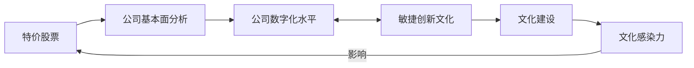

# 特价股票与公司数字化敏捷创新文化感染力的深度分析方法

> 关键词：特价股票、公司数字化、敏捷创新文化、感染力、深度分析方法

> 摘要：本文旨在探讨特价股票与公司数字化敏捷创新文化感染力之间的关联，并详细阐述对其进行深度分析的方法。通过对相关核心概念的介绍、算法原理的讲解、数学模型的构建，结合实际项目案例进行分析，明确了在不同实际应用场景下如何运用这些分析方法。同时，提供了学习、开发工具以及相关论文著作等资源推荐，最后对未来发展趋势与挑战进行总结，为投资者和企业管理者提供有价值的参考。

## 1. 背景介绍 
### 1.1 目的和范围
在当今复杂多变的金融市场和激烈的商业竞争环境中，特价股票一直是投资者关注的焦点。而公司的数字化敏捷创新文化则对企业的长期发展和竞争力起着至关重要的作用。本研究的目的在于深入分析特价股票与公司数字化敏捷创新文化感染力之间的内在联系，探索一套有效的深度分析方法，帮助投资者更准确地评估特价股票的投资价值，同时也为企业管理者提供提升公司文化感染力以促进股票价值提升的思路。研究范围涵盖了不同行业、不同规模的上市公司，以及相关的金融市场数据和企业内部文化评估指标。

### 1.2 预期读者
本文的预期读者主要包括金融投资者，他们希望通过对特价股票和公司文化的分析来优化投资决策；企业管理者，他们需要了解如何通过塑造数字化敏捷创新文化来提升公司的市场竞争力和股票价值；以及相关领域的研究人员，他们对该领域的理论和实践研究感兴趣。

### 1.3 文档结构概述
本文将按照以下结构展开：首先介绍核心概念及其联系，明确特价股票、公司数字化、敏捷创新文化和文化感染力的定义和相互关系；接着阐述核心算法原理和具体操作步骤，通过 Python 代码详细说明分析过程；然后构建数学模型和公式，并进行详细讲解和举例说明；之后通过项目实战，展示代码实际案例并进行详细解释；再探讨实际应用场景；提供工具和资源推荐；最后总结未来发展趋势与挑战，并给出常见问题与解答以及扩展阅读和参考资料。

### 1.4 术语表
#### 1.4.1 核心术语定义
- **特价股票**：指在市场上价格相对较低，可能被低估的股票。其价格低于其内在价值，可能是由于市场短期波动、行业负面消息或公司短期困境等原因导致。
- **公司数字化**：企业利用数字技术，对业务流程、组织架构、产品和服务等进行全面改造和升级，以提高运营效率、创新能力和市场竞争力的过程。
- **敏捷创新文化**：一种鼓励快速响应市场变化、勇于尝试新想法、团队协作紧密的企业文化。它强调灵活性、创新性和迭代式发展，能够使企业在快速变化的市场环境中迅速调整战略和产品。
- **文化感染力**：指公司文化对员工、客户和市场产生的影响程度。具有感染力的文化能够激发员工的工作热情和创造力，吸引客户的关注和忠诚度，提升公司在市场上的声誉和影响力。

#### 1.4.2 相关概念解释
- **数字化转型**：是公司数字化的具体实施过程，包括引入数字技术、建立数字化平台、培养数字化人才等方面，旨在实现企业的数字化升级。
- **敏捷开发**：是敏捷创新文化在软件开发领域的具体应用，强调快速迭代、客户反馈和团队协作，以提高软件开发的效率和质量。
- **股票估值**：是评估特价股票投资价值的重要方法，通过对公司的财务状况、盈利能力、行业前景等因素进行分析，确定股票的内在价值。

#### 1.4.3 缩略词列表
- **AI**：Artificial Intelligence，人工智能
- **ML**：Machine Learning，机器学习
- **ERP**：Enterprise Resource Planning，企业资源计划
- **CRM**：Customer Relationship Management，客户关系管理

## 2. 核心概念与联系 

### 核心概念原理
#### 特价股票
特价股票的出现通常是由于市场的非理性因素导致的。市场参与者的情绪波动、信息不对称等因素可能会使股票价格偏离其内在价值。例如，当一家公司发布了一份短期业绩不佳的财报时，市场可能会过度反应，导致其股票价格大幅下跌，从而形成特价股票。投资者需要通过深入分析公司的基本面，判断其股票价格是否被低估。

#### 公司数字化
公司数字化是企业适应数字经济时代的必然选择。通过数字化转型，企业可以实现业务流程的自动化、数据的实时分析和决策的智能化。例如，利用 ERP 系统可以实现企业资源的高效管理，利用 CRM 系统可以提升客户服务质量。数字化还可以促进企业的创新，通过数据分析发现新的市场机会和客户需求。

#### 敏捷创新文化
敏捷创新文化强调快速响应和持续创新。在这种文化氛围下，企业鼓励员工提出新的想法和解决方案，并且能够快速将其转化为实际产品或服务。例如，采用敏捷开发方法的软件公司可以在短时间内推出新的软件版本，满足用户的不断变化的需求。敏捷创新文化还注重团队协作和知识共享，能够提高企业的整体创新能力。

#### 文化感染力
文化感染力是公司文化的外在表现。具有感染力的文化能够吸引优秀的人才加入企业，激发员工的工作积极性和创造力。同时，它也能够影响客户的购买决策，提高客户的忠诚度。例如，一家具有创新文化的公司可能会吸引更多的年轻客户，因为他们更愿意支持具有创新精神的企业。

### 架构的文本示意图
```plaintext
特价股票 <-- 公司基本面分析 --> 公司数字化水平
                                          |
                                          | 相互促进
                                          v
                               敏捷创新文化 <-- 文化建设 --> 文化感染力
```

### Mermaid 流程图


## 3. 核心算法原理 & 具体操作步骤 

### 核心算法原理
我们可以采用机器学习算法中的回归分析来分析特价股票与公司数字化敏捷创新文化感染力之间的关系。回归分析可以通过建立自变量和因变量之间的数学模型，来预测因变量的值。在本研究中，我们将公司数字化水平、敏捷创新文化得分和文化感染力得分作为自变量，特价股票的投资回报率作为因变量。

### 具体操作步骤
#### 数据收集
收集上市公司的财务数据、数字化转型相关数据、企业文化调查问卷数据等。财务数据可以从证券交易所网站、金融数据提供商处获取；数字化转型相关数据可以通过企业的年报、新闻报道等渠道收集；企业文化调查问卷数据可以通过在线调查平台进行收集。

#### 数据预处理
对收集到的数据进行清洗、转换和标准化处理。清洗数据包括去除重复值、缺失值和异常值；转换数据包括对分类变量进行编码；标准化处理可以使不同变量的数据具有可比性。

#### 特征选择
从收集到的所有变量中选择与特价股票投资回报率相关性较高的变量作为特征。可以使用相关性分析、主成分分析等方法进行特征选择。

#### 模型训练
使用训练数据对回归模型进行训练。可以选择线性回归、岭回归、随机森林回归等模型进行训练。

#### 模型评估
使用测试数据对训练好的模型进行评估。可以使用均方误差、决定系数等指标来评估模型的性能。

### Python 源代码
```python
import pandas as pd
from sklearn.model_selection import train_test_split
from sklearn.linear_model import LinearRegression
from sklearn.metrics import mean_squared_error, r2_score

# 数据收集和预处理
data = pd.read_csv('stock_data.csv')  # 假设数据存储在 CSV 文件中
X = data.drop('investment_return', axis=1)  # 自变量
y = data['investment_return']  # 因变量

# 特征选择（这里简单选择所有特征）
# 实际应用中可以使用更复杂的特征选择方法

# 划分训练集和测试集
X_train, X_test, y_train, y_test = train_test_split(X, y, test_size=0.2, random_state=42)

# 模型训练
model = LinearRegression()
model.fit(X_train, y_train)

# 模型预测
y_pred = model.predict(X_test)

# 模型评估
mse = mean_squared_error(y_test, y_pred)
r2 = r2_score(y_test, y_pred)

print(f"均方误差: {mse}")
print(f"决定系数: {r2}")
```

## 4. 数学模型和公式 & 详细讲解 & 举例说明 

### 数学模型
我们使用线性回归模型来建立特价股票投资回报率 $y$ 与公司数字化水平 $x_1$、敏捷创新文化得分 $x_2$ 和文化感染力得分 $x_3$ 之间的关系。线性回归模型的一般形式为：

$$y = \beta_0 + \beta_1x_1 + \beta_2x_2 + \beta_3x_3 + \epsilon$$

其中，$\beta_0$ 是截距项，$\beta_1$、$\beta_2$ 和 $\beta_3$ 是回归系数，$\epsilon$ 是误差项。

### 公式详细讲解
- 截距项 $\beta_0$：表示当所有自变量都为 0 时，特价股票投资回报率的预期值。在实际应用中，它可能没有实际意义，但在数学模型中是必要的。
- 回归系数 $\beta_1$、$\beta_2$ 和 $\beta_3$：分别表示公司数字化水平、敏捷创新文化得分和文化感染力得分每增加一个单位，特价股票投资回报率的平均变化量。如果回归系数为正，说明自变量与因变量呈正相关；如果回归系数为负，说明自变量与因变量呈负相关。
- 误差项 $\epsilon$：表示模型无法解释的随机误差。它包含了未考虑到的因素、测量误差等。

### 举例说明
假设我们通过训练得到的线性回归模型为：

$$y = 0.05 + 0.1x_1 + 0.2x_2 + 0.15x_3$$

这意味着当公司数字化水平 $x_1$ 增加 1 个单位时，特价股票投资回报率 $y$ 平均增加 0.1 个单位；当敏捷创新文化得分 $x_2$ 增加 1 个单位时，特价股票投资回报率 $y$ 平均增加 0.2 个单位；当文化感染力得分 $x_3$ 增加 1 个单位时，特价股票投资回报率 $y$ 平均增加 0.15 个单位。而截距项 0.05 表示在所有自变量都为 0 时，特价股票投资回报率的预期值。

## 5. 项目实战：代码实际案例和详细解释说明 

### 5.1  开发环境搭建
#### 操作系统
可以选择 Windows、Linux 或 macOS 操作系统。这里以 Windows 10 为例进行说明。

#### Python 安装
从 Python 官方网站（https://www.python.org/downloads/）下载并安装 Python 3.7 或以上版本。安装过程中选择“Add Python to PATH”选项，以便在命令行中可以直接使用 Python 命令。

#### 开发工具
推荐使用 Anaconda 作为 Python 开发环境管理工具。Anaconda 包含了 Python 解释器、常用的科学计算库和开发工具。可以从 Anaconda 官方网站（https://www.anaconda.com/products/individual）下载并安装 Anaconda。

#### 安装必要的库
打开 Anaconda Prompt，输入以下命令安装必要的库：
```sh
pip install pandas scikit-learn
```

### 5.2  源代码详细实现和代码解读
```python
import pandas as pd
from sklearn.model_selection import train_test_split
from sklearn.linear_model import LinearRegression
from sklearn.metrics import mean_squared_error, r2_score

# 数据收集和预处理
data = pd.read_csv('stock_data.csv')  # 假设数据存储在 CSV 文件中
X = data.drop('investment_return', axis=1)  # 自变量
y = data['investment_return']  # 因变量

# 特征选择（这里简单选择所有特征）
# 实际应用中可以使用更复杂的特征选择方法

# 划分训练集和测试集
X_train, X_test, y_train, y_test = train_test_split(X, y, test_size=0.2, random_state=42)

# 模型训练
model = LinearRegression()
model.fit(X_train, y_train)

# 模型预测
y_pred = model.predict(X_test)

# 模型评估
mse = mean_squared_error(y_test, y_pred)
r2 = r2_score(y_test, y_pred)

print(f"均方误差: {mse}")
print(f"决定系数: {r2}")
```

#### 代码解读
1. **导入必要的库**：`pandas` 用于数据处理，`sklearn.model_selection` 中的 `train_test_split` 用于划分训练集和测试集，`sklearn.linear_model` 中的 `LinearRegression` 用于构建线性回归模型，`sklearn.metrics` 中的 `mean_squared_error` 和 `r2_score` 用于评估模型性能。
2. **数据收集和预处理**：使用 `pd.read_csv` 函数读取存储在 CSV 文件中的数据。将自变量存储在 `X` 中，因变量存储在 `y` 中。
3. **特征选择**：这里简单地选择了所有特征。在实际应用中，可以使用更复杂的特征选择方法，如相关性分析、主成分分析等。
4. **划分训练集和测试集**：使用 `train_test_split` 函数将数据划分为训练集和测试集，测试集占总数据的 20%。
5. **模型训练**：创建一个线性回归模型对象 `model`，并使用训练集数据对其进行训练。
6. **模型预测**：使用训练好的模型对测试集数据进行预测，得到预测结果 `y_pred`。
7. **模型评估**：使用 `mean_squared_error` 计算均方误差，使用 `r2_score` 计算决定系数，评估模型的性能。

### 5.3  代码解读与分析
- **均方误差（MSE）**：均方误差衡量了模型预测值与真实值之间的平均误差平方。MSE 值越小，说明模型的预测精度越高。
- **决定系数（R²）**：决定系数表示模型对数据的拟合程度。R² 值越接近 1，说明模型对数据的拟合效果越好；R² 值越接近 0，说明模型对数据的拟合效果越差。

通过分析 MSE 和 R² 的值，可以判断模型的性能是否满足要求。如果 MSE 较大或 R² 较小，可能需要调整模型的参数或选择其他模型进行训练。

## 6. 实际应用场景 
### 投资者决策
投资者可以使用本文介绍的分析方法来评估特价股票的投资价值。通过分析公司的数字化水平、敏捷创新文化和文化感染力，投资者可以更准确地判断特价股票是否被低估，从而做出更明智的投资决策。例如，一家具有较高数字化水平、强大敏捷创新文化和高文化感染力的公司，其特价股票可能具有更大的投资潜力。

### 企业管理者战略规划
企业管理者可以通过提升公司的数字化水平、塑造敏捷创新文化和增强文化感染力来提高公司的市场竞争力和股票价值。例如，企业可以加大在数字化转型方面的投入，引入敏捷开发方法，开展文化建设活动等。通过这些措施，企业可以吸引更多的投资者关注，提升股票价格。

### 金融机构风险评估
金融机构在进行贷款、投资等业务时，需要对企业的风险进行评估。本文介绍的分析方法可以作为金融机构评估企业风险的一个重要参考。一家具有良好数字化水平、敏捷创新文化和文化感染力的企业，其风险相对较低，金融机构可以更放心地为其提供贷款或投资。

## 7. 工具和资源推荐
### 7.1 学习资源推荐
#### 7.1.1 书籍推荐
- 《Python 数据分析实战》：本书介绍了使用 Python 进行数据分析的基本方法和技巧，包括数据处理、数据可视化、机器学习等方面的内容。
- 《机器学习实战》：通过实际案例介绍了机器学习的基本算法和应用，适合初学者学习。
- 《数字化转型：企业的必修课》：深入探讨了企业数字化转型的理论和实践，为企业管理者提供了有益的参考。

#### 7.1.2 在线课程
- Coursera 上的“机器学习”课程：由斯坦福大学教授 Andrew Ng 授课，是机器学习领域的经典课程。
- edX 上的“Python 数据科学”课程：介绍了使用 Python 进行数据科学的基本方法和工具。
- Udemy 上的“数字化转型实战”课程：通过实际案例介绍了企业数字化转型的具体方法和步骤。

#### 7.1.3 技术博客和网站
- Medium：一个技术博客平台，上面有很多关于数据分析、机器学习、数字化转型等方面的优质文章。
- Kaggle：一个数据科学竞赛平台，上面有很多公开的数据集和优秀的数据科学项目，可以学习和参考。
- 36氪：关注科技、商业等领域的最新动态，提供了很多关于企业数字化转型和创新的报道和分析。

### 7.2 开发工具框架推荐
#### 7.2.1 IDE和编辑器
- PyCharm：一款专业的 Python 集成开发环境，具有代码编辑、调试、版本控制等功能。
- Jupyter Notebook：一个交互式的开发环境，适合进行数据分析和机器学习实验。
- Visual Studio Code：一款轻量级的代码编辑器，支持多种编程语言和插件扩展。

#### 7.2.2 调试和性能分析工具
- PDB：Python 自带的调试工具，可以帮助开发者定位和解决代码中的问题。
- cProfile：Python 自带的性能分析工具，可以分析代码的运行时间和内存使用情况。
- Py-Spy：一个用于分析 Python 程序性能的工具，可以实时监控程序的运行状态。

#### 7.2.3 相关框架和库
- Pandas：用于数据处理和分析的 Python 库，提供了高效的数据结构和数据操作方法。
- NumPy：用于科学计算的 Python 库，提供了高效的数组和矩阵运算功能。
- Scikit-learn：一个机器学习库，提供了多种机器学习算法和工具，如分类、回归、聚类等。

### 7.3 相关论文著作推荐
#### 7.3.1 经典论文
- “The Digital Transformation of Business: A Review and Research Agenda”：对企业数字化转型的理论和实践进行了系统的回顾和总结。
- “Agile Software Development: Principles, Patterns, and Practices”：介绍了敏捷软件开发的原则、模式和实践方法。
- “Corporate Culture and Performance”：研究了企业文化与企业绩效之间的关系。

#### 7.3.2 最新研究成果
- 可以通过 Google Scholar、IEEE Xplore、ACM Digital Library 等学术数据库搜索关于特价股票、公司数字化、敏捷创新文化等方面的最新研究成果。

#### 7.3.3 应用案例分析
- 《数字化转型案例集》：收集了不同行业企业数字化转型的成功案例，对企业管理者有很大的借鉴意义。
- 《敏捷创新实践案例》：介绍了一些企业采用敏捷创新方法取得成功的案例。

## 8. 总结：未来发展趋势与挑战
### 未来发展趋势
- **数据驱动的决策**：随着数据技术的不断发展，投资者和企业管理者将越来越依赖数据来进行决策。通过对大量的金融数据、企业内部数据和市场数据的分析，可以更准确地评估特价股票的投资价值和企业的发展潜力。
- **人工智能与机器学习的应用**：人工智能和机器学习技术将在特价股票分析和公司文化评估中发挥越来越重要的作用。例如，使用深度学习算法可以更准确地预测股票价格走势，使用自然语言处理技术可以分析企业文化调查问卷的文本数据。
- **数字化与创新的融合**：公司的数字化转型将与敏捷创新文化更加紧密地结合在一起。数字化技术将为企业的创新提供更多的支持和工具，而敏捷创新文化将促进企业更快地适应数字化变革。

### 挑战
- **数据质量和安全**：数据的质量和安全是数据分析的基础。在收集和使用大量数据的过程中，需要确保数据的准确性、完整性和安全性。同时，还需要遵守相关的法律法规，保护用户的隐私。
- **文化变革的难度**：塑造数字化敏捷创新文化需要企业进行深刻的文化变革。这涉及到员工的观念转变、组织架构的调整和管理方式的改变，实施起来具有一定的难度。
- **技术人才的短缺**：数据分析、人工智能和机器学习等领域的技术人才短缺是当前面临的一个重要问题。企业需要加大对技术人才的培养和引进力度，以满足业务发展的需求。

## 9. 附录：常见问题与解答
### 问题 1：如何确定特价股票的内在价值？
答：确定特价股票的内在价值需要综合考虑公司的财务状况、盈利能力、行业前景等因素。可以使用基本面分析方法，如市盈率、市净率、现金流折现等模型来评估股票的内在价值。

### 问题 2：如何衡量公司的数字化水平？
答：可以从多个方面衡量公司的数字化水平，如数字化基础设施建设、数字化业务流程、数字化人才培养等。可以通过问卷调查、数据分析等方法收集相关数据，构建数字化水平评估指标体系。

### 问题 3：敏捷创新文化对企业的具体影响有哪些？
答：敏捷创新文化可以提高企业的创新能力和响应速度，使企业能够更快地推出新产品和服务，满足市场需求。同时，它还可以增强员工的工作积极性和创造力，提高团队协作效率，提升企业的整体竞争力。

### 问题 4：文化感染力如何进行量化评估？
答：可以通过设计企业文化调查问卷，从员工满意度、客户忠诚度、市场声誉等方面收集数据，构建文化感染力评估指标体系。然后使用统计分析方法对数据进行处理，得到文化感染力的量化评估结果。

## 10. 扩展阅读 & 参考资料
### 扩展阅读
- 《金融市场分析》
- 《企业文化建设与管理》
- 《数字经济时代的企业战略》

### 参考资料
- 证券交易所官方网站
- 金融数据提供商网站
- 企业年报和新闻报道

作者：AI天才研究院/AI Genius Institute & 禅与计算机程序设计艺术 /Zen And The Art of Computer Programming